# 大模型基础能力与概念

> ⬅️ [返回目录](README.md) | 下一篇：[智医同源](README2.md)

---

## 一、Agent 总览：LLM + Context 二分模型

### 1.1 核心公式

> **AI Agent = LLM × Context Engineering**

2025-2026 年主流 AI 工程框架（Anthropic / Spring AI / LangGraph）都已经从"4 大能力并列"模型升级为 **"LLM + Context"二分模型**：

- **LLM**：Agent 的大脑，提供推理、理解、生成的底层能力
- **Context Engineering**：LLM 的"输入工程"——所有进 LLM 上下文的内容，包括 Prompt、短期记忆、长期记忆、工具调用结果

这种二分模型的本质是：**LLM 的能力上限由模型决定，Agent 的能力下限由 Context 决定**。同样的 LLM（GPT-4 / Claude / Qwen）配上不同的 Context，能做出天差地别的产品。

### 1.2 全景图

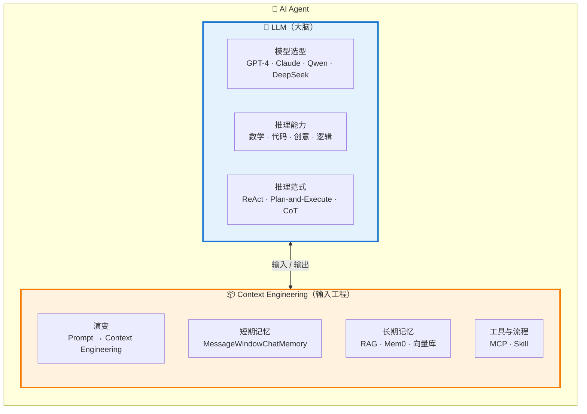

### 1.3 为什么是二分模型，不是 4 大能力并列？

| 维度 | 旧扁平模型（4 能力并列） | 新二分模型（LLM × Context） |
|------|------------------------|---------------------------|
| **抽象层级** | 4 个并列组件，缺一个就"少一味药" | LLM 是核心，Context 是 LLM 的全部输入 |
| **演进表达** | Prompt / RAG / Tool 是 3 个独立东西 | 它们都是 **Context 的子模块**（都进 LLM 上下文） |
| **行业对齐** | 2023 年教学模型 | 2025-2026 主流（Anthropic《Effective Context Engineering》） |
| **教学价值** | 易于理解但失之片面 | 揭示本质：Context 决定 Agent 的下限 |
| **演进路径** | 各自独立演进 | Prompt → Context Engineering 的统一演进史 |

> 💡 **核心洞见**：过去我们把"Prompt 工程"、"RAG"、"工具调用"当 3 件事来学，但本质上它们都是"如何给 LLM 喂更好的输入"。**Context Engineering 把它们统一成了一个学科**。

---

## 二、LLM：Agent 的大脑

### 2.1 模型选型

| 模型 | 优势 | 劣势 | 适用场景 |
|------|------|------|----------|
| **GPT-4 / GPT-4o** | 综合能力最强，多模态原生 | 成本较高，国内访问受限 | 通用 Agent / 复杂推理 |
| **Claude Sonnet 4.5 / Opus** | 长上下文（1M）、代码能力强 | 国内访问受限 | 代码 Agent / 长文档分析 |
| **Qwen / DeepSeek / GLM** | 国内访问快、成本低、中文好 | 部分场景能力略弱于 GPT-4 | 国内生产 / 私有化部署 |
| **Llama 3 / Qwen 2.5 本地** | 完全可控、零 API 成本 | 需要 GPU 资源 | 涉密场景 / 离线部署 |

> 📌 **选型原则**：先看团队技术栈（Java → Qwen/DeepSeek），再看合规要求（金融/政务 → 私有化），最后看成本（生产 → 按 token 计价）。

### 2.2 推理能力

LLM 的核心能力维度：

- **数学推理**：IMO/AMC 题、奥数证明
- **代码生成**：HumanEval、MBPP、跨语言迁移
- **创意写作**：小说、营销文案、剧本
- **逻辑推理**：多步推理、反事实分析
- **多模态理解**：图像、音频、视频（GPT-4o / Claude 3.5 Sonnet / Qwen-VL）

### 2.3 推理范式

> ⚠️ **本节是"LLM 怎么思考"，不是"LLM 喂什么"**——区别于第三章 Context Engineering。

LLM 在处理复杂任务时，需要**显式或隐式地选择推理范式**：

#### ReAct（Reason + Act）

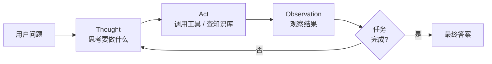

**特点**：循环迭代，适合探索性任务，灵活但难调试。

#### Plan-and-Execute

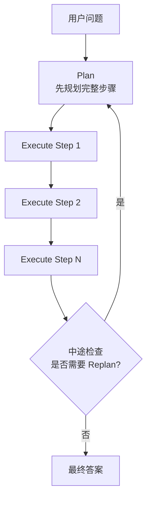

**特点**：先规划再执行，适合确定性任务流，可中途反思。

#### CoT（Chain of Thought）

通过"让我们一步步思考"等提示词触发模型展示推理过程，提升准确率。

**特点**：单轮推理增强，不涉及工具调用。

> 📌 **与 Context 的边界**：
> - **推理范式** = LLM 的"思考方式"（属于 LLM 自身能力）
> - **Context** = LLM 的"输入材料"（喂给 LLM 的内容）
>
> 两者关系：好的 Context 让 LLM 能用上正确的推理范式；推理范式选择错了，再好的 Context 也救不回来。

---

## 三、Context：Agent 的输入工程

### 3.1 演变——从 Prompt 到 Context Engineering

#### 3.1.1 Prompt Engineering 时代（2023）

单轮指令优化：

```text
请把下面这段话翻译成英文，保持专业语气：
[原文]
```

工具：提示词模板、Few-shot、CoT。

#### 3.1.2 Context Engineering 时代（2025+）

> **Context Engineering = 为 LLM 提供完成当前任务所需的全部信息**
> ——Anthropic《Effective Context Engineering for AI Agents》

Context 包含 5 大要素：

| 要素 | 作用 |
|------|------|
| **System Prompt** | 角色定义、行为规范 |
| **Tools / MCP** | 工具描述与调用结果 |
| **短期记忆** | 当前会话历史 |
| **长期记忆** | 跨会话的事实/偏好 |
| **Retrieved Knowledge（RAG）** | 与问题相关的外部知识 |

**与 Prompt Engineering 的边界**：

- **Prompt** = 一次性指令设计（"这次怎么问"）
- **Context** = 持续性的输入工程（"每次都要给 LLM 喂什么"）

#### 3.1.3 NL2SQL 提示词模板示例

一个经典的 Prompt Engineering 例子：

```text
根据 DDL 部分提供的数据库模式定义，编写一个 SQL 查询来回答 QUESTION 部分的问题。
仅生成 SELECT 查询语句。如果问题会导致 INSERT、UPDATE 或 DELETE 操作，
或者查询会以任何方式修改 DDL，请说明该操作不被支持。
如果问题无法回答，请说明 DDL 不支持回答该问题。

仅回答原始 SQL 查询；不要包含 markdown 或其他不属于查询本身的标点符号。


QUESTION
{question}

DDL
{ddl}
```

**DDL:**

```sql
create table Authors (
                         id int not null auto_increment,
                         firstName varchar(255) not null,
                         lastName varchar(255) not null,
                         primary key (id)
);

create table Publishers (
                            name varchar(255) not null
);

create table Books (
                       isbn varchar(255) not null,
                       title varchar(255) not null,
                       author_ref int not null,
                       publisher_ref int not null,
                       foreign key (author_ref) references Authors(id),
                       foreign key (publisher_ref) references Publishers(id)
);
```

**QUESTION:**

```text
Craig Walls 写过多少本书？
```

**结果:**

```text
SELECT COUNT(*) FROM Books b JOIN Authors a ON b.author_ref = a.id WHERE a.firstName = 'Craig' AND a.lastName = 'Walls';
```

### 思考

1. 承载业务处理的规范
   - 提示词模板本身就是在定义业务规则：只生成 SELECT、禁止修改操作、无法回答时明确拒绝
2. 既然已经有SQL，大模型能不能去数据库执行它，直接显示查询结果或者分析或者图表？
   - 可以，通过工具调用实现。详见 § 3.4 工具与流程
3. 所有的功能与系统都可以作为AI化场景 → AI Agent
   - 一个功能：比如通过AI对话为系统增加一个工厂信息
   - 一个业务流
   - 一个系统：用友BIP"本体智能体"，通过 Ontology 本体方法论 + 智能体，打通业务、数据与AI，实现企业级AI落地
4. 有的应用表很多，都放在提示词里会超长怎么办？
   - → 通过向量检索动态召回与问题相关的表结构，而非全量注入提示词（详见 § 3.3 长期记忆）

---

### 3.2 短期记忆（基于会话上下文）

短期记忆 = 当前会话内的多轮对话上下文。

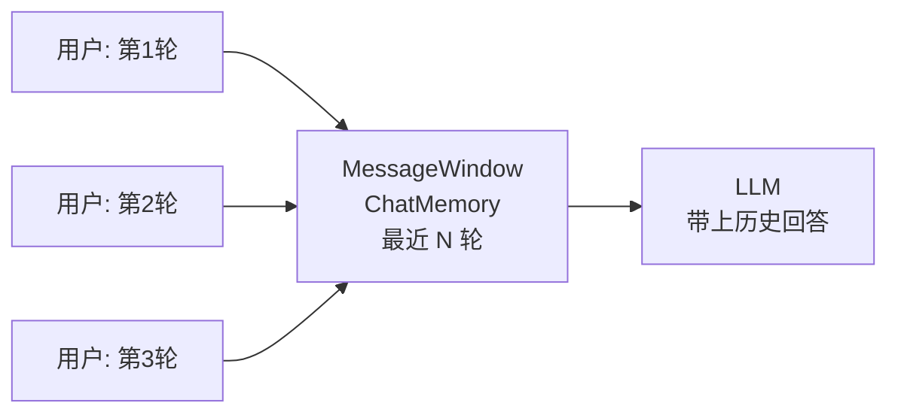

**Spring AI 实现**：

```java
ChatMemory memory = MessageWindowChatMemory.builder()
    .maxMessages(20)  // 保留最近 20 条
    .build();

ChatClient chatClient = ChatClient.builder(chatModel)
    .defaultAdvisors(new MessageChatMemoryAdvisor(memory))
    .build();
```

**LangChain 实现**：

```python
from langchain.memory import ConversationBufferWindowMemory
memory = ConversationBufferWindowMemory(k=10)
```

**实战演示**：

[演示地址](http://localhost:8080/spring/ai/chat)
> 演示基于库 [spring-ai-chat](https://gitee.com/wb04307201/spring-ai-chat) 快速搭建
> ⚠️ 需先在本地启动 demo 项目后才能访问上述地址

### 思考

1. 短期记忆的边界是什么？超过上下文窗口怎么办？
   - 滑动窗口（保留最近 N 轮）+ 摘要压缩（早期对话压缩为摘要）
2. 短期记忆和"系统提示"是什么关系？
   - 系统提示是"角色定义"（静态），短期记忆是"对话历史"（动态）

---

### 3.3 长期记忆（脱离会话的独立存储）

> 解决大模型"知识局限"与"幻觉"问题的核心方案
> 核心思路：从知识库中检索相关片段，将检索结果与原始问题拼接作为大模型的输入。

#### 3.3.1 RAG（检索增强生成）

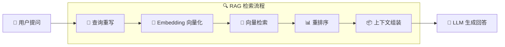

🔑 关键演进：
- **RAG 1.0**：简单向量检索 + 拼接
- **RAG 2.0**：多路召回 + 混合检索 + 查询路由
- **RAG 3.0**：Agent协同 + 多跳推理 + 自我反思

**问题：**

```text
请介绍一下启明11手机。
```

**未上传前：**

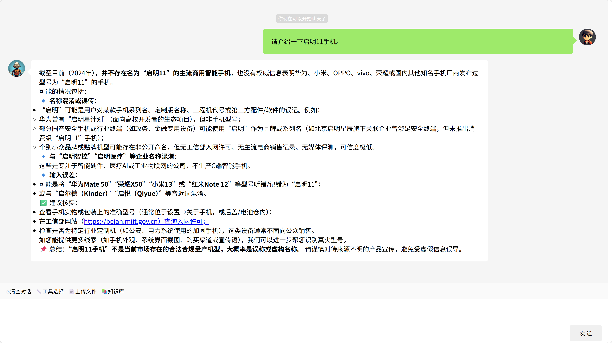

**启明11手机介绍：**[qiming11.md](qiming11.md)

[知识库](http://localhost:6333/dashboard#/collections)

**上传后：**


[知识库](http://localhost:6333/dashboard)

#### 3.3.2 Mem0 / 用户偏好记忆

Mem0 = 跨会话的用户偏好与事实记忆：

```python
from mem0 import Memory

memory = Memory()

# 存储用户偏好
memory.add("用户喜欢用简洁的代码风格", user_id="alice")

# 后续对话自动检索
context = memory.search("代码风格", user_id="alice")
```

**适用场景**：
- 跨会话的用户偏好（"我之前说过喜欢简洁风格"）
- 长期事实记忆（"用户是医生"）
- 关系网络（"用户的同事 Bob"）

#### 3.3.3 知识库 5 种技术途径（2025 演进概览）

> 本节是 RAG 之外的"地图"——在 2025 年，**RAG 已不再是默认答案**。
> 5 条技术路线的完整深度解析见 [第 16 课：大模型知识接入技术全景](../lesson16/README.md)

##### 一句话定位

1. **长 Context + Prompt Caching** — 几百份文档内的甜蜜区，零工程，缓存命中成本 -90%
2. **生产级 RAG**（Hybrid + Rerank + Contextual）— 万级文档才上重型武器
3. **Agentic Retrieval** — 代码 / 多跳推理，让 Agent 自己决定查不查、查什么
4. **结构化数据走 SQL** — 业务表别 dump 文档，让模型生成 SQL 直接查
5. **Deep Research** — 复杂研究类问题，多轮检索综合成报告（一次查询 $5–$20）

##### 决策矩阵：数据规模 × 查询模糊度

|  | 小数据（< 200 份文档） | 大数据（10K+ 份文档） |
|:--|:--|:--|
| **精确匹配**（关键词 / 代码 / 配置） | 直接问 LLM / `grep` | Agent + SQL / `grep` |
| **语义模糊**（描述 ≠ 命名） | 长 Context + Caching | 重型 RAG（Hybrid + Rerank + Contextual） |

##### 为什么 RAG 不再是默认答案？

- **长 Context 挤压 RAG 空间**：Claude Sonnet 4.5 1M tokens ≈ 75 万中文字；Gemini 1.5 Pro 2M tokens ≈ 150 万中文字——几百份文档"一口吞下"完全可行
- **基础 RAG 上线即翻车**：单向量检索在精确匹配场景失效，必须叠 Hybrid + Rerank + Contextual
- **代码与多跳场景 Agent 碾压**：传统 RAG 完成率 42% vs Agent（grep + read）89%
- **Anthropic 官方建议**：知识库 < 200K tokens（约 500 页）时，**直接塞 prompt + Prompt Caching**，比建 RAG 更省

##### 决策原则

> **先问数据规模，再问查询模糊度，最后选方案。**
> 别再"先建向量库"——80% 的项目根本不需要重型 RAG。

| 场景 | 推荐方案 |
|:--|:--|
| < 200 份文档 + 稳定 | 长 Context + Caching（别折腾） |
| 10K+ 份 + 语义模糊 | Hybrid RAG + Rerank + Contextual |
| 代码库 / 业务数据库 | Agent + grep / SQL / API |
| 尽调 / 学术综述 | Deep Research 架构 |

#### 3.3.4 长期记忆 vs 短期记忆

| 维度 | 短期记忆 | 长期记忆 |
|------|---------|---------|
| **生命周期** | 当前会话 | 跨会话 / 永久 |
| **存储** | 内存（滑动窗口） | 向量库 / 数据库 / 文件 |
| **典型技术** | `MessageWindowChatMemory` | RAG / Mem0 / 知识图谱 |
| **检索方式** | 顺序读（最新 N 轮） | 语义检索（按相关性） |
| **典型场景** | 多轮对话连贯性 | 跨会话偏好 / 知识问答 |

### 思考

1. 为什么没有全部召回？
   - 语义相似 ≠ 查询结果
   - 领域场景选择：
     - 某领域的专家级大模型
     - 通用大模型 + 某领域的专家级知识库
2. RAG 的调用时机分为：
   - **预处理阶段**：每次对话都触发
   - **运行时阶段**：运行按需触发（Agentic Retrieval）
3. 知识库按用途分为：
   - 纯知识型（事实、文档）
   - 技能型（工作流、最佳实践）

---

### 3.4 工具与流程——让 Agent 能"做事"

> Agent 的"手脚"——通过 MCP 连接外部能力，通过 Skill 封装工作流。

#### 3.4.1 MCP（Model Context Protocol）

> **"AI 应用的 USB-C 接口"** —— 标准化工具调用协议

##### MCP 架构总览

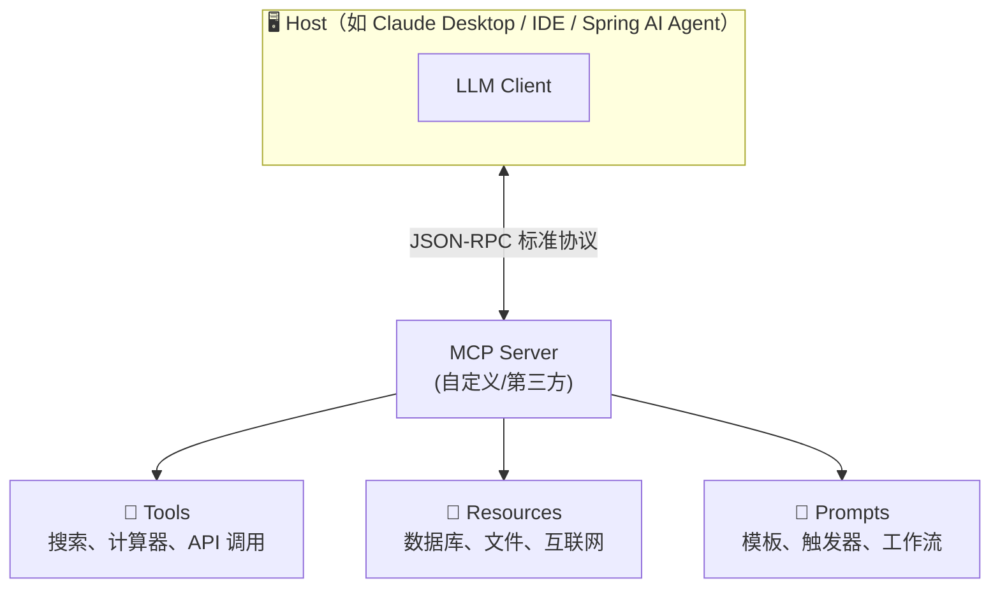

✅ MCP 核心价值：
- 🔄 **标准化**：统一工具描述（JSON Schema），避免硬编码
- 🔌 **互操作**：任何兼容 MCP 的客户端可调用任何 MCP 服务
- 🧩 **组合性**：支持工具链式调用与嵌套执行
- 🔐 **安全可控**：用户授权机制 + 工具行为审计

##### MCP 的两种连接方式（Transport）

MCP 官方定义了 **2 种 Transport**，这是 MCP Spec 级别的标准分类：

| Transport | 通信方式 | 进程关系 | 适用 |
|-----------|---------|---------|------|
| **stdio** | 标准输入/输出 | Agent 主进程 + **子进程** MCP Server | 本地工具集成 |
| **HTTP / SSE** | HTTP + Server-Sent Events | Agent 服务 ↔ **远程** MCP 服务 | 分布式部署 |

**stdio 模式架构**：

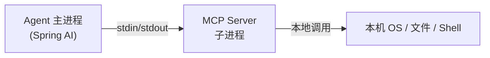

**HTTP / SSE 模式架构**：

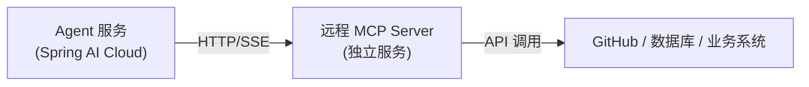

##### MCP 的两种部署形态（非官方分类，便于教学）

> ⚠️ **教学辅助分类**：以下分类是按"部署形态"做的教学分类，**不是 MCP 官方术语**，但能帮助理解使用场景。

| 部署形态 | Transport | 典型场景 | 示例 |
|---------|-----------|---------|------|
| **本地** | stdio | 操作本机资源 | 文件系统、Shell 命令、浏览器自动化 |
| **远程** | HTTP/SSE | 跨服务调用 | GitHub MCP、数据库 MCP、Slack MCP |

> 💡 **选型原则**：
> - 工具要操作"本机资源"（文件 / 命令 / GUI）→ 用 stdio + 本地 MCP
> - 工具要"跨服务调用"（调用别人的 API / 共享的中间件）→ 用 HTTP/SSE + 远程 MCP

##### MCP 演示

**提问：**

```text
现在几点了？
```

**无工具：**

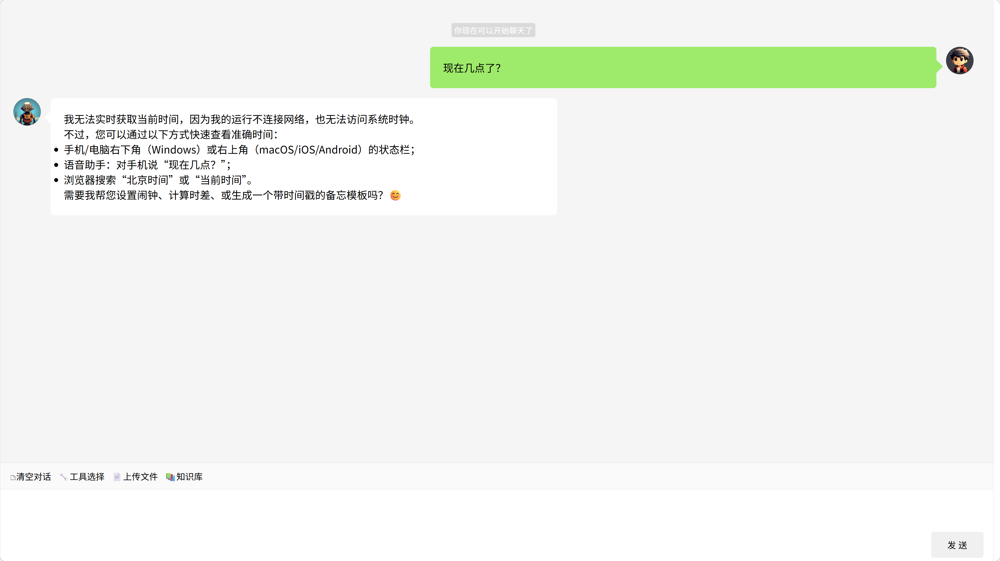

**有时间工具：**


**一个 MCP 服务至少包含一个工具，并至少配套一个技能，可以试试问问大模型：**

```text
你有哪些可以调用的工具？
```


也可以约定一个工作流，让大模型逐步执行。例如：

```text
1. 现在的时间
2. 获取`https://www.163.com/`网页内容
3. 从上一步的网页内容中随机选取获取一条新闻
4. 打开浏览器，访问`https://www.baidu.com/`地址
5. 在搜索框输入步骤3的新闻，并点击搜索
```

**结果：**

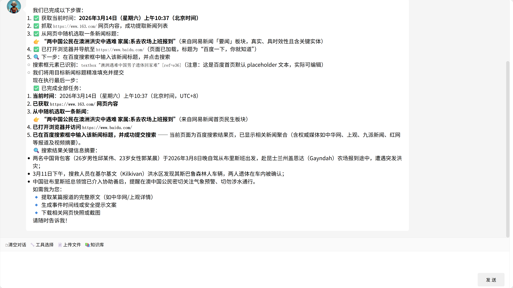


#### 3.4.2 Skill（技能书）

> 对提示词的一种封装，封装领域知识、工作流和最佳实践为可复用模块

**为什么需要 Skill？**

- 不每次都输入一大堆提示词
- 封装成熟的工作流，新对话直接复用
- 沉淀团队最佳实践，避免重复造轮子

**Skill 核心要素：**

1. **元数据** - name、description、tools
2. **触发条件** - 何时执行
3. **安全规则** - 禁止事项
4. **前置检查** - 安装/登录验证
5. **操作命令** - 用法和示例
6. **确认策略** - 风险分级处理

[百度网盘(Baidu Drive)文件管理 Skill 示例](SKILL.md)

> MCP + Skills 的生产级组合实践，详见 [README3 第五章：MCP + Skills](README3.md#五mcp--skills能力与知识的协同进化)

> Spring AI 使用 skills 可参照 [Anthropic 的 skills 部分](https://docs.spring.io/spring-ai/reference/api/chat/anthropic-chat.html#_skills)

**Skill 与长期记忆的区别：**

| 维度 | 长期记忆（RAG / Mem0） | Skill |
|------|----------------------|-------|
| **知识类型** | 陈述性（"是什么"） | 程序性（"怎么做"） |
| **存储形态** | 向量 / 文档 | Markdown / YAML 工作流模板 |
| **检索方式** | 按语义相似度 | 按触发条件匹配 |
| **典型内容** | "公司年假是 X 天" | "代码审查流程：fetch PR → 调 linter → 总结" |
| **类比** | 教科书 / 笔记 | SOP / 操作手册 |

#### 3.4.3 MCP vs Skill 对照

- **MCP 解决"能做什么"**：提供标准化工具连接能力，让 AI 安全调用数据库、API、文件等外部资源。
- **Skill 解决"怎么做"**：封装领域知识和工作流程，指导 AI 如何组合工具完成特定任务。

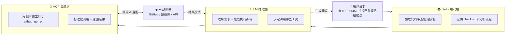

### 思考

1. 回顾提示词章节的问题："既然已经有SQL，大模型能不能去数据库执行它，直接显示查询结果或者分析或者图表？"

   现在我们有了完整的技术栈（Context Engineering + LLM + 工具调用），来看一个端到端的实现路径：

   这个流程图展示了从用户提问到最终输出的完整过程：
   - 首先通过 RAG 知识库检索相关表结构
   - 然后 LLM 理解意图、生成 SQL、分析结果
   - 最后通过 MCP 工具执行查询和生成图表

   ```mermaid
   flowchart TB
         Start["👤 用户提问<br/>繁荣工厂里有多少工位？"]

         subgraph RAGLayer["🔍 RAG 知识库检索"]
             R1["检索相关表结构<br/>（工厂表、车间表、产线表、工位表）"]
         end

         subgraph LLMLayer["🧠 LLM 推理"]
             L1["理解意图 + 组装上下文"]
             L2["生成 SQL 查询"]
             L3["分析查询结果 + 生成图表"]
         end

         subgraph MCPLayer["🔌 MCP 工具调用"]
             M1["🛠️ 执行 SQL 查询"]
             M2["🛠️ 生成图表"]
         end

         Final["📤 输出结果<br/>繁荣工厂有168个工位"]

         Start --> RAGLayer
         RAGLayer -->|"返回表结构"| L1
         L1 --> L2
         L2 -->|"SQL"| M1
         M1 -->|"查询结果"| L3
         L3 -->|"图表数据"| M2
         M2 --> Final
   ```
2. 还原论谬误/知易行难
   - `1 + 1 = 2` ≠ `E = mc²` ≠ `能制造核弹`
   - 技术探索组在后面会一起进行实现
   - 场景探索组可以找一个场景一起尝试落地

---

## 四、回顾与下一课

### 4.1 一句话总结

> **AI Agent = LLM × Context Engineering**
>
> 大模型决定上限，Context 决定下限。
> 同样的 LLM，配上不同的 Context，能做出天差地别的产品。

### 4.2 核心概念速查

| 概念 | 一句话定位 | 所属模块 |
|------|----------|---------|
| **LLM** | Agent 的大脑，提供推理能力 | LLM |
| **ReAct** | 推理 + 行动循环，适合探索性任务 | LLM 推理范式 |
| **Plan-and-Execute** | 先规划再执行，适合确定性任务 | LLM 推理范式 |
| **Context Engineering** | 为 LLM 提供完成任务的全部输入 | Context |
| **短期记忆** | 当前会话的多轮对话上下文 | Context |
| **长期记忆（RAG）** | 跨会话的事实/知识检索 | Context |
| **长期记忆（Mem0）** | 跨会话的用户偏好与事实记忆 | Context |
| **MCP** | 标准化工具调用协议（stdio / HTTP/SSE） | Context 工具与流程 |
| **Skill** | 封装的工作流 + 领域知识 | Context 工具与流程 |

### 4.3 下一课预告

[智医同源：君臣佐使思维模型](README2.md)——用中医配伍的隐喻，把 AI Agent 的组件协作讲透。

---

> ⬅️ [返回目录](README.md) | 下一篇：[智医同源](README2.md)