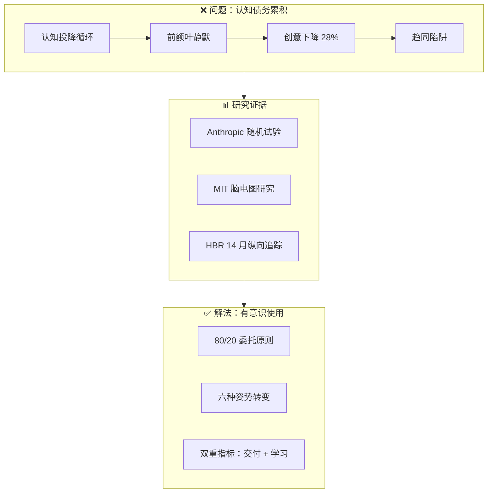

<!--
module:
  parent: ai
  slug: ai/lesson-14
  type: article
  category: 主模块子文章
  summary: 第 14 课 认知债务
-->

# 第 14 课：AI 时代的认知债务与深度工作

> **认知债务 × 脑疲劳 × 有意识使用** —— 效率上去了，思考下来了？重新审视你与 AI 的关系。

---
## 引言：变更说明

第 14 课：AI 时代的认知债务与深度工作 是 N 个 JEP / 特性 / 章节的合集。

本篇按主题归类，给出每个条目的一句话定位 + 适用版本/场景，**先扫一遍再决定读哪节**。

---

## 学习目标

学完本课后，你将能够：

- 识别"认知投降"的默认循环，理解过度依赖 AI 对个人能力和组织创新的隐性侵蚀
- 掌握三组关键研究数据（Anthropic 随机试验、MIT 脑电图、HBR 纵向研究），用证据而非直觉评估 AI 使用风险
- 区分"AI 脑疲劳"的五大高危行为模式，并对照自身使用习惯进行自检
- 应用 80/20 委托原则和六种"姿势转变"策略，在保持效率的同时保护深度思考能力
- 建立"交付 + 学习"双重指标意识，在每次 AI 协作中同时追求产出和能力成长

## 前置条件

- 前置课程：[第 13 课：基于 Spec 的 AI 驱动开发](../lesson13/README.md)
- 知识准备：具备 AI 辅助开发的实际使用经验，对 Prompt 工程有基本认知
- 推荐阅读：[第 2 课：Agent Harness 与控制论](../lesson2/README.md)（理解 Harness 工程中人类角色的定位）

## 核心概念速查

```text
AI 使用的两个极端：
  ❌ 认知投降：粘贴需求 → 接受代码 → 交付完成（学习为零）
  ✅ 有意识使用：假设先行 → 解释优先 → 审查把关 → 手动复盘

认知债务的三重来源：
  ├── 个体层面：默认的认知投降循环（Addy Osmani）
  ├── 神经层面：前额叶"静默" + 多巴胺奖励陷阱（HBR 研究）
  └── 组织层面：趋同陷阱——AI 输出是"统计平均"，差异化下降 31%
```

## 章节导航

| 章节 | 文件 | 核心问题 | 建议时长 |
|:----:|:-----|:---------|:--------:|
| 第一章 | [认知投降——工程师危机](README1.md) | 为什么"关闭任务"和"保持敏锐"是完全不同的目标？ | 30 min |
| 第二章 | [AI 脑疲劳——组织研究](README2.md) | 重度 AI 使用者的创意、决策和深度工作能力发生了什么变化？ | 30 min |
| 第三章 | [破局之道——有意识的 AI 使用](README3.md) | 如何在效率与深度思考之间找到可持续的平衡？ | 25 min |

### 推荐阅读顺序

```
第一章（工程师视角）  →  第二章（组织/研究视角）  →  第三章（实操框架）
     ↑                         ↑                          ↑
  "我"正在经历什么？      "我们"的数据说明了什么？    "我"该怎么做？
```

- **快速了解**：先读第一章 + 第三章（约 55 分钟），掌握问题和解法
- **深度研究**：通读全部三章，重点关注第二章的研究数据和神经科学解释
- **管理者**：重点阅读第三章的"团队防护策略"和"自测清单"

---

## 核心架构图



---

> 🚀 从 [第一章：认知投降——工程师危机](README1.md) 开始 | ⬅️ [返回课程总目录](../README.md)

---

⬅️ 上一课：[基于 Spec 的 AI 驱动开发](../lesson13/README.md) | ➡️ 下一课：[AI 原生组织](../lesson15/README.md)

---

← [返回 AI Agent 应用开发培训课程](../README.md)
