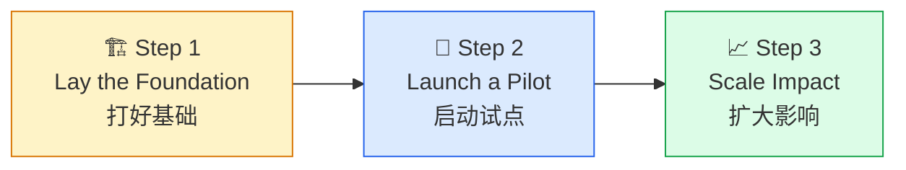

> ⬅️ [返回目录](README.md)

# 📝 企业 AI 转型指南：Anthropic 三步法（基础 → 试点 → 规模化）

> **来源**：Anthropic 官方 - *The Enterprise AI Transformation Guide*（2025-10）
> **主题**：已成立企业如何系统化推进 AI 转型
> **姊妹篇**：[第一章：创始人手册](README1.md)（初创公司视角）

---

## 🔑 核心观点

> **AI 转型不是一次性的技术升级，而是一条"基础 → 试点 → 规模化"的三阶段路径。最危险的陷阱不是 AI 不够强，而是企业还没打好基础就匆忙铺开——结果是欠下难以偿还的"AI 技术债"。**

---

## 🏛️ 一、为什么需要一份"企业版"指南

如果说 [第一章 创始人手册](README1.md) 写给"从零开始就用 AI"的初创公司，那么这份 *Enterprise AI Transformation Guide* 写给的是另一群人：

| 对比维度 | 创始人手册（初创版） | 企业转型指南（企业版） |
|:---------|:---------------------|:------------------------|
| 起点 | 从第一天起 AI Native | 已运行多年的传统业务 |
| 阻力 | 无历史包袱 | 既有流程、组织、文化 |
| 关键问题 | "怎么把产品做出来？" | "怎么在不颠覆业务的前提下变革？" |
| 失败模式 | 行动太慢 | 行动太快、铺得太开 |
| 节奏 | 4 阶段连续推进（构思→MVP→发布→规模化） | 3 步走、每步有"沉淀期"（基础→试点→规模化） |

> 💡 **Anthropic 在 2025 年分别发布这两份文档，意味着官方认为"AI 原生"已从创业话题升级为所有企业的话题。**

---

## 🧭 二、三步法总览

Anthropic 把企业 AI 转型浓缩为三个有序阶段，每一步都是下一步的**必要前提**：



### 三阶段对比

| 阶段 | 核心目标 | 关键产物 | 典型时长 | 主要风险 |
|:----:|:---------|:---------|:--------:|:---------|
| **Step 1 打基础** | 能力建设 + 文化铺垫 | AI 战略文档、数据基础设施、试点团队 | 3-6 个月 | 拖延不前、永远在"准备" |
| **Step 2 试点** | 验证价值 + 沉淀方法 | 1-3 个高价值场景、可复用的 Playbook | 3-6 个月 | 试点不收敛、跑偏成研究项目 |
| **Step 3 规模化** | 跨部门复制 + 平台化 | 内部 AI 平台、度量体系、组织变革 | 6-12 个月 | 铺得太快、局部最优侵蚀全局 |

---

## 🏗️ 三、Step 1：打好基础（Lay the Foundation）

> **"没有地基的 AI 项目是一场昂贵的实验；有了地基的 AI 项目是一项可复利的投资。"**

### 3.1 战略层：写一份能落地的 AI 战略文档

一份合格的 AI 战略文档，必须能回答**四个具体问题**：

| 问题 | 错误回答 ❌ | 正确回答 ✅ |
|:-----|:-----------|:-----------|
| **AI for 什么？** | "提升效率"、"降本增效" | "把客服首次响应时间从 4 小时缩短到 30 分钟" |
| **哪些场景优先？** | "全面铺开"、"有 AI 就要用" | "从客服和工程两个高频场景切入" |
| **怎么衡量成功？** | "看效果" | "6 个月内 NPS +10 分，工程交付周期 -30%" |
| **谁负责？** | "IT 部门牵头" | "CXO 直接挂帅，IT/业务双 Owner" |

### 3.2 数据层：清理可用的数据资产

Anthropic 在调研数百家企业后总结了一个令人清醒的事实：

> **大多数企业 AI 项目失败的原因，不是模型不够好，而是数据没有准备好。**

```
数据就绪度的四个等级：
  L0 混乱    ：数据散落在 20+ 系统中，没有统一标识
  L1 可访问  ：数据集中存储，但质量参差不齐
  L2 可理解  ：有数据目录 + 元数据 + 业务标签  ← 转型最低门槛
  L3 可治理  ：有数据血缘 + 权限 + 合规审计  ← 规模化前提
```

> ⚠️ **L0/L1 阶段强行启动 AI 项目，等于在沙地上盖楼。**

### 3.3 组织层：建立"试点突击队"

不要一上来就"全员 AI 培训"，而是先组建一支 **3-8 人** 的精锐小分队：

| 角色 | 来源 | 职责 |
|:-----|:-----|:-----|
| **业务负责人** | 一线业务部门 | 选定场景、定义成功指标 |
| **AI 工程师** | 内部工程团队 / 外包 | 模型选型、Agent 设计、Prompt 工程 |
| **领域专家** | 资深业务员工 | 提供业务知识、判断 AI 输出质量 |
| **变革经理** | 高管层授权 | 推动跨部门协调、清除组织阻力 |

> 💡 这支小分队就是 [第二章 Tom Blomfield](README2.md) 提到的"智能体循环"在企业内的第一个具象化身。

### 3.4 基础阶段的"退出标准"

满足以下 4 项，才能进入 Step 2：

- [ ] AI 战略文档已通过高管层评审
- [ ] 至少 1 个数据域达到 L2 可理解级别
- [ ] 试点突击队已组建，且拿到高管层的明确授权
- [ ] 已识别 3-5 个候选场景，并初步评估 ROI

---

## 🧪 四、Step 2：启动试点（Launch a Pilot）

> **试点的目的不是证明 AI "能用"，而是证明它在你的具体业务里"值得规模化"。**

### 4.1 选题标准：FAS 框架

Anthropic 推荐用 **FAS（Frequency × Achievability × Savings）** 评估每个候选场景：

| 维度 | 问题 | 高分场景示例 | 低分场景示例 |
|:-----|:-----|:------------|:-------------|
| **F 频次** | 这个任务多久发生一次？ | 每天 1000+ 次客服工单 | 每季度 1 次的战略复盘 |
| **A 可行性** | 用现有 AI 能力能否实现？ | 文档摘要、客服问答 | 100% 准确的财务预测 |
| **S 价值** | 自动化后能省多少 / 赚多少？ | 每通客服节省 5 分钟 | 节省 5 分钟/月 |

> **三个维度都打"高分"的场景才是真正的试点候选。** 不要被"高大上"但 FAS 全低的场景吸引。

### 4.2 试点的 4 个反模式

| 反模式 ❌ | 后果 | 正确做法 ✅ |
|:----------|:-----|:-----------|
| 一次性铺 10 个试点 | 资源分散，无一深入 | **最多 3 个**，且必须按时收敛 |
| 试点阶段就追求"完美" | 永远无法上线 | 60 分能用就先上线，再迭代 |
| 试点不写文档 | 经验无法复制 | 每个试点交付一份"复盘 + Playbook" |
| 试点不绑定业务指标 | 价值无法证明 | 每个试点绑定 1-2 个业务 KPI（如 NPS、转化率） |

### 4.3 试点阶段的"收敛信号"

| 信号 | 含义 | 行动 |
|:-----|:-----|:-----|
| 📈 业务指标持续改善 | AI 在真实场景中有效 | 准备 Step 3 规模化 |
| 📊 用户主动给出反馈 | 产品契合度提升 | 收集反馈、迭代 Prompt / 工作流 |
| 🔁 试点可被另一个团队复用 | 沉淀出方法论 | 提炼 Playbook、写培训材料 |
| 💰 ROI 模型可量化 | 商业价值可证明 | 提交规模化提案 |

---

## 📈 五、Step 3：扩大影响（Scale Impact）

> **规模化不是"复制粘贴试点"，而是"建设可被复用的平台 + 重塑组织能力"。**

### 5.1 三件必须同时发生的事

```
规模化成功的三根支柱（缺一不可）：

       🏛️ 平台（Platform）
        /                \
       /                  \
  🌱 流程               👥 人才
（Playbook 化）      （能力转移）
```

#### 🏛️ 平台：内部 AI Platform

- **统一模型接入**：避免每个业务线重复接入 Claude/OpenAI/Gemini
- **统一 Prompt 仓库**：版本管理、A/B 测试、效果对比
- **统一观测体系**：Latency / 成本 / 质量 / 安全的统一仪表盘
- **统一权限与审计**：满足合规要求（参考 [第 12 课：AI 合规](../lesson12/README.md)）

#### 🌱 流程：Playbook 化

把试点的成功经验沉淀为可复用的文档：

| 资产 | 内容 | 用途 |
|:-----|:-----|:-----|
| **场景手册** | 每个成熟场景的输入/输出/边界 | 业务部门自助启动 |
| **评估体系** | 离线评测 + 在线 A/B 框架 | 新场景上线前的质量把关 |
| **失败案例库** | 已踩过的坑、原因、解决方案 | 减少重复犯错 |

#### 👥 人才：从"突击队"到"全员能力"

- **AI 工程师**：从个位数扩张到 10-50 人
- **业务 AI 专员**：每个业务部门配 1 名"翻译"角色
- **高管层**：建立 AI Steering Committee（季度 review）
- **全员**：从"AI 培训"升级为"AI 工作流嵌入"

### 5.2 规模化的两大陷阱

| 陷阱 ❌ | 原因 | 避坑 ✅ |
|:--------|:-----|:-------|
| **铺得太快** | 业务部门都在要 AI，但平台还没准备好 | 平台先于业务铺开，平台能力是瓶颈 |
| **铺得太散** | 每个业务线都做"自己的 AI" | 强制走平台，用"集中式赋能"代替"分散式烟囱" |

---

## 🧠 六、与本课其他章节的呼应

这份企业指南不是孤立的方法论，它和本课前几章形成**完整闭环**：

| 章节 | 角色 | 与企业指南的关系 |
|:-----|:-----|:----------------|
| 第一章 创始人手册 | 创业视角 | "如果你从零开始，按 4 阶段框架走" |
| 第二章 自进化循环 | 架构愿景 | "AI 原生组织的终极形态：自进化网络" |
| 第三章 别用 AI 裁员 | 管理警示 | "AI 转型的红线：换岗 ≠ 省人" |
| **第四章 企业转型** | **落地路径** | **"对于已成立企业，按 3 步走：基础 → 试点 → 规模化"** |

> 🎯 **一句话总结**：第一章讲"出生即是 AI Native"，第二章讲"成熟形态是什么"，第三章讲"什么绝对不能做"，第四章讲"如何在不颠覆业务的前提下系统化推进"。

---

## 💡 七、给企业决策者的三条建议

1. **不要被"AI 焦虑"驱动**：很多企业铺开 AI 是因为同行在做、媒体报道铺天盖地。Anthropic 的建议是：**先写战略文档，再定试点场景，最后才铺开**。

2. **把 AI 转型当成"组织变革"而非"技术项目"**：技术只是载体，真正的难点在于让一线员工愿意用、敢用、能用。参考 [第三章 别用 AI 裁员](README3.md) 的"换岗 ≠ 省人"原则。

3. **接受"非线性回报"**：Step 1 和 Step 2 通常看不到明显 ROI，所有投入都在 Step 3 才"集中变现"。**不要在 Step 1 就要求老板看到利润**，这是大多数 AI 转型项目夭折的根本原因。

---

## 📌 核心启示

> **企业 AI 转型是一场马拉松，不是冲刺。Anthropic 用 3 步法告诉我们：先打地基（3-6 个月）、再小步试点（3-6 个月）、最后规模化（6-12 个月）。跳过基础直接铺开的代价，远比慢慢推进的代价大得多。**

---

*上一篇：[第三章：别用 AI 裁员](README3.md) | ⬅️ [返回目录](README.md)*
