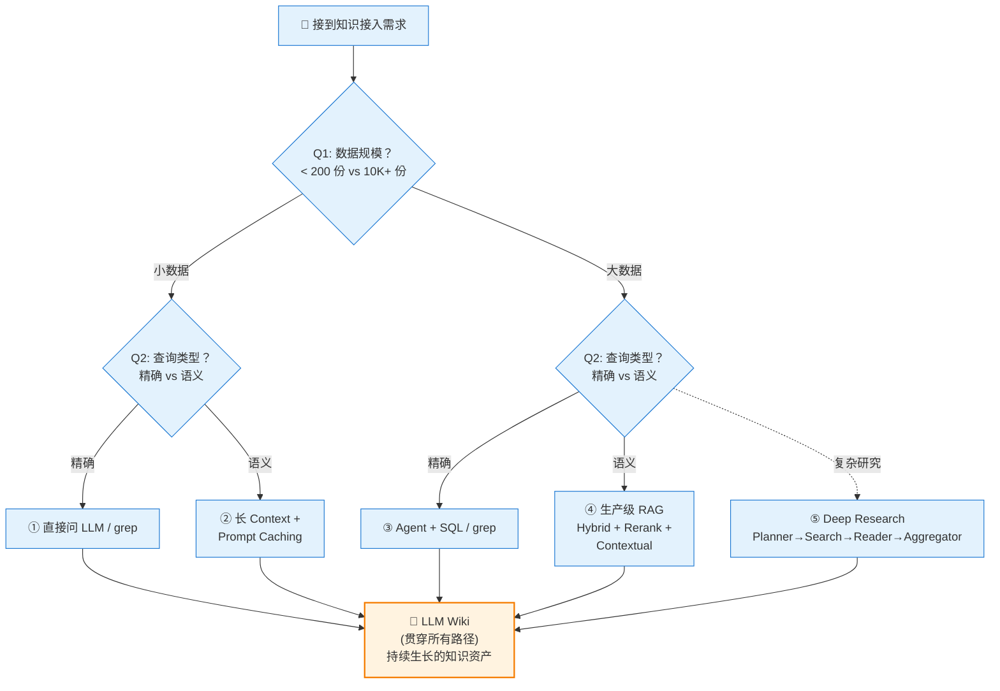

<!--
module:
  parent: ai
  slug: ai/lesson-16
  type: article
  category: 主模块子文章
  summary: 第 16 课 知识接入
-->

# 第 16 课：大模型知识接入技术全景

> **4 章 × 5 路径 × 决策框架** — 从"上 RAG"到"先想清楚再选工具"  
> **源文参考**：RAG 不再是默认答案（已整合到本课各章节）

---
## 引言：变更说明

第 16 课：大模型知识接入技术全景 是 N 个 JEP / 特性 / 章节的合集。

本篇按主题归类，给出每个条目的一句话定位 + 适用版本/场景，**先扫一遍再决定读哪节**。

---

## 学习目标

学完本课后，你将能够：

- **理解 5 条技术路线**：长 Context + Caching、生产级 RAG、Agentic Retrieval、SQL、Deep Research
- **掌握决策框架**：用"数据规模 × 查询模糊度"矩阵快速选型
- **看清 RAG 的真实定位**：从"默认答案"变为"备选方案之一"
- **掌握 LLM Wiki 模式**：用 LLM 维护持续生长的个人知识库（Karpathy 范式）
- **避坑**：理解 Eval 与数据质量为何比换 embedding 模型重要 10x

---

## 前置条件

- **前置课程**：[第 1 课：AI Agent 核心概念](../lesson1/README.md)（理解 LLM 和 RAG 的基本概念）
- **知识准备**：知道向量检索、Embedding 等基本概念即可
- **推荐阅读**：本课主线文章已整合到 [第二章 5 路径全景](README2.md) 与 [第三章 生产级 RAG 深入](README3.md)

---

## 5 路径速查表

| # | 路线 | 一句话定位 | 适用规模 | 月成本量级 | 工程量 |
|:--|:--|:--|:--|:--|:--|
| 1 | **长 Context + Caching** | 几百份文档内最甜，零工程 | < 200 份 | ~$120 | 0.5 人天 |
| 2 | **生产级 RAG** | 万级文档重型武器 | 10K+ 份 | ~$840 | 25 人天 |
| 3 | **Agentic Retrieval** | 代码/多跳任务让 Agent 自己查 | — | 中等 | 5 人天 |
| 4 | **结构化 SQL** | 业务数据别 dump 文档 | 数据库 | 低 | 2 人天 |
| 5 | **Deep Research** | 复杂研究类问题 | — | $5–$20/次 | 10 人天 |

> 🎯 **核心原则**：RAG 已经从"默认答案"退位为"工具箱里的一把刀"。选哪条路，取决于你的数据规模与查询模糊度。

---

## 章节导航

| 章节 | 文件 | 核心问题 | 建议时长 |
|:----:|:-----|:---------|:--------:|
| **第一章** | [LLM Wiki 模式](README1.md) | 如何用 LLM 构建一个会"生长"的知识库？ | 35 min |
| **第二章** | [5 路径全景](README2.md) | 5 条技术路径速览与决策矩阵 | 40 min |
| **第三章** | [生产级 RAG 深入](README3.md) | Hybrid + Rerank + Contextual 三件套 | 45 min |
| **第四章** | [决策与综合实战](README4.md) | Eval + 数据质量 + 少府智库 | 50 min |

### 推荐阅读顺序

```
第一章（持久化视角）  →  第二章（5 路径速览 + 决策矩阵）
        ↓
        第三章（生产级 RAG 深入，按需精读）
        ↓
        第四章（决策 + 实战，落到自己的项目）
```

- **时间紧张**：先读第一章 + 第二章 + 第四章前 4 节（约 90 分钟），建立全景
- **动手优先**：第三章（生产级 RAG）有最具体的工程升级路径
- **深度研究**：四章通读，重点关注第三章的 Hybrid + Rerank + Contextual 三件套

---

## 核心决策架构图



---

## 核心观点速览

> **"RAG 已经不再是默认答案了。"**

引自源文的核心判断：

1. **从默认到备选**：RAG 是工具箱里的一把刀，不是唯一答案
2. **决策前置**：先问数据规模、再问查询模糊度，最后选方案
3. **5 条路径并存**：长 Context / RAG / Agent / SQL / Deep Research 各有主场
4. **LLM Wiki 串联**：所有路径的输出，都可以沉淀为 LLM Wiki 形式的持久化知识资产
5. **Eval > 算法**：评估闭环比换 embedding 模型重要 10x；数据洗涮比算法工作多 5x 时间

---

## 补充资料

| 资料 | 说明 |
|:-----|:-----|
| 源文章已整合 | 5 路径决策矩阵与生产级 RAG 数据已并入 [第二章](README2.md)、[第三章](README3.md) |
| [Anthropic Contextual Retrieval](https://www.anthropic.com/engineering/contextual-retrieval) | Contextual Retrieval 官方论文 |
| [Anthropic Prompt Caching](https://claude.com/blog/prompt-caching) | 缓存机制与定价 |
| [Karpathy LLM Wiki](https://gist.github.com/karpathy/442a6bf555914893e9891c11519de94f) | LLM Wiki 模式原始 Gist |

---

> 🚀 从 [第一章：LLM Wiki 模式](README1.md) 开始 | ⬅️ [返回课程总目录](../README.md)

---

⬅️ 上一课：[AI 原生组织](../lesson15/README.md)

---

← [返回 AI Agent 应用开发培训课程](../README.md)
