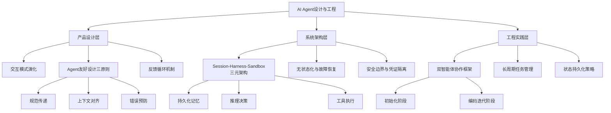

# 第 8 课：Agent 设计模式与架构

⬅️ [返回课程总目录](../README.md)

> **产品设计 × 系统架构 × 工程实践** —— 从交互设计到 Session-Harness-Sandbox 三元架构。  
> 本课系统讲解 AI Agent 的设计原则、架构模式与工程实践准则。

---
## 引言：架构困境（[AUTO] 自动生成，待人工 review）

第 8 课：Agent 设计模式与架构 的⬅️ [返回课程总目录](../README.md)

**但实际**：常被问起'这种方案我怎么选'/'大厂怎么做'。本篇用'决策困境'切入，比较几种主流路径并讲清取舍。

> 📌 本段由 `note/scripts/add-intro.py` 自动生成（场景模板 + README 摘录）。**下次 review 时请改为真实场景 + 数字 + 反思**，目前仅满足'有引言'的最低要求。

---


## 学习目标

学完本课后，你将能够：

- 理解 Agent 时代产品交互设计的三大原则与演化趋势
- 掌握 Session-Harness-Sandbox 三元架构的设计理念与实现方式
- 理解长时运行智能体的双智能体协作框架与状态持久化策略
- 将产品设计思维、架构设计与工程实践融会贯通

---

## 章节导航

| 章节 | 文件 | 核心问题 | 建议时长 |
|:----:|:-----|:---------|:--------:|
| **第一章** | [Designing for Agents — 产品设计视角](./README1.md) | 如何为 Agent 设计软件产品？ | 40 min |
| **第二章** | [规模化管理智能体架构](./README2.md) | Session-Harness-Sandbox 如何协作？ | 50 min |
| **第三章** | [长时运行智能体框架](./README3.md) | 双智能体如何完成长周期任务？ | 40 min |

---  
> **核心内容**：涵盖从产品交互设计到系统架构设计的完整知识体系

---

## 📖 目录概览

### [🔗 README1.md](./README1.md) - 《Designing for Agents》产品设计视角
- **作者**：Teddy Riker（Ramp 产品负责人）
- **核心议题**：在AI Agent时代如何设计软件产品
- **关键洞察**：
  - 80/20法则翻转：未来80%的软件交互将通过Agent完成
  - 三层交互演化：传统模式 → Agent介入 → 双智能体协作
  - 三大设计原则：教会智能体"什么叫成功"、构建反馈循环、处理上下文鸿沟

### [🔗 README2.md](./README2.md) - 规模化管理智能体架构
- **来源**：Anthropic Engineering Blog（2026年4月）
- **核心议题**：将"大脑"与"双手"解耦的系统架构设计
- **关键组件**：
  - **Session（会话）**：持久化记忆体，记录所有事件
  - **Harness（编排器）**：无状态推理决策引擎
  - **Sandbox（沙箱）**：隔离的执行环境
- **设计理念**：接口稳定、实现可替换的元编排系统

### [🔗 README3.md](./README3.md) - 长时运行智能体框架
- **来源**：Anthropic Engineering Blog（2025年11月）
- **核心议题**：跨多个上下文窗口的长周期任务执行
- **解决方案**：双智能体架构
  - **初始化智能体**：搭建基础环境、创建结构化清单
  - **编码智能体**：增量开发、Git版本控制、进度追踪
- **最佳实践**：功能清单管理、端到端测试、标准化启动流程

---

## 🎯 核心知识图谱



---

## 🔑 关键概念对照表

| 英文术语 | 中文译名 | 技术含义 | 出处 |
|---------|---------|---------|------|
| AI Agent | 智能体 | 具备感知、规划、记忆和工具使用能力的自主系统 | 全部 |
| Managed Agent | 管理智能体 | 由平台基础设施统一运维托管的智能体 | README2 |
| Harness | 编排器 | 智能体的"大脑"，负责推理决策与工具路由 | README2,3 |
| Sandbox | 沙箱 | 智能体的"双手"，负责隔离环境中执行任务 | README2 |
| Session | 会话 | 智能体的持久化记忆体，记录所有交互事件 | README2 |
| Context Gap | 上下文鸿沟 | 不同智能体间信息不对称导致的协作障碍 | README1 |
| MCP | Model Context Protocol | 模型上下文协议，用于智能体与系统交互 | README1,2 |

---

## 💡 核心洞见总结

### 1️⃣ 产品思维转变
> **"你的智能体调用者需要什么才能完成它的工作？你给了他们吗？"**

- 从"让人会用"转向"让智能体能成功"
- 主动传递规范而非假设调用方已知
- 利用Agent反馈获取更精准的产品改进信号

### 2️⃣ 架构设计哲学
> **"对接口形状有明确规范，但对背后实现保持开放"**

- 通过抽象层隔离变化，支持模型能力持续进化
- 组件解耦实现弹性扩展和故障恢复
- 凭证与执行环境严格隔离保障企业级安全

### 3️⃣ 工程实践准则
> **"借鉴人类工程师的协作实践——清晰的文档、版本控制、测试流程和交接规范"**

- 任务拆解为原子功能清单
- 状态持久化 + Git版本控制
- 增量迭代避免上下文过载
- 测试驱动确保交付质量

---

## 📊 演进时间线

```
2025.11 ──→ 长时运行智能体框架发布（README3）
            └─ 解决跨上下文窗口工作难题
            
2026.04 ──→ 规模化管理智能体架构发布（README2）
            └─ 提出Session-Harness-Sandbox三元架构
            
近期     ──→ 产品设计视角总结（README1）
            └─ 提炼Agent时代的UX设计原则
```

---

## 🚀 学习路径建议

### 初学者路径
1. **先读 README1**：理解Agent时代的产品设计思维转变
2. **再读 README3**：掌握长周期任务的工程实践方法
3. **最后读 README2**：深入系统架构层面的设计原理

### 进阶研究路径
1. **对比阅读 README2 & README3**：理解架构设计与具体实现的对应关系
2. **交叉验证**：README1的设计原则如何在README2/3的架构中落地
3. **实践应用**：基于三篇文章构建自己的Agent系统

---

## 🔗 相关资源链接

- [Teddy Riker原始推文](https://x.com/teddy_riker/status/2047312986696454584)
- [Anthropic管理智能体文档](https://www.anthropic.com/engineering/managed-agents)
- [Anthropic长时运行智能体文章](https://www.anthropic.com/engineering/effective-harnesses-for-long-running-agents)
- [Claude开发者文档](https://docs.anthropic.com)

---

## 📝 更新日志

- **2026-05-17**：创建本索引文件，整合三篇核心文章内容
- 内容覆盖：产品设计 × 系统架构 × 工程实践 三个维度

---

> 📌 **一句话总结**：本系列文章从产品交互、系统架构、工程实践三个层面，系统性地阐述了AI Agent时代的设计范式与技术实现，是构建可靠、可扩展智能体系统的完整指南。

---

⬅️ [上一课：Claude Code 工具链](../lesson7/README.md) | ➡️ [下一课：Dify 工作流引擎](../lesson9/README.md)