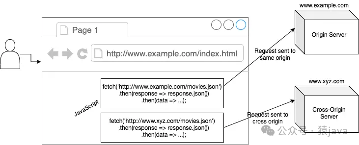
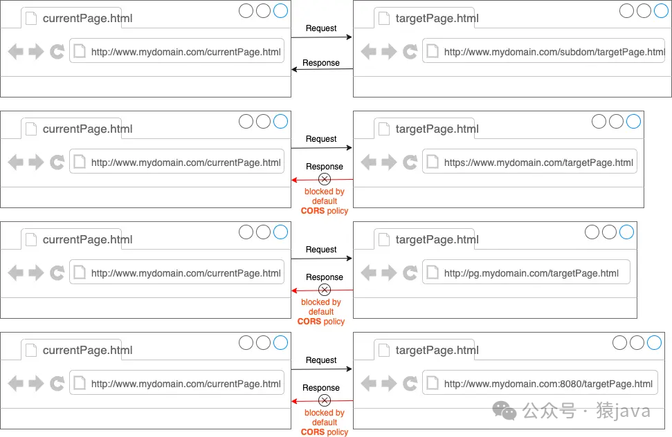

# CORS 跨域

`CORS`，全称为“跨域资源共享”（Cross-Origin Resource Sharing），是一种机制，它使用额外的`HTTP`头来告诉浏览器允许一个网页从另一个域（不同于该网页所在的域）请求资源。这样可以在服务器和客户端之间进行安全的跨域通信。

当一个网页向不同源发出请求时，`CORS`会通过以下几个步骤来处理：
- **预检请求（Preflight Request）**：对于某些类型的请求（如使用`HTTP`方法`PUT`、`DELETE`，或者请求带有非简单头部），浏览器会首先发送一个`OPTIONS`请求，这个请求称为“预检请求”。服务器收到这个请求后，会返回一个响应头部，指明实际请求是否被允许。
- **实际请求（Actual Request）**：如果预检请求通过，浏览器会继续发送实际的请求。
- **响应头部（Response Headers）**：服务器在响应中会包含一些特定的`CORS`头部，如`Access-Control-Allow-Origin`，以指示哪些域名可以访问资源。

## Origin
Origin，翻译为 源（域），在 CORS 上下文中 Origin 由三个元素组成：
```
Origin = 协议 + 域名 + 端口
```
- **协议**：例如 http:// 或 https://          
- **域名**：例如 www.yuanjava.com         
- **端口**：例如 80（默认 HTTP 端口）、443（默认 HTTPs 端口）

只有上述三个元素都匹配时，我们才会认为两个 URL 具有相同的来源，否则，有任何一个不相同都认为不同源。

## 同源策略
同源策略（Same-Origin Policy, SOP）是浏览器的一种安全机制，用于防止恶意网站通过脚本对其他网站的内容进行访问。  
所谓“同源”，是指协议、域名和端口都相同。比如，以下 URL 属于同源地址：
- https://yuanjava.com/categories 和 https://yuanjava.com/archives
- https://yuanjava.com:443 和 https://yuanjava.com:443/interview

## 跨域请求
跨域请求是指从一个域向另一个域发起的HTTP请求。  
在现代 Web 应用中，跨域请求非常常见，比如，从前端应用向不同的后端 API 服务器请求数据，或从一个 Web 服务请求另一个 Web 服务的资源，因为，同源策略默认会阻止这些请求，所以需要 CORS 机制来显式允许跨域访问。  
以下 URL 则被认为是跨域请求：
- http://yuanjava.com 和 https://yuanjava.com（协议不同）
- http://yuanjava.com 和 http://blog.yuanjava.com（域名不同）
- http://yuanjava.com:80 和 http://yuanjava.com:8080（端口不同）

CORS 流的主要参与者  


浏览器默认允许同源请求，而跨域请求则被阻止


## CORS 工作流程
CORS 通过在 HTTP(s) 请求和响应中使用特定的头部字段来实现跨域资源共享，具体来说，CORS 分为两种类型的请求处理方式：简单请求和预检请求。
- **简单请求**：对于某些简单的 HTTP 请求（如GET、POST请求且不包含自定义头部），浏览器会直接发送请求，并在响应中检查 CORS 头部。
- **预检请求**：对于复杂请求（如使用PUT、DELETE方法，或包含自定义头部），浏览器会首先发送一个OPTIONS请求，称为预检请求（Preflight Request），以确定服务器是否允许实际请求。

### 简单请求
简单请求是指满足以下条件的 HTTP 请求：
- 使用GET、POST、HEAD方法
- 请求头部仅包含以下字段：Accept、Accept-Language、Content-Language、Content-Type（且值为application/x-www-form-urlencoded、multipart/form-data或text/plain）

对于简单请求，浏览器会直接发送请求并在响应中检查以下 CORS 头部：
- **Access-Control-Allow-Origin**：指示允许访问资源的源。
- **Access-Control-Allow-Credentials**：指示是否允许发送凭据（如Cookies）。
- **ccess-Control-Expose-Headers**：指示哪些头部可以作为响应的一部分被访问。

比如：
- 客户端请求：
```text
GET /api/data HTTP/1.1
Host: www.yuanjava.com
Origin: https://yuanjava.com
```
- 服务器响应：
```text
HTTP/1.1 200 OK
Access-Control-Allow-Origin: https://yuanjava.com
Content-Type: application/json

{"message": "Hello, CORS!"}
```

### 预检请求
对于复杂请求，浏览器会首先发送一个 OPTIONS 请求，包含以下头部字段：
- **Origin**：指示请求的源。
- **Access-Control-Request-Method**：指示实际请求将使用的方法。
- **Access-Control-Request-Headers**：指示实际请求将包含的自定义头部。

服务器收到预检请求后，会返回一个响应，包含以下头部字段以指示是否允许请求：
- **Access-Control-Allow-Origin**：表明允许访问资源的源，可以是具体的源或通配符 *；
- **Access-Control-Allow-Methods**：表明允许的方法，如 GET, POST, PUT, DELETE；
- **Access-Control-Allow-Headers**：表明允许的自定义头部；
- **Access-Control-Allow-Credentials**：表明是否允许发送凭据（如 Cookies）；
- **Access-Control-Expose-Headers**：表明哪些头部可以作为响应的一部分被访问；
- **Access-Control-Max-Age**：表明预检请求的结果可以被缓存的时间，单位是秒；

如果预检请求通过，浏览器会继续发送实际请求。

比如：
- 预检请求：
```text
OPTIONS /api/data HTTP/1.1
Host: api.yuanjava.com
Origin: https://yuanjava.com
Access-Control-Request-Method: PUT
Access-Control-Request-Headers: Content-Type
```
- 预检响应：
```text
HTTP/1.1 204 No Content
Access-Control-Allow-Origin: https://yuanjava.com
Access-Control-Allow-Methods: GET, POST, PUT
Access-Control-Allow-Headers: Content-Type
Access-Control-Allow-Credentials: true
Access-Control-Max-Age: 3600
```
- 实际请求：
```text
PUT /api/data HTTP/1.1
Host: api.yuanjava.com
Origin: https://yuanjava.com
Content-Type: application/json

{"data": "example"}
```
- 实际响应：
```text
HTTP/1.1 200 OK
Access-Control-Allow-Origin: https://yuanjava.com
Content-Type: application/json

{"message": "Data updated"}
```

## 实现 CORS
### 客户端处理
客户端可以向远程服务器发送签名请求。

如下示例代码：在`CORS`请求中以`Authorization`标头的形式发送凭据：
```java
function sendAuthRequestToCrossOrigin() {
    var xhr = new XMLHttpRequest();
    xhr.onreadystatechange = function() {
        if (this.readyState == 4 && this.status == 200) {
          document.getElementById("demo").innerHTML = this.responseText;
        }
    };
    xhr.open('GET', "https://yuanjava:8000/categories", true);
    xhr.setRequestHeader('Authorization', 'Bearer rtikkjhgffw456tfdd');
    xhr.withCredentials = true;
    xhr.send();
}
```
### 服务器端处理
方法1:直接采用`SpringBoot`的注解`@CrossOrigin`

如下示例代码如下，可以把`@CrossOrigin`加在每个`Controller`上，也可以加在它们的公共父类上：
```java
@CrossOrigin
@RestController
public class TestController extends BaseController {

    //  其他逻辑
}
```

方法2:采用过滤器（filter）的方式

如下示例代码：增加一个`CORSFilter`类，并实现`Filter`接口即可。
```java
@Component
public class CORSFilter implements Filter {
 
    @Override
    public void doFilter(ServletRequest request, ServletResponse response, FilterChain chain)
            throws IOException, ServletException {
        HttpServletResponse res = (HttpServletResponse) response;
        res.addHeader("Access-Control-Allow-Credentials", "true");
        res.addHeader("Access-Control-Allow-Origin", "*");
        res.addHeader("Access-Control-Allow-Methods", "GET, POST, DELETE, PUT");
        res.addHeader("Access-Control-Allow-Headers", "Content-Type,X-CAF-Authorization-Token,sessionToken,X-TOKEN");
        if (((HttpServletRequest) request).getMethod().equals("OPTIONS")) {
            response.getWriter().println("ok");
            return;
        }
        chain.doFilter(request, response);
    }
    @Override
    public void destroy() {
    }
    @Override
    public void init(FilterConfig filterConfig) throws ServletException {
    }
}
```

方法3：配置`Configuration`

如下示例代码：增加一个配置类继承`WebMvcConfigurerAdapter`或者实现`WebMvcConfigurer`接口，项目启动时，会自动读取配置。
```java
import org.springframework.context.annotation.Configuration;
import org.springframework.web.servlet.config.annotation.CorsRegistry;
import org.springframework.web.servlet.config.annotation.WebMvcConfigurerAdapter;
@Configuration
public class CorsConfig extends WebMvcConfigurerAdapter {
    static final String ORIGINS[] = new String[]{"GET", "POST", "PUT", "DELETE"};

    @Override
    public void addCorsMappings(CorsRegistry registry) {
        registry.addMapping("/**").allowedOrigins("*").allowCredentials(true).allowedMethods(ORIGINS).maxAge(3600);
    }
}
```

另外，在服务器，可以通过设置响应头部来细粒度配置 CORS，具体的如下：
1.允许所有源访问
```text
HTTP/1.1 200 OK
Access-Control-Allow-Origin: *
```

2.允许所有源访问
```text
HTTP/1.1 200 OK
Access-Control-Allow-Origin: https://yuanjava.com
```

3.允许所有源访问
```text
HTTP/1.1 200 OK
Access-Control-Allow-Origin: https://yuanjava.com
Access-Control-Allow-Credentials: true
```

4.允许所有源访问
```text
HTTP/1.1 200 OK
Access-Control-Allow-Origin: https://yuanjava.com
Access-Control-Allow-Methods: GET, POST, PUT, DELETE
Access-Control-Allow-Headers: Content-Type, Authorization
```

5.设置预检请求的缓存时间
```text
HTTP/1.1 200 OK
Access-Control-Allow-Origin: https://yuanjava.com
Access-Control-Allow-Methods: GET, POST, PUT, DELETE
Access-Control-Allow-Headers: Content-Type, Authorization
Access-Control-Max-Age: 3600  // 3600秒
```

通常来说，在服务器解决 CORS是一种比较常见和彻底的方式，我们可以在服务器灵活的设置允许跨域访问的域名或者地址。

## 常见问题及解决方案
问题1：No 'Access-Control-Allow-Origin' header is present on the requested resource

问题描述：当浏览器发起跨域请求时，未在响应中找到 Access-Control-Allow-Origin 头部。

解决方案：确保服务器端正确设置了 Access-Control-Allow-Origin 头部。例如：
```text
HTTP/1.1 200 OK
Access-Control-Allow-Origin: https://yuanjava.com
```

问题2：The value of the 'Access-Control-Allow-Origin' header in the response must not be the wildcard '*' when the request's credentials mode is 'include'

问题描述：当请求包含凭据时，Access-Control-Allow-Origin 头部不能设置为通配符 *。

解决方案：明确指定允许的源，并确保设置了 Access-Control-Allow-Credentials 头部。例如：
```text
HTTP/1.1 200 OK
Access-Control-Allow-Origin: https://yuanjava.com
Access-Control-Allow-Credentials: true
```

问题3：CORS preflight channel did not succeed

问题描述：预检请求失败，可能是由于服务器未正确处理 OPTIONS 请求。

解决方案：确保服务器正确处理 OPTIONS 请求并返回相应的 CORS 头部。例如，在 Node.js/Express 中：
```text
app.options('/api/data', (req, res) => {
res.header('Access-Control-Allow-Origin', 'https://yuanjava.com');
res.header('Access-Control-Allow-Methods', 'GET, POST, PUT, DELETE');
res.header('Access-Control-Allow-Headers', 'Content-Type, Authorization');
res.header('Access-Control-Allow-Credentials', 'true');
res.sendStatus(204);
});
```