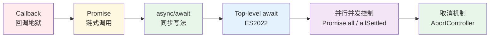

# 02 语言

> 一句话定位：**现代前端语言——JavaScript 与 TypeScript 的工程实践**

JavaScript 是浏览器唯一原生支持的编程语言，TypeScript 是当前 85%+ 新项目的默认选择。
本模块聚焦"语言本身的工程化能力"，框架无关——React/Vue/Svelte 都建立在这些基础之上。

---

## 1. 四大主题

| 主题 | 核心内容 | 学习价值 |
|------|---------|---------|
| **JavaScript 核心机制** | 原型链 / 闭包 / this 绑定 / 异步模型（Promise / async-await）/ 模块系统 | 调试诡异 bug、读懂框架源码 |
| **JavaScript ES2024-2026** | Records & Tuples（Stage 2）、装饰器（Stage 3）、Pattern Matching、Pipeline Operator | 跟进行业前沿、预判技术成熟度 |
| **TypeScript 5 工程实践** | 类型体操 / 泛型 / 条件类型 / 模板字面量类型 / 声明合并 / 编译选项 | 85%+ 新项目标配，大型项目必备 |
| **JS / TS 运行时** | Node.js / Deno / Bun 三家对比、Edge Runtime（Vercel / Cloudflare） | 部署形态与运行时深度绑定 |

---

## 2. JavaScript 异步模型演进

**当前最佳实践**：`async/await` + `AbortController` 取消 + `Promise.allSettled` 错误隔离。

---

## 3. TypeScript 类型层级

| 层级 | 表达力 | 典型用例 | 风险 |
|------|--------|---------|------|
| `any` | 无约束 | 临时逃生 | 失去类型保护，**生产禁用** |
| `unknown` | 安全顶层 | 输入校验前置 | 必须 narrowing 后使用 |
| `interface` / `type` | 静态结构 | 业务模型 | 标准做法 |
| **泛型** | 参数化类型 | 工具函数 / 容器 | 平衡抽象与可读 |
| **条件类型 / infer** | 类型级编程 | 高级工具库 | 仅必要时使用 |
| **模板字面量类型** | 字符串模式 | API 路径类型 | TS 4.1+ 可用 |

**心法**：**类型即文档 + 类型即约束**。当类型难以表达业务语义时，先考虑重构业务，再考虑类型体操。

---

## 4. ES2024-2026 新特性速查

| 特性 | 状态（2026） | 核心价值 | 落地建议 |
|------|------------|---------|---------|
| **装饰器（Decorator）** | TC39 Stage 3 | AOP 风格元编程 | TS 5+ 已支持，框架生态待统一 |
| **Records & Tuples** | Stage 2 | 不可变数据结构 | 关注中，浏览器原生支持还需 1-2 年 |
| **Pattern Matching** | Stage 2 | switch 增强 | 同上 |
| **Pipeline Operator** | Stage 2 | `x ｜> f ｜> g` 函数组合 | 关注中 |
| **Temporal API** | Stage 3 → 4 | 替代 Date | 强烈推荐新项目使用 |
| **Import Attributes** | Stage 3 | `import json from './x' with { type: 'json' }` | 已在 TS / 现代打包器可用 |

**学习建议**：优先掌握 Temporal API（解决 Date 30 年遗留问题），其他特性保持关注。

---

## 5. 三大运行时对比

| 维度 | Node.js | Deno | Bun |
|------|---------|------|-----|
| **首发** | 2009 | 2018 / 2020 1.0 | 2022 |
| **核心语言** | C++ + V8 | Rust + V8 | Zig + JavaScriptCore |
| **包管理** | npm / pnpm | 内置 + npm 兼容 | 内置（速度极快） |
| **TypeScript** | 需 ts-node / tsx | **原生支持** | **原生支持** |
| **API 兼容性** | 100%（业界标准） | Web 优先 + Node API | 100% Node 兼容 |
| **性能（HTTP）** | 中 | 中 | **快 2-3 倍** |
| **生态** | 200万+ 包 | 成长中 | 快速追赶 |
| **适用** | 通用服务端 / SSR | Edge / 安全优先 | 高性能 I/O / 工具链 |

**选型建议**：
- **企业生产**：Node.js（LTS）+ pnpm（生态稳定）
- **Edge / 云函数**：Deno（与 Cloudflare Workers 完美契合）
- **高 I/O 性能 / 工具脚本**：Bun（启动 < 50ms，安装包秒级）

---

## 6. 学习路径建议

1. **入门**（2 周）：ES2015（let/const/Promise/Class/Module） + TypeScript 基础类型
2. **进阶**（1 个月）：异步深入 + 泛型 + 类型守卫 + tsconfig 编译选项优化
3. **高级**（持续）：类型体操适度使用 + 三大运行时特性 + 新提案跟进

## 7. 本模块覆盖

| 主题 | 状态 | 说明 |
|------|------|------|
| TypeScript 工程实践 | ✓ 已有 | [typescript/](typescript/) — 泛型 / 条件类型 / 类型守卫 / tsconfig |
| JS 运行时 | ✓ 已有 | [runtime/](runtime/) — Node.js / Deno / Bun / Edge Runtime |
| JavaScript 核心机制 | 速查 | 见第 2 节（异步模型演进） |
| ES2024-2026 新特性 | 速查 | 见第 4 节 |

---

## 8. 交叉引用

- [`01-foundation/`](../01-foundation/) — 浏览器对 JS 的解析与执行
- [`03-frameworks/`](../03-frameworks/) — 所有框架都建立在 JS/TS 之上
- [`11.ai/01-fundamentals/llm-basics/`](../../../11.ai/01-fundamentals/llm-basics/) — Node.js 常作为 AI 后端运行时
- [`14.story/13-frontend-renovation.md`](../../../14.story/13-frontend-renovation.md) — 阿明前端工程化转型故事

---

## 9. 与其他模块的关系

- **上游**：[`01-foundation/`](../01-foundation/)（浏览器对 JS 的执行机制）
- **下游**：被 [`03-frameworks`](../03-frameworks/) / [`04-engineering`](../04-engineering/) / [`05-architecture`](../05-architecture/) / [`09-frontend-and-ai`](../09-frontend-and-ai/) 等模块依赖
