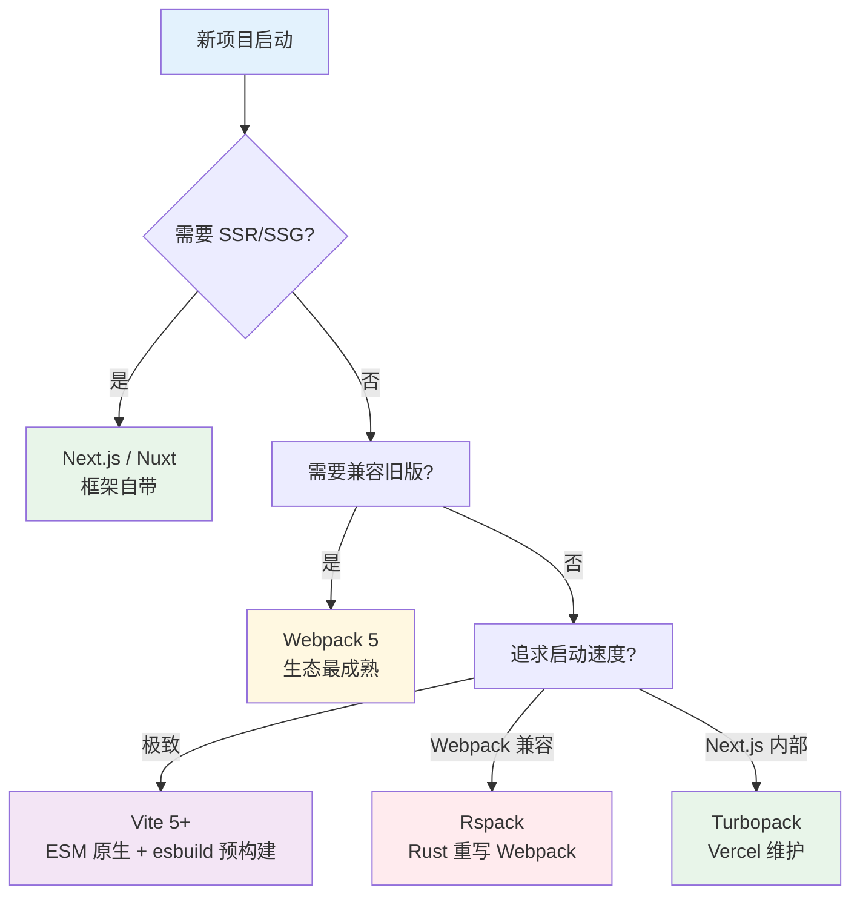

# 04 工程化

> 一句话定位：**让前端从"能跑"走向"可维护、可发布、可规模化"**

工程化解决的是"项目从 1 个页面增长到 100 个页面、10 个团队协作"时的协作 / 构建 / 测试 / 发布问题。
本模块聚焦现代前端工程化四大支柱：**构建工具 / 包管理 / Monorepo / 测试**。

---

## 1. 四大主题

| 主题 | 核心内容 | 学习价值 |
|------|---------|---------|
| **构建工具** | Vite / Webpack / Turbopack / Rspack / esbuild / Rollup | 项目启动速度与构建产物的根基 |
| **包管理** | pnpm / npm / yarn / Bun 选型与 monorepo 支持 | 依赖安全 + 磁盘效率 |
| **Monorepo 工具链** | pnpm workspaces / Nx / Turborepo | 多包协作、构建编排、依赖共享 |
| **测试与 Lint** | Vitest / Jest / Playwright + ESLint / Prettier / Biome | 质量门禁、CI 自动化 |

---

## 2. 构建工具选型决策



| 构建工具 | 启动速度 | 生产构建 | 生态成熟度 | 2026 趋势 |
|---------|---------|---------|----------|----------|
| **Vite 5+** | ⭐⭐⭐⭐⭐ 极快 | ⭐⭐⭐⭐ Rollup | ⭐⭐⭐⭐ 主流 | 使用率 78%+，满意度超 Webpack 78 分 |
| **Webpack 5** | ⭐⭐ 慢 | ⭐⭐⭐⭐⭐ | ⭐⭐⭐⭐⭐ 老牌 | 存量项目主力，迁移趋势下降 |
| **Rspack** | ⭐⭐⭐⭐ 快 | ⭐⭐⭐⭐ | ⭐⭐⭐ 成长中 | 字节 / 美团大规模采用 |
| **Turbopack** | ⭐⭐⭐⭐⭐ | ⭐⭐⭐ | ⭐⭐ 仅 Next.js | Vercel 持续投入，未来可期 |
| **esbuild** | ⭐⭐⭐⭐⭐ | ⭐⭐⭐ 库构建 | ⭐⭐⭐⭐ | Vite / Rspack 底层依赖 |
| **Rollup** | ⭐⭐⭐ | ⭐⭐⭐⭐⭐ 库首选 | ⭐⭐⭐⭐ | 库作者首选 |

**2026 共识**：新项目首选 Vite；存量 Webpack 评估迁移 Rspack；库项目 Rollup。

---

## 3. 包管理决策表

| 工具 | 磁盘效率 | 安装速度 | monorepo | 严格依赖 | 适用 |
|------|---------|---------|---------|---------|------|
| **pnpm 9+** | ⭐⭐⭐⭐⭐ 硬链接 | ⭐⭐⭐⭐⭐ | ⭐⭐⭐⭐⭐ workspaces 内置 | ✅ 防止幽灵依赖 | **首选** |
| **npm 10+** | ⭐⭐ 普通 | ⭐⭐⭐ | ⭐⭐⭐⭐ workspaces | ⚠️ 默认宽松 | 兼容老项目 |
| **yarn 4+ (Berry)** | ⭐⭐⭐⭐ PnP | ⭐⭐⭐⭐ | ⭐⭐⭐⭐⭐ workspaces | ✅ | 追求极致体验 |
| **Bun** | ⭐⭐⭐⭐ | ⭐⭐⭐⭐⭐ | ⭐⭐⭐ | ⚠️ | 高性能场景 |

**硬链接 vs PnP**：pnpm 用 `node_modules/.pnpm` 硬链接共享，磁盘最优；Yarn Berry 默认 PnP，零安装但部分工具兼容性差。

---

## 4. Monorepo 工具链对比

| 工具 | 构建编排 | 远程缓存 | 任务依赖图 | 学习曲线 | 适用 |
|------|---------|---------|----------|---------|------|
| **pnpm workspaces** | ⭐⭐ 基础 | ❌ | ❌ | ⭐⭐⭐⭐⭐ 极简 | 简单多包 |
| **Turborepo** | ⭐⭐⭐⭐⭐ | ✅ Vercel 集成 | ✅ 智能调度 | ⭐⭐⭐⭐ 简单 | 中大型 monorepo |
| **Nx** | ⭐⭐⭐⭐⭐ | ✅ Nx Cloud | ✅ 完整图 | ⭐⭐ 陡 | 大型企业级 |
| **Rush** | ⭐⭐⭐⭐ | ✅ | ⭐⭐⭐ | ⭐⭐ 陡 | 微软系 / 大型 |

**选型建议**：
- 起步：`pnpm workspaces`（已用 pnpm 就无成本）
- 中型（5-30 包）：`Turborepo`（Vercel 生态，远程缓存开箱即用）
- 大型（30+ 包）：`Nx`（完整生态 + 插件市场）

---

## 5. 测试体系决策表

| 测试层级 | 推荐工具（2026） | 速度 | 适用 |
|---------|----------------|------|------|
| **单元测试** | Vitest（首选）/ Jest | ⭐⭐⭐⭐⭐ | 函数 / 工具库 |
| **组件测试** | Vitest + Testing Library / Storybook 交互测试 | ⭐⭐⭐⭐ | UI 组件 |
| **E2E** | Playwright（首选）/ Cypress | ⭐⭐⭐ | 关键用户路径 |
| **视觉回归** | Chromatic / Percy / Playwright `toHaveScreenshot` | ⭐⭐⭐ | UI 改动回归 |
| **契约测试** | Pact | ⭐⭐⭐ | 前端 - 后端 API 契约 |

**推荐组合**：Vitest（单元 + 组件） + Playwright（E2E） + ESLint + Prettier。

---

## 6. 最小工程化闭环

```bash
# 1. 初始化 Vite 项目
npm create vite@latest my-app -- --template react-ts

# 2. 装包
cd my-app && pnpm install

# 3. 测试 + Lint 闭环
pnpm add -D vitest @testing-library/react @playwright/test eslint prettier

# 4. CI 脚本（package.json）
{
  "scripts": {
    "dev": "vite",
    "build": "tsc -b && vite build",
    "test": "vitest run",
    "e2e": "playwright test",
    "lint": "eslint . --ext ts,tsx",
    "format": "prettier --write \"src/**/*.{ts,tsx,css,md}\""
  }
}
```

---

## 7. 学习路径建议

1. **入门**（1 周）：Vite + pnpm + ESLint + Prettier 最小闭环跑通
2. **进阶**（1 个月）：Vitest 单元测试 + Playwright E2E + CI 集成
3. **高级**（持续）：monorepo 演进 + Turborepo 远程缓存 + 构建性能 profiling

## 8. 交叉引用

- [`05.tools/monorepo/`](../../../05.tools/monorepo/) — Monorepo 工具链专题（与本模块 04-engineering 互补）
- [`14.story/13-frontend-renovation.md`](../../../14.story/13-frontend-renovation.md) 第五章：前端工程化故事
- [`14.story/09-cicd-devops.md`](../../../14.story/09-cicd-devops.md) — CI/CD 与前端构建的集成

---

## 9. 与其他模块的关系

- **上游**：[`02-language`](../02-language/) / [`03-frameworks`](../03-frameworks/)
- **下游**：被 [`05-architecture`](../05-architecture/) / [`06-performance`](../06-performance/) / [`09-frontend-and-ai`](../09-frontend-and-ai/) 依赖
