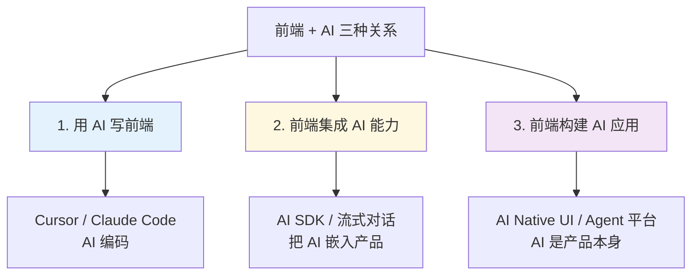

# 09 前端与 AI

> 一句话定位：**AI 时代的前端——既是 AI 能力的消费者，也是 AI 应用的构建者**

2024-2026 是前端与 AI 深度融合的爆发期。前端既是**用 AI 写代码**（Cursor / Claude Code）的受益者，也是**用 AI 能力构建产品**（AI Native UI / AI SDK）的创造者。
本模块覆盖 AI 时代前端的 5 大新形态。

---

## 1. 五大主题

| 主题 | 核心内容 | 学习价值 |
|------|---------|---------|
| **AI SDK** | Vercel AI SDK / OpenAI Node SDK / LangChain.js / Anthropic SDK | 前端集成大模型的事实标准 |
| **AI Native UI** | 流式渲染（Streaming）/ Function Calling UI / 对话组件 / 思维链展示 | AI 应用的用户体验 |
| **AI IDE 与编辑器** | Cursor / Windsurf / Claude Code / GitHub Copilot Workspace | 生产力倍增器，10x 工程师标配 |
| **Vibe Coding** | 提示工程驱动的端到端开发范式 | 2026 编程新范式 |
| **MCP / Agent 协议** | Model Context Protocol 在前端工具链的落地 | Agent 时代的"USB-C"接口 |

---

## 2. 前端与 AI 的三种关系



**关系 1（用 AI 写前端）**：开发者是用户，AI 是工具——Cursor、Claude Code、Windsurf。
**关系 2（前端集成 AI 能力）**：开发者构建产品，AI 是后端能力——客服机器人、智能助手。
**关系 3（前端构建 AI 应用）**：开发者构建 AI 原生产品，AI 是产品形态——Dify / Coze 平台、Agent IDE。

---

## 3. AI SDK 选型（关系 2）

| SDK | 优势 | 适用 | 2026 趋势 |
|-----|------|------|----------|
| **Vercel AI SDK** | React/Next 深度集成 / 流式 SSR / TypeScript 优先 | Next.js 项目首选 | ⭐⭐⭐⭐⭐ 增长最快 |
| **OpenAI Node SDK** | 官方支持 / 文档全 | 直接调用 OpenAI | ⭐⭐⭐⭐ 基础 |
| **Anthropic SDK** | Claude 官方 SDK | Claude 系列模型 | ⭐⭐⭐⭐ 增长快 |
| **LangChain.js** | Agent / RAG / 链式调用 | 复杂 AI 工作流 | ⭐⭐⭐ 抽象重 |
| **AI SDK Core** | 多模型统一接口 | 跨厂商切换 | ⭐⭐⭐⭐⭐ 趋势 |

**最佳实践**：关系 2 推荐 **Vercel AI SDK**（关系 1 用 Claude Code），统一从 Anthropic / OpenAI / Cohere 切换。

---

## 4. AI Native UI 关键模式

| 模式 | 实现要点 | 适用 |
|------|---------|------|
| **流式渲染（Streaming）** | `ReadableStream` / `useChat()` / SSE | 实时反馈、对话体验 |
| **Function Calling UI** | Tool 定义 + 状态机 + 结果可视化 | AI 调用工具的场景 |
| **思维链展示** | `<think>` 标签解析 / 折叠展开 | 增强用户信任 |
| **AI 风险提示** | 不确定性显示 / 引用源链接 / "AI 生成"标识 | 信任校准 |
| **人类反馈接口** | 点赞点踩 / 重新生成 / 人工编辑 | Eval 数据采集 |

```typescript
// Vercel AI SDK 流式对话示例
import { useChat } from 'ai/react'

export default function Chat() {
  const { messages, input, handleInputChange, handleSubmit } = useChat({
    api: '/api/chat'
  })
  return (
    <div>
      {messages.map(m => (
        <div key={m.id}>
          <strong>{m.role}:</strong> {m.content}
        </div>
      ))}
      <form onSubmit={handleSubmit}>
        <input value={input} onChange={handleInputChange} />
      </form>
    </div>
  )
}
```

---

## 5. AI IDE 与编辑器（关系 1）

| 工具 | 形态 | 核心能力 | 2026 趋势 |
|------|------|---------|----------|
| **Cursor** | VSCode Fork | 全代码库上下文 / Agent 模式 / Composer | ⭐⭐⭐⭐⭐ 主流 |
| **Claude Code** | CLI / IDE 插件 | 长任务 / MCP 集成 / 终端原生 | ⭐⭐⭐⭐⭐ Anthropic 主力 |
| **Windsurf** | 独立 IDE | Cascade 模式 / Flow 状态 | ⭐⭐⭐⭐ 快速增长 |
| **GitHub Copilot Workspace** | 云端 IDE | 任务规划 + 多文件协作 | ⭐⭐⭐ |
| **Cline / Continue** | VSCode 插件 | 开源 + 自定义模型 | ⭐⭐⭐⭐ 灵活 |

**工作流心法**：AI IDE 的工作流是"**人审 + 机做**"，把精力集中在**架构决策**而非样板代码。

---

## 6. Vibe Coding（2026 编程范式）

**定义**：用自然语言描述意图，AI 直接产出可运行代码的开发模式。

```text
传统编程：
  需求 → 详细设计 → 编码 → 调试 → 上线

Vibe Coding：
  需求（自然语言） → AI 生成 → 评审微调 → 上线
```

**核心心法**：
- **意图优先**：关注"做什么"而非"怎么做"
- **快速迭代**：1 小时出原型胜过 1 周画原型图
- **持续评审**：AI 输出 ≠ 正确，必须人工审查
- **架构把控**：AI 写实现，架构决策仍由人定

**工具组合**：Cursor Composer / Claude Code（写代码） + v0 / Bolt.new（原型） + Replit（部署）

---

## 7. MCP / Agent 协议在前端

| 协议 | 作用 | 前端落地场景 |
|------|------|------------|
| **MCP（Model Context Protocol）** | LLM 统一接入"任何工具/数据源"，N×M → N+M | Cursor / Claude Code 调用本地工具 |
| **A2A（Agent-to-Agent）** | 不同厂商 Agent 互相发现 / 通信 / 协作 | 多 Agent 前端应用 |
| **OpenAI Function Calling** | OpenAI 工具调用标准 | 简单 Function Calling UI |
| **Anthropic Tool Use** | Claude 工具调用标准 | Claude 集成 |

**MCP 在前端的 3 大落地**：
1. **AI IDE 接入**：Cursor / Claude Code 通过 MCP 调用本地工具（数据库 / API / 浏览器）
2. **前端工程化**：通过 MCP 让 AI 调 ESLint / Prettier / TypeScript 编译器
3. **AI 应用构建**：用 MCP 让最终用户的 AI 助手调你的应用 API

---

## 8. 学习路径建议

1. **入门**（1 周）：Cursor / Claude Code 上手 + 写一个 AI 对话 Demo（Vercel AI SDK）
2. **进阶**（1 个月）：Function Calling UI + 流式渲染 + 思维链展示
3. **高级**（持续）：Vibe Coding 实战 + MCP 协议集成 + Agent 平台开发

## 9. 交叉引用

- [`11.ai/01-fundamentals/llm-basics/`](../../../11.ai/01-fundamentals/llm-basics/) — LLM 基础概念
- [`11.ai/03-engineering/ai-platforms/`](../../../11.ai/03-engineering/ai-platforms/) — Dify / Coze / LangGraph AI 平台
- [`11.ai/04-architecture/bpmn-ai-integration.md`](../../../11.ai/04-architecture/bpmn-ai-integration.md) — AI + 工作流融合
- [`14.story/11-ai-learning-paradox.md`](../../../14.story/11-ai-learning-paradox.md) — AI 时代前端开发者怎么学
- [`14.story/13-frontend-renovation.md`](../../../14.story/13-frontend-renovation.md) 第五章：AI 时代前端工程化

---

## 10. 与其他模块的关系

- **上游**：[`11.ai/`](../../../11.ai/) — AI 知识体系（基础概念 / 平台 / 架构）
- **下游**：影响 [`03-frameworks`](../03-frameworks/) / [`04-engineering`](../04-engineering/) 的选型（**AI 友好度**成为新维度）
