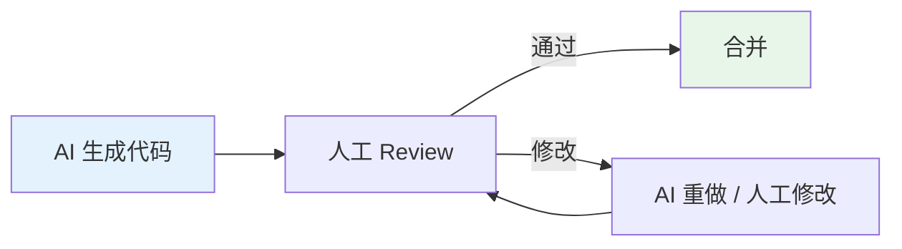

# Vibe Coding：AI 时代的编程范式

> 一句话定位：**用自然语言描述意图，AI 直接产出可运行代码 —— 2026 编程新范式**

Vibe Coding（"氛围编程"）由 Andrej Karpathy（OpenAI 联合创始人）于 2025 年提出，定义了一种"不写代码，只描述意图"的编程方式：让 AI 根据自然语言需求直接生成可运行的代码。

---

## 1. Vibe Coding 是什么

```text
传统编程：
  需求 → 详细设计 → 编码 → 调试 → 上线
  
Vibe Coding：
  需求（自然语言） → AI 生成 → 评审微调 → 上线
```

**核心理念**：
- **意图优先**：关注"做什么"，而非"怎么做"
- **快速迭代**：1 小时出原型，胜过 1 周画原型图
- **持续评审**：AI 输出 ≠ 正确，必须人工审查
- **架构把控**：AI 写实现，架构决策仍由人定

---

## 2. Vibe Coding 工具栈

| 工具 | 形态 | 适用 |
|------|------|------|
| **Cursor Composer** | IDE 内多文件协作 | 复杂重构 |
| **Claude Code** | CLI 长任务 | 大型任务 |
| **v0**（Vercel） | 描述生成 UI 组件 | shadcn/ui 组件生成 |
| **Bolt.new**（StackBlitz） | 浏览器内生成完整应用 | 快速原型 |
| **Replit Agent** | 云端 AI 编程 + 部署 | 端到端原型 |
| **Lovable / GPT Engineer** | 自然语言 → 完整应用 | 非工程师 |

---

## 3. 实战案例

### 案例 1：用 Cursor Composer 生成页面

```text
Prompt:
"Create a pricing page with 3 tiers: Free, Pro ($20/month), and Enterprise.
Use Tailwind CSS. Include feature comparison table.
Make it responsive and add dark mode support."
```

Cursor 会：
1. 生成 `Pricing.tsx` 组件
2. 创建 responsive 布局
3. 添加 dark mode variants
4. 集成到路由

### 案例 2：用 Bolt.new 构建应用

```text
Prompt:
"Build a habit tracker app. Users can add habits, check them off daily,
see streaks. Use React + Tailwind + Supabase for backend."
```

Bolt 在 5 分钟内：
1. 创建 React + Vite 项目
2. 连接 Supabase
3. 生成所有组件
4. 部署到 Netlify

---

## 4. Vibe Coding 的边界

### 适合 Vibe Coding 的场景

| 场景 | 理由 |
|------|------|
| **原型 / MVP** | 1 小时出 Demo |
| **落地页 / 营销页** | 模板化组件 |
| **内部工具** | 功能优先，代码质量次之 |
| **CRUD 应用** | 模式固定 |
| **学习新框架** | AI 当导师 |

### 不适合 Vibe Coding 的场景

| 场景 | 理由 |
|------|------|
| **核心业务逻辑** | 必须理解 |
| **安全敏感代码** | AI 可能引入漏洞 |
| **性能关键路径** | 需要深入理解 |
| **复杂架构** | AI 难以把握全局 |
| **遗留系统维护** | 上下文太复杂 |

---

## 5. Vibe Coding 的心法

### 5.1 Prompt Engineering for Code

```text
❌ Bad Prompt:
"Make a todo app"

✅ Good Prompt:
"Create a React todo app with TypeScript. Use:
- Zustand for state management
- Tailwind for styling
- Persist to localStorage
- Features: add, delete, toggle complete, filter by status
- Dark mode support
- Accessibility: keyboard navigation, ARIA labels"
```

### 5.2 评审 AI 代码

**必须检查**：
- [ ] 类型安全（TS 严格模式）
- [ ] 错误处理（边界情况）
- [ ] 安全性（XSS / 注入）
- [ ] 性能（不必要的重渲染）
- [ ] 可访问性（ARIA、键盘导航）

### 5.3 渐进式接管

1. **AI 生成 80%**：快速搭建骨架
2. **人工优化 15%**：修复 AI 错误
3. **手工实现 5%**：核心逻辑人工写

---

## 6. AI IDE 工作流对比

| 工具 | 上下文能力 | 适用 | 2026 趋势 |
|------|----------|------|----------|
| **Cursor** | ⭐⭐⭐⭐⭐ 全代码库 | 复杂项目 | 主流 |
| **Claude Code** | ⭐⭐⭐⭐⭐ 长任务 | 大型任务 | Anthropic 主力 |
| **Windsurf** | ⭐⭐⭐⭐ Cascade 模式 | 复杂重构 | 快速增长 |
| **GitHub Copilot** | ⭐⭐⭐ | 代码补全 | 集成到 VS Code |
| **Cline / Continue** | ⭐⭐⭐⭐ 开源 | 自定义模型 | 灵活 |

---

## 7. 团队实践

### 7.1 AI 友好代码库

**让 AI 更好理解你的代码**：
- ✅ 清晰的命名
- ✅ 完整的类型
- ✅ 详细的注释
- ✅ 一致的代码风格
- ✅ 完整的测试
- ✅ CLAUDE.md / .cursorrules 等配置

### 7.2 代码审查流程



### 7.3 AI 使用的安全边界

| 规则 | 说明 |
|------|------|
| **AI 不碰生产数据库** | 必须人工审查 |
| **AI 不直接部署** | CI/CD 流程把关 |
| **AI 不写安全代码** | 认证、授权、加密人工写 |
| **AI 输出必测试** | 没有测试 = 不可信 |

---

## 8. Vibe Coding 的行业影响

### 8.1 对开发者的影响

| 影响 | 说明 |
|------|------|
| **生产力 10x** | 简单任务提速巨大 |
| **门槛降低** | 非工程师可以"写代码" |
| **技能转移** | 从"写代码"到"审代码" |
| **架构重要性上升** | AI 写实现，人做架构 |
| **学习速度加快** | AI 当导师 |

### 8.2 2026 行业趋势

1. **Vibe Coding 成为默认**：50%+ 新代码由 AI 生成
2. **AI IDE 成主流开发工具**：Cursor / Claude Code / Windsurf
3. **自然语言成"新编程语言"**：需求描述能力 = 编程能力
4. **评审 > 实现**：代码审查能力比写代码更重要
5. **架构师价值上升**：AI 写实现，人做决策

---

## 9. 学习路径

1. **入门**（1 天）：Cursor Composer / Claude Code 跑通一个 Demo
2. **进阶**（1 周）：复杂项目实践；学会写好 Prompt
3. **高级**（持续）：AI 友好代码库设计；团队流程优化

## 10. 交叉引用

- [`09-frontend-and-ai/`](../) — 前端与 AI 总览
- [`09-frontend-and-ai/ai-sdk/`](../ai-sdk/) — 集成 AI 到产品
- [`11.ai/`](../../../../11.ai/) — AI 知识体系
- [`14.story/11-ai-learning-paradox.md`](../../../../14.story/11-ai-learning-paradox.md) — AI 时代怎么学

---

## 11. 与其他模块的关系

- **上游**：[`11.ai/`](../../../../11.ai/)（AI 基础）
- **下游**：影响 [`03-frameworks/`](../../03-frameworks/) / [`04-engineering/`](../../04-engineering/) 的选型（AI 友好度成新维度）
