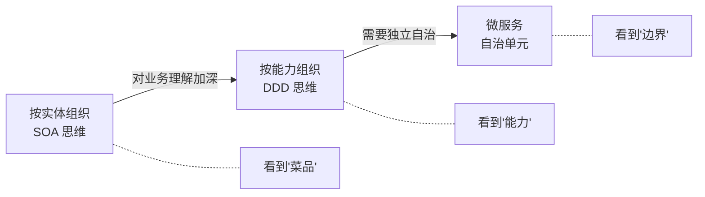
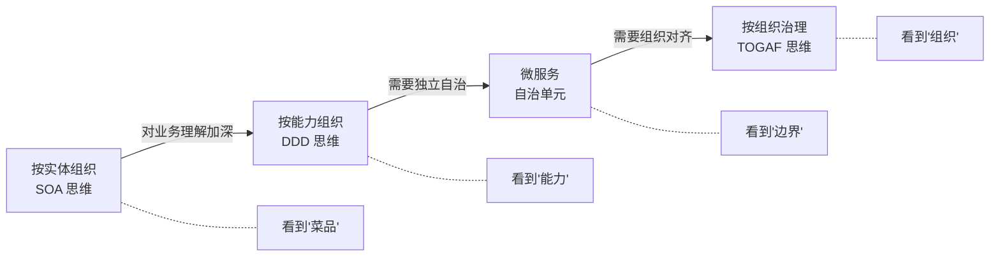
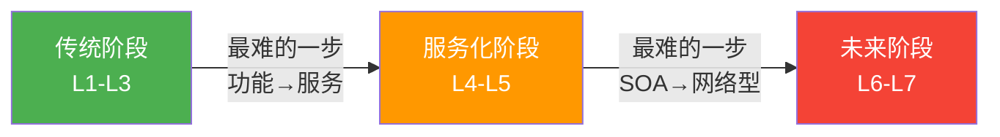
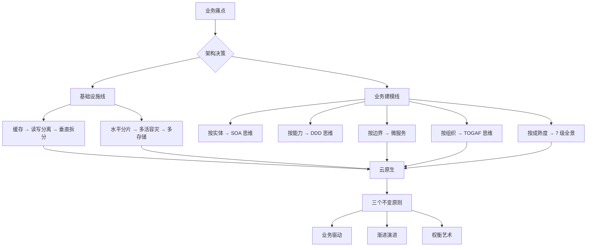

<!--
story:
  number: 02
  type: 前传
  position: 前传
  title: 架构是"长"出来的
  audience: 工程师 / 架构师
-->

# 02 · 架构是"长"出来的

> 从阿明面馆的十年，看业务驱动下的系统演进与权衡

> **系列定位**：本篇是「阿明餐厅」系列的**前传**。讲述阿明从一间城中村小面馆，一步步走到支撑千万并发的智能餐饮平台。每一章都是一次真实的架构决策 —— 被业务逼出来的，不是提前设计好的。续集[《当餐厅长出大脑》](./01-ai-agent-architecture.md)讲的是阿明在此基础上接入 AI Agent 的故事。

---

## 引言：为什么用餐厅讲架构？

技术概念抽象难懂，但"开餐厅"人人都能理解。
今天，我们跟着阿明，从一间小厨房，走到支撑千万并发的智能餐饮平台，用一碗面的旅程，看懂架构的完整演进。

架构不是炫技，而是"生意大了，怎么让系统不崩"。

---

## 第一章：小本经营，一人一锅 —— 单机小本，简单即正义

阿明在城中村开了家"明记面馆"。

每天 30 碗面，阿明自己：接单、煮面、收银、收拾。所有订单记在一个小本本上。

```text
订单本（单机 MySQL）
  桌号：1-10
  菜品：牛肉面 / 素面 / 加蛋
  状态：待做 / 进行中 / 已完成
```

优点：流程短、响应快、零沟通成本。
风险：阿明生病 = 停业；本子丢了 = 数据全丢。

业务初期，"简单"就是最高级的设计。别为了"可能的大流量"提前搞复杂架构。

---

## 第二章：排队太长，引入"预审员" —— 门口摆菜单，拦住六成问路客

半年后，"明记"火了，饭点排队 1 小时。
顾客抱怨："就问个今天有啥菜，也要等阿明放下锅铲？"

引入缓存层，等于门口放菜单 + 迎宾员。

```text
请求分流：
  查菜单 / 问价格 / 看等位 --> 迎宾员回答（Redis 缓存）
  下单 / 改需求 / 退菜    --> 阿明处理（MySQL 主库）
```

效果：60% 的咨询被拦截，阿明专注煮面，出餐速度提升。

### 缓存一致性的第一课

但新问题出现了：菜单改了，迎宾员不知道，顾客拿到的是旧菜单。

阿明需要选择**缓存更新策略**：

| 策略 | 做法 | 适合场景 |
|------|------|----------|
| Cache Aside | 先更新数据库，再删除缓存 | 读多写少（菜单更新频率低） |
| Write Through | 写入时同时更新缓存和数据库 | 数据一致性要求高 |
| Write Behind | 先更新缓存，异步写数据库 | 写多读少，可容忍短暂丢失 |

明记面馆选了 Cache Aside —— 菜单更新不频繁，删缓存后下次查询自动重建，简单够用。

缓存是性能优化的第一道防线，但"数据一致性"需要精心设计。这就是架构的本质：**用复杂度换性能，再用更多的复杂度管理这个复杂度**。

---

## 第三章：点单和做饭打架，分工！ —— 前厅接单后厨炒菜，各司其职

生意继续火，新问题：

- 顾客不断点单（写操作）
- 阿明既要接单又要煮面（读写冲突）
- 效率反而下降，顾客等更久

**读写分离** = 前厅 + 后厨分工。

```text
面馆动线改造：
  前厅（从库）：专职接单、查单、结账 --> 只读
  后厨（主库）：专职煮面、出餐     --> 只写
  传菜员（同步机制）：前厅订单 --> 后厨，实时同步
```

效果：专业的人做专业的事，并发处理能力提升。

但有个微妙的代价：刚下的单，前厅立刻查可能查不到 —— 因为主从同步需要时间。业务需要接受"秒级延迟"，技术上叫**最终一致性（Eventual Consistency）**：数据不会永远不一致，但在极短的时间窗口内，读到的可能是旧数据。

对明记面馆来说，这完全可以接受 —— 顾客下单后不会立刻去查订单状态，等几秒毫无影响。但如果是支付场景，就不能接受这种延迟了。

读写分离就是这样：分得越细，衔接越复杂。分离带来效率，也带来一致性成本。架构设计本质是"用复杂度换性能"。

---

## 第四章：业务扩张，按品类拆分 —— 面馆饮品小吃，各立门户各管各的库

阿明开始卖奶茶、小吃、快餐。
问题：点奶茶的堵住了买面的通道，系统耦合严重。

**垂直拆分** = 按业务线独立运营。

```text
明记餐饮集团：
  面食事业部 --> 独立厨房 + 订单系统（面库）
  饮品事业部 --> 独立吧台 + 库存系统（饮库）
  外卖事业部 --> 独立调度 + 配送系统（配送库）
```

效果：各业务线独立迭代，互不影响。

但新难题来了：顾客想"面 + 奶茶 + 小吃"一起下单，需要"订单中心"来聚合多条业务线的数据。拆得越细，"合"的逻辑越复杂。

康威定律在这里完美再现（详见[《从厨师到 CEO》第一章](./07-from-chef-to-ceo.md)）—— 系统架构反映组织分工。业务拆了，系统才能拆；业务没拆，强行拆系统只会制造更多沟通成本。DDD 本质上就是用更深的业务理解来画出正确的拆分边界。

---

## 第五章：订单爆炸，分区域管理 —— 千万订单按城分账，分治治规模

外卖业务爆发，单月订单破千万。
"订单表"查一次要 10 秒，对账对到怀疑人生。

**水平分片** = 按区域 / 时间拆分数据。

```text
拆分策略：
  按城市哈希：北京订单 --> 库 BJ，上海 --> 库 SH
  按时间归档：2024 年订单 --> 表_2024，历史数据冷存储
  热点隔离：爆款套餐单独分表，避免拖慢整体
```

效果：单库压力下降，查询响应回归毫秒级。

### 分片之后，"合"的代价

水平分片解决了单库性能问题，但引入了三个新挑战：

- **跨片查询**：用户想查"我在所有城市的订单"，需要聚合多个分片的数据
- **全局统计**：月度报表要跨所有分片汇总，不能直接 `COUNT(*)`
- **分布式事务**：一笔跨城市的订单，涉及两个分片的写入，如何保证要么全成功、要么全失败？

对于分布式事务，阿明调研了三种方案：

| 方案 | 原理 | 代价 |
|------|------|------|
| 2PC（两阶段提交） | 先预提交，再统一提交 / 回滚 | 同步阻塞，性能差 |
| Saga | 每步操作都有补偿操作，失败时逆向回滚 | 实现复杂，中间状态可见 |
| TCC（Try-Confirm-Cancel） | 预留资源 → 确认 → 取消 | 业务侵入性强，需要写三套逻辑 |

明记选了 Saga —— 外卖订单的补偿逻辑相对清晰（取消订单 → 退款 → 释放库存），比 2PC 性能好，比 TCC 实现成本低。

Saga 的补偿机制就像多米诺骨牌的反向推倒：如果一笔跨城市的订单在最后一步"配送"失败了，系统会按相反顺序依次执行"取消订单 → 退款 → 释放 A 城库存 → 释放 B 城库存"，每一步都有对应的"撤销操作"。

分治是应对规模的终极方案，但"分"得越细，"合"的逻辑越复杂。

---

## 第六章：单店风险，多店容灾 —— 一停电动全城？多店互备不倒

一场停电，阿明的总店停业 3 小时，损失惨重。
顾客抱怨："怎么你家一停电，全城都点不了？"

**集群部署 + 多地多活** = 中央厨房 + 区域分店。

```text
容灾架构：
  中央厨房（主中心）：日常流量 70%，核心配方管理
  区域分店（备中心）：实时同步菜单，故障时自动接管
  云厨房（灾备）：纯外卖模式，极端情况保底运营
```

效果：单点故障不再致命，可用性从 99% 提升到 99.99%。

这个数字看着小，换算成实际影响：99% 意味着全年停机约 3.65 天，99.99% 意味着全年停机约 52 分钟。对于日均流水几十万的餐饮平台，这 3 天的差距就是几十万的损失。

需要区分两个层面：这里的 99.99% 是**容灾切换层面**的可用性 —— 单店宕机时，备中心能在秒级接管。而端到端的**系统 SLO**（从用户请求到完整响应，涵盖网络、服务、数据库、支付等全链路）目标为 99.95%（详见[《厨房装监控》第六章](./05-observability.md)）。容灾可用性高，不代表端到端 SLO 也能达到 99.99% —— 中间还隔着网络抖动、服务超时、第三方依赖等不可控因素。

新挑战：口味一致性（不同分店做出来的味道要一样）、库存同步（总店和分店的库存数据要实时对齐）、成本管控（多一套系统就多一份运维费用）。

高可用不是"多买几台服务器"，而是对业务连续性的系统性保障。

---

## 第七章：专业存储，各取所需 —— 什么菜配什么碗，场景选存储

业务越来越杂，一种存储已经扛不住所有场景：

- 菜品图片（大文件）
- 用户评价（海量文本）
- 搜索"附近辣味面"（地理位置 + 模糊匹配）
- 秒杀"1 元奶茶"（超高并发）

阿明不再追求"一个数据库打天下"，而是让专业工具干专业活：

| 业务场景 | 存储方案 | 为什么选它 |
|----------|----------|-----------|
| 订单 / 支付 | MySQL | 强一致、事务保障 |
| 菜品详情 | MongoDB | 灵活结构、读写高效（参见《从厨师到 CEO》技术雷达 —— 该选型属于"特殊场景"例外） |
| 用户行为日志 | Kafka + ClickHouse | Kafka 做高吞吐写入（也是[消息队列削峰](./20-realtime-eventdriven.md)的标配），ClickHouse 做实时分析 |
| 附近推荐 | Elasticsearch（内置 Geo 查询） | 内置地理位置查询 + 全文检索 |
| 秒杀库存 | Redis + Lua 脚本 | 内存操作、原子扣减 |
| 菜品图片 | OSS + CDN | 静态资源加速、弹性扩容 |

每种数据用最适合的"容器"，整体效能最大化。

但这意味着运维团队要同时管理 6 种存储系统，技术栈碎片化带来的学习成本和运维压力是真实存在的。阿明的原则是：**只有当单一存储确实成为瓶颈时才引入新存储，每引入一种都要回答"为什么现有的不够用"。**

没有"银弹"数据库，只有"场景匹配"的技术选型。

---

## 第八章：从"管菜品"到"管能力" —— 从管东西到管能力，认知升三级

基础设施拆完了，阿明回头一看业务代码 —— 还是一团乱麻。

十年积累的业务逻辑全耦合在一个大系统里：改一个供应商报价，要改 20 个菜品的成本计算；加一道新菜，采购、切配、烹饪、出品四个模块全要动。系统能跑，但"改不动"。

阿明问老搭档："我们的系统到底该怎么组织？按菜品？按流程？按部门？"

老搭档说："这取决于你对业务的理解有多深。"

### 第一阶段：按"菜品"组织 —— 实体思维

阿明最初的组织方式很直觉：以菜品为中心。

```text
牛肉面"对象"：
  创建：录入新菜品（采购清单 + 配方 + 定价）
  查询：顾客看菜单、后台查库存
  修改：换供应商、改价格、调配方
  删除：下架菜品
```

每道菜就是一个"实体"，有完整的增删改查（CRUD）。这种方式简单直接，就像面向对象的思维方式 —— 一个对象管所有属性和行为。

在 SOA（面向服务的架构）时代，很多团队也是这样拆的：订单服务、用户服务、菜品服务 —— 每个服务围绕一个业务实体，提供 CRUD 接口。

| 优点 | 缺点 |
|------|------|
| 直观，容易理解 | 改一个供应商，20 个菜品全要动 |
| CRUD 接口标准化 | 没有清晰的职责边界 |
| 初期开发快 | 规模一大，耦合爆炸 |

问题出在哪？**"牛肉面"不是一个原子操作，而是一系列业务能力的组合。** 采购牛肉面食材、切配食材、烹饪出餐、装盘出品、质量检验 —— 这些是五个不同的业务能力，硬塞在一个"菜品服务"里，就像让阿明一个人干所有活。

### 第二阶段：按"能力"组织 —— DDD 思维

阿明想明白了：不该问"我有哪些菜品"，而该问"我的厨房有哪些业务能力"。

```text
厨房的五大业务能力（限界上下文）：
  采购域：供应商管理、价格谈判、到货验收
  切配域：食材预处理、份量标准化、库存管理
  烹饪域：火候控制、调味配比、出餐节奏
  出品域：装盘、质检、传菜调度
  经营域：定价、促销、成本核算、报表
```

这就是**领域驱动设计（Domain-Driven Design, DDD）** 的核心思想：不按"实体"拆系统，而按**业务能力**拆系统。每个能力是一个独立的**限界上下文（Bounded Context）**，有自己的规则、数据和事件。

### 限界上下文、聚合与领域事件

DDD 有三个核心概念，阿明用厨房的比喻理解得特别透：

| DDD 概念 | 厨房类比 | 技术含义 |
|----------|----------|----------|
| **限界上下文** | 厨房的五个功能区，各有各的规则 | 一个明确边界的业务域，内部模型自洽 |
| **聚合根（Aggregate Root）** | 出品质检 —— 所有变更都要经过它 | 保证业务一致性的入口对象 |
| **领域事件（Domain Event）** | "牛肉面已出品"通知前厅取餐 | 某个业务动作发生后发出的异步通知 |

关键洞察：**聚合根决定了"什么必须一起变"。** 比如"牛肉面"涉及采购域的供应商、切配域的备料量、烹饪域的配方 —— 这三个可以独立变化，但"出品"必须通过质检（聚合根），确保一致性。

```python
# 领域事件驱动的异步协作
class 牛肉面已出品(DomainEvent):
    """烹饪域完成后发出事件，其他域异步响应"""
    菜品名称: str
    质检结果: str       # 合格 / 不合格
    出餐时间: datetime

# 经营域监听这个事件，更新成本报表
# 前厅监听这个事件，通知服务员取餐
# 采购域监听"今日出品量"，预测明日采购需求
# —— 三个域解耦，各自独立演进
```

从"按实体组织"到"按能力组织"，本质上是**对业务理解的深度提升了一个层次**。你不再把"牛肉面"当成一个原子对象，而是看清了它背后的五个独立业务能力。

### 第三阶段：每家店自治 —— 微服务思维

阿明开了十家店，新挑战来了：北京店想加麻酱，上海店想加糖 —— 每家店的采购、口味、定价应该独立决策。

微服务（Microservices）就是让每个限界上下文成为一个**独立部署、独立数据、独立演进**的服务（分布式挑战详见[《十家店的烦恼》](./18-distributed-puzzles.md)）：

```text
微服务架构下的"牛肉面"：
  采购微服务（北京店实例）  ── 自主采购决策
  切配微服务（北京店实例）  ── 自主备料标准
  烹饪微服务（北京店实例）  ── 自主口味调整
  出品微服务（总部统一）    ── 统一质检标准（聚合根）
  经营微服务（北京店实例）  ── 自主定价策略
```

关键设计是：**出品微服务由总部统一管理** —— 不管口味怎么调，出品质检标准是全局一致的。这就是聚合根在微服务架构中的体现。

### 三种范式的对比

| 维度 | 按实体（SOA） | 按能力（DDD） | 微服务 |
|------|--------------|--------------|--------|
| 核心问题 | "我有哪些东西？" | "我能做什么事？" | "谁能独立做？" |
| 餐厅类比 | 每道菜是一个"对象" | 每个功能区是一个"能力" | 每家店是一个"自治单元" |
| 技术特征 | CRUD 接口 | 限界上下文 + 聚合 + 领域事件 | 独立部署 + 异步通信 |
| 业务理解 | 表层 —— 看到"菜品" | 中层 —— 看到"能力" | 深层 —— 看到"自治边界" |
| 适用阶段 | 业务简单、系统小 | 业务复杂、需要清晰边界 | 多团队、多区域、需独立演进 |
| 典型陷阱 | 一个"菜品服务"改了又改 | 限界上下文画错了，边界不对 | 服务太多，运维成本爆炸 |

三种范式不是替代关系，而是**理解深度的递进**：



阿明花了十年，才从"管菜品"进化到"管能力"再到"让每家店自己管"。**架构演进的基础设施线和业务建模线是两条并行的轨道 —— 基础设施决定系统能跑多快，业务建模决定系统能改多快。**

### 第四阶段：按"组织"治理 —— TOGAF 思维

业务拆好了，系统也微服务化了。阿明以为万事大吉，但新的问题接踵而来：

- 采购微服务和烹饪微服务的开发团队分属两个部门，改一个数据格式要跨部门对齐三次
- 出餐微服务改了接口，经营微服务全挂了 —— 因为两个团队用不同的项目管理工具，接口变更没人通知对方
- 每个团队都说"我的架构是最优的"，但拼在一起，用户体验割裂

阿明去找了一个老顾问，对方看完组织架构图说了一句话：

> "你按业务能力拆了系统，但你有没有按业务能力拆团队？"

阿明一看：采购团队在三楼，烹饪团队在五楼，每周只开一次同步会，用的还是不同的协作工具。

**康威定律**（Conway's Law）精准描述了这种现象：

> 任何组织在设计系统时，最终产生的设计在结构上都等同于该组织的沟通结构。
> —— Melvin Conway, 1967

阿明终于明白了：系统拆得对不对，不取决于技术功底，而取决于**组织结构是否和业务边界对齐**。这就是从"微服务思维"到**TOGAF（企业架构框架）思维**的认知跃迁：

```text
微服务思维回答的问题：
  "这个系统应该拆成几个服务？每个服务的边界在哪？"

TOGAF 思维回答的问题：
  "需要几个团队？每个团队负责哪个服务？
   团队之间怎么沟通？治理机制是什么？"
```

| 维度 | 微服务思维 | TOGAF 思维 |
|------|-----------|-----------|
| 视角 | 产品和系统 | 整个企业 |
| 核心问题 | "系统怎么拆？" | "组织怎么对齐？" |
| 关键概念 | 独立部署 + 异步通信 | 业务能力地图 + ADM 流程 + 架构治理 |
| 产出物 | 服务依赖图 | 业务能力地图 + 价值流图 + 技术蓝图 |
| 适用规模 | 一个产品 / 一个平台 | 多个产品 / 整个企业 |

#### 逆康威定律：先调组织，再调系统

阿明用 TOGAF 的方法，画出了第一张业务能力地图：

```text
                    ┌─ 供应链管理 ─┐  ┌─ 门店运营 ──┐  ┌─ 顾客体验 ──┐
    核心能力：      │  采购域团队  │  │  烹饪域团队 │  │  服务域团队 │
                    │  库存管理    │  │  排班调度   │  │  点餐支付   │
                    └──────┬──────┘  └──────┬─────┘  └──────┬─────┘
                           │               │               │
                    ┌──────▼───────────────▼───────────────▼──────┐
    支撑能力：      │         数据中台 · 技术平台 · 财务管理        │
                    └─────────────────────────────────────────────┘
```

每个核心能力对应一个团队，每个团队对应一个微服务。**先调整组织，再调整系统** —— 这就是逆康威定律（Inverse Conway Maneuver）。

#### 四个阶段的完整演进

三种范式不是终点，理解深度的递进有四个阶段：



阿明花了十年，才从"管菜品"进化到"管能力"到"让每家店自己管"再到"让组织和系统对齐"。**架构演进的基础设施线和业务建模线是两条并行的轨道 —— 基础设施决定系统能跑多快，业务建模决定系统能改多快，组织对齐决定系统能长多大。**

#### 认知跃迁的三条法则

回头看这四个阶段，你会发现一条铁律：

1. **OOD 是基本功**：聚合内部的代码组织，永远需要高内聚、低耦合的设计能力
2. **DDD 是战略眼光**：它不教你怎么写代码，它教你"代码应该按什么边界拆分"
3. **TOGAF 是全局治理**：它不问"这个服务怎么设计"，它问"这个服务由哪个团队负责、和谁协作、怎么治理"

> **升维思考，降维执行**：用 TOGAF 的视角看全局，用 DDD 的方法划边界，用 OOD 的技术写代码。三层递进，各司其职。

### 第五阶段：从"长出来"到"评出来" —— IT 成熟度全景图

TOGAF 的四阶段让阿明看清了系统和组织怎么对齐。但阿明还有一个更大的问题："我们现在到底在哪？明年该往哪走？"

老顾问笑了笑："你需要的不是一张地图，而是一个**海拔仪** —— 知道自己在什么高度，才知道下一步该爬哪座山。"

这就是**IT系统开发方式的成熟度模型**（Level 1 → Level 7）。老顾问拿出一张表，让阿明对标自己的十年路：

```text
IT 系统开发方式的发展过程：
Level 1（烟道式） → Level 2（集成式） → Level 3（组件化）
Level 4（服务）   → Level 5（集成服务）→ Level 6（虚拟服务）→ Level 7（自适应服务）
```

阿明把自己的十年往表上一对，发现每一步都精准对应：

| 成熟度 | 核心特征 | 阿明当时的状态 | 对应阶段 |
|--------|---------|---------------|---------|
| **Level 1 烟道式** | 面向功能，结构化设计，单层架构 | 一人一锅，订单记在本子上 | 第一章：小本经营 |
| **Level 2 集成式** | 面向功能，面向对象设计，分层架构 | 引入缓存、读写分离、分工 | 第二、三章 |
| **Level 3 组件化** | 面向功能，组件化设计，组件架构 | 垂直拆分、按品类独立、按区域水平分片 | 第四、五章 |
| **Level 4 服务** | 面向服务，SOA 初步 | 从"管菜品"到"管能力"，按实体→按能力 | 第八章第一、二阶段 |
| **Level 5 集成服务** | 面向服务，流程驱动，SOA 完整 | 微服务化、每家店自治、独立部署 | 第八章第三阶段 |
| **Level 6 虚拟服务** | 面向服务，网络型 SOA，多平台 | 云原生、容器化、多活容灾 | 终章：智能餐饮 |
| **Level 7 自适应服务** | 面向服务，动态组合，自适应平台 | AI 预测 + 自动扩缩容 + 系统自愈 | 正在路上 |

老顾问指着表说："你看，**大多数中国企业现在处于 Level 2 到 Level 3 之间**——有分层架构，有组件化意识，但还没真正走向服务化。而你，已经从 Level 3 跨过了 Level 4 和 5，正在向 Level 6 和 7 走。"

阿明又问了一句让老顾问刮目相看的话："那怎么判断一个团队到底在哪个 Level？有没有标志性的能力特征？"

老顾问给出了**六个维度的评估框架**：

```text
判断你在哪个 Level，看六个问题：

Q1：你的系统是按什么组织的？
    功能模块 → L1/L2  |  组件 → L3  |  服务 → L4+

Q2：你的设计方法是什么？
    结构化 → L1  |  面向对象 → L2  |  组件化 → L3
    SOA → L4/L5  |  网络型SOA → L6  |  语言式 → L7

Q3：你的应用系统是什么样的？
    模块 → L1  |  对象 → L2  |  组件 → L3
    服务 → L4  |  流程驱动服务 → L5/L6  |  动态组合 → L7

Q4：你的系统架构是什么形态？
    单层 → L1  |  分层 → L2  |  组件架构 → L3
    初步SOA → L4  |  完整SOA → L5  |  网络型SOA → L6  |  动态调整 → L7

Q5：你的 IT 平台是什么状态？
    特定平台 → L1-L5  |  多平台 → L6  |  动态自适应 → L7

Q6：你的 IT 对业务的支持方式是什么？
    面向功能 → L1-L3  |  面向服务 → L4+
```

#### 两个关键的分水岭

老顾问特别提醒阿明注意表上的两个分水岭：

**分水岭一：Level 3 → Level 4（功能 → 服务）。** 这是最难的一步。从"我能做什么功能"到"我能提供什么服务"，本质上是**思维方式的转变**。很多公司说自己是"微服务"，但实际上只是把单体拆成了几个"分布式单体"——接口还是 CRUD，思维还是面向功能。真正的服务化，要求每个服务是一个**业务能力**的独立表达（详见第八章第二阶段：DDD 限界上下文）。

**分水岭二：Level 5 → Level 6（SOA → 网络型 SOA）。** 当服务不再是点对点调用，而是形成一个服务网络；当 IT 平台不再绑定特定技术栈，而是支持多平台异构部署——你就跨过了这个分水岭。阿明的云原生架构（Docker + K8s）本质上就是在构建 Level 6 的基础设施。



#### 从成熟度看演进路径

阿明最终画出了自己的**演进路线图**：

```text
阿明的成熟度演进路线：

  Year 1     Year 3     Year 5     Year 7     Year 10     Year 12+
    ↓          ↓          ↓          ↓          ↓           ↓
  Level 1 → Level 2 → Level 3 → Level 4 → Level 5 → Level 6 → Level 7?
  烟道式     集成式     组件化     服务       集成服务    虚拟服务   自适应服务
  
  当前状态：Level 6（云原生 + 多活 + 容器化）
  下一步：   Level 7（AI 驱动的系统自愈 + 动态自适应）
```

阿明感慨："原来架构不是一步到位的，而是一级一级爬上去的。爬哪一级取决于业务需要，但**知道自己现在在哪一级**，才是决定下一步往哪爬的前提。"

老顾问的最后一条建议："**永远不要跳过 Level 直接奔着 Level N+1 去。** 很多企业看到别人 Level 5 的微服务，自己还在 Level 2，就硬拆——结果不是架构升级，而是复杂度爆炸。"

---

---

## AI 补叙：架构演进没完——AI 时代的"驾驭"四阶段

阿明把餐厅搬到云原生后，本以为"架构演进"这事就告一段落了。

但 2023 年开始，AI Coding 工具一波接一波涌进来。阿明发现：传统的架构演进（拆服务 / 加缓存 / 上 K8s）解决了"系统怎么扩展"的问题，**AI 时代要解决的是另一个问题——"怎么驾驭 AI"**。

而"驾驭"这件事，**每隔一年就要升级一次**。

### 7.1 阶段一（2023）Prompt Engineering：自己写菜单

阿明的第一个 AI 工具是个聊天机器人——让它帮忙写文案、生成菜单推荐。

但 AI 经常"答非所问"：让它"推荐招牌菜"，它有时输出短句，有时输出长篇大论，有时干脆跑题。

阿明发现：**AI 像一个新来的厨师，对你的口味一无所知**。唯一让它做对菜的方式，就是**把"你想吃什么"写得非常清楚**。

这就是 **Prompt Engineering**：

| 比喻 | 含义 |
|------|------|
| 顾客 = 人类 | 自己点菜、自己点单 |
| AI 厨师 = LLM | 按你的菜单做菜 |
| Prompt = 菜单 | 写得越清楚，做得越对 |

问题：**菜单是一次性的**。同一道菜，换个顾客、换个时间，AI 厨师就忘了上次的口味。

→ 详见番外七 · `42-prompt-engineering.md`（餐厅点菜单的艺术）

### 7.2 阶段二（2024）Context Engineering：给厨师配助手

阿明很快发现，光写好菜单不够——AI 厨师需要：

- **记住这道菜的历史**（会员偏好）
- **知道今天有什么食材**（库存状态）
- **会用厨房的工具**（温度计 / 烤箱 API）
- **能查菜谱**（公司 SOP）

于是阿明给 AI 厨师配了一个**助手**（Agent）：

| 比喻 | 含义 |
|------|------|
| AI 助手 = Agent | 帮厨师准备一切上下文 |
| 助手的工具 = Tools / RAG / Memory | 检索菜谱、查库存、调用 API |
| 给厨师的所有信息 = Context | 比单纯菜单丰富 100 倍 |

这就是 **Context Engineering**——**把"为 AI 提供完整上下文"这件事系统化**。

阿明总结："Prompt 是告诉 AI 做什么，Context 是替 AI 准备好它需要的一切。"

→ 详见续集一 · `01-ai-agent-architecture.md` + `11.ai/02-technology-stack/context-engineering/`

### 7.3 阶段三（2025）Harness Engineering：装监控和标准手册

到了 2025 年，阿明的餐厅招了**20 个 AI 助手**：

- 5 个负责点单
- 3 个负责厨房调度
- 2 个负责食材采购
- 10 个负责客户跟进

问题来了：**没人管它们**。

有的 AI 助手开始给客户推荐过敏食材（不知道有禁忌），有的在深夜发垃圾短信（没有时间窗口约束），有的把客户信息泄露给竞争对手（没有权限分级）。

阿明意识到：**AI 能力越强，越需要"缰绳"**。

于是他写了**标准操作手册（SOP）+ 监控仪表盘 + 安全护栏**——这就是 **Harness Engineering**：

| 比喻 | 含义 |
|------|------|
| 标准手册 = Spec / OpenSpec / Spec-Kit | 写明 AI 该做什么、不该做什么 |
| 监控仪表盘 = Observability / Eval | 实时看 AI 在干什么、对不对 |
| 安全护栏 = Guardrails | 输出前自动拦截违规内容 |

阿明感慨："**Harness 不是限制 AI，是让 AI 在对的轨道上跑得更快。**"

→ 详见续集八 · `32-agent-harness.md`（餐厅装了监控和操作手册）+ `11.ai/03-engineering/harness-engineering/`

### 7.4 阶段四（2026）Loop Engineering：24 小时轮班营业

2026 年，阿明发现一个反直觉的事：

> **很多复杂任务，AI 一次跑不完。**

比如"分析客户反馈并改进菜单"——AI 需要：读评论 → 提取痛点 → 对比菜单 → 生成新菜方案 → 检查营养 → 提交阿明审核 → 应用到线上。每步都可能出错，重来一次成本太高。

**解决方案**：让 AI **循环**调用自己（或者多个 AI），直到任务完成。

```python
# 简化示意
while not done:
    result = agent.run(state)
    state = update(state, result)
    if check_quality(state):
        break
```

这就是 **Loop Engineering**：

| 比喻 | 含义 |
|------|------|
| 24 小时轮班 | AI 接力跑任务 |
| 终止条件 | 任务达标或超过预算 |
| 兜底 Harness | 防止循环失控（死循环 / 成本失控）|

但**Loop 必须有 Harness 兜底**，否则会：

- 死循环（永远不结束）
- 成本失控（跑了 1000 步还没停）
- 越权（循环中绕过 Guardrails）

→ 详见 `11.ai/03-engineering/loop-engineering/` + `36b-ai-token-cost-optimization`（成本护栏）

### 7.5 演进的内在逻辑：自始自终都是在"驾驭"

阿明回头看这 4 个阶段，发现了一个规律：

```
2023 Prompt   → 谁驾驭？人类
2024 Context  → 谁驾驭？Agent
2025 Harness  → 谁驾驭？规范/流程
2026 Loop     → 谁驾驭？调度器
```

**每次升级，都把"驾驭"的责任从人转交给更高级的抽象**：

- Prompt 阶段：人写菜单 → 人驾驭 AI
- Context 阶段：Agent 准备上下文 → Agent 驾驭 AI
- Harness 阶段：规范约束 Agent → 规范驾驭 Agent
- Loop 阶段：调度器管循环 → 调度器驾驭 AI × AI

**"驾驭"这件事从未消失，只是被层层封装**。

### 7.6 何时该升级到下一阶段（决策树）

阿明画了一张决策树：

```
你能不能一句话把任务说清楚？
├─ 能 → Prompt（停在这里）
└─ 否 → 需要长期记忆 / 工具调用？
        ├─ 是 → Context
        └─ 否 → Agent 行为开始不可控？
                ├─ 是 → Harness
                └─ 否 → 任务跑一次完成不了？
                        └─ 是 → Loop
```

### 7.7 反模式：阿明踩过的坑

**坑 1：一上来就 Loop，Prompt 没写好**
结果：循环跑了 1000 步，每次都在原地转圈。

**坑 2：Prompt 很花哨，但缺 Harness**
结果：Agent 跑飞了，没人知道它干了什么。

**坑 3：只用 Context，不用 Loop**
结果：长任务必失败——一次跑不完就崩了。

**坑 4：用 Harness 但没 Spec-Kit**
结果：手册写得模糊，AI 解读不一致。

### 7.8 2026+ 趋势（阿明的预判）

- **Harness-as-Code**：规范本身可版本化、可测试
- **Multi-Agent Harness**：多 Agent 互相约束（Harness 升级到群体层）
- **Self-Improving Loop**：循环结果反哺 Harness 规范
- **从"驾驭 AI"到"被 AI 反向教育"**：阿明发现，规范写得好，AI 反而会反过来**指出**规范里的漏洞——这是 Harness 进化的下一阶段。

### 7.9 第七章小结：架构演进的"第二曲线"

| 维度 | 传统架构演进（10 年）| AI 驾驭演进（3 年）|
|------|--------------------|---------------------|
| 演进单位 | 模块 / 服务 / 集群 | Prompt / Context / Harness / Loop |
| 演进动力 | 业务量增长 | AI 能力失控 |
| 核心动作 | 拆 / 加 / 上 | 升级驾驭抽象 |
| 谁负责 | 架构师 | 全员（工程师 + PM + 老板）|
| 成熟度 | 已成体系 | 仍在快速演化 |

阿明的总结：

> **"架构演进没完——只是从'系统怎么扩展'换成了'怎么驾驭 AI'。但思维是一样的：识别边界、设计抽象、持续迭代。"**

→ 跨章节视角：[架构视角 `11.ai/04-architecture/llm-control-evolution/`] | [餐厅视角（本第七章）] | [Harness 详解 `32-agent-harness.md`]

## 终章：智能餐饮，云原生 + AI 运营 —— 云端镜像一键开分店，弹性伸缩自运营

十年后，"明记"已成全国性智能餐饮平台。
阿明坐在指挥中心，看着：

- 实时热力图：哪里该增派骑手
- 自动扩缩容：午高峰前厨房资源自动扩容
- 智能预警：某分店出餐慢，系统自动派单支援

十年积累的两大核心能力：

**容器化 —— 新分店"镜像"一键部署**。阿明把整个厨房的配置（灶台型号、调料配比、出餐动线）打包成一个"镜像"。开新城市分店时，不再从零搭建，而是一键复制。技术世界里，这就是 Docker + K8s —— 服务不再依赖特定机器环境，部署像复制粘贴一样简单。

**弹性伸缩 —— 午高峰前自动"加灶台"**。系统在 11:00 自动扩容，11:30 高峰来临时已准备就绪；14:00 高峰过去，自动缩容节省成本。阿明再也不用担心"大促前忘了加机器"（详见[弹性伸缩](./04-peak-traffic-defense.md)章节）。

此外，服务网格实现了订单、支付、配送服务间的智能路由；DevOps 流水线让新菜品上线从"3 天"缩短到"3 小时"；AI 预测销量提前备料，智能调度优化骑手路径。

从"人肉救火"到"系统自愈"，效率与体验双提升。

阿明的感悟：
> "十年前，我愁的是面煮不过来；今天，我愁的是系统太聪明，人跟不上节奏。"

（续集预告：阿明接下来要在平台上接入 AI Agent —— 见[《当餐厅长出大脑》](./01-ai-agent-architecture.md)）

---

## 核心总结：架构演进全景



### 三个不变原则

**业务驱动。** 所有架构升级，都源于真实痛点 —— 排队久？查单慢？易宕机？不是为了用新技术而用新技术。

**渐进演进。** 没有"一步到位"的完美架构，只有"小步快跑"的持续迭代。每一章的架构升级，都是被上一阶段的瓶颈逼出来的。

**权衡艺术。** 性能 / 成本 / 一致性 / 可维护性，永远在做选择题。选 A 就得接受 A 的代价，没有"全都要"的好事。

### 一句心法

**面多加水，水多加面。架构不是设计出来的，是"长"出来的。**

### 阿明的十年感悟

| 阶段 | 阿明面对的问题 | 架构决策 | 演进线 |
|------|--------------|----------|--------|
| 小本经营 | 30 碗面，一个人搞定 | 单机 MySQL，简单就是最好 | 基础设施 |
| 开始排队 | 顾客等太久 | 引入缓存（Redis），拦截 60% 咨询 | 基础设施 |
| 读写打架 | 接单和煮面冲突 | 读写分离，前厅只读、后厨只写 | 基础设施 |
| 业务扩张 | 奶茶和面打架 | 垂直拆分，各管各的 | 基础设施 |
| 订单爆炸 | 单表查询 10 秒 | 水平分片，按区域管理 | 基础设施 |
| 单店风险 | 一停电动全城 | 集群部署，多地多活 | 基础设施 |
| 代码改不动 | 改一个供应商影响 20 个菜品 | 从"管菜品"到"管能力"，DDD 重构业务边界 | 业务建模 |
| 多店自治 | 十家店口味和策略各不同 | 微服务化，每店独立部署，总部统一出品标准 | 业务建模 |
| 组织不对齐 | 系统边界对了，团队边界没对 | 逆康威定律 + 业务能力地图，让组织和系统对齐 | 业务建模 |
| 不知道在哪 | 系统拆了但不知道下一步怎么走 | Level 1-7 成熟度评估，知道自己在哪再决定往哪走 | 成熟度定位 |
| 智能运营 | 系统太聪明，人跟不上 | 云原生 + AI，让系统自治 | 基础设施 + 业务建模 |

---

## 延伸阅读

- [高峰保卫战](./04-peak-traffic-defense.md) —— 架构演进到云原生后，午高峰的流量洪水怎么扛？限流、熔断、降级、弹性伸缩
- [当餐厅长出大脑](./01-ai-agent-architecture.md) —— 架构演进到云原生后，AI Agent 是让系统"会思考"的下一步
- [厨房装监控](./05-observability.md) —— 系统拆成微服务后，出了问题怎么查？日志、指标、链路追踪
- [食安大检查](./06-security-architecture.md) —— 服务多了、接口多了，安全怎么保障？认证、权限、加密、零信任
- [从厨师到 CEO](./07-from-chef-to-ceo.md) —— 架构拆了，团队也要拆。康威定律、技术雷达、平台工程
- [企业架构 TOGAF](../04.system-design/01-foundation/system-design-basics/togaf/README.md) —— TOGAF 详细参考：ADM 流程、业务能力地图、逆康威定律实践
- [给产品经理的重构说明书](./03-refactoring-guide-for-pm.md) —— 架构演进的过程中，技术债怎么管理？
- [厨房质检员](./08-qa-testing-strategy.md) —— 微服务架构下的测试策略：单元测试 + 契约测试 + E2E 测试
- [从接单到出餐](./09-cicd-devops.md) —— 架构演进后的持续交付：灰度发布、蓝绿部署、金丝雀发布
- [菜单设计学](./10-api-design.md) —— 微服务架构的核心挑战：API 设计、版本管理、向后兼容
- [学徒的困境](./11-ai-learning-paradox.md) —— AI 时代的人机协作与学习之道，当 AI 越来越强，人还要不要练基本功
- [数据厨房](./12-data-kitchen.md) —— 数据架构与数据治理，10 家店 10 本账如何变成数据驱动决策
- [前厅翻修记](./13-frontend-renovation.md) —— 前端工程化与用户体验，后厨再快，前厅的门进不来一切白搭
- [阿明的省钱经](./14-cloud-finops.md) —— 云成本优化与 FinOps，120 万月账单如何降到 68 万
- [差评危机](./15-incident-response.md) —— 故障复盘与应急响应，从手忙脚乱到 10 分钟止血的方法论
- [外卖大战](./16-performance-optimization.md) —— 系统性能优化，3 秒生死线下的全链路优化实战
- [传菜窗口的智慧](./20-realtime-eventdriven.md) —— 消息队列是架构从单体走向分布式的关键一步
- [十家店的烦恼](./18-distributed-puzzles.md) —— 架构演进到分布式后，CAP 定理和一致性问题是必须跨过的坎
- [阿明的加盟帝国](./19-saas-multitenant.md) —— 架构演进的下一步：从自用系统到 SaaS 平台
- [厨房实况直播](./20-realtime-eventdriven.md) —— 事件驱动架构是架构演进的新方向，从请求-响应到事件流
- [一个厨房，四个门面](./21-multiplatform-architecture.md) —— 架构演进到多端，统一网关和适配层成为新的架构挑战
- [懂你的菜单](./22-search-recommendation.md) —— 搜索推荐系统是架构成熟后的增值层，从业务系统到智能系统
- [菜谱标准化之路](./07-from-chef-to-ceo.md) —— 技术文档和知识工程伴随架构演进，记录每次架构决策的 ADR
- [仓库搬家不停业](./24-database-migration.md) —— 架构演进中的数据库迁移策略，从单机到分库分表的搬迁之路
- [预制菜还是现炒](./25-lowcode-platform.md) —— 低代码平台是架构足够成熟后才能沉淀的中台能力
- [阿明出海记](./26-globalization.md) —— 架构演进的终极挑战：国际化和多区域部署
- [厨房大换岗](./27-ai-org-transformation.md) —— AI 引入后的架构变革，技术架构演进必然伴随组织架构演进
- [阿明的二次创业](./28-ai-native-startup.md) —— AI 原生架构的从零开始，跳过传统演进路径的新可能
- [会自我进化的厨房](./29-self-evolving-company.md) —— Agent Loop 驱动的架构自演进，系统可以自我修复和优化
- [AI 的"黑暗料理"](./30-ai-hallucination-safety.md) —— AI 幻觉对架构设计的影响，需要在架构层面预留 AI 安全护栏

## 跨章节衔接

- [04-peak-traffic-defense.md](./04-peak-traffic-defense.md) —— 正传 1，架构演进的高可用目标在流量治理中的具体落地：限流、熔断、降级是架构成熟度的试金石
- [05-observability.md](./05-observability.md) —— 正传 2，架构演进的每一步都需要可观测性验证：拆分是否生效、瓶颈是否转移
- [06-security-architecture.md](./06-security-architecture.md) —— 正传 3，架构演进必须同步考虑安全：边界扩张的代价是攻击面扩大
- 🆕 **[02-1 阿明的"AI 架构选型"：从 ReAct 到混合 Agent 模式]** —— 见下文

---

## 阿明的"AI 架构选型"：从 ReAct 到混合 Agent 模式

接上一篇的"前菜 / 云原生"演进，阿明遇到第四个坎——**AI Agent 执行模式选型**。

当连锁升级到 80 家、AI 客服接通后，阿明的工程团队开始尝试更复杂的 AI 任务：**智能投资助手**——用户问"分析一下腾讯股票"，系统要调用 5 个数据源 + 1 个计算 + 1 个总结 + 1 个风险提示，至少 8 步强依赖的链式调用。

CTO 会上，产品同事小王提了第一个问题：「为什么不用 ReAct？ReAct 更灵活，能处理探索性场景。」

但阿明快速判断了 4 种模式，给出反向答案：

**ReAct**（Reasoning + Acting）—— Thought→Action→Observation 三元组循环。最灵活但 Token 失控、路径不可复现、Context 越长越混乱。80 家分店跑下来，**ReAct 跑了 8500 tokens，P95 延迟 12 秒，比 Plan-and-Execute 慢 2 倍**。

**Plan-and-Execute** —— 一次性生成 Plan，逐步执行，失败 RePlan。投资助手这种 5-20 步强依赖任务最合适。**Plan Repair 3 大机制**（Plan Repair / Adaptive / RePlan）从细到粗递进：失败 ≤ 2 用 Repair；3-5 用 Adaptive；> 5 触发 RePlan + 人工。

**DAG** —— 节点 + 边的确定性图。Token 2800 tokens / 99% 完成率，是工业最优。但灵活差，探索场景卡死。

**Multi-Agent** —— 多角色协作。理论强大，但通信开销 + 调试复杂 + Token 12000 tokens，**80% 场景单 Agent 足够**。

阿明的最终选择：**80% DAG 主流程 + Plan-and-Execute 处理复杂子任务 + ReAct 处理未知异常 + Plan Repair 修复失败**（4 模式混合架构）。

3 个月后实测：

- **Token 成本**：8500（DAG+Repair 混合）vs 12000（纯 ReAct）→ 降 29%
- **P95 延迟**：8s（DAG+Repair）vs 18s（纯 Multi-Agent）→ 降 56%
- **完成率**：96%（Plan Repair 修复）vs 78%（纯 ReAct）→ 升 18 个百分点
- **审计**：100%（DAG 节点路径可追溯）vs 60%（ReAct 随机路径）→ 升 40 个百分点

阿明在 CTO 会上画了一张图，告诉小王：

> "**4 模式没有'最强'，只有'最契合'**——ReAct 用于'探索'（路径未知），Plan-and-Execute 用于'复杂多步 + 强依赖'，DAG 用于'确定性'，Multi-Agent 用于'复杂协作'。生产环境 80% 是 DAG + Plan Repair + 局部 ReAct 子节点的混合架构。"

**关键教训**：
- 不要"挑一个最强"，要"挑场景最契合的"
- 业务流 ≠ 探索流：DAG vs ReAct 是首要判断
- Token 失控不是 ReAct 必然后果，是 max_iterations 缺失的后果
- Multi-Agent 不是越多越强，80% 场景单 Agent 足够

**这是 80 家分店的标准答案** —— 你不需要"全 ReAct"的银弹，你需要"按场景选择" + "混合架构"的工程能力。

> 🆕 **4 模式深度解析**：ReAct Thought/Action/Observation + Plan-and-Execute 3 大重规划 + 4 模式 6 维量化对比 + 5 分钟决策树 → 详见 [Agent 4 大执行模式深度专题](../11.ai/04-architecture/agent-execution-patterns/README.md)（含 5 文件 1107 行）。面试精选 7 道 Q&A 见 [13.split-hairs/11.ai/react-vs-plan-execute](../13.split-hairs/11.ai/react-vs-plan-execute/README.md)。

---

## 结语

阿明的面馆故事，其实是无数互联网产品的缩影。
从一人一锅到智能平台，变的是技术栈，不变的是：

> 用工程思维解决业务问题，用演进视角看待系统成长。

下次当你纠结"要不要微服务""该不该上缓存"时，不妨问自己：

- 我的"阿明"现在卡在哪个环节了？
- 这个方案是解决真问题，还是制造新复杂度？
- 我的系统在按"实体"组织，还是按"能力"组织？拆分的边界画对了吗？
- 我的系统现在处于哪个成熟度 Level？下一步该往哪里走？
- 如果明天业务归零，这个架构还值得吗？

> 好的架构，永远服务于人，而非炫技于代码。

← [返回系列导读](./index.md)
