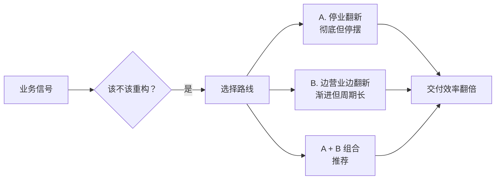

<!--
story:
  number: 03
  type: 番外
  position: 番外一
  title: 给产品经理的重构说明书
  audience: PM / 创业者
-->

# 03 · 给产品经理的重构说明书

> 为什么阿明的厨房必须重新装修？

> **系列定位**：本篇是「阿明餐厅」系列的**番外一**，用 PM 听得懂的语言讲重构。如果你是从[前传](./02-system-architecture-evolution.md)或[续集一](./01-ai-agent-architecture.md)过来的技术同学，可以把这篇转发给你的产品经理。

> 写给 PM 的一句话：重构不是"工程师在浪费时间"，而是"在为你下一次大版本交付清空跑道"。

---

## 引言：研发说"要重构"，你该怎么听？

每隔几个月，研发负责人就会找你说："我们需要两周时间做重构。"

你的第一反应是："重构是什么？用户能看到变化吗？不能？那排期砍掉。"

这不怪你。重构这个词太技术化了，PM 很难理解它的价值。今天，我们用阿明餐厅的"厨房翻新"，把重构翻译成 PM 听得懂的语言。

看完这篇，你会知道：什么时候该批准重构、怎么评估重构的 ROI、怎么和研发高效协同。

---

## 五幕剧：当"加新菜"遇到"旧厨房"

> 本篇采用「五幕剧」结构（而非系列统一的「第 X 章」），刻意模拟产品经理熟悉的"用户故事"叙事节奏，帮助 PM 读者代入场景。

### 第一幕：MVP 时期，快就是王道

阿明的店刚开业，5 平米厨房，两口锅。
你（产品经理）说："明天上牛肉面。"
阿明把配方写在墙上，改个价格标签，搞定。

**对应产品阶段**：MVP 验证期，代码直白，需求交付以"天"为单位。

### 第二幕：疯狂迭代，技术债悄悄累积

生意火了，你不断提需求：
"加奶茶！""加轻食！""加满减活动！""加会员积分！"

阿明没扩厨房，只是：

- 插座拉满拖线板（硬编码）
- 砧板叠在收银台上（模块耦合）
- 冰箱塞到天花板（数据库臃肿）
- 传菜和洗菜路线交叉打架（逻辑混乱）

**对应产品阶段**：快速抢占市场，用"临时方案"换速度。表面能跑，内部已埋雷。

### 第三幕：大促压测，系统原地崩溃

双十一搞"满 100 减 30 + 套餐秒杀"，订单瞬间翻倍。厨房彻底瘫痪：

- 炒菜的找不到盐，做奶茶的打翻面汤
- 客人等 1 小时吃到冷饭，差评爆发
- 老厨师累到离职，新员工看不懂"祖传配方"

**对应产品阶段**：改 1 个 Bug 引出 3 个新 Bug；上线周期从 3 天拖到 3 周；PM 排期永远延期；线上事故频发。（流量视角的详细分析见[《高峰保卫战》](./04-peak-traffic-defense.md)）

### 第四幕：决定重构，两种翻新路线

阿明咬牙要修厨房。但怎么修？这是关键决策点。

**路线 A：停业翻新（大重构）**

停接新需求，专修厨房。不是买更贵的锅，而是：

1. 划分功能区（洗切 / 烹饪 / 出餐动线分离） --> 微服务拆分
2. 清理过期调料、统一配方卡 --> 代码规范化 + 注释文档
3. 升级排风 + 防滑地砖 --> 补全监控 + 自动化测试（详见[《厨房装监控》](./05-observability.md)）
4. 建立标准 SOP --> 接口契约 + CI/CD 流水线（详见[《从厨师到 CEO》第五章](./07-from-chef-to-ceo.md)）

产品视角：这一周"没上新功能"，排期看起来是"纯投入"。

**路线 B：边营业边翻新（渐进式重构）**

不是所有重构都需要"停摆"。阿明还可以选择**边做生意边改造**：

1. **绞杀者模式（Strangler Fig Pattern）**：新功能用新架构写，老功能一块一块迁移，新旧系统并行运行，直到老系统被"绞杀"干净。就像新厨房一间一间接着盖，旧厨房一间一间拆掉，全程不停业。

2. **分支抽象（Branch by Abstraction）**：在老代码和新代码之间加一层抽象接口，让调用方无感知地完成底层替换。就像换发动机 —— 外观不变，动力升级。

3. **特性开关（Feature Toggle）**：新逻辑上线后先对 1% 用户开放，验证无误再逐步放量，出问题一键回滚。这个思路在[流量治理的降级章节](./04-peak-traffic-defense.md)中也有应用。

| 路线 | 优点 | 缺点 | 适用场景 |
|------|------|------|----------|
| A：停业翻新 | 改得彻底，周期短 | 业务停摆，风险集中 | 系统已严重腐化，不修就要崩 |
| B：边营业边翻新 | 业务不停，风险分散 | 周期长，需要更强的工程能力 | 系统还能跑，但效率在下降 |

阿明最终选了 **A + B 的组合**：核心订单系统停业一周彻底翻新（路线 A），其余模块（会员、营销）用绞杀者模式逐步迁移（路线 B）。

### 第五幕：重新开业，交付效率翻倍

厨房翻新后，你再次提需求："上春季限定套餐"。

**翻修前**：研发看了一眼需求，叹了口气 —— 菜单模块和促销模块缠在一起，改个价格要同时改 5 个地方，测试要跑 3 天，上次类似的改动还搞崩了线上。"至少 2 周，还得看运气。"

**翻修后**：同样的需求，研发打开标准化的菜单配置后台，新增一个套餐品类，动线清晰的模块互不影响。自动化测试 10 分钟跑完，灰度发布 1 小时验证。**3 天交付，零故障。**

你继续提需求：

- "高峰期不卡单" --> 系统自动扩容，**零宕机**
- "新员工培训" --> 半天上岗，**不依赖老师傅**
- "食材损耗" --> 下降 30%，**运维成本骤降**

核心真相：重构没有改变"用户能吃到的菜"，但让**所有未来新菜的交付速度、稳定性和成本发生了质变**。

---

## PM 视角翻译表

| 餐厅场景 | 技术本质 | 产品 / 业务收益 |
|----------|----------|----------------|
| 拖线板满地、砧板叠放 | 代码耦合、技术债堆积 | 需求排期不断延期，改一处崩多处 |
| 传菜与洗菜路线交叉 | 服务边界模糊、调用混乱 | 跨端联调成本高，测试覆盖率低 |
| 停业翻新厨房 | 代码重构、架构优化 | 短期无可见功能，长期交付提速 50%+ |
| 边营业边翻新 | 渐进式重构（绞杀者模式） | 业务不中断，风险可控，持续交付 |
| 统一配方卡 + SOP | 接口规范 + 自动化测试 | 新人上手快，线上故障率下降 |
| 动线分离 + 设备升级 | 服务拆分 + 云原生改造 | 支撑 10 倍并发，大促不宕机 |

---

## 三个真实案例：PM 是怎么"踩坑"和"翻盘"的

### 案例 1：拒绝重构的代价

某 SaaS 公司，研发负责人连续 3 个迭代申请"老订单系统重构"，被产品总监以"业务优先"为由拒绝。结果第 4 个迭代大促期间，订单系统因为一段 5 年前的硬编码崩溃，损失 800 万 GMV。复盘发现：这次重构如果当时做，只需要 2 周；现在紧急修复 + 真正重构，花了 8 周 + 800 万损失。

**PM 教训**：拒绝重构的成本不会消失，只会延期。延期越久，利息越重。

### 案例 2：批准太急的代价

某电商公司，老板被研发说服，批准"3 个月彻底重构"。结果因为没有渐进式方案，重构期间 2 个核心业务需求延期交付，市场份额被对手抢走 15%。重构完成时，公司已经元气大伤。

**PM 教训**：批准重构 ≠ 批准"停业"。一定要绑渐进式方案，绞杀者模式几乎是更稳妥的默认选择。

### 案例 3：渐进式重构的胜利

阿明的电商平台在 2024 年做过一次"会员系统绞杀者模式迁移"：新会员系统先服务新用户，老会员系统继续服务老用户 6 个月，期间双写数据、自动对账、逐步切换。最终切换完成时，业务 0 中断，老会员无感迁移到新系统。

**PM 教训**：渐进式重构不是"技术保守"，而是"业务负责"。能用渐进式就别一刀切。

---

## PM 决策的 10 个反模式

以下是产品经理在重构决策中**最容易犯的 10 个错误**：

| # | 反模式 | 后果 |
|---|--------|------|
| 1 | "重构又没新功能，排期砍掉" | 技术债越拖越重，下次大促崩给你看 |
| 2 | "研发说啥就批啥" | 沦为传话筒，没有业务判断 |
| 3 | "老大说下周大促，研发做不完了，重构先放放" | 老大不知道"不做重构"会怎么崩 |
| 4 | "重构 = 代码变干净 = 工程师洁癖" | 看不到业务价值，被研发忽悠 |
| 5 | "一次性彻底重构干净" | 周期失控，错过市场窗口 |
| 6 | "重构不计入 OKR" | 没人愿意做，下个季度继续拖 |
| 7 | "不评估 ROI，只看技术合理性" | 工程团队变成成本中心，业务不买单 |
| 8 | "重构期间需求全部暂停" | 业务方跳起来，CEO 来电 |
| 9 | "重构后复用率应该马上 60%" | 设定不切实际的预期，复用率需要时间沉淀 |
| 10 | "重构完成 = 一切问题解决" | 实际只是还了一笔债，新需求还会产生新债 |

**避免反模式的核心心法**：把重构当成"产品决策"而不是"工程决策"，用业务语言和业务指标来管理它。

---

## 重构前的"3 问 1 表" —— PM 自检清单

在批准任何重构之前，PM 应该先回答这 3 个问题，并填好 1 张表：

### 3 个必问

1. **不做会怎样？** —— 不重构的最坏结果是什么？最可能的损失（GMV、客诉、机会成本）是多少？
2. **做了会怎样？** —— 重构后能节省多少时间、降低多少故障、提升多少交付能力？有没有可量化的预期？
3. **可以渐进吗？** —— 能不能用绞杀者模式 / 分支抽象 / Feature Toggle 渐进式做？周期拉长但风险降低是否更划算？

### 1 张必填表：重构 ROI 对账表

| 维度 | 重构前 | 重构后（预期） | 衡量方式 |
|------|--------|---------------|---------|
| 需求交付周期 | 14 天 | 5-7 天 | 过去 3 个迭代平均值 |
| 线上故障率 | X 次/月 | < Y 次/月 | 监控数据 |
| MTTR（平均恢复时间） | 2 小时 | 15-30 分钟 | 监控数据 |
| 新人上手周期 | 30 天 | 14 天 | 团队访谈 |
| 大促支撑能力 | 单实例 | 弹性扩缩 | 压测数据 |
| 估算投入 | - | Y 人 × Z 周 | 研发评估 |

**自检通过 = 可以批准；自检没通过 = 让研发补全数据再决策。**

---

---

## 给产品经理的决策指南

### 1. 什么时候该批准重构？

当出现以下**业务信号**时，不要犹豫：

- 需求交付周期连续 3 个迭代超出原定周期
- 线上 P1/P2 故障率环比上升，且根因多为"历史逻辑冲突"
- 每次做相似需求（如加活动、改表单）都要从头写一遍
- 研发团队士气低迷，频繁抱怨"不敢改老代码"

### 2. 重构与新功能的 3 种排期组合

很多 PM 纠结"重构排期 vs 新功能排期" —— 其实有 3 种经典组合方式：

| 组合方式 | 配比 | 适合阶段 | 风险 |
|---------|------|---------|------|
| A：纯新功能 | 100% 新功能 | MVP / 早期 | 技术债累积，下季度翻车 |
| B：新功能 + 重构 7:3 | 70% 新功能 + 30% 重构 | 成长期 | 推荐配比 |
| C：新功能 + 重构 5:5 | 50% 新功能 + 50% 重构 | 债务爆发期 | 短期交付压力大 |
| D：纯重构 | 100% 重构 | 紧急救火 | 业务停滞，慎用 |

**阿明的实践**：长期保持 7:3 配比；当故障率超过阈值时切到 5:5；连续 2 个迭代全部停业翻新 = 已经晚了。

**关键原则**：重构是"季度性投资"，不是"年度大工程"。把重构拆成每个迭代 20-30% 的小动作，比攒 3 个月做大重构健康 10 倍。

### 3. 怎么评估重构 ROI？

别听技术黑话，看业务指标。向研发要这份"重构对账表"：

| 指标 | 重构前 | 重构后（预期） | 业务影响 |
|------|--------|---------------|---------|
| 需求平均交付周期 | 14 天 | 5-7 天 | 抢占市场窗口期 |
| 线上故障恢复时间（MTTR） | 2 小时 | 15-30 分钟 | 客诉率下降，口碑保护 |
| 新增功能复用率 | < 20% | 30-40% | 减少重复开发，降本 |
| 大促支撑能力 | 单实例扛不住 | 弹性扩缩容 | 活动 GMV 不流失 |

注意：复用率的预期不宜过高。重构后的复用能力需要时间积累，不会立竿见影地从 20% 跳到 60%。30-40% 是更现实的目标，后续随模块沉淀持续提升。

### 4. 如何与研发高效协同？

- **不砍重构排期，但控范围**：要求"按模块分期重构"，每次只动 1 个核心链路，不影响当期主线需求。
- **绑定业务目标**：把"重构完成"定义为"XX 功能交付提速 X 天"或"XX 大促零降级"，而非"代码变整洁了"。
- **建立技术债看板**：像管理产品需求池一样，给技术债排优先级，业务价值高的优先还。
- **允许渐进式方案**：不是每次重构都要"停业一周"。如果研发提出用绞杀者模式逐步迁移，这通常是更稳妥的选择。

### 5. 如何向老板/CEO 推销重构？

很多 PM 觉得"老板不会批重构" —— 实际上是你不会用"老板的语言"讲。给你 3 个电梯演讲模板：

#### 模板 1：算账派

> "老板，我们有 2 个选择：现在花 2 周做订单系统重构，预防下季度大促崩盘；或者现在省下 2 周，下季度大促崩了紧急修 8 周 + 损失 800 万 GMV。建议选 1。"

**适用场景**：CEO 关注成本和 GMV。

#### 模板 2：竞品派

> "老板，竞品 X 上个月刚做完订单系统重构，大促 0 故障。我们现在不做，下个季度大促时他们稳如老狗，我们还在救火。建议本季度挤出 2 周做。"

**适用场景**：CEO 关注市场竞争力。

#### 模板 3：赋能派

> "老板，技术团队反映我们的代码已经'不敢动'了。再拖半年，新人招进来也接不住。建议本季度做一轮渐进式重构，让团队能持续交付新功能，否则下季度排期会失控。"

**适用场景**：CEO 关注团队和组织能力。

---

## 附录：PM 速查技术术语表

| 术语 | 餐厅类比 | 业务影响 |
|------|----------|---------|
| 耦合 | 砧板叠在收银台上 | 改一处影响多处 |
| 内聚 | 洗切炒分工清晰 | 模块自包含 |
| 抽象 | 配方卡 = 一层抽象 | 业务逻辑和实现解耦 |
| 绞杀者模式 | 边营业边翻新 | 渐进式迁移 |
| 分支抽象 | 换发动机不动外观 | 接口稳定 |
| Feature Toggle | 灰度开关 | 快速回滚 |
| 重构 | 翻新厨房 | 改外部行为 + 改内部结构 |
| 重写 | 推倒重建 | 全新开发，风险大 |
| 技术债 | 拖线板堆满 | 利息越拖越重 |
| 单元测试 | 每道菜先试味 | 早期发现 Bug |
| 集成测试 | 完整做一道菜 | 模块衔接验证 |
| E2E 测试 | 客人试吃 | 用户视角验证 |
| CI/CD | 中央厨房流水线 | 自动化交付 |
| 契约测试 | 统一配方卡 | 接口兼容 |
| 监控 | 厨房装监控 | 实时看问题 |
| 告警 | 烟雾报警器 | 异常通知 |
| SLO | "10 分钟出餐" | 服务质量目标 |

---

## 阿明的 3 次实战重构复盘

阿明在 2023-2025 年间做了 3 次大规模重构，每次都有不同教训。

### 复盘 1：订单系统"停业一周"大重构（2023 春）

- **目标**：拆分 5 万行单体订单系统为订单/库存/支付 3 个微服务
- **周期**：原计划 2 周，实际 3 周
- **结果**：上线后 P1 故障 0 次，需求交付周期从 14 天降到 5 天
- **教训**：
  1. **优点**：核心系统用"停业翻新"是对的，因为耦合太深，没法渐进
  2. **缺点**：2 周计划没算上"数据迁移"和"压测"，实际多了 1 周。下次预估 +50% 缓冲
  3. **关键成功因素**：重构前先冻结需求 2 周，团队全力投入

### 复盘 2：会员系统"绞杀者模式"渐进迁移（2024 夏）

- **目标**：把 10 年陈的会员系统迁移到新架构
- **周期**：原计划 6 个月，实际 5 个月
- **结果**：迁移期间业务 0 中断，1.2 亿老会员无感迁移
- **教训**：
  1. **优点**：边营业边迁移，PM 不需要冻结业务需求
  2. **缺点**：双写期间数据对账成本高，月度多花 1 个工程师
  3. **关键成功因素**：建立"双写对账平台"，每天自动核对双系统数据

### 复盘 3：前端组件库"分支抽象"重写（2025 春）

- **目标**：把 3 套老组件库（jQuery / Vue2 / 旧 React）统一为新 React 组件库
- **周期**：原计划 4 个月，实际 6 个月
- **结果**：组件复用率从 25% 升到 55%，新页面开发提速 40%
- **教训**：
  1. **优点**：业务方无感知，旧组件用着，新页面用新组件
  2. **缺点**：3 套老组件共存期太长（4 个月），维护成本翻倍
  3. **关键成功因素**：设立"组件库治理委员会"，强制定期退役老组件

### 3 次复盘的共同教训

1. **预估永远偏乐观** —— 实际周期 × 1.3-1.5 才是真实值
2. **数据迁移是大头** —— 业务逻辑重构只占 50% 时间，剩下 50% 是数据迁移、对账、压测
3. **必须有"完成定义"** —— 什么时候算"重构完成"？业务指标要明确，不能只看代码
4. **必须有"回滚预案"** —— 每次发布都要有 5 分钟内回滚的能力
5. **必须有"庆功"** —— 重构是苦活，完成后要让团队得到认可和奖励

---

## 识别"伪重构"与"真重构"

PM 还需要区分两种看似相同、实则不同的动作：

| 维度 | 伪重构 | 真重构 |
|------|--------|--------|
| 目标 | "代码变干净" | "让下一个需求交付更快" |
| 衡量 | 覆盖率、代码行数 | 交付周期、故障率、复用率 |
| 范围 | 整个项目大重构 | 1-2 个核心模块 |
| 风险 | 高（影响面广） | 中（局部可控） |
| 业务感知 | 业务停滞 1-2 个月 | 业务几乎无感 |
| 长期价值 | 短期"清爽"，长期未必见效 | 持续累积，是组织能力 |

**核心鉴别方法**：问研发"这次重构完，下个迭代哪个需求能多快上线？" 如果答不上来，大概率是"伪重构"。

---

## 5 个真实场景对话：PM 是怎么"搞定"老板的

### 场景 1：老板说"重构不批，等下个季度"

> **PM**："老板，订单系统上次差点崩了，您还记得吧？"
> **老板**："记得啊，那不是修好了吗？"
> **PM**："修好是 1 个 bug，但我们还有 47 个 bug 没修，藏得深。下季度大促量翻倍，至少有 3 个会爆。"
> **老板**："那你需要什么？"
> **PM**："本周挤出 5 天，先把高风险 3 个修了。下季度再大重构。"
> **老板**："好，准了。"

**关键话术**：用"上次差点崩"的具体案例唤起记忆，比抽象讲"技术债"管用 10 倍。

### 场景 2：老板说"招新人解决"

> **老板**："要不招 2 个高级工程师，水平高点自然能搞定老代码。"
> **PM**："老板，我问过老陈了，他说招新人 3 个月内接不了手，老代码得有人教。"
> **老板**："那怎么办？"
> **PM**："招 1 个高级工程师 + 内部做 2 周渐进式重构，比招 2 个新人 + 不重构，半年后效率高 3 倍。"

**关键话术**：把"招人 vs 重构"对比成"半年的总账"，老板更容易看清。

### 场景 3：研发说要"3 个月彻底重构"

> **研发**："订单系统太乱了，需要 3 个月彻底重构。"
> **PM**："3 个月业务暂停？你先回答我 3 个问题："
> 1. "这 3 个月我们的核心业务怎么活？"
> 2. "大促撞上怎么办？"
> 3. "做完复用率能到 50% 吗？"
> **研发**："……可能没那么理想。"
> **PM**："那咱们用绞杀者模式，分 6 个月渐进做。业务不中断，每周 release 一点。"

**关键话术**：用 3 个反问把"理想方案"拉回"现实方案"，让研发意识到"渐进式"才是真负责。

### 场景 4：业务方抱怨"重构影响新需求"

> **业务方**："重构是技术的事，凭什么让我的需求延期？"
> **PM**："这次重构完，您下个季度的 3 个需求能提前 2 周上线。我帮您算过账：延期 2 周 vs 提前 2 周，您选哪个？"
> **业务方**："……提前 2 周。"
> **PM**："那就让咱们一起扛这 2 周。"

**关键话术**：把"延期"翻译成"未来提前"，让业务方从"反对者"变成"受益者"。

### 场景 5：跨部门争执"谁该为重构负责"

> **业务总监**："这是技术的事，技术部门该自己搞定。"
> **技术总监**："业务需求太多，研发被迫赶进度，债是业务部门欠的。"
> **PM（你）**："两位别吵。技术债是大家共同欠的 —— 业务部门赶进度欠的，技术部门没时间 refactor 欠的。我提议咱们成立一个'技术债治理小组'，业务+技术各出 1 个人，每月 review 一次。"

**关键话术**：不站队，用"共同责任 + 共同治理"化解争执，建立协作机制。

---

## 重构完成后的 1 个月：PM 必须做的 4 件事

| 时间 | 动作 | 目的 |
|------|------|------|
| Week 1 | 收集研发反馈 + 业务方反馈 | 验证重构是否真的"提升了交付" |
| Week 2 | 对比重构前后的核心指标 | 兑现 ROI 承诺 |
| Week 3 | 给团队发感谢信 + 庆功 | 团队认可，下次重构才有人愿意做 |
| Week 4 | 把重构案例写入团队 wiki | 让其他人参考，形成组织知识 |

**警惕"重构完就结束"心态**：重构是 30% 的代码工作 + 70% 的组织工作。代码改完不代表事情结束，团队士气、协作模式、复用习惯的改变才是真正的胜利。

---

---

## 核心总结：重构决策速查

| 关键问题 | 答案 |
|----------|------|
| 什么时候该重构？ | 交付周期连续超标、故障率上升、改一处崩多处 |
| 怎么评估 ROI？ | 看业务指标：交付周期、MTTR、复用率、大促能力 |
| 停业翻新还是渐进式？ | 核心系统可停业翻新，其余用绞杀者模式渐进迁移 |
| 怎么和研发协同？ | 不砍排期但控范围，绑定业务目标，建立技术债看板 |

### 一句心法

**重构不是"工程师的代码洁癖"，而是"产品经理的交付加速器"。** 清完跑道，你才能全速起飞。

---

## 延伸阅读

- [架构是"长"出来的](./02-system-architecture-evolution.md) —— 重构之后，架构还要继续演进。从缓存到微服务到云原生的完整路径
- [高峰保卫战](./04-peak-traffic-defense.md) —— 重构后的系统怎么应对大促？限流、熔断、降级的完整方案
- [厨房装监控](./05-observability.md) —— 重构时补全的监控，具体怎么设计？日志、指标、追踪、告警
- [食安大检查](./06-security-architecture.md) —— 重构也是补安全债的好时机：认证、权限、加密、审计日志
- [厨房质检员](./08-qa-testing-strategy.md) —— 重构时补全自动化测试，是"翻新厨房"的核心环节
- [从接单到出餐](./09-cicd-devops.md) —— 重构后的 CI/CD 流水线，让代码安全、快速地交付到生产环境
- [从厨师到 CEO](./07-from-chef-to-ceo.md) —— 重构需要组织保障：技术债的优先级怎么排？谁来拍板？
- [菜单设计学](./10-api-design.md) —— 重构过程中，API 的向后兼容是绞杀者模式的核心保障
- [当餐厅长出大脑](./01-ai-agent-architecture.md) —— AI Agent 系统也需要渐进式重构，技术债不会因为用了 AI 就消失
- [学徒的困境](./11-ai-learning-paradox.md) —— AI 时代的人机协作与学习之道，当 AI 越来越强，人还要不要练基本功
- [数据厨房](./12-data-kitchen.md) —— 数据架构与数据治理，10 家店 10 本账如何变成数据驱动决策
- [前厅翻修记](./13-frontend-renovation.md) —— 前端工程化与用户体验，后厨再快，前厅的门进不来一切白搭
- [阿明的省钱经](./14-cloud-finops.md) —— 云成本优化与 FinOps，120 万月账单如何降到 68 万
- [差评危机](./15-incident-response.md) —— 故障复盘与应急响应，从手忙脚乱到 10 分钟止血的方法论
- [外卖大战](./16-performance-optimization.md) —— 系统性能优化，3 秒生死线下的全链路优化实战
- [传菜窗口的智慧](./19-realtime-eventdriven.md) —— 引入消息队列本身就是一种重构，从同步耦合到异步解耦的架构翻新
- [十家店的烦恼](./17-distributed-puzzles.md) —— 分布式系统的一致性挑战，重构前需要理解 CAP 定理的权衡
- [阿明的加盟帝国](./18-saas-multitenant.md) —— SaaS 化的多租户重构，从单用户系统到多租户系统的大规模改造
- [厨房实况直播](./19-realtime-eventdriven.md) —— 实时系统的渐进式重构，从轮询到事件驱动的迁移路径
- [一个厨房，四个门面](./20-multiplatform-architecture.md) —— 多端项目的重构挑战，多个客户端如何同步翻新
- [懂你的菜单](./21-search-recommendation.md) —— 搜索推荐系统的技术债管理，算法迭代的渐进式重构
- [菜谱标准化之路](./07-from-chef-to-ceo.md) —— 技术文档是重构决策的知识沉淀，ADR 记录每次"为什么改"
- [仓库搬家不停业](./22-database-migration.md) —— 数据库迁移是重构中最高风险的操作，在线 Schema 变更方法论
- [预制菜还是现炒](./23-lowcode-platform.md) —— 低代码 vs 全手写的选型决策，和重构决策一样需要权衡灵活与效率
- [阿明出海记](./24-globalization.md) —— 国际化重构的系统性规划，翻译只是表面，底层架构需要全面调整
- [厨房大换岗](./25-ai-org-transformation.md) —— AI 转型时期的组织重构，和系统重构一样需要渐进式推进
- [阿明的二次创业](./26-ai-native-startup.md) —— AI 原生创业中的架构决策，从第一天就做对还是日后重构
- [会自我进化的厨房](./27-self-evolving-company.md) —— 自进化组织的重构思维，让系统具备自我修复能力
- [AI 的"黑暗料理"](./28-ai-hallucination-safety.md) —— AI 输出质量的持续改进，和重构一样是渐进式提升过程

## 跨章节衔接

- [02-system-architecture-evolution.md](./02-system-architecture-evolution.md) —— 前传，重构是架构演进的工具：分阶段的架构升级与重构路径
- [08-qa-testing-strategy.md](./08-qa-testing-strategy.md) —— 正传 4，重构的安全网是测试覆盖：测试保护重构不引入回归
- [09-cicd-devops.md](./09-cicd-devops.md) —— 正传 5，CI/CD 是重构的护栏：自动化流水线让重构可回滚、可验证

---

## 结语

阿明翻新厨房的故事，说的是所有产品团队迟早要面对的一笔账：**技术债不会自己消失，拖得越久，利息越高。**

答案是：识别业务信号 → 评估 ROI → 选择路线（停业翻新 or 绞杀者模式）→ 绑定业务目标 → 渐进式交付。

下次研发说"要重构"时，不妨问自己：

- 这次重构，能帮我们下一个核心需求提前几天上线？
- 如果不做，下个版本线上出事故的概率有多大？
- 我们能不能先动最卡脖子的那 1 个模块，边还债边交付？

> 好产品需要好架构护航。别等跑道堆满障碍物才想起修缮 —— 现在就去和研发聊聊，找到那个最卡脖子的模块，迈出渐进式重构的第一步。

← [返回系列导读](./index.md)
