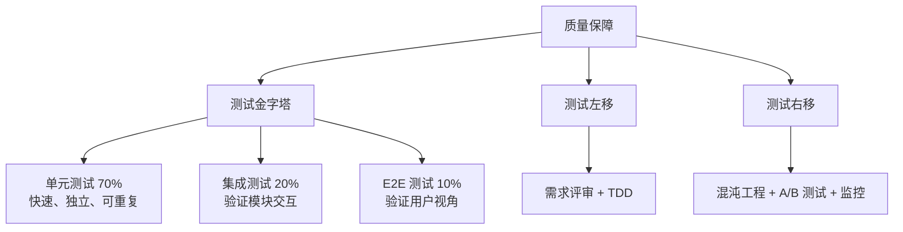

# 08 · 厨房质检员

> 从阿明的"祖传配方"到标准化质检，看测试金字塔的落地

> **系列定位**：本篇是「阿明餐厅」系列的**正传 4**。在[前传](./02-system-architecture-evolution.md)中，阿明完成了架构演进；在[高峰保卫战](./04-peak-traffic-defense.md)中学会了流量治理；在[厨房装监控](./05-observability.md)中建立了可观测性。但所有这些能力，都要建立在一个前提上 —— **代码本身是可靠的**。这就是测试的价值。

---

## 引言：新员工做错了菜

阿明的餐厅新招了一个厨师小陈。第一天上班，小陈按"祖传配方"做了一碗牛肉面。

顾客吃了一口："这味道不对啊，太咸了！"

阿明尝了一口，确实咸了。问题出在哪？

- 配方本上写"盐适量"（模糊需求）
- 小陈按自己的理解加了一勺（实现偏差）
- 没有试吃环节就端上去了（缺少测试）

阿明意识到：**光有配方不够，还需要质检流程**。每道菜出餐前，必须有人尝一口，确认味道对了再上桌。

测试的本质，不是"证明代码是对的"，而是**尽早发现问题，降低修复成本**。

---

## 第一章：测试金字塔 —— 不是所有测试都一样

阿明给厨房设计了一套质检体系：

```text
质检层级：
  食材检查（单元测试）：每批食材进货时抽检，确保新鲜度
  工序检查（集成测试）：切菜、腌制、烹饪，每个环节完成后抽检
  成品试吃（E2E 测试）：出餐前，厨师长尝一口，确认整体味道
```

这就是**测试金字塔（Test Pyramid）**：底层是大量单元测试，中层是适量集成测试，顶层是少量端到端测试。

### 为什么是金字塔？

| 测试类型 | 占比 | 执行速度 | 覆盖范围 | 维护成本 |
|----------|------|----------|----------|----------|
| 单元测试 | 70% | 毫秒级 | 单个函数/类 | 低 |
| 集成测试 | 20% | 秒级 | 模块间交互 | 中 |
| E2E 测试 | 10% | 分钟级 | 完整业务流程 | 高 |

**反模式：冰淇淋模式（Ice Cream Cone）**。很多团队的测试结构是倒金字塔 —— E2E 占 70%，单元测试只占 10%。结果是 E2E 跑一次 2 小时、不稳定经常误报、出问题定位困难。

阿明的经验：**单元测试是地基**。没有单元测试，集成测试和 E2E 测试就是空中楼阁。

---

## 第二章：单元测试 —— 食材检查

**单元测试（Unit Test）** 的核心是：**测试最小的可测试单元（函数、类、模块）**。

```python
# 被测函数
def calculate_salt(beef_weight_g: int) -> int:
    """根据牛肉重量计算盐的用量（克）"""
    if beef_weight_g <= 0:
        raise ValueError("牛肉重量必须大于 0")
    return beef_weight_g // 100 * 2  # 每 100g 牛肉用 2g 盐

# 单元测试 —— 把"盐适量"变成"盐 2g / 100g 牛肉"
def test_calculate_salt_normal():
    assert calculate_salt(500) == 10

def test_calculate_salt_edge_case():
    assert calculate_salt(100) == 2
    assert calculate_salt(150) == 2  # 不足 200g，按 100g 算

def test_calculate_salt_invalid():
    with pytest.raises(ValueError):
        calculate_salt(0)
```

### 单元测试的 FIRST 原则

| 原则 | 说明 |
|------|------|
| **Fast** | 执行要快（毫秒级），不依赖数据库、网络 |
| **Isolated** | 测试之间互相独立，每个测试用独立的 mock 数据 |
| **Repeatable** | 多次执行结果一致，不依赖随机数、时间 |
| **Self-validating** | 自动判断通过/失败，用 assert 而非 print |
| **Timely** | 及时编写，写完代码立刻补测试，或 TDD |

单元测试的关键是**隔离外部依赖**（用 Mock 替代数据库、网络），保证执行速度和稳定性。

---

## 第三章：集成测试 —— 工序检查

单元测试保证了"每个环节是对的"，但**环节之间的衔接**呢？

**集成测试（Integration Test）** 的核心是：**测试模块之间的交互**。阿明的"牛肉面制作流程"包含切菜 → 腌制 → 烹饪三个环节，每个环节单独测试都通过了，但组合在一起时，可能因为"接口不匹配"而出错。

### 契约测试：模块间的"合同"

当模块由不同团队维护时（如订单服务调用支付服务），如何保证接口不变？

**契约测试（Contract Test）** 的核心是：**消费方定义期望，提供方验证实现**。

```python
# 订单服务（消费方）定义的契约
def test_payment_service_contract():
    """订单服务期望支付服务的接口行为"""
    payment_client = PaymentClient(base_url="http://payment-service")
    response = payment_client.pay(order_id="123", amount=28)
    assert response.status_code == 200
    assert "payment_id" in response.json()
```

契约测试的价值：**在集成测试之前，先验证接口兼容性**。如果契约测试失败，说明"提供方改了接口，消费方还不知道"，需要提前沟通。这和[《菜单设计学》](./10-api-design.md)中的 API 版本管理、向后兼容原则是同一思路 —— 接口变更要可控。

---

## 第四章：E2E 测试 —— 成品试吃

单元测试和集成测试都通过了，但**用户视角**呢？

**端到端测试（End-to-End Test, E2E）** 的核心是：**模拟真实用户操作，验证完整业务流程**。

```python
# E2E 测试：模拟用户下单 -> 支付 -> 出餐
def test_order_full_flow(page):
    page.goto("http://restaurant.com/order")
    page.click("text=牛肉面")
    page.click("text=下单")
    page.select_option("select[name=payment_method]", "wechat")
    page.click("text=确认支付")
    # 超时设为 60 秒（1 分钟）：E2E 测试环境稳定时完整流程通常 10-20 秒内完成，
    # 60 秒已留有充足余量；过长（如 10 分钟）会掩盖性能退化问题，拖慢 CI 反馈循环
    page.wait_for_selector("text=出餐成功", timeout=60000)
    assert page.text_content(".order-status") == "已完成"
```

### E2E 测试的痛点与应对

| 痛点 | 应对策略 |
|------|----------|
| 执行慢 | 并行执行，或只在核心流程上跑 E2E |
| 不稳定 | 使用测试环境，或 Mock 外部依赖 |
| 维护成本高 | 使用 data-testid，而非 CSS 选择器 |
| 覆盖率低 | 只覆盖核心流程（下单、支付、出餐） |

阿明的策略：**E2E 测试只覆盖核心流程**（占业务流程的 10-20%），其他场景用单元测试和集成测试覆盖。

---

## 第五章：TDD —— 先写测试，再写代码

**测试驱动开发（Test-Driven Development, TDD）** 的流程是：**Red → Green → Refactor**。

阿明让小陈用 TDD 开发"根据顾客口味推荐菜品"的功能：

**Red：写失败的测试**

```python
def test_recommend_for_spicy_lover():
    recommender = Recommender()
    recommendations = recommender.recommend(preferences=["辣"])
    assert "麻婆豆腐" in recommendations
    assert "清炒时蔬" not in recommendations
```

**Green：写最小实现，让测试通过** → 运行通过。

**Refactor：重构优化** → 运行仍通过。

### TDD 的价值与争议

| 价值 | 说明 |
|------|------|
| 需求明确 | 测试用例就是需求文档 |
| 设计驱动 | 为了写可测试的代码，必须设计低耦合、高内聚的模块 |
| 文档化 | 测试用例就是活文档 |
| 信心 | 重构时不怕改坏，测试立刻告诉你 |

阿明的策略：**核心业务逻辑用 TDD**（如订单计算、支付流程），**UI 和工具类不强求 TDD**。TDD 不是银弹，但它是一种**倒逼设计**的方法。

---

## 第六章：测试左移与测试右移 —— 开卷考前就做对，交卷后还持续抽检

**测试左移（Shift Left）** 的核心是：**把测试提前到开发阶段，甚至需求阶段**。

```text
传统流程：
  需求 → 设计 → 开发 → 测试 → 上线
                    ↑ 发现问题，修复成本高

测试左移：
  需求 → 设计 → 开发 → 测试 → 上线
    ↑ 需求评审时就发现歧义，修复成本低
```

阿明的测试左移实践：需求阶段测试工程师参与评审，设计阶段考虑"怎么测试"，开发阶段同步写单元测试（或 TDD）。

**测试右移（Shift Right）** 的核心是：**在生产环境中持续测试**。

- **混沌工程**：定期在生产环境模拟故障，验证系统韧性（详见[全链路压测](./04-peak-traffic-defense.md)）
- **A/B 测试**：新功能先对 1% 用户开放，收集真实用户反馈
- **监控告警**：通过[可观测性](./05-observability.md)发现生产环境问题，及时回滚

---

## 第七章：测试反模式 —— 常见踩坑

阿明在推行测试的过程中，踩过不少坑：

| 反模式 | 问题 | 正确做法 |
|--------|------|----------|
| 覆盖率 100% 的执念 | 给 getter/setter 写测试，测试代码比业务代码多 | 核心逻辑 > 90%，工具类 > 50% 即可 |
| 测试依赖数据库状态 | 测试不稳定（flaky test），有时过有时不过 | 每个测试用独立数据，或用事务自动回滚 |
| 只测 Happy Path | 生产环境出问题，才发现没处理异常 | 覆盖边界值、异常流、并发场景 |
| 测试代码不重构 | 测试代码越来越难维护 | 测试代码也是代码，也要重构 |

这些反模式和[安全架构的反模式](./06-security-architecture.md)有共通之处 —— 都是为了"形式主义"而牺牲了实际效果。测试的目的是**尽早发现问题**，不是追求数字好看。

---

## 第八章：AI 时代的测试 —— 当被测对象自己会"说谎"

2026 年，阿明的餐厅里多了一群"AI 厨师"：AI 推荐菜品、AI 客服、AI 审核、AI 排班。

阿明突然发现：以前那一套"单元测试 + 集成测试 + E2E 测试"在 AI 面前**突然失效了**。

- AI 的输出**不是确定性的** —— 同一个问题问两次，答案不一样
- AI 的"逻辑"在模型里，**没法看代码、没法打断点**
- AI 会**一本正经地胡说八道**（详见[续集六 · 30](./30-ai-hallucination-safety.md)）—— 传统断言 `assert output == expected` 完全失效
- AI 工具调用的**正确性**没法靠类型检查

阿明意识到：**AI 时代需要一套新的测试方法论**。它不是替代传统测试，而是补上传统测试覆盖不到的那一层。

### 8.1 传统测试 vs AI 测试

| 维度 | 传统代码测试 | AI 输出测试 |
|------|-------------|-------------|
| 输出 | 确定性（相同输入 → 相同输出） | 概率性（相同输入 → 相似但不同输出） |
| 正确性 | 黑白分明（assert 通过/失败） | 灰色地带（语义对就算对） |
| 断言方式 | `==` 精确匹配 | 语义相似度、LLM-as-Judge |
| 边界条件 | 容易枚举 | 几乎无限组合 |
| 覆盖率 | 行/分支覆盖 | 主题覆盖、风险覆盖 |
| 测试数据 | 精心构造的小数据集 | 黄金集 + 真实流量 + 合成数据 |
| 失败定位 | 堆栈 + 日志 | "它就是觉得这样合理" |

### 8.2 AI 输出的 4 大测试维度

阿明总结了 AI 输出必须测的 4 个维度：

**维度 1：事实性（Factuality）**
- AI 输出的"事实"是否真实存在？
- 检测方法：知识库比对、来源核查、NER 实体验证
- 工具：FactScore、SAFE、搜索增强验证
- 例：AI 引用"2023 年《中华营养学杂志》某论文" —— 这论文真的存在吗？

**维度 2：忠实性（Faithfulness）**
- AI 输出是否**忠实于**给定的上下文？
- 例：用户给了 AI 一篇文档，AI 总结时是否引入文档外的信息？
- 工具：RAGAS Faithfulness、HHEM
- 这是 RAG 系统的核心质量指标

**维度 3：相关性（Relevance）**
- AI 输出是否回答了用户的问题？
- 工具：RAGAS Answer Relevancy、人工评分
- 例：用户问"附近有川菜吗"，AI 推荐了"粤菜" —— 语义沾边但答非所问

**维度 4：安全性（Safety）**
- AI 输出是否包含有害、偏见、违规内容？
- 工具：Llama Guard、ShieldGemma、内容审核 API
- 这是合规底线，不容妥协

| 维度 | 核心问题 | 典型测试 | 工具支持 |
|------|----------|----------|----------|
| 事实性 | 说的是真的吗？ | 知识库比对 | FactScore / SAFE |
| 忠实性 | 忠于原文吗？ | RAG 上下文验证 | RAGAS / HHEM |
| 相关性 | 答对问题了吗？ | 语义相似度 | BERTScore / RAGAS |
| 安全性 | 有害内容吗？ | 内容审核 | Llama Guard / ShieldGemma |

### 8.3 黄金集（Golden Set）—— AI 时代的"测试用例"

传统测试用代码写测试用例，AI 测试**必须**有专属的"黄金集"。

```yaml
# golden_set.yaml —— 阿明客服 AI 的黄金集示例
version: 3
last_updated: 2026-06-10
total_cases: 280
categories:
  - name: 订单查询
    cases: 60
  - name: 退款请求
    cases: 80
    high_risk: true
  - name: 菜品咨询
    cases: 50
  - name: 配送问题
    cases: 40
  - name: 投诉处理
    cases: 30
    high_risk: true
  - name: 越权试探
    cases: 20
    red_team: true

# 关键：黄金集必须**持续更新**，不是一次性资产
# 每次线上事故 → 加 1-3 个新 case → 防回归
```

**黄金集的 4 大特征**：

1. **代表性**：覆盖核心场景 + 边缘场景
2. **难度梯度**：简单 40% + 中等 40% + 困难 20%
3. **预期答案**：每条都有"参考答案 + 评分标准"
4. **持续演进**：每月 +5-10% 新 case，每次事故必加新 case

阿明的经验：**黄金集不是"测试部门写一次"的资产，是"产品+技术+测试+客服"共建的活文档**。客服每天收到的新问题，每周挑 5-10 个加进去。

### 8.4 LLM-as-Judge —— 让 AI 评 AI

传统断言（`==`、`in`、`assert`）在 AI 面前失效了 —— 因为正确答案本身就有多样性。

阿明发现可以用**更强的 AI 来评判普通 AI**：

```python
# LLM-as-Judge：让 GPT-4 评判客服 AI 的回答
def judge_customer_service_response(question, ai_answer, golden_answer):
    """用强模型当裁判"""
    judge_prompt = f"""
    你是客服质检专家。请评判以下 AI 回答的质量（1-5 分）。

    用户问题：{question}
    AI 回答：{ai_answer}
    参考答案：{golden_answer}

    评分维度：
    - 准确性（1-5）：是否回答了用户问题
    - 礼貌性（1-5）：语气是否得体
    - 完整性（1-5）：是否遗漏关键信息

    输出 JSON：{{"accuracy": x, "politeness": y, "completeness": z, "overall": avg}}
    """
    return llm_call(model="gpt-4o", prompt=judge_prompt)
```

**LLM-as-Judge 的陷阱**：

| 陷阱 | 说明 | 应对 |
|------|------|------|
| 位置偏差 | AI 倾向给"放在前面的"答案高分 | 随机化答案顺序 |
| 长度偏差 | AI 倾向给"更长的"答案高分 | 控制答案长度区间 |
| 自我偏好 | 模型倾向给"自己生成的"答案高分 | 用不同模型当裁判 |
| 模糊判断 | "这个回答还行" → 4 分还是 5 分？ | 强制 5 档 + 详细标准 |
| 成本 | 每次评测调一次 GPT-4 = 真金白银 | 缓存 + 抽样评测 |

阿明的建议：**LLM-as-Judge 是辅助，不是替代**。高风险决策必须有人工兜底，LLM-as-Judge 只用于大批量筛选。

### 8.5 Prompt 回归测试 —— 当"被测代码"是 Prompt

AI 应用的核心逻辑不在代码里，**在 Prompt 里**。改了 Prompt = 改了核心逻辑，必须有回归测试。

```python
# prompt 版本管理 + 回归测试
PROMPT_VERSIONS = {
    "v1.0": "你是阿明餐厅的客服助手。请礼貌回答用户问题。",
    "v1.1": "你是阿明餐厅的客服助手。请礼貌、准确、简洁地回答用户问题。",
    "v2.0": "你是阿明餐厅的客服助手...（详细角色定义 + 工具清单 + 边界规则）",
}

def test_prompt_regression():
    """跑黄金集，统计每个 Prompt 版本的通过率"""
    results = {}
    for version, prompt in PROMPT_VERSIONS.items():
        score = run_golden_set(prompt, golden_set)
        results[version] = score
        assert score > 0.85, f"Prompt {version} 退化到 {score}"
    return results
```

**Prompt 回归测试的关键指标**：

| 指标 | 含义 | 目标 |
|------|------|------|
| 通过率 | 黄金集通过比例 | > 85% |
| 退化率 | 新版本 vs 旧版本的差距 | < 5% |
| 高风险通过率 | 高风险 case 的通过率 | > 95% |
| 响应延迟 | 平均响应时间 | < 3 秒 |
| Token 成本 | 每次对话的 Token 数 | 持续下降 |

### 8.6 Agent 行为测试 —— 当"被测对象"是个能行动的智能体

AI Agent 不只是回答问题，还能**调用工具、操作数据库、下单付款**。这类系统的测试更复杂。

阿明为 Agent 设计了 3 层测试：

**第一层：单步工具调用测试**
```python
def test_agent_calls_correct_tool():
    """Agent 收到"查订单 123"请求，必须调用 query_order 工具"""
    response = agent.run("查订单 123")
    assert response.tool_called == "query_order"
    assert response.tool_args["order_id"] == "123"
```

**第二层：多步决策链测试**
```python
def test_agent_handles_complex_flow():
    """用户说'我想退款，因为菜太咸了'，Agent 应该：
    1. 查询订单
    2. 评估金额（小额可自动退，大额需 HITL）
    3. 调用对应退款工具
    """
    response = agent.run("我想退款，菜太咸了")
    # 检查决策链
    assert "query_order" in response.tool_sequence
    assert response.tool_sequence.index("refund") > response.tool_sequence.index("query_order")
```

**第三层：异常与对抗测试**
- Agent 拿到矛盾指令会怎样？（"别退款" + "立即退款"）
- Agent 工具调用失败会重试吗？
- Agent 遇到 Prompt 注入会怎么处理？（详见[33 第二章](./33-ai-fatal-trio.md)）

**Agent 测试的金标准是"决策链可回放"**：每个 Agent 的每次运行，都应该被记录成可审计的"决策链日志"，出问题可回放、可归因。

### 8.7 AI 测试的 5 大反模式

阿明在 AI 测试的实践中踩过 5 个坑：

| 反模式 | 问题 | 正确做法 |
|--------|------|----------|
| **没有黄金集** | "AI 看起来不错就上线" → 线上事故 | 至少 200+ 黄金集起步，每月更新 |
| **黄金集一成不变** | 模型升级了，黄金集没变 → 测的是老能力 | 每次线上事故必加 case，每月 review |
| **过度依赖 LLM-as-Judge** | 让 AI 评 AI，自欺欺人 | LLM-as-Judge 是初筛，人工是终审 |
| **没有 Prompt 版本管理** | Prompt 在文档里散落，没人知道哪个版本在线 | Prompt 入 Git，每个版本有评估分数 |
| **只测 Happy Path** | 只测"正常问 + 正常答"，不测对抗 | 至少 20% 黄金集是红队/对抗用例 |

### 8.8 AI 测试的成熟度模型

阿明把团队的 AI 测试能力分成 5 级：

| 等级 | 名称 | 特征 | 阿明的现状 |
|------|------|------|-----------|
| L1 | 人工抽查 | 全靠人肉 review，每天抽 10 条 | 2024 初 |
| L2 | 黄金集 + 自动化 | 跑黄金集，统计通过率 | 2024 中 |
| L3 | LLM-as-Judge | 让强模型评弱模型 | 2025 初 |
| L4 | 持续评测 + 红队 | CI 跑评测 + 月度红队 | 2025 末 |
| L5 | 全自动对抗进化 | AI 自我红队 + 自动修复 | 2026 目标中 |

阿明现在在 **L4 → L5** 之间：CI 集成评测已经稳定，红队流程运转良好，下一步是**让 AI 自己发现新攻击模式、自动补充到黄金集**。

> **AI 时代测试的完整方法论、Eval 平台架构、回归测试、Prompt 工程深度内容，详见[续集十 · 34a/34b · 《AI 评测工程》](./34a-ai-evaluation-fundamentals.md)**。本篇只是提纲挈领，34a/34b 才是工程化实战。

---

## 核心总结：测试金字塔与质量保障



| 测试类型 | 核心问题 | 餐厅类比 | 技术实现 |
|----------|----------|----------|----------|
| 单元测试 | 这个函数对吗？ | 食材检查 | pytest / JUnit / Jest |
| 集成测试 | 模块之间衔接对吗？ | 工序检查 | 真实依赖 + 契约测试 |
| E2E 测试 | 用户视角下系统对吗？ | 成品试吃 | Selenium / Playwright |
| TDD | 怎么写出可测试的代码？ | 厨师自创新菜时先定验收标准 | Red-Green-Refactor |
| 测试左移 | 怎么尽早发现问题？ | 需求阶段就参与 | 需求评审 + TDD + Code Review |
| 测试右移 | 怎么在生产环境持续验证？ | 顾客反馈 + 抽检 | 混沌工程 + A/B 测试 + 监控 |

---

### 一句心法

**测试不是"证明代码是对的"，而是"尽早发现问题，降低修复成本"**。金字塔是骨架（70/20/10），左移右移是肌肉（需求评审 + 生产验证），AI 时代再加一双数据驱动的眼睛（黄金集 + LLM-as-Judge + 红队）。三者缺一，质量就是雾里看花。

---

## 延伸阅读

- [厨房装监控](./05-observability.md) —— 测试发现问题，可观测性定位问题。两者形成"预防 + 治疗"的闭环
- [架构是"长"出来的](./02-system-architecture-evolution.md) —— 微服务架构下，契约测试和集成测试的重要性大幅提升
- [高峰保卫战](./04-peak-traffic-defense.md) —— 全链路压测是测试右移的典型实践，验证系统在高并发下的表现
- [食安大检查](./06-security-architecture.md) —— 安全测试：渗透测试、漏洞扫描、依赖检查，是测试策略在安全领域的应用
- [给产品经理的重构说明书](./03-refactoring-guide-for-pm.md) —— 重构时补全自动化测试，是"翻新厨房"的核心环节
- [从厨师到 CEO](./07-from-chef-to-ceo.md) —— Code Review 和测试是工程师文化的两大支柱
- [从接单到出餐](./09-cicd-devops.md) —— 测试是 CI/CD 流水线的核心环节，自动化测试让持续集成成为可能
- [当餐厅长出大脑](./01-ai-agent-architecture.md) —— AI Agent 的测试策略：单元测试验证规划逻辑，集成测试验证工具调用
- [菜单设计学](./10-api-design.md) —— 契约测试验证 API 的向后兼容性，是 API 变更的质量保障
- [学徒的困境](./11-ai-learning-paradox.md) —— AI 时代的人机协作与学习之道，当 AI 越来越强，人还要不要练基本功
- [数据厨房](./12-data-kitchen.md) —— 数据架构与数据治理，10 家店 10 本账如何变成数据驱动决策
- [前厅翻修记](./13-frontend-renovation.md) —— 前端工程化与用户体验，后厨再快，前厅的门进不来一切白搭
- [阿明的省钱经](./14-cloud-finops.md) —— 云成本优化与 FinOps，120 万月账单如何降到 68 万
- [差评危机](./15-incident-response.md) —— 故障复盘与应急响应，从手忙脚乱到 10 分钟止血的方法论
- [外卖大战](./16-performance-optimization.md) —— 系统性能优化，3 秒生死线下的全链路优化实战
- [传菜窗口的智慧](./20-realtime-eventdriven.md) —— 消息队列的可靠性测试：消息不丢失、顺序性保证、幂等消费验证
- [十家店的烦恼](./18-distributed-puzzles.md) —— 分布式系统的测试挑战：网络分区模拟、脑裂场景、一致性验证
- [阿明的加盟帝国](./19-saas-multitenant.md) —— 多租户测试策略：租户隔离验证、跨租户数据泄露检测
- [厨房实况直播](./20-realtime-eventdriven.md) —— 实时系统的压力测试：高并发 WebSocket 连接、消息风暴模拟
- [一个厨房，四个门面](./21-multiplatform-architecture.md) —— 多端兼容性测试，不同设备和平台的自动化测试矩阵
- [懂你的菜单](./22-search-recommendation.md) —— 搜索推荐算法的 A/B 测试和效果评估，推荐准确率的测试方法
- [菜谱标准化之路](./07-from-chef-to-ceo.md) —— 测试用例和测试报告的知识管理，测试文档的标准化
- [仓库搬家不停业](./24-database-migration.md) —— 数据库迁移的测试策略：数据一致性校验、回滚测试、双写验证
- [预制菜还是现炒](./25-lowcode-platform.md) —— 低代码生成代码的质量测试，平台组件的单元测试覆盖
- [阿明出海记](./26-globalization.md) —— 国际化测试：多语言兼容性、多时区正确性、多币种计算验证
- [厨房大换岗](./27-ai-org-transformation.md) —— AI 转型下的测试策略变化，测试工程师的角色从执行到设计
- [阿明的二次创业](./28-ai-native-startup.md) —— AI 生成代码的测试挑战，AI 原生创业更需要严格的测试策略
- [会自我进化的厨房](./29-self-evolving-company.md) —— Agent Loop 的质量门是自动化测试的终极形态
- [AI 的"黑暗料理"](./30-ai-hallucination-safety.md) —— AI 幻觉检测是测试策略的新维度，如何测试 AI 的输出质量

## 跨章节衔接

- [09-cicd-devops.md](./09-cicd-devops.md) —— 正传 5，测试策略与 CI/CD 强耦合：自动化测试是流水线的质量门
- [10-api-design.md](./10-api-design.md) —— 正传 6，API 契约测试是测试策略在接口层的具体落地
- [15-incident-response.md](./15-incident-response.md) —— 正传 9，事故复盘是测试策略的逆向补充：从故障中提取新测试用例
- [32-agent-harness.md](./32-agent-harness.md) —— 续集八，AI Agent 系统的测试挑战：非确定性输出的断言策略

---

## 结语

阿明推行测试的故事，揭示了工程团队必须跨过的一道坎：**从"靠老师傅尝一口"到"靠系统化的质检流程" —— 质量不应该依赖运气。**

答案是测试金字塔 + 测试左移 + 测试右移：单元测试打地基，集成测试验证衔接，E2E 测试守护用户视角；测试左移让问题尽早暴露，测试右移让生产环境持续验证。

下次当你写代码时，不妨问自己：

- 这个函数有单元测试吗？边界值和异常流覆盖了吗？
- 模块之间的接口有契约测试吗？接口变更时能及时发现问题吗？
- 核心业务流程有 E2E 测试吗？用户视角下系统是对的？
- 我是在"写代码后补测试"，还是"用 TDD 驱动设计"？

> 好的测试，不是"让代码不出问题"，而是"让问题尽早暴露，降低修复成本"。

← [返回系列导读](./index.md)
