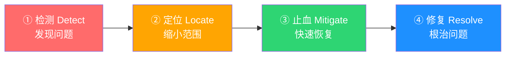
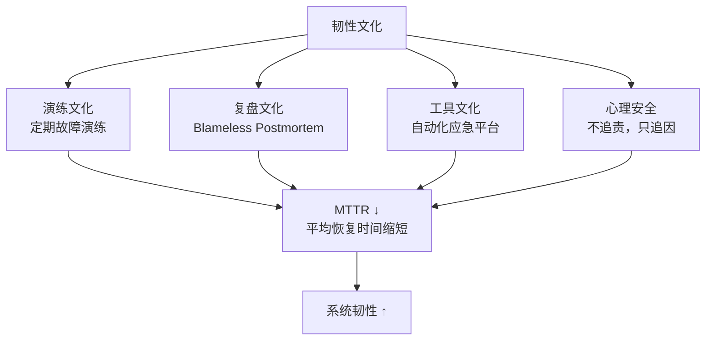
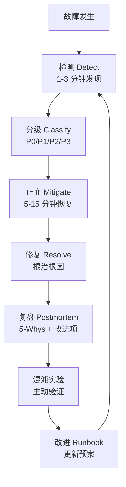

<!--
story:
  number: 15
  type: 正传
  position: 正传 9
  title: 差评危机
  audience: 工程师 / SRE / 架构师
-->

# 15 · 差评危机

> 从阿明的"周五晚高峰支付崩溃"，看故障复盘与应急响应的完整方法论

> **系列定位**：本篇是「阿明餐厅」系列的**正传 9**。在正传 2[《厨房装监控》](./05-observability.md)中，阿明学会了"看见"问题 —— 用可观测性照亮系统的每个角落。但看见问题只是第一步。当支付系统突然挂了、2000 个订单失败、差评如潮水般涌来时，"看见"远远不够 —— 你得知道先做什么、后做什么、谁来做、怎么做。

---

## 引言：那个让阿明手心冒汗的周五夜晚

周五晚上七点，阿明正坐在办公室看报表。一切看起来很好 —— 订单量比上周同期涨了 30%，新上的营销活动效果不错。

手机突然震了一下。是客服主管的消息："阿明，有客人说支付不了。"他没太在意，回了句"让技术看看"。三分钟后，手机开始不停震动。五条、十条、二十条 —— 支付通道全面崩溃。30 分钟内，2000 个订单失败。客服电话被打爆，社交媒体上差评如潮。

阿明站在办公室，手心冒汗，脑子里只有一个问题："先救火还是先查原因？"技术团队在群里吵成一团 —— 有人说先查日志，有人说先重启服务，有人说联系支付供应商。30 分钟过去了，没人拍板，没人行动。

那一刻阿明意识到：**故障不是意外，而是常态。区别只在于 —— 你有没有准备好。**

---

## 第一章：危机爆发 —— 黄金 30 分钟

阿明拿起电话打给技术负责人老陈："到底什么情况？"老陈说："还在查，可能是支付网关超时，也可能是证书过期……"阿明打断他："我不想听'可能'，我想知道三件事 —— 影响多大、谁来处理、多久恢复？"

老陈愣住了。他意识到自己团队在"查问题"上花了 25 分钟，却没人做过一件最重要的事：**评估影响面，启动应急响应**。

这就好比餐厅厨房着火了，厨师不去拿灭火器，反而在讨论"是电路老化还是油温过高"。原因可以之后查，火必须先灭。

在技术世界里，这套"先灭火"的方法论叫**故障分级与应急响应**。核心思想是：不同严重程度的故障，对应不同的响应速度、处理方式和通知范围。

| 故障等级 | 严重程度 | 响应时间 | 处理方式 | 通知范围 | 餐厅类比 |
|----------|----------|----------|----------|----------|----------|
| P0 | 核心业务完全中断 | 5 分钟内响应 | 全员上线，实时作战室 | CEO + 全公司 | 厨房着火 |
| P1 | 核心功能严重受损 | 15 分钟内响应 | 主要负责人上线 | CTO + 相关部门 | 停电但可用燃气 |
| P2 | 非核心功能异常 | 1 小时内响应 | 值班工程师处理 | 团队负责人 | 空调坏了 |
| P3 | 体验问题 | 24 小时内响应 | 排入迭代修复 | 相关开发者 | 桌椅有点晃 |

那个周五晚上，支付全面崩溃 = P0 故障。但阿明的团队花了 30 分钟才意识到这是 P0，又花了 20 分钟才把对的人拉进会议室。

**故障响应的核心是在混乱中建立秩序 —— 先分级，再响应。**

---

## 第二章：应急预案 —— 平时就要写好"剧本"

第二天，阿明让老陈整理一份"应急手册"。老陈翻出半年前写的一份文档，发现里面的联系人名单已经过期 —— 两个核心工程师已经离职，支付供应商的紧急联系电话也换了。

阿明苦笑："这手册跟过期食材一样，用了比不用更危险。"

在技术团队中，这份"应急手册"叫 **Runbook**（运维手册）或 **SOP**（标准作业程序）。好的 Runbook 不是写完就扔进抽屉的文件，而是定期演练、持续更新的"活文档"。

一份完整的应急预案需要包含五大要素：

| 要素 | 说明 | 餐厅类比 | 支付崩溃案例 |
|------|------|----------|-------------|
| 触发条件 | 什么情况下启动预案 | 什么温度触发火警 | 支付成功率低于 95% 持续 3 分钟 |
| 负责人 | 谁来指挥、谁来执行 | 谁是消防队长 | On-Call 工程师 + 支付负责人 |
| 处理步骤 | 具体操作清单 | 灭火器使用步骤 | 切换备用通道→验证→通知客服 |
| 升级路径 | 多久没解决要上报 | 多久打 119 | 15 分钟未恢复，升级至 CTO |
| 恢复验证 | 怎么确认问题解决了 | 火灭后检查现场 | 监控支付成功率回升至 99%+ |

关于 On-Call 制度，这里多说两句。On-Call 不是让工程师"随时待命、不许睡觉"。好的 On-Call 是轮值的、有补偿的、有明确边界的。每个 On-Call 周期（通常一周）结束后要交接，交接内容包括：本周告警数量、处理情况、遗留问题。

应急预案和 CI/CD 中的回滚策略有很多共通之处 —— 都是"出了问题，先恢复到上一个好的状态"。详见[《从接单到出餐》](./09-cicd-devops.md)中的回滚策略部分。

**应急预案的核心是把"临场发挥"变成"按剧本操作"。**

---

## 第三章：快速止血 —— 先恢复，再找原因

回到那个周五晚上。阿明做了一个决定："老陈，别查原因了。先把流量切到备用支付通道，5 分钟内我要看到订单能付成功。"

老陈犹豫了一下："但如果不查清根因，切换后可能还会出问题……"阿明说："那是之后的事。现在 2000 个客人在骂我们，每多等一分钟就多 100 条差评。先活下来。"

5 分钟后，备用通道上线。支付成功率从 0% 爬回 97%。客服电话量开始下降。阿明终于坐下来喝了口水："好，现在可以查原因了。"

这就是应急响应的核心方法论 —— **四步法**：



| 步骤 | 核心动作 | 常用工具/手段 | 时间目标 | 餐厅类比 |
|------|----------|--------------|----------|----------|
| 检测（Detect） | 发现异常 | 监控告警、用户反馈 | 1-3 分钟 | 闻到烟味 |
| 定位（Locate） | 缩小故障范围 | 日志分析、链路追踪 | 5-10 分钟 | 确定哪个灶台 |
| 止血（Mitigate） | 快速恢复服务 | 切换、降级、熔断、回滚 | 5-15 分钟 | 关阀门、拿灭火器 |
| 修复（Resolve） | 根治根本原因 | 代码修复、架构调整 | 数小时到数天 | 更换老化电路 |

注意第三步"止血"的常见手段：切换备用通道、降级非核心功能、熔断异常服务、回滚到上一个版本。这些策略在[《高峰保卫战》](./04-peak-traffic-defense.md)中有详细的讲解 —— 熔断器和降级策略是止血阶段的"急救箱"。

很多团队的错误是在"定位"阶段花太多时间，非要找到根因才肯行动。但止血不需要知道根因 —— 你不需要知道为什么着火，你只需要知道怎么灭火。

**止血的核心是"先活下来，再活得好"。**

---

## 第四章：故障复盘 —— 不追责，只追因

周一早上九点，阿明召开了复盘会。会议室气氛凝重，老陈低着头，支付模块的工程师小张更是脸色发白。

阿明开口第一句话："今天这个会，不骂人，不追责。我只想知道 —— 系统哪里可以改进。"小张抬起头，明显松了口气。

阿明用的是 **5-Whys 分析法** —— 连问五个"为什么"，层层剥开表象，找到真正的根因。

| 层级 | 问题 | 答案 |
|------|------|------|
| Why 1 | 为什么支付失败？ | 支付网关返回 502 错误 |
| Why 2 | 为什么返回 502？ | 支付供应商的 SSL 证书过期了 |
| Why 3 | 为什么证书过期没人管？ | 没有设置证书到期监控告警 |
| Why 4 | 为什么没有设置告警？ | 这个证书是前任工程师手动配置的，没有纳入运维体系 |
| Why 5 | 为什么手动配置的东西没有纳入体系？ | 缺乏基础设施即代码（Infrastructure as Code）规范 |

如果阿明只停留在 Why 1 或 Why 2，解决方案就是"续期证书" —— 然后明年证书再次过期，故事重演。追问到 Why 5，解决方案变成了"把所有外部依赖纳入自动化监控和管理体系"，这才是根治。

这种"不追责、只追因"的文化叫 **Blameless Postmortem**（无责复盘）。Google 在 SRE 实践中推广了这个理念。核心思想是：如果一个人犯了错，说明系统允许他犯错 —— 要修的是系统，不是人。

一份完整的复盘报告应该包含：

| 模块 | 内容 | 示例 |
|------|------|------|
| 事件摘要 | 一段话概括 | 周五 19:00 支付网关 SSL 证书过期导致全面中断 |
| 时间线 | 精确到分钟的事件经过 | 19:03 首个告警 → 19:08 确认 P0 → 19:35 切换备用通道 |
| 根因分析 | 5-Whys 结论 | 证书管理缺乏自动化，未纳入监控体系 |
| 影响面 | 量化损失 | 2000 订单失败，预计损失 15 万元，差评 300+ |
| 改进项 | 具体行动 + 负责人 + 截止日期 | ① 证书监控（小张，本周五）② IaC 规范（老陈，月底） |
| 做得好的 | 值得保留的实践 | 备用通道切换方案有效，5 分钟恢复 |

关于故障复盘的更多实践，详见[《从厨师到 CEO》](./07-from-chef-to-ceo.md)中的故障复盘机制。而数据驱动的根因分析能力，则依赖于[《厨房装监控》](./05-observability.md)中讲到的可观测性体系 —— 没有日志、指标和链路追踪，复盘就是"猜"。

**故障复盘的核心是从"谁犯了错"转向"系统哪里可以改进"。**

---

## 第五章：混沌工程 —— 主动制造故障

复盘结束后的第二周，阿明做了一个让所有人惊讶的决定："下周三下午两点，我们要主动关掉主支付通道。"

老陈以为他疯了："你是说……故意制造故障？"阿明说："对。我要看看我们的备用通道是不是真的能用。上次运气好切过去了，下次呢？"

这就是**混沌工程**（Chaos Engineering）的核心思想 —— 与其等故障来找你，不如你主动去找故障。

Netflix 著名的 **Chaos Monkey**（混沌猴子）就是这一理念的代表。它会在生产环境中随机杀掉服务实例，迫使工程师构建真正有弹性的系统。

周三下午两点，阿明团队关闭了主支付通道。结果发现：

1. 自动切换机制确实触发了 —— 但备用通道的商户号也过期了
2. 告警系统发出了通知 —— 但通知发到了已离职工程师的邮箱
3. Runbook 中的切换步骤 —— 少了一步关键的参数校验

如果这些问题是在周五晚高峰暴露的，后果不堪设想。

设计一次混沌实验需要明确几个要素：

| 要素 | 说明 | 本次实验示例 |
|------|------|-------------|
| 稳态假设 | 正常情况下系统应有的行为 | 支付成功率 > 99% |
| 注入方式 | 模拟什么故障 | 关闭主支付通道 |
| 预期行为 | 系统应该如何应对 | 30 秒内自动切换到备用通道 |
| 实际行为 | 实验中的真实表现 | ① 自动切换触发，但备用通道商户号过期 |
| | | ② 告警发出通知，但发到了已离职工程师邮箱 |
| | | ③ Runbook 切换步骤少了一步关键的参数校验 |
| 爆炸半径 | 控制影响范围 | 仅影响 10% 流量，非高峰期 |
| 改进项 | 发现并修复的问题 | ① 更新商户号 ② 修复告警通知名单 ③ 补全 Runbook 步骤 |

混沌工程有一条铁律：**控制爆炸半径**（Blast Radius）。永远从小范围开始 —— 先在测试环境做，再到预发布环境，最后才到生产环境的一小部分流量。千万不要在全量生产环境搞"惊喜"。

**混沌工程的核心是"与其等故障来找你，不如你去找故障"。**

---

## 第六章：韧性文化 —— 系统强大不如团队强大

经过这次事件，阿明做了三个长期投入的决定：

**第一，定期演练。** 每月一次的"故障日"，团队在非高峰期模拟各种故障场景。从最初的"手忙脚乱"到后来的"按部就班"，平均恢复时间从 45 分钟降到了 8 分钟。

**第二，知识共享。** 每个 On-Call 工程师都要写故障处理日志，每周五花 30 分钟做知识分享。"老陈知道但小张不知道"的情况越来越少。

**第三，投资工具。** 建设自动化的应急响应平台 —— 告警自动分级、预案一键执行、复盘模板自动生成。让工具承担重复劳动，让人专注于决策。

这三件事合在一起，构成了**韧性工程**（Resilience Engineering）的基础。韧性工程不是某一个技术组件，而是一种组织文化和工程实践的结合。



| 支柱 | 核心实践 | 关键指标 | 餐厅类比 |
|------|----------|----------|----------|
| 演练 | 月度故障演练、混沌实验 | 演练覆盖率 | 消防演习 |
| 复盘 | Blameless Postmortem、改进项跟踪 | 改进项完成率 | 事故分析报告 |
| 工具 | 自动化告警、一键预案、应急平台 | 自动化率 | 自动灭火系统 |
| 文化 | 心理安全、知识共享、鼓励上报 | 主动上报率 | 人人都是安全员 |

注意表格最后一列的"心理安全"。如果团队害怕被追责，就没有人愿意主动上报问题、承认错误。问题被掩盖，直到某天以更大的规模爆发。这也是为什么 Blameless 文化如此重要 —— 详见第四章的讨论。

**韧性文化的核心是系统的韧性来自团队的韧性 —— 准备越充分，故障越不可怕。**

---

## 核心总结：故障复盘与应急响应



| 策略 | 核心问题 | 餐厅类比 | 技术实现 |
|------|----------|----------|----------|
| 故障分级 | 这事有多严重？ | 着火还是冒烟？ | P0-P3 分级标准 |
| 应急预案 | 该按什么步骤来？ | 消防预案 | Runbook + On-Call |
| 快速止血 | 怎么最快恢复？ | 先灭火再查原因 | 切换/降级/熔断/回滚 |
| 故障复盘 | 为什么会发生？ | 事故分析会 | 5-Whys + Blameless |
| 混沌工程 | 下次还会这样吗？ | 消防演习 | 故障注入 + 实验设计 |
| 韧性文化 | 团队准备好了吗？ | 安全文化建设 | 演练 + 工具 + 心理安全 |

### 一句心法

**故障不是"意外"，而是"常态"。区别只在于 —— 你有没有准备好。**

---

## 5 类典型故障案例与剧本

下面是阿明经历过的 5 类典型故障，每类都有"应急剧本"。

### 故障类型 1：数据库连接池耗尽

**症状**：所有写操作 503，监控显示"connection pool timeout"

**应急剧本（10 分钟）**：
1. 立即切降级：禁用非核心写操作（评论、点赞）
2. 重启数据库连接池（K8s 重启 Pod）
3. 紧急扩容：数据库连接池上限 +50%
4. 切只读模式：让写操作排队
5. 通知用户："系统维护中"

**根因排查**：
- 是否慢 SQL 占用连接？
- 是否连接泄漏？
- 是否突发流量？

**预防措施**：
- 慢 SQL 监控 + 自动 kill
- 连接池 + 健康检查
- 容量评估 + 压测

### 故障类型 2：缓存雪崩

**症状**：缓存命中率突然从 95% 跌到 0%，数据库 QPS 暴涨 10 倍

**应急剧本（15 分钟）**：
1. 立即限流：API 网关限流到 50%
2. 启用兜底缓存：本地缓存 + 静态数据
3. 数据库保护：读写分离 + 慢查询降级
4. 紧急预热：批量回填热点数据
5. 容量评估：临时加机器

**根因排查**：
- 是否大量 key 同时过期？
- 是否缓存服务挂了？
- 是否网络分区？

**预防措施**：
- 过期时间加随机抖动
- 多级缓存
- 缓存高可用

### 故障类型 3：第三方服务故障

**症状**：支付 / 短信 / 地图 / 物流接口 5xx 率 > 50%

**应急剧本（10 分钟）**：
1. 启用降级：核心业务绕开第三方
2. 切换备用通道：支付切到备选支付方
3. 隔离故障：Circuit Breaker 熔断第三方
4. 排队重试：失败请求进队列，第三方恢复后重试
5. 通知运营：人工确认订单状态

**根因排查**：
- 第三方服务状态？
- 我们的网络问题？
- 接口参数错误？

**预防措施**：
- 多供应商策略
- 熔断 + 降级
- 异步 + 队列

### 故障类型 4：内存泄漏

**症状**：服务运行 3 天后响应时间变慢，重启后恢复

**应急剧本（5 分钟）**：
1. 立即重启：K8s 自动滚动重启
2. 减少实例：降低影响范围
3. 监控加严：内存使用 > 80% 告警
4. 增加频次：滚动重启间隔从 7 天 → 1 天
5. 临时限流：减少请求量

**根因排查**：
- Heap dump 分析
- 代码 review（最近变更）
- GC 日志

**预防措施**：
- 内存压力测试
- 代码 review checklist
- 自动滚动重启

### 故障类型 5：安全攻击

**症状**：QPS 突增 100 倍，错误日志大量 SQL 注入 / 越权请求

**应急剧本（5 分钟）**：
1. 立即封 IP：WAF 拉黑攻击源
2. 限流 + 验证码：人机识别
3. 隔离受影响服务：熔断可疑请求
4. 安全团队介入：溯源 + 取证
5. 通知用户：可能需要重置密码

**根因排查**：
- 攻击类型？（DDoS / SQL 注入 / 越权）
- 攻击源 IP？
- 受影响数据范围？

**预防措施**：
- WAF + 入侵检测
- 最小授权 + 输入校验
- 定期渗透测试

---

## 混沌工程的 4 个级别

| 级别 | 描述 | 工具 | 适用阶段 |
|------|------|------|---------|
| L1 | 手动注入故障 | 手动 kill 进程 / 关端口 | 起步 |
| L2 | 脚本注入故障 | ChaosBlade / Litmus | 成长期 |
| L3 | 平台化演练 | Chaos Mesh / AWS FIS | 成熟期 |
| L4 | 游戏化实战 | 全团队"红蓝对抗" | 高级 |

**阿明的实践**：
- **每月 1 次"小混沌"**：L2 级别，注入 1-2 个故障
- **每季度 1 次"大演练"**：L4 级别，全团队游戏化实战
- **大促前 1 周**：必做 L3 级别混沌演练

---

## 故障复盘模板

每次故障必须写 Postmortem，标准结构如下：

```markdown
# 故障复盘：XXX 服务 P1 故障

## 1. 故障摘要
- 时间：2025-06-12 14:23 - 14:55（32 分钟）
- 影响：支付服务中断 32 分钟，影响订单 5000 单，损失 80 万 GMV
- 根因：第三方支付通道证书过期

## 2. 时间线
- 14:23 监控系统告警
- 14:25 值班同学响应
- 14:30 确认是支付服务问题
- 14:35 切换备用支付通道
- 14:45 流量逐步恢复
- 14:55 完全恢复

## 3. 根因分析
- 直接原因：支付通道证书过期未及时更新
- 深层原因：证书管理流程缺乏自动化提醒

## 4. 影响评估
- 业务影响：5000 单未支付，80 万 GMV 损失
- 用户影响：约 1 万用户支付失败
- 品牌影响：社交媒体 50+ 投诉

## 5. 改进项
| 改进项 | 负责人 | 截止日期 | 优先级 |
|--------|--------|---------|--------|
| 证书过期自动告警 | 张三 | 6/25 | P0 |
| 备用通道自动化切换 | 李四 | 7/15 | P1 |
| 故障演练剧本更新 | 王五 | 6/30 | P1 |

## 6. 经验总结
- 好的方面：响应速度快（2 分钟）
- 不足：证书管理流程有漏洞
- 关键教训：第三方依赖必须有自动化健康检查
```

**Postmortem 文化铁律**：
1. **Blameless**：只追因不追责
2. **48 小时内完成**：拖延 = 失忆
3. **改进项必须落地**：写进 OKR，季度 review
4. **公开透明**：全公司可见，促进学习

---

## 延伸阅读

- [架构是"长"出来的](./02-system-architecture-evolution.md) —— 架构的复杂度越高，故障的可能性越大，韧性设计是架构师的核心职责
- [当餐厅长出大脑](./01-ai-agent-architecture.md) —— AI Agent 系统的故障模式更复杂（幻觉、工具调用失败），需要专门的应急策略
- [高峰保卫战](./04-peak-traffic-defense.md) —— 熔断器和降级策略是止血阶段的核心工具
- [厨房装监控](./05-observability.md) —— 可观测性是故障检测和根因分析的数据基础
- [食安大检查](./06-security-architecture.md) —— 安全事件的应急响应同样需要分级、止血、复盘的完整流程
- [从厨师到 CEO](./07-from-chef-to-ceo.md) —— 故障复盘文化和 Blameless 文化需要管理层推动
- [厨房质检员](./08-qa-testing-strategy.md) —— 混沌实验本质上是一种"故障注入测试"
- [从接单到出餐](./09-cicd-devops.md) —— 回滚策略是止血阶段最常用的手段之一
- [菜单设计学](./10-api-design.md) —— API 的幂等性设计可以减少故障恢复时的数据不一致问题
- [给产品经理的重构说明书](./03-refactoring-guide-for-pm.md) —— 技术债是故障的温床，复盘中的改进项需要排入产品迭代
- [学徒的困境](./11-ai-learning-paradox.md) —— AI 时代的人机协作与学习之道，当 AI 越来越强，人还要不要练基本功
- [数据厨房](./12-data-kitchen.md) —— 数据架构与数据治理，10 家店 10 本账如何变成数据驱动决策
- [前厅翻修记](./13-frontend-renovation.md) —— 前端工程化与用户体验，后厨再快，前厅的门进不来一切白搭
- [阿明的省钱经](./14-cloud-finops.md) —— 云成本优化与 FinOps，120 万月账单如何降到 68 万
- [外卖大战](./16-performance-optimization.md) —— 系统性能优化，3 秒生死线下的全链路优化实战
- [传菜窗口的智慧](./20-realtime-eventdriven.md) —— 消息队列的故障处理：死信队列、重试风暴、消息积压的应急响应
- [十家店的烦恼](./18-distributed-puzzles.md) —— 分布式系统中的故障传播和级联失效，脑裂和网络分区的应急处理
- [阿明的加盟帝国](./19-saas-multitenant.md) —— 多租户系统的故障影响范围控制，一个租户的故障不能波及其他租户
- [厨房实况直播](./20-realtime-eventdriven.md) —— 实时系统的故障对用户感知影响最直接，推送中断的应急恢复
- [一个厨房，四个门面](./21-multiplatform-architecture.md) —— 多端系统的故障定位，某个渠道的故障需要快速隔离和恢复
- [懂你的菜单](./22-search-recommendation.md) —— 搜索推荐系统的算法故障，推荐结果异常的应急降级策略
- [菜谱标准化之路](./07-from-chef-to-ceo.md) —— 故障复盘文档是知识工程的重要产出，Runbook 是应急响应的知识基础
- [仓库搬家不停业](./24-database-migration.md) —— 数据库迁移是高风险操作，需要回滚预案和故障恢复方案
- [预制菜还是现炒](./25-lowcode-platform.md) —— 低代码平台的故障定位困难，配置 vs 代码的故障边界模糊
- [阿明出海记](./26-globalization.md) —— 多区域系统的故障协调，跨区域故障的时差和沟通挑战
- [厨房大换岗](./27-ai-org-transformation.md) —— AI 转型引发的"组织故障"，人员变动本身就是一种需要应急的事件
- [阿明的二次创业](./28-ai-native-startup.md) —— AI 原生创业的故障准备，AI 系统也可能出错需要应急
- [会自我进化的厨房](./29-self-evolving-company.md) —— Agent Loop 的质量门防止故障扩散，监控 Agent 自动修复日常故障
- [AI 的"黑暗料理"](./30-ai-hallucination-safety.md) —— AI 幻觉引发的故障应急，AI 错误输出是一种需要应急处理的故障类型

## 跨章节衔接

- [04-peak-traffic-defense.md](./04-peak-traffic-defense.md) —— 正传 1，故障应急与流量治理的"事前-事后"配合：限流是事前防御，应急是事后止血
- [05-observability.md](./05-observability.md) —— 正传 2，可观测性是故障应急的命脉：没有监控的应急就是猜
- [06-security-architecture.md](./06-security-architecture.md) —— 正传 3，安全事件是特殊的故障类型：安全应急响应流程
- [32-agent-harness.md](./32-agent-harness.md) —— 续集八，AI Agent 系统的故障模式与传统系统不同：幻觉、超时、Token 溢出

---

## 结语

阿明的差评危机故事，本质上是所有技术团队都要面对的现实：**系统永远会出问题，区别只在于你准备好了没有。**

答案是六步闭环：故障分级建立秩序，应急预案提供剧本，快速止血先活下来，故障复盘找到根因，混沌工程主动验证，韧性文化持续强化。

下次当你的系统出故障时，不妨问自己：

1. 你的系统上次出故障时，从发现到恢复花了多久？
2. 你有完善的应急预案吗？还是每次都靠临场发挥？
3. 你的故障复盘是"追责"还是"追因"？
4. 你做过混沌实验吗？还是只在生产环境"被动测试"？
5. 你的团队有定期演练吗？还是只在出事后才紧张？

> 好的应急响应，不是"永远不出事"，而是"出事后 10 分钟止血、24 小时复盘、下个月改进"。

← [返回系列导读](./index.md)
