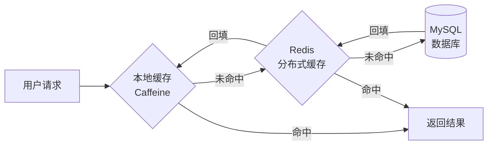
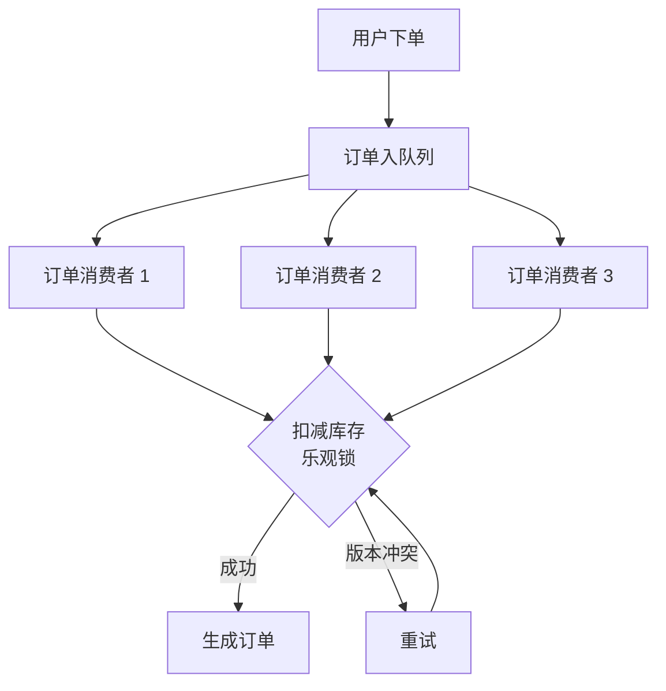
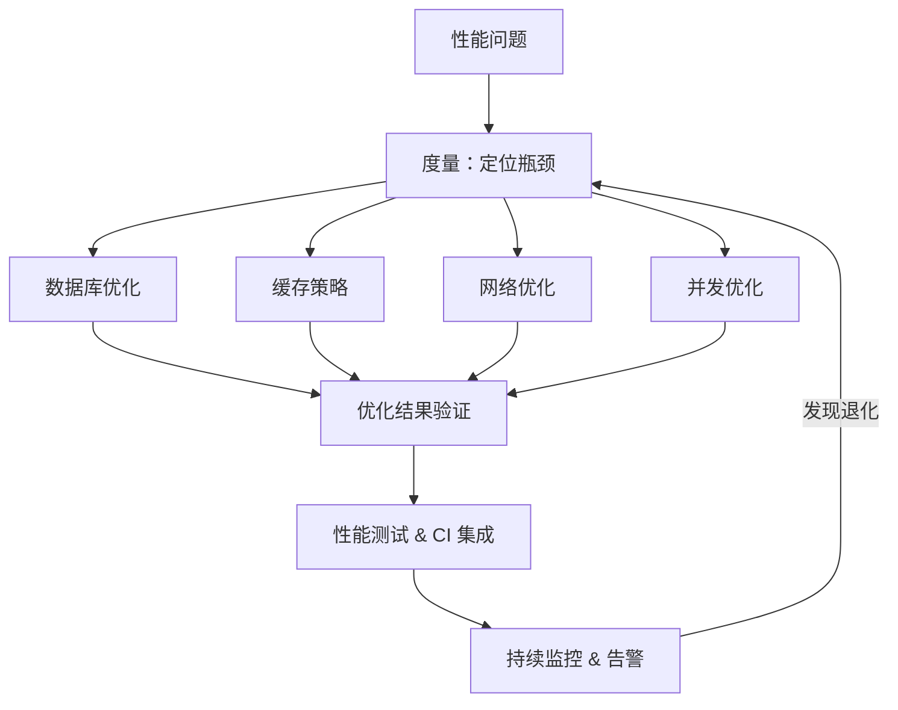

<!--
story:
  number: 16
  type: 正传
  position: 正传 10
  title: 外卖大战
  audience: 工程师 / SRE / 架构师
-->

# 16 · 外卖大战

> 从阿明的"3 秒生死线"，看系统性能优化的全链路方法论

> **系列定位**：本篇是「阿明餐厅」系列的**正传 10**。在[正传 1《高峰保卫战》](./04-peak-traffic-defense.md)中，阿明学会了应对流量洪峰。但外卖场景更残酷 —— 不是"扛住"就行，而是要"快"。顾客 3 秒内不下单，就去别家了。

---

## 引言：3 秒，就是一切

阿明接入外卖平台的第一周，订单量翻了 3 倍。

他还没来得及高兴，平台运营就打来电话："明哥，你们餐厅的下单成功率只有 78%。"这意味着每 5 个顾客中，就有 1 个在等待中超时放弃。

阿明打开后台一看，平均下单响应时间 4.2 秒。行业标杆是多少？1.2 秒。他差了整整 3 秒。

"3 秒还不好？我泡碗面还要 3 分钟呢。"阿明一开始不以为然。

运营冷冷回了一句："用户不会等你泡面。3 秒不下单，他就去隔壁了。"

阿明这才意识到：**性能问题不是技术问题，而是收入问题。每慢 1 秒，就是真金白银的损失。**

---

## 第一章：性能瓶颈 —— 系统到底慢在哪？

阿明召集团队："用户说卡，到底慢在哪？"

运维查了一圈：CPU 利用率 45%，正常。内存使用 60%，正常。磁盘 I/O，也正常。所有人面面相觑 —— 系统看起来一切正常，但用户就是觉得慢。

还是老陈有办法。他打开了链路追踪工具，把一次下单请求拆开来看：网关耗时 20ms，鉴权 15ms，订单服务 180ms，库存服务 2400ms。

"找到了，库存服务。"老陈指着屏幕。进一步分析发现，库存查询走了一次全表扫描。

阿明恍然大悟：原来看似"正常"的系统，瓶颈藏在一个不起眼的查询里。

这正是性能分析的核心方法论 —— **USE 方法**（Utilization / Saturation / Errors）：

| 维度 | 含义 | 餐厅类比 | 检查项 |
|------|------|----------|--------|
| 利用率（Utilization） | 资源被使用的时间比例 | 厨师有多少时间在炒菜 | CPU、内存、磁盘、网络 |
| 饱和度（Saturation） | 排队等待的任务量 | 等位的顾客有多少 | 队列长度、连接池等待 |
| 错误数（Errors） | 失败的事件计数 | 退单、做错的菜 | 超时、异常、重试次数 |

配合火焰图（Flame Graph）和 APM 工具（如 SkyWalking、Jaeger），可以快速定位瓶颈。详见[《厨房装监控》](./05-observability.md)中的链路追踪章节。

**性能分析的核心是"先度量，再优化"，没有度量就没有优化。**

---

## 第二章：数据库优化 —— 从"全表扫描"到"精准查询"

找到瓶颈后，老陈开始分析库存服务的 SQL。

一条查询订单历史的语句，要扫描 500 万条记录。没有索引，数据库只能一行一行翻。就像在仓库里找一种食材，但所有箱子都没贴标签，只能挨个打开看。

老陈加上组合索引后，查询时间从 3 秒降到 3 毫秒。快了 1000 倍。

阿明惊了："就加了一行 `CREATE INDEX`？"

老陈摇头："没那么简单。组合索引的设计大有讲究 —— 不能随便挑几列建个索引就完事。你得先分析应用的查询模式：哪些列经常同时出现在 WHERE 条件中？列的顺序怎么安排才匹配查询的过滤顺序？盲目加索引不仅效果不好，还可能拖慢写入性能。"他展示了数据库优化的四步法：

| 步骤 | 方法 | 餐厅类比 | 关键工具 |
|------|------|----------|----------|
| 慢查询定位 | 开启慢查询日志，找出 Top 10 | 找出最慢的那道菜 | Slow Query Log |
| 执行计划分析 | `EXPLAIN` 查看查询路径 | 看看厨师是按什么顺序做菜的 | EXPLAIN / EXPLAIN ANALYZE |
| 索引优化 | 添加/调整/删除索引 | 给常用食材贴标签，方便取用 | B+Tree 索引、覆盖索引 |
| SQL 改写 | 避免全表扫描、减少 JOIN | 优化菜谱，减少不必要的步骤 | 查询重写、分页优化 |

此外，读写分离让查询不再和写入抢资源。分库分表则解决了单表数据量过大的问题。详见[《架构是"长"出来的》](./02-system-architecture-evolution.md)中的读写分离和分片章节。

阿明从此养成了一个习惯：每次上线前先看慢查询日志。**80% 的性能问题藏在 20% 的查询里 —— 找到它们，就赢了一半。**

---

## 第三章：缓存策略 —— 把热菜放在手边

数据库优化见效了，但高峰期数据库连接数还是告急。

阿明观察到一个规律：80% 的查询集中在 20% 的菜品上。招牌红烧肉、酸菜鱼、宫保鸡丁 —— 这三道菜占了总查询量的一半。

"每次都去数据库查，太浪费了。"阿明把热门菜品数据放进 Redis 缓存。数据库压力骤降 60%。

但缓存不是万能的。老陈提醒阿明注意三种经典异常场景：

| 异常场景 | 含义 | 餐厅类比 | 应对策略 |
|----------|------|----------|----------|
| 缓存穿透（Penetration） | 查询不存在的数据，直接打到数据库 | 有人恶意点一万道菜单上没有的菜，每次都要厨师确认"没有" | 布隆过滤器（先查菜单目录，目录里没有的直接回绝）、空值缓存 |
| 缓存击穿（Breakdown） | 热点 key 过期瞬间，大量请求涌入 | 招牌红烧肉刚好卖完的那一秒，50 个服务员同时跑进厨房问"红烧肉还有吗" | 互斥锁（只让一个人去查，其他人等结果）、永不过期 + 异步更新 |
| 缓存雪崩（Avalanche） | 大量 key 同时过期 | 早上开店时把所有菜的缓存统一设了 2 小时过期，结果 2 小时后所有菜同时"卖完" | 过期时间加随机偏移（每道菜的缓存过期时间错开）、多级缓存 |

阿明设计了三级缓存架构：

本地缓存（Caffeine）响应时间 < 1ms，Redis 响应时间 < 5ms，数据库响应时间 > 50ms。三级缓存让 95% 的请求在 5ms 内返回。

老陈说了一句让阿明记到现在的话：**缓存是用空间换时间，但穿透、击穿、雪崩这三颗雷，任何一个都能把你的"空间"炸回原点。**

---

## 第四章：网络优化 —— 缩短厨房到餐桌的距离

数据库和缓存都优化了，但南方用户还是觉得慢。

阿明查看日志发现，广州用户访问部署在北京的服务器，光是网络往返就要 30ms。加上 TLS 握手、页面加载，首屏时间超过 3 秒。

"厨房在北京，餐桌在广州。菜还没端过去，客人就走了。"

阿明决定接入 CDN（内容分发网络），把静态资源 —— 菜品图片、CSS、JS 文件 —— 分发到全国各地的边缘节点。广州用户从广州节点获取资源，延迟降到 5ms。

网络优化有四大策略：

| 策略 | 核心思想 | 餐厅类比 | 技术方案 |
|------|----------|----------|----------|
| 压缩 | 减小传输体积 | 把菜压紧实，一趟多送点 | Gzip / Brotli 压缩 |
| 就近 | 减少传输距离 | 在各地开分店 | CDN、边缘计算 |
| 复用 | 减少重复传输 | 常用调料提前备好 | HTTP 缓存、长连接 |
| 并行 | 同时传输多个资源 | 多个服务员同时上菜 | HTTP/2 多路复用、HTTP/3 |

阿明还做了几个细节优化：开启 Brotli 压缩（比 Gzip 小 15%）、升级到 HTTP/2（消除 HTTP 层队头阻塞，实现多路复用）、DNS 预解析（减少域名查询时间）。

首屏加载时间从 3.2 秒降到 1.1 秒。

从 3.2 秒到 1.1 秒 —— 阿明第一次意识到：**性能优化不一定在后厨，有时候问题出在厨房到餐桌的距离。**

---

## 第五章：并发优化 —— 同时炒 10 个菜不串味

网络快了，但订单处理还是慢。

原来系统采用串行处理：100 个订单排成一队，一个做完再做下一个。平均每个订单处理 200ms，100 个订单就要 20 秒。

"这就像只有一个灶台，100 个菜排队炒。"阿明决定改成并行处理。

他引入线程池，同时处理 20 个订单。吞吐量从每秒 5 单提升到每秒 25 单。但新问题来了 —— 两个订单同时扣减同一道菜品的库存，出现了"超卖"。就像两个厨师同时伸手去拿最后一份红烧肉，两个人都以为自己拿到了，结果一个顾客等了半天发现没菜。

并发优化的三种模式各有适用场景：

| 模式 | 核心思想 | 餐厅类比 | 适用场景 | 注意事项 |
|------|----------|----------|----------|----------|
| 多线程（Thread Pool） | 多个线程同时执行 | 多个厨师同时炒菜 | CPU 密集型任务 | 线程安全、死锁 |
| 异步处理（Async） | 非阻塞调用，回调处理结果 | 下单后去做别的，菜好了叫号 | I/O 密集型任务 | 回调地狱、异常处理 |
| 消息队列（MQ） | 请求入队，消费者异步处理 | 订单贴墙上，厨师按序取单 | 流量削峰、解耦 | 消息丢失、重复消费 |

阿明用消息队列（RabbitMQ）做了订单削峰：高峰期订单先进队列，后端按能力消费。详见[《高峰保卫战》](./04-peak-traffic-defense.md)中的队列削峰章节。

对于库存扣减，老陈用乐观锁（Optimistic Locking）解决了超卖问题：每次更新库存时检查版本号 —— 就像在红烧肉的盘子上贴个序号，两个厨师伸手前先看看序号有没有变，变了就退回来重新排队。冲突时自动重试，而不是两个订单都以为自己成功了。

并发让吞吐量翻了 5 倍，但超卖的教训也很深刻：**"同时做"的前提是管好"同时抢同一份食材"的问题 —— 乐观锁就是那个协调员。**

---

## 第六章：性能测试与持续监控 —— 不能等上线才发现慢

经过前面五轮优化，下单响应时间从 4.2 秒降到 0.8 秒。下单成功率从 78% 提升到 96%。阿明终于松了口气。

但两周后，一个新功能上线，响应时间又回到了 2 秒。没人注意到，直到用户投诉。

"我们总不能每次等用户骂了才发现问题吧？"阿明决定把性能测试集成到 CI 流水线中。

他建立了四种性能测试体系：

| 测试类型 | 目标 | 方法 | 持续时间 | 关注指标 |
|----------|------|------|----------|----------|
| 基准测试（Benchmark） | 建立性能基线 | 单接口压测 | 5-10 分钟 | 响应时间、吞吐量 |
| 压力测试（Stress） | 找到系统极限 | 逐步加压直到崩溃 | 15-30 分钟 | 最大 QPS、崩溃点 |
| 浸泡测试（Soak） | 发现内存泄漏 | 中等压力持续运行 | 4-24 小时 | 内存趋势、连接泄漏 |
| 峰值测试（Spike） | 验证突发流量 | 瞬间加大压力 | 5-10 分钟 | 恢复时间、降级效果 |

详见[《厨房质检员》](./08-qa-testing-strategy.md)中的测试策略章节。

阿明在 CI 中加入了性能回归检测：每次代码合并，自动运行基准测试。如果 P99 延迟超过基线 10%，流水线自动阻断，开发者必须修复后才能合并。

同时，线上监控持续采集性能指标。P50、P95、P99 延迟曲线、QPS 趋势、错误率 —— 都在 Grafana 大盘上实时展示。任何异常都会触发告警。

**性能测试的核心是把性能问题从"线上事故"变成"测试报告"。**

---

## 核心总结：系统性能优化的全链路方法论

| 策略 | 核心问题 | 餐厅类比 | 技术实现 |
|------|----------|----------|----------|
| 性能分析 | 系统到底慢在哪？ | 给厨房装监控，找到最慢的环节 | APM、火焰图、USE 方法 |
| 数据库优化 | 查询为什么慢？ | 给仓库食材贴标签 | 索引、慢查询分析、读写分离 |
| 缓存策略 | 重复查询如何避免？ | 热门菜品放在手边 | 多级缓存、缓存异常防护 |
| 网络优化 | 传输为什么慢？ | 在各地开分店 | CDN、HTTP/2、压缩 |
| 并发优化 | 串行瓶颈如何突破？ | 多个厨师同时炒菜 | 线程池、异步、消息队列 |
| 性能测试 | 如何持续保证性能？ | 定期模拟高峰期 | 压测、CI 集成、监控告警 |

### 一句心法

**性能优化不是"让系统更快"，而是"让系统在变慢之前就被发现、被解决"。** 优化的优先级永远是：先度量，再优化；先系统级，再代码级。

---

---

## 4 个真实性能优化案例

### 案例 1：数据库慢查询优化（从 5 秒到 50 毫秒）

**问题**：订单列表页 P99 延迟 5 秒，DBA 看慢查询日志发现"订单 + 用户 + 商品"三表 JOIN 没索引。

**优化**：
1. 加复合索引 `(user_id, created_at)` 覆盖主要查询
2. 拆 JOIN 为 2 次查询 + 应用层组装
3. 加 Redis 缓存用户和商品基础信息
4. 引入 ES 做订单搜索（复杂查询走 ES）

**结果**：P99 从 5 秒降到 50 毫秒，DB CPU 从 80% 降到 20%。

**教训**：**80% 的性能问题出在 20% 的慢查询上**。先看慢查询日志，再考虑其他手段。

### 案例 2：缓存击穿导致雪崩

**问题**：某个热点商品的缓存过期瞬间，5 万 QPS 直接打到 DB，DB 被打挂。

**优化**：
1. **永不过期 + 异步刷新**：缓存不设 TTL，后台定时刷新
2. **互斥锁**：缓存过期时只允许 1 个请求查 DB，其他等待
3. **预热**：大促前提前预热热点数据
4. **二级缓存**：本地缓存 + Redis 缓存

**结果**：缓存命中率 99.9%，DB QPS 降到 500。

**教训**：**热点数据必须有"防击穿"机制**。一旦击穿，5 万 QPS 直接打挂 DB。

### 案例 3：网络优化让首屏从 3 秒到 1 秒

**问题**：移动端首屏加载 3 秒，主要瓶颈是"网络请求"。

**优化**：
1. **资源合并**：30 个 JS 合并为 3 个
2. **CDN 加速**：静态资源全走 CDN
3. **Gzip / Brotli 压缩**：资源大小减 70%
4. **HTTP/2 / HTTP/3**：多路复用，头部压缩
5. **预加载 / 预连接**：关键资源 preload

**结果**：首屏从 3 秒降到 1 秒，跳出率下降 40%。

**教训**：**网络优化的杠杆最大**。代码优化 10% 难，网络优化 50% 容易。

### 案例 4：异步化让吞吐量从 100 涨到 5000

**问题**：下单流程同步调用 12 个服务，单次下单 1.5 秒，QPS 上限 100。

**优化**：
1. **同步改异步**：非关键路径（发短信、积分、日志）改成异步消息
2. **并行调用**：用 `Promise.all` 并行调用独立服务
3. **批量处理**：积分扣减、库存扣减用批量
4. **服务降级**：高峰期关闭非核心功能

**结果**：下单耗时从 1.5 秒降到 300 毫秒，QPS 从 100 涨到 5000。

**教训**：**同步调用是性能的天花板**。同步链超过 5 个服务 = 必须异步化。

---

## 性能优化工具选型

| 场景 | 工具 | 用途 |
|------|------|------|
| 前端性能 | Lighthouse / WebPageTest | 首屏 + 资源分析 |
| 后端 APM | SkyWalking / Datadog | 全链路追踪 |
| 数据库 | 慢查询日志 + EXPLAIN | SQL 分析 |
| 缓存 | redis-cli + MONITOR | Redis 分析 |
| 网络 | tcpdump / Wireshark | 抓包分析 |
| 压测 | JMeter / k6 / wrk | 压力测试 |
| 火焰图 | async-profiler / perf | CPU 热点 |
| 内存 | jmap / heap dump | 内存分析 |

**阿明的工具链**：
- 线上监控：SkyWalking（APM）+ Prometheus（指标）
- 压测：k6（云原生友好）
- 数据库：慢查询日志 + EXPLAIN
- 前端：Lighthouse + WebPageTest

---

## 性能优化的 6 个反模式

| # | 反模式 | 后果 |
|---|--------|------|
| 1 | "先优化再说" | 没度量就优化 = 盲目 |
| 2 | "过度优化" | 优化复杂度 > 收益 |
| 3 | "过早优化" | MVP 阶段就做极致优化 |
| 4 | "只看平均值" | 平均 50ms 但 P99 5s 没人发现 |
| 5 | "代码级优先" | 80% 问题在架构层，不在代码 |
| 6 | "优化不持久" | 改完不监控，半年回到原样 |

**核心心法**：**先度量、再优化、先架构、后代码、持续监控**。

- [架构是"长"出来的](./02-system-architecture-evolution.md) —— 系统架构的演进之路，读写分离和分片是数据库性能优化的架构基础
- [当餐厅长出大脑](./01-ai-agent-architecture.md) —— AI Agent 的推理延迟也是一种性能问题，模型选型和缓存策略同样适用
- [高峰保卫战](./04-peak-traffic-defense.md) —— 流量治理的限流、熔断、降级策略，和性能优化的并发控制相辅相成
- [厨房装监控](./05-observability.md) —— 可观测性是性能分析的数据基础，链路追踪帮你找到"慢在哪"
- [食安大检查](./06-security-architecture.md) —— 加密和认证会带来性能开销，需要在安全和性能之间权衡
- [从厨师到 CEO](./07-from-chef-to-ceo.md) —— 性能文化需要团队共识，不能只靠一个人的优化
- [厨房质检员](./08-qa-testing-strategy.md) —— 性能测试是测试金字塔的延伸，应该融入 CI/CD 流程
- [从接单到出餐](./09-cicd-devops.md) —— CI/CD 流水线中集成性能回归测试，防止"优化了又被改回去"
- [菜单设计学](./10-api-design.md) —— API 设计影响性能：Over-fetching 浪费带宽，Under-fetching 增加请求次数
- [给产品经理的重构说明书](./03-refactoring-guide-for-pm.md) —— 性能优化的 ROI 评估，和重构决策一样需要数据支撑
- [学徒的困境](./11-ai-learning-paradox.md) —— AI 时代的人机协作与学习之道，当 AI 越来越强，人还要不要练基本功
- [数据厨房](./12-data-kitchen.md) —— 数据架构与数据治理，10 家店 10 本账如何变成数据驱动决策
- [前厅翻修记](./13-frontend-renovation.md) —— 前端工程化与用户体验，后厨再快，前厅的门进不来一切白搭
- [阿明的省钱经](./14-cloud-finops.md) —— 云成本优化与 FinOps，120 万月账单如何降到 68 万
- [差评危机](./15-incident-response.md) —— 故障复盘与应急响应，从手忙脚乱到 10 分钟止血的方法论
- [传菜窗口的智慧](./20-realtime-eventdriven.md) —— 消息队列的异步解耦本身就是一种性能优化，减少同步等待的延迟
- [十家店的烦恼](./18-distributed-puzzles.md) —— 分布式系统中的一致性开销，共识协议带来的性能损耗与权衡
- [阿明的加盟帝国](./19-saas-multitenant.md) —— 多租户系统的性能隔离，防止"吵闹邻居"拖慢其他租户
- [厨房实况直播](./20-realtime-eventdriven.md) —— 实时推送系统的性能优化，降低消息延迟到毫秒级
- [一个厨房，四个门面](./21-multiplatform-architecture.md) —— 多端性能优化，不同设备的计算能力不同需要适配不同的优化策略
- [懂你的菜单](./22-search-recommendation.md) —— 搜索推荐系统的算法性能优化，索引优化、缓存策略、结果预计算
- [菜谱标准化之路](./07-from-chef-to-ceo.md) —— 性能优化的知识共享，避免不同团队重复踩同一个性能坑
- [仓库搬家不停业](./24-database-migration.md) —— 数据库迁移中的分库分表是数据库层面的性能优化手段
- [预制菜还是现炒](./25-lowcode-platform.md) —— 低代码平台的性能上限受限于运行时架构，与手写代码的性能对比
- [阿明出海记](./26-globalization.md) —— 全球化部署的性能挑战，CDN 和边缘计算降低跨区域延迟
- [厨房大换岗](./27-ai-org-transformation.md) —— AI 转型后的性能新指标，人机协同的响应效率成为新度量
- [阿明的二次创业](./28-ai-native-startup.md) —— AI 原生产品的性能挑战，AI 推理延迟对用户体验的影响
- [会自我进化的厨房](./29-self-evolving-company.md) —— Agent Loop 的性能优化，Agent 循环的效率决定自进化速度
- [AI 的"黑暗料理"](./30-ai-hallucination-safety.md) —— AI 幻觉检测的性能开销，三层护栏的延迟与准确性权衡

---

## 延伸阅读

- [高峰保卫战 · 流量治理](./04-peak-traffic-defense.md) —— 正传 1，性能优化的上游：流量治理避免系统过载
- [厨房装监控 · 可观测性](./05-observability.md) —— 正传 2，性能优化的诊断工具：指标 / 火焰图 / 链路追踪
- [食安大检查 · 安全架构](./06-security-architecture.md) —— 正传 3，安全机制（限流 / 加密）的性能开销
- [差评危机 · 故障响应](./15-incident-response.md) —— 正传 9，性能事故的应急响应与全链路压测
- [仓库搬家不停业 · 数据库迁移](./24-database-migration.md) —— 正传 14，分库分表本身就是数据库层的性能优化
- [懂你的菜单 · 搜索推荐](./22-search-recommendation.md) —— 番外四，搜索 / 推荐系统的索引与缓存性能
- [AI 致命三件套](./33-ai-fatal-trio.md) —— 续集九，AI 推理延迟是新形态的性能瓶颈
- [AI 可观测性](./37-ai-observability.md) —— 续集十三，AI 系统的性能监控（TTFT / TPOT / GPU 利用率）

---

## 跨章节衔接

本篇与[正传 1《高峰保卫战》](./04-peak-traffic-defense.md)紧密关联 —— 流量治理是性能优化的上游防线，高峰期流量过载会直接压垮系统，限流、熔断、降级策略与性能优化的并发控制相辅相成。性能优化的前提是不让系统过载，而过载的根源往往在流量层。

本篇与[正传 2《厨房装监控》](./05-observability.md)和[正传 5《从接单到出餐》](./09-cicd-devops.md)密不可分 —— 可观测性是性能分析的数据基础，没有指标、链路追踪、日志体系就无法定位瓶颈；而 CI/CD 流水线是性能测试的载体，性能回归测试必须集成到持续交付流程中，防止"优化了又被改回去"。

本篇与[续集十二](./36a-ai-token-cost-structure.md)（[成本结构](./36a-ai-token-cost-structure.md) / [成本优化](./36b-ai-token-cost-optimization.md)）形成呼应 —— 性能优化的终极目标之一也是成本控制。资源利用率低意味着浪费 GPU、浪费带宽、浪费预算。性能优化与成本优化的交汇点在于"用更少的资源做更多的事"。

---

## 结语

阿明的外卖大战故事，揭示了一个所有面向用户的系统都必须正视的现实：**用户不会告诉你系统慢了 —— 他们会直接用脚投票。**

答案是六步法：性能分析找到瓶颈，数据库优化消除慢查询，缓存策略减少重复计算，网络优化缩短传输距离，并发优化突破串行瓶颈，性能测试确保持续达标。

下次当你面对性能问题时，不妨问自己：

1. 你知道你的系统 P99 延迟是多少吗？有没有基线？
2. 你的数据库慢查询 Top 10 是什么？优化了吗？
3. 你有缓存策略吗？缓存命中率是多少？
4. 你做过性能压测吗？系统的最大吞吐量是多少？
5. 你的 CI 中有性能回归测试吗？还是等用户反馈才发现变慢？

> 好的性能优化，不是"让系统永远快"，而是"让系统在变慢之前就被发现、被解决"。

---

← [返回系列导读](./index.md)
