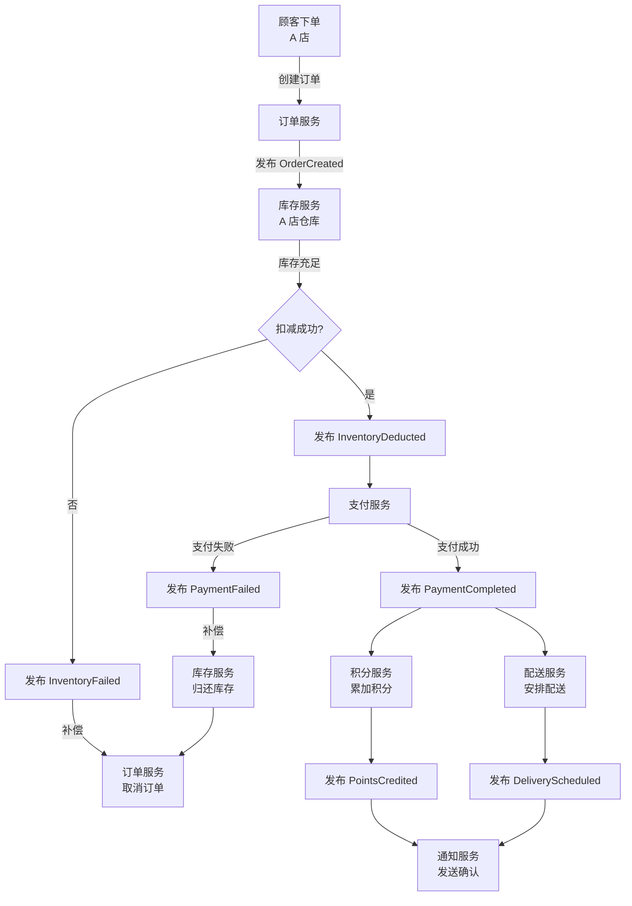
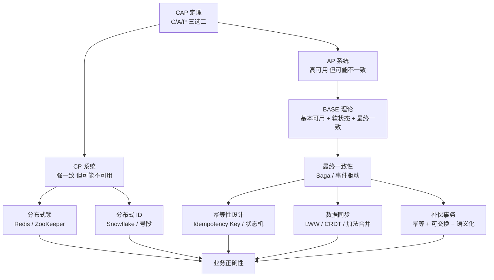

<!--
story:
  number: 18
  type: 正传
  position: 正传 12
  title: 十家店的烦恼
  audience: 工程师 / SRE / 架构师
-->

# 18 · 十家店的烦恼

> 从阿明连锁扩张中的"同一个事实"问题，看分布式系统的经典难题

> **系列定位**：本篇是「阿明餐厅」系列的**正传 12**。在[前传](./02-system-architecture-evolution.md)中，阿明的系统从单机演进到分布式。但分布式不只是"把系统拆开" —— 拆开后，**一致性、可用性、分区容错性**的三角博弈才刚刚开始。如果你刚读完正传 11[《传菜窗口的智慧》](./20-realtime-eventdriven.md)，你会发现消息队列解决了服务间通信的问题，但又引出了新的难题：**当 10 个节点各自处理消息时，怎么保证它们看到的是"同一个事实"？**

---

## 引言：10 本账本，10 个"真相"

阿明的生意越做越大，开了 10 家连锁门店。每家店都有自己的收银系统、库存系统和会员系统，通过[消息队列](./20-realtime-eventdriven.md)互联。

看起来一切完美 —— 直到诡异的事情开始发生。

周一上午，一位老顾客在 A 店充值了 100 元会员积分。下午他兴冲冲跑到 B 店想用积分换一碗面，B 店的系统显示："积分余额：0"。顾客大怒，打电话投诉。

同一天，C 店的红烧牛肉面已经售罄，系统显示"已售罄"。但 D 店的系统还在接单 —— 因为它没收到 C 店的库存更新消息。10 个外卖订单涌入 D 店，全部无法履约。

更离谱的是，E 店和 F 店同时给同一桌客人打了 8 折。两个折扣叠加，系统算出了负数价格 —— 顾客不仅没花钱，账户里还多了 12 块钱。

阿明焦头烂额地找到老陈："这到底是怎么回事？每家店的系统都是好的，怎么凑在一起就全乱了？"

老陈苦笑着说："10 家店各有各的账本，这就是分布式的代价。**你以为你有 1 个系统，其实你有 10 个。它们之间达成一致的速度，永远赶不上事情发生的速度。**"

---

## 第一章：CAP 定理 —— 鱼和熊掌不可兼得

老陈在白板上画了一个三角形，三个顶点分别写着 C、A、P。

"阿明，你的 10 家店遇到的问题，在 2000 年就被一个叫 Eric Brewer 的人想清楚了。他提出了 **CAP 定理**：在一个分布式系统中，以下三个特性最多只能同时满足两个。"

| 特性 | 全称 | 含义 | 餐厅类比 |
|------|------|------|----------|
| **C** | Consistency（一致性） | 所有节点看到相同的数据 | 10 家店的账本完全一致 |
| **A** | Availability（可用性） | 每个请求都能得到响应 | 任何一家店都能正常服务 |
| **P** | Partition Tolerance（分区容错） | 网络分区时系统仍能运行 | 两家店之间断网了还能营业 |

阿明问："那我们应该选哪两个？"

老陈摇头："'三选二'是过度简化。P 在分布式系统中是**必须**的（网络分区不可避免），所以实际选择是 **CP（强一致但可能不可用）** 还是 **AP（高可用但可能不一致）**。"

### CP vs AP vs CA 系统对比

| 类型 | 选择 | 代表系统 | 特点 | 餐厅类比 |
|------|------|----------|------|----------|
| CP | 一致 + 分区容错 | ZooKeeper、Redis Cluster、etcd | 网络分区时，部分节点拒绝服务以保证一致（注：Redis Cluster 的 CP 特性存在争议，部分专家认为其本质为 AP） | 账本不对就不营业 |
| AP | 可用 + 分区容错 | Cassandra、DynamoDB、CouchDB | 网络分区时，各节点独立服务，可能不一致 | 先营业再说，账本后面核对 |
| CA | 一致 + 可用 | 单机 MySQL、PostgreSQL | 不支持网络分区（单节点） | 只有一家店，不存在对账问题 |

### BASE 理论：务实的妥协

老陈接着说："在实际工程中，大多数互联网系统选择了 AP，然后用 **BASE 理论** 来弥补一致性的缺失。"

| BASE | 全称 | 含义 | 餐厅类比 |
|------|------|------|----------|
| **BA** | Basically Available（基本可用） | 系统在故障时仍提供核心功能 | 账本不对也能做菜，但积分兑换暂停 |
| **S** | Soft State（软状态） | 系统状态可以在某个时刻不一致 | 各店的账本暂时不同步 |
| **E** | Eventually Consistent（最终一致） | 经过一段时间后，所有节点达到一致 | 每天打烊后对账，第二天一致 |

"你的积分系统不需要实时一致，"老陈分析，"顾客在 A 店充了积分，B 店延迟几秒看到就够了。这就是**最终一致性**。但如果是对账和库存扣减，就必须**强一致** —— 不能出现超卖。"

> 💡 **金句**：CAP 不是"三选二"的选择题，而是"一致性和可用性的光谱"。每个业务场景在这条光谱上的位置不同。

---

## 第二章：分布式锁 —— 谁来当裁判？

阿明的 E 店和 F 店同时给同一桌客人打折，导致了负数价格。老陈说："这是因为两个节点同时操作了同一份数据，没有'裁判'来协调。在单机系统中，我们用锁来解决；在分布式系统中，需要**分布式锁**。"

### 为什么本地锁在分布式环境失效？

```text
单机场景（本地锁有效）：
  线程 A ─┐
          ├─→ [互斥锁] ─→ 只有一个人能操作数据
  线程 B ─┘

分布式场景（本地锁失效）：
  E 店服务器 ─→ [本地锁 A] ─→ 操作数据  ┐
                                         ├─→ 没有互斥！两个操作同时执行！
  F 店服务器 ─→ [本地锁 B] ─→ 操作数据  ┘

  因为 E 店的锁和 F 店的锁是两把不同的锁，互相不知道对方的存在。
```

### Redis 分布式锁

老陈的方案是用 Redis 实现分布式锁："10 家店的系统都连着同一个 Redis，让 Redis 来当裁判。"

```python
import redis
import time
import uuid

redis_client = redis.Redis(host='redis-cluster', port=6379, decode_responses=True)

class DistributedLock:
    def __init__(self, name, timeout=10, retry_delay=0.1):
        self.name = f"lock:{name}"
        self.timeout = timeout        # 锁的过期时间（秒），防止死锁
        self.retry_delay = retry_delay  # 获取失败时的重试间隔
        self.token = str(uuid.uuid4())  # 唯一标识，防止误删别人的锁

    def acquire(self, wait_time=5):
        """尝试获取锁"""
        end_time = time.time() + wait_time
        while time.time() < end_time:
            # SET key value NX EX timeout
            # NX: 只在 key 不存在时设置（互斥）
            # EX: 设置过期时间（防死锁）
            if redis_client.set(self.name, self.token, nx=True, ex=self.timeout):
                return True
            time.sleep(self.retry_delay)
        return False

    def release(self):
        """释放锁（Lua 脚本保证原子性）"""
        # 必须用 Lua 脚本！
        # 如果分两步（GET + DEL），可能在 GET 和 DEL 之间锁已过期并被别人获取
        lua_script = """
        if redis.call("get", KEYS[1]) == ARGV[1] then
            return redis.call("del", KEYS[1])
        else
            return 0
        end
        """
        return redis_client.eval(lua_script, 1, self.name, self.token)


# 使用示例：对同一桌客人的折扣操作加锁
lock = DistributedLock(name="discount:table-12", timeout=10)

if lock.acquire(wait_time=5):
    try:
        # 只有拿到锁的门店才能给这桌打折
        apply_discount(table_id="table-12", discount=0.8)
        print("✅ 折扣应用成功")
    finally:
        lock.release()
else:
    print("⏳ 获取锁超时，可能另一个门店正在操作这桌")
```

### Redlock 算法的争议

老陈特别提到了 Redlock："Redis 作者 Antirez 提出了 Redlock 算法 —— 在 5 个独立的 Redis 节点上加锁，多数成功才算获取锁。但分布式系统专家 Martin Kleppmann 写了一篇著名的文章反驳它，核心论点是：**用 Redis 做分布式锁，本质上是在用 AP 系统解决 CP 问题** —— 如果 Redis 主从切换发生在加锁之后、业务执行之前，锁可能丢失。"

| 方案 | 优点 | 缺点 | 适用场景 |
|------|------|------|----------|
| Redis SETNX | 简单、高性能 | 主从切换可能丢锁 | 非关键业务（允许极小概率重复执行） |
| Redlock | 多节点冗余 | 争议大、复杂度高 | 中等重要业务 |
| ZooKeeper 临时有序节点 | 强一致、无丢锁风险 | 性能较低、运维复杂 | 关键业务（金融、库存扣减） |
| 数据库乐观锁 | 简单、无额外依赖 | 性能低、冲突率高 | 低并发场景 |

### ZooKeeper 方案

"如果你的业务绝对不能重复执行（比如退款），"老陈说，"用 ZooKeeper 更稳妥。"

```text
ZooKeeper 分布式锁原理：

  1. 所有节点在 /locks/discount-table-12 下创建临时有序节点
  2. 每个节点检查自己是否是序号最小的
     - 是 → 获取锁，执行业务逻辑
     - 否 → Watch 前一个节点，等待它删除
  3. 业务完成后删除节点 → 下一个节点自动获取锁

  /locks/discount-table-12/
    ├── lock-0000000001 (E 店) ← 最小，获取锁
    ├── lock-0000000002 (F 店) ← Watch E 店，等待
    └── lock-0000000003 (G 店) ← Watch F 店，等待

  优势：
  - 临时节点：客户端崩溃后自动删除，不会死锁
  - 有序节点：公平锁，先来的先服务
  - Watch 机制：不需要轮询，不会"惊群"
```

> 💡 **金句**：分布式锁的本质是"找一个所有人都信任的裁判"。Redis 是快但偶尔走眼的裁判，ZooKeeper 是慢但绝对公正的裁判。

---

## 第三章：分布式 ID —— 全局唯一编号

阿明的另一个头疼问题：每家店的订单号都是自增的（1、2、3……），合并到总部的数据库后，A 店的第 100 号和 B 店的第 100 号冲突了。

"我们需要全局唯一的 ID，"老陈说，"而且这个 ID 还要有序、高效、不依赖中心化服务。"

### 各种 ID 生成方案对比

| 方案 | 示例 | 优点 | 缺点 |
|------|------|------|------|
| 数据库自增 | 1, 2, 3, ... | 简单、有序 | 单点瓶颈，分库后冲突 |
| UUID | `550e8400-e29b-41d4-a716-446655440000` | 全局唯一，无需协调 | 无序（B+ 树频繁分裂）、太长（36 字符） |
| 号段模式 | 每次从 DB 取一段（1-1000, 1001-2000） | 有序、高性能 | 依赖数据库，号段用完需重新获取 |
| 雪花算法 | `1761234567890123456`（64 bit） | 有序、高性能、无中心化 | 依赖时钟，时钟回拨有风险 |

### 雪花算法（Snowflake）

老陈推荐了雪花算法："Twitter 开源的方案，64 位整数，天然有序，每台机器独立生成，不需要互相通信。"

```text
Snowflake ID 结构（64 bit）：

  0 |  41 bit 时间戳  | 10 bit 机器 ID | 12 bit 序列号
  ↑       ↑                ↑              ↑
  │       │                │              │
  │       │                │              └─ 同一毫秒内最多 4096 个 ID
  │       │                └─ 最多 1024 台机器
  │       └─ 毫秒级，可用约 69 年
  └─ 符号位，始终为 0

  示例：
  时间戳: 1761234567890 (毫秒)
  机器 ID: 3 (A 店 = 0, B 店 = 1, ... J 店 = 9)
  序列号: 42

  生成 ID: (1761234567890 << 22) | (3 << 12) | 42
          = 7389012345678901234
```

```python
import time
import os

class SnowflakeGenerator:
    # 起始时间戳：2026-01-01 00:00:00 UTC
    EPOCH = 1735689600000

    # 位数分配
    WORKER_ID_BITS = 10    # 机器 ID 位数
    SEQUENCE_BITS = 12     # 序列号位数

    MAX_WORKER_ID = (1 << WORKER_ID_BITS) - 1    # 1023
    MAX_SEQUENCE = (1 << SEQUENCE_BITS) - 1       # 4095

    WORKER_ID_SHIFT = SEQUENCE_BITS               # 12
    TIMESTAMP_SHIFT = SEQUENCE_BITS + WORKER_ID_BITS  # 22

    def __init__(self, worker_id):
        if worker_id > self.MAX_WORKER_ID:
            raise ValueError(f"Worker ID 不能超过 {self.MAX_WORKER_ID}")
        self.worker_id = worker_id
        self.sequence = 0
        self.last_timestamp = -1

    def _current_millis(self):
        return int(time.time() * 1000)

    def _wait_next_millis(self, last_timestamp):
        """时钟回拨保护：等待到下一个毫秒"""
        timestamp = self._current_millis()
        while timestamp <= last_timestamp:
            timestamp = self._current_millis()
        return timestamp

    def next_id(self):
        timestamp = self._current_millis()

        # 时钟回拨检测
        if timestamp < self.last_timestamp:
            offset = self.last_timestamp - timestamp
            if offset <= 5:
                # 回拨 ≤ 5ms，等待追赶
                time.sleep(offset / 1000.0)
                timestamp = self._current_millis()
                if timestamp < self.last_timestamp:
                    raise RuntimeError(f"时钟回拨 {offset}ms，拒绝生成 ID")
            else:
                raise RuntimeError(f"时钟回拨 {offset}ms，超过安全阈值")

        if timestamp == self.last_timestamp:
            # 同一毫秒，序列号递增
            self.sequence = (self.sequence + 1) & self.MAX_SEQUENCE
            if self.sequence == 0:
                # 当前毫秒的序列号用完了，等待下一毫秒
                timestamp = self._wait_next_millis(self.last_timestamp)
        else:
            self.sequence = 0

        self.last_timestamp = timestamp

        return (
            ((timestamp - self.EPOCH) << self.TIMESTAMP_SHIFT) |
            (self.worker_id << self.WORKER_ID_SHIFT) |
            self.sequence
        )


# 使用示例
generator = SnowflakeGenerator(worker_id=3)  # D 店的机器 ID
order_id = generator.next_id()
print(f"订单号: {order_id}")  # 例如: 7389012345678901234
```

### 时钟回拨问题

老陈特别强调了时钟回拨："如果服务器的 NTP 同步导致时钟回拨，雪花算法可能生成重复 ID。应对方案有三种："

| 方案 | 说明 | 适用场景 |
|------|------|----------|
| 等待追赶 | 回拨 ≤ 5ms 时等待 | 小幅 NTP 同步 |
| 拒绝服务 | 回拨 > 5ms 时抛异常 | 安全优先 |
| 备用 Worker ID | 回拨时切换到另一个 Worker ID | 高可用要求 |

> 💡 **金句**：分布式 ID 的设计目标不是"绝对唯一"，而是"在可接受的复杂度下，让冲突概率低到可以忽略"。雪花算法做到了这一点。

---

## 第四章：最终一致性实战 —— 一致还是最终一致？

阿明问老陈："那我们的系统到底要不要强一致？"

老陈的回答是："看场景。有些场景必须强一致（比如库存扣减），有些场景可以最终一致（比如积分累加）。"

### 强一致 vs 最终一致

| 维度 | 强一致（2PC / TCC） | 最终一致（Saga / 事件驱动） |
|------|---------------------|---------------------------|
| 一致性 | 所有节点同时成功或同时失败 | 允许短暂不一致，最终达到一致 |
| 性能 | 低（需要全局协调） | 高（各节点独立执行） |
| 可用性 | 低（任一节点失败则全局失败） | 高（局部失败可补偿） |
| 复杂度 | 中（框架处理协调） | 高（需设计补偿逻辑） |
| 适用场景 | 金融转账、库存扣减 | 订单通知、积分累加、物流追踪 |
| 餐厅类比 | 10 家店同时确认才能下单 | 先下单，出问题再补救 |

### TCC：预订座位的类比

老陈用"预订座位"来解释 TCC（Try-Confirm-Cancel）：

```text
TCC 三阶段（用预订座位类比）：

Try（预留）：
  "帮我留 2 个座位" → 餐厅在系统中标记 2 个座位为"预留"
  - 资源已预留，但未真正使用
  - 类似：库存"冻结"（不是扣减）

Confirm（确认）：
  "确定来吃，确认预订" → 预留的座位变成"已占用"
  - 真正执行业务逻辑
  - 类似：库存正式扣减

Cancel（取消）：
  "不来了，取消预订" → 释放预留的座位
  - 回滚 Try 阶段的预留
  - 类似：库存解冻
```

### Saga 编排式在连锁餐厅的应用

老陈为阿明的连锁系统设计了一个 Saga 编排式的下单流程：



### 补偿事务的设计原则

老陈总结了补偿事务的四个原则：

```text
补偿事务设计原则：

1. 幂等性：补偿操作可以重复执行，结果不变
   → "归还库存"执行多次，库存只增加一次

2. 可交换性：补偿操作的顺序不影响最终结果
   → 先"归还库存"再"取消订单"，和反过来，结果一样

3. 语义化：补偿不是"撤销"，而是"对冲"
   → 不是"删除扣款记录"，而是"增加一条退款记录"

4. 最终成功：补偿操作必须最终成功（可重试，不能失败）
   → 如果"归还库存"失败了，必须一直重试直到成功
```

> 💡 **金句**：强一致是"所有人同时签字"，最终一致是"先各自执行，有问题再补救"。大多数互联网业务，最终一致就够了 —— 但你要清楚地知道"不一致的窗口"有多大。

---

## 第五章：幂等性设计 —— 重试是常态

在展开之前，先厘清第二章的分布式锁和这一章的幂等性之间的关系 —— 它们都在解决"防止重复操作"，但思路截然不同：

- **分布式锁**是"不让两个人同时做同一件事" —— 通过互斥，从源头防止问题发生。
- **幂等性**是"做了两次也只算一次" —— 通过去重，确保问题发生后重试也是安全的。

两者配合使用才是最稳妥的方案：分布式锁挡住大部分并发冲突，幂等性兜住锁失效或重试场景下的安全网。

在[正传 11](./20-realtime-eventdriven.md)中，阿明学会了消息的幂等消费。但在分布式系统中，幂等性不只是消息层面的问题 —— **所有的写操作都可能需要重试**。

阿明问："为什么分布式环境中'重试'是常态？"

老陈列出了原因：网络超时（不知道对方是否收到了）、节点故障（处理到一半挂了）、并发冲突（乐观锁版本号不匹配）。这些场景下，最自然的应对就是重试 —— 但如果操作不幂等，重试就会出问题。

### HTTP 方法的幂等性

| HTTP 方法 | 天然幂等？ | 说明 | 餐厅类比 |
|-----------|-----------|------|----------|
| GET | ✅ 是 | 只读操作，重复执行结果不变 | 看一眼菜单，看多少次都一样 |
| POST | ❌ 否 | 创建资源，重复执行会创建多份 | 点一次菜多一份，点两次就两份 |
| PUT | ✅ 是 | 替换资源，重复执行结果不变 | "把这桌换成 3 号套餐"，说多少次都是 3 号 |
| PATCH | ⚠️ 视情况 | 部分更新，如果包含增量操作则不幂等 | "加一碗饭"重复两次就两碗 |
| DELETE | ✅ 是 | 删除资源，重复执行结果不变（但并发时需注意） | "取消订单"，取消多少次都是取消 |

### 幂等令牌（Idempotency Key）

老陈给阿明的支付接口设计了幂等令牌方案：

```python
# 幂等令牌方案：客户端生成唯一令牌，服务端去重
from flask import Flask, request, jsonify
import redis
import json

app = Flask(__name__)
redis_client = redis.Redis(host='redis', port=6379, decode_responses=True)

@app.route('/api/payment', methods=['POST'])
def create_payment():
    # 1. 提取幂等令牌（客户端生成，每次操作唯一）
    idempotency_key = request.headers.get('Idempotency-Key')
    if not idempotency_key:
        return jsonify({'error': 'Missing Idempotency-Key header'}), 400

    # 2. 检查是否已经处理过
    cached = redis_client.get(f"idempotency:{idempotency_key}")
    if cached:
        # 已处理过，直接返回之前的结果（幂等！）
        return jsonify(json.loads(cached)), 200

    # 3. 首次处理：加锁防止并发
    lock_key = f"idempotency:lock:{idempotency_key}"
    if not redis_client.set(lock_key, "1", nx=True, ex=30):
        return jsonify({'error': 'Request is being processed'}), 409

    try:
        # 4. 执行业务逻辑
        payment = process_payment(
            order_id=request.json['order_id'],
            amount=request.json['amount']
        )

        # 5. 缓存结果（24 小时过期）
        result = {
            'payment_id': payment.id,
            'status': payment.status,
            'amount': payment.amount
        }
        redis_client.setex(
            f"idempotency:{idempotency_key}",
            86400,
            json.dumps(result)
        )

        return jsonify(result), 201

    except Exception as e:
        redis_client.delete(lock_key)
        raise e
```

### 数据库唯一约束

```text
方案一：数据库唯一约束（最可靠）

  CREATE TABLE payments (
      id BIGINT PRIMARY KEY,
      order_id BIGINT NOT NULL,
      idempotency_key VARCHAR(64) UNIQUE NOT NULL,  -- 唯一约束
      amount DECIMAL(10,2),
      status VARCHAR(20),
      created_at TIMESTAMP DEFAULT CURRENT_TIMESTAMP
  );

  -- 如果重复提交相同的 idempotency_key，INSERT 会失败
  -- 捕获异常后查询已有记录返回即可

方案二：状态机防重入

  UPDATE orders
  SET status = 'PAID', paid_at = NOW()
  WHERE order_id = 123
    AND status = 'PENDING';  -- 只有 PENDING 状态才能变成 PAID

  -- 如果 affected_rows = 0，说明已经处理过或状态不对
  -- 天然防重入
```

### 状态机设计

```text
订单状态机（防止重复操作）：

  PENDING ──→ PAID ──→ SHIPPED ──→ DELIVERED ──→ COMPLETED
     │          │                                        │
     └──→ CANCELLED                                     │
               ↑                                         │
               └──────────── REFUNDED ←─────────────────┘

  规则：
  - 只有 PENDING → PAID，不能 PAID → PAID（防重复支付）
  - 只有 PAID → SHIPPED，不能 SHIPPED → SHIPPED（防重复发货）
  - 状态转换通过 UPDATE ... WHERE status = '当前状态' 实现原子性
```

> 💡 **金句**：在分布式世界里，"重试"不是异常，而是常态。幂等性不是可选项，而是每个写接口都必须具备的品质。

---

## 第六章：数据同步与冲突解决 —— 10 本账怎么合并？

阿明的最后一个大问题：10 家店的会员积分数据，怎么同步到一起？

老陈说："这本质上是**多活数据同步**的问题。每家店都在独立修改数据，当它们需要同步时，冲突不可避免。关键是 —— 怎么解决冲突？"

### 多活数据同步策略

| 策略 | 原理 | 优点 | 缺点 | 适用场景 |
|------|------|------|------|----------|
| Last-Write-Wins（LWW） | 最后写入的覆盖之前的 | 简单 | 可能丢数据 | 用户配置、偏好设置 |
| CRDT | 无冲突复制数据类型 | 自动合并，无冲突 | 实现复杂，内存开销大 | 协同编辑、分布式计数器 |
| 向量时钟 | 用向量记录因果关系 | 能检测真正的并发 | 复杂度高 | 分布式数据库 |
| 加法合并 | 各节点独立累加，汇总时相加 | 简单、直觉 | 只适用于可加操作 | 积分、计数器、余额 |

### 阿明的积分系统：加法合并

老陈为阿明的积分系统设计了一个"加法合并"策略：

```text
积分同步方案（加法合并）：

  A 店本地：+100（充值）、-30（消费）→ 本地变更：+70
  B 店本地：+50（充值）、-20（消费）→ 本地变更：+30
  C 店本地：+200（充值）、-80（消费）→ 本地变更：+120

  同步到中央：
    中央积分 = 各店本地变更之和
            = 70 + 30 + 120
            = +220

  注意：不同步"余额"，只同步"变更量"
  → 余额 = 上次同步余额 + 本次变更之和
  → 避免"最后写入覆盖"的问题
```

```python
# 积分同步服务（定期从各店汇总变更）
import pymysql
from datetime import datetime

stores_db = {
    'store_a': pymysql.connect(host='store-a-db', db='members'),
    'store_b': pymysql.connect(host='store-b-db', db='members'),
    # ... 其他门店
}

central_db = pymysql.connect(host='central-db', db='members')

def sync_points(store_id, store_conn):
    """从门店同步积分变更到中央"""
    cursor = store_conn.cursor()

    # 获取上次同步时间
    last_sync = get_last_sync_time(store_id)

    # 查询自上次同步以来的所有变更
    cursor.execute("""
        SELECT member_id, SUM(delta) as total_delta
        FROM points_journal
        WHERE created_at > %s
        GROUP BY member_id
    """, (last_sync,))

    changes = cursor.fetchall()

    # 写入中央数据库（加法合并）
    central_cursor = central_db.cursor()
    for member_id, total_delta in changes:
        central_cursor.execute("""
            INSERT INTO member_points (member_id, points, last_sync)
            VALUES (%s, %s, %s)
            ON DUPLICATE KEY UPDATE
                points = points + VALUES(points),
                last_sync = VALUES(last_sync)
        """, (member_id, total_delta, datetime.now()))

    central_db.commit()
    update_last_sync_time(store_id, datetime.now())
    print(f"✅ {store_id} 同步完成，共 {len(changes)} 个会员的积分变更")


# 每 5 分钟同步一次
for store_id, conn in stores_db.items():
    sync_points(store_id, conn)
```

### 冲突检测与合并

对于更复杂的数据（比如会员信息：姓名、手机号、地址），老陈用了更精细的冲突处理策略：

```text
会员信息冲突处理策略：

  字段级别合并（而非记录级别）：
    A 店修改了手机号：138xxxx → 139xxxx
    B 店修改了地址：朝阳路 → 建国路

    合并结果：手机号 = 139xxxx，地址 = 建国路
    → 不冲突！因为它们修改的是不同字段

  真正冲突的处理（同一字段被两家店同时修改）：
    A 店修改了手机号：138xxxx → 139xxxx
    B 店修改了手机号：138xxxx → 150xxxx

    策略选择：
    ① Last-Write-Wins：以最后写入的为准（简单但可能丢数据）
    ② 人工审核：标记为冲突，由客服确认（安全但慢）
    ③ 业务规则：以"更高权限门店"的修改为准

  阿明的选择：手机号等关键字段用"人工审核"，非关键字段用 LWW
```

> 💡 **金句**：数据同步的核心不是"怎么搬运数据"，而是"怎么解决冲突"。最好的策略是设计数据结构时就避免冲突 —— 比如用"加法合并"代替"覆盖写入"。

---

## 核心总结：分布式系统的核心权衡



| 章节 | 核心问题 | 解决方案 | 关键技术 |
|------|----------|----------|----------|
| 第一章 | CAP 定理的约束 | 按业务场景选择 CP 或 AP | CAP + BASE 理论 |
| 第二章 | 分布式互斥 | 分布式锁（Redis/ZooKeeper） | SETNX + Lua 脚本 |
| 第三章 | 全局唯一标识 | 雪花算法生成有序 ID | Snowflake + 时钟回拨保护 |
| 第四章 | 分布式事务 | 按场景选 TCC 或 Saga | TCC + Saga 编排/协调 |
| 第五章 | 重试安全 | 幂等性设计 | Idempotency Key + 状态机 |
| 第六章 | 数据同步冲突 | 选择合适的冲突解决策略 | 加法合并 + 字段级合并 |

### 一句心法

**分布式没有银弹，只有权衡。选强一致就接受慢，选最终一致就接受乱 —— 关键是知道自己在放弃什么。**

---

## 延伸阅读

- [架构是"长"出来的](./02-system-architecture-evolution.md) —— 分布式难题的起点：从单机到分布式的演进路径和代价
- [当餐厅长出大脑](./01-ai-agent-architecture.md) —— AI Agent 的多智能体协同也面临分布式一致性问题
- [高峰保卫战](./04-peak-traffic-defense.md) —— 分布式锁在高并发场景下的应用（限流、库存扣减）
- [厨房装监控](./05-observability.md) —— 分布式系统的可观测性比单机系统更重要，链路追踪是定位一致性问题的利器
- [食安大检查](./06-security-architecture.md) —— 分布式环境下的安全挑战：密钥分发、证书轮换、零信任网络
- [给产品经理的重构说明书](./03-refactoring-guide-for-pm.md) —— 从单体到分布式的重构，是最复杂的架构级决策
- [从厨师到 CEO](./07-from-chef-to-ceo.md) —— 分布式系统的运维需要平台工程（IDP）支撑，让团队不用重复造轮子
- [厨房质检员](./08-qa-testing-strategy.md) —— 分布式系统的测试比单体复杂得多，需要契约测试、集成测试、混沌工程
- [从接单到出餐](./09-cicd-devops.md) —— 分布式系统的部署策略：多服务协同发布、回滚、灰度
- [菜单设计学](./10-api-design.md) —— 分布式系统中 API 的幂等性设计，是接口契约的核心要素
- [学徒的困境](./11-ai-learning-paradox.md) —— 分布式系统的设计思维是工程师成长的核心能力之一
- [数据厨房](./12-data-kitchen.md) —— 数据同步和数据治理是分布式系统在数据层面的延伸
- [前厅翻修记](./13-frontend-renovation.md) —— 前端的状态管理和离线缓存也面临一致性问题
- [阿明的省钱经](./14-cloud-finops.md) —— 分布式系统的成本优化：多活架构的冗余成本 vs 单点故障的业务损失
- [差评危机](./15-incident-response.md) —— 分布式系统中的一致性问题是最常见的故障场景，应急和复盘策略
- [外卖大战](./16-performance-optimization.md) —— 分布式一致性（如分布式锁）对性能的影响，以及如何在一致性和性能之间取得平衡
- [传菜窗口的智慧](./20-realtime-eventdriven.md) —— 消息队列是分布式系统的"神经系统"，本篇的消息可靠性、幂等消费与本章紧密关联
- [阿明的加盟帝国](./19-saas-multitenant.md) —— 多租户架构中的租户隔离和数据同步，是分布式一致性在 SaaS 场景的应用
- [厨房实况直播](./20-realtime-eventdriven.md) —— 事件溯源（Event Sourcing）是分布式系统中"最终一致"的典型实现模式
- [一个厨房，四个门面](./21-multiplatform-architecture.md) —— 多端架构的离线同步和冲突解决，与本章的数据同步策略相通
- [懂你的菜单](./22-search-recommendation.md) —— 推荐系统的特征数据需要跨区域同步，涉及最终一致性和数据冲突
- [菜谱标准化之路](./07-from-chef-to-ceo.md) —— 分布式系统的设计决策（CAP 选型、锁方案）应该记录为 ADR
- [仓库搬家不停业](./24-database-migration.md) —— 分库分表是分布式系统在数据层的落地，本章的分布式 ID 是分片的前提
- [预制菜还是现炒](./25-lowcode-platform.md) —— 低代码平台在多区域部署时同样面临分布式一致性问题
- [阿明出海记](./26-globalization.md) —— 多区域部署是分布式系统在地理维度的延伸，Active-Active 和跨区域同步
- [厨房大换岗](./27-ai-org-transformation.md) —— AI 转型中的分布式协调，多 Agent 协同面临分布式一致性挑战
- [阿明的二次创业](./28-ai-native-startup.md) —— AI 原生创业的分布式设计，从一开始就考虑多 Agent 的协调问题
- [会自我进化的厨房](./29-self-evolving-company.md) —— Agent Loop 的分布式部署，多个 Agent 循环如何在全局保持一致
- [AI 的"黑暗料理"](./30-ai-hallucination-safety.md) —— AI 幻觉在分布式环境中放大，一个 Agent 的错误可能级联传播

## 跨章节衔接

- [20-realtime-eventdriven.md](./20-realtime-eventdriven.md) —— 正传 11，分布式难题的异步解法：事件驱动是分布式一致性的实践路径之一
- [12-data-kitchen.md](./12-data-kitchen.md) —— 正传 7，CAP 权衡在数据层的具体体现：分库分表后的分布式事务
- [24-database-migration.md](./24-database-migration.md) —— 正传 14，分布式环境下的数据迁移挑战：流量切换、双写校验、回滚预案

---

## 结语

阿明的 10 家店，最终找到了各自的平衡点。

积分系统选择了最终一致 —— 顾客在 A 店充的积分，B 店最多延迟 5 分钟看到。老陈在系统中加了一行温馨提示："积分变更正在同步中，预计 5 分钟内生效。"顾客反而觉得透明、可信。

库存扣减选择了强一致 —— 用分布式锁确保同一份库存不会被两家店同时卖出。偶尔会有顾客下单后被告知"库存不足"，但总比超卖后无法履约好。

分布式 ID 用雪花算法 —— 每家店的订单号不再冲突，总部合并数据时一目了然。

三个月后，阿明坐在总部的大屏幕前，看着 10 家店的实时数据汇聚在一起。虽然每条数据都有微小的延迟，但整体趋势清晰可见。他忽然明白了老陈当初那句话："**完美的同步是一种幻觉，聪明的妥协才是工程的真谛。**"

下次当你设计分布式系统时，不妨问自己：

- 我的业务场景在 CAP 光谱上的哪个位置？是 CP 还是 AP？
- 分布式锁用 Redis 还是 ZooKeeper？我的业务能容忍多大概率的重入？
- 分布式 ID 方案选好了吗？时钟回拨怎么处理？
- 哪些操作需要强一致，哪些可以最终一致？我有没有清楚地定义边界？
- 所有的写接口都做了幂等性设计吗？重试会不会导致数据错误？

> 分布式的本质，是承认"完美的同步"在物理上不可能，然后在"可接受的延迟"内达到"可接受的一致"。这不是妥协，而是智慧。

← [返回系列导读](./index.md)
