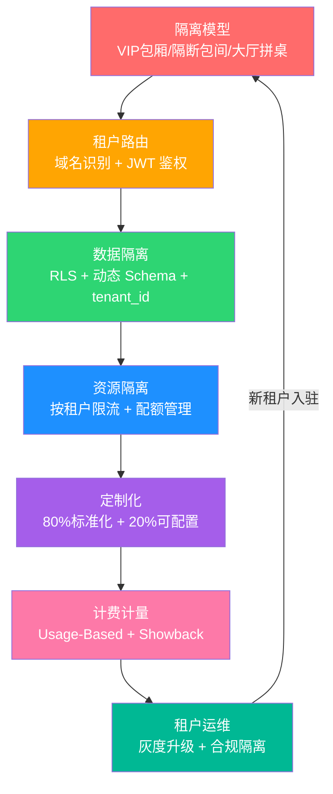

# 19 · 阿明的加盟帝国

> 从阿明的"连锁加盟系统"，看多租户与 SaaS 架构的设计与权衡

> **系列定位**：本篇是「阿明餐厅」系列的**番外三**。在[前传](./02-system-architecture-evolution.md)中，阿明完成了从单机到云原生的架构演进。当系统足够成熟后，一个新的商业机会出现了 —— **把这套系统卖给其他餐厅老板**。但"一套系统服务多个客户"远比想象中复杂。

---

## 引言：一套系统，三个世界

阿明的系统做得太好了。

消息传出去，隔壁城市的三家餐厅老板找上门来："明哥，你那套系统能不能也给我们用？我们付钱。"阿明很高兴："一套系统卖给三家，成本分摊，利润翻倍！"

他让老陈快速开了三个账号，心想无非就是多三个登录用户。

第一周就炸了锅。

A 餐厅的老板打电话来："为什么你们的菜单上显示'酸菜鱼 38 元'？我明明设置的是 48 元！" —— 他看到了 B 餐厅的菜单和价格。

紧接着，C 餐厅午高峰搞了一次大促，瞬间涌入 2000 单，把整个系统拖慢了。A 和 B 的顾客纷纷投诉"点餐页面转圈圈"。

还没完，A 餐厅是高端日料，要求界面用深色主题、展示清酒列表；B 餐厅是快餐连锁，要求 bright 风格、突出套餐优惠。改了一套，另一套就乱。

阿明终于意识到：**多租户不是"加个登录页面"那么简单。每个租户都觉得自己是唯一的住户，但实际他们共享着同一栋楼。**

---

## 第一章：多租户的三种隔离模型 —— VIP 包间、隔断包间、大厅拼桌

阿明把问题甩给老陈："到底怎么才能让三家餐厅各过各的？"

老陈拿了三个方案出来，用餐厅的布局做比喻：

**方案一：独立数据库（VIP 包厢）**

每家餐厅一个完全独立的数据库，就像给每个客户一间专属包厢 —— 门一关，互不干扰。A 餐厅的数据泄露了，B 和 C 完全不受影响。

**方案二：共享数据库，独立 Schema（隔断包间）**

大家共用一个数据库实例，但每个租户有自己的 Schema（数据表集合）。就像用隔断把大厅分成几个包间 —— 视线隔开了，但隔音不好，隔壁吵闹还是能听到。

**方案三：共享表 + tenant_id（大厅拼桌）**

所有租户的数据存在同一张表里，靠 `tenant_id` 字段区分。就像大厅里拼桌 —— 成本最低，但一个人大声说话全桌都听到。

```text
三种隔离模型对比：

┌─────────────────┬──────────────┬──────────────┬──────────────┐
│                 │ 独立数据库    │ 独立 Schema   │ 共享表       │
│                 │ (VIP 包厢)   │ (隔断包间)    │ (大厅拼桌)   │
├─────────────────┼──────────────┼──────────────┼──────────────┤
│ 隔离度           │ ★★★★★       │ ★★★☆☆        │ ★★☆☆☆        │
│ 成本             │ 高（每户一套）│ 中（共享实例）│ 低（共享一切）│
│ 运维复杂度       │ 高（N 套库） │ 中            │ 低           │
│ 数据迁移难度     │ 低（独立操作）│ 中            │ 高（混在一起）│
│ 性能隔离         │ 完全隔离     │ 部分隔离      │ 几乎无隔离   │
│ 定制灵活度       │ 高           │ 中            │ 低           │
│ 适用客户         │ 大客户/VIP   │ 中型客户      │ 小客户/免费  │
└─────────────────┴──────────────┴──────────────┴──────────────┘
```

老陈建议：**三种模型混合使用**。A 餐厅是大客户，年付 50 万，给他独立数据库；B 餐厅中等规模，用独立 Schema；C 餐厅是小店，用共享表。

阿明问："为什么不全部用独立数据库？最安全啊。"

老陈回答："因为成本。100 个小客户，每个配一个独立数据库，光运维就能把人累死。**隔离是有价格的，要和客户价值匹配。**"

在 SaaS 领域，这叫**"Silos vs Pools"模型** —— Silos（独立部署）隔离好但成本高，Pools（共享部署）成本低但隔离弱。成熟的 SaaS 平台会按客户等级**分层使用**。

**多租户隔离的核心是"隔离是有价格的，要和客户价值匹配"。**

---

## 第二章：租户路由与数据隔离 —— 门牌号加 JWT，让请求认对家门

确定了隔离模型，下一个问题：**请求进来，怎么知道是哪个租户的？**

老陈设计了四种租户识别方式：

| 识别方式 | 示例 | 优点 | 缺点 | 餐厅类比 |
|----------|------|------|------|----------|
| 子域名 | `a.aming.com` | 用户友好、SEO 友好 | 需要通配符证书 | 每家店有自己的门牌号 |
| 独立域名 | `arestaurant.com` | 品牌独立 | 运维复杂 | 每家店有自己的独栋 |
| HTTP Header | `X-Tenant-ID: a` | 灵活 | 不直观 | 进门报暗号 |
| Token 中携带 | JWT 的 `tenant_id` 字段 | 安全、无状态 | Token 变大 | 工牌上写着部门 |

阿明选了**子域名 + JWT Token** 的组合 —— 用户通过 `a.aming.com` 访问，登录后 JWT 中携带 `tenant_id`，后续请求靠 Token 识别身份。

但在数据层面，光识别租户还不够。老陈最怕的事情是：**代码里忘了加 `tenant_id` 过滤条件，一个查询就把所有租户的数据全拉出来了**。

他引入了三层防线：

```python
# 第一层：中间件自动注入 tenant_id
class TenantMiddleware:
    def process_request(self, request):
        tenant_id = extract_tenant_id(request)  # 从 JWT 或域名解析
        request.tenant_id = tenant_id
        # 设置数据库会话的默认过滤条件
        db_session.set_tenant_filter(tenant_id)

# 第二层：数据库行级安全（Row-Level Security, RLS）
# PostgreSQL 的 RLS 策略 —— 即使应用层忘了过滤，数据库也会自动加上
# CREATE POLICY tenant_isolation ON orders
#   USING (tenant_id = current_setting('app.current_tenant')::int);

# 第三层：ORM 层的全局 Scope
class OrderRepository:
    def find_all(self, tenant_id):
        # ORM 自动追加 WHERE tenant_id = ?
        return self.db.query(Order).filter(
            Order.tenant_id == tenant_id
        ).all()
```

对于独立 Schema 的租户（B 餐厅），路由逻辑稍有不同 —— 中间件根据 `tenant_id` 动态切换 Schema：

```python
def get_db_connection(tenant_id):
    if tenant_id == "vip_a":
        return get_dedicated_db("tenant_a")   # 独立数据库
    elif tenant_id in ["medium_b", "medium_d"]:
        conn = get_shared_db()
        conn.execute(f"SET search_path TO tenant_{tenant_id}")  # 切换 Schema
        return conn
    else:
        conn = get_shared_db()
        conn.set_tenant_filter(tenant_id)      # 共享表 + tenant_id 过滤
        return conn
```

老陈特别强调了一个原则：**租户隔离不能依赖开发者的自觉**。人会犯错，代码会漏写，但数据库级别的 RLS 策略和 ORM 全局 Scope 不会因为疏忽而失效。

**租户路由的核心是"让隔离成为基础设施的能力，而不是每个开发者都要记住的事"。**

---

## 第三章：资源隔离与限流 —— 按桌限菜防吵闹，一家热闹不扰四邻

C 餐厅大促拖垮全系统的事情，阿明记忆犹新。

老陈分析原因："共享表模式下，所有租户共用一个数据库连接池、同一个 CPU、同一块内存。C 餐厅瞬间涌入 2000 个查询，把连接池占满了，A 和 B 的请求只能排队等。"

这就是经典的**"吵闹邻居（Noisy Neighbor）"问题** —— 一个租户把资源吃光，其他租户遭殃。

老陈设计了一套**按租户限流**的方案：

```text
限流策略（按租户）：

A 餐厅（VIP）：
  令牌桶容量：500 req/s
  突发上限：800 req/s
  优先级队列：P0（最高）

B 餐厅（中型）：
  令牌桶容量：200 req/s
  突发上限：400 req/s
  优先级队列：P1

C 餐厅（小型）：
  令牌桶容量：50 req/s
  突发上限：100 req/s
  优先级队列：P2

全局保底：
  预留 30% 资源给 VIP 租户，任何情况下不被抢占
```

```python
# 基于 Redis 的按租户限流
class TenantRateLimiter:
    def __init__(self, redis_client):
        self.redis = redis_client

    def allow_request(self, tenant_id):
        quota = self.get_tenant_quota(tenant_id)
        key = f"rate_limit:{tenant_id}"
        # 使用 Pipeline 保证 INCR + EXPIRE 的原子性
        pipe = self.redis.pipeline()
        pipe.incr(key)
        pipe.expire(key, 1)  # 1 秒窗口
        current, _ = pipe.execute()
        if current > quota["max_rps"]:
            return False, {"retry_after": 1, "tenant": tenant_id}
        return True, {}

    def get_tenant_quota(self, tenant_id):
        quotas = {
            "vip":    {"max_rps": 500, "burst": 800},
            "medium": {"max_rps": 200, "burst": 400},
            "small":  {"max_rps": 50,  "burst": 100},
        }
        tier = get_tenant_tier(tenant_id)
        return quotas[tier]
```

除了限流，老陈还做了**资源配额**：

| 资源维度 | VIP 租户 | 中型租户 | 小型租户 | 餐厅类比 |
|----------|----------|----------|----------|----------|
| CPU 配额 | 40% | 30% | 10% | 灶台分配 |
| 内存配额 | 4 GB | 2 GB | 512 MB | 冷库空间 |
| 存储空间 | 500 GB | 100 GB | 10 GB | 仓库面积 |
| 连接池 | 50 | 20 | 5 | 传菜窗口数 |
| 并发任务 | 100 | 50 | 10 | 同时接的单 |

阿明问："如果 C 餐厅愿意多付钱，能给他更多资源吗？"

老陈笑了："当然。**限流不是惩罚，是商业模型的技术实现。** 付多少钱，用多少资源，天经地义。"

详见[《高峰保卫战》](./04-peak-traffic-defense.md)中的限流策略 —— 全局限流保护系统，按租户限流保护邻居。

**资源隔离的核心是"一个租户的错误，应该只影响他自己，不应该让所有人买单"。**

---

## 第四章：定制化 vs 标准化 —— 八分标准两分可调，灵活不丢效率

A 餐厅的老板又提需求了："我的日料店需要一个清酒搭配推荐功能，你的系统没有。"

阿明第一反应是："做！大客户的要求必须满足。"

老陈拦住了他："你给 A 做了清酒推荐，B 要不要做火锅配菜推荐？C 要不要做奶茶加料推荐？做了三个定制，以后每次升级都要分别测试三套代码，**升级一次要一周**。"

阿明陷入了两难：**不定制，丢客户；过度定制，丢效率。**

老陈提出了一个黄金比例：**80% 标准化 + 20% 可配置**。

```text
SaaS 定制化的四层模型：

第一层：主题/皮肤（零代码）
  → 每个租户自定义 Logo、颜色、字体
  → 存储在 tenant_config 表，前端动态加载

第二层：功能开关（Feature Toggle）
  → 每个租户可以开启/关闭特定功能模块
  → 例如：A 开启"清酒推荐"，B 关闭

第三层：字段级扩展（自定义字段）
  → 租户可以在标准模型上增加自定义字段
  → 例如：A 的菜品表多出"sake_pairing"字段

第四层：插件化扩展点（高级定制）
  → 提供标准 API 和 Webhook，租户自己开发插件
  → 平台不碰定制代码，只提供扩展接口
```

老陈特别设计了一个 Feature Toggle 系统，控制租户级别的功能开关：

```json
{
  "tenant_id": "vip_a",
  "features": {
    "menu_management":    { "enabled": true },
    "order_tracking":     { "enabled": true },
    "sake_recommendation":{ "enabled": true, "tier": "premium" },
    "hotpot_pairing":     { "enabled": false },
    "analytics_basic":    { "enabled": true },
    "analytics_advanced": { "enabled": true, "tier": "premium" }
  }
}
```

```python
# 功能开关中间件
class FeatureToggleMiddleware:
    def check_feature(self, tenant_id, feature_name):
        config = self.get_tenant_features(tenant_id)
        feature = config.get(feature_name, {})

        if not feature.get("enabled", False):
            raise FeatureDisabledException(
                f"功能 '{feature_name}' 未开通，请联系客服升级套餐"
            )

        # 检查功能是否在当前套餐层级内
        required_tier = feature.get("tier", "basic")
        if not self.tenant_has_tier(tenant_id, required_tier):
            raise TierUpgradeRequiredException(
                f"功能 '{feature_name}' 需要 {required_tier} 套餐"
            )
```

但阿明还是踩了一个坑。他为 A 餐厅做了一个"VIP 预约管理"的深度定制模块，代码直接写在了主分支里。结果下次系统升级时，这个定制模块和新版本冲突了，A 餐厅的预约功能挂了两天。

老陈总结教训："**定制代码永远不要和主产品代码混在一起。** 用插件、用扩展点、用 Webhook，但不要动核心代码。"

详见[《从接单到出餐》](./09-cicd-devops.md)中的 Feature Toggle —— 在 SaaS 场景下，特性开关不仅是灰度发布的工具，更是多租户定制化的基石。

**定制化的核心是"80% 标准化保效率，20% 可配置保灵活，0% 硬编码保平安"。**

---

## 第五章：计费模型与计量 —— 按人头还是按克称，账算清才信得过

系统卖给三家餐厅后，阿明开始琢磨收费。

"收多少钱合适？按年收？按月收？按什么维度计费？"

老陈梳理了三种常见的 SaaS 计费模型：

| 计费模型 | 计费维度 | 优点 | 缺点 | 餐厅类比 |
|----------|----------|------|------|----------|
| 按座位（Per Seat） | 使用系统的员工数 | 收入可预测 | 不反映真实用量 | 按人头收费的自助餐厅 |
| 按用量（Usage-Based） | 订单数 / API 调用数 / 存储量 | 用多少付多少，公平 | 收入不可预测 | 按克称重的麻辣烫 |
| 按功能模块（Tiered） | 基础版/专业版/企业版 | 客户自选层级 | 功能切分困难 | 套餐制：小份/中份/大份 |

老陈建议阿明用**混合模型**：基础平台费（按功能层级）+ 超额用量费（按订单数）。

```text
阿明的 SaaS 定价方案：

基础版（小店）：
  月费：999 元
  包含：500 单/月、1 个门店、基础报表
  超额：2 元/单

专业版（中型）：
  月费：4999 元
  包含：5000 单/月、5 个门店、高级报表、API 接入
  超额：1 元/单

企业版（大客户）：
  月费：面议（通常 2-5 万/月）
  包含：无限单量、无限门店、独立部署、专属客服
```

但计费的前提是**计量** —— 你得准确知道每个租户用了多少。

老陈搭建了一套**计量系统**：

```python
# 计量数据采集 —— 每个关键操作都记录用量事件
class MeteringService:
    def record_usage(self, tenant_id, metric_name, quantity):
        event = {
            "tenant_id": tenant_id,
            "metric": metric_name,       # 如 "orders", "api_calls", "storage_mb"
            "quantity": quantity,
            "timestamp": datetime.utcnow().isoformat(),
        }
        # 写入 Kafka，由下游消费者聚合
        self.kafka_producer.send("metering_events", event)

# 用量聚合 —— 每小时运行一次
def aggregate_hourly_usage():
    # 从 Kafka 消费过去 1 小时的用量事件
    events = consume("metering_events", window="1h")
    for tenant_id, metric, total in group_and_sum(events):
        save_to_metering_db(tenant_id, metric, total, period="hourly")
```

计费系统有一个容易被忽略的环节 —— **Showback（展示成本）**。让租户自己看到用了多少，既能减少账单争议，也能推动升级。

```text
租户 A 的月度用量报告：

本月用量摘要（2026-05）：
  订单处理：4,832 单（包含 5,000 单内，未超额）
  API 调用：128,456 次
  存储空间：23.4 GB / 100 GB
  活跃用户：47 人

费用明细：
  基础平台费（专业版）：  4,999 元
  超额订单费：              0 元
  附加存储费：              0 元
  ──────────────────────────
  本月合计：               4,999 元
```

详见[《阿明的省钱经》](./14-cloud-finops.md)中的 Showback/Chargeback —— 给内部团队看成本是 Showback，给外部客户看账单就是 SaaS 计费。理念完全一致：**让花钱的人看到花了多少**。

**计费的核心是"计量准确是信任的基础，Showback 是减少争议的武器"。**

---

## 第六章：租户迁移与运维 —— 升级要灰度，备份要按户，搬家不停业

系统运行半年后，B 餐厅业务爆发，从中型客户升级为 VIP 客户。

问题来了：B 餐厅的数据目前在共享 Schema 里，需要迁移到独立数据库。而且**迁移过程中不能停服** —— B 餐厅一天 3000 单，停一小时就损失十几万。

老陈设计了一套**租户迁移方案**：

```text
租户迁移四步法（以 B 餐厅从共享 Schema → 独立数据库为例）：

第一步：双写（Dual Write）
  → 新订单同时写入旧 Schema 和新数据库
  → 持续 24-48 小时，确保新库数据追平

第二步：历史数据迁移
  → 后台批量迁移历史数据到新库
  → 增量同步（CDC）补齐双写期间的变更

第三步：切换读流量
  → 先将 10% 读请求路由到新库，验证数据一致性
  → 逐步提升到 100%

第四步：停止双写
  → 确认新库数据完整后，停止旧库写入
  → 保留旧库 30 天作为回退备份
```

除了迁移，日常运维也有多租户特有的挑战：

| 运维场景 | 挑战 | 解决方案 | 餐厅类比 |
|----------|------|----------|----------|
| 版本升级 | 升级可能影响所有租户 | 灰度升级：先升小租户，验证无误再升大租户 | 新菜品先在小店试卖 |
| 数据备份 | 要能按租户恢复 | 逻辑备份按 tenant_id 拆分，支持单租户恢复 | 每家店的账本分开保管 |
| 合规隔离 | GDPR 要求某些数据不出境 | 按地域部署，欧洲租户数据存在欧洲机房 | 本地食材本地采购 |
| 租户下线 | 删除数据不能影响其他租户 | 共享表模式下软删除 + 定期物理清理 | 退租后打扫干净 |

老陈特别重视**灰度升级**策略。他的原则是：

```text
灰度升级顺序（从低风险到高风险）：

第一波：内部测试租户（自己的餐厅）
  ↓ 验证 24 小时无异常
第二波：小型免费租户（C 餐厅们）
  ↓ 验证 48 小时无异常
第三波：中型付费租户
  ↓ 验证 72 小时无异常
第四波：VIP 大客户（A 餐厅）
  ↓ 全程人工值守
```

关于合规隔离，阿明遇到了一个真实场景：一个日本客户要求数据必须存储在日本境内（符合日本《个人信息保护法》）。阿明不得不在日本区域部署了一套独立环境，专门为这个客户服务。

老陈感叹："**多租户的终极挑战不是技术，而是合规。法律说你不行，技术再好也没用。**"

详见[《差评危机》](./15-incident-response.md)中的灰度发布思路 —— 灰度不仅用于代码发布，也用于 SaaS 的版本升级。先小后大，先低风险后高风险。

**租户运维的核心是"升级要灰度，备份要按户，合规要分区，下线要干净"。**

---

## 核心总结：多租户与 SaaS 架构



| 章节 | 核心问题 | 餐厅类比 | 技术实现 |
|------|----------|----------|----------|
| 隔离模型 | 租户之间隔多开？ | 包厢/隔断/拼桌 | 独立 DB / 独立 Schema / 共享表 |
| 租户路由 | 请求怎么找到正确的租户？ | 门牌号 + 工牌 | 子域名 + JWT + RLS |
| 资源隔离 | 怎么防止吵闹邻居？ | 按桌限菜 | 按租户令牌桶 + 资源配额 |
| 定制化 | 标准化还是个性化？ | 套餐 vs 单点 | Feature Toggle + 插件化 |
| 计费计量 | 收多少钱？怎么算？ | 按人头/按克/按套餐 | 计量系统 + Showback |
| 租户运维 | 怎么安全地升级和维护？ | 新店试菜 | 灰度升级 + 合规分区 |

### 一句心法

**多租户的本质是用一套系统服务多个"独立世界"。隔离做得好，客户感觉不到邻居；隔离做不好，一次事故全军覆没。**

---

## 延伸阅读

- [当餐厅长出大脑](./01-ai-agent-architecture.md) —— AI Agent 的全景拆解，SaaS 平台未来也可以嵌入 AI 能力为租户提供智能推荐
- [架构是"长"出来的](./02-system-architecture-evolution.md) —— 从单机到云原生的演进，多租户是架构成熟后的商业化延伸
- [给产品经理的重构说明书](./03-refactoring-guide-for-pm.md) —— SaaS 化的本质就是一次大规模重构，需要产品经理理解技术债的代价
- [高峰保卫战](./04-peak-traffic-defense.md) —— 全局限流保护系统，按租户限流保护邻居，限流是多租户的基石
- [厨房装监控](./05-observability.md) —— 多租户场景下需要按租户维度的监控和告警，否则不知道哪个租户出了问题
- [食安大检查](./06-security-architecture.md) —— 多租户的安全挑战更复杂，一个租户的数据泄露可能影响所有租户的信任
- [从厨师到 CEO](./07-from-chef-to-ceo.md) —— SaaS 产品的组织管理，从服务自己到服务客户的思维转变
- [厨房质检员](./08-qa-testing-strategy.md) —— 多租户的测试策略需要覆盖租户隔离、跨租户数据泄露等特殊场景
- [从接单到出餐](./09-cicd-devops.md) —— SaaS 的 CI/CD 需要支持灰度发布、按租户回滚等特殊能力
- [菜单设计学](./10-api-design.md) —— SaaS 平台的 API 设计需要支持多租户上下文传递和版本兼容
- [学徒的困境](./11-ai-learning-paradox.md) —— AI 时代的人机协作与学习之道，当 AI 越来越强，人还要不要练基本功
- [数据厨房](./12-data-kitchen.md) —— 多租户的数据治理更复杂，每个租户的数据质量、数据血缘都要独立管理
- [前厅翻修记](./13-frontend-renovation.md) —— 多租户的前端需要支持主题定制、功能开关驱动的动态 UI
- [阿明的省钱经](./14-cloud-finops.md) —— SaaS 的成本优化直接决定利润率，多租户的 FinOps 是核心能力
- [差评危机](./15-incident-response.md) —— 多租户的故障影响面更大，一次事故可能流失所有客户
- [外卖大战](./16-performance-optimization.md) —— 多租户的性能优化需要按租户隔离，不能让一个租户拖垮所有人
- [传菜窗口的智慧](./20-realtime-eventdriven.md) —— 消息队列在多租户场景下需要按租户隔离 Topic 或 Queue
- [十家店的烦恼](./18-distributed-puzzles.md) —— 分布式系统的经典难题，在多租户场景下更加复杂
- [厨房实况直播](./20-realtime-eventdriven.md) —— 实时系统在多租户场景下需要按租户隔离 WebSocket 连接和事件流
- [一个厨房，四个门面](./21-multiplatform-architecture.md) —— 多平台架构与多租户有天然的结合点，一个 SaaS 平台多个前端门面
- [懂你的菜单](./22-search-recommendation.md) —— SaaS 平台为每个租户提供个性化推荐，搜索和推荐需要按租户隔离模型
- [菜谱标准化之路](./07-from-chef-to-ceo.md) —— SaaS 平台的知识管理和文档标准化，帮助租户自助解决问题
- [仓库搬家不停业](./24-database-migration.md) —— 租户数据迁移是数据库迁移的特殊场景，需要零停机完成
- [预制菜还是现炒](./25-lowcode-platform.md) —— 低代码平台天然适合 SaaS 场景，让租户自己配置而不是开发定制
- [阿明出海记](./26-globalization.md) —— SaaS 出海面临多租户合规、数据驻留、多语言等叠加挑战
- [厨房大换岗](./27-ai-org-transformation.md) —— AI 组织转型在多租户场景的应用，每个租户的 AI 配置独立管理
- [阿明的二次创业](./28-ai-native-startup.md) —— AI 原生创业的 SaaS 化路径，AI 能力如何融入 SaaS 产品
- [会自我进化的厨房](./29-self-evolving-company.md) —— Agent Loop 的多租户隔离，不同租户的 Agent 循环独立运行
- [AI 的"黑暗料理"](./30-ai-hallucination-safety.md) —— AI 幻觉在多租户场景的治理，不同租户的 AI 护栏策略差异化

## 跨章节衔接

- [14-cloud-finops.md](./14-cloud-finops.md) —— 番外二，多租户的成本分摊与 FinOps 协同：每租户的资源使用可视化
- [06-security-architecture.md](./06-security-architecture.md) —— 正传 3，多租户隔离是安全架构的核心：数据隔离、权限边界
- [21-multiplatform-architecture.md](./21-multiplatform-architecture.md) —— 正传 13，多端架构支持多租户：不同终端的租户体验一致

---

## 结语

阿明的加盟帝国故事，揭示了每一个 SaaS 创业者都会遇到的真相：**把系统卖给别人和自己用，完全是两回事。** 自己用的时候，出了问题改就行；卖给别人用的时候，一个租户的问题可能变成所有租户的灾难。

答案是六层防线：选对隔离模型匹配客户价值，做好租户路由让请求找到正确的归属，数据隔离保证信息不串门，资源隔离防止吵闹邻居拖垮所有人，定制化在标准化和个性化之间找到黄金比例，计费计量让每一分钱都有据可查。

下次当你考虑把内部系统变成 SaaS 产品时，不妨问自己：

- 你的隔离模型能匹配不同等级的客户吗？还是只有一种方案？
- 租户路由是基础设施级的，还是靠每个开发者手动加 `tenant_id`？
- 一个租户的大促活动，会不会拖垮其他租户？你做过按租户的压测吗？
- 你有没有为大客户做过硬编码的定制？那些定制代码现在还能和新版本兼容吗？
- 你的计量系统能准确到每个租户的每一笔用量吗？客户能看到自己的账单吗？

> 好的多租户架构，是让每个客户都觉得"这个系统是为我一个人做的"。

← [返回系列导读](./index.md)
