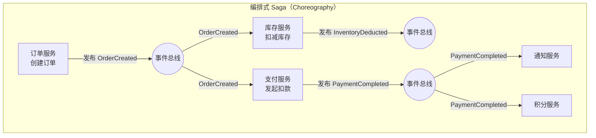
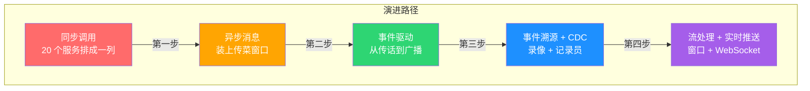

# 20 · 厨房实况直播

> 从阿明的"前后厨大混乱"和"外卖骑手追踪系统"，看异步消息与事件驱动架构的演进之路

> **系列定位**：本篇是「阿明餐厅」系列的**正传 11/13 合并版**。原正传 11《传菜窗口的智慧》（异步消息）与原正传 13《厨房实况直播》（实时事件驱动）已合并为本篇 —— MQ 是事件驱动的"轻量级实现"，事件驱动是 MQ 的"思想升华"，本质同源。如果你还没读过[前传](./02-system-architecture-evolution.md)与[正传 1《高峰保卫战》](./04-peak-traffic-defense.md)，建议先建立架构演进与流量治理的全局观。

---

## 引言：当 20 个服务排成一列，又被 3000 个顾客追问

阿明的餐厅已经不是当年的小面馆了。

经过[前传](./02-system-architecture-evolution.md)的架构演进、[正传 1](./04-peak-traffic-defense.md)的流量治理，系统从最初的 5 个服务扩展到了 20 个微服务。紧接着两个棘手的问题几乎同时爆发：

**问题一（来自 17-传菜窗口）**：某天，库存服务出现了一次 200ms 的抖动。在平时这根本不算事。但订单服务在等库存，支付在等订单，通知在等支付……整条链路全部超时。订单成功率从 99% 跌到 72%，差评如潮。

**问题二（来自 20-厨房实况）**：上线外卖业务后，顾客投诉 *"我的外卖到哪了？"* 页面状态永远是"商家处理中"。竞争对手已经做到了实时追踪骑手位置、预计送达时间。阿明还在用"轮询"——3000 个在线用户每 10 秒刷一次，服务器被刷崩了三次。

老陈拿着两份故障报告，叹了口气：

> "第一个问题，服务间 200ms 的抖动被放大成 4.2s 全链路超时 —— 同步调用就像服务员必须盯着厨师做完菜才能去接下一单，一个环节卡住，整个餐厅都停了。
>
> 第二个问题，3000 个人同时打电话问'好了没' —— 你需要的不是'更频繁地轮询'，而是'一有进展就主动通知'。
>
> 解决两个问题的方法其实是同一个：**让等待发生在窗口后面，让数据自己在系统中流动。**"

阿明似懂非懂："那这个'传菜窗口'，到底应该长什么样？"

老陈笑了："**先装一个简单的，再升级成聪明的；先让消息解耦，再让事件驱动。** 这一篇，我们就把这条路从头走一遍。"

---

## 第一章：同步调用的七宗罪 —— 一个环节掉链子，整条链路全报废

阿明让老陈梳理了一下现有系统的调用链路，画出来像一碗意大利面 —— 20 个服务互相调用，你中有我，我中有你。

老陈在白板上列出了同步调用的"七宗罪"：

"你看，上次库存服务抖了 200ms，本来是个小问题。但订单服务在等它，支付服务在等订单服务，通知服务在等支付服务 —— 200ms 的抖动被放大成了 4.2 秒的全链路超时。这就是**级联故障**和**延迟叠加**的组合拳。"

| 罪状 | 餐厅类比 | 技术表现 | 后果 |
|------|----------|----------|------|
| 强耦合 | 服务员必须盯着厨师 | 调用方必须等待被调用方响应 | 一荣俱荣，一损俱损 |
| 延迟叠加 | 每道菜做完才能做下一道 | 6 个服务各 200ms = 总耗时 1.2s+ | 用户体验恶化 |
| 级联故障 | 一个厨师请假，所有菜停做 | 下游超时拖垮上游 | 雪崩效应 |
| 扩展性差 | 厨师和服务员必须 1:1 配对 | 无法独立扩缩容 | 资源浪费或瓶颈 |
| 重试风暴 | 服务员反复催问"好了没" | 超时后大量重试请求 | 下游被彻底压垮 |
| 事务边界模糊 | 谁负责退款？谁负责通知？ | 分布式事务难以保证一致性 | 数据不一致 |
| 调试困难 | 出了问题不知道是谁的锅 | 链路长、日志分散 | 排查耗时 |

老陈画了一张对比表：

| 维度 | 同步调用 | 异步消息 |
|------|----------|----------|
| 耦合度 | 高（调用方知道被调用方地址） | 低（通过 Broker 中转） |
| 延迟 | 请求-响应往返，延迟叠加 | 发完即走，延迟解耦 |
| 故障传播 | 下游故障直接传导到上游 | 下游故障不影响上游发送 |
| 扩展性 | 上下游必须同步扩容 | 各自独立扩缩容 |
| 吞吐量 | 受限于最慢的环节 | 受限于 Broker 的处理能力 |
| 数据一致性 | 容易实现强一致（但代价高） | 天然最终一致 |
| 调试 | 链路清晰但长 | 需要消息追踪能力 |
| 适用场景 | 实时查询、强一致操作 | 通知、事件驱动、后台处理 |

阿明听完沉默了一会儿："这么说，我们之前把所有东西都做成同步调用，就像让 20 个服务员排成一列，一个传一个 —— 中间任何一个走神，整条链就断了？"

老陈点头："没错。是时候装个传菜窗口了。"

> 💡 **金句**：同步调用不是错，但在微服务架构中，"默认同步"是架构债务的最大来源。

---

## 第二章：消息队列入门 —— 装个传菜窗口，让消息自己跑

老陈先把"传菜窗口"的最简版搭起来：消息队列。MQ 解决的核心问题就是第一章的七宗罪 —— **让发完即走，把等待放在窗口后面**。

### 2.1 选型：不是一种队列解决所有问题

阿明决定引入消息队列，但市面上的选择太多了。老陈拉了一张对比表：

| 维度 | Kafka | RabbitMQ | RocketMQ | Pulsar |
|------|-------|----------|----------|--------|
| 定位 | 分布式流平台 | 传统消息中间件 | 金融级消息中间件 | 云原生流平台 |
| 吞吐量 | 百万级/秒 | 万级/秒 | 十万级/秒 | 百万级/秒 |
| 延迟 | 毫秒级（批量） | 微秒级 | 毫秒级 | 毫秒级 |
| 消息模型 | 发布-订阅（Topic + Partition） | 队列 + 发布-订阅（Exchange） | 发布-订阅 + 队列 | 发布-订阅 |
| 消息回溯 | ✅ 支持（基于 offset） | ❌ 不支持 | ✅ 支持 | ✅ 支持 |
| 顺序消息 | 分区内有序 | 单队列有序 | 分区内有序 | 分区内有序 |
| 事务消息 | ❌ 原生不支持 | ❌ 不支持 | ✅ 支持 | ❌ 原生不支持 |
| 死信队列 | 需自行实现 | ✅ 原生支持 | ✅ 支持 | ✅ 支持 |
| 运维复杂度 | 中（依赖 ZooKeeper/KRaft） | 低 | 中 | 高（三层架构） |
| 适用场景 | 日志流、事件流、大数据管道 | 业务消息、任务队列、延迟消息 | 金融交易、电商订单 | 多租户、大规模流处理 |

老陈的回答很务实："我们的场景分两类。"

1. **日志流和事件流**（用户行为日志、系统指标采集、CDC 数据同步）—— 用 **Kafka**。它天生就是做这件事的，吞吐量高，支持消息回溯，生态极其丰富。
2. **业务消息**（下单通知、库存扣减、积分累加、配送调度）—— 用 **RabbitMQ**。它的路由模型灵活，延迟低，死信队列原生支持。

```yaml
# 阿明餐厅的消息队列分工
messaging:
  kafka:
    purpose: "事件流 & 日志流"
    topics:
      - user_behavior_log
      - order_event_stream
      - inventory_change_log
      - system_metrics
    retention: 7d
    partitions: 12

  rabbitmq:
    purpose: "业务消息 & 任务队列"
    exchanges:
      - name: order_events
        type: topic
        bindings:
          - routing_key: "order.created"
            queue: inventory_deduct
          - routing_key: "order.created"
            queue: notification_send
          - routing_key: "order.paid"
            queue: points_credit
          - routing_key: "order.paid"
            queue: delivery_dispatch
    dead_letter:
      exchange: dlx_exchange
      queue: dead_letter_queue
```

> 💡 **金句**：消息队列选型不是"哪个最好"，而是"哪个最适合"。日志流选 Kafka，业务消息选 RabbitMQ，金融交易选 RocketMQ —— 各有所长。

### 2.2 可靠性：消息不能丢的"三板斧"

阿明最担心的问题："消息发了，万一丢了怎么办？顾客付了钱，消息没到厨房，那不就出大事了？"

老陈竖起三根手指："消息可靠性，靠**三板斧**。"

**第一板斧：生产端确认（Publisher Confirm）**

```python
# RabbitMQ 生产端确认示例
import pika

connection = pika.BlockingConnection(pika.ConnectionParameters('localhost'))
channel = connection.channel()
channel.confirm_delivery()  # 开启 Publisher Confirms

try:
    channel.basic_publish(
        exchange='order_events',
        routing_key='order.created',
        body=json.dumps({
            'order_id': 'ORD-20260601-001',
            'amount': 128.5,
            'items': ['红烧牛肉面', '凉拌黄瓜'],
        }),
        properties=pika.BasicProperties(
            delivery_mode=2,       # 消息持久化
            message_id='msg-uuid-001',  # 唯一消息 ID（幂等用）
        ),
        mandatory=True  # 路由不到队列则退回
    )
    print("✅ 消息已确认送达 Broker")
except pika.exceptions.UnroutableError:
    print("❌ 消息无法路由到队列，需要处理退回")
except Exception as e:
    print(f"❌ 消息发送失败，需要重试: {e}")
```

**第二板斧：Broker 持久化**

```text
Broker 持久化配置：
├── Exchange 持久化：durable = true
├── Queue 持久化：durable = true
└── Message 持久化：delivery_mode = 2

注意：持久化 ≠ 不丢消息
  - 写入磁盘有延迟（毫秒级），在写入前 Broker 崩溃仍可能丢失
  - 解决方案：Quorum Queue（基于 Raft，多数派写入成功后才返回 ACK）
```

**第三板斧：消费端手动 ACK**

```python
# RabbitMQ 消费端手动 ACK 示例（精简版）
def on_message(channel, method, properties, body):
    order = json.loads(body)
    try:
        if is_duplicate(properties.message_id):          # 1. 幂等检查
            channel.basic_ack(delivery_tag=method.delivery_tag)
            return

        process_order(order)                              # 2. 业务处理
        mark_as_processed(properties.message_id)          # 3. 标记已处理
        channel.basic_ack(delivery_tag=method.delivery_tag)  # 4. ACK

    except Exception:
        if retry_count(properties.message_id) < 3:       # 5. 失败重试
            channel.basic_nack(delivery_tag=method.delivery_tag, requeue=True)
        else:
            channel.basic_nack(delivery_tag=method.delivery_tag, requeue=False)  # 进死信队列

channel.basic_qos(prefetch_count=10)
channel.basic_consume(queue='inventory_deduct', on_message_callback=on_message)
```

> 💡 **金句**：消息可靠性的本质是"三段式确认" —— 发送确认、存储持久化、消费确认。任何一段缺失，都可能丢消息。

### 2.3 消息模式：怎么"传话"？

阿明的系统里有各种各样的"对话"场景。老陈说："不同的场景需要不同的消息模式。"

| 模式 | 说明 | 餐厅类比 | 技术实现 |
|------|------|----------|----------|
| 发布/订阅（Pub/Sub） | 一条消息，多个消费者 | 厨房喊"3 号菜好了"，传菜员、质检员都听到 | Fanout/Topic Exchange |
| 点对点（P2P） | 一条消息，一个消费者 | 指定某个厨师做某道菜 | Direct Exchange / Queue |
| 请求/响应（Async RPC） | 发请求，等异步响应 | 服务员递单给厨师，厨师做完后按铃通知 | Reply Queue + Correlation ID |

> 💡 **金句**：命令驱动是"告诉别人怎么做"，事件驱动是"告诉世界发生了什么"。后者的扩展性远好于前者 —— 这一点，下一章会详细展开。

### 2.4 顺序与幂等：先做哪个？

阿明遇到了一个诡异问题：有时候订单创建成功了，但库存没扣；有时候库存扣了，订单却创建失败。

老陈分析："这是消息乱序导致的。在分布式系统中，消息的顺序不能天然保证。"

```text
正确顺序：
  1. 扣减库存（InventoryDeducted）
  2. 创建订单（OrderCreated）
  3. 发起支付（PaymentInitiated）

乱序情况：
  消费者 A 收到 OrderCreated（时刻 T1）
  消费者 B 收到 InventoryDeducted（时刻 T2 > T1）
  → 消费者 A 处理时发现库存还没扣，校验失败！
```

**分区有序 vs 全局有序**：

| 方式 | 吞吐量 | 适用场景 |
|------|--------|----------|
| 全局有序 | 低（单分区） | 金融交易、强顺序依赖 |
| 分区有序 | 高（多分区并行） | **同一订单的消息有序即可**（阿明的选择） |
| 无序 | 最高 | 通知类、日志类 |

```python
# Kafka 分区键示例：同一订单的消息进入同一分区
order_id = 'ORD-20260601-001'
producer.send('order_events', key=order_id, value={'event': 'InventoryDeducted', 'order_id': order_id})
producer.send('order_events', key=order_id, value={'event': 'OrderCreated', 'order_id': order_id})
producer.send('order_events', key=order_id, value={'event': 'PaymentInitiated', 'order_id': order_id})
```

**幂等消费**：分布式消息系统承诺"至少一次"投递（At-Least-Once），意味着重复消息必然会发生。**幂等消费不是可选项，而是必选项。**

| 方式 | 原理 | 适用场景 |
|------|------|----------|
| 数据库唯一键 | `INSERT ... ON DUPLICATE KEY UPDATE` | 有数据库写入的场景 |
| Redis 去重窗口 | 用消息 ID 做 SETNX，设置过期时间 | 高并发、无数据库写入 |
| 状态机防重入 | 检查业务状态，已完成则跳过 | 有明确状态流转的场景 |

```python
# 幂等消费实现：唯一消息 ID + Redis 去重 + 数据库兜底（精简版）
def consume_order_message(message):
    msg_id = message['message_id']

    # 第一层：Redis 去重（快速拦截）
    if not redis_client.set(f"msg:processing:{msg_id}", "1", nx=True, ex=3600):
        return

    # 第二层：数据库幂等检查（兜底）
    try:
        cursor.execute(
            "INSERT INTO processed_messages (message_id, status) VALUES (%s, 'processing')",
            (msg_id,)
        )
        db.commit()
    except IntegrityError:
        redis_client.delete(f"msg:processing:{msg_id}")
        return

    try:
        process_order(message)
        cursor.execute("UPDATE processed_messages SET status='completed' WHERE message_id=%s", (msg_id,))
        db.commit()
    except Exception as e:
        cursor.execute("DELETE FROM processed_messages WHERE message_id=%s", (msg_id,))
        db.commit()
        redis_client.delete(f"msg:processing:{msg_id}")
        raise
```

> 💡 **金句**：在分布式消息系统中，"至少一次"是承诺，"恰好一次"是幻觉。

---

## 第三章：事件驱动架构升级 —— 菜好了喊一声，谁有空谁来端

MQ 装好了，服务间通信顺畅了。但阿明发现还有一类问题没解决：**顾客要的不是"等数据"，而是"被通知"**。当外卖骑手的位置每 30 秒变一次时，轮询太奢侈了。当订单状态变更时，依赖轮询的页面可能延迟几分钟才更新。

老陈说："你需要从'装上传菜窗口'升级到'厨房实况直播' —— **把命令式的同步调用升级为事件驱动的实时推送**。"

### 3.1 从命令到事件：思维范式的转变

老陈首先区分了三个容易混淆的概念：

| 概念 | 定义 | 时态 | 餐厅类比 |
|------|------|------|----------|
| 命令（Command） | "请做某件事" | 面向未来 | "请炒一份宫保鸡丁" |
| 事件（Event） | "某件事已经发生了" | 面向过去 | "宫保鸡丁已经出锅了" |
| 消息（Message） | 传递信息的载体 | 通用 | 传菜窗口递出去的纸条 |

事件驱动架构的核心是**事件**。事件是"已经发生的事实"，不可变、不可撤销。

```text
命令驱动（Command-Driven）：
  "库存服务，请扣减 1 份红烧牛肉面"
  → 发送方知道接收方是谁，知道它该做什么
  → 本质是"远程过程调用"的异步版
  → 耦合度：中

事件驱动（Event-Driven）：
  "订单已创建（OrderCreated 事件）"
  → 发送方不知道谁会关心，只声明发生了什么
  → 下游服务自行决定要做什么
  → 耦合度：低
```

老陈的建议："传菜窗口放了一盘菜，它不会喊'传菜员小赵来端'，它只是放在那里，谁有空谁来端。这就是事件驱动。"

### 3.2 事件驱动架构（EDA）核心

老陈提出了一个更根本的问题："骑手追踪只是表象。更深层的问题是 —— **你的系统不是事件驱动的**。"

"现在你的系统是'命令式'的：顾客下单，系统执行一个命令：创建订单、扣减库存、通知厨房。但这一切都是同步调用的，一环扣一环。**任何一个环节出问题，整条链路都断了。**"

"而事件驱动架构（EDA）的思路完全不同 —— **每个服务只做自己的事，做完后发一个'事件'出去，谁关心谁订阅。**"

**EDA 的三大优势**：

1. **松耦合**：服务间通过事件解耦，发布者不关心谁订阅
2. **可扩展**：新增订阅者无需改动发布者
3. **可观测**：事件流本身就是"系统活动的日志"

### 3.3 Saga 编排式 vs 协调式

涉及 6 个服务的下单流程，老陈画了两种实现方式的对比：



| 维度 | 编排式（Choreography） | 协调式（Orchestration） |
|------|----------------------|----------------------|
| 控制方式 | 去中心化，每个服务自主响应事件 | 中心化，协调器控制流程 |
| 耦合度 | 低 | 中 |
| 可观测性 | 差（流程分散） | 好（协调器掌握全局） |
| 适用场景 | 3-4 个服务 | 5+ 个服务（阿明的选择） |

> Saga 协调器的分布式事务实现细节详见[《十家店的烦恼》](./18-distributed-puzzles.md)，本篇关注事件流本身的设计。

### 3.4 实时通信的四种方式

搞定了架构，还得解决"事件怎么送到客户端"。老陈拿出了一张对比表：

| 通信方式 | 原理 | 延迟 | 资源消耗 | 复杂度 | 适用场景 | 餐厅类比 |
|----------|------|------|----------|--------|----------|----------|
| 短轮询 | 客户端定时发请求问"有变化吗？" | 高 | 高（大量无效请求） | 低 | 简单场景、低频查询 | 每 10 秒跑去厨房问一次 |
| 长轮询 | 服务端 hold 住连接，等数据再响应 | 中 | 中 | 中 | 兼容性要求高 | 站在厨房门口等，有菜了再端走 |
| SSE（Server-Sent Events） | 服务端单向推送 | 低 | 低 | 中 | 单向通知（状态推送、大屏） | 厨房装了喇叭，做好一道菜喊一声 |
| WebSocket | 全双工通信 | 极低 | 低 | 高 | 双向交互（聊天、追踪、协作） | 厨房和大厅之间装了对讲机 |

阿明的选择：

- **骑手追踪** → WebSocket：顾客和骑手双向交互
- **厨房大屏** → SSE：大屏只需接收状态推送
- **订单状态查询（低频）** → 长轮询：兼容老版本 App，作为 WebSocket 的降级方案

> 💡 **金句**：实时通信的核心是"选对方式比追求最新技术更重要"。

---

## 第四章：事件溯源与 CDC —— 存录像不存快照，让数据库自己说话

EDA 解决架构问题，但阿明还有个现实问题：**现有系统不是事件驱动的，所有数据都直接写 MySQL。难道要全部重写？**

老陈笑了："不用。**有两种思路可以让你的系统无痛升级到事件驱动。**"

### 4.1 事件溯源：存"录像"而非"快照"

传统做法是存"当前状态"：

```text
传统做法（存"当前状态"）：
  订单 #12345 的当前状态：已出餐
```

事件溯源（Event Sourcing）是存"所有发生过的事"：

```text
事件溯源（存"所有发生过的事"）：
  10:01  事件：顾客下单（菜品：宫保鸡丁 × 1）
  10:02  事件：订单已确认（接单员：小赵）
  10:03  事件：厨房已接单（厨师：张师傅）
  10:08  事件：菜品已开始制作
  10:12  事件：菜品已出餐
  10:13  事件：骑手已取餐（骑手：小钱）
  10:25  事件：骑手已送达

  → 当前状态可以通过回放所有事件计算得出
  → 任何时刻的历史状态都可以精确还原
  → 不存在"数据被覆盖"的问题
```

老陈的类比："传统做法就像只记住'这桌点了红烧肉'。事件溯源就像记住'10:01 顾客坐下 → 10:03 点菜 → 10:05 下单 → 10:12 出餐 → 10:15 上桌'。**前者是快照，后者是录像。**"

**CQRS（Command Query Responsibility Segregation）** 与事件溯源配套：

```mermaid
graph LR
    subgraph 写端（Command）
        A["命令处理器<br/>接收命令 → 产生事件"] --> B["事件存储<br/>Event Store"]
    end
    subgraph 读端（Query）
        B --> C["事件消费者<br/>投影到读模型"]
        C --> D["读数据库<br/>查询优化的视图"]
    end
    D --> E["查询接口<br/>快速响应读请求"]
```

写操作走事件流（保证一致性），读操作走投影视图（保证性能）。两者解耦，互不影响。

### 4.2 CDC：让数据库"自己说话"

事件溯源需要新写代码，老陈提供了一个"零侵入"方案 —— **CDC（Change Data Capture，变更数据捕获）**。

原理是监听数据库的 **Binlog**（二进制日志）。MySQL 每次写操作（INSERT / UPDATE / DELETE）都会记录 Binlog，原本是给主从同步用的。CDC 工具把自己伪装成一个 MySQL 从库，订阅 Binlog，把数据变更实时转发到消息队列。

用餐厅的话说，CDC 就像在厨房门口安排了一位**专职记录员** —— 厨师每做一步（接单、备料、出餐），他就原原本本地抄录在日志本上，然后通过对讲机实时汇报给前台。这位记录员不是偷偷摸摸的窃听者，而是餐厅正式编制的工作人员，光明正大、一字不落地记录厨房里发生的每一件事。

```text
CDC 工作流程：

  MySQL 写入 → Binlog 记录变更 → CDC 工具（Canal/Debezium）捕获
       → 转换为事件格式 → 发送到 Kafka
       → 下游消费者订阅处理
```

**应用层双写 vs CDC 对比**：

| 对比维度 | 应用层双写 | CDC（Binlog 捕获） |
|----------|------------|-------------------|
| 侵入性 | 需要改业务代码 | **零侵入**，不需要改一行代码 |
| 一致性 | 可能不一致（DB 写成功但消息发送失败） | **保证一致**（从 Binlog 读，和 DB 完全同步） |
| 顺序保证 | 难以保证 | **Binlog 天然有序** |
| 遗漏风险 | 异常路径可能漏发消息 | **不会遗漏**，Binlog 记录所有变更 |
| 维护成本 | 每个服务都要加发消息的逻辑 | 统一配置，一处接入 |
| 延迟 | 极低（同步发送） | 低（毫秒级） |

```yaml
# Debezium MySQL Connector 配置示例
name: orders-connector
config:
  connector.class: io.debezium.connector.mysql.MySqlConnector
  database.hostname: mysql-primary
  database.port: 3300
  database.user: debezium
  database.password: ${DB_PASSWORD}
  database.server.id: 1
  database.server.name: aming-orders
  database.include.list: aming_db
  table.include.list: aming_db.orders
  topic.prefix: cdc
```

老陈提醒："CDC 虽好用，但有一个注意点 —— **Schema 变更要小心**。如果改了表结构，Debezium 需要重新解析 Schema，可能会短暂中断。生产环境建议用 Schema Registry 管理。"

> CDC 在数据迁移中的应用详见[《仓库搬家不停业》](./24-database-migration.md)，本篇关注其在事件驱动中的角色。

> 💡 **金句**：CDC 的核心是"不改代码也能让数据流动起来，Binlog 是数据库送给实时系统的礼物"。

---

## 第五章：流处理与可观测性 —— 事件太多看不过来？切窗口、盯延迟

事件流接好了，但阿明发现一个新问题：**原始事件太多了，人看不过来。**

每秒产生 200 个事件（订单创建、状态变更、骑手移动、库存变化……），一天 1700 万个事件。阿明不可能一条条看，他需要的是**实时聚合后的洞察**：

- 过去 5 分钟的平均出餐时间是多少？
- 当前有多少订单等待超过 10 分钟？
- 哪个灶台的效率最高？哪个最慢？

### 5.1 流处理：把无限事件切成有限窗口

老陈引入了**实时流处理（Stream Processing）**。流处理的核心概念是**窗口（Window）**—— 把无限的事件流切成有限的时间段，然后在每个窗口内做聚合计算：

```text
三种窗口类型：

滚动窗口（Tumbling Window）：固定长度，不重叠
  |--- 5 分钟 ---|--- 5 分钟 ---|--- 5 分钟 ---|
  [事件1,事件2,事件3] [事件4,事件5] [事件6,事件7,事件8]
  → 每 5 分钟计算一次"过去 5 分钟的订单量"

滑动窗口（Sliding Window）：固定长度，有重叠
  |--- 5 分钟 ---|
        |--- 5 分钟 ---|
              |--- 5 分钟 ---|
  → 每 1 分钟滑动一次，计算"过去 5 分钟的订单量"

会话窗口（Session Window）：按活动间隔切分
  [事件1][事件2]    [事件3][事件4][事件5]
  ← 会话1（间隔<30s）→ ← 会话2（间隔<30s）→
  → 适合用户行为分析（"一次点餐会话"）
```

**Kafka Streams vs Flink**：

| 对比维度 | Kafka Streams | Apache Flink |
|----------|---------------|--------------|
| 部署方式 | 嵌入式（随应用部署） | 独立集群 |
| 资源开销 | 低 | 高 |
| 状态管理 | 本地 RocksDB | 分布式 Checkpoint |
| 适用规模 | 中小规模 | 大规模 |

阿明当前规模用 Kafka Streams 足够，等日订单量突破 100 万时再升级到 Flink。

### 5.2 WebSocket 实战：连接是脆弱的

实时通信选了 WebSocket，但真正用起来，老陈发现坑比想象中多。

**问题一：连接管理**

```python
# WebSocket 连接管理 —— 心跳 + 自动重连（精简版）
class WebSocketClient:
    def __init__(self, url, order_id):
        self.url = url
        self.order_id = order_id
        self.reconnect_attempts = 0
        self.max_reconnect = 5

    def on_disconnect(self):
        # 指数退避重连：1s → 2s → 4s → 8s → 16s
        delay = min(2 ** self.reconnect_attempts, 30)
        self.reconnect_attempts += 1
        if self.reconnect_attempts <= self.max_reconnect:
            sleep(delay)
            self.connect()
        else:
            self.fallback_to_sse()  # WebSocket → SSE 降级

    def fallback_to_sse(self):
        sse_client = SSEClient(f"/api/orders/{self.order_id}/events")
        sse_client.subscribe()
```

**三级降级策略**：WebSocket → SSE → 长轮询。保证任何网络环境下都能看到订单状态，只是实时程度不同。

**问题二：水平扩展**

一台服务器最多维持约 5 万个 WebSocket 连接。多台服务器时，一个连接在服务器 A，但事件可能被服务器 B 处理 —— 消息怎么送达？

```text
水平扩展的消息路由：

  订单 #12345 状态变更事件 → 发送到 Redis Pub/Sub
    → Server 1 收到事件，检查：用户 A 在追踪订单 #12345 吗？是的 → 推送
    → Server 2 收到事件，检查：用户 B 在追踪订单 #12345 吗？不是 → 忽略
```

> 💡 **金句**：WebSocket 实战的核心是"连接是脆弱的，要做好心跳、重连、降级三道保险"。

### 5.3 可观测性：延迟是隐形的敌人

系统上线一个月后，阿明收到一条差评："说好的实时追踪，我等了 3 分钟状态都没更新。"

老陈一查，发现问题出在**事件延迟** —— 从"骑手取餐"事件产生，到顾客手机上显示"骑手已取餐"，中间延迟了 180 秒。

"3 分钟？那还叫什么实时？"阿明很不满。

老陈解释："实时系统比普通系统更需要可观测性。**因为延迟是隐形的，不像报错那样明显。** 你不监控，就不知道延迟已经悄悄涨到了 3 分钟。"

**事件延迟追踪**：

```text
  事件产生时间（t0）：10:15:03.200  — 骑手点击"已取餐"
  事件入队时间（t1）：10:15:03.450  — 写入 Kafka（延迟 250ms）
  事件消费时间（t2）：10:15:04.100  — 推送服务消费（延迟 650ms）
  事件推送时间（t3）：10:15:04.350  — WebSocket 推送（延迟 250ms）
  端到端延迟（t3 - t0）：1.15 秒 ✅（正常）

  异常案例：
  事件产生时间（t0）：10:30:01.000
  事件消费时间（t2）：10:33:00.500  — ⚠️ 延迟 3 分钟！
  根因：推送服务的消费者积压了 5000 条消息
```

**消息队列三大核心指标**：

| 指标 | 说明 | 告警阈值 | 餐厅类比 |
|------|------|----------|----------|
| 生产速率 | 生产者每秒发送的消息数 | 突增 3 倍以上告警 | 下单速度 |
| 消费速率 | 消费者每秒处理的消息数 | 低于生产速率 80% 告警 | 做菜速度 |
| 积压量 | 队列中未被消费的消息数 | 超过 10000 条告警 | 传菜窗口堆了多少菜 |
| 消费延迟 | 消息从产生到被消费的时间差 | 超过 5 秒告警 | 菜放了多久没人端 |
| 死信数量 | 进入死信队列的消息数 | 超过 100 条/分钟告警 | 退回厨房的菜 |

**消息积压的应急处理**：

```bash
# 1. 快速诊断：查看队列状态
rabbitmqctl list_queues name messages consumers consume_rate
# 输出：inventory_deduct  500000  3  120  ← 积压严重

# 2. 紧急扩容：增加消费者实例
kubectl scale deployment inventory-consumer --replicas=20

# 3. 如果积压消息已过时：批量丢弃（谨慎操作！需业务确认）
rabbitmqctl purge_queue expired_promotion_queue

# 4. 事后复盘：为什么会积压？
# - 消费速率不够？→ 优化消费逻辑 / 增加并行度
# - 生产速率突增？→ 限流 / 流量预判
# - 消费者宕机？→ 健康检查 / 自动重启
```

老陈总结了三条监控铁律：

1. **每个事件必须带时间戳**，端到端延迟 = 消费时间 - 产生时间
2. **消费者积压量必须告警**，积压超过阈值说明消费能力不足
3. **WebSocket 连接数必须监控**，连接数异常暴增可能是 DDoS 或 Bug

> 💡 **金句**：实时系统的可观测性核心是"延迟是隐形的敌人，不监控就不知道已经输了"。

---

## 核心总结：从同步到异步，从消息到事件



| 章节 | 核心问题 | 解决方案 | 关键技术 |
|------|----------|----------|----------|
| 第一章 | 服务间怎么通信？ | 异步消息 | MQ + 同步 vs 异步对比 |
| 第二章 | 消息怎么可靠传？ | 三段式确认 + 顺序幂等 | 生产确认 + 持久化 + 手动 ACK + 分区键 |
| 第三章 | 怎么升级为事件驱动？ | EDA + 实时通信 | 命令 vs 事件 + Saga + 4 种实时通信方式 |
| 第四章 | 现有系统怎么接入？ | 事件溯源 + CDC | Event Store + Binlog 捕获 + Debezium |
| 第五章 | 事件太多怎么处理？ | 流处理 + 可观测性 | 窗口计算 + WebSocket 三级降级 + 三大指标 |

### 一句心法

**让等待发生在窗口后面，让数据自己在系统中流动 —— 这既是消息队列的本质，也是事件驱动架构的归宿。**

---

## 延伸阅读

> 注：原 17-async-messaging.md 已合并到本篇，所有指向 17 的旧链接已重定向至此。

- [架构是"长"出来的](./02-system-architecture-evolution.md) —— 异步消息架构的前提是系统已经从单体演进到微服务
- [当餐厅长出大脑](./01-ai-agent-architecture.md) —— AI Agent 的工具调用本质上也是异步消息模式，Multi-Agent 协同需要消息总线
- [高峰保卫战](./04-peak-traffic-defense.md) —— 消息队列削峰是流量治理的五道防线之一
- [厨房装监控](./05-observability.md) —— 消息队列的可观测性需要融入整体的日志、指标、追踪体系
- [食安大检查](./06-security-architecture.md) —— 消息队列中的消息也需要加密和审计
- [给产品经理的重构说明书](./03-refactoring-guide-for-pm.md) —— 从同步调用重构为异步消息，是典型的架构级重构
- [从厨师到 CEO](./07-from-chef-to-ceo.md) —— 消息驱动架构需要跨团队协作，平台工程（IDP）可提供统一基础设施
- [厨房质检员](./08-qa-testing-strategy.md) —— 异步消息的测试比同步调用更复杂，需要契约测试
- [从接单到出餐](./09-cicd-devops.md) —— 消息队列的配置也应纳入 GitOps 管理
- [菜单设计学](./10-api-design.md) —— API 设计中的幂等性，与消息幂等消费一脉相承
- [数据厨房](./12-data-kitchen.md) —— Kafka 是数据管道的核心组件
- [差评危机](./15-incident-response.md) —— 消息积压是常见故障场景
- [外卖大战](./16-performance-optimization.md) —— 消息队列的性能优化：批量发送、压缩、分区策略
- [十家店的烦恼](./18-distributed-puzzles.md) —— Saga 协调器的分布式事务实现细节
- [阿明的加盟帝国](./19-saas-multitenant.md) —— 多租户资源隔离需要消息队列做租户级别限流
- [一个厨房，四个门面](./21-multiplatform-architecture.md) —— BFF 层通过消息队列与后端服务异步通信
- [懂你的菜单](./22-search-recommendation.md) —— 用户行为日志通过 Kafka 实时采集
- [菜谱标准化之路](./07-from-chef-to-ceo.md) —— 消息队列的架构决策应记录为 ADR
- [仓库搬家不停业](./24-database-migration.md) —— CDC 在数据迁移中的应用
- [厨房大换岗](./27-ai-org-transformation.md) —— AI 转型中的消息传递模式变化
- [阿明的二次创业](./28-ai-native-startup.md) —— AI 原生创业中的异步架构选择
- [会自我进化的厨房](./29-self-evolving-company.md) —— Agent Loop 中的异步消息传递
- [AI 的"黑暗料理"](./30-ai-hallucination-safety.md) —— AI 输出的异步校验

## 跨章节衔接

- [18-distributed-puzzles.md](./18-distributed-puzzles.md) —— 正传 12，事件驱动是分布式一致性的关键解法：最终一致性通过事件流转实现
- [22-search-recommendation.md](./22-search-recommendation.md) —— 番外四，搜索推荐的实时性依赖事件驱动架构：用户行为事件触发索引更新
- [04-peak-traffic-defense.md](./04-peak-traffic-defense.md) —— 正传 1，异步消息削峰是流量治理的重要手段：消息队列作为缓冲层

---

## 结语

阿明的"厨房实况直播"，本质上是在解决一个古老的问题：**当多个角色需要协作时，如何让他们高效地沟通而不用互相等待？**

从同步调用到异步消息，从消息队列到事件驱动，从 Kafka 的简单 Topic 到流处理的窗口计算 —— 这不是技术的升级，而是**思维方式的转变**。阿明站在传菜窗口前，看着一盘盘菜有序地端出厨房，顾客手机上的追踪画面实时刷新，他笑了笑：

> "原来好的架构，就像一个好的传菜窗口，再加一台好用的对讲机 —— 你感觉不到它们的存在，但一切都在顺畅地运转。"

下次当你设计微服务通信时，不妨问自己：

- 这个调用真的需要同步等待吗？还是可以用消息异步解耦？
- 如果下游服务挂了，上游会怎样？有没有级联故障的风险？
- 你的系统是"命令驱动"还是"事件驱动"？服务之间是"互相指挥"还是"各自广播"？
- 你的数据库变更能不能变成事件流？CDC 试过吗？
- 你的实时推送有三级降级吗？延迟有监控吗？
- 消息积压了 10 万条，你有应急预案吗？

> 好的异步架构，不是让服务"不说话"，而是让它们"说对的话、在对的时间、用对的方式"。

← [返回系列导读](./index.md)
