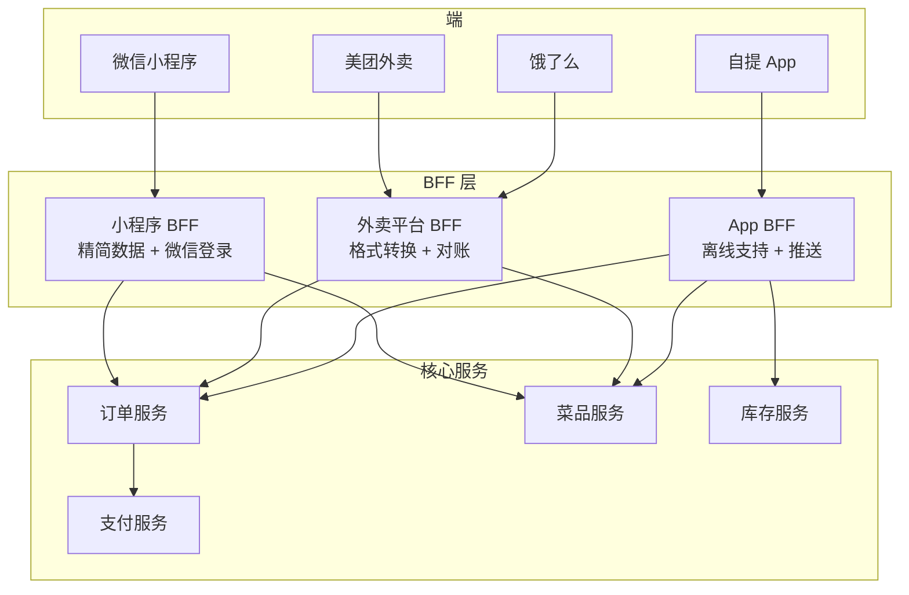
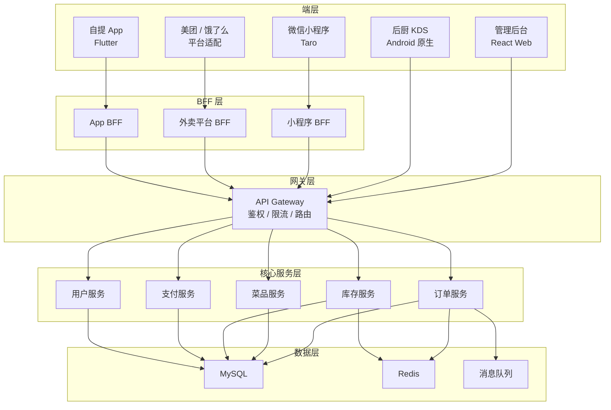

# 21 · 一个厨房，四个门面

> 从阿明的"堂食外卖自提全都要"，看移动端与多端架构的设计哲学

> **系列定位**：本篇是「阿明餐厅」系列的**正传 13**。在正传 8[《前厅翻修记》](./13-frontend-renovation.md)中，阿明把 Web 点餐页从 8 秒优化到 2 秒。但顾客不只在网页上点餐 —— 他们用微信小程序、美团外卖、饿了么、自提 App，甚至还有电话订餐。**同一个厨房，怎么服务四个完全不同的"门面"？**

---

## 引言：四个平行宇宙的订单

阿明同时接入了 4 个渠道：自有小程序、美团外卖、饿了么、自提 App。

每个渠道的菜单格式不同、订单格式不同、支付方式不同。后厨收到的订单像来自四个平行宇宙 —— 美团说"红烧牛肉面 x1（大份）"，饿了么说"item_id:3847 x1 (size:large)"，小程序说"菜品编号 12 号加辣"，自提 App 说"orderItem: beef_noodle_l, modifier: spicy"。

阿明崩溃了："我只是想好好做个菜，为什么要学四种'语言'？"

更头疼的是，同一道菜在四个平台的价格不一样、库存不同步、促销规则也各管各的。有一次超卖了 20 份红烧肉，四个平台同时接单，后厨根本做不出来。阿明被差评淹没，老陈说了一句让他冷静的话："**问题不在四个门面，而在厨房没有统一的接单方式。**"

---

## 第一章：多端的五种形态 —— 从 App 到 KDS 屏幕，都是门面

阿明让老陈梳理一下，市面上到底有多少种"端"。

老陈在白板上画了一张图："端的形态远比你想象的多。"他列出了五种主要形态，然后用餐厅的例子来解释：

```text
多端形态一览：
  1. 原生 App（Native）    → 自提 App（iOS / Android）
  2. H5（移动端网页）      → 微信公众号内的点餐页
  3. 小程序                → 微信 / 支付宝小程序
  4. 桌面 Web              → 管理后台、PC 端点餐
  5. IoT 设备              → 后厨 KDS 屏幕、自助点餐机
```

阿明没想到连后厨的 KDS（厨房显示系统）屏幕也算一种"端"。老陈说："只要能发指令给后厨的系统，都算一个'门面'。"

| 形态 | 性能 | 开发成本 | 更新方式 | 用户体验 | 适用场景 |
|------|------|----------|----------|----------|----------|
| 原生 App | ⭐⭐⭐⭐⭐ | 高（双端开发） | 需审核，周期长 | 最佳 | 高频、高性能需求（骑手 App） |
| H5 | ⭐⭐ | 低 | 即时更新 | 一般 | 轻量入口、营销活动页 |
| 小程序 | ⭐⭐⭐⭐ | 中 | 需审核，较快 | 较好 | 轻量级应用、高频低门槛（点餐） |
| 桌面 Web | ⭐⭐⭐ | 中 | 即时更新 | 中等 | 复杂交互（管理后台、数据看板） |
| IoT 设备 | ⭐⭐⭐⭐⭐ | 高（硬件适配） | OTA 推送 | 专用场景 | 后厨 KDS、自助点餐机 |

阿明的四个渠道分别对应不同形态：自有小程序属于**小程序**，美团和饿了么是**第三方平台的 H5 嵌入**，自提 App 是**原生 App**，管理后台是**桌面 Web**。

老陈总结："每种形态有各自的优缺点。选错了形态，就像在巷子里开了一家需要大客流的餐厅 —— 先天不足。"

**多端选型的第一步不是选技术，而是搞清楚用户在哪里、用什么设备、做什么操作。**

---

## 第二章：BFF 模式 —— 为每个端量身定制

梳理完端的形态，阿明发现更大的问题在后端。

现在的后端只有一个 API，所有端都调同一套接口。小程序觉得返回数据太多（带宽浪费），外卖平台觉得格式不对（要二次转换），自提 App 觉得缺少离线支持字段。

"一个厨房出四种菜，但厨师只有一种做法。"阿明说。

老陈提出了 **BFF（Backend For Frontend）** 模式 —— 为每个前端建一个**适配层**。后厨（核心服务）只说"普通话"，每个门面有自己的"翻译官"（BFF）。



小程序产品经理小何问："为什么不直接在后端加几个字段，非要搞一层 BFF？"

老陈解释："如果每加一个端就要改核心服务，核心服务会越来越臃肿。BFF 的价值是**隔离变化** —— 前端的需求变化只影响 BFF，不影响核心服务。"

| 模式 | 核心思想 | 餐厅类比 | 优点 | 缺点 |
|------|----------|----------|------|------|
| 单体 API | 所有端调同一个接口 | 后厨只出一个菜单 | 简单直接 | 端越多，接口越臃肿 |
| BFF 模式 | 每个端有专属适配层 | 每个门面有翻译官 | 隔离变化、按需裁剪 | 多一层维护 |
| API 网关 | 统一入口，路由分发 | 前台总调度 | 统一管理、鉴权限流 | 不适合深度定制 |

阿明选了 BFF + API 网关的组合：API 网关做统一鉴权和限流，BFF 做数据适配和格式转换。

接入 BFF 后，小程序的接口响应体从 12KB 降到 3KB（只返回小程序需要的字段），外卖平台的格式转换从前端挪到 BFF（前端代码量减少 40%）。

**BFF 的核心是"后端说普通话，每个门面有翻译官" —— 核心服务保持纯粹，适配层拥抱变化。**

---

## 第三章：跨平台框架选型 —— 没有银弹，选 team 能驾驭的

BFF 解决了后端问题，前端还有一道坎：四个端要写四套代码吗？

自提 App 的负责人老马算了笔账："iOS 一套、Android 一套、小程序一套、Web 一套 —— 四套代码、四拨人、四种 Bug。"

阿明问："有没有一种技术能通吃所有端？"

老陈摇头："没有银弹，但有几种框架可以减少重复开发。"他列出了主流跨平台框架的对比：

| 框架 | 性能 | 生态 | 学习曲线 | 热更新 | 适用团队 | 阿明的选择 |
|------|------|------|----------|--------|----------|-----------|
| React Native | ⭐⭐⭐⭐ | 丰富（NPM 生态） | 中（需 React 基础） | 支持 | 有 React 经验的团队 | 管理后台（React Web 共用组件） |
| Flutter | ⭐⭐⭐⭐⭐ | 成长中 | 中高（Dart 语言） | 部分支持 | 追求高性能 UI 的团队 | 骑手 App（地图 + 实时定位） |
| 原生开发 | ⭐⭐⭐⭐⭐ | 平台原生 | 高（Swift + Kotlin） | 不支持 | 大型团队、极致性能 | 暂无（成本太高） |
| Taro / uni-app | ⭐⭐⭐ | 国内生态好 | 低（Vue / React 语法） | 支持 | 小团队、多端小程序 | 用户端小程序（一套代码编译微信 + 支付宝） |

阿明的技术栈选择策略是**"按场景选框架，不追新不守旧"**：

- **用户端小程序**用 Taro：一套代码编译到微信小程序和支付宝小程序，覆盖 90% 的用户。Taro 用 React 语法写小程序，团队已有 React 经验，上手快。
- **骑手 App** 用 Flutter：骑手需要实时地图、GPS 轨迹绘制、后台推送，这些对性能要求高。Flutter 的自绘引擎（Skia / Impeller）在复杂动画场景下比 React Native 更流畅。
- **管理后台**用 React Web：管理后台是桌面端，交互复杂（拖拽排班、数据透视表），React 生态的 Ant Design 组件库可以大幅提速开发。

```text
阿明的多端技术栈：
  ┌──────────────────────────────────────────────────┐
  │              用户端（顾客）                        │
  │  微信小程序 ← Taro（React 语法，一套代码多端编译）   │
  │  支付宝小程序 ← Taro（同上）                       │
  ├──────────────────────────────────────────────────┤
  │              骑手端                               │
  │  iOS / Android ← Flutter（高性能地图 + 实时定位）   │
  ├──────────────────────────────────────────────────┤
  │              管理端                               │
  │  桌面 Web ← React + Ant Design（复杂交互）          │
  ├──────────────────────────────────────────────────┤
  │              设备端                               │
  │  后厨 KDS ← Android 原生（硬件适配 + 稳定性优先）   │
  └──────────────────────────────────────────────────┘
```

老陈提醒阿明注意一个常见陷阱："框架选型最大的坑不是'哪个框架最好'，而是'团队能驾驭哪个'。选了 Flutter 但团队没人会 Dart，项目就会卡死。"

老马补充了一条经验："跨平台框架的'一套代码多端运行'听起来很美，但实际开发中总有 10%-20% 的平台差异代码要单独处理。比如微信小程序的支付接口和支付宝的完全不同，这部分没法跨平台。"

**跨平台框架选型没有银弹 —— 选的不是"最好的"，而是"团队能驾驭、场景最匹配"的。**

---

## 第四章：API 适配与版本管理 —— 一套数据四份菜，按需裁剪不出错

BFF 建好了，框架选好了，但多端 API 的版本管理又出了乱子。

事情的起因是：小程序要上一个"拼单"功能，后端在订单接口加了 `groupOrder` 字段。结果外卖平台 BFF 没适配这个字段，直接把 `groupOrder: null` 透传给了美团，美团系统报错"未知字段"。

阿明怒了："加个字段而已，怎么把外卖搞崩了？"

老陈说："这就是多端 API 的核心挑战 —— **一个接口改了，所有端都受影响**。"

他在[《菜单设计学》](./10-api-design.md)中讲过的 API 版本管理，在多端场景下更复杂了。多端 API 适配有三个关键策略：

| 策略 | 核心思想 | 餐厅类比 | 技术实现 |
|------|----------|----------|----------|
| 响应裁剪 | 同一个接口，不同端返回不同字段 | 同一道菜，堂食用大盘，外卖用打包盒 | BFF 层按端筛选字段 |
| 内容协商 | 客户端告诉服务端"我要什么格式" | 顾客说"少放盐"，厨房按需调整 | Accept Header / 查询参数 |
| API 版本策略 | 新旧版本共存，平滑迁移 | 老菜单和新菜单并行，过渡期两本都能点 | URI 版本号 / Header 版本号 |

老陈在 BFF 层实现了一套**字段裁剪机制**。每个端在请求时带上 `X-Client-Type` 头，BFF 根据端的类型自动裁剪响应字段：

```python
# BFF 层的字段裁剪逻辑
class BFFFieldFilter:
    """根据客户端类型裁剪响应字段"""

    # 每个端需要的字段白名单
    FIELD_WHITELIST = {
        "miniapp": ["id", "name", "price", "image_url", "stock_status"],
        "delivery_meituan": ["item_id", "item_name", "price", "category_id",
                             "is_available", "description"],
        "delivery_eleme": ["id", "title", "price", "cat_id",
                           "available", "detail"],
        "app": ["id", "name", "price", "image_url", "stock_status",
                "nutrition", "allergens", "recommendation_score"],
    }

    def filter_response(self, client_type: str, data: dict) -> dict:
        """按端裁剪字段"""
        allowed = self.FIELD_WHITELIST.get(client_type, [])
        if not allowed:
            return data  # 未知端类型，返回全部字段

        return {k: v for k, v in data.items() if k in allowed}


# 使用示例
bff = BFFFieldFilter()

# 完整菜品数据（核心服务返回）
dish = {
    "id": 12,
    "item_id": "3847",
    "name": "红烧牛肉面",
    "item_name": "红烧牛肉面",
    "title": "红烧牛肉面",
    "price": 38.00,
    "image_url": "https://cdn.aming.com/dishes/12.jpg",
    "stock_status": "available",
    "category_id": "noodle",
    "cat_id": "noodle",
    "is_available": True,
    "available": True,
    "description": "精选牛腱肉，慢炖 4 小时",
    "detail": "精选牛腱肉，慢炖 4 小时",
    "nutrition": {"calories": 520, "protein": 28},
    "allergens": ["gluten", "soy"],
    "recommendation_score": 0.92,
    "group_order": None,  # 新增字段，仅部分端需要
}

# 小程序只拿精简字段
miniapp_result = bff.filter_response("miniapp", dish)
# → {"id": 12, "name": "红烧牛肉面", "price": 38.0,
#    "image_url": "...", "stock_status": "available"}

# 美团外卖拿平台要求的字段
meituan_result = bff.filter_response("delivery_meituan", dish)
# → {"item_id": "3847", "item_name": "红烧牛肉面", "price": 38.0,
#    "category_id": "noodle", "is_available": True,
#    "description": "精选牛腱肉，慢炖 4 小时"}
```

老陈还制定了 API 版本管理规则：

```yaml
# API 版本策略
versioning:
  strategy: "uri"  # /api/v1/orders, /api/v2/orders
  rules:
    - 新增字段: "不需要升版（向后兼容）"
    - 删除字段: "必须升版（破坏性变更）"
    - 修改字段类型: "必须升版（破坏性变更）"
    - 修改业务语义: "必须升版（破坏性变更）"
  lifecycle:
    - 新版本发布后，旧版本至少维护 6 个月
    - 废弃版本前，通知所有端的负责人
    - 通过 API 网关监控各版本的调用量
```

外卖对接工程师小吴说了一句很实在的话："多端 API 最怕的不是技术，而是**沟通**。后端改了一个字段，小程序知道，外卖平台不知道 —— 这种信息差才是事故的根源。"

**多端 API 的核心是"一套数据，按需裁剪" —— 核心服务提供全量数据，BFF 按端的需要取用。**

---

## 第五章：离线优先与弱网适配 —— 没网先记本子上，有信号了再入账

自提 App 上线后，骑手老马接到大量投诉："订单接了但送到一半就消失了。"

原因很快查明：骑手经常进出电梯、地下车库、偏远小区，这些地方网络信号极差。App 在弱网环境下提交订单，请求超时失败，但 UI 已经显示"接单成功"。等骑手到了有信号的地方，订单已经不在列表里了。

阿明吓了一跳："这意味着有顾客下了单但没人送？"

老马查了数据："过去一个月，弱网环境下的订单丢失率是 3%。按日均 500 单算，每天丢 15 单。"

这个问题在技术上叫**离线优先（Offline-First）**架构 —— 应用在没有网络时也能正常工作，等有网了再同步数据。

| 策略 | 核心思想 | 餐厅类比 | 技术方案 |
|------|----------|----------|----------|
| 离线队列 | 操作先存本地，有网后批量同步 | 没信号时先把订单记在本子上，有信号了再录入系统 | 本地 SQLite + 后台同步队列 |
| 乐观更新 | 先显示操作成功，后台异步确认 | 服务员先告诉顾客"下单成功"，再跑去厨房确认 | UI 即时反馈 + 后台重试 |
| 冲突解决 | 多端同时修改同一数据时的策略 | 两个服务员同时改了同一桌的账单 | 最后写入胜出 / 手动合并 |
| 网络感知 | 根据网络状况调整策略 | 信号差的时候只发文字不发图片 | Network Information API |

老马在骑手 App 中实现了离线优先架构：

```text
骑手 App 离线优先流程：

  ┌─────────────────────────────────────────┐
  │ 骑手点击"接单"                           │
  │   ↓                                     │
  │ 1. 写入本地 SQLite（状态：待同步）         │
  │ 2. UI 立即显示"已接单"（乐观更新）         │
  │ 3. 后台尝试提交到服务器                   │
  │   ├─ 成功 → 更新本地状态为"已同步"        │
  │   └─ 失败 → 保留本地，进入重试队列         │
  │        └─ 每 30 秒重试一次                │
  │        └─ 检测到网络恢复 → 批量同步        │
  │ 4. 同步成功后，从队列中移除                │
  └─────────────────────────────────────────┘
```

```json
{
  "offline_queue": [
    {
      "action": "accept_order",
      "order_id": "ORD-20240315-0042",
      "local_timestamp": "2024-03-15T12:30:45+08:00",
      "retry_count": 3,
      "status": "pending_sync",
      "payload": {
        "rider_id": "R007",
        "estimated_arrival": "2024-03-15T12:55:00+08:00"
      }
    },
    {
      "action": "complete_delivery",
      "order_id": "ORD-20240315-0038",
      "local_timestamp": "2024-03-15T12:32:10+08:00",
      "retry_count": 0,
      "status": "pending_sync",
      "payload": {
        "rider_id": "R007",
        "delivery_photo": "file:///local/photos/0038.jpg"
      }
    }
  ]
}
```

冲突解决的策略也很重要。老马选了"**最后写入胜出（Last Write Wins）**"+ "**服务端仲裁**"的组合：

- 如果骑手 A 和骑手 B 同时接了同一单（弱网延迟导致），服务端按接单时间戳分配给先到的人，后到的收到"订单已被接走"的提示。
- 如果骑手在离线状态下修改了配送地址（帮顾客改地址），上线后和服务端数据冲突，以骑手端为准（因为骑手在现场，信息更准确）。

实施离线优先架构后，骑手 App 的订单丢失率从 3% 降到 0.1%，顾客投诉"骑手没来取餐"的情况减少了 90%。

老马总结了一句让阿明印象深刻的话："**移动端的用户不会等你网络好了再操作。你得假设网络永远是差的，然后在这个假设上设计系统。**"

**离线优先的核心是"先让用户爽，再让数据对" —— 乐观更新保证体验，后台同步保证一致性。**

---

## 第六章：多端发布与灰度策略 —— Web 先试水，App 最后兜底

四个端都开发完了，但发布又是大麻烦。

阿明第一次多端同步发布就翻了车：Web 端和小程序同时上线"拼单"功能，Web 端秒级生效，小程序审核要 2 天。结果 Web 用户已经在用拼单了，小程序用户还看不到入口，拼单链接分享到微信群里，小程序用户点不开。

阿明苦笑："Web 跑在前面，小程序还在审核的起跑线上。"

多端发布的挑战不只是审核时间差，还有**功能一致性**和**回滚协调**的问题。

| 端 | 发布方式 | 审核周期 | 回滚难度 | 特点 |
|------|----------|----------|----------|------|
| 桌面 Web | 部署即生效 | 无审核 | 秒级回滚 | 最灵活，适合先行试水 |
| H5 | 部署即生效 | 无审核 | 秒级回滚 | 同 Web，但受限于宿主 App |
| 微信小程序 | 提交审核 → 发布 | 1-3 天 | 需重新审核 | 审核不可控，要提前提交 |
| 原生 App | 提交审核 → 发布 | 1-7 天 | 无法回滚（只能发新版） | 审核最严，回滚最慢 |
| IoT 设备 | OTA 推送 | 无审核 | 批量回滚 | 需要灰度推送，避免全量故障 |

老陈设计了**多端灰度发布策略**，核心原则是"风险越高的端，越晚发布"：


关键是**功能一致性**的管理。老陈引入了 **Feature Toggle**（功能开关）系统：

```python
# Feature Toggle 控制多端功能一致性
class FeatureFlagManager:
    """多端功能开关管理"""

    def __init__(self):
        self.flags = {}

    def set_flag(self, feature: str, platform: str, enabled: bool,
                 rollout_pct: int = 100):
        """设置某端的功能开关"""
        key = f"{feature}:{platform}"
        self.flags[key] = {
            "enabled": enabled,
            "rollout_percentage": rollout_pct,
            "updated_at": "2024-03-15T10:00:00+08:00"
        }

    def is_enabled(self, feature: str, platform: str,
                   user_id: str = None) -> bool:
        """检查某端某功能是否对当前用户开放"""
        key = f"{feature}:{platform}"
        flag = self.flags.get(key, {})

        if not flag.get("enabled", False):
            return False

        # 灰度百分比控制
        rollout = flag.get("rollout_percentage", 100)
        if rollout == 100:
            return True

        # 用 user_id 做确定性哈希（hashlib 不受 PYTHONHASHSEED 影响），
        # 保证同一用户始终命中或始终不命中
        if user_id:
            import hashlib
            hash_val = int(hashlib.md5(user_id.encode()).hexdigest(), 16) % 100
            return hash_val < rollout

        return False


# 使用示例
ff = FeatureFlagManager()

# 拼单功能：Web 已全量开放，小程序灰度 30%，App 暂未开放
ff.set_flag("group_order", "web", True, 100)
ff.set_flag("group_order", "miniapp", True, 30)
ff.set_flag("group_order", "app", False, 0)

# 检查某个小程序用户是否能看到拼单入口
if ff.is_enabled("group_order", "miniapp", user_id="U12345"):
    print("展示拼单入口")
else:
    print("隐藏拼单入口（该用户不在灰度范围内）")
```

老陈还制定了多端发布的"三不原则"：

```text
多端发布三不原则：
  1. 不跨端依赖：A 端的新功能不能依赖 B 端尚未发布的新功能
  2. 不强制同步：不要求所有端同时发布（审核周期不同，做不到）
  3. 不遗留死链：如果某端功能未上线，其他端的交叉引用要优雅降级
```

这与[《从接单到出餐》](./09-cicd-devops.md)中讲的灰度发布策略一脉相承 —— 灰度不只是"放量"，更是"控制爆炸半径"。

经过三个月的磨合，阿明的多端发布流程稳定了：Web 端每周发布 2 次，小程序每周 1 次（提前提审），App 每两周 1 次。Feature Toggle 让所有端的功能状态一目了然，再也没出现过"链接分享到微信群但打不开"的尴尬。

**多端发布的核心是"Web 先行验证，小程序跟进覆盖，App 最后兜底" —— 用发布顺序控制风险。**

---

## 核心总结：多端架构的分层哲学



| 策略 | 核心问题 | 餐厅类比 | 技术实现 |
|------|----------|----------|----------|
| 多端形态选型 | 用户在哪个端？ | 堂食、外卖还是自提？ | Native / H5 / 小程序 / Web / IoT |
| BFF 模式 | 每个端要什么数据？ | 每个门面有翻译官 | BFF 适配层 + 字段裁剪 |
| 跨平台框架 | 怎么减少重复开发？ | 一套菜谱多端排版 | Taro / Flutter / React |
| API 适配 | 多端如何共享一套 API？ | 后厨出普通话，翻译官转方言 | 响应裁剪 + 版本管理 |
| 离线优先 | 没网怎么办？ | 先记本子上，有信号再录入 | 本地队列 + 乐观更新 |
| 多端发布 | 怎么协调四个端的上线？ | Web 先试水，App 最后兜底 | Feature Toggle + 灰度策略 |

### 一句心法

**一个厨房可以服务四个门面，但后厨只能有一种做菜方式。多端架构的核心是：前端多样化，后端统一化。**

---

## 延伸阅读

- [当餐厅长出大脑](./01-ai-agent-architecture.md) —— AI Agent 的推理引擎架构，多端场景下 AI 推荐也需要 BFF 层做适配
- [架构是"长"出来的](./02-system-architecture-evolution.md) —— 系统架构从单体到微服务的演进，多端架构的后端基础
- [给产品经理的重构说明书](./03-refactoring-guide-for-pm.md) —— 重构决策的产品视角，多端重构如何和产品经理沟通 ROI
- [高峰保卫战](./04-peak-traffic-defense.md) —— 多端同时涌入的流量洪峰，API 网关的限流和熔断策略
- [厨房装监控](./05-observability.md) —— 多端链路的可观测性，如何在 BFF 层做链路追踪
- [食安大检查](./06-security-architecture.md) —— 多端场景下的安全挑战，每个端的认证方式不同（微信登录 vs 手机号 vs 平台 Token）
- [从厨师到 CEO](./07-from-chef-to-ceo.md) —— 多端团队的组建和管理，跨端协作的组织架构设计
- [厨房质检员](./08-qa-testing-strategy.md) —— 多端测试策略，每个端的自动化测试和兼容性测试
- [从接单到出餐](./09-cicd-devops.md) —— 多端 CI/CD 流水线的设计，不同端的构建和发布流程
- [菜单设计学](./10-api-design.md) —— API 设计的核心原则，多端 API 版本管理和接口设计的基础
- [学徒的困境](./11-ai-learning-paradox.md) —— AI 时代的人机协作与学习之道，当 AI 越来越强，人还要不要练基本功
- [数据厨房](./12-data-kitchen.md) —— 多端数据的统一治理，四个端的用户行为数据如何汇入同一个数据仓库
- [前厅翻修记](./13-frontend-renovation.md) —— 前端工程化与用户体验，组件化设计系统是多端一致性的基础
- [阿明的省钱经](./14-cloud-finops.md) —— 多端架构的云成本分析，BFF 层和多套构建流水线的成本优化
- [差评危机](./15-incident-response.md) —— 多端故障的应急响应，某个端出了问题如何快速定位和止血
- [外卖大战](./16-performance-optimization.md) —— 系统性能优化方法论，多端场景下每个端的性能指标和优化策略
- [传菜窗口的智慧](./20-realtime-eventdriven.md) —— 异步消息架构，多端之间的消息同步和事件驱动设计
- [十家店的烦恼](./18-distributed-puzzles.md) —— 分布式系统的经典难题，多端库存同步中的分布式一致性问题
- [阿明的加盟帝国](./19-saas-multitenant.md) —— 多租户 SaaS 架构，加盟店的多端管理（每个加盟商有自己的端和配置）
- [厨房实况直播](./20-realtime-eventdriven.md) —— 实时事件驱动架构，骑手 App 的实时位置推送和多端状态同步
- [懂你的菜单](./22-search-recommendation.md) —— 搜索与推荐系统，多端场景下推荐结果需要按端的展示能力做适配
- [菜谱标准化之路](./07-from-chef-to-ceo.md) —— 技术文档与知识管理，多端开发团队的文档协作和知识共享
- [仓库搬家不停业](./24-database-migration.md) —— 数据库迁移实战，多端共享数据库的迁移策略和零停机方案
- [预制菜还是现炒](./25-lowcode-platform.md) —— 低代码平台选型，多端场景下低代码能否替代定制化开发
- [阿明出海记](./26-globalization.md) —— 国际化与全球化，多端架构在多语言多时区多币种场景下的挑战
- [厨房大换岗](./27-ai-org-transformation.md) —— AI 转型对多端的影响，不同端的人机协同模式不同
- [阿明的二次创业](./28-ai-native-startup.md) —— AI 原生创业的多端覆盖策略，AI 辅助快速适配多个平台
- [会自我进化的厨房](./29-self-evolving-company.md) —— Agent Loop 的跨端协作，Agent 需要统一处理多端输入输出
- [AI 的"黑暗料理"](./30-ai-hallucination-safety.md) —— AI 幻觉在不同端的表现，多端场景的幻觉检测和展示策略差异化
- [09.front-end / 08 跨端](../09.front-end/08-cross-platform/README.md) —— 移动 / 桌面 / 小程序 / PWA：跨端形态全景与选型
- [09.front-end / 05 架构 / BFF](../09.front-end/05-architecture/bff/README.md) —— BFF 模式详细实践：本章 BFF 概念的工程化落地
- [09.front-end / 09 前端与 AI](../09.front-end/09-frontend-and-ai/README.md) —— AI Native UI / AI SDK / Vibe Coding

## 跨章节衔接

- [13-frontend-renovation.md](./13-frontend-renovation.md) —— 正传 8，多端架构与前端工程化的关系：组件库、设计系统、构建产物
- [19-saas-multitenant.md](./19-saas-multitenant.md) —— 番外三，多端架构支持 SaaS 多租户的入口分流：不同终端对应不同租户
- [26-globalization.md](./26-globalization.md) —— 番外六，多端架构下的国际化：不同地区、不同语言、不同端 UI 适配

---

## 结语

阿明的多端故事，揭示了一个所有成长型业务都会遇到的矛盾：**用户触点越来越多，但后端必须保持统一。**

答案是六层架构：选对端形态、建好 BFF 适配层、选准跨平台框架、管好 API 版本、做好离线优先、协调好多端发布。

故事讲到最后，阿明站在厨房里，看着四个渠道的订单在同一个 KDS 屏幕上整齐排列。他笑了："原来不是我需要学四种语言，而是需要四个翻译官，让后厨只说普通话。"

老陈在旁边补了一句："等哪天你开了海外店，还得加一种语言 —— 不过那是以后出海的故事了。"

下次当你面对多端架构时，不妨问自己：

- 你的系统有几个端？每个端的用户画像和核心场景是什么？
- 你有 BFF 层吗？还是所有端都在调同一个臃肿的 API？
- 你的跨平台框架选型是基于场景和团队能力，还是基于"什么最流行"？
- 你的移动端有离线能力吗？弱网环境下的用户体验如何？
- 你的多端发布有协调策略吗？还是每次都靠人肉同步？

> 好的多端架构，不是让四个门面看起来一样，而是让后厨永远不需要知道外面有几个门面。

← [返回系列导读](./index.md)
