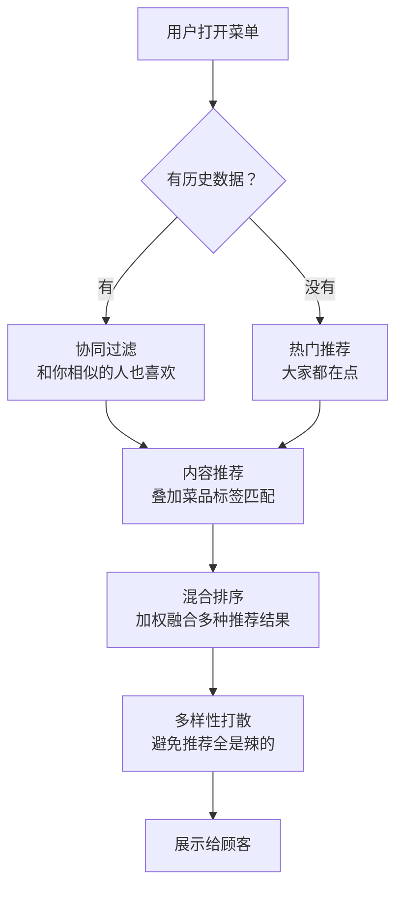
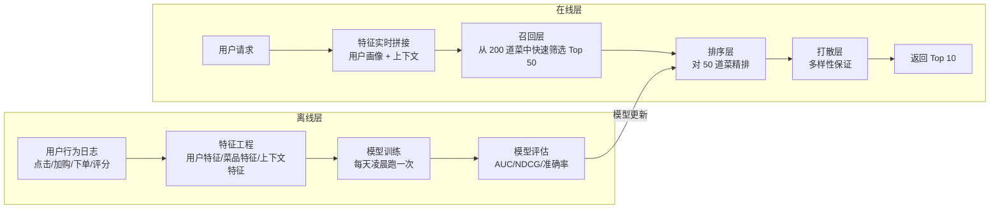
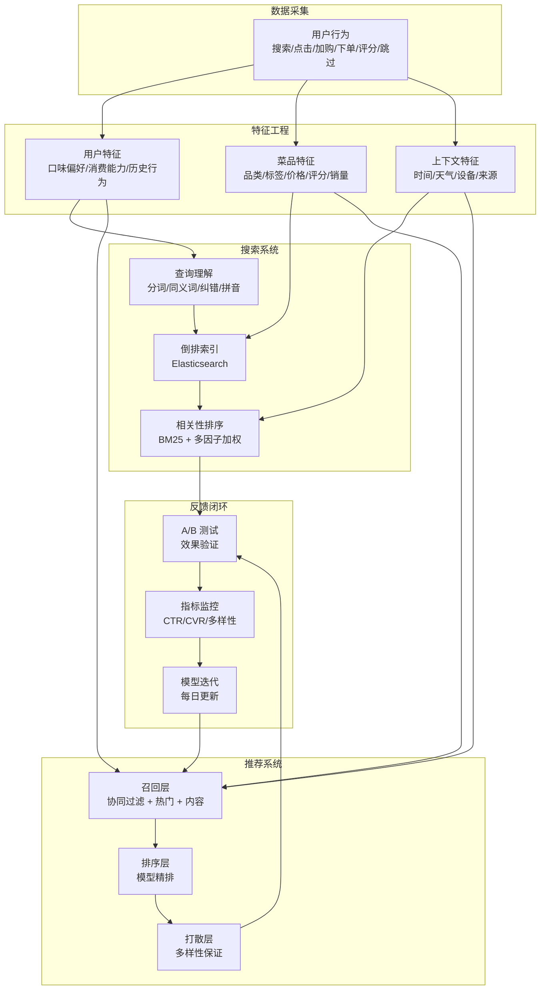

<!--
story:
  number: 21
  type: 番外
  position: 番外四
  title: 懂你的菜单
  audience: PM / 创业者
-->

# 22 · 懂你的菜单

> 从阿明的"千人千面菜单"，看搜索与推荐系统的设计实战

> **系列定位**：本篇是「阿明餐厅」系列的**番外四**。在正传 7[《数据厨房》](./12-data-kitchen.md)中，阿明学会了用数据驱动决策。但"分析历史数据"只是第一步 —— 更刺激的问题是：**能不能在顾客打开菜单的瞬间，就知道他想吃什么？** 这就是搜索与推荐系统的魅力。

---

## 引言：200 道菜的困局

阿明的线上菜单有 200 道菜。

顾客打开页面，翻了 30 秒还没决定点什么，关掉了。数据显示：**70% 的顾客只点前 10 道菜，剩下 190 道菜几乎无人问津。**

阿明的老顾客小李抱怨："每次来你们家都不知道点什么，要是菜单能根据我的口味推荐就好了。我明明每次来都点辣的，为什么首页推荐的第一个菜是清炒时蔬？"

阿明想：200 道菜 × 10000 个顾客 × 每人不同偏好 —— 这不可能靠人工排序，得靠算法。

更棘手的是搜索。有个顾客搜索"红烧"，出来了 30 道带"红烧"的菜，但排第一的居然是"红烧狮子头"（一道他从来不吃的猪肉菜），而他常点的"红烧牛肉面"排在第 17 位。"搜索也不懂我。"这位顾客说完就去了隔壁。

阿明找到老陈："搜索和推荐，能不能一起做？"老陈说："搜索是'顾客说想吃什么'，推荐是'系统猜他想吃什么'。底层技术有交集，但上层逻辑完全不同。我们一个一个来。"

---

## 第一章：搜索系统基础 —— 给 200 道菜建目录，一翻就到

阿明的第一版搜索很简单：顾客输入关键词，系统用 `LIKE '%关键词%'` 去数据库里模糊匹配。

"这就像在 200 本菜谱里一页一页翻。"老陈说。而且结果质量很差 —— 搜"辣的"搜不到"麻辣香锅"（因为菜名里没有"辣"字），搜"鸡丁"出来一堆不相关的菜（因为简介里碰巧有"鸡"和"丁"两个字）。

老陈引入了**倒排索引（Inverted Index）**—— 搜索引擎的核心数据结构。

```text
正排索引（Forward Index）：
  文档 → 关键词
  菜品 1（宫保鸡丁）→ ["鸡丁", "花生", "辣椒", "川菜", "微辣"]
  菜品 2（麻辣香锅）→ ["麻辣", "香锅", "辣椒", "川菜", "中辣"]
  菜品 3（清炒时蔬）→ ["时蔬", "清淡", "素菜", "少油"]

倒排索引（Inverted Index）：
  关键词 → 文档
  "鸡丁"    → [菜品 1]
  "辣椒"    → [菜品 1, 菜品 2]
  "麻辣"    → [菜品 2]
  "川菜"    → [菜品 1, 菜品 2]
  "清淡"    → [菜品 3]
  "辣"      → [菜品 1, 菜品 2]  ← 同义词扩展后
```

餐厅类比：200 本菜谱的"目录索引" —— 想找"辣的"菜，不用翻 200 本书，查索引就知道在第几页第几行。

老陈用 **Elasticsearch**（业界最主流的搜索引擎）搭建了搜索服务。他给阿明解释了三个核心概念：

| 概念 | 含义 | 餐厅类比 | 配置示例 |
|------|------|----------|----------|
| 索引（Index） | 一类数据的集合 | 一本菜谱目录 | `dishes_index`（菜品索引） |
| 分片（Shard） | 索引的水平拆分 | 把目录按菜系分成几本小册子 | 5 个主分片 + 1 个副本 |
| 分析器（Analyzer） | 文本处理流水线 | 把顾客的口语翻译成厨房能懂的术语 | IK 中文分词 + 同义词过滤 |

分析器是搜索质量的关键。老陈配了一个中文分析器：

```json
{
  "settings": {
    "analysis": {
      "analyzer": {
        "dish_analyzer": {
          "type": "custom",
          "tokenizer": "ik_max_word",
          "filter": ["synonym_filter", "lowercase_filter"]
        }
      },
      "filter": {
        "synonym_filter": {
          "type": "synonym",
          "synonyms": [
            "辣的,麻辣,微辣,重辣,spicy",
            "鸡丁,鸡肉丁,鸡块",
            "牛肉面,牛腩面,牛肉拉面",
            "时蔬,蔬菜,青菜,素菜"
          ]
        },
        "lowercase_filter": {
          "type": "lowercase"
        }
      }
    }
  }
}
```

配好分析器后，搜"辣的"就能搜到"麻辣香锅"（同义词扩展），搜"宫保鸡丁"不会因为分词错误而搜到"宫保"和"鸡丁"两道不相关的菜。

搜索响应时间从 `LIKE` 查询的 800ms 降到 Elasticsearch 的 15ms。阿明第一次感受到："原来搜索可以这么快。"

**搜索系统的基础是倒排索引 —— 把"翻遍所有书找关键词"变成"查一下目录就知道在哪"。**

---

## 第二章：搜索相关性调优 —— BM25 打底，业务因子加权排座次

搜索能用了，但结果排序有问题。

搜"牛肉面"，排第一的是"牛肉面套餐"（包含饮料和小菜），而不是单品"红烧牛肉面"。阿明问："套餐又不是我要的面，为什么排前面？"

老陈解释："搜索引擎默认按**相关性**排序，但'相关性'不等于'用户想要的'。我们需要**调优**排序算法。"

搜索引擎的核心排序算法有两代：

| 算法 | 核心思想 | 餐厅类比 | 优点 | 缺点 |
|------|----------|----------|------|------|
| TF-IDF | 词频越高越相关，但要除以全局词频 | 一道菜名里"牛肉"出现 3 次，比出现 1 次的更相关 | 简单有效 | 词频饱和问题（出现 100 次不会比 10 次好 10 倍） |
| BM25 | TF-IDF 的改进版，加入文档长度归一化和饱和函数 | 菜名短且精准的比菜名长且啰嗦的排名更高 | 业界标准，效果更好 | 参数需要调优 |

Elasticsearch 7.x 开始默认使用 BM25。老陈在 BM25 的基础上做了**多因子加权排序**：

```json
{
  "query": {
    "function_score": {
      "query": {
        "multi_match": {
          "query": "牛肉面",
          "fields": ["name^5", "description^2", "tags^3", "category^2"]
        }
      },
      "functions": [
        {
          "field_value_factor": {
            "field": "sales_count_30d",
            "modifier": "log1p",
            "factor": 0.3
          }
        },
        {
          "field_value_factor": {
            "field": "rating",
            "modifier": "none",
            "factor": 0.2
          }
        },
        {
          "field_value_factor": {
            "field": "profit_margin",
            "modifier": "none",
            "factor": 0.1
          }
        }
      ],
      "score_mode": "sum",
      "boost_mode": "multiply"
    }
  }
}
```

这个查询的含义是：**最终得分 = 文本相关性 × (BM25 分 + 销量加分 + 评分加分 + 利润加分)**。实际计算比简单的加法更复杂，涉及 modifier 函数变换（如 `log1p` 对销量取对数，避免头部商品得分过于碾压长尾商品；`score_mode` 和 `boost_mode` 参数控制各因子的组合方式）。

数据工程师小方给阿明解释了排序因子的设计逻辑：

| 排序因子 | 权重 | 为什么重要 | 餐厅类比 |
|----------|------|-----------|----------|
| 文本相关性（BM25） | 基础分 | 搜的东西和菜名越匹配越好 | 菜名里有"牛肉面"的排在前面 |
| 近 30 天销量 | 0.3 | 热门菜大概率不会踩雷 | 大家都点的不容易出错 |
| 用户评分 | 0.2 | 高分菜质量有保障 | 回头客说好的菜差不了 |
| 利润率 | 0.1 | 同等条件下优先推利润高的 | 赚钱的菜多卖一点 |
| 用户偏好匹配 | 0.2 | 个性化 —— 结合推荐系统 | 这个顾客喜欢辣的，辣的加分 |

老陈还处理了两个常见的搜索体验问题：

**拼音搜索**：顾客可能不会打字，输入"gongbaojiding"（拼音），系统需要识别并搜索"宫保鸡丁"。用拼音分析器（pinyin analyzer）建立拼音到汉字的映射索引。

**搜索纠错**：顾客输入"宫爆鸡丁"（常见错别字），系统用编辑距离（Levenshtein Distance）算法检测到"宫爆"和"宫保"只差一个字，自动纠正并提示"您是不是要找：宫保鸡丁？"。

调优后，搜"牛肉面"的排第一位变成了"红烧牛肉面"（高销量 + 高评分），搜索转化率从 35% 提升到 62%。

**搜索相关性调优的核心是"BM25 打底，业务因子加权" —— 纯文本相关性不够，要加上销量、评分、利润等业务维度。**

---

## 第三章：推荐系统四大范式 —— 协同、内容、热门、混合四派猜你想吃

搜索解决了"顾客知道想吃什么"的场景，但更多时候顾客不知道想吃什么 —— 他需要**推荐**。

阿明问老陈："推荐系统是怎么猜出顾客想吃什么的？"

老陈说："猜法有很多派别，就像做菜有川派、粤派、鲁派。推荐系统也有四大范式。"

产品运营小苏给阿明画了一张对比表：

| 范式 | 核心思想 | 餐厅类比 | 冷启动表现 | 计算成本 | 多样性 | 可解释性 |
|------|----------|----------|-----------|----------|--------|----------|
| 协同过滤 | 和你口味相似的人也喜欢 | 服务员记住老顾客的偏好，推荐"和你一样的人都点了的菜" | 差（需要历史数据） | 中 | 中 | 强（"和你口味相似的人也喜欢"） |
| 内容推荐 | 你喜欢的菜有共同特征 | 根据菜品标签推荐 —— 你喜欢辣的，推荐其他辣的 | 中（需要菜品标签） | 低 | 差（推荐越来越窄） | 强（"因为你上次点了辣的"） |
| 热门推荐 | 大家都在点 | 看哪道菜点的人最多就推荐哪道 | 好（不需要个人数据） | 极低 | 差（千人一面） | 弱（"热门"不够个性化） |
| 混合推荐 | 以上多种方法的组合 | 先推热门打底，再叠加个性化 | 好 | 高 | 好 | 中 |

老陈详细讲解了协同过滤的两种流派：

```text
协同过滤的两种思路：

用户协同（User-based CF）：
  "和你口味相似的人，也喜欢这些菜"
  步骤：
    1. 找到和用户 A 口味最相似的 Top 10 用户
    2. 看这 10 个人点了什么菜
    3. 推荐他们点过但 A 还没点过的菜

物品协同（Item-based CF）：
  "和你喜欢的菜相似的菜"
  步骤：
    1. 找到和用户 A 点过的菜最相似的 Top 10 道菜
    2. 推荐 A 还没点过的菜
  优点：物品相似度比用户相似度更稳定（菜品特征不会变，但用户口味会变）
```

阿明问："哪个更好？"

老陈说："对于阿明餐厅这种规模的菜品（200 道），**物品协同过滤**更合适。原因是菜品数量远小于用户数量（200 vs 10000），计算菜品之间的相似度更快、更稳定。"

但单一范式都有缺陷。老陈最终选择了**混合推荐**：



小苏补充："混合推荐的关键不是'用多少种算法'，而是'怎么融合'。最朴素的方法是加权融合 —— 每种推荐方法给出候选菜和分数，按权重相加后排序。"

**推荐系统没有"最好的算法"，只有"最适合的组合" —— 混合推荐是工业界的主流选择。**

---

## 第四章：冷启动问题 —— 新客进门三问口味，热门兜底渐进懂你

推荐系统上线第一周，阿明发现了一个严重问题：**新用户的推荐结果一塌糊涂**。

新用户没有任何历史数据，系统不知道该推荐什么。结果新用户的首页推荐全是随机菜品 —— 有人看到了 5 道甜品（他是来吃正餐的），有人看到了 3 道儿童套餐（他是单身白领）。

"这推荐也太蠢了。"阿明看着新用户的推荐列表直摇头。

这就是推荐系统最经典的**冷启动问题（Cold Start Problem）**—— 新用户没数据、新菜品没被点过，推荐系统无从"学习"。

| 冷启动类型 | 问题描述 | 餐厅类比 | 解决方案 |
|-----------|----------|----------|----------|
| 用户冷启动 | 新用户没有历史行为 | 新顾客来了，服务员不知道他口味 | 用户画像 + 热门兜底 + 快速学习 |
| 物品冷启动 | 新菜品没有被点过 | 新菜上了菜单，没人点过 | 内容特征匹配 + 强推曝光 |
| 系统冷启动 | 系统刚上线，什么都没有 | 餐厅刚开业，一张白纸 | 规则引擎 + 人工编排 |

老陈设计了一套**新用户渐进式推荐策略**：

```text
新用户推荐策略（渐进式）：

  第 1 次访问：
    → 热门菜 Top 10 + 当前时段推荐（午餐推正餐，下午茶推饮品）
    → 同时采集隐式信号：点击了哪些菜？停留多久？加购了什么？

  第 2-3 次访问：
    → 根据第 1 次的行为，初步判断口味偏好
    → 热门菜 50% + 内容推荐 50%（基于已知的偏好标签）

  第 4 次及以后：
    → 切换到个性化推荐
    → 协同过滤 60% + 内容推荐 25% + 热门兜底 15%
    → 持续探索：10% 的推荐位留给"探索性推荐"（尝试新口味）
```

小苏提出了一个精妙的设计 —— **探索与利用（Explore vs Exploit）** 的平衡：

| 策略 | 含义 | 餐厅类比 | 占比 |
|------|------|----------|------|
| 利用（Exploit） | 推荐已知用户喜欢的类型 | 每次都推他爱吃的红烧牛肉面 | 85%-90% |
| 探索（Explore） | 尝试推荐用户没试过的类型 | 偶尔推荐一道他可能没尝过的新菜 | 10%-15% |

"如果只推已知的，用户会觉得'每次都一样，没新意'。如果探索太多，用户会觉得'推荐不准'。"小苏说。

阿明还在新用户首次打开菜单时加入了一个巧妙的交互 —— **"三选一"快速画像**：

```text
新用户首次打开菜单：
  ┌─────────────────────────────────┐
  │  嗨，第一次来？                  │
  │  告诉我你的口味，我帮你挑菜       │
  │                                 │
  │  🌶️ 无辣不欢                    │
  │  🍖 大口吃肉                    │
  │  🥗 清淡健康                    │
  │                                 │
  │  [选好了，开始推荐]              │
  └─────────────────────────────────┘
  
  用户选"无辣不欢"后：
    → 用户画像标签：spicy_lover = true
    → 首次推荐：辣菜 Top 10（而非全站热门 Top 10）
    → 冷启动阶段缩短 50%
```

这个设计让新用户的推荐满意度从 32% 提升到 58%，首单转化率提高了 15%。

**冷启动的核心是"用最少的问题，最快了解用户" —— 热门兜底保底，渐进学习提升，探索发现惊喜。**

---

## 第五章：推荐系统的工程实现 —— 离线算好在线取快，200 毫秒出菜

算法设计好了，但要把它变成一个能在 200ms 内返回结果的在线服务，挑战才刚刚开始。

阿明第一次跑推荐模型时，系统卡了 8 秒才出结果。"200ms 是目标，8 秒是现实。"阿明苦笑。

老陈解释了推荐系统的工程架构 —— 它分为**离线训练**和**在线推理**两大部分：



在线推理分为三层：**召回 → 排序 → 打散**。这是工业界推荐系统的标准架构。

| 层次 | 作用 | 菜品数量变化 | 延迟目标 | 餐厅类比 |
|------|------|-------------|----------|----------|
| 召回层 | 从全量菜品中快速筛选候选集 | 200 → 50 | < 20ms | 先从所有菜里挑出可能想吃的 |
| 排序层 | 对候选集精细排序 | 50 → 20 | < 100ms | 在候选里排出最优顺序 |
| 打散层 | 保证多样性，避免推荐太单一 | 20 → 10 | < 10ms | 确保不全是辣的 |

特征工程是推荐效果的基石。老陈整理了三大类特征：

```json
{
  "user_features": {
    "user_id": "U12345",
    "gender": "male",
    "age_range": "25-35",
    "spicy_preference": 0.85,
    "avg_order_amount": 45.5,
    "order_frequency": 3.2,
    "favorite_categories": ["川菜", "面食"],
    "last_order_dish_ids": [12, 45, 78],
    "membership_level": "gold"
  },
  "dish_features": {
    "dish_id": 12,
    "name": "红烧牛肉面",
    "category": "面食",
    "tags": ["牛肉", "辣", "面食"],
    "price": 38.0,
    "avg_rating": 4.7,
    "sales_count_30d": 1200,
    "profit_margin": 0.55,
    "is_new": false,
    "is_seasonal": false
  },
  "context_features": {
    "time_of_day": "lunch",
    "day_of_week": "weekday",
    "weather": "rainy",
    "device": "miniapp",
    "is_first_visit_today": true
  }
}
```

小方特别强调了**上下文特征**的重要性："下雨天推热汤面，夏天推凉菜冷饮，周末推家庭套餐 —— 上下文特征能让推荐准确率提升 20% 以上。"

为了验证推荐效果，老陈设计了 **A/B 测试**框架：

```text
推荐系统 A/B 测试设计：

  对照组（A 组）：50% 用户
    → 使用旧版推荐（热门排序）
    
  实验组（B 组）：50% 用户
    → 使用新版推荐（混合推荐 + 个性化）

  核心指标：
    1. 推荐点击率（CTR）：A 组 12% vs B 组 28%
    2. 推荐转化率（CVR）：A 组 5%  vs B 组 11%
    3. 客单价：A 组 38 元 vs B 组 45 元
    4. 推荐多样性：A 组 3 个品类 vs B 组 5 个品类

  统计显著性：p < 0.01（B 组显著优于 A 组）
  
  结论：上线新版推荐
```

缓存策略也是工程实现的关键。老陈采用了**预计算 + 实时微调**的方式：

- **预计算**：每天凌晨跑一次模型，把每个用户的推荐候选集（Top 50）预计算好，存入 Redis。在线请求时直接从 Redis 读取，延迟 < 5ms。
- **实时微调**：在线请求时，根据当前上下文（时间、天气、最近一次点击）对预计算结果做轻量级重排序。

经过工程优化，推荐系统的在线推理延迟从 8 秒降到 85ms，满足了 200ms 的目标。

**推荐系统工程的核心是"离线算好，在线取快" —— 离线训练保证质量，在线缓存保证速度。**

---

## 第六章：搜索推荐的监控与迭代 —— 别只盯点击率，用户满意才是真好

推荐系统上线三个月，效果不错。但小苏发现了一个隐患：

"推荐点击率一直在涨，但顾客点的菜越来越集中在少数几道菜上。推荐系统的'个性化'变成了'同质化'。"

更严重的是，有些菜品的名字被改成了"标题党"风格 —— "超级无敌巨好吃の麻辣牛肉"。因为搜索排序中"点击率"权重高，标题越夸张，点击率越高，排名越靠前。

阿明怒了："这不是在骗顾客点进来吗？点进来发现没那么好吃，差评更多。"

这就是推荐系统最常见的**反馈回路陷阱** —— 系统过度优化某个指标，反而伤害了用户体验。

老陈建立了搜索推荐系统的**核心监控指标体系**：

| 指标类别 | 具体指标 | 含义 | 告警阈值 | 餐厅类比 |
|----------|----------|------|----------|----------|
| 搜索质量 | 搜索成功率 | 搜索后有点击的比例 | < 50% 告警 | 搜了能不能找到想吃的 |
| 搜索质量 | 零结果率 | 搜索返回 0 条结果的比例 | > 10% 告警 | 搜了半天什么都没有 |
| 推荐效果 | 推荐点击率（CTR） | 推荐菜品被点击的比例 | 异常波动告警 | 推荐的菜顾客愿不愿意看 |
| 推荐效果 | 推荐转化率（CVR） | 推荐菜品被下单的比例 | < 5% 告警 | 看了之后愿不愿意点 |
| 推荐健康度 | 推荐多样性 | 推荐结果覆盖的品类数 | < 3 个品类告警 | 推荐的是不是一直那几道 |
| 推荐健康度 | 推荐覆盖率 | 被推荐过的菜品占总菜品的比例 | < 40% 告警 | 是不是只有少数菜被推荐 |
| 用户体验 | 跳过率 | 推荐结果被跳过的比例 | > 70% 告警 | 顾客连看都不看就划走了 |

小苏特别强调了**"推荐茧房"问题**：

```text
推荐茧房的形成过程：

  第 1 周：用户点了 2 道辣的菜
    → 系统学习："他喜欢辣的"
    → 推荐 8 道辣的 + 2 道其他

  第 2 周：用户在推荐中又点了辣的（因为推荐的大部分是辣的）
    → 系统强化："他确实喜欢辣的！"
    → 推荐 10 道辣的 + 0 道其他

  第 3 周：用户觉得"推荐全是辣的，没新意"
    → 用户流失

  根本原因：推荐系统把"用户选择了辣的"
           误解为"用户只想吃辣的"
           —— 其实用户只是没得选
```

为了解决茧房问题，老陈在推荐结果中加入了**强制多样性打散**：

```python
class DiversityScatter:
    """推荐结果多样性打散"""

    def scatter(self, candidates: list, max_same_category: int = 3) -> list:
        """确保连续推荐中同一品类不超过 max_same_category 个"""
        result = []
        category_count = {}

        # 按品类分桶
        buckets = {}
        for dish in candidates:
            cat = dish["category"]
            if cat not in buckets:
                buckets[cat] = []
            buckets[cat].append(dish)

        # 轮流从不同品类中取
        while len(result) < len(candidates):
            added = False
            for cat, dishes in buckets.items():
                if not dishes:
                    continue
                recent_cats = [d["category"] for d in result[-max_same_category:]]
                if recent_cats.count(cat) < max_same_category:
                    result.append(dishes.pop(0))
                    added = True
                    break
            if not added:
                # 所有品类都达到上限，取剩余中分数最高的
                remaining = [d for ds in buckets.values() for d in ds]
                if remaining:
                    result.append(remaining.pop(0))
                else:
                    break

        return result


# 使用示例
scattered = DiversityScatter()

# 打散前：全是川菜
before = [
    {"name": "宫保鸡丁", "category": "川菜", "score": 0.95},
    {"name": "麻婆豆腐", "category": "川菜", "score": 0.92},
    {"name": "回锅肉",   "category": "川菜", "score": 0.90},
    {"name": "水煮鱼",   "category": "川菜", "score": 0.88},
    {"name": "清炒时蔬", "category": "素菜", "score": 0.75},
    {"name": "番茄蛋汤", "category": "汤品", "score": 0.70},
]

# 打散后：川菜最多连续 2 个，穿插其他品类
after = scattered.scatter(before, max_same_category=2)
# → 宫保鸡丁(川菜), 麻婆豆腐(川菜), 清炒时蔬(素菜),
#   回锅肉(川菜), 番茄蛋汤(汤品), 水煮鱼(川菜)
```

阿明还吸取了一个惨痛教训：不再单纯优化点击率。他把搜索排序的权重从"点击率 50%"调整为"点击率 20% + 下单转化率 30% + 用户评分 25% + 多样性 15% + 利润率 10%"。

"标题党菜名"问题也随之解决 —— 标题夸张虽然提高了点击率，但下单转化率低（点进来发现不是那回事），综合评分反而下降了。

三个月后，推荐覆盖率从 25%（只有 50 道菜被推荐过）提升到 72%（144 道菜都被推荐过），用户人均尝试菜品数从 3.2 道提升到 5.8 道。

**搜索推荐监控的核心是"不要只盯一个指标" —— 点击率涨了不代表用户满意了，可能只是标题党在作怪。**

---

## 核心总结：搜索推荐系统的数据流



| 策略 | 核心问题 | 餐厅类比 | 技术实现 |
|------|----------|----------|----------|
| 搜索基础 | 怎么快速找到想要的菜？ | 200 本菜谱的目录索引 | 倒排索引 + Elasticsearch |
| 搜索调优 | 搜出来的结果怎么排序？ | 搜"牛肉面"把最好吃的排前面 | BM25 + 多因子加权 |
| 推荐范式 | 怎么猜顾客想吃什么？ | 服务员记住偏好 vs 看菜品标签 | 协同过滤 + 内容 + 热门 + 混合 |
| 冷启动 | 新用户没有数据怎么办？ | 新顾客来了先推热门 | 渐进式策略 + 探索与利用 |
| 工程实现 | 怎么在 200ms 内返回推荐？ | 提前备好菜，点单了快速出餐 | 离线训练 + 在线缓存 + 三层架构 |
| 监控迭代 | 推荐效果怎么衡量和持续优化？ | 不能只看卖了多少，还要看顾客满意度 | 多维指标 + A/B 测试 + 反馈闭环 |

### 一句心法

**好的搜索让你找到想要的，好的推荐让你发现不知道的想要。搜索是"我说了算"，推荐是"系统比你更懂你"。**

---

## 延伸阅读

- [当餐厅长出大脑](./01-ai-agent-architecture.md) —— AI Agent 的推理引擎架构，搜索推荐系统可以作为 Agent 的工具被调用
- [架构是"长"出来的](./02-system-architecture-evolution.md) —— 系统架构从单体到微服务的演进，搜索推荐服务的部署和扩展基础
- [给产品经理的重构说明书](./03-refactoring-guide-for-pm.md) —— 重构决策的产品视角，推荐系统迭代如何和产品经理对齐 ROI
- [高峰保卫战](./04-peak-traffic-defense.md) —— 搜索推荐系统在高峰期的限流和降级策略
- [厨房装监控](./05-observability.md) —— 搜索推荐系统的可观测性，如何监控搜索延迟和推荐准确率
- [食安大检查](./06-security-architecture.md) —— 推荐系统中的用户隐私保护，如何在个性化和数据安全之间平衡
- [从厨师到 CEO](./07-from-chef-to-ceo.md) —— 推荐系统团队的组织架构，算法工程师和产品经理如何协作
- [厨房质检员](./08-qa-testing-strategy.md) —— 推荐系统的测试策略，如何验证推荐结果的准确性和多样性
- [从接单到出餐](./09-cicd-devops.md) —— 推荐模型的 CI/CD，模型训练流水线和自动化部署
- [菜单设计学](./10-api-design.md) —— API 设计原则，搜索推荐接口的参数设计和响应格式
- [学徒的困境](./11-ai-learning-paradox.md) —— AI 时代的人机协作与学习之道，当推荐系统越来越强，用户还需要自己做选择吗
- [数据厨房](./12-data-kitchen.md) —— 数据架构与数据治理，推荐系统的数据基础和数据质量管理
- [前厅翻修记](./13-frontend-renovation.md) —— 前端工程化与用户体验，搜索推荐结果的前端展示和交互设计
- [阿明的省钱经](./14-cloud-finops.md) —— 推荐系统的算力成本控制，GPU 训练费用和在线推理成本的优化
- [差评危机](./15-incident-response.md) —— 推荐系统的故障应急，模型出错导致推荐结果全乱怎么办
- [外卖大战](./16-performance-optimization.md) —— 系统性能优化，搜索推荐系统的延迟优化和缓存策略
- [传菜窗口的智慧](./19-realtime-eventdriven.md) —— 异步消息架构，用户行为日志的异步采集和实时特征更新
- [十家店的烦恼](./17-distributed-puzzles.md) —— 分布式系统难题，多门店推荐系统的数据一致性和模型分发
- [阿明的加盟帝国](./18-saas-multitenant.md) —— 多租户 SaaS 架构，每个加盟商有独立的推荐模型还是共享模型
- [厨房实况直播](./19-realtime-eventdriven.md) —— 实时事件驱动架构，用户行为的实时特征提取和实时推荐更新
- [一个厨房，四个门面](./20-multiplatform-architecture.md) —— 多端架构设计，搜索推荐结果在不同端的展示适配
- [菜谱标准化之路](./07-from-chef-to-ceo.md) —— 技术文档与知识管理，推荐算法的文档化和知识传承
- [仓库搬家不停业](./22-database-migration.md) —— 数据库迁移实战，搜索索引的迁移和推荐模型的数据迁移
- [预制菜还是现炒](./23-lowcode-platform.md) —— 低代码平台选型，推荐系统的配置化管理（无需改代码调整推荐策略）
- [阿明出海记](./24-globalization.md) —— 国际化与全球化，多语言搜索和跨文化推荐
- [厨房大换岗](./25-ai-org-transformation.md) —— AI 对搜索推荐的增强，人机协同提升推荐的准确性和可解释性
- [阿明的二次创业](./26-ai-native-startup.md) —— AI 原生创业中的搜索推荐，AI 是产品差异化的核心而非辅助
- [会自我进化的厨房](./27-self-evolving-company.md) —— Agent Loop 驱动的推荐系统自我优化，持续学习用户偏好变化
- [AI 的"黑暗料理"](./28-ai-hallucination-safety.md) —— AI 幻觉在推荐场景的表现，推荐系统的"幻觉"——推荐不合理的结果

## 跨章节衔接

- [20-realtime-eventdriven.md](./19-realtime-eventdriven.md) —— 正传 11，搜索推荐的实时性依赖事件流：用户行为事件驱动索引更新
- [12-data-kitchen.md](./12-data-kitchen.md) —— 正传 7，搜索推荐的数据架构：用户行为数据、内容数据、特征数据的存储与查询
- [05-observability.md](./05-observability.md) —— 正传 2，推荐系统的可观测性：CTR、转化率、多样性等指标监控

---

## 结语

阿明的搜索推荐故事，揭示了一个所有内容平台都面临的核心矛盾：**内容越多，用户越难找到想要的 —— 但好的系统能让"选择困难"变成"发现惊喜"。**

答案是六步闭环：倒排索引让搜索快起来，相关性调优让搜索准起来，四大推荐范式让系统"懂"用户，冷启动策略让新用户也能被服务好，工程架构让算法真正落地，监控迭代让系统持续进化。

故事讲到尾声，阿明再次打开菜单。他输入"辣的"，搜索结果第一位是"麻辣香锅"（他最爱的）；首页推荐不再是千篇一律的热门菜，而是根据他的口味、今天的天气（下雨，推热汤面）和上次的点餐记录精心排列的。

小李又来做客了。他打开菜单，笑着说："你们家现在终于懂我了 —— 一打开就是我想吃的。"

阿明笑着对老陈说："原来'懂你的菜单'不是魔法，是倒排索引加协同过滤加 BM25。"

老陈摇头："对用户来说，它就是魔法。"**好的技术，让用户感受不到技术的存在。**

下次当你设计搜索推荐系统时，不妨问自己：

- 你的搜索有倒排索引吗？还是还在用 `LIKE '%关键词%'` 全表扫描？
- 你的推荐有冷启动策略吗？新用户第一次来看到的是什么？
- 你有 A/B 测试框架吗？推荐算法的改进有数据验证吗？
- 你监控了推荐多样性吗？还是只盯着点击率一个指标？
- 你的推荐系统有"探索"机制吗？还是把用户困在了"茧房"里？

> 好的搜索让你找到想要的，好的推荐让你发现不知道的想要 —— 两者的结合，才是"懂你"。

← [返回系列导读](./index.md)
