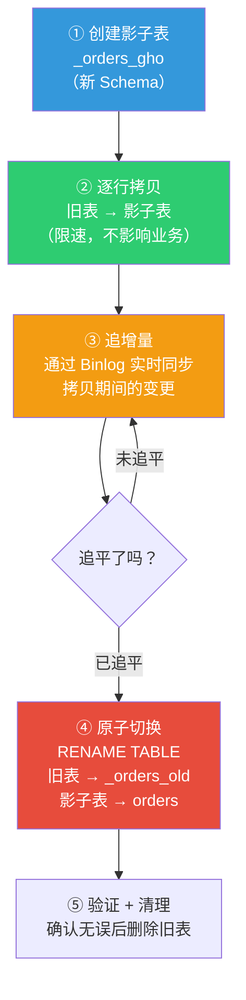
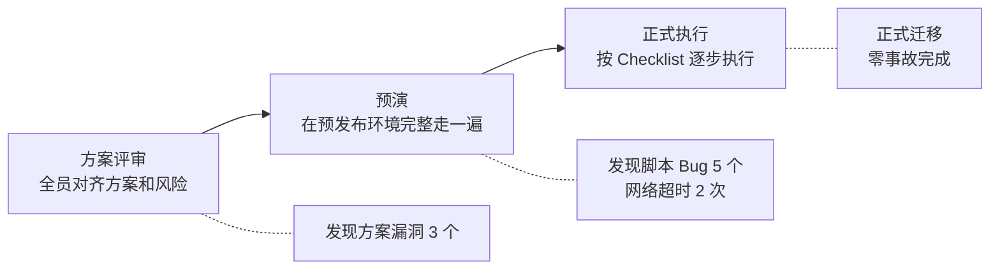
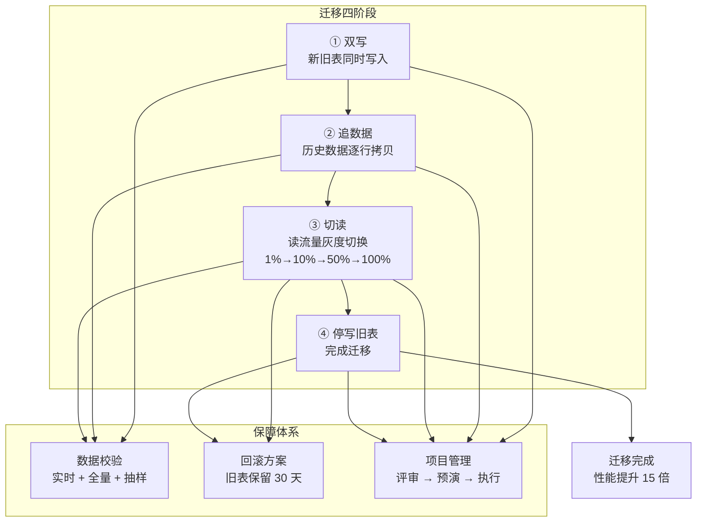

<!--
story:
  number: 22
  type: 正传
  position: 正传 14
  title: 仓库搬家不停业
  audience: 工程师 / SRE / 架构师
-->

# 24 · 仓库搬家不停业

> 从阿明的"在线换仓库"，看数据库迁移与 Schema 演进的实战方法论

> **系列定位**：本篇是「阿明餐厅」系列的**正传 14**。在[前传](./02-system-architecture-evolution.md)中，阿明的数据库从单机 MySQL 演进到读写分离再到分库分表。但"架构怎么演进"只讲了一半 —— 另一半是**数据怎么搬家？** 一个日活 10 万的系统，不可能停服 8 小时慢慢迁移。

---

## 引言：5 亿条数据，怎么搬？

阿明的订单表已经有 5 亿行数据，单表查询越来越慢。一条简单的 `SELECT * FROM orders WHERE user_id = 12345` 要跑 3 秒以上，高峰期甚至超过 10 秒。

老陈说："得分库分表。"

阿明问："那 5 亿条数据怎么搬？停服一晚上搬完？"

老陈苦笑："上次给会员表加个字段，`ALTER TABLE` 锁了 40 分钟，客服被打爆，差评 300 条。这次 5 亿条数据的分库分表，估计得搬 8 小时以上。"

阿明拍桌子："不能停服！上次 40 分钟就那样了，8 小时我还开不开门了？一边营业一边搬！"

老陈深吸一口气："在线迁移，那可比停服迁移复杂十倍。"

阿明说："复杂也得干。餐厅不能关门，仓库不能停业，数据库不能停服 —— 这是一回事。"

---

## 第一章：在线 Schema 变更 —— 影子表慢慢搬，原表不锁照样营业

老陈先给阿明讲了一个"血泪教训"。

半年前，会员表需要加一个 `vip_level` 字段。老陈觉得很简单，一句 `ALTER TABLE members ADD COLUMN vip_level TINYINT DEFAULT 0` 就完事了。

结果呢？

```text
ALTER TABLE 执行过程（大表）：

09:00:00  执行 ALTER TABLE members ADD COLUMN ...
09:00:01  MySQL 开始锁表（元数据锁）
09:00:02  所有写入操作被阻塞，会员注册、登录、修改资料全部排队
09:00:05  连接池被占满，其他服务的数据库连接也开始超时
09:00:10  监控告警：订单服务响应时间飙升，支付成功率下降
09:40:00  ALTER TABLE 终于完成（MySQL 重建了整张表）
09:40:01  锁释放，堆积的请求涌入，系统恢复

总计锁表时间：40 分钟
影响：约 12000 个请求超时，300+ 差评
```

阿明听完脸都绿了："加一个字段就锁 40 分钟？"

老陈解释：MySQL 的 `ALTER TABLE` 在早期版本（5.5 及之前）中的默认行为是**"拷贝整个表"**—— 创建一个带新字段的新表，逐行拷贝旧表数据，最后替换。5 亿行数据的表，拷贝一次可能要几个小时。此场景适用于 MySQL 5.5 或明确使用了 COPY 算法的情况；MySQL 5.6+ 的 Online DDL 已能处理部分场景（如加字段、加索引），但对于大表或复杂变更，仍需借助在线 DDL 工具。

解决方案是使用**在线 DDL 工具**。业界最成熟的两个工具：

| 工具 | 全称 | 原理 | 优点 | 缺点 |
|------|------|------|------|------|
| gh-ost | GitHub Online Schema Migrations | 影子表 + Binlog 追增量 + 原子切换 | 不依赖触发器，对主库性能影响小 | 需要 Binlog 开启 ROW 模式 |
| pt-osc | Percona Toolkit Online Schema Change | 影子表 + 触发器同步 + 逐行迁移 | 成熟稳定，支持复杂变更 | 触发器有性能开销 |

gh-ost 的工作原理：



老陈用 gh-ost 重新执行了那次加字段操作：

```bash
# 使用 gh-ost 在线加字段
gh-ost \
  --host=db-master.internal \
  --database=aming_restaurant \
  --table=members \
  --alter="ADD COLUMN vip_level TINYINT DEFAULT 0" \
  --allow-on-master \
  --max-load=Threads_running=25 \
  --critical-load=Threads_running=100 \
  --chunk-size=1000 \
  --throttle-control-replicas=db-slave1,db-slave2 \
  --execute
```

这次加字段，全程零锁表，零业务影响。阿明看着监控，一切平稳："这才对嘛，加个字段不该搞得像打仗一样。"

**在线 Schema 变更的核心是"用空间换时间、用增量换停机" —— 创建影子表慢慢搬，而不是锁住原表硬改。**

---

## 第二章：双写迁移方案 —— 新旧库并行，边营业边搬家

Schema 变更搞定了，但分库分表比加字段复杂得多 —— 不只是改结构，而是要把 5 亿条数据从"一张大表"搬到"多张小表"。

老陈提出了**双写迁移四阶段法**：


每个阶段的详细操作：

| 阶段 | 做什么 | 注意事项 | 餐厅类比 |
|------|---------|-----------|-----------|
| 双写 | 业务代码同时往旧表和新表写数据 | 新表写入失败不能影响业务（异步重试） | 新旧仓库同时进货 |
| 追数据 | 后台脚本逐行把旧表的历史数据搬到新表 | 限速控制，不能拖垮数据库 | 每天搬 100 箱库存到新仓库 |
| 切读 | 读流量从旧表逐步切到新表（灰度） | 先切 1% → 10% → 50% → 100% | 部分门店改从新仓库取货 |
| 停写 | 停止往旧表写数据，全部走新表 | 保留旧表 30 天作为回滚保障 | 旧仓库停用但保留一个月 |

数据一致性校验是关键。老陈写了一个校验脚本，在双写期间持续比对新旧两张表的数据：

```python
# 双写数据一致性校验（简化版）
import hashlib
import time

def verify_consistency(old_db, new_db, table, batch_size=1000):
    """逐批比对旧表和新表的数据一致性"""
    offset = 0
    mismatch_count = 0

    while True:
        # 从旧表取一批数据
        old_rows = old_db.query(
            f"SELECT * FROM {table} ORDER BY id LIMIT {batch_size} OFFSET {offset}"
        )
        if not old_rows:
            break

        # 从新表取对应的数据
        ids = [row['id'] for row in old_rows]
        new_rows = new_db.query(
            f"SELECT * FROM {table} WHERE id IN ({','.join(map(str, ids))})"
        )

        # 逐行比对
        for old_row in old_rows:
            new_row = find_by_id(new_rows, old_row['id'])
            if new_row is None:
                log(f"[缺失] id={old_row['id']} 在新表中不存在")
                mismatch_count += 1
            elif hash_row(old_row) != hash_row(new_row):
                log(f"[不一致] id={old_row['id']} 数据不匹配")
                mismatch_count += 1

        offset += batch_size
        time.sleep(0.1)  # 限速，避免拖垮数据库

    return mismatch_count
```

阿明听完这个方案，说了一句让老陈印象深刻的话："这不就是开餐厅搬家吗？新旧仓库同时进货，每天盘点两边库存是否一致，确认无误后全部切到新仓库。做生意和做技术，道理是一样的。"

**双写迁移的核心是"先并行、再切换、最后停旧" —— 任何时刻都有两条路可走，确保随时可以回滚。**

---

## 第三章：分库分表实战 —— 按高频查询下刀，异构索引补另一面

双写方案定了，下一个问题是：**怎么分？**

老陈列出了三种常见的分片策略：

| 分片键 | 原理 | 优点 | 缺点 | 餐厅类比 |
|--------|------|------|------|-----------|
| 用户 ID 哈希 | `shard = user_id % 16` | 数据分布均匀，单用户查询不跨片 | 按门店、按时间查询需要跨片 | 按顾客姓氏分桌 |
| 订单 ID 哈希 | `shard = order_id % 16` | 订单数据均匀分布 | 用户查自己的订单需要跨片 | 按订单号分桌 |
| 时间范围 | 2024 年 → 表 1，2025 年 → 表 2 | 历史数据可归档，热数据集中 | 当年数据量可能不均 | 按月份分账本 |

阿明想了想："我们 80% 的查询是'查某个用户的订单'，选用户 ID 分片。"

老陈说："对，但有个问题 —— 门店运营想查'某个门店的所有订单'，这时候怎么办？用户 ID 分片后，同一个门店的订单散落在 16 个分片里，查一次要跨 16 个库。"

这就是分库分表的经典矛盾：**选了一个维度的分片键，另一个维度的查询就变成了跨片查询。**

解决方案是**异构索引表（CQRS 思想）**：

```text
分库分表架构：

写入路径：
  订单创建 → 按 user_id 分片写入主表
           → 同时异步写入异构索引表

主表（按 user_id 分片，16 个分片）：
  shard_00: user_id % 16 == 0 的订单
  shard_01: user_id % 16 == 1 的订单
  ...
  shard_15: user_id % 16 == 15 的订单

异构索引表（按 store_id 分片，4 个分片）：
  store_idx_00: store_id % 4 == 0 的订单索引
  store_idx_01: store_id % 4 == 1 的订单索引
  store_idx_02: store_id % 4 == 2 的订单索引
  store_idx_03: store_id % 4 == 3 的订单索引
  （只存 order_id + store_id + 关键字段，不存全部字段）

查询路径：
  "查用户 12345 的订单" → 直接查主表 shard_09
  "查门店 A 的订单"     → 查异构索引表 store_idx_XX → 拿到 order_id → 回查主表
```

但异构索引表引入了新问题：**数据倾斜**。

阿明的 10 家店中，旗舰店的订单量是其他店的 20 倍。如果按门店 ID 分片，旗舰店所在的索引分片数据量远超其他分片，变成"热点分片"。

老陈的应对策略：

| 问题 | 策略 | 实现方式 |
|------|------|-----------|
| 数据倾斜 | 虚拟分片 | 旗舰店映射到多个物理分片，`store_id=A` → `shard_00 + shard_04 + shard_08` |
| 热点分片 | 读写分离 | 热点分片增加从库，读流量分散到从库 |
| 全局统计 | 汇总表 | 定时任务预计算全局统计数据，存入独立的汇总表 |

关于全局索引和局部索引的选择：

| 方案 | 说明 | 优点 | 缺点 |
|------|------|------|------|
| 局部索引 | 每个分片内部建索引 | 查询不跨片时性能极好 | 跨片查询需要聚合多个分片的结果 |
| 全局索引 | 独立的全局索引表 | 跨片查询性能好 | 写入时需要同时维护全局索引，一致性复杂 |
| 异构索引 | 按另一个维度建索引表 | 解决"换维度查询"的问题 | 数据冗余，需要异步同步 |

阿明最终选了"用户 ID 分片 + 门店异构索引 + 局部索引"的组合方案。不是最完美的，但是最适合当前业务的。

**分库分表的核心是"选对分片键" —— 按最高频的查询维度分片，用异构索引解决其他维度的查询。**

---

## 第四章：异构数据源迁移 —— 换数据库如换仓，先迁读验证再迁写

分库分表搞定了，阿明又接到一个新任务：有一个老系统，当年用 MongoDB 存的菜品评论数据，现在要迁移到 PostgreSQL —— 因为评论需要和订单做关联查询，MongoDB 的 JOIN 能力太弱了。

这不是"同一种数据库换结构"，而是**不同种类数据库之间的迁移**。

老陈列出了数据类型映射的"坑"：

| 数据类型 | MySQL | PostgreSQL | MongoDB | 迁移注意事项 |
|----------|-------|-------------|---------|---------------|
| 布尔值 | TINYINT(1) | BOOLEAN | Boolean | MySQL 的 TINYINT(1) 可能是 0/1/2，需要清理 |
| 时间 | DATETIME | TIMESTAMP | Date | 时区处理不同，MySQL 不带时区，PostgreSQL 带时区 |
| JSON | JSON（5.7+） | JSONB | Object | PostgreSQL 的 JSONB 支持索引，性能更好 |
| 自增 ID | AUTO_INCREMENT | SERIAL / IDENTITY | ObjectId | MongoDB 的 ObjectId 是 24 位字符串，不能直接转成整数 |
| 空值 | NULL | NULL | null / 字段不存在 | MongoDB 中"字段不存在"和"字段为 null"是两回事 |

应用层适配有两种方式：

```text
方式一：ORM 屏蔽差异（推荐）
  应用代码 → ORM（如 SQLAlchemy / MyBatis）→ 数据库驱动
  ORM 负责处理不同数据库的 SQL 方言差异
  切换数据库只需要改 ORM 配置，业务代码不用动

方式二：直接写 SQL
  应用代码 → 原生 SQL → 数据库驱动
  需要为每种数据库写不同的 SQL（MySQL 和 PostgreSQL 的语法有差异）
  切换数据库需要改大量代码
```

老陈选了 ORM 方式，但还是遇到了一个坑 —— 分页查询。MySQL 用 `LIMIT offset, size`，PostgreSQL 用 `LIMIT size OFFSET offset`。ORM 自动处理了这个差异，但有一条"优化过的手写 SQL"绕过了 ORM，直接用了 MySQL 语法，迁移后报错。

渐进式迁移的步骤：


阿明问："为什么不一步到位，直接切过去？"

老陈说："因为万一 PostgreSQL 那边有问题，我们还能把流量切回 MongoDB。渐进式迁移的每一步都可以回退 —— 这就是**控制爆炸半径**。"

这和[《高峰保卫战》](./04-peak-traffic-defense.md)中的灰度发布思想完全一致 —— 不是"全量切换然后祈祷"，而是"一小步一小步地走，每步都验证"。

**异构数据源迁移的核心是"先同步、再切读、验证后再切写" —— 渐进式迁移让每一步都可回退。**

---

## 第五章：数据校验与回滚 —— 三重校验三十天回滚，搬完还得验房

迁移做完了，但老陈说："还没完。搬家搬完了，得**验房** —— 确认所有东西都搬对了。"

数据校验有三种方式：

| 校验方式 | 原理 | 优点 | 缺点 | 适用场景 |
|----------|------|------|------|-----------|
| 全量校验 | 逐行比对新旧两表的每一条数据 | 最彻底，零遗漏 | 数据量大时耗时长（5 亿行可能要跑几个小时） | 迁移完成后首次验证 |
| 抽样校验 | 随机抽取一部分数据进行比对 | 速度快 | 可能漏掉不一致的数据 | 日常持续校验 |
| 实时校验 | 双写时同步比对新旧两边的写入结果 | 实时发现问题 | 对写入性能有影响 | 双写期间 |

老陈的校验策略是**"三重保险"**：

```text
数据校验三重保险：

第一重：实时校验（双写期间）
  每次双写完成后，异步比对这条数据在新旧两边的值
  如果不一致，立即告警 + 记录到"不一致清单"
  性能影响控制在 5% 以内（异步比对，不阻塞主流程）

第二重：全量校验（切读前）
  正式切换读流量之前，跑一次全量校验
  5 亿行数据，分批比对，预计 6-8 小时
  在业务低峰期（凌晨 2 点）执行
  发现不一致的数据，自动修复（以旧表为准）

第三重：抽样校验（切读后）
  切换读流量后的第一周，每天随机抽取 10 万条数据比对
  确认新表的读取结果和旧表一致
  如果连续 7 天零不一致，停止日常校验
```

校验不一致时的处理策略：

```python
# 数据不一致处理策略
class MismatchHandler:
    def handle(self, record_id, old_value, new_value):
        mismatch_type = self.classify(old_value, new_value)

        if mismatch_type == "MISSING_IN_NEW":
            # 新表缺失：补写
            self.insert_to_new_table(record_id, old_value)
            self.log("补写", record_id)

        elif mismatch_type == "VALUE_DIFF":
            # 值不一致：以旧表为准修复
            self.update_new_table(record_id, old_value)
            self.log("修复", record_id, old_value, new_value)

        elif mismatch_type == "EXTRA_IN_NEW":
            # 新表多余：标记但不删除（可能是追数据脚本的 bug）
            self.log("多余记录", record_id)
            self.flag_for_manual_review(record_id)
```

关于回滚方案，老陈有一条铁律：**旧表保留 30 天，确认无问题后再清理。**

```text
回滚方案：

迁移后第 1-7 天：
  - 旧表保持可读写状态
  - 如果新表出现问题，10 分钟内切回旧表
  - 每天跑一次全量校验

迁移后第 8-30 天：
  - 旧表改为只读
  - 仅用于紧急回滚和数据比对
  - 每周跑一次抽样校验

迁移后第 31 天：
  - 确认无问题后，旧表归档
  - 数据导出到冷存储（OSS / S3）
  - 删除旧表，释放磁盘空间
```

阿明的规则："迁移后的第一周，每天跑一次全量校验。不是不信任迁移脚本，是不信任'没有验证过'的任何东西。"

这个理念和[《厨房质检员》](./08-qa-testing-strategy.md)中的测试策略高度一致 —— 你不能假设代码是对的，你必须证明它是对的。数据迁移也一样。

**数据校验的核心是"三重保险 + 30 天回滚窗口" —— 迁移可以快，但验证必须慢、必须彻底。**

---

## 第六章：迁移的项目管理 —— 评审预演三板斧，不打无准备之仗

整个迁移方案讲完后，老陈说了一句让阿明意外的话："技术方案只占迁移工作的 30%，剩下的 70% 是项目管理。"

阿明问："项目管理？不就是写代码执行吗？"

老陈摇摇头："上次那个 40 分钟的锁表事故，不是技术问题 —— `ALTER TABLE` 谁都会写。问题是**没有评估影响面、没有选对时间窗口、没有准备回滚方案**。这些全是项目管理的事。"

迁移前的 Checklist：

```yaml
# 数据库迁移 Checklist
迁移项目: 订单表分库分表
负责人: 老陈
计划执行时间: 2024-06-15 凌晨 02:00

## 一、评估阶段
- [x] 数据量评估：当前 5 亿行，日均增长 120 万行
- [x] 停机窗口评估：不可停机，必须在线迁移
- [x] 影响面评估：订单服务、支付服务、对账服务依赖此表
- [x] 性能评估：当前 P99 响应时间 3.2 秒，目标 < 200ms

## 二、方案阶段
- [x] 迁移方案设计：双写四阶段法
- [x] 分片键选择：user_id % 16
- [x] 异构索引设计：门店维度索引表
- [x] 回滚方案设计：旧表保留 30 天

## 三、准备阶段
- [x] 迁移脚本编写 + Code Review
- [x] 数据校验脚本编写
- [x] 监控告警配置：迁移期间关键指标告警
- [x] 预演：在预发布环境完整演练一遍

## 四、执行阶段
- [ ] 通知相关团队：迁移时间 + 影响范围 + 应急联系人
- [ ] 开始双写
- [ ] 开始追历史数据
- [ ] 全量校验通过
- [ ] 灰度切读（1% → 10% → 50% → 100%）
- [ ] 停写旧表
- [ ] 确认新表稳定运行 24 小时
```

团队分工：

| 角色 | 职责 | 人员 | 关键产出 |
|------|------|------|-----------|
| 迁移负责人 | 整体协调、进度把控、风险决策 | 老陈 | 迁移方案文档、Checklist |
| 迁移开发 | 编写迁移脚本、双写逻辑、异构索引 | 工程师小刘 | 迁移脚本、Code Review 记录 |
| 数据校验 | 编写校验脚本、执行校验、处理不一致 | 工程师小孙 | 校验报告、不一致数据清单 |
| 切换操作 | 执行流量切换、监控切换过程 | 运维工程师小王 | 切换 Runbook、监控看板 |
| 业务验证 | 切换后验证业务功能正常 | 测试工程师小冯 | 验证报告 |

阿明的"迁移三板斧"：



老陈说："预演是最重要的一步。上次我们在预演中发现了 5 个 Bug —— 其中一个会导致数据丢失。如果在生产环境才发现这个 Bug，后果不堪设想。"

这和[《差评危机》](./15-incident-response.md)中的混沌工程思想一脉相承 —— 先在安全的环境里暴露问题，而不是在生产环境里"惊喜"。同时，迁移的灰度切换策略也和[《从接单到出餐》](./09-cicd-devops.md)中的灰度发布流程高度相似 —— 1% → 10% → 50% → 100% 的渐进式切换是通用的安全策略。

**迁移项目管理的核心是"方案评审 → 预演 → 正式执行"的三板斧 —— 预演发现的问题越多，正式执行越安全。**

---

## 核心总结：数据库迁移与 Schema 演进



| 章节 | 核心问题 | 解决方案 | 关键工具/方法 |
|------|-----------|-----------|---------------|
| 第一章 | ALTER TABLE 锁表 40 分钟 | 在线 DDL 工具 | gh-ost / pt-online-schema-change |
| 第二章 | 5 亿数据怎么搬 | 双写迁移四阶段法 | 双写 → 追数据 → 切读 → 停写 |
| 第三章 | 分片后跨维度查询 | 分片键选择 + 异构索引 | 用户 ID 分片 + 门店异构索引表 |
| 第四章 | 不同数据库之间迁移 | 渐进式迁移 | 先迁读 → 验证 → 再迁写 |
| 第五章 | 怎么确认数据搬对了 | 三重校验 + 回滚窗口 | 实时 + 全量 + 抽样校验 |
| 第六章 | 迁移不只是技术问题 | 迁移三板斧 | 方案评审 → 预演 → 正式执行 |

### 一句心法

**数据库迁移不是技术问题，而是风险管理问题。核心原则只有一条：任何时刻都能回滚。**

---

## 延伸阅读

- [架构是"长"出来的](./02-system-architecture-evolution.md) —— 本篇的前半部分，讲架构从单机到分库分表的演进，本文讲的是"数据怎么跟着搬"
- [当餐厅长出大脑](./01-ai-agent-architecture.md) —— AI Agent 系统的模型版本迁移和 Prompt 版本管理，也是一种"数据迁移"
- [给产品经理的重构说明书](./03-refactoring-guide-for-pm.md) —— 数据库迁移是技术重构的一种，绞杀者模式同样适用于数据库迁移
- [高峰保卫战](./04-peak-traffic-defense.md) —— 迁移期间的流量切换需要灰度发布能力，限流和熔断是迁移期间的安全网
- [厨房装监控](./05-observability.md) —— 迁移全程需要监控：双写成功率、校验不一致率、切换后的响应时间
- [食安大检查](./06-security-architecture.md) —— 数据迁移过程中的数据安全：敏感数据脱敏、传输加密、访问控制
- [从厨师到 CEO](./07-from-chef-to-ceo.md) —— 迁移项目的跨团队协作需要 API 契约和技术评审机制
- [厨房质检员](./08-qa-testing-strategy.md) —— 数据校验本质上就是"数据的自动化测试"，测试策略的思想完全一致
- [从接单到出餐](./09-cicd-devops.md) —— 迁移脚本的部署也是 CI/CD 的一部分，灰度发布策略和流量切换策略相通
- [菜单设计学](./10-api-design.md) —— 迁移后 API 要保持向后兼容，不能让前端感知到数据库换了
- [学徒的困境](./11-ai-learning-paradox.md) —— AI 时代的人机协作与学习之道，当 AI 越来越强，人还要不要练基本功
- [数据厨房](./12-data-kitchen.md) —— 数据仓库的 ETL 管道和数据迁移有很多共通的工程实践
- [前厅翻修记](./13-frontend-renovation.md) —— 前端工程化与用户体验，后厨再快，前厅的门进不来一切白搭
- [阿明的省钱经](./14-cloud-finops.md) —— 云成本优化与 FinOps，120 万月账单如何降到 68 万
- [差评危机](./15-incident-response.md) —— 迁移出问题时就是故障应急，止血、回滚、复盘的流程完全适用
- [外卖大战](./16-performance-optimization.md) —— 分库分表本身就是性能优化的一种手段，迁移后要做性能回归测试
- [传菜窗口的智慧](./19-realtime-eventdriven.md) —— 双写期间的增量同步可以借助消息队列，保证最终一致性
- [十家店的烦恼](./17-distributed-puzzles.md) —— 分库分表后就是分布式系统，分布式事务和一致性问题接踵而至
- [阿明的加盟帝国](./18-saas-multitenant.md) —— 多租户数据的迁移是分库分表的高阶场景
- [厨房实况直播](./19-realtime-eventdriven.md) —— 实时事件驱动架构中的事件存储迁移需要特殊的处理策略
- [一个厨房，四个门面](./20-multiplatform-architecture.md) —— 多平台架构与数据库迁移的协调策略
- [懂你的菜单](./21-search-recommendation.md) —— 推荐系统的数据迁移需要考虑模型和数据的同步更新
- [从厨师到 CEO](./07-from-chef-to-ceo.md) —— 迁移过程中的 ADR 和操作手册是知识管理的典型场景
- [预制菜还是现炒](./23-lowcode-platform.md) —— 低代码平台与数据库迁移的协调策略
- [阿明出海记](./24-globalization.md) —— 全球化涉及的数据迁移和合规挑战更加复杂
- [厨房大换岗](./25-ai-org-transformation.md) —— AI 转型中的数据架构升级，引入 AI 可能触发数据模型的重构
- [阿明的二次创业](./26-ai-native-startup.md) —— AI 原生创业的数据架构决策，从第一天就做对还是日后迁移
- [会自我进化的厨房](./27-self-evolving-company.md) —— Agent Loop 驱动的数据迁移，Agent 自主发现 Schema 问题并修复
- [AI 的"黑暗料理"](./28-ai-hallucination-safety.md) —— AI 幻觉检测依赖校验数据，数据迁移的正确性是 AI 校验的基础

## 跨章节衔接

- [12-data-kitchen.md](./12-data-kitchen.md) —— 正传 7，数据迁移前的数据架构梳理：从单库到分库分表的设计选择
- [18-distributed-puzzles.md](./17-distributed-puzzles.md) —— 正传 12，分布式环境下的数据迁移：双写校验、灰度切流、回滚预案
- [09-cicd-devops.md](./09-cicd-devops.md) —— 正传 5，数据迁移的 CI/CD 集成：Schema 变更的版本化管理与自动化校验

---

## 结语

阿明的数据库迁移故事，本质上回答了一个所有成长中的系统都会遇到的问题：**数据量越来越大，结构不得不改，但系统不能停 —— 怎么办？**

答案是六层防线：在线 DDL 工具避免锁表，双写四阶段法保证平滑迁移，分片键选择和异构索引解决查询问题，渐进式迁移让每一步可回退，三重数据校验确保数据正确，迁移三板斧把技术风险降到最小。

5 亿条数据的分库分表迁移，在凌晨 2 点开始，早上 8 点完成。阿明第二天上班，打开后台，订单查询从 3 秒变成了 120 毫秒。他问老陈："昨晚搬家顺利吗？"老陈笑了笑："顺利。预演时发现的那些 Bug，一个都没在生产环境出现。"

阿明感慨："上次加个字段锁了 40 分钟被骂惨了，这次搬 5 亿条数据，用户完全无感知。这就是'方法'的价值。"

下次当你面对数据库迁移时，不妨问自己：

- 你的 Schema 变更用在线 DDL 工具吗？还是直接 `ALTER TABLE` 赌运气？
- 你有双写方案吗？还是只能停服迁移？
- 你的分片键选对了吗？最高频的查询维度是不是分片维度？
- 你有数据校验脚本吗？还是迁完就"信了"？
- 你做过预演吗？还是直接在生产环境"试一把"？

> 数据库迁移就像餐厅搬仓库 —— 菜不能停卖，货不能搬错，搬完了还得比搬之前更好用。

← [返回系列导读](./index.md)
