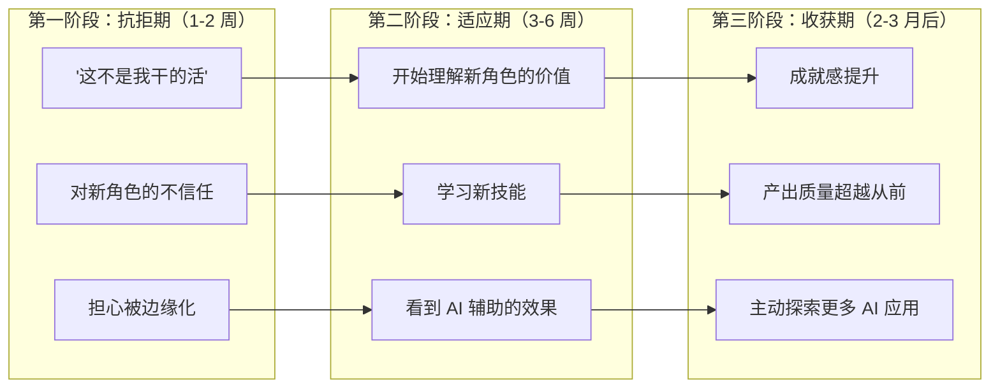
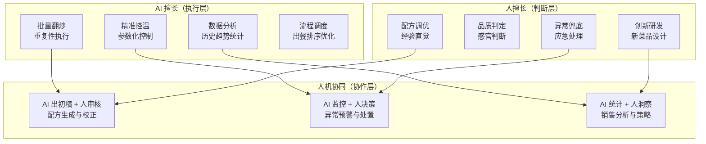
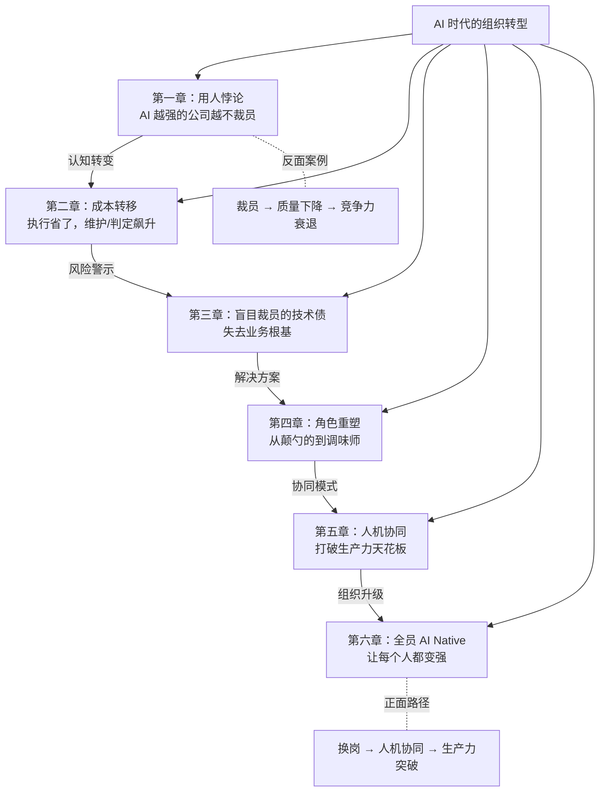

# 27 · 厨房大换岗

> 从阿明的"AI 炒菜机裁员风波"，看 AI 时代的组织转型与岗位重塑

> **系列定位**：本篇是「阿明餐厅」系列的**续集三**。在[《学徒的困境》](./11-ai-learning-paradox.md)中，阿明解决了"AI 时代怎么学"的问题；本篇要回答一个更尖锐的管理问题——"AI 时代怎么用人"。

---

## 引言：三台炒菜机和三个被裁的老师傅

2026 年春节刚过，阿明焦虑得睡不着觉。

同行圈子里，大家都在上 AI 炒菜机：自动翻炒、精准控温、智能调味。朋友圈里，今天张老板晒"效率提升 200%"，明天李老板晒"人力成本砍半"。阿明坐不住了，咬牙花了大价钱买了 3 台最新款的 AI 炒菜机。

机器到了，总得有人操作吧？阿明一盘算：3 台机器顶 3 个厨师的活，那就裁掉 3 个老厨师呗。王师傅、老李、张婶，三个人干了十几年，工资最高，"性价比最低"。阿明咬咬牙，一人给了笔补偿金，送走了。

第一个月，一切看起来很美好。出餐速度没降，人工成本少了三分之一，阿明甚至在月度总结会上得意地分享了"AI 转型经验"。

第二个月，问题来了。顾客开始投诉：宫保鸡丁没有以前那个味儿了，鱼香肉丝甜咸比例不对了，蛋炒饭有时候夹生有时候糊锅。AI 炒菜机明明每一步都按程序走的，怎么就不对了呢？

第三个月，投诉翻倍，老顾客流失了四成。阿明站在厨房里看着三台嗡嗡运转的炒菜机，百思不得其解：**AI 明明能干活，为什么裁了人反而更差了？**

答案其实很简单 —— 王师傅走了以后，没人告诉 AI "盐少许"到底是几克；老李走了以后，没人发现 AI 把花椒和麻椒搞混了；张婶走了以后，没人在出餐前尝一口把关。

**自动化的本质是换岗，而不是省人。裁掉懂业务的人，就是在拆 AI 的地基。**

---

## 第一章：用人悖论 —— AI 越强的公司，越不裁员

阿明去拜访了一个老朋友 —— 隔壁区的陈老板。陈老板的"陈记饭庄"比阿明更早引入 AI 炒菜机，而且上了 5 台，比阿明多 2 台。

奇怪的是，陈老板一个厨师都没裁。不仅没裁，还多招了两个"AI 训练师"。

"老陈，你疯了吧？上了 5 台机器还不裁人，那你上机器干嘛？"阿明不解。

陈老板笑了笑："你上机器是为了省人，我上机器是为了让人更强。我的五个厨师现在每人'管'一台机器，出餐量是原来的三倍，但菜品的灵魂还在。"

这就是 AI 时代的**用人悖论（Staffing Paradox）**：真正深度使用 AI 的公司，往往一个人都没裁；而急着裁员的公司，AI 用得反而最浅。

### 为什么深度用 AI 的公司不裁员？

阿明后来慢慢理解了。AI 的引入不是"删掉一个岗位"，而是"改变一个岗位的性质"。当 AI 接管了颠勺、控温这些重复性动作之后，厨师并没有变得多余 —— 他们被释放出来去做更重要的事：调配方、盯品质、处理异常、研发新菜。

| 对比维度 | 裁员派（阿明） | 不裁员派（陈老板） | 差异根因 |
|----------|---------------|-------------------|----------|
| AI 定位 | 替代人 | 武装人 | 对 AI 能力的认知不同 |
| 厨师角色 | 被裁掉 | 转型为 AI 指挥官 | 对"人"的定义不同 |
| 出餐质量 | 逐渐下滑 | 稳步提升 | 有无"业务守门人" |
| 异常处理 | 无人兜底 | 老师傅随时介入 | 容错能力差距 |
| 长期竞争力 | 持续衰退 | 持续增强 | 组织能力是否在积累 |

阿明又问了一个更尖锐的问题："那你不裁人，成本怎么控制？5 台机器加上原来的厨师，支出不是更多了吗？"

陈老板拿出一张报表，指着上面的数字说："你看，引入 AI 之前，我一天最多出 400 份餐。现在 5 个厨师每人管一台机器，一天能出 1200 份。人力成本没降，但营收翻了三倍。你说我为什么要裁人？"

阿明沉默了。他一直把 AI 当作"省钱工具"，但陈老板把它当成了"赚钱工具"。视角不同，决策就完全不同。

### 软件工程中的用人悖论

这个悖论在软件工程领域同样成立。那些真正全员重度使用 Copilot、Cursor 等 AI 编程工具的团队，往往不仅没有裁减工程师，反而在扩充团队 —— 因为 AI 释放了工程师的生产力，让他们能承接更多、更复杂的项目，业务规模扩大了，对人的需求反而增加了。

反过来，那些急着用 AI 裁员的团队，往往是 AI 用得最浅的 —— 他们把 AI 当成了"廉价替代品"而不是"生产力倍增器"，裁掉人之后才发现 AI 根本无法独立支撑业务。

| 公司类型 | AI 使用深度 | 裁员行为 | 6 个月后结果 | 12 个月后结果 |
|----------|-----------|----------|-------------|-------------|
| 浅层使用 + 裁员 | 低（AI 当工具用） | 大幅裁员 | 短期成本下降 | 质量崩塌、客户流失 |
| 浅层使用 + 不裁员 | 低 | 维持原样 | 无显著变化 | 竞争力缓慢下降 |
| 深度使用 + 不裁员 | 高（AI 融入工作流） | 不裁甚至扩招 | 产出翻倍 | 建立竞争壁垒 |

**用人悖论的核心是 AI 改变的不是"要不要人"，而是"人要做什么"。急着裁员，说明你还没真正理解 AI 的价值。**

---

## 第二章：成本转移的真相 —— 执行省了，维护/判定飙升

阿明回去复盘了三个月的运营数据，发现了一个让他心惊的事实：

炒菜机的执行效率确实高 —— 单道菜出餐时间从 8 分钟降到了 5 分钟。但"隐性成本"在飙升：AI 炒菜机的提示词（配方参数）调优每周要花 12 小时，出餐品质的抽检返工率从 3% 飙升到 18%，设备故障时的应急响应时间从 2 分钟变成了 30 分钟（因为没有老师傅能临时顶上）。

这就是自动化的真正代价：**执行层面的人力省下了，但"维护"和"判定"的成本飙升了。**

### 成本转移模型

阿明画了一张图，把引入 AI 前后的成本结构做了对比：

```text
引入 AI 前：
  执行成本（颠勺、切菜、控温）    ████████████████  70%
  维护成本（设备保养、流程优化）   ████              15%
  判定成本（品控、异常处理）       ███               15%

引入 AI 后：
  执行成本（AI 自动执行）          █████             20%
  维护成本（AI 调优、工作流维护）  ██████████        40%
  判定成本（结果校验、异常兜底）   ████████          40%
```

执行成本确实从 70% 降到了 20%，但维护和判定成本从 30% 飙升到了 80%。总成本并没有显著下降，只是**成本的形态变了**。

在软件工程中，这个转移更加隐蔽：

| 成本类型 | 传统模式 | AI 辅助模式 | 变化趋势 |
|----------|----------|------------|----------|
| 代码编写 | 工程师手写，耗时但可控 | AI 生成，速度快 | ↓ 显著下降 |
| Prompt 调优 | 不存在 | 反复调试提示词以获得最佳输出 | ↑ 新增成本 |
| 结果校验 | Code Review + 测试 | AI 输出需要更严格的校验 | ↑ 显著上升 |
| 工作流维护 | 相对稳定的开发流程 | AI 工具链频繁更新，需持续适配 | ↑ 新增成本 |
| 异常兜底 | 工程师自行排查 | AI 犯错时需要更资深的人兜底 | ↑ 风险成本 |

```python
# AI 时代的"成本转移"公式
# 表面看：省了执行的人力
# 实际上：维护和判定的成本在暗中飙升

def real_cost_of_ai(execution_saved, maintenance_added, judgment_added):
    """
    execution_saved: AI 省下的执行成本（如减少的编码时间）
    maintenance_added: 新增的维护成本（Prompt 调优、工具链维护）
    judgment_added: 新增的判定成本（结果校验、异常兜底）
    """
    net_saving = execution_saved - maintenance_added - judgment_added

    # 大多数裁员派老板只看了 execution_saved
    # 而忽略了 maintenance_added 和 judgment_added
    if net_saving < 0:
        return "裁员省的钱，还不够填维护和判定的坑"
    return f"净节省: {net_saving}"

# 阿明的实际情况：
# execution_saved = 3 个厨师的工资 = 4.5 万/月
# maintenance_added = AI 调优 + 设备维护 = 2.8 万/月
# judgment_added = 品质下降导致的客诉损失 = 3.2 万/月
# net_saving = 4.5 - 2.8 - 3.2 = -1.5 万/月
# 结论：裁了 3 个人，每月反而多亏 1.5 万
```

陈老板的做法则完全不同。他没有裁掉厨师，而是让他们转型：王师傅不再亲手颠勺了，而是每天花 4 小时调优 AI 的配方参数、2 小时抽检出餐品质、2 小时培训新人。王师傅的角色从"执行者"变成了"维护者 + 判定者"。

**成本转移的真相是 AI 不是帮你省钱，而是帮你重新分配预算。看不见隐性成本的人，最终会付出更大的代价。**

---

## 第三章：盲目裁员的技术债 —— 失去业务根基

阿明终于找到了菜品质量下降的根因。

王师傅在的时候，每次 AI 炒菜机出了新配方，王师傅都会亲自试菜。"盐多了半克"、"火候欠了十秒"、"这个酱油牌子不对，味道差了"——这些微妙的判断，全靠王师傅二十年的经验。王师傅走了以后，AI 的输出再也没人"较真"了。

更可怕的是，AI 炒菜机有一个隐藏问题：它的训练数据来自全国各地的菜谱，但阿明的餐厅是做本地菜的。AI 做出来的宫保鸡丁是"大众口味"，而阿明的老顾客要的是"阿明家的口味"。王师傅在的时候，每次都会手动微调参数来适配本地口味。王师傅一走，这个微调环节就断了。

三个月下来，AI 的菜品越来越"标准化"，也越来越没有"灵魂"。

最让阿明心痛的是一位老顾客的评价。这位顾客吃了阿明餐厅十年的菜，每次来都点同一道红烧肉。这次他吃了一口，皱了皱眉，叫来服务员说："这不是以前的味道了，换厨师了吧？"服务员只能尴尬地笑笑。顾客结账时说："下次我再看看吧。"

阿明站在收银台后面，听得一清二楚。他突然意识到：AI 炒菜机做出的红烧肉"没有错"—— 每一步都按配方来的。但"没有错"和"好吃"是两回事。"好吃"需要理解食客的偏好、需要微调、需要那份只有王师傅才有的手感。

### 业务根基的丧失

这在技术团队中对应的概念是**技术债（Technical Debt）**，而且是 AI 时代特有的一种技术债 —— **业务根基债（Business Foundation Debt）**。

当企业裁掉一线业务人员后，AI 的微调和业务结合就失去了根基：

| 债务类型 | 餐厅表现 | 技术表现 | 后果严重度 |
|----------|----------|----------|-----------|
| 经验断层 | 没人知道"盐少许"是多少 | 没人知道参数的业务含义 | 极高 |
| 反馈断裂 | AI 配方无人校正 | AI 输出无人校验 | 高 |
| 标准漂移 | "阿明家的味道"消失 | 代码风格与业务规则漂移 | 高 |
| 兜底缺失 | AI 出错无人补救 | 线上故障无人能修 | 极高 |
| 创新停滞 | 没人研发新菜 | 没人探索新方案 | 中 |

这种债务的可怕之处在于它的**滞后性**：裁员的头一两个月，一切看起来都很好（因为 AI 还在用之前的"惯性"运行）。但随着时间的推移，AI 的输出和业务需求之间的偏差越来越大，等到问题暴露时，被裁掉的人已经找不到了，积累的经验也追不回来了。

阿明想起了[《学徒的困境》](./11-ai-learning-paradox.md)中讨论的"审查困境" —— AI 写的代码需要人来审查，而审查能力来自深厚的业务经验。裁掉有经验的人，就像拆掉了审查体系的基石。这和[《给产品经理的重构说明书》](./03-refactoring-guide-for-pm.md)中讲的技术债管理也是一脉相承的 —— 技术债不可怕，可怕的是在不知不觉中欠债。

**盲目裁员的技术债是裁掉的不只是"成本"，更是 AI 赖以运转的"业务地基"。地基一塌，楼再高也得倒。**

---

## 第四章：角色重塑 —— 从颠勺的到调味师 + 质检员

痛定思痛，阿明决定把王师傅他们请回来。

但问题来了：回来以后干什么呢？继续颠勺？那 AI 炒菜机不白买了吗？

阿明想了一夜，终于想通了：**岗位不是消失了，而是变形了。** 王师傅不需要再当"颠勺的人"，但他可以当"调味的人"、"质检的人"、"兜底的人"。

阿明给王师傅设计了一个新角色：**AI 调味师（AI Flavor Engineer）**。职责包括：

1. **配方调优**：根据本地口味和季节变化，调整 AI 炒菜机的参数
2. **品质把关**：每天抽检 AI 出餐的品质，发现偏差立即校正
3. **异常兜底**：AI 出错或设备故障时，亲自上手保证出餐
4. **风味守护**：确保"阿明家的味道"不会因为 AI 的标准化而走样

### 角色映射表

阿明把这个思路推广到了整个餐厅团队：

| 原角色 | 新角色 | 餐厅职责变化 | 技术岗位对应 |
|--------|--------|-------------|-------------|
| 炒菜厨师 | AI 调味师 | 从颠勺 → 调参数、试菜、校准 | 工程师 → AI Prompt Engineer / AI 应用工程师 |
| 切配厨师 | AI 数据管理员 | 从切菜 → 管理食材数据库、优化备料算法 | 开发者 → 数据工程师 / 特征工程师 |
| 传菜员 | AI 工作流运维 | 从端盘子 → 监控出餐流程、处理 AI 调度异常 | 运维 → AI 工作流 SRE（站点可靠性工程，Site Reliability Engineering） |
| 前厅经理 | AI 体验设计师 | 从排班 → 设计 AI 辅助的客户体验流程 | 产品经理 → AI 产品经理 |
| 采购员 | AI 供应链分析师 | 从跑市场 → 分析 AI 采购建议、把控供应商质量 | 运营 → AI 运营分析师 |

这个映射在软件工程中的对应是**角色重塑（Role Reshaping）**：

```text
AI 时代的工程师角色转型：

纯执行者（Code Monkey）
    ↓ AI 接管重复性编码
    ↓
AI 指挥官（AI Commander）—— 告诉 AI 做什么、怎么做
  + 审核员（Reviewer）—— 校验 AI 的输出是否正确
  + 维护者（Maintainer）—— 维护 AI 工作流的稳定运行
  + 品味守护者（Taste Keeper）—— 确保代码质量和架构合理性
```

阿明给王师傅开了比之前更高的工资。王师傅一开始不乐意："我是来炒菜的，不是来'调机器'的。"但两周后，王师傅发现自己比以前更有成就感了 —— 他不再重复颠勺几百次，而是专注于"怎么让菜更好吃"这个他最擅长也最喜欢的事情上。

### 角色转型的阵痛与收获

当然，转型不是一帆风顺的。阿明总结了转型过程中的三个阶段：



老李是转型最慢的。他一开始拒绝学任何跟"电脑"有关的东西，觉得"我这辈子就是切菜的"。但当他发现 AI 能帮他分析每种食材的最佳切法、最优备料量之后，态度开始转变。两个月后，老李居然主动找阿明说："老板，我觉得那个 AI 的采购建议挺靠谱的，但有几个供应商它不靠谱，我帮你筛筛。"

这就是角色重塑的力量 —— **不是强迫人改变，而是让人看到改变的价值。**

**角色重塑的核心是 AI 不是消灭了岗位，而是重新定义了岗位。从"用体力干活"变成"用脑力指挥 AI 干活"。**

---

## 第五章：人机协同的正确姿势 —— 打破生产力天花板

王师傅回来后的第二个月，阿明看到了一个意想不到的结果：出餐量不仅恢复到了裁员前的水平，还翻了一倍。

秘密在于**人机协同（Human-AI Collaboration）** 释放了生产力天花板。

以前，王师傅一天最多炒 80 道菜 —— 不是他不想多炒，而是体力有限，颠勺颠到下午手臂都抬不起来。现在，AI 炒菜机负责颠勺，王师傅负责"动脑"：同时监管 3 台机器的配方、抽检品质、处理异常。王师傅的"有效产出"从 80 道菜变成了 240 道菜。

这就是 AI 的真正价值：**不是用更低的成本替代人，而是通过人机协同，打破原有的生产力天花板。**

### 人机协同的分工模型

阿明总结出了一套清晰的分工逻辑：



这个模型在软件工程中的对应是**武装员工模型（Armed Employee Model）**，与之对立的是**替代员工模型（Replaced Employee Model）**：

| 维度 | 替代员工模型 | 武装员工模型 |
|------|-------------|-------------|
| AI 定位 | 代替人干活 | 帮人干得更好 |
| 人的角色 | 被淘汰 | 被增强 |
| 产出上限 | AI 的能力上限 | 人 + AI 的协同上限 |
| 错误处理 | AI 出错无人管 | 人随时介入兜底 |
| 创新能力 | 无（AI 只能做已有模式） | 有（人驱动创新，AI 加速验证） |
| 长期效果 | 生产力天花板降低 | 生产力天花板打破 |

```python
# 武装员工模型 vs 替代员工模型的生产力对比

def productivity_model(employee_skill, ai_capability, collaboration_factor):
    """
    employee_skill: 员工的业务能力 (0-10)
    ai_capability: AI 的执行能力 (0-10)
    collaboration_factor: 人机协同的放大系数 (1.0-3.0)
    """
    # 替代模型：AI 独自干活，上限就是 AI 自身能力
    replaced_output = ai_capability  # AI 能力上限 ≈ 6-7，且有盲区

    # 武装模型：人 + AI 协同，能力被放大
    armed_output = (employee_skill + ai_capability) * collaboration_factor
    # 当 employee_skill=8, ai_capability=7, collaboration_factor=1.5
    # armed_output = (8+7) * 1.5 = 22.5，远超替代模型的 7

    return {
        "替代模型产出": replaced_output,
        "武装模型产出": armed_output,
        "差距倍数": armed_output / replaced_output
    }

# 这就是为什么陈老板不裁员 ——
# 武装模型的产出是替代模型的 3 倍以上
```

阿明现在理解了陈老板当初那句话的含义："你上机器是为了省人，我上机器是为了让人更强。"两者的产出差距，不是加减法，而是乘法。

**人机协同的正确姿势是 AI 负责"手"，人负责"脑"和"心"。不是"AI 替代人"，而是"AI 放大人"。**

---

## 第六章：全员 AI Native 进化路线图 —— 让每个人都变强

阿明把这次教训变成了一次全面的组织升级。

他不仅让王师傅转型成了 AI 调味师，还推动整个餐厅团队进行**全员 AI Native 进化**。不是让某几个人学会用 AI，而是让每个人都在自己的岗位上"AI 增强"。

阿明设计了一套四级进化路径：

### 四级 AI 能力进化路径

| 级别 | 能力名称 | 餐厅培训 | 技术对应 | 考核标准 |
|------|----------|----------|----------|----------|
| L1 | AI 素养（AI Literacy） | 会用 AI 炒菜机的基本操作 | AI Literacy：会用 Copilot 等基础工具 | 能独立完成 AI 辅助任务 |
| L2 | 工具精通（Tool Mastery） | 能调优 AI 配方参数 | Tool Mastery：精通 AI 工具的高级功能 | 能显著提升个人产出 |
| L3 | 工作流设计（Workflow Design） | 能设计 AI 辅助的新流程 | Workflow Design：能设计 AI 增强的工作流 | 能优化团队协作效率 |
| L4 | AI 战略（AI Strategy） | 能规划餐厅的 AI 应用蓝图 | AI Strategy：能制定团队/公司的 AI 战略 | 能驱动业务创新 |

具体到餐厅的每个角色：

- **王师傅（AI 调味师）**：L1 → 会操作 AI 炒菜机；L2 → 能根据季节和客群调优配方参数；L3 → 设计了"AI 辅助新菜研发流程"；L4 → 规划了"本地口味 AI 模型"的训练方案
- **服务员小美（AI 体验设计师）**：L1 → 会用 AI 点餐系统；L2 → 能配置 AI 推荐策略；L3 → 设计了"AI 辅助客户关怀流程"；L4 → 提出了"基于 AI 的会员精准营销方案"
- **阿明自己（AI 战略家）**：从"买机器裁人"的思维，进化到"用 AI 武装团队、重塑组织"的思维

### 衡量指标的转变

最关键的是，阿明改变了衡量 AI 转型成功的指标：

```text
旧指标（裁员派思维）：
  ✅ 裁了多少人
  ✅ 省了多少人力成本
  ✅ AI 替代了多少岗位

新指标（AI Native 思维）：
  ✅ 产出质量（菜品评分、代码质量、客户满意度）
  ✅ 产出吞吐量（出餐量、功能交付量）
  ✅ 创新率（新菜品数、新技术方案数）
  ✅ 人机协同效率（人均 AI 辅助产出）
  ✅ 团队 AI 能力覆盖率（达到 L2+ 的人员比例）
```

半年后，效果显著：

- 王师傅设计的"AI 辅助新菜研发流程"让新菜品上市周期从 2 周缩短到 3 天。以前研发一道新菜要反复试做十几次，现在 AI 先根据历史数据生成 10 个候选配方，王师傅只需要试做 3 个最有潜力的，效率提升 5 倍
- 服务员小美用 AI 分析客户偏好，推出的"智能推荐套餐"让客单价提升了 25%。以前小美只能靠经验猜顾客想吃什么，现在 AI 帮她分析点餐数据，她只需要做最终的推荐决策
- 传菜员老孙转型为 AI 工作流运维后，出餐流程的异常响应时间从 15 分钟缩短到 2 分钟 —— 因为他随时盯着 AI 调度系统的监控面板
- 整个餐厅的人均产出提升了 180%，但没有裁掉一个人

阿明把这次转型的数据整理成了一张表，给同行们分享：

| 指标 | 转型前 | 转型后 | 变化 |
|------|--------|--------|------|
| 日出餐量 | 400 份 | 1100 份 | +175% |
| 人均产出 | 40 份/人 | 110 份/人 | +175% |
| 菜品评分 | 4.2 分 | 4.6 分 | +0.4 |
| 新菜上市周期 | 14 天 | 3 天 | -79% |
| 客诉率 | 5% | 2% | -60% |
| 员工满意度 | 中等 | 高 | 显著提升 |
| 团队人数 | 10 人 | 10 人 | 不变 |

阿明的感悟：**AI 转型不是让团队变小，而是让团队变强。** 每个人都在 AI 的加持下做了以前做不到的事。这和[《从厨师到 CEO》](./07-from-chef-to-ceo.md)中讨论的"主人翁思维"一脉相承 —— AI 时代的员工不是被动的"AI 操作员"，而是主动的"AI 驾驭者"。

**全员 AI Native 的核心是不让任何一个人掉队，让每个人都借助 AI 变得更强。组织的 AI 能力不取决于最强的人，而取决于最弱的一环。**

---

## 核心总结：AI 时代的组织转型



| 模块 | 核心问题 | 餐厅类比 | 技术实现 |
|------|----------|----------|----------|
| 用人悖论 | 为什么深度用 AI 的公司不裁员 | 陈老板上了 5 台机器还不裁人 | AI 改变岗位性质而非消灭岗位 |
| 成本转移 | 自动化省的不是总成本，而是转移了成本 | 颠勺省了，但调优和品控更贵了 | 执行成本↓，维护/判定成本↑ |
| 盲目裁员的技术债 | 裁掉懂业务的人就是拆 AI 的地基 | 王师傅走后"盐少许"没人懂了 | 业务根基债：经验断层、反馈断裂 |
| 角色重塑 | 岗位不是消失了，而是变形了 | 炒菜厨师 → AI 调味师 | 执行者 → 指挥官/审核员/维护者 |
| 人机协同 | AI 的真正价值是打破生产力天花板 | 王师傅管 3 台机器，产出翻 3 倍 | 武装员工模型 vs 替代员工模型 |
| 全员 AI Native | 让每个人都借助 AI 变强 | 厨师、服务员、经理全员 AI 升级 | 四级能力进化：素养→精通→设计→战略 |

### 一句心法

**AI 不是替你把人变少，而是让你的人变强 —— 裁掉懂业务的人，就是在拆 AI 的地基。**

---

## 延伸阅读

- [架构是"长"出来的](./02-system-architecture-evolution.md) —— AI 时代的组织转型需要坚实的架构基础，否则 AI 转型变成"在沙子上建高楼"
- [当餐厅长出大脑](./01-ai-agent-architecture.md) —— AI Agent 架构是组织 AI 转型的技术底座，理解 AI 能力边界是"换岗"的前提
- [高峰保卫战](./04-peak-traffic-defense.md) —— 流量治理中的限流降级策略，和 AI 时代的"异常兜底"思路一致：永远要有 Plan B
- [厨房装监控](./05-observability.md) —— 可观测性是 AI 工作流监控的基础，人机协同的前提是"看得见"AI 在做什么
- [食安大检查](./06-security-architecture.md) —— AI 生成的代码更需要安全审查，安全架构的"纵深防御"和组织转型的"多层把关"异曲同工
- [给产品经理的重构说明书](./03-refactoring-guide-for-pm.md) —— AI 转型时期的组织重构，和系统重构一样需要渐进式推进
- [从厨师到 CEO](./07-from-chef-to-ceo.md) —— 团队管理的前篇，康威定律和工程师文化是 AI 组织转型的管理基础
- [厨房质检员](./08-qa-testing-strategy.md) —— AI 时代的代码审查更加重要，角色重塑中"审核员"职责的方法论参考
- [从接单到出餐](./09-cicd-devops.md) —— CI/CD 流水线是 AI 工作流自动化的工程实践，角色重塑中"维护者"的主战场
- [菜单设计学](./10-api-design.md) —— API 设计的品味与判断力，正是角色重塑中"品味守护者"的核心能力
- [学徒的困境](./11-ai-learning-paradox.md) —— 前篇续集二，AI 时代怎么学；本篇回答 AI 时代怎么用人，两者互为表里
- [数据厨房](./12-data-kitchen.md) —— AI 转型的数据基础，没有高质量数据，AI 工作流就是"无米之炊"
- [前厅翻修记](./13-frontend-renovation.md) —— AI 不只是后端的事，前端工程师同样面临角色重塑和 AI 工具链的学习
- [阿明的省钱经](./14-cloud-finops.md) —— AI 转型的投入产出分析，FinOps 思维帮你算清"裁员省钱"还是"换岗增值"
- [差评危机](./15-incident-response.md) —— 应急响应能力是"异常兜底"的关键，裁掉老手后的最大风险就是无人能应急
- [外卖大战](./16-performance-optimization.md) —— 人机协同的性能优化视角，AI 帮你跑得快，但调优策略需要人的经验
- [传菜窗口的智慧](./20-realtime-eventdriven.md) —— 异步协作模式是 AI 工作流编排的技术基础，理解事件驱动才能设计好人机分工
- [十家店的烦恼](./18-distributed-puzzles.md) —— 分布式系统的复杂性需要资深工程师的判断力，这是 AI 最难替代的"判定成本"
- [阿明的加盟帝国](./19-saas-multitenant.md) —— SaaS 多租户的标准化与个性化平衡，正是 AI 标准化输出与人工微调的协同课题
- [厨房实况直播](./20-realtime-eventdriven.md) —— 实时监控是 AI 工作流可观测性的基础，让人随时介入 AI 的决策过程
- [一个厨房，四个门面](./21-multiplatform-architecture.md) —— 跨端开发的 AI 工具链整合，全员 AI Native 在多平台场景下的落地挑战
- [懂你的菜单](./22-search-recommendation.md) —— 推荐算法是 AI 与人协同的典型案例，AI 出推荐、人做最终决策
- [菜谱标准化之路](./07-from-chef-to-ceo.md) —— 知识管理是 AI 转型的地基，王师傅的经验必须沉淀成 AI 可理解的格式
- [仓库搬家不停业](./24-database-migration.md) —— 高风险操作需要资深工程师兜底，这是 AI 时代"不能裁人"的最佳佐证
- [预制菜还是现炒](./25-lowcode-platform.md) —— 低代码平台是 AI 时代的另一种"工具增强"，同样面临"标准化 vs 灵活性"的角色重塑
- [阿明出海记](./26-globalization.md) —— 全球化场景下的 AI 转型更复杂，本地化适配需要更多"懂业务的人"而非更少
- [阿明的二次创业](./28-ai-native-startup.md) —— 后篇，从组织转型到 AI 原生创业，把"换岗"思维应用到从零开始的新项目
- [会自我进化的厨房](./29-self-evolving-company.md) —— AI 自进化是终极形态，但"进化方向"的判定仍然需要人的品味和业务经验
- [AI 的"黑暗料理"](./30-ai-hallucination-safety.md) —— AI 幻觉的风险治理，是"判定成本飙升"的最佳注脚，越用 AI 越需要人来把关

---


### 跨章节衔接

- 11.ai/01-fundamentals/README.md —— LLM/AI Agent 能力边界 —— 理解 AI 能做什么、不能做什么，是"换岗不换人"的前提
- 11.ai/04-architecture/README.md —— 智能系统分层架构 —— 组织转型的技术架构蓝本

## 跨章节衔接

- [01-ai-agent-architecture.md](./01-ai-agent-architecture.md) —— 续集一，组织转型中的 Agent 架构：技术架构变革是组织变革的载体
- [07-from-chef-to-ceo.md](./07-from-chef-to-ceo.md) —— 终章，CEO 视角下的组织转型：自上而下 vs 自下而上的变革路径
- [29-self-evolving-company.md](./29-self-evolving-company.md) —— 续集五，组织转型的终极形态：自进化组织
- [11-ai-learning-paradox.md](./11-ai-learning-paradox.md) —— 续集二，组织转型中的员工学习困境：换岗后再学习的挑战

---

## 结语

阿明的"AI 炒菜机裁员风波"，最终以一种他意想不到的方式收场。

王师傅、老李、张婶都被请了回来，分别担任 AI 调味师、AI 数据管理员和 AI 工作流运维。工资比以前高了一点，但产出翻了三倍。菜品质量不仅恢复了，还因为王师傅的"AI 辅助新菜研发流程"推出了好几款爆款新菜，老顾客不仅回来了，还带来了新朋友。

阿明站在厨房里，看着王师傅一边盯着三台 AI 炒菜机的出餐屏幕，一边拿个小本子记录需要微调的参数，突然笑了。三个月前他还觉得"AI 来了就不需要人了"，现在他明白了：**AI 来了，人不是变少了，而是变重要了 —— 因为只有懂业务的人，才能让 AI 真正发挥作用。**

这个教训适用于每一个正在或即将进行 AI 转型的团队：不要问"AI 能替掉几个人"，要问"AI 能让我的人强到什么程度"。

下次当你面对 AI 转型的决策时，不妨问自己：

- 你裁掉的人里，有没有掌握 AI 赖以运转的"业务地基"的人？
- 你的 AI 工作流出问题时，谁来做结果校验和异常兜底？
- 你衡量 AI 转型成功的指标，是"省了多少人"还是"人均产出提升了多少"？
- 你有没有为团队设计角色重塑的路径，还是简单地"用 AI 换人"？
- 三年后回头看，你的团队是变强了还是变弱了？

> 好的 AI 转型，不是"用机器替代人"，而是"让人学会驾驭机器"。

← [返回系列导读](./index.md)
