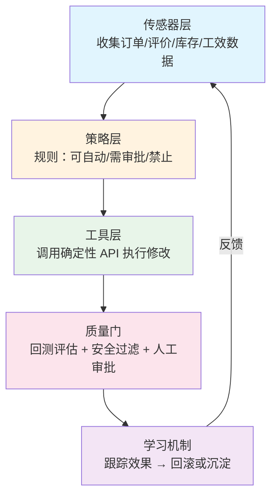
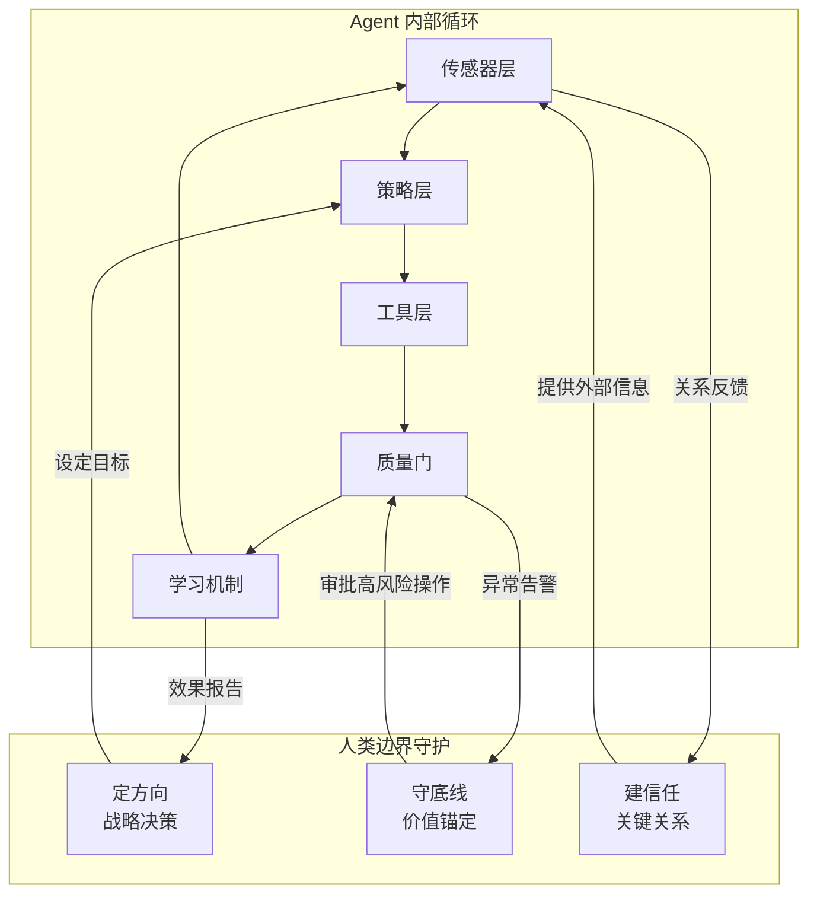
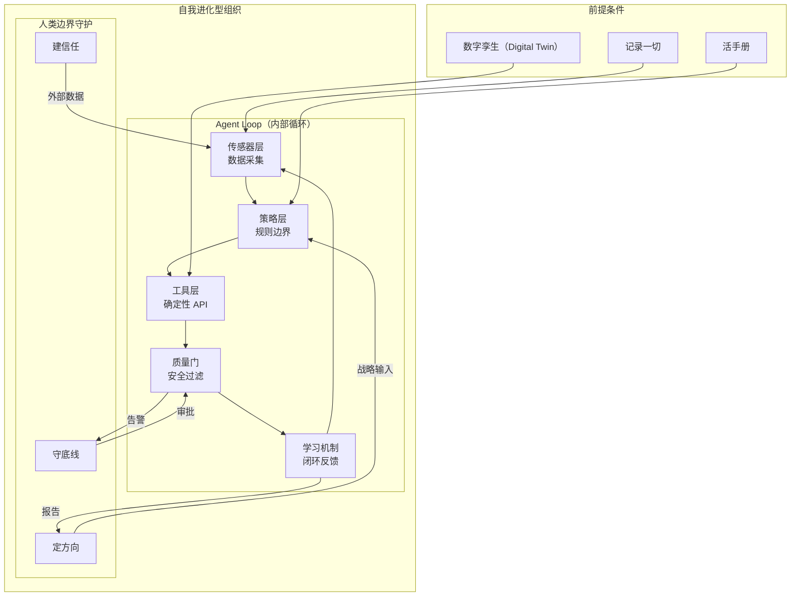

<!--
story:
  number: 27
  type: 续集
  position: 续集五
  title: 会自我进化的厨房
  audience: AI 工程师 / 架构师
-->

# 29 · 会自我进化的厨房

> 从阿明的"睡一觉厨房就变好了"，看自我进化型组织的 Agent Loop 设计

> **系列定位**：本篇是「阿明餐厅」系列的**续集五**。在[《阿明的二次创业》](./26-ai-native-startup.md)中，阿明学会了用 AI 从 0 到 1 创业；本篇要回答"创业之后"的问题——如何让组织像 Agent 一样自我进化。

---

## 引言：睡一觉，厨房就变好了

2026 年 5 月某天起，阿明养成了一个习惯：每天早上七点推开厨房门，先看一块屏幕。

屏幕上是一份"夜间报告"——昨晚自动分析了白天所有出错环节：外卖超时 3 单的根因是"铁板牛肉"的备料流程多了一个不必要的等待步骤；两起客户投诉"汤太咸"的源头是同一批次的高汤底料配比偏差；上周反复出现的"忘加葱花"问题，已经被自动加入了出餐检查清单。

更神奇的是，报告里不只是诊断结果，还有已经落地的修复方案：备料流程的步骤已更新，高汤配比已校正，出餐检查清单已同步到每个工位。阿明需要做的，只是花五分钟扫一眼，确认没问题，点一下"批准"。

**公司不是层级金字塔，而是递归进化的 Agent Loop —— 烧 Token，不烧人头。**

这套系统，阿明叫它"夜班管家"。它不是一个人，而是一个监控 Agent（Monitoring Agent），每天深夜自动运行，分析白天所有运营数据，找出问题模式，生成修复方案，并在沙箱中验证后部署上线。阿明终于体会到了 YC 合伙人 Tom Blomfield 说的那个"震撼时刻"——**公司可以在创始人睡觉时变得更好**。

---

## 第一章：从"罗马军团"到 Agent Loop —— 打破层级思维

阿明的餐厅刚起步时，只有他和两个帮厨。所有决策都经过他：菜单他来定，采购他来批，出品质检他来做，客诉他来赔笑脸。生意好的时候，他一天接 200 个电话。

后来开了三家分店，阿明学了"大公司管理模式"：设了区域经理、店长、副店长、组长。信息从一线传到阿明，要经过四层。一个"汤太咸"的客诉，服务员报给组长，组长报给店长，店长报给区域经理，区域经理在周会上汇报给阿明。等阿明做出"调整盐量"的决策传回去，已经是三天后了。

这就是 Tom Blomfield 说的**"罗马军团"模式（Roman Legion Model）**——信息靠人类节点层层传递，每一层都是一次衰减和延迟。

### "给旧流程加 AI"是个陷阱

一年前，阿明给每个层级都配了 AI 助手：服务员有智能点餐，组长有排班 AI，店长有数据分析 AI，区域经理有 BI 看板。效率确实提升了，每个人快了 20%。

但阿明发现了一个问题：**整个组织的运转模式一点没变**。信息还是在四层之间流转，决策还是要等他拍板，出错还是要等周会发现。AI 只是让每一层"跑得更快"，但没有减少层级本身。

这就像给罗马军团的每个士兵配了一匹快马——行军速度是快了，但指挥链还是那么长，信息还是那么慢。

### 真正的 AI 原生：重构为 Agent Loop

Tom Blomfield 的核心观点是：**Copilot 思维（副驾驶模式）是个错误模型**。仅仅给旧有工作模式加装一个更强大的 AI 引擎是不够的，真正的 AI 原生（AI-native）公司需要彻底重构组织的运作方式。

阿明想明白了：问题不是"怎么让每个层级用 AI 更高效"，而是"这些层级本身还有没有存在的必要"。如果一个 Agent 能直接监控一线数据、分析问题、生成修复方案——那中间的信息传递层就是在制造延迟，而不是创造价值。

| 维度 | 罗马军团模式 | Agent Loop 模式 |
|------|-------------|-----------------|
| 信息流向 | 层层上报，逐级衰减 | Agent 直采一线数据，零延迟 |
| 决策速度 | 天级（周会汇报 → 审批 → 下发） | 小时级（夜间分析 → 自动生成方案 → 审批） |
| 错误发现 | 客诉驱动，被动响应 | 数据驱动，主动巡检 |
| 修复方式 | 人工传达 + 培训 + 跟踪 | Agent 自动修改流程 + 沙箱验证 + 一键部署 |
| 扩展成本 | 线性增长（每开一家店多一套管理层） | 近零边际成本（同一套 Agent 覆盖所有门店） |
| 知识沉淀 | 散落在人的脑子里 | 自动写入组织知识库，持续更新 |

**打破层级思维的关键不是"砍人"，而是"砍掉不必要的信息传递环节"。Agent 的价值不是替代管理者，而是消除管理层存在的原因——信息不对称。**

---

## 第二章：五层循环 —— 传感器→策略→工具→质量门→学习

阿明决定把"夜班管家"从一个简单的监控脚本，升级为一套完整的自我进化系统。但他很快发现，一个能自我进化的 Agent 不是"一个聪明的模型"就够的，它需要一整套循环架构。

Tom Blomfield 在 YC 的分享中给出了一个清晰的五层模型。阿明把它贴在了厨房办公室的墙上，每天早上看一眼。

### 第一层：传感器层（Sensor Layer）—— 收集一切

传感器层的任务是**让系统"看见"现实**。在阿明的厨房里，这意味着：

- 每一笔订单的完整生命周期（接单 → 备料 → 烹饪 → 出餐 → 送达 → 评价）
- 每一个环节的耗时、异常和偏差
- 顾客评价的全文（不只是星级，还有文字和情绪）
- 食材库存的实时状态和保质期
- 员工的出勤、工效和操作合规度

没有被记录的事情，对 Agent 来说就等于没有发生。

### 第二层：策略层（Policy Layer）—— 设定规则

策略层回答一个问题：**Agent 可以做什么？不能做什么？什么时候需要人来拍板？**

阿明的规则设计：

- Agent 可以自动修改：出餐检查清单、备料顺序、排班微调
- Agent 需要审批才能修改：菜谱配方、供应商切换、价格调整
- Agent 绝对不能修改：食品安全标准、财务对账规则、员工薪资

这就是[《当餐厅长出大脑》](./01-ai-agent-architecture.md)中**安全护栏**在组织层面的延伸——不是限制 Agent 的能力，而是划定能力的边界。

### 第三层：工具层（Tool Layer）—— 确定性 API

Agent 不是凭空操作，它通过**标准化的 API**和现实世界交互：

- 查询订单数据库，获取当日所有异常订单
- 调用排班系统，微调次日排班
- 更新出餐 SOP 文档，同步到所有工位终端
- 调用沙箱环境，模拟修改后的流程是否可行
- 发送通知给相关人员，请求审批或告知变更

工具层的关键特征是**确定性**：Agent 调用一个 API，结果是可预期的、可审计的。不是"Agent 觉得应该改什么"，而是"Agent 调用了哪个接口、传了什么参数、返回了什么结果"。

### 第四层：质量门（Quality Gate）—— 拦截风险

所有修改在落地之前，必须通过质量门：

- **自动评估（Evals）**：修改后的流程在历史数据上回测，确认不会引入新问题
- **安全过滤**：检查修改是否触及不可修改的领域（如食品安全标准）
- **人工审查**：高风险操作（如菜谱修改）推送给阿明审批

详见[《厨房质检员》](./08-qa-testing-strategy.md)中关于自动化测试门禁的设计思路——质量门不是阻碍效率的关卡，而是防止灾难的底线。

### 第五层：学习机制（Learning Mechanism）—— 闭环反馈

修改上线后，系统自动跟踪效果：

- 修改生效后的 48 小时内，相关指标是否改善？
- 如果指标恶化，自动回滚并标记为"需人工介入"
- 成功的修改沉淀为最佳实践，纳入知识库

这个学习机制让整个循环**越来越聪明**：每一次失败都是训练数据，每一次成功都是验证过的策略。



**五层循环的核心不是"五层"，而是"循环"。单向的流程叫流水线，闭环的迭代才叫进化。**

---

## 第三章：震撼时刻 —— 监控 Agent 夜间自动修复

Tom Blomfield 在 YC 的分享中，提到了一个被内部称为 **"Holy Shit Moment"（震撼时刻）** 的故事。

YC 最初只是做了一个简单的查询 Agent：合伙人可以问它"某个创业公司的融资进展怎样了"之类的问题。这只是 Copilot 级别的改进——有用，但不颠覆。

真正的突破发生在他们部署了一个**监控 Agent** 之后。这个 Agent 每天夜里做三件事：

1. **审查**：遍历白天所有合伙人对 AI 的查询，找出失败的、回答不满意的
2. **诊断**：分析失败原因——是缺少新工具？知识文件需要更新？还是索引没建对？
3. **修复**：自动编写代码、提交合并请求、通过测试后部署上线

第二天早上，合伙人再次查询同样的问题——答案已经是对的了。**公司变好了，而创始人还在睡觉。**

### 阿明的"夜班管家"

阿明把这个思路搬到了厨房里。他的"夜班管家" Agent 每晚 11 点自动启动，工作流程如下：

**第一步，数据采集。** 拉取当天所有订单数据、客户评价、厨房操作日志、库存变动记录。

**第二步，异常检测。** 对比预期指标，标记所有偏差：出餐超时、客户差评、操作违规、库存异常。

**第三步，根因分析。** 不只是"发生了什么"，而是"为什么发生"。Agent 会关联多条异常记录，寻找共同的模式。比如，三单外卖超时都发生在下午 5-6 点，而这个时段恰好是备料交接的窗口期——根因不是"厨师慢"，而是"交接流程有断层"。

**第四步，方案生成与部署。** Agent 生成修复方案（如调整交接流程、更新备料清单），在沙箱中模拟验证，通过后自动部署。高风险方案推送给阿明审批。

```python
# 夜班管家的核心循环（伪代码）
def nightly_agent_loop():
    # 第一步：采集当天所有运营数据
    today_data = collect_data(
        orders=get_today_orders(),
        reviews=get_customer_reviews(),
        kitchen_logs=get_kitchen_operations(),
        inventory=get_inventory_changes()
    )
    
    # 第二步：检测所有偏差和异常
    anomalies = detect_anomalies(today_data, baseline=EXPECTED_METRICS)
    # anomalies = [
    #   {"type": "slow_delivery", "orders": 3, "avg_delay": "12min", "time_range": "17:00-18:00"},
    #   {"type": "bad_review", "dish": "铁板牛肉", "complaint": "太咸", "count": 2},
    # ]
    
    # 第三步：根因分析——关联多条异常，找共同模式
    for anomaly in anomalies:
        root_cause = analyze_root_cause(anomaly, context=today_data)
        # 例：三单超时都发生在交接班时段 → 根因是"交接流程断层"
        
        # 第四步：生成修复方案
        fix = generate_fix(root_cause)
        
        # 质量门：高风险操作需审批，低风险自动部署
        if fix.risk_level == "LOW":
            deploy_fix(fix, sandbox_first=True)   # 沙箱验证后自动部署
            log_fix(fix, status="auto_deployed")
        elif fix.risk_level == "MEDIUM":
            queue_for_review(fix, reviewer="阿明")  # 推送给阿明审批
        else:
            alert_urgent(fix, message="需要立即人工介入")  # 紧急告警
    
    # 生成夜间报告
    generate_nightly_report(anomalies, fixes_deployed, pending_reviews)

# 每晚 23:00 自动启动
# 阿明早上 7:00 看报告，批准待审批项，开始新一天
```

### 从"人盯人"到"系统盯系统"

传统厨房依赖老师傅"盯场"：站在出餐口，看每一盘菜的颜色、份量、摆盘，发现问题当场喊回去重做。这是有效的，但有一个致命缺陷——老师傅不可能 24 小时在线，也不可能同时盯住所有细节。

"夜班管家"的本质，是把老师傅的"盯场"能力**系统化、自动化、全时段化**。它不累、不情绪化、不会因为忙就漏检。更重要的是，它每一次发现的问题都会沉淀为系统知识——同样的错误不会出现第三次。

阿明第一次看到夜间报告时的反应，和 Tom Blomfield 说的一模一样：**"Holy Shit."**

**震撼时刻的本质不是 Agent 多聪明，而是"进化可以在人不知情的情况下发生"。这是从"人驱动系统"到"系统自我驱动"的质变。**

---

## 第四章：Burn Tokens, Not Headcount —— 消耗算力不消耗人头

阿明的竞争对手阿强，上个月开了第五家店。按照传统做法，每开一家新店就要多招一个店长、两个组长、一个区域经理来"管"这家店。五家店的阿强，管理层已经有 15 人了。

阿明只有三家店，管理层 3 人。但阿明的客户满意度和运营效率，比阿强高出 30%。

秘密就是那句话：**Burn Tokens, Not Headcount。**

### 中层管理的本质是信息传递

Tom Blomfield 提出了一个尖锐的观察：传统公司里，中层管理者的核心工作是什么？**传递信息。** 一线的问题往上报，高层的决策往下传。他们本质上是信息管道。

但 Agent 不需要管道。它直接从一线采集数据，直接分析问题，直接生成方案。信息传递层被跳过了。

这不代表中层管理者没有价值——而是他们的价值应该**从"传递信息"转向"监控 Agent"**。不是管人，而是管系统。不是做决策，而是审核 Agent 的决策。

### 什么时候投算力，什么时候招人？

阿明总结了一个简单的判断框架：

| 场景 | 传统做法 | Token 做法 | 选择标准 |
|------|----------|-----------|----------|
| 出品质检 | 多招 2 个品控员 | 部署监控 Agent，实时全量检测 | 如果规则明确、可量化 → Token |
| 客户投诉处理 | 多招 1 个客服主管 | Agent 自动分类 + 生成回复，人审核高风险 | 如果模式可归纳 → Token |
| 新品研发 | 多招 1 个研发厨师 | 人主导创意，AI 辅助配方计算和市场分析 | 如果需要创造力 → 人 |
| 新店选址 | 多招 1 个拓展经理 | 人做最终决策，AI 做数据分析和选址模型 | 如果需要信任和关系 → 人 |
| 日常排班 | 店长每周花 4 小时排班 | Agent 自动生成排班，异常时通知店长调整 | 如果规则可编码 → Token |
| 供应商谈判 | 多招 1 个采购专员 | 人主导谈判，AI 提供比价数据和历史分析 | 如果需要关系和博弈 → 人 |

关键判断：**规则明确、可量化、可回滚的环节，投 Token；需要创造力、信任关系、高风险判断的环节，投人。**

### Token 也在烧钱——别忘了 FinOps

阿明曾经犯过一个错误：Agent 跑得太猛，一个月光 API 调用费就花了 8 万。详见[番外二《阿明的省钱经》](./14-cloud-finops.md)中关于成本意识的讨论——**烧 Token 也要算账**。

优化后，阿明给"夜班管家"加了几个约束：
- 每晚 Token 预算上限，超出自动降级为"只分析高优先级异常"
- 低风险操作使用小模型（成本低），高风险操作才调用大模型
- 重复性分析结果缓存，避免每天重复推理同一个问题

**Burn Tokens, Not Headcount 不是"无脑烧钱"，而是"把人力成本转化为可优化、可弹性伸缩的算力成本"。人力是固定成本，Token 是可变成本——可变成本永远比固定成本灵活。**

---

## 第五章：让一切对 AI 可读 —— 记录一切、活手册

"夜班管家"上线第一个月，效果不理想。阿明排查后发现，问题不在 Agent 本身，而在**数据不够**。

很多关键信息只存在于人的脑子里：厨师长知道"周五的鱼比周四的新鲜"，但没告诉任何人；阿明知道"老客李姐不喜欢香菜"，但从没写进系统；供应商老王的交货时间"看心情"，但这个规律没人记录。

对 Agent 来说，**没有被记录的事情就等于没有发生**。

### 记录一切

Tom Blomfield 在 YC 的做法是：记录所有合伙人邮件、Slack 消息、私聊、甚至过去几个月的所有 Office Hour（办公时间）录音。

阿明把这个思路搬到了厨房：

- 所有客户沟通记录（堂食反馈、外卖评价、微信聊天）全部入库
- 厨房操作日志自动采集（每个工位的操作时间、食材用量、温度记录）
- 供应商的每一次交货时间、品质评分、价格变动全部结构化存储
- 阿明的每一个决策（菜单调整、价格变更、流程修改）全部记录决策理由

### 活手册：从"写一次就过期"到"持续进化"

传统餐厅的"操作手册"是什么？一本厚厚的 SOP，写完之后放在抽屉里吃灰。半年后翻开，一半内容已经过时了。

Tom Blomfield 讲了一个令人印象深刻的案例：YC 合伙人 Harj 利用过去三个月录制的 **2000 小时 Office Hour 音频**，在一个周末让 AI 将其转录、分类（如融资、招聘、创始人纠纷等），并合成了一份 **150 页的全新"用户手册"**。这份手册不仅质量远超旧版，而且现在每个月都会自动更新。新的建议会与现有手册对比，被吸收或摒弃，使其成为一个不断进化的"公司大脑"。

阿明做了同样的事：他把厨房里所有的操作记录、事故复盘、客户反馈喂给 AI，让它生成并维护一份**"阿明厨房大师手册"**。这份手册不是一个静态文档，而是一个**活手册（Living Manual）**：

- 每当"夜班管家"发现新的最佳实践，自动更新手册对应章节
- 每当客户反馈揭示了新的需求模式，自动补充"顾客偏好"部分
- 每当流程变更经过验证，自动同步到手册的流程图中
- 每月生成一份"手册变更摘要"，让阿明快速了解组织知识的演化

```python
# 活手册的更新逻辑（伪代码）
class LivingManual:
    def __init__(self):
        self.sections = load_manual_sections()  # 加载当前手册各章节
        self.version_history = []
    
    def propose_update(self, new_insight, source):
        """夜班管家发现新的最佳实践时调用"""
        # 找到最相关的章节
        target_section = find_relevant_section(new_insight, self.sections)
        
        # 生成修改建议（保留原文 + 新增/修改内容）
        proposed_change = generate_revision(
            current_text=target_section.content,
            new_insight=new_insight,
            style="阿明厨房大师手册"
        )
        
        # 对比现有内容，判断是"补充"还是"替换"
        if is_additive(proposed_change):
            target_section.append(proposed_change)
        else:
            target_section.replace(proposed_change)
        
        # 记录变更历史，生成月度摘要
        self.version_history.append({
            "date": today(),
            "section": target_section.name,
            "change_summary": summarize_change(proposed_change),
            "source": source  # 来源：哪次事故复盘 / 哪个客户反馈
        })
    
    def generate_monthly_digest(self):
        """每月生成变更摘要，让阿明快速了解知识演化"""
        changes_this_month = [v for v in self.version_history if v.date >= month_start()]
        return format_digest(changes_this_month)
```

### 记录什么、怎么用

| 记录对象 | 记录方式 | 如何喂给 Agent Loop |
|----------|---------|---------------------|
| 客户反馈 | 全渠道自动采集（评价/聊天/电话） | 传感器层：异常检测 + 情感分析 |
| 厨房操作 | IoT 传感器 + 操作终端日志 | 传感器层：操作合规性监控 |
| 供应商数据 | 交货时自动打分 + 价格追踪 | 工具层：Agent 可调用的供应商 API |
| 决策记录 | 每次变更强制记录理由 | 学习机制：决策效果回溯 |
| 事故复盘 | 结构化模板（原因/影响/修复/预防） | 学习机制：知识库持续更新 |
| 沟通记录 | 即时通讯 + 会议纪要自动转录 | 传感器层：组织健康度监控 |

**让一切对 AI 可读，本质上是在构建组织的"数字孪生"（Digital Twin）。你在数字世界里拥有的信息越完整，Agent 能做的事情就越多。**

---

## 第六章：人类的新角色 —— 守护公司的"边界"

"夜班管家"越来越能干，阿明反而越来越清醒：他需要重新定义自己在厨房里的角色。

以前，他是"最忙的人"——接单、排班、质检、采购、客诉，事事经手。现在，Agent 处理了 80% 的日常运营，阿明突然"闲"了下来。

但他很快发现，剩下的 20%，才是真正考验他的部分。

### Agent 做不到的事

上周，一个 VIP 客户在包间里大发雷霆——他预订的"百年好合"婚宴上，有一道菜的名字犯了忌讳。这不是一个简单的"菜品出错"问题，而是一个涉及文化敏感性、情感伤害和信任修复的复杂场景。

Agent 可以分析出错原因、修正流程、防止再次发生。但 Agent 做不到的是：**亲自走到客户面前，真诚地道歉，用三十分钟的谈话重建信任。**

这就是 Tom Blomfield 说的：**人类将处于 Agent 网络的边缘（Edge），负责与真实世界进行接触。**

### 人类不可替代的四个领域

阿明总结了四类"只有人能做"的事情：

| 领域 | 餐厅场景 | 技术类比 | 为什么 Agent 做不到 |
|------|----------|----------|---------------------|
| 新颖情况 | 从未遇到的突发事件（疫情、供应链断裂） | 训练分布外的 Out-of-Distribution 问题 | Agent 只能处理见过的模式 |
| 伦理判断 | 是否接受一个有争议的大客户 | 系统边界与价值权衡 | 涉及道德、价值观，超出数据可计算的范围 |
| 高情感时刻 | VIP 客户投诉、员工家庭困难 | 高风险决策的最终责任人 | 信任和共情需要"人"这个身份 |
| 创造力 | 发明一道融合中西的新菜品 | 从零到一的创新 | Agent 是概率续写，难以跳出训练分布 |

这和[续集二《学徒的困境》](./11-ai-learning-paradox.md)中讨论的"不可替代能力"一脉相承——品味、系统思维、创造力、价值判断。区别在于，续集二关注的是"个人学习"层面，这里关注的是"组织设计"层面。

### "边界守护者"的角色

阿明给自己的新角色起了一个名字：**边界守护者（Boundary Guardian）**。

Agent 负责内部循环的运转——分析、修复、优化、进化。阿明负责三件事：

**定方向。** Agent 可以在现有方向上不断优化，但"要不要转向"这个决策只能人做。比如，阿明决定从"传统中餐"转型"中西融合"，这个战略方向不是 Agent 能算出来的。

**守底线。** Agent 可能会为了效率最大化而推荐一些"走捷径"的方案——比如用更便宜但品质稍低的食材。阿明需要守住"品质不能妥协"这条底线。这和[续集三《厨房大换岗》](./25-ai-org-transformation.md)中讨论的"人机协同中的价值锚定"是一致的。

**建信任。** 核心供应商的谈判、重要客户的维护、关键人才的招募——这些需要"人对人"的场景，在未来二十年仍然需要人类在场。Tom Blomfield 特别强调了信任建立的不可替代性。



**边界守护者的核心不是"什么都管"，而是"只管 Agent 管不了的事"。人退到边缘，不是因为人不重要了，而是因为 Agent 把内部运转接过去了，人终于可以聚焦在真正重要的事情上。**

---

## 核心总结：自进化组织 Agent Loop 全景



| 层级 | 核心问题 | 餐厅类比 | 技术实现 |
|------|----------|----------|----------|
| 打破层级思维 | 信息传递层是否还有存在的必要 | 从"每事必报"到"Agent 直采" | Agent Loop 替代信息管道 |
| 传感器层 | 如何让系统"看见"现实 | 全渠道数据自动采集 | IoT + 日志 + 评价 + 沟通记录 |
| 策略层 | Agent 的权限边界在哪里 | 什么能自动改、什么要审批 | 分级授权 + 安全护栏 |
| 工具层 | Agent 如何和现实世界交互 | 调用确定性 API 执行修改 | Function Calling + 沙箱验证 |
| 质量门 | 如何防止 Agent 闯祸 | 回测评估 + 人工审批 | 自动化 Eval + Human-in-the-Loop |
| 学习机制 | 如何让系统越来越聪明 | 成功沉淀、失败回滚 | 效果追踪 + 知识库更新 |
| 人类边界 | 人该管什么、不该管什么 | 定方向、守底线、建信任 | 战略输入 + 审批 + 外部关系 |

### 一句心法

**公司不是层级金字塔，而是递归进化的 Agent Loop —— 烧 Token，不烧人头。**

---

## 延伸阅读

- [架构是"长"出来的](./02-system-architecture-evolution.md) —— 系统架构是"长"出来的，自我进化的 Agent Loop 也需要扎实的基础架构支撑
- [当餐厅长出大脑](./01-ai-agent-architecture.md) —— 本篇"五层循环"的技术基础：感知、记忆、规划、工具、协同、反馈、安全的完整闭环
- [高峰保卫战](./04-peak-traffic-defense.md) —— Agent 的限流与降级策略，和系统级流量治理原理相通，烧 Token 也要限流
- [厨房装监控](./05-observability.md) —— "夜班管家"的传感器层依赖可观测性，看不见就优化不了
- [食安大检查](./06-security-architecture.md) —— Agent 的权限沙箱与策略层的安全设计，详见安全架构的系统化方法论
- [厨房质检员](./08-qa-testing-strategy.md) —— 质量门的自动化评估设计，和测试策略中的门禁机制一脉相承
- [从接单到出餐](./09-cicd-devops.md) —— "夜班管家"的夜间自动部署，本质上是 CI/CD 在组织进化层面的应用
- [菜单设计学](./10-api-design.md) —— 工具层的确定性 API 设计，是 API 设计原则在 Agent 场景下的延伸
- [从厨师到 CEO](./07-from-chef-to-ceo.md) —— 从"管人"到"管 Agent"的角色转变，管理者如何适应新范式
- [给产品经理的重构说明书](./03-refactoring-guide-for-pm.md) —— 从"罗马军团"到"Agent Loop"的组织重构，本质也是一种"重构"
- [学徒的困境](./11-ai-learning-paradox.md) —— 人还要不要学？本篇的"边界守护者"角色给出了组织层面的回答
- [数据厨房](./12-data-kitchen.md) —— "让一切对 AI 可读"的前提是扎实的数据架构和数据治理
- [前厅翻修记](./13-frontend-renovation.md) —— 传感器层的前端触点设计，用户体验是数据采集的第一道关口
- [阿明的省钱经](./14-cloud-finops.md) —— 烧 Token 也要算账，Token 成本优化是 Agent Loop 可持续运转的前提
- [差评危机](./15-incident-response.md) —— "夜班管家"的异常检测机制，和故障应急中的监控告警体系相通
- [外卖大战](./16-performance-optimization.md) —— Agent 的性能调优也需要"3 秒生死线"的思维，延迟影响进化速度
- [传菜窗口的智慧](./19-realtime-eventdriven.md) —— Agent 与工具之间的异步通信，消息队列是 Loop 运转的基础设施
- [十家店的烦恼](./17-distributed-puzzles.md) —— 多门店的 Agent Loop 如何保持一致性，分布式系统的经典问题
- [阿明的加盟帝国](./18-saas-multitenant.md) —— 一套 Agent Loop 服务多家加盟商的多租户设计
- [厨房实况直播](./19-realtime-eventdriven.md) —— 传感器层的实时数据采集，事件驱动架构让 Agent 能即时感知
- [一个厨房，四个门面](./20-multiplatform-architecture.md) —— 多渠道的传感器数据如何统一处理，多端架构的延伸
- [懂你的菜单](./21-search-recommendation.md) —— Agent 的学习机制如何利用用户偏好数据持续优化
- [菜谱标准化之路](./07-from-chef-to-ceo.md) —— "活手册"的技术实现基础，知识管理的核心方法论
- [仓库搬家不停业](./22-database-migration.md) —— Agent 知识库的版本迁移和在线更新，不停服进化
- [预制菜还是现炒](./23-lowcode-platform.md) —— Agent Loop 的工作流编排，是低代码思维在组织层面的应用
- [阿明出海记](./24-globalization.md) —— Agent Loop 的全球化部署，多区域多文化的自适应挑战
- [厨房大换岗](./25-ai-org-transformation.md) —— 本篇的组织进化是"厨房大换岗"的进阶：从角色转变到组织重构
- [阿明的二次创业](./26-ai-native-startup.md) —— 前篇，从 0 到 1 的 AI 创业；本篇是"创业之后"的持续进化
- [AI 的"黑暗料理"](./28-ai-hallucination-safety.md) —— Agent 自我进化中的幻觉风险，如何防止"自动修复"变成"自动破坏"

---


## 跨章节衔接

- [01-ai-agent-architecture.md](./01-ai-agent-architecture.md) —— 续集一，自进化组织的多 Agent 架构基础：组织级 Agent 的分层设计
- [09-cicd-devops.md](./09-cicd-devops.md) —— 正传 5，自进化组织的 CI/CD：组织变更的自动化与可回滚
- [15-incident-response.md](./15-incident-response.md) —— 正传 9，自进化组织的故障应急：Agent 自我修复与人机协同
- [26-ai-native-startup.md](./26-ai-native-startup.md) —— 续集四，自进化组织在 AI 原生创业中的形态：天然适配的创业组织

---

## 结语

半年后的一个深夜，阿明坐在办公室里，看着屏幕上"夜班管家"刚刚生成的报告。

今天白天，三家店一共出了 487 单，其中 6 单有小问题。夜班管家已经分析了全部 6 单，修复了 4 个流程问题（自动部署），剩下 2 个涉及供应商交货品质，已经推送给阿明明天和供应商沟通。

阿明关掉屏幕，安心地回家了。他知道，明天早上推开厨房门的时候，厨房会比今天更好。不是因为他做了什么，而是因为系统自己会进化。

这种感觉，比当厨师的时候炒出一盘好菜，踏实多了。

下次当你思考组织管理时，不妨问自己：

- 你的组织里，有多少层级纯粹是在"传递信息"而非"创造价值"？
- 如果部署一个"夜班管家"，它第一晚会发现什么问题？
- 你的决策和知识，有多少只存在于你的脑子里而没有被记录？
- 你花在"救火"上的时间，有多少可以通过自动化循环释放出来？
- 你的团队里，谁是真正的"边界守护者"，还是所有人都还在当"信息管道"？

> 好的组织不是"老板最聪明"，而是"系统比任何人都聪明" —— 人负责方向，Agent 负责迭代。

← [返回系列导读](./index.md)
