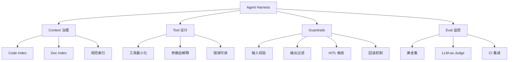

<!--
story:
  number: 30
  type: 续集
  position: 续集八
  title: Agent Harness
  audience: AI 工程师 / 架构师
-->

# 32 · Agent Harness

> 从阿明的 1 个 Agent 到 20 个 Agent，看 AI 编码工程化的脚手架 —— Harness 是 Agent 时代的"操作平台"

> **系列定位**：本篇是「阿明餐厅」系列的**续集八**。在[《当餐厅长出大脑》](./01-ai-agent-architecture.md)中，我们讲了 AI Agent 的 7 大模块（感知/记忆/规划/工具/协同/反馈/安全）。在[《Codebase 认知债》](./29-codebase-cognitive-debt.md)中，我们讲了 AI 时代代码可读性的隐形负债。但有个问题没回答：**怎么让多个 Agent 真正"好用"？** 答案是 Harness —— Agent 周围的脚手架、指挥中心、安全栏。**Agent 是发动机，Harness 是传动系统 + 仪表盘 + 安全气囊。**

---

## 引言：1 个 Agent 好管，20 个 Agent 失控

阿明在 2024 年开始让 AI Agent 写代码。

第一个 Agent 很简单：让它"按需求写代码"，它就能写。1 个 Agent + 1 个工程师 = 1.5 倍效率。

2025 年，AI Coding 普及。阿明部署了 20 个 Agent：

- 5 个写代码的 Agent（按模块分）
- 3 个写测试的 Agent
- 2 个 Code Review Agent
- 2 个文档 Agent
- 1 个监控 Agent（看代码质量）
- 1 个重构 Agent
- 6 个专门 Agent（性能优化、安全扫描、依赖升级……）

结果：效率没提升，**反而崩了**。

阿明描述当时的状态："这 20 个 Agent 像 20 个新来的实习生，**每个人都只懂自己那一摊，互相不配合，没人告诉他们边界在哪**。最可怕的是，**它们写出了 10 万行代码，但我不知道它们在想什么、做了什么、为什么这样做**。"

老陈点出关键问题："**单个 Agent 是 OK 的，多 Agent 协作是灾难**。原因是少了 **Harness**。"

> **Harness（驾驭系统）** 是包裹在 Agent 周围的工程化框架，负责协调、监控、保护、评估 Agent 的所有行为。

类比一下：1 个厨师自己干不用指挥；20 个厨师协作必须有一个"调度台"（Harness），负责：
- 接到订单（Context 准备）
- 分配任务（Tool 调度）
- 记住进度（Memory 持久化）
- 防止出错（Guardrails 安全栏）
- 评估表现（Eval 流水线）

**Agent 是发动机，Harness 是传动系统 + 仪表盘 + 安全气囊 + 方向盘。没有 Harness，Agent 跑不快，也跑不远。**

---

## 第一章：什么是 Agent Harness —— Agent 时代的厨房管理系统

**Agent Harness** 是指包裹在 AI Agent 周围、负责**协调、监控、保护、评估**Agent 行为的工程化系统。

它和 Agent 本身的区别：

| 维度 | Agent 本身 | Agent Harness |
|------|-----------|---------------|
| 角色 | 决策者（写代码、写文档） | 协调者（喂数据、调度、保护） |
| 关注 | "我要做什么" | "它能做什么、不能做什么、做了之后怎么办" |
| 失效影响 | 写错代码 | 系统失控、成本爆炸、安全事故 |
| 变化频率 | 频繁（按需求变） | 稳定（按团队规范变） |

餐厅类比：1 个 Agent 像 1 个新厨师；Harness 像"厨房管理系统"（KDS, Kitchen Display System）。KDS 不做菜，但它决定：

```text
厨房管理系统（KDS）= Agent Harness：

┌─────────────────────────────────────────────┐
│  订单管理（Context）                         │
│  - 接收订单，准备好食材和工具                │
│  - 类比：喂什么给 AI 决定 AI 能做什么       │
└─────────────────────────────────────────────┘
                     │
                     ▼
┌─────────────────────────────────────────────┐
│  任务调度（Tools）                           │
│  - 把订单分配给合适的厨师                    │
│  - 类比：AI 能调用什么工具                 │
└─────────────────────────────────────────────┘
                     │
                     ▼
┌─────────────────────────────────────────────┐
│  进度跟踪（Memory）                          │
│  - 记录每道菜做到哪一步                     │
│  - 类比：AI 跨会话的记忆                   │
└─────────────────────────────────────────────┘
                     │
                     ▼
┌─────────────────────────────────────────────┐
│  质量与安全（Guardrails）                    │
│  - 检查火候、防止烧焦、防止出错             │
│  - 类比：AI 输出的过滤和审查               │
└─────────────────────────────────────────────┘
```

Harness 不是一个"产品"，而是一组**工程实践**的集合。阿明在做了 18 个月 Harness 实践后，总结出 4 大核心模块。

---

## 第二章：Harness 的 4 大核心模块 —— 喂什么、用什么、记什么、防什么

### 2.1 Context 模块 —— 喂什么决定能做什么

**Context（上下文）** 是 Agent 在执行任务时能"看到"的所有信息。Context 质量决定 Agent 输出质量的上限。

Context 的 5 类来源：

```text
Agent 的 Context：

1. System Prompt（系统提示）
   - 角色定义、行为规范、输出格式
   - 类比：菜谱的总纲"做菜的基本原则"

2. User Request（用户请求）
   - 当前任务的具体描述
   - 类比：顾客的点单"我要红烧肉"

3. Retrieved Context（RAG 检索）
   - 从知识库/代码库检索的相关信息
   - 类比：厨师查阅的相关菜谱和经验

4. Tool Results（工具调用结果）
   - Agent 调用工具后返回的数据
   - 类比：厨师炒完菜后看颜色和味道

5. Conversation History（对话历史）
   - 之前轮次的 Agent 输出和用户反馈
   - 类比：厨师记住"昨天做了 10 份红烧肉都卖光了"
```

**Context 治理是 Harness 最核心的工作**。Context 不是"喂得越多越好"，而是"喂得越准越好"。这呼应了[《Codebase 认知债》](./29-codebase-cognitive-debt.md)第五章的观点：**RAG 的质量上限 = 认知债的下限**。

阿明在 Context 治理上的核心原则：

- **System Prompt 模板化 + 版本化**：所有 Agent 共享一套模板，但每个 Agent 角色定制
- **RAG 检索精确化**：用"语义检索 + 关键词检索 + 重要性排序"组合，而不是单一向量检索
- **Context 压缩**：超过窗口的旧信息摘要后保留，关键事实原文保留
- **Context 隔离**：不同 Agent 的 Context 严格隔离，避免信息泄漏

### 2.2 Tools 模块 —— Agent 的"手"

**Tools（工具）** 是 Agent 与外部世界交互的接口。Tool 的设计质量直接决定 Agent 能做什么、不能做什么。

Tool 的 3 种类型：

| 类型 | 含义 | 餐厅类比 | 示例 |
|------|------|----------|------|
| 数据查询工具 | 只读 | 厨师查阅菜谱 | `search_code(query)`、`get_file(path)` |
| 操作执行工具 | 写入 | 厨师切菜炒菜 | `edit_file(path, content)`、`run_command(cmd)` |
| 复合工作流工具 | 多步组合 | 厨师完成一整道菜 | `deploy_service(name, env)`（含构建+测试+部署） |

阿明的工具设计原则（详见第四章）：

- **每个工具做一件事**：单一职责
- **工具可发现**：Agent 通过工具描述知道"我能用什么"
- **工具可观测**：每次调用都记录"谁、什么时候、为什么、调了什么"
- **工具可回滚**：写入类操作支持撤销

### 2.3 Memory 模块 —— 跨会话的"长期记忆"

**Memory（记忆）** 让 Agent 能在多次会话间保持连续性。Memory 分为 4 层（呼应[《当餐厅长出大脑》](./01-ai-agent-architecture.md)第二章的 4 类记忆）：

| 记忆层 | 内容 | 持久化 | 类比 |
|--------|------|--------|------|
| 工作记忆 | 当前任务的中间状态 | 内存 | 厨师脑子里的"现在要做到第几步" |
| 情节记忆 | 过去的任务历史 | 数据库 | 厨师记住"上周做的红烧肉多放了糖" |
| 语义记忆 | 学到的概念和规律 | 知识库 | 厨师知道的"红烧肉要炒 15 分钟" |
| 程序记忆 | 学会的技能和流程 | 工具/脚本 | 厨师的手艺"如何翻锅" |

Harness 的 Memory 模块要解决两个核心问题：

1. **什么该记住**：不是所有上下文都值得长期保存，过滤噪音
2. **什么该忘记**：过时的、不相关的应该被压缩或删除

阿明用的方法：

- **重要事件原文保留**（如"用户偏好用 Saga 模式"）
- **普通事件摘要存储**（如"今天处理了 10 个 Issue"）
- **完全无关事件直接丢弃**（如"我执行了 3 次 `ls` 命令"）

### 2.4 Guardrails 模块 —— 防止 Agent 翻车

**Guardrails（护栏）** 是 Harness 的安全层，**防止 Agent 做出预期外的、有害的、或昂贵的操作**。

Guardrails 的 4 层防护：

```text
┌─────────────────────────────────────────────┐
│  Layer 1: 输入防护                           │
│  - Prompt 注入检测                          │
│  - 敏感信息过滤（PII、密钥）                │
│  - 越权请求拦截（"请删除生产数据库"）        │
└─────────────────────────────────────────────┘
                     │
                     ▼
┌─────────────────────────────────────────────┐
│  Layer 2: 工具调用防护                       │
│  - 危险命令黑名单（rm -rf、dd、mkfs）        │
│  - 写操作需要确认（修改生产配置）            │
│  - 资源使用上限（CPU/内存/网络）             │
└─────────────────────────────────────────────┘
                     │
                     ▼
┌─────────────────────────────────────────────┐
│  Layer 3: 输出防护                           │
│  - 代码安全扫描（SQL 注入、XSS、SSRF）       │
│  - 敏感信息检测（密钥、个人信息）            │
│  - 格式校验（API 规范、SQL 语法）            │
└─────────────────────────────────────────────┘
                     │
                     ▼
┌─────────────────────────────────────────────┐
│  Layer 4: 行为审计                           │
│  - 完整日志（谁、什么时候、做了什么）       │
│  - 异常行为告警（"Agent 突然删除 100 个文件"）│
│  - 回滚能力（所有写操作可撤销）              │
└─────────────────────────────────────────────┘
```

这呼应了[《AI 的"黑暗料理"》](./28-ai-hallucination-safety.md)中的"三层护栏"和 HITL 设计，但 Harness 把护栏工程化、产品化、自动化。

#### 4 大核心模块协同



---

## 第三章：Context 治理 —— Harness 最核心的工作

Context 是 Harness 的"燃料"，Context 质量直接决定 Agent 输出质量。阿明专门为 Context 治理开发了一套"五步法"。

### 3.1 Context 准备的"5 问"

每次给 Agent 准备 Context 前，阿明要求团队回答 5 个问题：

```text
Context 准备的 5 问：

1. 这个 Agent 的核心任务是什么？（决定要不要 RAG、要不要工具）
2. 它需要"看到"哪些代码/文档？（避免无差别喂全仓）
3. 它的"禁区"是什么？（哪些操作绝对不允许）
4. 它的"输出规范"是什么？（代码风格、错误处理、命名）
5. 它的"成功标准"是什么？（什么算"做对了"）
```

这 5 问形成了一个"Context 模板"，每个 Agent 的 System Prompt 都基于这个模板生成。

### 3.2 RAG 检索的"4 段式"

阿明没用单一的向量检索，而是组合 4 种检索方式：

```text
RAG 4 段式检索：

1. 关键词检索（BM25）
   - 适用：精确术语、错误码、API 名字
   - 工具：Elasticsearch / Meilisearch
   
2. 语义检索（向量）
   - 适用：模糊查询、需求描述
   - 工具：pgvector / Milvus / Qdrant
   
3. 结构化检索（AST/依赖图）
   - 适用：查找相关函数、相关模块
   - 工具：tree-sitter + 自定义图查询
   
4. 元数据过滤（语言/时间/Owner）
   - 适用：限制检索范围
   - 工具：在上述三种检索后加过滤
```

**关键洞察**：单纯的向量检索召回率只有 60-70%。4 段式组合能达到 85%+，并且**误召回（噪声）少 50%**。这呼应了[《Codebase 认知债》](./29-codebase-cognitive-debt.md)第五章："RAG 的质量上限 = 认知债的下限" —— 检索质量好，Agent 输出才靠谱。

### 3.3 Context 压缩与摘要

当对话历史超过 50 轮，Context 长度可能超过 100K tokens。阿明设计了**"三层压缩"**：

```text
Context 三层压缩：

Layer 1 - 关键事实保留（原文）
  - 用户偏好、约束条件、关键决策
  - 永远保留，不压缩

Layer 2 - 中等重要性（摘要）
  - 任务执行步骤、工具调用结果
  - 摘要到 1-2 句，保留关键数据点

Layer 3 - 噪声信息（直接删除）
  - "我现在要..."、"让我先..."、"好的，我来做..."
  - 工具调用的中间参数（保留最终结果）
  - Agent 的"思考"（保留结论，不保留过程）
```

阿明的经验：Context 压缩后，长度能减少 70% 而不损失关键信息。**这是 Harness 的"内存管理"。**

### 3.4 Context 隔离

不同 Agent 的 Context 严格隔离，这是 Harness 的"安全边界"：

```text
Context 隔离原则：

1. 角色隔离
   - 写代码的 Agent 不能直接看到"测试 Agent 的私有笔记"
   - Code Review Agent 不能修改代码，只能给建议

2. 租户隔离
   - 租户 A 的 Agent 不能访问租户 B 的代码
   - 通过 namespace + RBAC 强制

3. 环境隔离
   - 生产环境的 Agent 不能调用开发环境的工具
   - 工具注册时绑定环境
```

**Context 隔离是 Harness 安全模型的基石**。没有隔离，Agent 就是一个"超级权限"账号，风险不可控。

---

## 第四章：Tool 设计原则 —— 工具是 Agent 的"手"

Tool 是 Agent 与外部世界交互的接口。**Tool 设计的好坏，决定了 Agent 能做什么、不能做什么、做了之后会发生什么**。

### 4.1 Tool 的 6 大设计原则

```text
Tool 设计 6 原则：

1. 单一职责
   - 一个工具做一件事
   - 反例：deploy_service() 含构建+测试+部署
   - 正例：build()、test()、deploy() 三个独立工具

2. 描述即文档
   - 工具的"description"字段必须详尽
   - Agent 通过 description 决定什么时候调用
   - 反例："更新文件"（太模糊）
   - 正例："edit_file(path, old_string, new_string)：
           替换文件中指定字符串。
           path: 相对仓库根的路径
           old_string: 要替换的内容（必须唯一匹配）
           new_string: 新的内容
           注意：如果 old_string 匹配多个，会报错"

3. 类型严格
   - 输入输出必须强类型
   - 用 JSON Schema 定义
   - 避免"any"或"object"模糊类型

4. 幂等性
   - 重复调用应产生相同结果
   - 用 Idempotency-Key 标识操作
   - 详细设计见[《菜单设计学》](./10-api-design.md)的"幂等设计"

5. 可回滚
   - 写操作必须有"撤销"路径
   - 记录 before-state 用于回滚
   - 重要操作需要"二次确认"

6. 资源限制
   - 每次调用有 timeout、retry、cost 限制
   - 单次工具调用成本不超过 1 元
   - 防止"Agent 死循环烧光 Token"
```

### 4.2 工具注册中心

Harness 需要一个**工具注册中心**，管理所有可用工具：

```yaml
# tool_registry.yaml
tools:
  - name: edit_file
    description: |
      替换文件中指定字符串。
      适用场景：精确修改文件内容。
      风险等级：低（可回滚）。
    parameters:
      type: object
      properties:
        path: { type: string, description: "文件路径（相对仓库根）" }
        old_string: { type: string, description: "要替换的内容（必须唯一）" }
        new_string: { type: string, description: "新内容" }
      required: [path, old_string, new_string]
    risk_level: low
    timeout_ms: 5000
    cost_estimate: 0.001
    rollback_strategy: "git checkout -- <path>"

  - name: deploy_service
    description: |
      部署服务到指定环境。
      适用场景：服务发布、灰度、回滚。
      风险等级：高（需 HITL 确认）。
    parameters:
      type: object
      properties:
        service: { type: string }
        env: { type: string, enum: [dev, staging, prod] }
        version: { type: string }
      required: [service, env, version]
    risk_level: high
    requires_hitl: true
    timeout_ms: 60000
    cost_estimate: 5.0
    rollback_strategy: "kubectl rollout undo"
```

**工具注册中心是 Harness 的"工具菜单"**。Agent 看到的是菜单（description），运维看到的是"成本+风险"（risk_level、cost_estimate、requires_hitl）。

### 4.3 工具调用监控

每次工具调用都记录：

```text
工具调用日志：

时间：2026-06-13 10:23:45
Agent：code-writer-001
工具：edit_file
参数：{path: "src/order/service.py", old_string: "...", new_string: "..."}
结果：成功
耗时：120ms
Token 消耗：0.001 元
当前累计 Token：12.34 元
```

这是 Harness 的"黑匣子"。**所有工具调用都可追溯、可回放、可审计**。这与[《厨房装监控》](./05-observability.md)中的链路追踪思想完全一致。

---

## 第五章：评估与监控 —— Harness 的可观测性

Agent 输出**看起来**对不对，和**实际**对不对，是两回事。Harness 必须有"评估流水线"和"持续监控"。

### 5.1 Eval 流水线

阿明建立了一个**三层评估流水线**：

```text
Eval 流水线（每个 Agent 输出都要经过）：

Layer 1: 自动检查（毫秒级）
  - 语法检查（代码能 parse）
  - 格式检查（输出符合 schema）
  - 静态分析（lint、类型检查）
  - 安全扫描（密钥、注入、敏感信息）

Layer 2: 自动化测试（秒级）
  - 单元测试（针对修改的代码）
  - 集成测试（针对相关模块）
  - 回归测试（关键链路）

Layer 3: LLM-as-a-Judge（秒级 - 分钟级）
  - 另一个 LLM 评估输出质量
  - 检查项：业务逻辑、命名规范、文档完整性
  - 打分 1-5 分，< 3 分触发 HITL

Layer 4: 人工审查（小时级）
  - 关键模块的修改必须人工 Review
  - 高风险变更（生产环境）必须人工确认
  - 新 Agent 输出的前 100 个必须人工 Review
```

**Eval 是 Harness 的"质检部门"**。没有 Eval，Agent 输出就只是"看起来对"，实际可能错得离谱。

这呼应了[《厨房质检员》](./08-qa-testing-strategy.md)的"金字塔 70/20/10"：70% 自动测试 + 20% 集成测试 + 10% 人工审查。Eval 流水线就是 Agent 时代的"测试金字塔"。

### 5.2 监控仪表盘

Harness 的可观测性仪表盘：

```text
Agent Harness 健康度看板：

┌──────────────────────────────────────────┐
│  Agent 数量：20                           │
│  今日调用次数：12,345                     │
│  今日 Token 消耗：¥ 234.5                │
│  今日 Eval 失败率：3.2%                  │
│  HITL 触发率：5.1%                       │
│  工具调用平均耗时：180ms                  │
│  工具调用失败率：0.8%                    │
│                                          │
│  Top 失败工具：                           │
│    1. edit_file（重复 old_string 匹配）    │
│    2. run_command（超时）                  │
│    3. search_code（无结果）                │
│                                          │
│  异常 Agent：                             │
│    - code-writer-005（连续 3 次失败）      │
│    - refactor-agent-001（输出偏离需求）    │
└──────────────────────────────────────────┘
```

这与[《厨房装监控》](./05-observability.md)的 SLO 设计相通：**SLO 不仅是机器的，也是 Agent 的**。

### 5.3 失败回放与改进

Agent 输出有问题怎么办？**Harness 必须支持"失败回放"**：

```text
失败回放流程：

1. 发现失败
   - Eval 流水线报告：code-writer-003 的输出 1 分（不通过）

2. 记录现场
   - 完整保存：System Prompt + User Request + RAG 检索结果 + 工具调用 + Agent 输出

3. 重现失败
   - 用相同的 Context 重新运行 Agent
   - 验证失败是否可重现

4. 诊断根因
   - Context 不全？→ 调整 RAG 检索策略
   - Prompt 模糊？→ 改写 System Prompt
   - 工具能力不够？→ 增加或改进工具
   - Agent 能力不够？→ 换更高级的模型

5. 修复并验证
   - 应用改进
   - 用历史失败用例重跑，确认修复

6. 沉淀为回归测试
   - 这个失败用例加入 Eval 套件
   - 防止未来再次出现
```

**Harness 的"失败回放"是它的"复盘机制"**。每次失败都是改进的机会。

---

## 第六章：6 大最佳实践 —— 从 Prompt 版本化到 HITL，工程化治理

18 个月的 Harness 实践后，阿明总结了 6 大最佳实践。

### 6.1 Prompt 版本化

每个 Agent 的 System Prompt 必须**版本化**，与代码一起存在 Git 仓库：

```text
prompts/
├── code-writer/
│   ├── v1.0.0.yaml
│   ├── v1.1.0.yaml
│   └── CHANGELOG.md
├── test-writer/
├── code-reviewer/
└── _templates/
```

**Prompt 改了谁、改了什么、为什么改、改了之后效果如何**，全程可追溯。这呼应了[《从厨师到 CEO》](./07-from-chef-to-ceo.md)第四章的 ADR 实践。

### 6.2 Tool 注册中心 + 权限分级

所有工具通过**注册中心**统一管理，按风险分级：

| 风险等级 | 示例 | 治理方式 |
|----------|------|----------|
| 低 | `get_file`、`search_code` | 直接调用，无限制 |
| 中 | `edit_file`、`run_command` | 记录 + 限额 |
| 高 | `deploy_service`、`drop_table` | HITL 确认 + 二次审计 |
| 禁止 | `rm -rf`、`chmod 777` | 工具黑名单，根本不可调用 |

### 6.3 沙箱执行

所有工具调用在**沙箱**中执行：

- **网络隔离**：Agent 只能访问允许的域名/IP
- **文件系统隔离**：每个 Agent 有独立的工作目录
- **资源限制**：CPU/内存/网络带宽严格限制
- **环境隔离**：开发/测试/生产环境严格分开

沙箱是 Harness 的"安全气囊" —— **Agent 翻车了，影响也只在沙箱内**。

### 6.4 成本监控与告警

Agent 调用的 Token 成本是 Harness 必须监控的核心指标：

```text
成本监控规则：

单次任务成本上限：¥ 1.0
单日 Agent 成本上限：¥ 500
单月 Agent 成本上限：¥ 10,000

触发上限的 80%：发邮件告警
触发上限的 100%：自动暂停 + 人工 review
触发上限的 150%：紧急熔断
```

**Agent 的成本失控比性能失控更隐蔽，但更危险**。一个死循环的 Agent 一晚上可能烧掉几万元 Token 费。

### 6.5 失败回放与 Eval 套件

每个 Agent 的输出都进 Eval 套件，**Eval 套件就是 Agent 时代的"单元测试"**：

- 典型任务：必跑
- 边界任务：定期跑
- 历史失败：必跑
- 回归任务：每次跑

Eval 套件覆盖率是 Harness 的"质量红线" —— **覆盖率 < 80% 的 Agent 不允许上线**。

### 6.6 人机协作（HITL）的设计

不是所有事情都让 Agent 自己做。阿明设计了**3 级 HITL（Human-in-the-Loop）**：

| 决策级别 | Agent 自主 | HITL 模式 | 典型场景 |
|----------|-----------|-----------|----------|
| 战术级 | 100% 自主 | 无 HITL | 单文件修改、加注释、生成测试 |
| 战略级 | 建议 + 确认 | 异步 HITL | 跨服务修改、依赖升级、文档生成 |
| 关键级 | 必须人工 | 同步 HITL | 生产部署、数据迁移、安全相关 |

**HITL 不是"AI 不行"，是"AI + 人的边界"**。Harness 的工作不是"消除人"，而是"把人的时间花在最关键的地方"。

这呼应了[《学徒的困境》](./11-ai-learning-paradox.md)的"脚手架理论" —— AI 像脚手架一样，帮助人提升能力，而不是替代人做决策。

---

## 核心总结：Agent Harness

```mermaid
graph TD
    A[Agent Harness] --> B[Context 模块]
    A --> C[Tools 模块]
    A --> D[Memory 模块]
    A --> E[Guardrails 模块]
    A --> F[Eval 流水线]
    A --> G[可观测性]
    B --> H[5 问 / 4 段式检索 / 3 层压缩 / 隔离]
    C --> I[6 原则 / 注册中心 / 监控]
    D --> J[4 层记忆 / 摘要 / 遗忘]
    E --> K[4 层防护 / HITL / 沙箱]
    F --> L[4 层 Eval / 失败回放 / 回归套件]
    G --> M[仪表盘 / 告警 / 成本监控]
    H --> N[Agent 时代的工程化]
    I --> N
    J --> N
    K --> N
    L --> N
    M --> N
    N --> O[AI Coding 从"能用"到"好用"]
    
    style A fill:#ff6b6b
    style O fill:#c0392b
```

| 痛点 | Harness 解决方案 | 核心思想 |
|------|------------------|----------|
| Agent 输出不稳定 | Context 治理 + 5 问模板 | 喂什么决定能做什么 |
| Agent 调用工具混乱 | Tool 注册中心 + 6 原则 | 工具是 Agent 的"手"，设计要严格 |
| Agent 跨会话失忆 | Memory 4 层 + 摘要压缩 | 不是所有上下文都值得记住 |
| Agent 翻车没保护 | 4 层 Guardrails + 沙箱 | 没有安全栏，Agent 是定时炸弹 |
| Agent 质量看不见 | 4 层 Eval 流水线 | Eval 是 Agent 时代的测试金字塔 |
| Agent 成本失控 | 成本监控 + 告警 + 熔断 | Token 成本比性能成本更隐蔽 |
| 失败无法改进 | 失败回放 + 回归套件 | 每次失败都是改进机会 |
| AI 替代人 | 3 级 HITL | 把人花在最关键的地方 |

### 一句心法

**Agent 是发动机，Harness 是传动系统 + 仪表盘 + 安全气囊 + 方向盘。没有 Harness，Agent 只是更快的 Bug 制造机；有了 Harness，Agent 才能从"能用"走向"好用"。**

---

## 延伸阅读

- [当餐厅长出大脑](./01-ai-agent-architecture.md) —— AI Agent 的 7 大模块（感知/记忆/规划/工具/协同/反馈/安全），Harness 围绕这些模块工作
- [Codebase 认知债](./29-codebase-cognitive-debt.md) —— RAG 的质量上限 = 认知债的下限，Harness 治理 Context 必须先治理认知债
- [学徒的困境](./11-ai-learning-paradox.md) —— HITL 的"脚手架理论"，AI 帮人而非替代人
- [厨房装监控](./05-observability.md) —— Harness 的可观测性是 Agent 时代的 SLO
- [食安大检查](./06-security-architecture.md) —— 4 层 Guardrails 的安全模型，类比"纵深防御"
- [从厨师到 CEO](./07-from-chef-to-ceo.md) —— Prompt 版本化是 ADR 实践的延伸
- [厨房质检员](./08-qa-testing-strategy.md) —— Eval 流水线是 Agent 时代的测试金字塔
- [菜单设计学](./10-api-design.md) —— Tool 设计的"幂等性""版本管理""错误处理"与 API 设计同源
- [差评危机](./15-incident-response.md) —— 失败回放是 Agent 时代的"故障复盘"
- [AI 的"黑暗料理"](./28-ai-hallucination-safety.md) —— 三层护栏的工程化实现
- [会自我进化的厨房](./27-self-evolving-company.md) —— Harness + Agent Loop = 自进化组织的"操作系统"

---


### 跨章节衔接

- 11.ai/03-engineering/ai-platforms/README.md —— Dify/Coze/LangGraph 平台对比 —— Harness 设计可借鉴的工程化思路
- 11.ai/04-architecture/bpmn-ai-integration.md —— BPMN+AI 融合 —— Agent Harness 在工作流引擎中的落地形态

## 跨章节衔接

- [01-ai-agent-architecture.md](./01-ai-agent-architecture.md) —— 续集一，Harness 是 Agent 架构的工程化封装：架构到 Harness 的工程实现
- [04-peak-traffic-defense.md](./04-peak-traffic-defense.md) —— 正传 1，AI Agent 高并发调用的流量治理：Token 限流、并发控制
- [30-ai-hallucination-safety.md](./28-ai-hallucination-safety.md) —— 续集六，Harness 的幻觉防护：上下文注入、输出校验、人类反馈
- [15-incident-response.md](./15-incident-response.md) —— 正传 9，AI Agent 系统的故障模式：幻觉、超时、Token 溢出

---

## 结语

阿明在团队内部做了一次 Harness 实践分享，主题是"AI Coding 从'能用'到'好用'，差的是 Harness"：

> 各位同事：
>
> 2024 年我们说"AI 写代码很神奇"，2025 年我们说"AI 写代码很快"，2026 年我们必须说"**AI 写代码可控**"。
>
> 可控不是限制 AI，而是让 AI 在合适的边界内发挥最大价值。**Agent 是发动机，Harness 是传动系统 + 仪表盘 + 安全气囊 + 方向盘**。没有 Harness，Agent 跑不快也跑不远 —— 不仅是性能问题，更是成本、安全、质量的全面失控。
>
> 治理 Harness 不是"治理 AI"，而是"**让 AI 与人协作的方式**"形成可重复、可观测、可改进的工程实践。
>
> 一句话：**没有 Harness，Agent 只是更快的 Bug 制造机；有了 Harness，Agent 才能从"能用"走向"好用"。**
>
> 下次当你觉得"AI 写代码不靠谱"时，别只怪 AI —— 检查一下你的 Harness。问自己 5 个问题：
>
> 1. Context 准备好没有？代码索引、文档索引、规范索引是不是最新的？
> 2. Tool 设计合理吗？参数是否自解释、错误是否可读、是否最小必要？
> 3. Guardrails 够不够？输入校验、输出过滤、HITL 触发、回滚机制都覆盖了吗？
> 4. Eval 覆盖到没？黄金集、LLM-as-Judge、回归测试是否在 CI 里持续跑？
> 5. 失败能不能回放？每一步 Prompt、Tool 调用、参数、结果是不是都记下来了？

阿明看着仪表盘上的数字，欣慰的是 Agent 失败率从 15% 降到了 3%、Token 成本可控、HITL 触发合理。但更让他欣慰的是：团队的工程师开始主动提"这个 Agent 需要个 Tool"、"这个 Prompt 写得不严谨"。

**Harness 治理的最高境界，不是"治理 Harness"，而是"让治理 Harness 成为工程师的基本功"。**

---

## 延伸阅读（2026 新增）

- 续集十九：[`45-ai-productivity-paradox`](./43-ai-productivity-paradox.md) —— **Harness 是 DORA 放大器理论的"缰绳"**：为什么 Harness 是 AI 时代的工程解药
- 续集十八：[`44-ai-engineer-responsibility`](./42-ai-engineer-responsibility.md) —— **Harness 是工程责任不可下放的基础设施**：谁担责、谁配置 Harness
- 续集二十：[`46-tech-debt-career-trap`](./44-tech-debt-career-trap.md) —— **个人视角**：在 Harness 治理中成长的工程师，简历最值钱

← [返回系列导读](./index.md)
