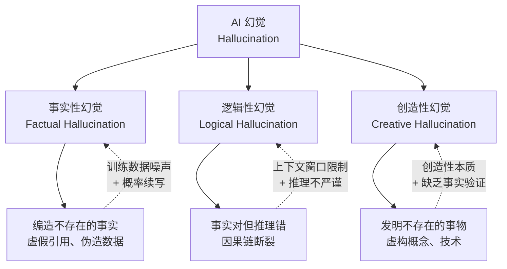
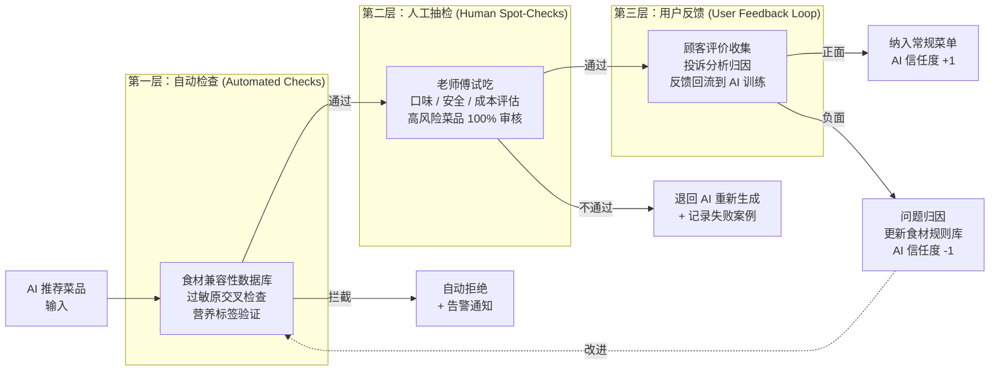
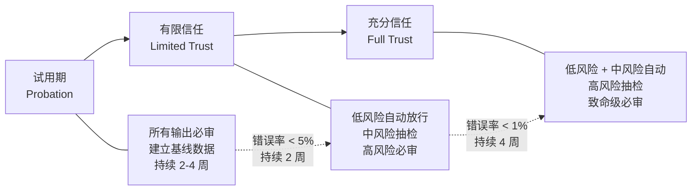
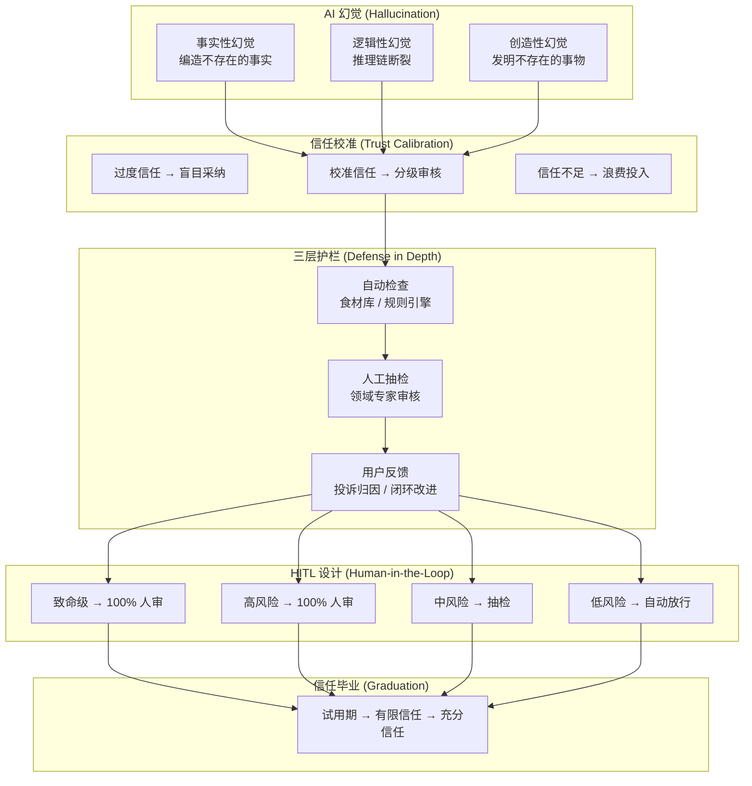

# 30 · AI 的"黑暗料理"

> 从阿明的 AI 推荐了"相克食材"，看 AI 幻觉、信任校准与安全护栏

> **系列定位**：本篇是「阿明餐厅」系列的**续集六**。在前几篇续集中，阿明学会了 AI 的组织转型（[续集三](./27-ai-org-transformation.md)）、AI 原生创业（[续集四](./28-ai-native-startup.md)）和自进化组织（[续集五](./29-self-evolving-company.md)）；本篇聚焦一个贯穿所有 AI 应用的核心问题 —— 当 AI "一本正经地胡说八道"时，你怎么办？

---

## 引言：一道差点上了菜单的"黑暗料理"

2026 年 8 月，阿明让 AI 学徒帮忙设计秋季新菜品。

AI 学徒信心满满地提交了一份方案："金秋双鲜盅 —— 蟹粉柿霜羹"，用螃蟹搭配柿子，再淋上一层柿霜糖。推荐理由写得头头是道："螃蟹富含优质蛋白与锌元素，柿子含有丰富的维生素 C 和膳食纤维，两者搭配可实现营养互补，提升免疫力。"还附了一份"营养学分析报告"，引用了三篇"论文"，列出了七八个数据表格。

阿明看完差点拍桌子 —— 螃蟹和柿子在传统饮食观念中被认为相克，轻则消化不良，重则胃结石。更要命的是，那三篇"论文"根本不存在，那些"数据"全是编的。如果没人审核，这道"黑暗料理"就直接上了菜单。

老师傅在旁边冷冷地说了一句："这学徒，菜不会做不要紧，最怕的是不会做还敢吹。"

**AI 最大的危险不是"不会做"，而是"自信地做错"。信任校准比能力更重要。**

---

## 第一章：AI 的幻觉 —— 一本正经的"黑暗料理"

阿明把 AI 学徒叫来问："你确定螃蟹和柿子能一起吃？"

AI 学徒回答："根据多项营养学研究，螃蟹与柿子的搭配在适量食用条件下是安全的，且具有良好的营养互补效果。以下是具体分析……"

答案写得比教科书还自信。但阿明注意到，AI 提到的"2023 年《中华营养学杂志》发表的一项双盲对照实验" —— 这个期刊、这篇论文，根本不存在。AI 不是在说谎，它是**真的"以为"自己说的是对的**。

### 什么是 AI 幻觉（AI Hallucination）

AI 幻觉是指大语言模型（LLM）生成的内容**看起来合理、自信、流畅，但实际上是错误的、编造的、或与事实不符的**。这不是 Bug，而是大模型"概率续写"本质的副产品 —— 模型在预测"下一个最可能的词"，而不是在"验证事实的真假"。

用餐厅的话说：AI 学徒不是在故意糊弄你，它是**真的不知道自己不知道**。它读过太多菜谱和营养学文章，学会了"用什么语气写营养分析报告"，但并不会真的去验证食材搭配的安全性。

### 幻觉是怎么"生产"出来的

大语言模型的本质是**概率续写（Next Token Prediction）**：给定前文，预测下一个最可能出现的词。它不是在一个"事实数据库"里查询答案，而是根据训练数据中的语言模式，生成"最像正确答案"的文本。

用厨房的比喻来说：AI 学徒不是去"查菜谱"，而是"凭记忆中的印象重新创作"。它见过很多营养学报告的格式和语气，所以能写出一份"看起来像"营养学报告的东西 —— 但里面的数据和引用，都是它根据"什么样的内容通常会出现在营养学报告里"这个模式"续写"出来的。

```python
# AI 幻觉的"生产流程" —— 用厨房比喻
# AI 不是"查资料回答问题"，而是"凭印象创作答案"

def ai_generate_answer(question):
    # 第一步：理解问题的"模式"
    pattern = recognize_pattern(question)  
    # "这是一个关于食材搭配安全性的问题"
    
    # 第二步：根据模式，续写"最像正确答案"的文本
    # 注意：这里不是在查询事实数据库，而是在做概率续写
    answer = generate_most_likely_text(pattern)  
    # "根据多项研究...两者搭配...营养互补..."
    
    # 第三步：没有事实验证环节！
    # AI 不会执行 verify_facts(answer)
    # 这就是幻觉的根源 —— 生成和验证是两个独立的能力
    return answer  # 自信满满，但可能是编的
```

### 为什么"自信的错"比"承认不懂"更危险

老师傅如果不知道某个搭配，他会说"我不确定，查查再说"。但 AI 不会 —— 它会用流畅的语言、专业的术语、看似严谨的逻辑，把一个错误包装成一个"权威结论"。

这就是所谓的**自信偏差（Confidence Bias）**：人类天然倾向于相信表达流畅、逻辑自洽、引用权威的回答。AI 恰恰擅长生产这类"看起来可信"的内容。当一个回答写得越专业、越自信，你就越难发现它是错的 —— 这才是最危险的地方。

| 幻觉表现 | 餐厅场景 | 技术场景 | 危险程度 |
|----------|----------|----------|----------|
| 编造事实 | 虚构一份"营养学报告"来证明食材搭配合理 | 编造不存在的 API 文档、论文引用、统计数据 | 极高 |
| 过度自信 | 用"根据多项研究"开头，但研究根本不存在 | 输出"这个方案经过验证"但从未实际验证 | 极高 |
| 逻辑自洽但前提错误 | "螃蟹性寒，柿子性凉，两者中和刚好" —— 前提就是错的 | 推理链完美，但第一步假设就错了 | 高 |
| 张冠李戴 | 把 A 论文的数据用在 B 场景上 | 引用真实论文但曲解其结论 | 高 |

**AI 幻觉的核心危险不是"胡说八道"，而是"一本正经地胡说八道" —— 你很难分辨一个自信满满的回答到底是真理还是陷阱。**

---

## 第二章：幻觉分类学 —— 事实性/逻辑性/创造性幻觉

阿明发现 AI 学徒的"黑暗料理"不止一种。

有一次，AI 推荐了一道"松露巧克力烩饭"，理由是"意大利名厨 Carlo Rossi 在其著作《Truffle Beyond Pasta》中推荐的经典搭配" —— 这位名厨和这本书都是编的。这是**事实性幻觉**。

又有一次，AI 建议"先高温爆炒锁住水分，再低温慢煮保持嫩度"，逻辑看似自洽，但对于鱼类食材，高温爆炒会直接让鱼肉散架。事实没错（高温确实能锁水），推理链用错了对象。这是**逻辑性幻觉**。

还有一次，AI 发明了一种叫"分子蒸馏提味法"的烹饪技术，描述得栩栩如生 —— "利用食材中挥发性风味物质的沸点差异，通过精确控温实现风味分子的分离与重组"。听起来像真的，但这项技术根本不存在。这是**创造性幻觉**。

### 三种幻觉的技术根源



| 幻觉类型 | 核心特征 | 餐厅案例 | 技术案例 | 风险等级 | 检测难度 |
|----------|----------|----------|----------|----------|----------|
| 事实性幻觉 (Factual) | 编造不存在的事实 | 虚构名厨和著作来推荐菜品 | 编造不存在的 API、库、函数名 | 极高 | 中 —— 可通过事实核查发现 |
| 逻辑性幻觉 (Logical) | 事实正确但推理链断裂 | 把适用于肉类的烹饪逻辑套用在鱼上 | 正确引用算法但错误地应用于不匹配的场景 | 高 | 高 —— 需要理解推理过程 |
| 创造性幻觉 (Creative) | 发明看似合理的新事物 | 虚构"分子蒸馏提味法"烹饪技术 | 发明不存在的框架、设计模式 | 中 | 极高 —— 难以区分创新和编造 |

### 检测策略：不同类型的幻觉需要不同的"试纸"

阿明总结出了一套"幻觉检测三板斧"：

**针对事实性幻觉**：建数据库，自动核查。把已知的食材兼容性、营养学常识、权威来源录入系统，AI 输出的每一个"事实性声明"都自动和数据库比对。就像食材入库前先过一遍食安检测 —— 农残超标的直接拦截。

**针对逻辑性幻觉**：请专家，看推理链。逻辑错误不能靠数据库检测，因为每个事实单独看都是对的。必须有人能理解完整的推理链条，判断"A 推导到 B"这一步是否成立。这就是为什么领域专家在 AI 时代反而更重要了 —— 参见[续集二](./11-ai-learning-paradox.md)中关于"不可替代能力"的讨论。

**针对创造性幻觉**：标来源，验真伪。AI 如果提到了一个"新技术"或"新概念"，系统应该自动标记为"未经验证"，并附带来源核查链接。如果一个"烹饪技术"在网上搜不到任何第三方验证，那大概率是 AI 编的。

**幻觉分类的意义在于对症下药：事实性幻觉靠查数据库拦截，逻辑性幻觉靠领域专家审核，创造性幻觉靠标注"未经验证"。**

---

## 第三章：信任校准 —— 不是全信也不是不信

阿明的朋友老李也上了 AI 系统，但他的做法走了两个极端。

一开始，老李对 AI 言听计从。AI 推荐什么菜就上什么菜，AI 说成本多少就按多少定价。结果一个月后，两道有食材冲突的菜被端上了桌，三位顾客投诉。老李大怒，从此彻底不信 AI，所有 AI 建议一律人工重审 —— AI 变成了昂贵的摆设。

阿明看着老李摇头："你这不是信任管理，这是情绪管理。"

### 信任校准（Trust Calibration）

信任校准的核心思想是：**你对 AI 的信任度，应该匹配 AI 的真实可靠度。** 不是盲目全信，也不是全盘否定，而是基于数据和经验建立"分级的、可调节的"信任关系。

这个概念和人机交互领域研究已久的**自动化偏差（Automation Bias）** 与**自动化弃用（Automation Disuse）** 直接相关：

| 信任水平 | 行为模式 | 餐厅表现 | 风险 | 适用场景 |
|----------|----------|----------|------|----------|
| 过度信任 (Over-trust) | 盲目采纳 AI 所有建议 | AI 推什么菜就上什么菜，不审核 | 极高 —— 幻觉直接变成事故 | 不适用 |
| 校准信任 (Calibrated Trust) | 按风险等级分级审核 | 高风险菜品必审，低风险建议采纳 | 低 —— 系统性安全 | 日常运营 |
| 信任不足 (Under-trust) | 否定所有 AI 建议，全部重做 | AI 建议全部推翻，等于没用 AI | 中 —— 效率损失，浪费投入 | 不适用 |
| 零信任 (Zero Trust) | 完全不用 AI | 回到纯人工模式 | 低 —— 但丧失 AI 红利 | AI 系统尚未验证时 |

### 信任的两个陷阱

老李的经历其实揭示了两个经典的信任陷阱：

**自动化偏差（Automation Bias）**：过度信任 AI，不加审核地采纳所有输出。心理学研究表明，当系统"大部分时候是对的"，人类会逐渐丧失质疑能力 —— 就像自动驾驶中的驾驶员，99% 的时间不需要干预，但那 1% 的紧急情况恰恰最危险。

**自动化弃用（Automation Disuse）**：因为一次错误就彻底否定 AI，所有输出都要推翻重来。这就像因为一个新厨师做坏了一道菜，就再也不让他上灶 —— 结果你花大价钱招来的人，干的只是"AI 转录员"的活。

这两个极端之间的甜蜜点，就是**校准信任（Calibrated Trust）**。

### 信任带宽（Trust Bandwidth）

阿明想出了一个更直观的模型 —— **信任带宽**。

就像餐厅的传菜窗口，太窄了传不出菜（信任不足），太宽了又来不及检查（信任过度）。信任带宽要根据 AI 的"出错率"动态调整：

```python
# 信任带宽的动态调整逻辑
# 就像传菜窗口的大小，要根据菜品质量动态调节

def adjust_trust_bandwidth(ai_system, review_period="weekly"):
    """根据 AI 的历史表现，动态调整信任度"""
    error_rate = ai_system.get_error_rate(period=review_period)
    
    if error_rate < 0.01:  # 错误率 < 1%
        # AI 表现优秀：扩大信任带宽
        # 低风险任务自动通过，中风险抽检，高风险必审
        return TrustLevel.HIGH
    elif error_rate < 0.05:  # 错误率 < 5%
        # AI 表现一般：保持中等信任
        # 低风险抽检，中高风险必审
        return TrustLevel.MEDIUM
    else:  # 错误率 >= 5%
        # AI 表现差：收紧信任带宽
        # 所有任务必须人工审核
        return TrustLevel.LOW
    
    # 核心原则：信任是靠表现挣来的，不是默认给予的
```

阿明给老李的建议很简单："先让 AI 推荐十道菜，你自己尝一遍。如果八道以上靠谱，以后低风险的建议就直接采纳。但高风险的 —— 比如涉及过敏原的 —— 永远要人审。"

**信任校准的核心是"分级信任 + 动态调整"：信任要像新员工试用期一样，靠表现一点点挣来，而不是一上来就全权授权。**

---

## 第四章：三层护栏 —— 自动检查→人工抽检→用户反馈

阿明决定建立一套"AI 出品审核制度"。

他对团队说："AI 推荐的菜，必须过三关。第一关，系统自动查食材兼容性数据库；第二关，老师傅抽检试吃；第三关，上桌后收集顾客反馈。三关都过了，这道菜才能留在菜单上。"

小林问："这也太麻烦了吧？AI 推荐的菜十道里有九道是好的，为了那一道不好的搞这么大阵仗？"

阿明说："你知道食安事故为什么叫'万一'吗？因为一万道菜里只要有一道出问题，你的餐厅就完了。"

> **与本篇的"三层护栏"互补的概念**：本篇的"三层护栏"（模型/系统/业务）解决的是**AI 内部出错**（幻觉、误判）的检测；而[续集九 · 33 · 《AI 致命三件套》](./33-ai-fatal-trio.md)的"4 层防护"（预防/检测/缓解/恢复）解决的是**AI 被外部攻击**（注入、越权、泄露）的防御。两者**互补不重叠**，完整的 AI 安全需要两者叠加。详见[33 第六章 6.0 节对比表](./33-ai-fatal-trio.md)。

### 三层防御体系（Defense in Depth）

这个思路借鉴了安全架构中的**纵深防御（Defense in Depth）** 原则（详见[《食安大检查》](./06-security-architecture.md)）—— 不依赖任何单一防线，而是构建多层、异构的防御体系。



**第一层：自动检查（Automated Checks）**。阿明建了一个"食材兼容性数据库"，把常见的食材相克关系、过敏原交叉风险、营养标签合规性都录入了系统。AI 每推荐一道菜，系统先自动过一遍数据库。这一层是**高速、低成本、100% 覆盖**的防线，能拦截大部分明显错误。

**第二层：人工抽检（Human Spot-Checks）**。自动检查通过的菜品，进入人工审核环节。但不是每道都审 —— 高风险菜品（涉及常见过敏原、新食材组合、儿童餐）100% 由老师傅试吃审核；低风险菜品（常规食材组合、已有类似菜品）按比例抽检。这一层是**高精度、高成本、选择性覆盖**的防线。

**第三层：用户反馈（User Feedback Loop）**。菜品上桌后，收集顾客的真实反馈。好评纳入常规菜单，差评触发问题归因 —— 是食材问题、烹饪问题还是推荐逻辑问题？反馈回流到 AI 系统，更新食材规则库和推荐策略。这一层是**持续改进、闭环优化**的防线。

| 防御层 | 执行者 | 覆盖率 | 成本 | 拦截能力 | 餐厅类比 |
|--------|--------|--------|------|----------|----------|
| 自动检查 | 系统规则 | 100% | 低 | 已知风险（食材相克、过敏原） | 食材安全数据库自动扫描 |
| 人工抽检 | 领域专家 | 20%-100% | 高 | 未知风险（口味、逻辑漏洞） | 老师傅试吃把关 |
| 用户反馈 | 终端用户 | 100%（事后） | 中 | 实际体验问题 | 顾客评价与投诉分析 |

**三层护栏的核心是"纵深防御"：自动检查是速效药，人工抽检是兜底网，用户反馈是进化引擎。任何一层都可能漏，但三层同时漏的概率极低。**

---

## 第五章：人机回环（Human-in-the-Loop）设计 —— 什么时候必须人审

阿明在设计审核流程时遇到了一个关键问题：**哪些 AI 输出必须人审，哪些可以自动放行？**

如果所有 AI 输出都要人审，那 AI 等于没用 —— 人干了所有的活，只是多了个"AI 中转站"。但如果自动放行太多，万一出事怎么办？

老师傅给了他一个启发："你想啊，如果一道菜可能让人过敏进医院，你是不是必须亲自尝一遍？但如果只是建议换个摆盘装饰，你至于每盘都盯着吗？"

### 爆炸半径（Blast Radius）

阿明借用了工程学中的**爆炸半径（Blast Radius）** 概念 —— 一个错误输出能造成多大范围的损害？

过敏原错误的爆炸半径极大：可能导致顾客进医院、餐厅被停业、品牌声誉崩塌。摆盘建议的爆炸半径几乎为零：大不了不好看，不影响安全和口味。

**审核策略应该和爆炸半径成正比。**

| 风险等级 | 审核策略 | 餐厅案例 | 技术案例 | 爆炸半径 |
|----------|----------|----------|----------|----------|
| 致命级 (Critical) | 100% 人工审核，不可跳过 | 涉及过敏原的菜品推荐 | 涉及用户隐私数据的操作、资金转账 | 人身安全 / 法律风险 / 品牌危机 |
| 高风险 (High) | 100% 人工审核 | 新食材组合、儿童餐 | 删除数据、修改权限、对外发布内容 | 数据丢失 / 权限泄露 |
| 中风险 (Medium) | 按比例抽检（如 20%） | 常规新菜品推荐 | 自动生成报告、内部邮件草稿 | 信息偏差 / 效率损失 |
| 低风险 (Low) | 自动放行 + 事后抽查 | 摆盘建议、文案措辞优化 | 代码格式化、文档排版 | 几乎可忽略 |

```python
# 基于风险等级的 AI 输出路由逻辑
# 就像餐厅对不同菜品采用不同的审核流程

def route_ai_output(ai_recommendation, risk_assessment):
    """根据风险评估结果，决定 AI 输出的审核路径"""
    risk_level = risk_assessment.classify(ai_recommendation)
    
    if risk_level == RiskLevel.CRITICAL:
        # 致命级：必须人工审核，没有商量余地
        # 比如：涉及过敏原的菜品、涉及资金的操作
        return HumanReview.mandatory(
            reviewer="domain_expert",
            timeout="24h",
            escalation="auto_reject_if_timeout"
        )
    
    elif risk_level == RiskLevel.HIGH:
        # 高风险：人工审核，但可以有 SLA
        return HumanReview.mandatory(
            reviewer="senior_staff",
            timeout="48h",
            escalation="notify_manager"
        )
    
    elif risk_level == RiskLevel.MEDIUM:
        # 中风险：按比例抽检
        if random_sample(rate=0.2):  # 20% 抽检率
            return HumanReview.spot_check(reviewer="any_staff")
        return AutoApprove.with_logging()
    
    else:  # LOW
        # 低风险：自动放行，事后抽查即可
        return AutoApprove.with_logging()
    
    # 核心原则：不是所有决策都值得同等的人力投入
    # 但高风险决策必须有人兜底 —— 这是底线
```

### 谁来审？审核者的选择

阿明发现，"人工审核"这四个字里藏着更大的问题：**谁来审？**

让厨师审 AI 推荐的菜品，他能判断口味和安全性。但如果 AI 推荐了一个涉及成本定价的方案，厨师就审不了 —— 那是财务的事。如果 AI 推荐了一道"网红菜品"的营销文案，厨师也审不了 —— 那是运营的事。

审核者的选择应该和 AI 输出的"领域"匹配。在技术场景中，这意味着：AI 生成的代码由工程师审，AI 生成的安全策略由安全专家审，AI 生成的商业方案由产品经理审。**Human-in-the-Loop 中的"Human"不是一个抽象概念，而是具体到"哪个领域的人"。**

### 升级机制（Escalation）

阿明还设计了一套**自动升级机制**：如果审核员在 24 小时内没有完成审核，系统自动升级 —— 致命级的直接拒绝（宁可不上这道菜也不冒风险），高风险的通知经理催促，中风险的自动放行但标记为"待复查"。

升级机制还覆盖了另一个关键场景：**审核员拿不准的时候怎么办？** 阿明设计了一个"二次审核"通道 —— 如果一线审核员对 AI 输出有疑问，可以一键升级到领域专家。这和医院里的"会诊"制度类似：普通医生看不准的，升级到专科医生；专科医生拿不准的，升级到多学科会诊。

```text
# 审核升级路径
一线审核员 ──(拿不准)──→ 领域专家 ──(仍有争议)──→ 多人会审
    │                        │                        │
    ↓                        ↓                        ↓
 24h 未审                 48h 未审                72h 未审
 → 按风险级别处理          → 通知上级              → 强制决策或拒绝
```

这个设计的关键洞察是：**Human-in-the-Loop 不是"加个人审"就完事了，你要设计整个审核工作流 —— 谁审、什么时候审、审不过来怎么办、拿不准怎么办。**

**Human-in-the-Loop 的核心是"基于风险分级"：致命级必审、高风险必审、中风险抽检、低风险放行。用爆炸半径决定审核力度，而不是对所有 AI 输出一视同仁。**

---

## 第六章：从黑暗料理到安全菜单 —— 落地框架

三个月后，阿明的 AI 出品审核制度已经运转顺畅。

AI 推荐的菜品从最初"十道里有三道有问题"，进化到"十道里只有一道需要调整"。更重要的是，那道"螃蟹 + 柿子"的黑暗料理被系统在第一层就自动拦截了 —— 食材兼容性数据库里赫然写着"螃蟹 + 柿子 → 消化风险"。

阿明开始思考一个新问题：**AI 什么时候可以"毕业"，获得更多自主权？**

### AI 信任的毕业路径（Graduation）

阿明设计了一条清晰的"信任进化路线"，和[续集一](./01-ai-agent-architecture.md)第七章的安全护栏、[续集二](./11-ai-learning-paradox.md)的 Human-in-the-Loop 理念一脉相承：



| 阶段 | 信任度 | 审核策略 | 进入条件 | 退出条件 | 餐厅类比 |
|------|--------|----------|----------|----------|----------|
| 试用期 (Probation) | 零信任 | 100% 人工审核 | AI 系统新上线 | 错误率 < 5% 持续 2 周 | 新学徒做的每道菜师傅都尝 |
| 有限信任 (Limited Trust) | 校准信任 | 按风险分级审核 | 通过试用期 | 错误率 < 1% 持续 4 周 | 学徒的常规菜不审，新菜必审 |
| 充分信任 (Full Trust) | 高度信任 | 仅致命级必审 | 通过有限信任 | 持续监控，异常时降级 | 老厨师自由发挥，老板偶尔抽查 |

### 监控与反馈闭环

毕业不意味着放任不管。阿明建立了持续的**质量监控指标**：

| 监控指标 | 含义 | 餐厅类比 | 告警阈值 | 响应动作 |
|----------|------|----------|----------|----------|
| AI 输出错误率 | 被拦截的 AI 输出占比 | 被退回的菜品占比 | > 5% | 信任降级 + 根因分析 |
| 幻觉检出率 | 事实性错误被检出的频率 | 编造食材信息的频率 | > 1% | 紧急审查 + 知识库更新 |
| 审核通过时效 | 人工审核的平均耗时 | 师傅试菜到批准的时间 | > 24h | 增加审核人力或调整抽检率 |
| 用户投诉率 | AI 推荐引发的用户投诉 | 顾客对 AI 推荐菜品的差评 | 任何 1 例致命级 | 立即暂停 + 全面审查 |
| 信任度变化趋势 | AI 信任等级的升降趋势 | 学徒的进步速度 | 连续 2 周下降 | 复盘 + 培训调整 |

### 完整的落地框架

阿明把三个月的经验总结成一套完整的落地框架，涵盖从"AI 上线第一天"到"AI 成为可靠搭档"的全过程：

1. **上线前**：建立食材兼容性数据库（知识库）、定义风险等级分类、设计审核工作流
2. **试用期**：100% 人工审核，积累基线数据，记录每一类错误模式
3. **有限信任**：基于数据开放低风险自动放行，建立抽检机制
4. **充分信任**：持续监控，异常自动降级，定期复盘更新规则
5. **持续进化**：每一次错误都是改进的机会，反馈闭环驱动系统越来越强

这和[续集五](./29-self-evolving-company.md)中"自进化组织"的理念完全一致 —— AI 的安全不是静态的防线，而是一个不断进化的免疫系统。

### 常见的反模式（Anti-Patterns）

阿明在推行这套制度的过程中，也踩过几个典型的坑：

**反模式一："形式化审核"**。审核变成了走过场 —— 审核员不看内容直接点"通过"。阿明的对策是引入"盲测机制"：每月随机插入几道故意含有错误的 AI 菜品方案，看审核员能不能发现。发现率低于 80%，就要重新培训审核流程。

**反模式二："信任度只升不降"**。AI 表现好了一阵，信任度升上去了，然后出了一次严重错误，但没人注意到该降级。阿明的对策是设置"自动降级触发器"：任何致命级错误，信任度立即降一级，触发全面复盘。

**反模式三："护栏越来越厚"**。每出一次错就加一层审核，最终审核流程比 AI 本身还慢。阿明的对策是定期做"护栏瘦身"：每季度评估每一层审核的实际拦截率，拦截率低于 0.1% 的护栏可以考虑移除或合并。

**反模式四："忽视反馈闭环"**。审核拦截了错误，但没有把错误原因回流到 AI 系统。下次 AI 还会犯同样的错。阿明的对策是强制要求：每一次拦截都要填写"拦截原因"，自动回流到知识库和训练数据。

**落地框架的核心是"渐进式信任 + 持续监控"：AI 的信任等级靠数据挣来，不靠感觉赋予；即使充分信任，也永远保留降级和兜底的能力。**

---

## 核心总结：AI 幻觉与信任校准全景



| 模块 | 核心问题 | 餐厅类比 | 技术实现 |
|------|----------|----------|----------|
| AI 幻觉 | AI 自信地生成错误内容 | 编造营养报告推荐"相克食材" | 事实核查、来源验证 |
| 幻觉分类 | 不同类型的幻觉需要不同的检测策略 | 虚构名厨 vs 推理错误 vs 发明新技术 | 分类检测、针对性拦截 |
| 信任校准 | 信任度应匹配 AI 的可靠度 | 新厨师先试菜再授权 | 动态信任带宽、错误率监控 |
| 三层护栏 | 纵深防御，不依赖单一防线 | 系统查 + 师傅尝 + 顾客评 | 自动检查 + 人工审核 + 反馈闭环 |
| HITL 设计 | 基于爆炸半径决定审核力度 | 过敏原菜必审，摆盘建议放行 | 风险分级路由、升级机制 |
| 落地框架 | 渐进式信任 + 持续进化 | 试用期→有限信任→充分信任 | 监控指标、降级机制、毕业路径 |

### 一句心法

**AI 的信任度应该像新员工的试用期 —— 先验证再授权，永远保留人工兜底。**

---

## 延伸阅读

- [架构是"长"出来的](./02-system-architecture-evolution.md) —— AI 安全护栏的前提是扎实的系统架构，没有地基的护栏只是摆设
- [当餐厅长出大脑](./01-ai-agent-architecture.md) —— 续集一，AI Agent 的完整架构，其中第七章的安全护栏是本文的理论前篇
- [高峰保卫战](./04-peak-traffic-defense.md) —— 限流降级策略与 AI 信任带宽的"动态调整"理念相通
- [厨房装监控](./05-observability.md) —— AI 输出的质量监控需要可观测性能力支撑，"看不见"就"管不住"
- [食安大检查](./06-security-architecture.md) —— 纵深防御原则是本文三层护栏的理论基础，安全架构的全局视角
- [厨房质检员](./08-qa-testing-strategy.md) —— AI 幻觉的检测思路与软件测试中的分层测试策略异曲同工
- [从接单到出餐](./09-cicd-devops.md) —— AI 输出的审核流程可以集成到 CI/CD 流水线中，实现自动化的质量门禁
- [菜单设计学](./10-api-design.md) —— AI 工具调用的标准化接口设计，是护栏系统调用外部验证服务的基础
- [从厨师到 CEO](./07-from-chef-to-ceo.md) —— AI 信任校准和团队管理中的"授权矩阵"本质相同：按能力分级授权
- [给产品经理的重构说明书](./03-refactoring-guide-for-pm.md) —— AI 系统的护栏机制也需要渐进式演进，不可能一步到位
- [学徒的困境](./11-ai-learning-paradox.md) —— 续集二，AI 时代的人机协作，Human-in-the-Loop 的另一个视角
- [数据厨房](./12-data-kitchen.md) —— 食材兼容性数据库的建设离不开数据治理的基本功
- [前厅翻修记](./13-frontend-renovation.md) —— AI 推荐的展示方式影响用户信任度，前端设计也是安全的一环
- [阿明的省钱经](./14-cloud-finops.md) —— 三层护栏的成本控制：自动检查便宜但有限，人工审核昂贵但精准，需要 FinOps 思维
- [差评危机](./15-incident-response.md) —— AI 幻觉引发的事故，和系统故障的应急响应流程高度相似
- [外卖大战](./16-performance-optimization.md) —— AI 审核的时效性优化：如何在不牺牲安全的前提下加快审核速度
- [传菜窗口的智慧](./20-realtime-eventdriven.md) —— 审核工作流中的异步通知和升级机制，和消息队列的设计思路一致
- [十家店的烦恼](./18-distributed-puzzles.md) —— 多门店场景下 AI 安全策略的一致性：不同门店能否使用不同的审核标准
- [阿明的加盟帝国](./19-saas-multitenant.md) —— 多租户场景下 AI 安全策略的隔离与共享：总部策略 vs 门店自定义
- [厨房实况直播](./20-realtime-eventdriven.md) —— AI 输出的实时监控和告警，事件驱动架构的用武之地
- [一个厨房，四个门面](./21-multiplatform-architecture.md) —— 不同渠道（堂食、外卖、小程序）的 AI 安全策略可能需要差异化配置
- [懂你的菜单](./22-search-recommendation.md) —— AI 推荐系统本身就存在幻觉风险，推荐算法的可靠性是安全的基础
- [菜谱标准化之路](./07-from-chef-to-ceo.md) —— 食材兼容性数据库和知识库的建设，是知识工程在安全领域的应用
- [仓库搬家不停业](./24-database-migration.md) —— AI 系统的知识库更新和模型升级，如何做到在线不停服
- [预制菜还是现炒](./25-lowcode-platform.md) —— AI 审核工作流的低代码配置：让非技术人员也能调整审核规则
- [阿明出海记](./26-globalization.md) —— AI 幻觉在不同文化语境下的差异：食材相克的认知在不同国家可能截然不同
- [厨房大换岗](./27-ai-org-transformation.md) —— 续集三，AI 组织转型中的岗位重设计：审核员这个新角色如何产生
- [阿明的二次创业](./28-ai-native-startup.md) —— 续集四，AI 原生创业中如何从第一天就设计好安全护栏
- [会自我进化的厨房](./29-self-evolving-company.md) —— 续集五，自进化组织的反馈闭环是本文落地框架的进化引擎

---


### 跨章节衔接

- 11.ai/01-fundamentals/README.md —— LLM 基础概念 —— 理解幻觉产生原理的技术根因
- 11.ai/06-research/README.md —— AI 前沿研究 —— 幻觉与信任校准的最新学术进展

## 跨章节衔接

- [06-security-architecture.md](./06-security-architecture.md) —— 正传 3，AI 幻觉是新型安全威胁：幻觉护栏是安全架构在 AI 时代的延伸
- [22-search-recommendation.md](./22-search-recommendation.md) —— 番外四，搜索推荐系统的"幻觉"：推荐不相关内容也是一种幻觉
- [32-agent-harness.md](./32-agent-harness.md) —— 续集八，Agent Harness 的幻觉防护：上下文注入、输出校验、人类反馈

---

## 结语

半年后，阿明的"AI 出品审核制度"已经成了餐厅的标配流程。

AI 推荐的菜品经过三关审核后，比人工设计的菜品还受欢迎 —— 因为 AI 能分析上千条顾客评价找到隐藏的口味偏好，而人只能凭经验猜。那道差点上菜单的"蟹粉柿霜羹"，被老师傅改良成了"蟹粉南瓜盅配柿子酱"—— 保留了秋季风味，避开了食材冲突，成了秋季限定爆款。

阿明站在厨房里，看着 AI 和师傅们默契配合的样子，想起了老师傅那句话："这学徒，菜不会做不要紧，最怕的是不会做还敢吹。"现在不怕了 —— 有了三关审核制度，学徒可以放心大胆地提建议，反正错的会被拦住，对会被奖励。

下次当你在生产环境中部署 AI 时，不妨问自己：

- 你的 AI 系统，有没有一个"食材兼容性数据库"来拦截已知的错误模式？
- 你的团队对 AI 的信任度，是基于数据校准的，还是基于感觉的？
- 如果 AI 输出了一个致命级错误，你的系统能在它到达用户之前拦截住吗？
- 你的 AI 有没有"毕业路径"？还是一直停留在"全审"或"全放"的极端？
- 你上一次复盘 AI 的错误模式并更新护栏规则，是什么时候？

> 好的 AI 安全，不是"不让 AI 犯错"，而是"让 AI 的错不会变成你的错"。

← [返回系列导读](./index.md)
