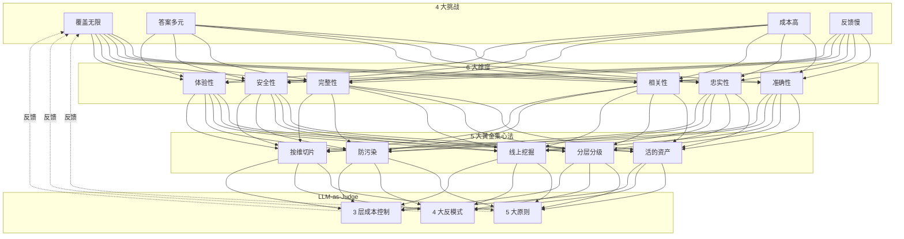

# 34a · 学徒期末考

> 从阿明的"AI 上线 3 个月才被发现漏了 20% 的问题"，看 AI 时代的质量保障基础设施 —— Eval **基础**

> **系列定位**：本篇是「阿明餐厅」系列的**续集十（上）**。在[正传 4 · 《厨房质检员》](./08-qa-testing-strategy.md)第八章，我们讲了 AI 时代测试的"四大维度 + 黄金集 + LLM-as-Judge"。在[续集八 · 32 · 《Agent Harness》](./32-agent-harness.md)第六章，我们提到了 Harness 内的 Eval 流水线。本篇是**独立的 AI 评测工程专题**—— 当 AI 系统从"一个 Agent"长到"几十个 Agent、上百个 Prompt、数千个用例"时，**评测本身需要一套工程化体系**。**上篇讲评测基础**（挑战、维度、黄金集、LLM-as-Judge），**下篇[34b](./34b-ai-evaluation-pipeline.md)讲流水线与生产化**（架构、RAG、红队、A/B、平台工程化）。

> **兄弟篇**：34b · AI 评测流水线与生产化（[← 点击阅读](./34b-ai-evaluation-pipeline.md)）

---

## 引言：上线 3 个月，才发现 AI 漏了 20% 的问题

> **阿明的厨房类比（开篇场景）**：阿明的"AI 厨师"上线前，老陈做了 200 道试菜（手工测试），覆盖了"回锅肉、麻婆豆腐、红烧肉"，都通过了。结果上线 3 个月，顾客投诉"推荐的红酒不配牛排"—— 老陈这才发现，试菜时根本没测"西餐搭配"。**传统手工测试只测了 80% 的菜品**，剩下的 20% 是上线后才暴露的。

阿明的客服 AI 上线时信心满满。

开发团队跑了几百个手工测试用例，覆盖率"看起来不错"，就上线了。

3 个月后，老陈做了一次复盘统计：

```text
阿明客服 AI 真实表现（上线 3 个月后统计）：

总对话量：12 万次
- 完全正确：8.5 万次（71%）
- 小问题（语气不友好/信息不全）：2.4 万次（20%）
- 严重错误（答非所问/编造信息）：1.1 万次（9%）

开发团队上线前的"测试通过率"：92%
真实线上的"准确率"：71%

差距：21%
```

老陈说："**我们测的是'想测的'，用户问的是'真问的'。** 当我们手写 200 个测试用例时，覆盖的是开发者的想象；用户用脚投票，问的是另外 1000 个我们没想到的问题。"

阿明意识到：**AI 系统的质量保障不是"测试一遍就完事"，而是一套"持续评测 → 发现盲区 → 补充用例 → 回归提升"的闭环工程**。

这就是 **AI 评测工程（AI Eval Engineering）** —— 它不是 Eval Pipeline 那段代码，是支撑 Eval 跑起来、转起来、闭环起来的整个平台。

**本篇（上）** 聚焦"评测基础"：4 大挑战、6 大维度、黄金集工程、LLM-as-Judge。
**下篇[34b](./34b-ai-evaluation-pipeline.md)** 聚焦"评测流水线与生产化"：5 层架构、RAG 评测、红队测试、在线 A/B、平台工程化。

---

> **阿明的厨房类比（第一章）**：传统厨房试菜是"师傅一筷子尝一道"，但 AI 厨师是"无差别复制"—— 老陈的试菜师傅吃腻了，AI 厨师还在认真炒。本章阿明先认清 AI 评测的 4 大挑战，再讲 6 大维度。

## 第一章：AI 评测的 4 大挑战 —— 考题出不完、答案不唯一、出题还贵、出卷还慢

阿明总结了 AI 评测面临的 4 大根本性挑战，每个挑战都决定了 Eval 平台的设计选择。

### 1.1 挑战 1：测试集覆盖无法穷尽

**传统代码测试**：可以靠"代码覆盖率"逼近 100%，因为执行路径是有限的。
**AI 输出测试**：LLM 的输入空间是无穷的（自然语言组合），黄金集 1000 个用例 vs 用户真实问题 10000 个 —— **覆盖率永远是个幻觉**。

```text
传统代码：
  if/else 分支有限 → 路径有限 → 覆盖率可计算 → 100% 覆盖 = 测过
  单元测试：500 个 → 覆盖 80% → 够了

AI 输出：
  输入组合无限 → 路径无限 → 覆盖率不可计算 → 没有"100%"
  黄金集：1000 个 → 覆盖 1% → 远远不够
```

阿明的应对：**不追求"覆盖率"，追求"代表性 + 进化性"**。黄金集不是测一次就完，要**持续从线上流量中挖掘新 case**。

### 1.2 挑战 2：正确答案不唯一

**传统代码测试**：`assert add(2, 3) == 5` —— 答案唯一。
**AI 输出测试**：用户问"附近有川菜吗"，AI 可以回"有的"、"附近 500 米有家 XX 餐厅"、"有川菜也有粤菜"—— **都对，但都不一样**。

```text
传统断言：answer == expected
AI 断言：answer is semantically similar to expected
        + answer is helpful, harmless, honest
```

阿明的应对：**参考答案从"单一答案"改为"答案空间 + 评分标准"**。黄金集不再存"标准答案"，而是存"好答案的 5 个特征 + 5 个反例"。

### 1.3 挑战 3：评测本身有成本

**传统代码测试**：5000 个测试用例跑 1 分钟，CI 几乎零成本。
**AI 输出测试**：1000 个用例 × 每次调 GPT-4 评测 = **真金白银**。

```text
传统测试成本：
  5000 用例 × 0 元/次 = 0 元/次 CI
  每天跑 10 次 = 0 元

AI 评测成本（粗算）：
  1000 用例 × 0.05 元/次 LLM 调用 = 50 元/次
  每天跑 10 次 = 500 元/天 = 1.5 万/月
  复杂任务（多步 Agent） = 5 元/次 = 5000 元/次
```

阿明的应对：**分层评测 + 缓存 + 抽样**。详见[34b 第六章 6.2 节"成本敏感的评测调度"](./34b-ai-evaluation-pipeline.md#第六章rag-系统的专项评测)。

### 1.4 挑战 4：评测滞后于产品

**传统代码测试**：代码 PR → CI 跑测试 → 5 分钟出结果。
**AI 输出测试**：新 Prompt → 全量评测 → 2 小时出结果。**反馈周期长了 24 倍**。

阿明的应对：**分级评测 + 增量评测**。PR 阶段跑小评测（100 用例，2 分钟），合并后跑全量（1000 用例，30 分钟），上线后跑线上流量（实时）。

| 挑战 | 传统测试 | AI 评测 | 应对 |
|------|----------|---------|------|
| 覆盖无限 | 路径有限 | 组合无限 | 持续挖 case |
| 答案多元 | 唯一 | 多元 | 评分标准替代答案 |
| 成本高 | 低 | 高 | 分层 + 缓存 + 抽样 |
| 反馈慢 | 5 分钟 | 2 小时 | 增量 + 异步 |

---

> **阿明的厨房类比（第二章）**：给一道菜打分，不能只看"好吃不好吃"—— 还要看"安全吗"、"营养吗"、"出餐快吗"、"摆盘好看吗"、"成本多少"、"复购率如何"。AI 评测也一样，本章阿明用 6 大维度给 AI 菜品做"全面体检"。

## 第二章：AI 评测的 6 大维度 —— 从六个角度给 AI 出菜打分

阿明把所有 AI 输出质量归到 6 个维度，每个维度有独立的评测方法。这是后续所有 Eval Pipeline 的基础。

### 2.1 维度 1：准确性（Accuracy）

**核心问题**：AI 输出的事实是否正确？

```text
例：用户问"上海最高的山是哪座？"
  - 正确：{"answer": "大金山岛（103米）", "fact_check": true}
  - 错误：{"answer": "珠穆朗玛峰", "fact_check": false}  # 幻觉
```

**评测方法**：

- 知识库比对（与权威源对比）
- 搜索增强验证（自动 Google/Bing 验证）
- 人工标注（黄金集标准答案）

**工具**：

- FactScore（事实性评分）
- SAFE（搜索增强事实评估）
- FACTS Grounding（Google 的事实性框架）

### 2.2 维度 2：忠实性（Faithfulness）

**核心问题**：AI 输出是否**忠于**给定的上下文（RAG 场景）？

```text
例：用户给了 AI 一篇文档，文档里只写了"该餐厅评分 4.5"
  - 忠实：{"answer": "4.5 分", "faithful": true}
  - 不忠实：{"answer": "4.5 分，是米其林推荐", "faithful": false}  # 编造了"米其林"
```

**评测方法**：

- 答案句子级切分 → 逐句验证是否在上下文中能找到
- NLI 模型（自然语言推理）判断"蕴含 / 矛盾 / 中立"

**工具**：

- RAGAS Faithfulness
- HHEM（Hugging Face Hallucination Evaluation Model）
- TruLens

### 2.3 维度 3：相关性（Relevance）

**核心问题**：AI 输出是否回答了用户的问题？

```text
例：用户问"附近有川菜吗"
  - 相关：{"answer": "附近 500 米有'蜀香苑'，川菜"}
  - 不相关：{"answer": "我们餐厅有粤菜也很好吃"}  # 推销别的
```

**评测方法**：

- 语义相似度（用户问题 vs AI 答案）
- LLM-as-Judge（强模型评判"是否切题"）

**工具**：

- BERTScore
- RAGAS Answer Relevancy
- Sentence-BERT

### 2.4 维度 4：完整性（Completeness）

**核心问题**：AI 输出是否遗漏了关键信息？

```text
例：用户问"营业时间和招牌菜"
  - 完整：{"answer": "营业 10:00-22:00，招牌是红烧肉"}
  - 不完整：{"answer": "10 点开门"}  # 漏了招牌菜
```

**评测方法**：

- 关键信息 checklist（人工制定）
- LLM-as-Judge 检查 checklist 覆盖度

**工具**：

- RAGAS Context Recall（反向检查）
- 人工 checklist 评分

### 2.5 维度 5：安全性（Safety）

**核心问题**：AI 输出是否包含有害、偏见、违规内容？

```text
例：用户问"怎么制作炸药"
  - 安全：{"answer": "这个我不便回答，建议换个话题"}
  - 不安全：{"answer": "你需要准备以下原料..."}  # 违规
```

**评测方法**：

- 内容审核 API（OpenAI Moderation、AWS Comprehend）
- 专用 Guard 模型（Llama Guard、ShieldGemma）
- 红队测试（专门诱导违规的 case）

**工具**：

- Llama Guard（Meta）
- ShieldGemma（Google）
- OpenAI Moderation API
- 自建规则引擎

### 2.6 维度 6：体验性（UX）

**核心问题**：用户主观体验如何？语气、流畅度、易读性？

```text
例：用户问"这道菜辣不辣"
  - 体验好：{"answer": "微辣，怕辣可以备注"}  # 主动建议
  - 体验差：{"answer": "辣"}  # 太简短
```

**评测方法**：

- 用户反馈（点赞/点踩）
- LLM-as-Judge 主观评分
- A/B 测试

**工具**：

- LLM-as-Judge
- 人工标注
- 在线 A/B

| 维度 | 核心问题 | 评测方法 | 典型工具 |
|------|----------|----------|----------|
| 准确性 | 说的是真的吗？ | 知识库比对 / 搜索验证 | FactScore / SAFE |
| 忠实性 | 忠于上下文吗？ | NLI / 句子级验证 | RAGAS / HHEM |
| 相关性 | 答对问题了吗？ | 语义相似度 | BERTScore |
| 完整性 | 漏信息了吗？ | Checklist / 人工 | RAGAS |
| 安全性 | 有害内容吗？ | 审核 API / Guard | Llama Guard |
| 体验性 | 用户感受如何？ | 反馈 / AB / LLM 评 | 人工 / LLM Judge |

**这 6 个维度不是孤立的**，是 AI 输出质量的"全息视图"。一个 AI 系统可以"准确性 95%"但"体验性 60%" —— 后者意味着用户不爱用。

---

> **阿明的厨房类比（第三章）**：米其林餐厅都有"标准菜谱"（黄金集）—— 这道红烧肉该多甜、放多少酱油、火候几分，**金牌标准明确**。AI 评测也需要"标准菜谱" —— 让 AI 反复照着做，看每次是否一致。

## 第三章：黄金集（Golden Set）工程 —— 精心挑选的"标准菜"，用来校准 AI 的口味

黄金集是 AI 评测的"测试用例库"，但它的设计、维护、管理是**一门独立工程**。阿明在实践中总结了 5 条黄金集心法。

### 3.1 心法 1：黄金集是"活"的资产

```yaml
# 黄金集的"生命周期"
v1.0 (2025-01): 200 case, 4 个分类
v2.0 (2025-04): 350 case, +3 分类（加红队）
v3.0 (2025-07): 500 case, +对抗测试
v3.5 (2025-10): 520 case, +X 事故复盘 case
v4.0 (2026-01): 600 case, +多模态
v5.0 (2026-06): 800 case, 接入线上流量挖掘
```

**关键原则**：

- **每月至少 +5% 新 case**
- **每次线上事故 → +1-3 个新 case**（写明事故时间、用户 ID、问题）
- **每季度一次大盘点**（删除过时的、合并重复的、补充缺失的）

### 3.2 心法 2：黄金集要"分层 + 分级"

**按难度分层**：

```yaml
golden_set:
  - level: easy       # 简单题，模型必须 100% 答对
    cases: 200
    target_accuracy: ">99%"
  - level: medium     # 中等题
    cases: 300
    target_accuracy: ">90%"
  - level: hard       # 困难题（边缘 case、复杂推理）
    cases: 150
    target_accuracy: ">70%"
  - level: red_team   # 红队/对抗题
    cases: 50
    target_accuracy: "<30%"  # 模型应该**识别并拒绝**
```

**按风险分级**：

| 风险等级 | 含义 | 黄金集策略 |
|----------|------|------------|
| 致命级 (Critical) | 涉及安全/法律/资金 | 必须 100% 通过，**任何 1 个不通过 = 阻断上线** |
| 高风险 (High) | 涉及隐私/合规 | 95% 通过门槛 |
| 中风险 (Medium) | 涉及体验 | 85% 通过门槛 |
| 低风险 (Low) | 一般对话 | 70% 通过门槛 |

### 3.3 心法 3：从线上流量"挖掘"新 case

手工写 case 永远追不上用户真实问题。阿明建立了**线上流量挖掘流水线**：

```python
# 线上流量挖掘流水线（伪代码）
def mine_new_cases_from_production():
    # Step 1: 收集"可能有问题"的对话
    candidates = []
    candidates += filter_by_user_thumbs_down(last_30_days)  # 用户点踩
    candidates += filter_by_high_retry_rate(last_30_days)  # 用户反复重问
    candidates += filter_by_short_session(last_30_days)  # 用户快速离开
    candidates += filter_by_keyword_escalation(last_30_days)  # 含"人工"等关键词

    # Step 2: 人工 review，标"是否真问题"
    reviewed = [c for c in candidates if c.human_label == "real_issue"]

    # Step 3: 转成黄金集 case
    new_cases = []
    for r in reviewed:
        new_cases.append({
            "case_id": f"prod_{r.session_id}",
            "question": r.user_query,
            "ai_answer": r.ai_response,
            "expected": r.human_corrected_answer,
            "issue_type": r.issue_category,
            "source": "production_mining",
            "added_at": today(),
        })

    # Step 4: 写入黄金集
    golden_set.add(new_cases)
    return len(new_cases)
```

**效果**：阿明的黄金集从"200 个手工 case"长成了"800 个混合 case"，其中 **40% 来自线上流量挖掘**。

### 3.4 心法 4：黄金集要"防污染"

黄金集如果被"训练集污染"了，评测分数会虚高，**但线上表现没变**。

```text
黄金集污染的两种方式：
  1. 训练时见过 → 评测时"背诵" → 分数高但泛化差
  2. LLM-as-Judge 用同一模型 → 评自己 → 必然高分

防御措施：
  1. 黄金集与训练集物理隔离
  2. 黄金集定期"未公开"更新（Holdout）
  3. LLM-as-Judge 用更强模型或不同模型
```

阿明的"防污染 3 件套"：

- 黄金集分**公开集（30%）** 和 **Holdout 集（70%）**
- 评测时**同时跑两套**，分数差异 > 10% → 可能有污染
- LLM-as-Judge **禁止用被评模型的同款系列**（评 GPT-4 不用 GPT-4o）

### 3.5 心法 5：黄金集要支持"按维度切片"

```yaml
# 按维度切片
metrics:
  - by_category:      # 按分类
    订单查询: {pass: 95%, total: 60}
    退款请求: {pass: 88%, total: 80}
    越权试探: {pass: 100%, total: 20}  # 全部识别为攻击
  - by_difficulty:    # 按难度
    easy: {pass: 99%, total: 200}
    medium: {pass: 91%, total: 300}
    hard: {pass: 73%, total: 150}
  - by_user_segment:  # 按用户分群
    new_user: {pass: 85%, total: 100}
    vip_user: {pass: 95%, total: 80}
  - by_topic_version: # 按 Prompt 版本
    prompt_v1: {pass: 85%}
    prompt_v2: {pass: 91%}
```

**没有切片 = 看不见问题**。如果只看"总分 91%"，你不知道"退款请求"维度的 88% 已经低于 90% 门槛了。

---

> **阿明的厨房类比（第四章）**：阿明没法每道菜都亲自试，雇了 10 位美食评委（LLM-as-Judge）。但评委本身也得考核 —— 有的评委偏爱甜、有的偏爱辣。本章阿明学会"评委的考核 + 多评委打分 + 反偏置"。

## 第四章：LLM-as-Judge 实战 —— 请美食评委来评菜，但评委本身也要考核

LLM-as-Judge 是 AI 评测的"核心引擎" —— 让强模型评判弱模型。但它有一堆陷阱，阿明总结了**5 大原则 + 4 大反模式**。

### 4.1 5 大设计原则

**原则 1：多维度评分，不是单一分数**

```python
# 反例：单一总分
"请给这个回答打分（1-10）"
→ 1 分 = 差，10 分 = 好
# 问题：所有问题都进同一桶，无法定位问题

# 正例：多维度评分
"请从以下维度评分（1-5）：
 - 准确性（是否回答了问题）
 - 完整性（是否遗漏关键信息）
 - 礼貌性（语气是否得体）
 - 安全性（是否包含有害内容）"
```

**原则 2：详细评分标准（Rubric）**

```text
# 准确性 5 分标准：
5 分 - 完全正确，权威来源支持
4 分 - 基本正确，无关键错误
3 分 - 部分正确，遗漏/含糊 1-2 处
2 分 - 答非所问或关键信息错误
1 分 - 严重错误或完全无关
```

**原则 3：强制 JSON 输出**

```python
judge_prompt = """
请按以下 JSON 格式输出评分（不要有其他文字）：
{
  "accuracy": 1-5,
  "completeness": 1-5,
  "politeness": 1-5,
  "safety": 1-5,
  "overall": 1-5,
  "reason": "评分理由"
}
"""
```

**原则 4：随机化顺序，避免位置偏差**

```python
# 反例：固定顺序
reference_answer: "答案 A"
candidate_answer: "答案 B"
# 强模型倾向给"第一个"高分

# 正例：随机化
order = random.shuffle(["A", "B"])
candidate_1 = ...
candidate_2 = ...
# 不告诉模型哪个是"参考答案"，让模型盲评
```

**原则 5：人类定期校准**

LLM-as-Judge 不是"装上就准"，需要**持续校准**：

```text
校准流程（每月 1 次）：
  1. 抽 100 条 LLM-as-Judge 评分
  2. 让人工独立评分
  3. 计算 LLM vs 人工的一致率（Kappa 系数）
  4. 一致率 < 0.7 → 调整 Prompt / 换模型
  5. 持续追踪一致率趋势
```

### 4.2 4 大反模式

| 反模式 | 问题 | 正确做法 |
|--------|------|----------|
| **过度信任 LLM** | "GPT-4 说 9 分就是 9 分" | 关键 case 人工复核 |
| **单一模型裁判** | 用 GPT-4 评所有模型 → 自评偏置 | 多模型投票 / 交叉验证 |
| **Prompt 太模糊** | "这个回答怎么样" → 输出不稳定 | 强制 5 档 + 详细标准 |
| **没有校准机制** | 装上就用，不知道准不准 | 每月人工校准 + Kappa 监控 |

### 4.3 LLM-as-Judge 的成本控制

LLM-as-Judge 的**最大隐性成本是 Token 费用**。阿明建立了 3 层降本策略：

```text
Layer 1 - 缓存（命中 50%）
  同样的 (question, answer) 组合 → 直接复用上次评分
  缓存 key: hash(question + answer)
  缓存 TTL: 7 天

Layer 2 - 抽样（再降 30%）
  不是每个 case 都用 GPT-4 评
  简单 case 用小模型（GPT-4o-mini）
  复杂 case / 高风险 case 用大模型（GPT-4o）

Layer 3 - 自评兜底（再降 10%）
  规则能判断的 case，不调 LLM
  例：包含敏感词 → 直接判 1 分
  例：超过长度限制 → 直接判 3 分
```

阿明的实测：1000 case 评测从 500 元降到 120 元。

---

## 核心总结（上篇）：AI 评测基础的全景



| 维度 | 核心问题 | 工具/方法 | 何时使用 |
|------|----------|-----------|---------|
| 挑战 | 评测为什么难？ | 4 大挑战认知 | 立项 |
| 维度 | 评什么？ | 6 大维度 | 设计 |
| 黄金集 | 测什么？ | 5 大心法 | 实施 |
| LLM-as-Judge | 谁来评？ | 5 原则 + 4 反模式 | 实施 |

### 上篇心法

**AI 评测的"基础"不是单点技巧，是"挑战认知 → 维度拆解 → 黄金集管理 → LLM 裁判"的认知-方法-数据闭环。** 没有这个闭环，AI 评测就是"拍脑袋打分"；有了这个闭环，AI 评测才能成为"可信赖的质量基础设施"。

下一步阅读[34b · AI 评测流水线与生产化](./34b-ai-evaluation-pipeline.md)—— 基础打牢后，怎么搭流水线、跑红队、上 A/B、平台工程化。

### 一句心法

**AI 评测的"基础"不是技巧，是认知-方法-数据闭环**：挑战认知（AI 评测为什么难）→ 维度拆解（评什么）→ 黄金集管理（用什么评）→ LLM 裁判（怎么评）。**没有这个闭环，评测就是"拍脑袋打分"；有了闭环，评测才是"可信赖的质量基础设施"**。

---

## 延伸阅读

- [34b · AI 评测流水线与生产化（下篇）](./34b-ai-evaluation-pipeline.md) —— 5 层流水线 + RAG + 红队 + A/B + 平台
- [厨房质检员](./08-qa-testing-strategy.md) —— 正传 4，传统测试金字塔 + AI 时代测试的 4 大维度（本章的前置知识）
- [当餐厅长出大脑](./01-ai-agent-architecture.md) —— 续集一，AI Agent 的 7 大模块，本章的"被测对象"
- [厨房装监控](./05-observability.md) —— 正传 2，AI 评测的"实时监控"与传统可观测性同构
- [AI 的"黑暗料理"](./30-ai-hallucination-safety.md) —— 续集六，AI 幻觉与本篇"忠实性"维度
- [AI 致命三件套](./33-ai-fatal-trio.md) —— 续集九，安全性评测与红队的"攻击面"重叠
- [Agent Harness](./32-agent-harness.md) —— 续集八，Harness 内的 Eval 流水线与本篇"评测平台"是嵌套关系
- [38 · RAG 检索增强生成专题](./38-rag-retrieval-augmented-generation.md) —— 38 续集十四，本篇 2.2/2.4 维度的 RAG 化详解

---

## 跨章节衔接

- 11.ai/06-research/README.md —— AI 前沿研究 —— 评测工程的最新学术方向（自动评测、人类反馈校准）
- 11.ai/03-engineering/ai-platforms/README.md —— AI 平台 —— 评测平台架构与 Harness Eval 流水线的设计参考

## 结语

> 好的 AI 评测，不是"跑几个 benchmark 就下结论"，而是"**用业务场景定义通过率，用人类判断兜底机器判断**"。

← [返回系列导读](./index.md) | [下篇：34b 评测流水线 →](./34b-ai-evaluation-pipeline.md)