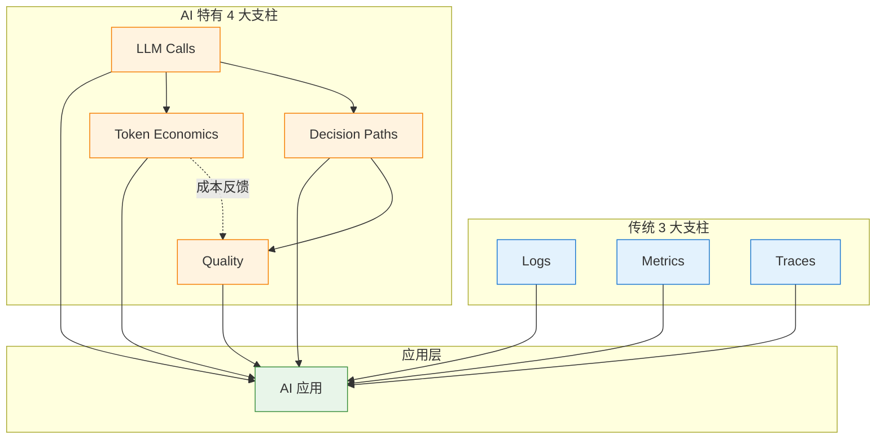
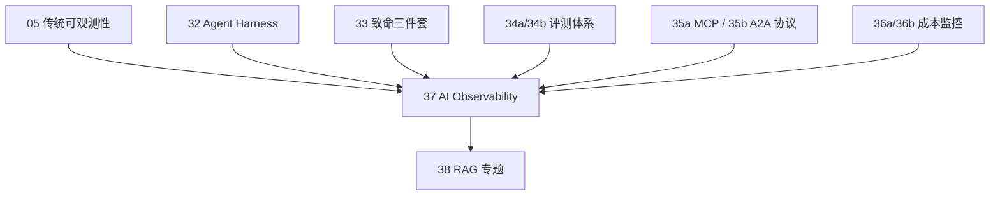

# 37 · 厨房暗哨

> 从阿明的"AI 出问题不知道哪出问题"，看 AI 时代的可观测性 —— **AI Observability 4 大支柱 + 5 大工具栈 + 7 大实战模式**

> **系列定位**：本篇是「阿明餐厅」系列的**续集十三**。在[正传 2 · 《厨房装监控》](./05-observability.md)中，我们讲了传统 3 大支柱（Logs / Metrics / Traces）+ RED/USE 方法。在[续集八 · 《Agent Harness》](./32-agent-harness.md)第六章，我们提过 Harness 内嵌的 trace。但 2026 年的 AI 系统比传统系统**多 3 层"看不到的"**：LLM 调用 / Token 消耗 / AI 决策路径。本篇专门讲 **AI 时代可观测性（AI Observability / LLMOps）** —— 怎么在传统可观测性基础上，加 AI 特有的"3 层观测"：**LLM 观测 / Token 观测 / 决策路径观测**。

---

## 引言：AI 出问题，不知道哪出问题

> **阿明的厨房类比（开篇场景）**：传统厨房出问题，阿明知道查什么 —— 看灶台温度（监控）、查食材新鲜度（日志）、查厨师操作（追踪）。但 AI 厨房出问题？阿明一脸懵 —— 顾客说"菜不对"，老陈问"哪里不对"，阿明说"我不知道是 AI 看错菜谱了、还是炒糊了、还是忘了放盐"。传统 3 大支柱（温度计/食材表/操作录像）不够用，本章阿明要给 AI 厨房装**新一代"暗哨"**。

2026 年 6 月，阿明的客服 AI 又出问题了。

用户反馈："AI 给我的回答牛头不对马嘴。"

老陈开始排查：

```text
传统排查路径（针对 Web 服务）：
  1. 看监控 → 哪个服务延迟高？
  2. 看日志 → 哪个请求报错？
  3. 看 Trace → 哪个调用链慢？
  4. 定位 → 找到 Bug → 修复

AI 系统排查路径：
  1. 看监控 → 延迟正常 ✓
  2. 看日志 → 没有报错 ✓
  3. 看 Trace → 调用链完整 ✓
  4. ??? → AI 输出错了，但所有"指标"都正常
  
  → 传统可观测性对 AI 系统失灵了
```

老陈意识到：**AI 系统的"问题"往往不在"调用层"（没报错、不慢），而在"语义层"（答非所问、幻觉、偏见）**。传统可观测性看不到"语义问题"。

这就是 **AI 时代可观测性（AI Observability）** 的意义：**给传统可观测性加 3 层"AI 特有的观测"**。

---

> **阿明的厨房类比（第一章）**：传统厨房监控 3 件套 —— 温度计（CPU/Memory）、食材表（Database）、操作录像（Trace）。AI 厨房要再加 4 件套 —— 顾客点评（LLM Output）、调料用量（Token）、厨师决定（Decision）、菜的味道评分（Quality）。这 7 件套就是 AI 时代的 7 大可观测性支柱。

## 第一章：AI 时代的 7 大可观测性支柱 —— 温度计不够用，还得看油耗、尝味道、追菜路

### 1.1 传统 3 大支柱（依然必要）

```text
支柱 1 - Logs（日志）
  作用：记录"发生了什么"
  工具：ELK / Loki / Splunk
  AI 时代变化：需要记录"AI 输入 + 输出 + Prompt + 工具调用"

支柱 2 - Metrics（指标）
  作用：聚合"系统状态"
  工具：Prometheus / Grafana / Datadog
  AI 时代变化：需要加"AI 特有指标"（见 1.3）

支柱 3 - Traces（追踪）
  作用：还原"调用链路"
  工具：Jaeger / Tempo / Zipkin / OpenTelemetry
  AI 时代变化：需要追踪"AI 决策路径"（见 1.4）
```

### 1.2 AI 特有 4 大支柱（新增）

```text
支柱 4 - LLM Calls（LLM 调用）
  作用：记录"每次 LLM 调用的输入 / 输出 / 延迟 / 错误"
  工具：LangSmith / Helicone / Arize Phoenix
  关键数据：prompt / completion / model / token_count / latency / cost

支柱 5 - Token Economics（Token 经济）
  作用：记录"每个场景 / 用户 / Prompt 的 Token 消耗和成本"
  工具：Helicone / Portkey / Langfuse + 36a/36b 成本监控
  关键数据：input_tokens / output_tokens / cost / cost_per_user / cost_per_scenario

支柱 6 - Decision Paths（决策路径）
  作用：还原"AI 是怎么得出这个答案的"
  工具：LangGraph / LangSmith / Arize Phoenix
  关键数据：agent_steps / tool_calls / branching / sub_agent_invocation

支柱 7 - Quality（决策质量）
  作用：评估"AI 输出是否好"
  工具：RAGAS / DeepEval / 自建评测 + 34a/34b 评测体系
  关键数据：accuracy / faithfulness / relevance / safety / ux
```

### 1.3 7 大支柱关系图



### 1.4 AI 系统出问题时，看哪一层？

| 问题现象 | 看哪一层 | 工具 |
|---------|---------|------|
| **AI 答非所问** | Quality（决策质量）| RAGAS / 人工评测 |
| **AI 输出慢** | LLM Calls + Traces | LangSmith / Jaeger |
| **AI 月账单爆** | Token Economics | Helicone / Portkey |
| **AI 不知道调哪个工具** | Decision Paths | LangGraph Studio |
| **AI 输出敏感信息** | Quality (Safety) + Logs | Llama Guard + ELK |
| **Agent 死循环** | Decision Paths | LangSmith / Arize |

---

> **阿明的厨房类比（第二章）**：阿明要给 80 家分店装监控 —— 是用国产（Langfuse / Phoenix）还是进口（LangSmith / Arize）？自己装（OSS）还是托管（SaaS）？本章阿明对比 5 大厨房监控品牌，帮你挑出最适合自家场景的。

## 第二章：AI 可观测性工具栈 5 大选型 —— 厨房监控装几套？挑牌子看场景

### 2.1 主流工具对比

| 工具 | 形态 | 强项 | 弱项 | 适合 |
|------|------|------|------|------|
| **LangSmith** | SaaS + 自部署 | LangChain 生态集成最深 | 锁定 LangChain | 用 LangChain / LangGraph 的团队 |
| **Helicone** | SaaS + OSS | LLM 专用 + 成本监控 | 决策路径较弱 | 关注成本 + 多 LLM 路由 |
| **Arize Phoenix** | OSS | 开源 + 可视化好 | 部署略复杂 | 自建 + 偏研究 |
| **Langfuse** | OSS | 开源 + 功能全面 | UI 略简陋 | 自建 + 完整 LLMOps |
| **Portkey** | SaaS | 多模型路由 + 监控 | AI 决策路径弱 | 多模型混合 |

### 2.2 自建 vs 第三方决策树

```text
Q1: 你是 LangChain / LangGraph 生态？
├── 是 → 优先 LangSmith
└── 否 → 继续

Q2: 关注成本？多 LLM 路由？
├── 是 → Helicone / Portkey
└── 否 → 继续

Q3: 数据敏感 / 必须私有化？
├── 是 → Arize Phoenix / Langfuse（OSS）
└── 否 → 第三方 SaaS 都行

Q4: 团队规模？
├── < 5 人 → 用 SaaS（开箱即用）
└── > 20 人 → 自建 + 自研集成
```

### 2.3 阿明的工具栈选型

```text
小型项目（< 5 AI 应用）：
  - LangSmith（开发）+ Helicone（成本）

中型项目（5-20 AI 应用）：
  - Langfuse（自建）+ 36a/36b 成本监控 + 34a/34b 评测体系

大型项目（> 20 AI 应用）：
  - 自建 AI Observability 平台
  - 整合 Langfuse + OpenTelemetry + Prometheus + Grafana
  - 与 32 Agent Harness 深度集成
```

---

> **阿明的厨房类比（第三章）**：监控仪表盘装好了，但"AI 出问题"时怎么办？阿明总结了 7 种"厨房排障术"：从"看顾客点评差在哪"到"回放 AI 烹饪过程"，每种问题都有对应套路。

## 第三章：AI Observability 7 大实战模式 —— 从盯屏幕到回放录像，七种排障术

### 3.1 模式 1：完整 Trace + Span 体系

```python
# LangSmith 自动 trace
from langsmith import traceable
from langchain_openai import ChatOpenAI

@traceable(name="customer_service_agent")
def handle_customer_query(query: str, user_id: str):
    # LangSmith 自动记录每次调用
    llm = ChatOpenAI(model="gpt-4o")
    response = llm.invoke(query)
    return response.content

# 运行后，LangSmith 自动生成：
# - 调用链（每一步的输入 / 输出 / 延迟）
# - Token 消耗
# - 错误日志
# - Prompt 版本
```

### 3.2 模式 2：Token 成本归因

```python
# Helicone 自动成本监控
from openai import OpenAI

client = OpenAI(
    api_key="...",
    base_url="https://oai.helicone.ai/v1",
    default_headers={
        "Helicone-Property-User-Id": user_id,
        "Helicone-Property-Scenario": "customer_service",
        "Helicone-Property-Prompt-Version": "v2.3",
    }
)

response = client.chat.completions.create(...)

# Helicone 自动归因：
# - 每个用户的成本
# - 每个场景的成本
# - 每个 Prompt 版本的 ROI
```

### 3.3 模式 3：Agent 决策路径回放

```python
# LangGraph Studio 可视化
from langgraph.graph import StateGraph

# 定义 Agent 图
workflow = StateGraph(AgentState)
workflow.add_node("classify", classify_intent)
workflow.add_node("search", search_kb)
workflow.add_node("respond", generate_response)
workflow.add_edge("classify", "search")
workflow.add_edge("search", "respond")

app = workflow.compile()

# LangGraph Studio 自动：
# - 可视化 Agent 决策路径
# - 回放每一步的输入输出
# - 显示每个 branch 的触发条件
# - Time Travel：回到任意步骤修改
```

### 3.4 模式 4：决策质量监控（在线 + 离线）

```python
# 在线质量监控（实时）
@observe(name="quality_monitor")
async def monitor_response_quality(response: str, user_id: str):
    # 1. 规则检查
    if contains_sensitive_info(response):
        await alert_security(response, user_id)

    # 2. LLM-as-Judge（异步）
    asyncio.create_task(llm_judge_quality(response))

    # 3. 反馈收集
    asyncio.create_task(collect_user_feedback(user_id, response))

# 离线质量评测（34a/34b 体系）
# RAGAS / DeepEval / 自建黄金集
```

### 3.5 模式 5：异常检测 + 自动告警

```python
# 异常检测规则
alerts:
  - name: "AI 输出长度异常"
    condition: response_length > p99 OR response_length < p1
    action: notify_team + freeze_prompt_version

  - name: "Token 消耗异常"
    condition: hourly_cost > 10 * average
    action: auto_throttle + notify_finops

  - name: "AI 决策路径异常"
    condition: agent_steps > 10 OR loop_detected
    action: kill_agent + log_incident

  - name: "Quality 分数下降"
    condition: hourly_quality_score < 0.7
    action: rollback_prompt + alert_engineering
```

### 3.6 模式 6：与 34a/34b 评测体系打通

```text
可观测性 → 评测数据流：

LangSmith / Helicone
  ↓ (采集所有 AI 调用)
评测平台（34a/34b）
  ↓ (离线黄金集 + 在线采样)
质量仪表盘
  ↓ (实时分数 + 趋势)
告警 + 自动回写黄金集
```

### 3.7 模式 7：与 36a/36b 成本监控打通

```text
可观测性 → 成本归因流：

Helicone / LangSmith
  ↓ (Token 消耗 + 调用次数)
36a/36b 成本监控
  ↓ (按用户 / 场景 / 模型归因)
Showback / Chargeback 报表
  ↓ (推送给业务 + FinOps)
成本优化决策
```

---

> **阿明的厨房类比（第四章）**：80 家分店用 5 种不同品牌的监控仪表，数据格式不统一，总部看不到全局。本章阿明强制要求 —— "所有仪表说同一种话"（OpenTelemetry 标准）—— 像餐饮业 ISO 标准一样，所有厨房都遵守。

## 第四章：OpenTelemetry + LLM 扩展（标准化的未来） —— 监控接口统一，所有仪表说同一种话

### 4.1 OpenLLMetry 是什么？

```text
OpenLLMetry = OpenTelemetry 的 LLM 扩展
  - 由 Traceloop 主导
  - 已被 OpenTelemetry 官方接受为 SIG
  - 为 LLM 调用提供标准化的 span / attribute
  
优势：
  - 不绑定任何厂商
  - 与现有 OTel 体系打通
  - 数据可导出到任何 OTel-compatible 后端（Jaeger / Tempo / Datadog）
```

### 4.2 OpenLLMetry 的核心 Span

```python
from opentelemetry.instrumentation.openai import OpenAIInstrumentor

# 自动 instrument OpenAI 调用
OpenAIInstrumentor().instrument()

# 现在所有 OpenAI 调用都自动产生 span：
# - llm.completion
#   - gen_ai.system = "openai"
#   - gen_ai.request.model = "gpt-4o"
#   - gen_ai.usage.input_tokens = 100
#   - gen_ai.usage.output_tokens = 200
#   - gen_ai.response.finish_reason = "stop"
```

### 4.3 与传统 OTel 体系打通

```text
Web 请求 OTel Trace
  → REST API (span)
    → LLM Call (llm.completion span, OpenLLMetry 自动注入)
      → Tool Call (function_call span)
        → Database Query (db.query span)

完整调用链：
  用户请求 → API → LLM 推理 → 工具调用 → DB 查询
  每一步的延迟 / 错误 / Token / 决策路径都在一个 Trace 里
```

---

> **阿明的厨房类比（第五章）**：监控装好了，谁盯屏幕？阿明从"一个人兼 5 职"升级到"L1 看门 → L2 排查 → L3 专家 → L4 架构 → L5 顾问"5 级团队。本章阿明学会"监控不是一个人的事，是一支队伍的事"。

## 第五章：AI Observability 团队配置 —— 谁盯屏幕谁尝汤，从 L1 干到 L5

### 5.1 团队角色

| 角色 | 人数 | 职责 |
|------|------|------|
| **LLMOps 工程师** | 1-2 | AI 可观测性平台搭建、LangSmith/Helicone 集成 |
| **数据工程师** | 1 | Trace 数据存储、查询优化 |
| **平台工程师** | 1-2 | 与现有 Prometheus / Grafana / OTel 打通 |
| **AI 评测专家** | 1 | 与 34a/34b 评测体系对接（兼职）|
| **SRE** | 1 | 告警 + OnCall（兼职）|

### 5.2 成熟度模型

| 等级 | 名称 | 特征 |
|------|------|------|
| L1 | 基础日志 | 只有 Logs（ELK），看不到 AI 决策 |
| L2 | LLM Trace | 接入 LangSmith/Helicone，能看到每次 LLM 调用 |
| L3 | Token 监控 | 接入 36a/36b，能看到成本归因 |
| L4 | 决策回放 | 接入 LangGraph / Arize，能回放 Agent 决策路径 |
| L5 | 智能可观测 | AI 自己发现异常、自动告警、自动回写黄金集 |

阿明现在在 **L3 → L4**：Token 监控稳定，正在做"决策路径回放"。

---

## 第六章：与 12.story 其他篇章的协同 —— 监控中枢串起整个餐厅

### 6.1 AI Observability 在 12.story 中的位置



### 6.2 关键协同点

| 协同 | 说明 |
|------|------|
| **37 + 05** | 37 是 05 的"AI 时代扩展"，不是替代 |
| **37 + 32** | 32 Agent Harness 内的 trace 由 37 提供基础设施 |
| **37 + 33** | 37 的 Quality 监控捕获 33 的安全异常 |
| **37 + 34a/34b** | 37 提供 trace 数据，34a/34b 做离线评测 |
| **37 + 35a/35b** | 37 追踪 MCP / A2A 协议调用 |
| **37 + 36a/36b** | 37 是 36a/36b 成本归因的数据源 |

---

## 核心总结：AI 时代可观测性全景

| 维度 | 核心问题 | 工具 | 何时使用 |
|------|----------|------|---------|
| Logs | 发生了什么？ | ELK + AI 日志 | 排错 |
| Metrics | 系统状态？ | Prometheus + AI 指标 | 监控 |
| Traces | 调用链路？ | OTel + OpenLLMetry | 排错 |
| LLM Calls | AI 调了什么？ | LangSmith / Helicone | 排错 + 优化 |
| Token | 花了多少钱？ | 36a/36b + Helicone | FinOps |
| Decisions | AI 怎么想的？ | LangGraph Studio | 排错 + 调优 |
| Quality | 输出好不好？ | 34a/34b + 在线监控 | 质量保障 |

### 一句心法

**AI 时代可观测性 = 传统 3 大支柱 + AI 特有 4 大支柱（LLM / Token / Decision / Quality）。** 没有 AI Observability，AI 系统就是"黑盒"；有了 AI Observability，AI 才能从"差不多"走向"可观测、可调试、可优化"。

---

## 延伸阅读

- [厨房装监控](./05-observability.md) —— 正传 2，传统可观测性 3 大支柱（AI Observability 的基础）
- [Agent Harness](./32-agent-harness.md) —— 续集八，Harness 内的 trace 由 AI Observability 提供基础设施
- [AI 致命三件套](./33-ai-fatal-trio.md) —— 续集九，AI Observability 的 Quality 监控捕获安全异常
- [AI 评测工程](./34a-ai-evaluation-fundamentals.md) / [34b 评测流水线](./34b-ai-evaluation-pipeline.md) —— 续集十，AI Observability 提供 trace 数据，34a/34b 做离线评测
- [Agent 协议](./35a-mcp-protocol.md) / [35b A2A + 治理](./35b-a2a-protocol.md) —— 续集十一，AI Observability 追踪 MCP / A2A 协议调用
- [AI 成本结构](./36a-ai-token-cost-structure.md) / [36b 成本优化](./36b-ai-token-cost-optimization.md) —— 续集十二，AI Observability 是 36a/36b 成本归因的数据源
- [差评危机](./15-incident-response.md) —— 正传 9，AI Observability 是事故复盘的关键工具
- [会自我进化的厨房](./29-self-evolving-company.md) —— 续集五，AI Observability 让自进化组织的"自循环"成为可能

---

## 跨章节衔接

- 11.ai/02-technology-stack/README.md —— AI 技术栈 —— AI Observability 在 AI 技术栈中的位置
- 11.ai/03-engineering/ai-platforms/README.md —— AI 平台 —— 主流平台的 Observability 集成

---

## 结语

AI 系统的可观测性不是"传统可观测性 + 一点 AI 改造"，是**"传统 3 大支柱 + AI 特有 4 大支柱"的全新体系**。

阿明用了 3 个月建立 AI Observability 体系，效果立竿见影：

```text
建立前：
  - AI 出问题平均排查时间：4 小时
  - 月底才知道 Token 爆了
  - 不知道 AI 调了哪些工具 / 路径
  - 不知道 AI 输出质量漂移

建立后：
  - AI 出问题平均排查时间：15 分钟（16x 提速）
  - Token 实时监控 + 自动告警
  - Agent 决策路径可回放
  - Quality 漂移实时检测 + 自动回写黄金集
```

下次当你部署 AI 系统时，不妨问自己：

- 我有 **AI 调用 trace**吗？每次 LLM 调用能追溯吗？
- 我有 **Token 成本归因**吗？每个用户 / 场景花了多少？
- 我能 **回放 Agent 决策路径**吗？AI 是怎么得出答案的？
- 我有 **在线质量监控**吗？AI 输出好不好？
- 我用 **OpenLLMetry** 标准化了吗？还是绑死在某个厂商？
- 我和 **34a/34b 评测 + 36a/36b 成本**打通了吗？

> 好的 AI Observability 不是"装个 LangSmith 就完事"，而是"传统 3 + AI 4 = 7 大支柱的完整体系 + 与评测/成本/协议的深度协同"。这是 AI 时代质量保障的**新基建**。

← [返回系列导读](./index.md)