<!--
module:
  parent: story
  number: 12
  slug: story
  topic: 「阿明餐厅」技术系列
  audience: 工程师 / 架构师 / SRE / AI 工程师 / CTO / 创业者 / PM
  category: 主模块
  summary: 用开餐厅的故事讲明白 48 篇技术文章，覆盖传统工程 25 篇 + AI 时代 23 篇（续集一 + 续集二-二十 + 番外七/八/九），篇篇独立又互相串联。
-->

# 「阿明餐厅」技术系列

> 用开餐厅的故事，讲明白四十八篇技术大事 —— 从架构演进到 AI 智能体，从流量治理到 AI 私有化部署。

本系列按**叙事逻辑**组织（**前传 → 续集一 → 正传 → 终章 → 番外 → 续集二十**），每篇标注文件编号方便检索。原编号 17 / 23 已合并到相邻主题（原 17 并入现 17-distributed-puzzles，原 23 并入现 22-database-migration），重编号后编号连续无跳跃。**最新追加番外九「扩招 50 个厨师」（2026-07-06）**，总篇数升至 **48 篇**：45 个叙事段中，32 / 33 / 34 各含 2 个子文件（a / b），故实际 `.md` 文件共 **48 个**（45 段 + 3 个拆分）。

---

## 1. 模块导航

### 1.1 七大叙事集群

本系列**只有顶层结构，无子目录分类**（按故事叙事而非按主题分目录，48 篇文章平铺于顶层）。下列 7 个集群由浅入深、由传统到 AI：

| 集群 | 篇数 | 编号区间 | 一句话 |
|------|------|----------|--------|
| 前传 · 架构演进 | 1 | [02](./02-system-architecture-evolution.md) | 架构不是设计出来的，是业务逼出来的 |
| 续集一 · AI Agent | 1 | [01](./01-ai-agent-architecture.md) | 当餐厅长出大脑 |
| 正传 1-6 · 基础设施 | 6 | [04](./04-peak-traffic-defense.md) / [05](./05-observability.md) / [06](./06-security-architecture.md) / [08](./08-qa-testing-strategy.md) / [09](./09-cicd-devops.md) / [10](./10-api-design.md) | 流量 / 可观测 / 安全 / QA / CI-CD / API |
| 正传 7-10 · 工程质量 | 4 | [12](./12-data-kitchen.md) / [13](./13-frontend-renovation.md) / [15](./15-incident-response.md) / [16](./16-performance-optimization.md) | 数据 / 前端 / 故障 / 性能 |
| 正传 11-14 · 系统进阶 | 4 | [20](./19-realtime-eventdriven.md) / [18](./17-distributed-puzzles.md) / [21](./20-multiplatform-architecture.md) / [24](./22-database-migration.md) | 异步 / 分布式 / 多端 / 数据库迁移 |
| 终章 · 组织管理 | 1 | [07](./07-from-chef-to-ceo.md) | 从厨师到 CEO，500 人像 5 人协作 |
| 番外 · 专题拓展 | 8 | [03](./03-refactoring-guide-for-pm.md) / [14](./14-cloud-finops.md) / [19](./18-saas-multitenant.md) / [22](./21-search-recommendation.md) / [25](./23-lowcode-platform.md) / [26](./24-globalization.md) / [42](./40-prompt-engineering.md) / [43](./41-multimodal-ai.md) | 重构 / FinOps / SaaS / 搜索 / 低代码 / 国际化 / Prompt / 多模态 |
| 续集 2-20 · AI 时代 | 22 | [11](./11-ai-learning-paradox.md) ~ [46](./44-tech-debt-career-trap.md)（含 [34a](./32a-ai-evaluation-fundamentals.md) / [34b](./32b-ai-evaluation-pipeline.md) / [35a](./33a-mcp-protocol.md) / [35b](./33b-a2a-protocol.md) / [36a](./34a-ai-token-cost-structure.md) / [36b](./34b-ai-token-cost-optimization.md)） | AI 时代 22 大主题 |
| **合计** | **48** | — | 45 叙事段 + 3 个 a/b 拆分 |

### 1.2 辅助资料

| 资料 | 作用 |
|------|------|
| [术语表](./glossary.md) | **340+** 词条速查，按 47 大主题分类 |
| [一页纸速查](./cheatsheet.md) | 48 篇文章核心概念 + 关键决策表 + 金句心法 |
| [故事集目录](./index.md) | 按主题分类 + 4 条主路径 + 13 类角色推荐阅读路线 |
| [故事格式规范](./STORY-FORMAT-SPEC.md) | 章节六段强制（作者撰稿依据） |

### 1.3 学习路径

- **新人入门（工程师 1-3 年）**：前传 → 续集一 → 正传 1 → 正传 5 → 正传 11 → 续集一 → 续集十一 → 续集十
- **AI 应用工程师**：续集一 → 续集二 → 续集十一 → 续集十四 → 续集十六 → 续集七 → 续集八
- **架构师 / SRE**：前传 → 正传 1-14 → 终章 → 番外一-六
- **CTO / 技术管理者**：终章 → 续集三 → 续集五 → 续集七 → 续集八 → 续集十二 → 续集十八 → 续集十九 → 续集二十
- **创业者 / AI 产品经理**：续集四 → 续集五 → 续集六 → 续集十二 → 续集十九 → 续集二十 → 番外三
- **2026 三大热点（3 小时）**：续集十九 [45 生产力悖论](./43-ai-productivity-paradox.md) → 续集十八 [44 谁负责](./42-ai-engineer-responsibility.md) → 续集二十 [46 技术债困局](./44-tech-debt-career-trap.md)

---

## 2. 知识脉络

```mermaid
graph LR
  subgraph pre["前传"]
    A["02 架构演进"]
  end
  subgraph s1["续集一"]
    B["01 AI Agent"]
  end
  subgraph m1["正传 1-6 · 基础设施"]
    P1["04 流量"]
    P2["05 可观测"]
    P3["06 安全"]
    P4["08 QA"]
    P5["09 CI/CD"]
    P6["10 API"]
  end
  subgraph m2["正传 7-10 · 工程质量"]
    P7["12 数据"]
    P8["13 前端"]
    P9["15 故障"]
    P10["16 性能"]
  end
  subgraph m3["正传 11-14 · 系统进阶"]
    P11["20 异步+事件"]
    P12["18 分布式"]
    P13["21 多端"]
    P14["24 数据库"]
  end
  subgraph fi["终章"]
    I["07 厨师到 CEO"]
  end
  subgraph ex["番外 1-8"]
    E1["03 重构"]
    E2["14 FinOps"]
    E3["19 SaaS"]
    E4["22 搜索"]
    E5["25 低代码"]
    E6["26 国际化"]
    E7["42 Prompt"]
    E8["43 多模态"]
  end
  subgraph ai["续集 2-20 · AI 时代"]
    H1["11 学徒"]
    H2["27 组织"]
    H3["28 创业"]
    H4["29 自进化"]
    H5["30 信任"]
    H6["31 认知债"]
    H7["32 Harness"]
    H8["33 致命"]
    H9["34a/34b 评测"]
    H10["35a/35b 协议"]
    H11["36a/36b Token"]
    H12["37 可观测"]
    H13["38 RAG"]
    H14["39 向量库"]
    H15["40 合规"]
    H16["41 私有化"]
    H17["44 谁负责"]
    H18["45 生产力"]
    H19["46 困局"]
  end

  A --> B
  B --> P1
  P1 --> P2 --> P3 --> P4 --> P5 --> P6
  P6 --> P7 --> P8 --> P9 --> P10
  P10 --> P11 --> P12 --> P13 --> P14
  P14 --> I
  I --> E1
  E1 --> E2 --> E3 --> E4 --> E5 --> E6 --> E7 --> E8
  E8 --> H1
  H1 --> H2 --> H3 --> H4 --> H5 --> H6
  H6 --> H7 --> H8 --> H9 --> H10 --> H11 --> H12 --> H13 --> H14 --> H15 --> H16 --> H17 --> H18 --> H19

  classDef blue fill:#e3f2fd,stroke:#1976d2,color:#000
  classDef green fill:#e8f5e9,stroke:#388e3c,color:#000
  classDef yellow fill:#fff8e1,stroke:#f57c00,color:#000
  classDef red fill:#ffebee,stroke:#c62828,color:#000
  classDef gray fill:#f5f5f5,stroke:#616161,color:#000
  classDef purple fill:#f3e5f5,stroke:#7b1fa2,color:#000
  class A,P1,P2,P3,P4,P5,P6 blue
  class P7,P8,P9,P10 green
  class P11,P12,P13,P14 yellow
  class I red
  class B,E1,E2,E3,E4,E5,E6,E7,E8 gray
  class H1,H2,H3,H4,H5,H6,H7,H8,H9,H10,H11,H12,H13,H14,H15,H16,H17,H18,H19 purple
```

**色块说明**：🔵 蓝 = 基础设施 · 🟢 绿 = 工程质量 · 🟡 黄 = 系统进阶 · 🔴 红 = 组织管理 · ⚪ 灰 = AI Agent/番外 · 🟣 紫 = AI 时代

---

## 3. 速查表 / Cheat Sheet

### 3.1 七大集群核心主题

| 集群 | 核心方法论 | 典型工程实践 |
|------|-----------|--------------|
| **前传 · 架构演进** | 业务驱动 + IT 成熟度 L1-L7 | 单机 MySQL → 缓存 → 读写分离 → 垂直拆分 → 水平分片 → 多活容灾 → 云原生 |
| **续集一 · AI Agent** | 7 大模块协同 | 感知 / 记忆 / 规划 / 工具 / 多智能体 / 反馈进化 / 安全护栏 |
| **正传 1-6 · 基础设施** | 流量治理 + 可观测 + 安全 + 测试 + CI/CD + API | 五道防线 / 三大支柱 / 六大防线 / 测试金字塔 / 流水线 / RESTful |
| **正传 7-10 · 工程质量** | 数据 + 前端 + 故障 + 性能 | 数据仓库 / Design System / Runbook / USE 方法 |
| **正传 11-14 · 系统进阶** | 异步 + 分布式 + 多端 + 数据库迁移 | MQ + EDA / CAP / BFF / 影子表 |
| **终章 · 组织管理** | 康威定律 + 知识工程 | Team Topologies / SECI / ADR / Docs-as-Code / IDP |
| **续集 2-20 · AI 时代** | 22 大 AI 时代主题 | 见下方 §3.2 |

### 3.2 AI 时代 22 篇速查

| 续集 | 主题 | 文件 | 核心问题 |
|------|------|------|----------|
| 一 | AI Agent 架构 | [01](./01-ai-agent-architecture.md) | 当餐厅长出大脑 |
| 二 | AI 学徒危机 | [11](./11-ai-learning-paradox.md) | 认知卸载与刻意练习 2.0 |
| 三 | AI 组织转型 | [27](./25-ai-org-transformation.md) | 自动化的本质是换岗不是省人 |
| 四 | AI 原生创业 | [28](./26-ai-native-startup.md) | 智能体工作流替代创始人注意力 |
| 五 | 自我进化组织 | [29](./27-self-evolving-company.md) | 公司是 Agent Loop 不是金字塔 |
| 六 | AI 幻觉护栏 | [30](./28-ai-hallucination-safety.md) | 三层护栏 + 信任校准 |
| 七 | Codebase 认知债 | [31](./29-codebase-cognitive-debt.md) | AI 时代最大的隐形负债 |
| 八 | Agent Harness | [32](./30-agent-harness.md) | Harness 是 Agent 时代操作系统 |
| 九 | 致命三件套 | [33](./31-ai-fatal-trio.md) | 注入 / 越权 / 泄露协同致命 |
| 十 | AI 评测 | [34a](./32a-ai-evaluation-fundamentals.md) / [34b](./32b-ai-evaluation-pipeline.md) | 6 大维度 + 5 层流水线 |
| 十一 | MCP / A2A 协议 | [35a](./33a-mcp-protocol.md) / [35b](./33b-a2a-protocol.md) | AI 时代 TCP/IP |
| 十二 | Token 经济学 | [36a](./34a-ai-token-cost-structure.md) / [36b](./34b-ai-token-cost-optimization.md) | 看不见的成本最可怕 |
| 十三 | AI 可观测性 | [37](./35-ai-observability.md) | 3 传统支柱 + 4 AI 支柱 = 7 支柱 |
| 十四 | RAG | [38](./36-rag-retrieval-augmented-generation.md) | 幻觉率 29% → 3% |
| 十五 | 向量数据库 | [39](./37-vector-database-and-embedding.md) | 6 大向量库选型 |
| 十六 | AI 合规 | [40](./38-ai-compliance-and-regulation.md) | EU AI Act / GDPR / PIPL |
| 十七 | AI 私有化 | [41](./39-ai-private-deployment.md) | 3 年回本是黄金线 |
| 十八 | AI 责任 | [44](./42-ai-engineer-responsibility.md) | 系统责任金字塔 + 4 大岗位重定义 |
| 十九 | 生产力悖论 | [45](./43-ai-productivity-paradox.md) | DORA 放大器理论 |
| 二十 | 技术债困局 | [46](./44-tech-debt-career-trap.md) | 救火 3 年不如建设 1 年 |

### 3.3 三大热点（2026 必读）

| 续集 | 主题 | 核心数据 |
|------|------|----------|
| **十九** | [AI 提速 3 倍，交付反而慢了？](./43-ai-productivity-paradox.md) | 提交量 +217% / bug +383% / 事故 +200% / Token 涨 5 倍 |
| **十八** | [AI 替你写代码，谁替系统负责？](./42-ai-engineer-responsibility.md) | 1 AI 工程师代 10 传统工程师，3 起事故赔 13 万 |
| **二十** | [你接手的烂代码，正在决定你哪天被淘汰](./44-tech-debt-career-trap.md) | 28 岁入职 31 岁简历空，4 判断标准 + 4 增值动作 |

---

## 4. 核心内容（七大集群展开）

### 4.1 前传 · 架构演进（1 篇）

- **[02 架构"长"出来](./02-system-architecture-evolution.md)**：从阿明面馆十年，看业务驱动下的系统架构演进（单机 → 缓存 → 读写分离 → 垂直拆分 → 水平分片 → 多活容灾 → 云原生）+ IT 成熟度 L1-L7 评估。核心：业务逼出来的架构，不是提前设计出来的。

### 4.2 续集一 · AI Agent（1 篇）

- **[01 当餐厅长出大脑](./01-ai-agent-architecture.md)**：阿明的平台要接入 AI Agent —— 感知、记忆、规划、工具调用、多智能体协同、反馈进化、安全护栏。7 大模块协同 + ToT/GoT 推理 + Procedural Memory + Prompt 注入防护。

### 4.3 正传 1-6 · 基础设施（6 篇）

| 编号 | 主题 | 一句话 |
|------|------|--------|
| [04](./04-peak-traffic-defense.md) | 高峰保卫战 | 午高峰 500 单：五道防线（限流/队列/弹性/熔断/降级） |
| [05](./05-observability.md) | 厨房装监控 | 出餐慢投诉：Logs/Metrics/Tracing 三大支柱 + SLO |
| [06](./06-security-architecture.md) | 食安大检查 | 市场监管局突击：六大防线纵深防御 |
| [08](./08-qa-testing-strategy.md) | 厨房质检员 | 测试金字塔 70/20/10 + TDD + 测试左移/右移 |
| [09](./09-cicd-devops.md) | 从接单到出餐 | CI/CD 流水线 + 灰度/蓝绿/金丝雀发布 + GitOps |
| [10](./10-api-design.md) | 菜单设计学 | RESTful + 版本管理 + REST/GraphQL/gRPC 选型 |

### 4.4 正传 7-10 · 工程质量（4 篇）

| 编号 | 主题 | 一句话 |
|------|------|--------|
| [12](./12-data-kitchen.md) | 数据厨房 | 10 店 10 本账：数据仓库 + 维度建模 + 数据治理 |
| [13](./13-frontend-renovation.md) | 前厅翻修记 | 8 秒点餐页：前端工程化 + Design System + 状态管理 |
| [15](./15-incident-response.md) | 差评危机 | 周五晚高峰支付崩溃：P0-P3 + Runbook + Blameless Postmortem |
| [16](./16-performance-optimization.md) | 外卖大战 | 3 秒生死线：USE 方法 + 数据库优化 + CDN + 性能测试 CI |

### 4.5 正传 11-14 · 系统进阶（4 篇）

| 编号 | 主题 | 一句话 |
|------|------|--------|
| [20](./19-realtime-eventdriven.md) | 厨房实况直播 | MQ + EDA + 事件溯源 + CDC + WebSocket |
| [18](./17-distributed-puzzles.md) | 十家店的烦恼 | CAP + 分布式锁 + 幂等性 + 脑裂 + 雪花算法 |
| [21](./20-multiplatform-architecture.md) | 一个厨房四个门面 | BFF + 跨平台 + 离线优先 + 多端发布 |
| [24](./22-database-migration.md) | 仓库搬家不停业 | 在线 DDL + 双写迁移 + 影子表 + 分库分表 |

### 4.6 终章 · 组织管理（1 篇）

- **[07 从厨师到 CEO](./07-from-chef-to-ceo.md)**：5 人 → 500 人。康威定律 → 团队拓扑 → SECI / ADR / Docs-as-Code → IDP / 工程师文化 —— 让 500 个人像 5 个人一样协作。

### 4.7 番外 · 专题拓展（8 篇）

| 编号 | 主题 | 一句话 |
|------|------|--------|
| [03](./03-refactoring-guide-for-pm.md) | 给 PM 的重构说明书 | 绞杀者模式 + 重构 ROI 量化 |
| [14](./14-cloud-finops.md) | 阿明的省钱经 | 120 万云账单 → 68 万：FinOps + Right-Sizing |
| [19](./18-saas-multitenant.md) | 阿明的加盟帝国 | 多租户 + 数据隔离 + 租户路由 + 计费模型 |
| [22](./21-search-recommendation.md) | 懂你的菜单 | 倒排索引 + 协同过滤 + 向量检索 + AB 测试 |
| [25](./23-lowcode-platform.md) | 预制菜还是现炒 | 低代码 + Escape Hatch + 隐性成本 + 平台锁定 |
| [26](./24-globalization.md) | 阿明出海记 | i18n / l10n + 时区 + 多币种 + GDPR / PIPL / APPI |
| [42](./40-prompt-engineering.md) | 点菜单的艺术 | 10 大 Prompt 模式 + 7 高级技术 + 4 优化 |
| [43](./41-multimodal-ai.md) | 五感餐厅 | 5 大模态 + 3 融合架构 + 6 模型 + 5 场景 |

### 4.8 续集 2-20 · AI 时代（22 篇）

详见 [§3.2 AI 时代 22 篇速查](#32-ai-时代-22-篇速查)。每篇独立成文，按 22 大主题顺序排列：学徒危机 → 组织转型 → 原生创业 → 自进化 → 幻觉护栏 → 认知债 → Harness → 致命三件套 → 评测 → 协议 → Token → 可观测 → RAG → 向量库 → 合规 → 私有化 → 责任 → 生产力 → 困局。

---

## 5. 最佳实践

| 场景 | 实践要点 |
|------|---------|
| **新人入门** | 按"前传 → 续集一 → 正传 1-14 → 终章"顺序读，建立完整技术世界观 |
| **AI 编码落地** | 先读 [续集 7 认知债](./29-codebase-cognitive-debt.md) → [续集 8 Harness](./30-agent-harness.md) → [续集 9 致命三件套](./31-ai-fatal-trio.md) 再上手 |
| **架构评审** | 引用 [前传 第二章 IT 成熟度](./02-system-architecture-evolution.md) L1-L7 对标当前阶段 |
| **AI 成本治理** | 读 [36b Token 优化](./34b-ai-token-cost-optimization.md) + [续集 5 自进化](./27-self-evolving-company.md) 监控 Agent Loop |
| **故障复盘** | 用 [正传 9 差评危机](./15-incident-response.md) Blameless Postmortem 模板 + [05 可观测性](./05-observability.md) 三大支柱 |
| **AI 选型决策** | 速查表 + [cheatsheet.md](./cheatsheet.md) 4 大决策表 |
| **个人职业发展** | 读 [46 技术债困局](./44-tech-debt-career-trap.md) → [45 生产力悖论](./43-ai-productivity-paradox.md) → [44 谁负责](./42-ai-engineer-responsibility.md) |

---

## 6. 常见面试题

| 题目 | 对应文章 | 核心考点 |
|------|----------|----------|
| 单机系统如何演进到云原生？ | [前传 02](./02-system-architecture-evolution.md) | 7 阶段演进 + 业务驱动 |
| 微服务拆分的依据是什么？ | [前传 02](./02-system-architecture-evolution.md) / [正传 12](./17-distributed-puzzles.md) | 康威定律 / DDD / CAP |
| 高并发系统的五道防线怎么设计？ | [正传 1](./04-peak-traffic-defense.md) | 限流 / 队列 / 弹性 / 熔断 / 降级 |
| 可观测性三大支柱如何落地？ | [正传 2](./05-observability.md) | Logs / Metrics / Tracing |
| 安全架构六大防线分别是什么？ | [正传 3](./06-security-architecture.md) | 身份 / 权限 / 加密 / 零信任 / 审计 / 脱敏 |
| 测试金字塔 70/20/10 怎么落地？ | [正传 4](./08-qa-testing-strategy.md) | 单元 / 集成 / E2E + TDD |
| AI Agent 的 7 大模块是什么？ | [续集一 01](./01-ai-agent-architecture.md) | 感知 / 记忆 / 规划 / 工具 / 多智能体 / 反馈 / 安全 |
| DDD 限界上下文怎么划分？ | [前传 02](./02-system-architecture-evolution.md) | Bounded Context + 反康威定律 |
| 康威定律如何影响组织架构？ | [终章 07](./07-from-chef-to-ceo.md) | 系统设计 ↔ 团队结构 |
| Agent Harness 的 4 大模块？ | [续集 8](./30-agent-harness.md) | Context / Tool / Memory / Guardrails |
| AI 致命三件套是哪三件？ | [续集 9](./31-ai-fatal-trio.md) | 注入 / 越权 / 泄露 |
| RAG 5 大核心环节是什么？ | [续集 14](./36-rag-retrieval-augmented-generation.md) | Query / Retrieval / Postprocess / Prompt / Generate |

---

## 7. 相关章节

- 上游：[`01.java`](../01.java/README.md) · [`04.system-design`](../04.system-design/README.md) · [`06.spring`](../06.spring/README.md) — 工程基础
- 关联：[`07.workflow`](../07.workflow/README.md) — BPMN 流程引擎（与 AI Agent 融合）
- 关联：[`09.front-end`](../09.front-end/README.md) — 前端工程化
- 关联：[`10.big-data`](../10.big-data/README.md) — 大数据（LLM 训练 / 实时特征）
- 关联：[`11.ai`](../11.ai/README.md) — AI 知识体系（本系列的 AI 理论支撑）

---

## 8. 开源参考

| 类别 | 项目 |
|------|------|
| 流程引擎 | Camunda 7/8 · Apache EventMesh · CNCF Serverless Workflow |
| AI 编排 | Dify · Coze · n8n · LangGraph · LangChain · LangChain4j |
| 模型协议 | MCP（Model Context Protocol）· A2A（Agent-to-Agent） |
| 多模态模型 | GPT-4o · Claude 3.5 · Gemini · Qwen-VL · LLaVA · InternVL |
| 可观测性 | LangSmith · Helicone · Arize · Langfuse · Portkey · OpenLLMetry |
| 向量数据库 | Pinecone · Qdrant · Milvus · Weaviate · pgvector · Chroma |
| 推理框架 | vLLM · TensorRT-LLM · DeepSpeed · TGI · Ollama |
| 本地部署 | Ollama · Open WebUI · iFlow CLI |
| 评测体系 | RAGAS · TruLens · LLM-as-Judge |
| 监管框架 | EU AI Act · 中国《生成式 AI 管理办法》· GDPR · PIPL · NIST AI RMF · ISO 42001 |

---

## 📊 本节统计

| 维度 | 数字 |
|------|------|
| 顶层文章数（叙事篇数） | 45 段 + 3 个 a/b 拆分 = **48 篇** |
| 实际 `.md` 文件数（含编号） | **48 个**（见下方明细表） |
| 顶层辅助资料 | **4 个**（cheatsheet / glossary / index / STORY-FORMAT-SPEC） |
| 顶层总 `.md` | **53 个**（48 文章 + 4 辅助 + 1 README） |
| 一级子目录 | **1 个**（scripts/，内含 insert-frontmatter.py + validate.py） |
| frontmatter 模式 | story/question/pm（适用 12/13/14）|
| 写作规范 | [STORY-FORMAT-SPEC.md](./STORY-FORMAT-SPEC.md)（章节六段强制）|

### 48 篇文章实际 `.md` 文件明细

| 类型 | 编号 | 数量 | 文件 |
|------|------|------|------|
| 前传 | 02 | 1 | [02-system-architecture-evolution.md](./02-system-architecture-evolution.md) |
| 续集一 | 01 | 1 | [01-ai-agent-architecture.md](./01-ai-agent-architecture.md) |
| 正传 1-16（含缺号） | 04-16 | 13 | 04 / 05 / 06 / 08 / 09 / 10 / 12 / 13 / 15 / 16（其中 11 = 续集二 / 14 = 番外二） |
| 正传 18-24（含缺号） | 18-24 | 5 | 18 / 19 / 20 / 21 / 22 / 24（其中 19 = 番外三 / 25 = 番外五 / 26 = 番外六） |
| 终章 | 07 | 1 | [07-from-chef-to-ceo.md](./07-from-chef-to-ceo.md) |
| 番外 | 03 / 14 / 19 / 22 / 25 / 26 / 42 / 43 | 8 | 03 / 14 / 19 / 22 / 25 / 26 / 42 / 43 |
| 续集二 | 11 | 1 | [11-ai-learning-paradox.md](./11-ai-learning-paradox.md) |
| 续集三-九 | 27-33 | 7 | 27 / 28 / 29 / 30 / 31 / 32 / 33 |
| 续集十-十二（拆分） | 34a/b / 35a/b / 36a/b | 6 | 34a / 34b / 35a / 35b / 36a / 36b |
| 续集十三-十七 | 37-41 | 5 | 37 / 38 / 39 / 40 / 41 |
| 续集十八-二十 | 44 / 45 / 46 | 3 | 44 / 45 / 46 |
| **文章合计** | — | **47** | — |

> 注：原编号 17 / 23 已合并；19 既是正传序列又是番外三（按叙事归"阿明的加盟帝国"番外）；11 = 续集二（同篇文章编号复用：续集二也是编号 11）。

---

← [返回笔记目录](../README.md)
