← [返回笔记目录](../README.md)

<!--
module:
  parent: story
  slug: story
  type: article
  category: 主模块子文章
  summary: 阿明餐厅技术系列导览
-->

# 「阿明餐厅」技术系列

> 用开餐厅的故事，讲明白四十+7 篇（34/35/36 分 a/b）技术大事。
> 从架构演进到 AI 智能体，从流量治理到 AI 私有化部署，从团队管理到多模态 AI 应用 —— 覆盖传统工程 + AI 时代 46 个核心主题。
> 一篇一个核心，篇篇独立又互相串联。详细目录见下文"系列全景"与"全部四+7 篇（34a/35a/36a 共 47 个 .md 文件）文章"。
>
> 📌 **编号说明**：原编号 17 / 23 已合并到相邻主题（17 并入 18-distributed-puzzles，23 并入 24-database-migration），故编号从 16 直接跳到 18、从 22 跳到 24，但章节数仍是 47 篇。

## 📖 系列导览

**怎么读这本合集？** 4 步走：

1. **看导读（3 分钟）** → 看下方"系列全景" mermaid 图 + "推荐 4 条主路径"，选一条适合你的路径
2. **选路径深入（按时间）** → 推荐阅读路线表中找到你对应的角色（后端/SRE/AI 工程师/CTO/创业者/PM 等），按路线顺序读
3. **查速查（按场景）** → 需要时翻 [cheatsheet.md](./cheatsheet.md)（一页纸核心决策表）或 [glossary.md](./glossary.md)（**340+** 术语速查）
4. **2026 三大热点** → 如果只读 3 篇，读 **[44 谁负责](./44-ai-engineer-responsibility.md) → [45 生产力悖论](./45-ai-productivity-paradox.md) → [46 技术债困局](./46-tech-debt-career-trap.md)**

**适合谁？**
- 🟦 后端 / 架构师 / SRE / QA / DevOps → 走"传统工程主线"
- 🟪 AI 工程师 / CTO / 创业者 / AI 产品经理 → 走"AI 时代主线"
- 🟥 技术管理者 / PM / HR → 重点看终章（[07 从厨师到 CEO](./07-from-chef-to-ceo.md)）+ 番外一（[03 重构指南](./03-refactoring-guide-for-pm.md)）+ 续集二十（[46 困局](./46-tech-debt-career-trap.md)）

**速查入口**
- 📋 [一页纸速查](./cheatsheet.md) —— 46 篇文章的核心概念 + 关键决策表 + 金句心法
- 📖 [术语表](./glossary.md) —— **340+** 术语，按 **47** 大主题分类
- 📑 [故事集目录](./index.md) —— 按主题分类导航 + 4 条主路径

---

---

## 🗺️ 系列全景

> 横向时间轴 + 主题色块。**蓝色** = 基础设施 · **绿色** = 工程质量 · **黄色** = 系统进阶 · **红色** = 组织管理 · **灰色** = 番外专题 · **紫色** = AI 时代

```mermaid
graph LR
  subgraph pre["前传"]
    A["02 架构演进"]
  end
  subgraph s1["续集一"]
    B["01 AI Agent"]
  end
  subgraph m1["正传 1-6 基础设施"]
    P1["04 流量"]
    P2["05 可观测"]
    P3["06 安全"]
    P4["08 测试"]
    P5["09 CI/CD"]
    P6["10 API"]
  end
  subgraph m2["正传 7-10 工程质量"]
    P7["12 数据"]
    P8["13 前端"]
    P9["15 故障"]
    P10["16 性能"]
  end
  subgraph m3["正传 11-14 系统进阶"]
    P11["20 异步+事件"]
    P12["18 分布式"]
    P13["21 多端"]
    P14["24 数据库"]
  end
  subgraph fi["终章"]
    I["07 从厨师到 CEO"]
  end
  subgraph ex["番外 1-8"]
    E1["03 重构"]
    E2["14 云成本"]
    E3["19 SaaS"]
    E4["22 搜索"]
    E5["25 低代码"]
    E6["26 国际化"]
    E7["42 点菜单"]
    E8["43 五感"]
  end
  subgraph ai["续集 2-20 AI 时代"]
    H1["11 学徒"]
    H2["27 组织"]
    H3["28 创业"]
    H4["29 自进化"]
    H5["30 信任"]
    H6["31 认知债"]
    H7["32 Harness"]
    H8["33 致命"]
    H9["34a/34b 评测"]
    H10["35a/35b 协议"]
    H11["36a/36b Token"]
    H12["37 可观测"]
    H13["38 RAG"]
    H14["39 向量库"]
    H15["40 合规"]
    H16["41 私有化"]
    H17["44 谁负责"]
    H18["45 生产力"]
    H19["46 困局"]
  end

  A --> B
  B --> P1
  P1 --> P2 --> P3 --> P4 --> P5 --> P6
  P6 --> P7 --> P8 --> P9 --> P10
  P10 --> P11 --> P12 --> P13 --> P14
  P14 --> I
  I --> E1
  E1 --> E2 --> E3 --> E4 --> E5 --> E6 --> E7 --> E8
  E8 --> H1
  H1 --> H2 --> H3 --> H4 --> H5 --> H6
  H6 --> H7 --> H8 --> H9 --> H10 --> H11 --> H12 --> H13 --> H14 --> H15 --> H16 --> H17 --> H18 --> H19

  %% 番外虚线引用到相关正传
  E1 -.-> A
  E2 -.-> P11
  E3 -.-> P12
  E4 -.-> P7
  E5 -.-> I
  E6 -.-> I
  E7 -.-> H4
  E8 -.-> H13

  %% 主题色
  classDef blue fill:#e3f2fd,stroke:#1976d2,color:#000
  classDef green fill:#e8f5e9,stroke:#388e3c,color:#000
  classDef yellow fill:#fff8e1,stroke:#f57c00,color:#000
  classDef red fill:#ffebee,stroke:#c62828,color:#000
  classDef gray fill:#f5f5f5,stroke:#616161,color:#000
  classDef purple fill:#f3e5f5,stroke:#7b1fa2,color:#000

  class A,P1,P2,P3,P4,P5,P6 blue
  class P7,P8,P9,P10 green
  class P11,P12,P13,P14 yellow
  class I red
  class E1,E2,E3,E4,E5,E6,E7,E8 gray
  class B,H1,H2,H3,H4,H5,H6,H7,H8,H9,H10,H11,H12,H13,H14,H15,H16,H17,H18,H19 purple
```



### 图例说明

| 颜色 | 主题 | 文章 |
|------|------|------|
| 🔵 蓝 | 基础设施 | 02 前传、01 续集一、04 流量、05 可观测、06 安全、08 测试、09 CI/CD、10 API |
| 🟢 绿 | 工程质量 | 12 数据、13 前端、15 故障、16 性能 |
| 🟡 黄 | 系统进阶 | 20 异步+事件、18 分布式、21 多端、24 数据库 |
| 🔴 红 | 组织管理 | 07 终章（从厨师到 CEO）|
| ⚪ 灰 | 番外专题 | 03 重构、14 云成本、19 SaaS、22 搜索、25 低代码、26 国际化 |
| 🟣 紫 | AI 时代 | 11 学徒、27 组织、28 创业、29 自进化、30 信任、31 认知债、32 Harness、33 致命、34a/34b 评测、35a/35b 协议、36a/36b Token、37 可观测、38 RAG、39 向量库、40 合规、41 私有化、44 谁负责、45 生产力、46 困局 |
| ⚪ 灰 | 番外专题（含 AI 番外） | 03 重构、14 云成本、19 SaaS、22 搜索、25 低代码、26 国际化、**42 点菜单、43 五感** |

### 推荐 4 条主路径

| 路径 | 顺序 | 适合 |
|------|------|------|
| **传统工程主线** | 前传 → 正传 1-14 → 终章 → 番外一-八 | 后端 / SRE / 架构师 |
| **AI 时代主线** | 续集一 → 续集二-二十 → 番外七-八 | AI 工程师 / CTO |
| **成熟度主线** | 前传（含 L1-L7 评估）→ 正传 1 → 正传 6 → 正传 11 → 番外三 → 正传 13 → 正传 14 | 想知道"我公司在哪一级"的人 |
| **角色路径** | 见下方"推荐阅读路线"表 | 13 类角色 |

---

## 📖 全部四+7 篇（34a/35a/36a 共 47 个 .md 文件）文章

> 以下按**叙事逻辑**排列（前传 → 续集一 → 正传 1-14 → 终章 → 番外 → 续集二 ~ 续集二十 → 番外七-八），而非文件编号顺序。每篇标题标注文件编号，方便检索。
>
> ⚠️ **2026 重要说明**：34/35/36 三篇已拆分为 34a/34b、35a/35b、36a/36b（结构性优化），旧重定向文件已移除。续集十三-十七（37-41）+ 番外七-八（42-43）+ 续集十八-二十（44-46）为本期新增。
>
> 💡 **文件计数说明**：44 个叙事段中，34/35/36 各含 2 个子文件（a/b），故实际 `.md` 文件共 **47 个**（44 段 + 3 个拆分）。

### 前传：[架构是"长"出来的](./02-system-architecture-evolution.md)

> 从阿明面馆十年，看业务驱动下的系统架构演进 + IT 成熟度 L1-L7 评估

一碗面的旅程，走完架构的完整演进：单机 MySQL → Redis 缓存 → 读写分离 → 垂直拆分 → 水平分片 → 多活容灾 → 云原生。每一步都是被业务逼出来的，不是提前设计好的。第八章新增 IT 成熟度 L1-L7 全景评估，帮助你对标自己所在的阶段。

**核心概念**：缓存一致性 · 最终一致性 · 分布式事务（Saga/TCC） · 多存储引擎选型 · DDD · 限界上下文 · 微服务 · 成熟度评估（L1-L7）

**适合**：工程师 / 架构师

---

### 续集一：[当餐厅长出大脑](./01-ai-agent-architecture.md)

> 从阿明智慧厨房，拆解 AI Agent 的 7 大核心模块

阿明的平台要接入 AI Agent —— 感知、记忆、规划、工具调用、多智能体协同、反馈进化、安全护栏。不堆术语，只讲本质。包含 ToT/GoT 推理、Procedural Memory、Prompt 注入防护等前沿内容。

**核心概念**：多模态感知 · RAG · ReAct/ToT/GoT · Function Calling · Multi-Agent · RLHF

**适合**：工程师 / AI 从业者

---

### 正传 1：[高峰保卫战](./04-peak-traffic-defense.md)

> 从午高峰订单洪水，看流量治理的五道防线

午高峰涌入 500 单，厨房瞬间崩了。五道防线协同作战：限流控制入口，队列拉平冲击，弹性增加资源，熔断隔离故障，降级保住核心。

**核心概念**：令牌桶/漏桶 · 熔断器三态 · 消息队列削峰 · K8s HPA · 全链路压测

**适合**：工程师 / SRE

---

### 正传 2：[厨房装监控](./05-observability.md)

> 从"出餐慢"投诉，看可观测性的三大支柱

顾客投诉"面等了 40 分钟"，但查不出原因。可观测性三大支柱（Logging / Metrics / Tracing）+ 告警 + SLO，让系统"自己告诉你哪里出了问题"。

**核心概念**：结构化日志 · P99 指标 · 分布式追踪 · 告警分级 · SLO/SLI · 错误预算

**适合**：工程师 / SRE

---

### 正传 3：[食安大检查](./06-security-architecture.md)

> 从市场监管局突击检查，看安全架构的六大防线

食安检查来了，阿明一脸懵。六大防线纵深防御：身份认证、权限控制、数据加密、零信任、审计日志、数据脱敏。

**核心概念**：OAuth 2.0 / SSO / MFA · RBAC/ABAC · TLS/AES/KMS · 零信任 · 数据脱敏

**适合**：工程师 / 安全工程师

---

### 正传 4：[厨房质检员](./08-qa-testing-strategy.md)

> 从"祖传配方"到标准化质检，看测试金字塔的落地

新员工做错了菜，顾客投诉"味道不对"。测试金字塔（单元 70% / 集成 20% / E2E 10%）+ TDD + 测试左移/右移，让问题尽早暴露。

**核心概念**：测试金字塔 · TDD · 契约测试 · 测试左移/右移 · FIRST 原则 · 反模式

**适合**：工程师 / QA

---

### 正传 5：[从接单到出餐](./09-cicd-devops.md)

> 从"手写菜单"到自动化流水线，看 CI/CD 与 DevOps 的完整旅程

新菜上线手忙脚乱，部署出错难回滚。CI/CD 流水线 + 灰度发布 + 蓝绿部署 + 金丝雀发布 + GitOps，让代码安全、快速地交付到生产环境。

**核心概念**：CI/CD · 灰度发布 · 蓝绿部署 · 金丝雀发布 · GitOps · Feature Toggle

**适合**：工程师 / DevOps / SRE

---

### 正传 6：[菜单设计学](./10-api-design.md)

> 从"口头点单"到标准化菜单，看 API 设计的艺术与科学

口头点单混乱，后厨和服务员沟通出错。RESTful 风格 + 版本管理 + REST/GraphQL/gRPC 选型 + OpenAPI 文档 + 错误处理 + API 网关，让团队高效协作。

**核心概念**：RESTful · API 版本管理 · GraphQL · gRPC · OpenAPI · 幂等性 · API 网关

**适合**：工程师 / 架构师

---

### 续集二：[学徒的困境](./11-ai-learning-paradox.md)

> 从阿明的"AI 学徒危机"，看 AI 时代的人机协作与学习之道

当 AI 越来越能干，新人厨师全是"AI 操作员"，没一个能独立做菜。效率陷阱、新手断层、代码审查困境、刻意练习 2.0、新学徒制 —— 让 AI 做你的"陪练"而不是"替身"。

**核心概念**：认知卸载 · GPS 效应 · 刻意练习 · 脚手架理论 · Human-in-the-Loop

**适合**：工程师 / 技术管理者 / AI 从业者

---

### 正传 7：[数据厨房](./12-data-kitchen.md)

> 从阿明的"10 家店 10 本账"，看数据架构与数据治理的完整旅程

数据孤岛、数据仓库、维度建模、数据质量、BI 分析、数据合规 —— 让数据从"一堆乱麻"变成"驱动决策的资产"。

**核心概念**：ETL/ELT · 星型模型 · 数据血缘 · MDM · Showback/Chargeback · GIGO

**适合**：工程师 / 数据工程师 / 技术管理者

---

### 正传 8：[前厅翻修记](./13-frontend-renovation.md)

> 从阿明的"8 秒点餐页"，看前端工程化与用户体验的全面升级

页面加载 8 秒、菜单 7 次点击、购物车丢失、10 家店风格不统一 —— 前端不是"画页面"，而是"设计体验"。

**核心概念**：Core Web Vitals · Design System · 状态管理 · E2E 测试 · RUM · A/B 测试

**适合**：前端工程师 / 全栈工程师 / 产品经理

---

### 番外二：[阿明的省钱经](./14-cloud-finops.md)

> 从阿明的"120 万云账单"，看云成本优化与 FinOps 的落地实践

月底云账单 120 万，超预算 3 倍。账单分析、右Size 化、实例选型、资源治理、成本可视化 —— 从 120 万降到 68 万。

**核心概念**：FinOps · Right-Sizing · Spot/Reserved · Showback/Chargeback · 资源生命周期

**适合**：工程师 / DevOps / CTO / 技术管理者

---

### 正传 9：[差评危机](./15-incident-response.md)

> 从阿明的"周五晚高峰支付崩溃"，看故障复盘与应急响应的完整方法论

支付系统挂了、2000 订单失败、差评如潮 —— 故障分级、应急预案、快速止血、5-Whys 复盘、混沌工程、韧性文化。

**核心概念**：P0-P3 分级 · Runbook · On-Call · Blameless Postmortem · Chaos Engineering · MTTR

**适合**：工程师 / SRE / 技术管理者

---

### 正传 10：[外卖大战](./16-performance-optimization.md)

> 从阿明的"3 秒生死线"，看系统性能优化的全链路方法论

下单成功率只有 78%，平均响应 4.2 秒 —— USE 方法、数据库优化、缓存策略、CDN、并发优化、性能测试 CI 集成。

**核心概念**：USE 方法 · 火焰图 · 多级缓存 · CDN · 乐观锁 · 性能回归测试

**适合**：工程师 / SRE / 架构师

---

## 📚 新增八篇文章（正传 11-14 + 番外三-六）

### 正传 11：[厨房实况直播](./20-realtime-eventdriven.md)

> 从阿明的传菜窗口到外卖骑手追踪，看异步消息与事件驱动架构的演进之路

同步阻塞让 20 个服务排成一列卡死，3000 个顾客同时追问订单状态。MQ 是事件驱动的"轻量级实现"，事件驱动是 MQ 的"思想升华" —— 本篇把两件事合在一起讲：从消息队列入门（选型/可靠性/顺序幂等）到事件驱动升级（EDA/Saga/4 种实时通信），再到事件溯源、CDC、Stream Processing 与 WebSocket 实战。**让等待发生在窗口后面，让数据自己在系统中流动。**

**核心概念**：消息队列（Kafka/RabbitMQ）· ACK/NACK · 死信队列 · 幂等消费 · 削峰填谷 · EDA · WebSocket/SSE · CDC · 事件溯源 · CQRS · 流处理

**适合**：工程师 / 架构师

---

### 正传 12：[十家店的烦恼](./18-distributed-puzzles.md)

> 从阿明开十家分店，看分布式系统的经典难题

一家店好管，十家店问题全来了。CAP 定理告诉你不可能三角，分布式锁解决"最后一份牛肉面"的争抢，幂等性防止重复扣款，脑裂、惊群、雪花算法 —— 分布式系统的每一个坑，阿明都踩过一遍。

**核心概念**：CAP 定理 · BASE 理论 · 分布式锁 · 幂等性 · 脑裂 · 雪花算法 · CRDT

**适合**：工程师 / 架构师

---

### 番外三：[阿明的加盟帝国](./19-saas-multitenant.md)

> 从阿明的加盟扩张，看多租户与 SaaS 架构的核心设计

阿明要开放加盟，十家店用同一套系统。多租户架构的核心挑战：数据怎么隔离、资源怎么隔离、费用怎么算。行级隔离、Schema 隔离、独立部署三种策略各有权衡，租户路由、Feature Toggle 与计费模型的组合设计。

**核心概念**：多租户 · 数据隔离（行级/Schema/独立） · 租户路由 · Feature Toggle · 计费模型

**适合**：架构师 / SaaS 创业者 / 技术管理者

---

### 正传 13：[一个厨房，四个门面](./21-multiplatform-architecture.md)

> 从阿明的堂食/外卖/小程序/直播，看多端架构的统一之道

同一家餐厅，堂食、外卖平台、小程序、直播间四个入口。每个端需求不同、交互不同，但后厨只有一个。BFF（Backend For Frontend）模式、跨平台框架选型、离线优先策略、多端统一发布。一套后端，四个门面。

**核心概念**：BFF · 跨平台框架 · 离线优先 · 多端发布 · API 聚合层

**适合**：工程师 / 前端工程师 / 架构师

---

### 番外四：[懂你的菜单](./22-search-recommendation.md)

> 从阿明的"猜你喜欢"菜单，看搜索与推荐系统的核心算法

顾客来了不知道点什么。搜索引擎用倒排索引快速找到菜，推荐系统用协同过滤猜你喜欢。冷启动问题怎么破？AB 测试怎么验证效果？从一碗面的推荐，讲清楚搜索与推荐的完整技术栈。

**核心概念**：倒排索引 · TF-IDF · 协同过滤 · 向量检索 · 冷启动 · AB 测试

**适合**：工程师 / 数据科学家 / 产品经理

---

> 备注：原《菜谱标准化之路》（番外五 · 23）已合并到上方的终章。SECI / ADR / Docs-as-Code 现在是终章第四章的核心内容。

### 正传 14：[仓库搬家不停业](./24-database-migration.md)

> 从阿明的"换仓库不停业"，看数据库迁移的零停机之道

数据库要改表结构、换引擎、搬数据，但餐厅不能停业。在线 DDL、双写迁移、影子表（Shadow Table）三种方案各有权衡。数据校验和流量回放切换确保迁移零停机、零丢数。分库分表的拆分键设计与扩容预案。

**核心概念**：在线 DDL · 双写迁移 · 影子表 · 数据校验 · 分库分表 · 流量切换

**适合**：工程师 / DBA / 架构师

---

### 终章：[从厨师到 CEO](./07-from-chef-to-ceo.md)

> 从 5 人到 500 人，看组织设计与知识工程的技术管理 —— 让 500 人像 5 人一样协作

团队大了，技术管理的挑战全变了。康威定律 → 团队拓扑 → SECI/ADR/Docs-as-Code → IDP/工程师文化 —— 组织排兵布阵 × 知识沉淀为系统，让 500 个人像 5 个人一样协作，且带不走核心资产。

**核心概念**：康威定律 · Team Topologies · IDP · SECI · ADR · Docs-as-Code · 知识库 · API 契约 · 故障复盘 · Code Review

**适合**：CTO / 技术管理者

---

### 番外一：[给产品经理的重构说明书](./03-refactoring-guide-for-pm.md)

> 为什么阿明的厨房必须重新装修？

用 PM 听得懂的语言讲重构。五幕剧拆解技术债的累积与爆发，两种重构路线（停业翻新 vs 绞杀者模式）的权衡，重构 ROI 的业务指标量化。

**核心概念**：技术债 · 绞杀者模式 · 分支抽象 · Feature Toggle · 重构 ROI

**适合**：产品经理 / 技术管理者

---

### 番外五：[预制菜还是现炒](./25-lowcode-platform.md)

> 从阿明的"预制菜争议"，看低代码平台的标准化与灵活性之争

预制菜快但千篇一律，现炒慢但独一无二。低代码平台也面临同样的权衡：标准化能快速搭建，但复杂场景处处受限。可扩展性评估、隐性成本分析、Escape Hatch（逃生通道）设计。什么时候用平台，什么时候自己写。

**核心概念**：低代码 · Escape Hatch · 可扩展性评估 · 隐性成本 · 平台锁定

**适合**：技术管理者 / 架构师 / 产品经理

---

### 番外六：[阿明出海记](./26-globalization.md)

> 从阿明到海外开店，看国际化与多区域部署的全面挑战

阿明要把餐厅开到国外。多语言（i18n/l10n）、多时区、多币种、数据合规（GDPR/PIPL/APPI）。翻译只是冰山一角，时区处理的隐藏陷阱、货币精度问题、数据跨境合规的框架设计。出海不是翻译问题，是合规问题。

**核心概念**：i18n · l10n · 时区处理 · 多币种 · GDPR · PIPL · APPI · 数据合规

**适合**：工程师 / 架构师 / 技术管理者


## 📚 新增续集十篇（续集三-十二：AI 时代 10 大主题）

### 续集三：[厨房大换岗](./27-ai-org-transformation.md)

> 从阿明的"AI 炒菜机裁员风波"，看 AI 时代的组织转型与岗位重塑

阿明买了 AI 炒菜机，裁掉 3 个老厨师，结果菜品质量急剧下降。用人悖论、成本转移真相、盲目裁员的技术债、角色重塑、人机协同 —— 自动化的本质是换岗，不是省人。

**核心概念**：用人悖论 · 成本转移 · 岗位重塑 · 人机协同 · AI Native 组织 · 技术债（裁员版）

**适合**：CTO / 技术管理者 / AI 从业者

---

### 续集四：[阿明的二次创业](./28-ai-native-startup.md)

> 从阿明用 AI 开第二家店，看 AI 原生创业的四阶段方法论

阿明决定用 AI 从头开始创业。构思验证、MVP 的技术债陷阱、真 PMF 与早期炒作的区分、智能体工作流替代创始人注意力、工具矩阵、创始人角色进化 —— AI 原生创业不等于"用 AI 写代码"。

**核心概念**：PMF 验证 · 智能体工作流 · 创始人编排 · 工具矩阵 · AI 生成代码的技术债

**适合**：创业者 / CTO / AI 从业者

---

### 续集五：[会自我进化的厨房](./29-self-evolving-company.md)

> 从阿明的"睡一觉厨房就变好了"，看自我进化型组织的 Agent Loop 设计

阿明部署了监控 Agent，晚上自动分析白天所有出错并生成修复方案。五层 Agent Loop、夜间自动修复、Burn Tokens Not Headcount、让一切对 AI 可读、人类守护边界 —— 公司不是层级金字塔，而是递归进化的 Agent Loop。

**核心概念**：Agent Loop · 五层循环 · Burn Tokens Not Headcount · AI 可读性 · 活手册 · 边界守护

**适合**：CTO / 技术管理者 / AI 从业者 / 架构师

---

### 续集六：[AI 的"黑暗料理"](./30-ai-hallucination-safety.md)

> 从阿明的 AI 推荐了"相克食材"，看 AI 幻觉、信任校准与安全护栏

AI 自信地推荐了一道用相克食材做的菜，还编造了营养学报告来"证明"。幻觉分类学、信任校准、三层护栏、Human-in-the-Loop 设计、从黑暗料理到安全菜单 —— AI 最大的危险不是"不会做"，而是"自信地做错"。

**核心概念**：AI 幻觉分类 · 信任校准 · 三层护栏 · Human-in-the-Loop · 风险路由 · AI 毕业制

**适合**：AI 从业者 / 工程师 / 安全工程师 / 技术管理者

---

### 续集七：[Codebase 认知债](./31-codebase-cognitive-debt.md)

> 从阿明的 500 道菜 50 万行代码，看 AI 时代最大的隐形负债 —— 认知债

代码能跑得动，但没人"读得懂"，更没人"敢动"。这是认知债 —— 技术债是机器的痛，认知债是人和 AI 的痛。规模/一致性/时序/隐式 4 大来源，60% 的 P0 事故根因都指向它。AI Coding 加速生产力的同时，也在加速认知债 —— 没有良好工程化实践，AI 只是更快地写出更难懂的代码。一致性公约、ADR、模块化、Code Tour、活文档 —— 6 大策略让代码 + 文档 + 决策整体演化。

**核心概念**：Codebase 认知债 · 4 大度量指标 · 一致性公约 · ADR/Code Tour · 单一抽象层次 · 活文档 · AI 时代 RAG 边界

**适合**：架构师 / AI 工程师 / 技术管理者 / 全栈工程师

---

### 续集八：[Agent Harness](./32-agent-harness.md)

> 从阿明的 1 个 Agent 到 20 个 Agent，看 AI 编码工程化的脚手架 —— Harness 是 Agent 时代的"操作系统"

单个 Agent 好用，多 Agent 协作失控。原因是少了 Harness —— 包裹在 Agent 周围的脚手架 + 指挥中心 + 安全栏。Context 治理（喂什么决定能做什么）、Tool 设计（6 原则 + 注册中心）、Memory 4 层、Guardrails 4 层防护、Eval 流水线、失败回放 —— 6 大最佳实践让 AI Coding 从"能用"走向"好用"。**没有 Harness，Agent 只是更快的 Bug 制造机。**

**核心概念**：Agent Harness · Context 治理 · RAG 4 段式 · Tool 注册中心 · 4 层 Guardrails · Eval 流水线 · 失败回放 · HITL 3 级

**适合**：AI 工程师 / 平台工程师 / 架构师 / 技术管理者

---

### 续集九：[AI 致命三件套](./33-ai-fatal-trio.md)

> 从阿明的 3 起 AI 事故，看 AI 系统的 3 大致命漏洞 —— 注入、越权、泄露，三者组合一次攻击就能致命

2026 年的 AI 系统有 3 个独立但相互放大的致命漏洞：Prompt 注入（直接/间接/多模态劫持 AI 行为）、过度授权（工具/权限/自主度超过最小必要）、数据外泄（输入/输出/链路 3 方向泄露）。OWASP 把它们列为 LLM01/LLM08/LLM02，**单独 P0，组合一次攻击致命**。4 层防护（预防/检测/缓解/恢复）+ 红队测试 + AI Bill of Materials 是纵深防御的三大武器。

**核心概念**：Prompt 注入分类 · 过度授权 3 类型 · 数据外泄 3 方向 · 协同攻击链 · 4 层防护 · 红队测试 · AI BOM · 最小权限原则

**适合**：AI 工程师 / 安全工程师 / 架构师 / 技术管理者

---

### 续集十：[学徒期末考](./34a-ai-evaluation-fundamentals.md) + [从试菜到品控线](./34b-ai-evaluation-pipeline.md)

> 从阿明的"AI 上线 3 个月才被发现漏了 20% 的问题"，看 AI 时代的质量保障基础设施 —— Eval 流水线

AI 系统的质量不是"测试一遍就完事"，是"持续从线上挖掘盲区、补充 case、回归验证"的闭环工程。**基础篇**：6 大评测维度（准确性/忠实性/相关性/完整性/安全性/体验性）+ 黄金集工程（持续更新 + 难度分层 + 防污染）+ LLM-as-Judge（多维评分 + 反偏置 + 成本控制）。**流水线篇**：5 层 Eval 流水线 + RAG 专项评测 + 红队对抗 + 在线 A/B 监控 + Eval 平台工程化 —— 这不是单点技巧，是**AI 时代的质量保障新基建**。

**核心概念**：6 大评测维度 · 黄金集工程 · LLM-as-Judge 5 原则 4 反模式 · 5 层 Eval 流水线 · RAGAS / TruLens · 红队测试 · 在线 A/B · 评测平台架构

**适合**：AI 工程师 / 平台工程师 / QA / 技术管理者

---

### 续集十一：[万能插口](./35a-mcp-protocol.md) + [厨师们开会](./35b-a2a-protocol.md)

> 从阿明的 20 个 Agent 互相听不懂对方说话，看 AI 时代的"TCP/IP" —— MCP 与 A2A 协议

AI 时代需要自己的 TCP/IP。**MCP 基础篇**：MCP（Model Context Protocol）是"USB-C"，让 LLM 统一接入"任何工具/任何数据源"，N×M 复杂度变 N+M；MCP vs A2A vs 自研选型、6 大协议原则、5 大落地场景。**A2A 进阶篇**：A2A（Agent-to-Agent）是"SMTP"，让不同厂商的 Agent 互相发现、互相通信、互相协作；A2A 落地、5 大安全陷阱、协议可观测性、5 大趋势 —— 协议思维重新设计整个 AI 架构。

**核心概念**：MCP Resources/Tools/Prompts · A2A Agent Card/Task/Artifact/Message · 3 维选型矩阵 · 6 大设计原则 · 5 大安全陷阱 · 协议可观测性

**适合**：AI 工程师 / 平台工程师 / 架构师 / 技术管理者

---

### 续集十二：[AI 账本](./36a-ai-token-cost-structure.md) + [省钱大作战](./36b-ai-token-cost-optimization.md)

> 从阿明的"AI 月账单从 5 万涨到 50 万"，看 AI 时代的 FinOps —— Token 经济学的 5 大策略

Token 不会撕账单，但月底会。AI 成本和云资源成本有 5 大根本性不同：概率性 vs 确定性、质量正相关但非线性、推理占 80% 大头、用户不可见、被 AI 加速指数增长。**结构篇**：5 大独特性 + 6 大成本组件（推理/Embedding/向量库/GPU/训练/辅助）+ 4 大计费陷阱 + 实时监控。**优化篇**：5 层成本感知路由 + 3 级缓存 + 4 策略压缩 + 训练 ROI + AI FinOps 流程 —— 看不见的成本最可怕，看得见的优化最有效。

**核心概念**：6 大成本组件 · 4 大计费陷阱 · 5 大核心监控指标 · 5 层模型路由 · 3 级缓存 · 4 策略压缩 · 4 类 ROI · AI FinOps 成熟度

**适合**：CTO / 技术管理者 / AI 平台工程师 / FinOps 工程师 / 创业者

---

### 续集十三：[厨房暗哨](./37-ai-observability.md)

> 从阿明的"AI 客服突然答非所问找不到原因"，看 AI 时代的可观测性 —— 传统 3 支柱 + AI 特有 4 支柱 = 7 大支柱

传统可观测性的 3 大支柱（Logs/Metrics/Traces）解决不了 AI 系统的问题。AI 需要 4 大特有支柱：LLM 交互、Token 消耗、决策路径、输出质量。7 大支柱 + 5 大工具栈选型（LangSmith/Helicone/Arize/Langfuse/Portkey）+ 7 大实战模式 + OpenLLMetry 标准化 + L1-L5 成熟度模型 —— 这是**AI 时代的可观测性新基建**。

**核心概念**：3 大传统支柱 · 4 大 AI 特有支柱 · LLM/Token/Decision/Quality · OpenLLMetry · 工具栈选型 · L1-L5 成熟度

**适合**：AI 工程师 / 平台工程师 / SRE / 技术管理者

---

### 续集十四：[开卷考试](./38-rag-retrieval-augmented-generation.md)

> 从阿明的"AI 客服信口开河，幻觉率 29%"，看 AI 时代的事实性保障 —— RAG 检索增强生成

LLM 没有事实性保障，RAG 是答案。RAG = 检索 + 增强 + 生成，让 AI 基于真实文档回答。5 大核心环节（Query/Retrieval/Postprocess/Prompt/Generate）+ 7 大高级模式（Hybrid/ReRank/Multi-Query/HyDE/Self-RAG/Multi-Step/GraphRAG）+ 5 大调优技巧 + 4 大常见陷阱 + RAGAS 评测 + 生产化（成本/性能/可观测）+ 4 大未来趋势 —— 阿明通过 RAG 把幻觉率从 29% 降到 3%。

**核心概念**：5 大环节 · 7 大模式 · Hybrid Search · ReRank · GraphRAG · RAGAS · 幻觉治理 · 生产化

**适合**：AI 工程师 / 知识库工程师 / 数据工程师 / CTO

---

### 续集十五：[味道仓库](./39-vector-database-and-embedding.md)

> 从阿明的"向量库慢 / 召回差 / 成本高"，看向量数据库与 Embedding 的工程实践

向量数据库是 RAG 的"心脏"，不是"附件"。6 大主流向量库对比（Pinecone/Qdrant/Milvus/Weaviate/pgvector/Chroma）+ Embedding 模型选型决策树（OpenAI/BGE/Cohere/Jina）+ 4 大调优技巧（HNSW 参数/维度/批量/缓存）+ 成本监控与可观测 —— 从选型到部署，从单库到分布式，从性能到成本，完整讲透向量技术栈。

**核心概念**：HNSW/IVF/PQ · 6 大向量库 · Embedding 选型 · 4 大调优 · 混合检索 · 向量压缩 · 元数据过滤

**适合**：AI 工程师 / 数据工程师 / 平台架构师 / CTO

---

### 续集十六：[米其林评审](./40-ai-compliance-and-regulation.md)

> 从阿明因 AI 翻车被罚 200 万，看 AI 合规 —— 6 大监管框架 + 4 大合规体系

AI 合规不是"成本中心"，而是"商业护城河"。6 大监管框架（EU AI Act / 中国《生成式 AI 管理办法》/ GDPR / NIST AI RMF / ISO 42001 / CCPA）+ 4 大合规支柱（数据/算法/内容/审计）+ 4 大体系建设（组织/技术/流程/供应链）+ 5 大风险防御（歧视/隐私/内容/深度伪造/事故）。**阿明合规整改：200 万罚款 → 150 万/年投入 + 1000 万收益**。

**核心概念**：EU AI Act · GDPR · PIPL · ISO 42001 · 算法备案 · 数据出境 · 算法歧视 · 深度伪造 · 应急预案

**适合**：法务 / 合规官 / CTO / 数据保护官 / AI 工程师

---

### 续集十七：[自建中央厨房](./41-ai-private-deployment.md)

> 从阿明的"OpenAI 封号 + 数据不能出云"，看 AI 私有化部署 —— 5 大部署形态 + 4 大推理框架

AI 私有化 = 把大模型从云端 API 搬到自己的服务器（GPU/机房/私有云）—— 数据不出域、性能可控、长期便宜。5 大部署形态（单 GPU/多卡/集群/混合/边缘）+ 4 大推理框架对比（vLLM/TensorRT-LLM/DeepSpeed/TGI）+ 量化（INT8/INT4/AWQ/GGUF）+ LoRA 微调 + 6 大性能优化 + 5 年 TCO 成本对比 + 高可用灾备 —— **3 年回本是私有化黄金线**。

**核心概念**：5 大部署形态 · 4 大推理框架 · AWQ/INT4 量化 · LoRA/QLoRA · 连续批处理 · GPU 利用率 · 5 年 TCO

**适合**：AI 工程师 / 平台架构师 / CTO / 运维工程师

---

### 续集十八：[AI 替你写代码，谁替系统负责？](./44-ai-engineer-responsibility.md)

> 从阿明的"AI 全栈工程师 + 50 万行代码 + 3 起线上事故"，看 AI 时代研发岗位的 4 大重定义

AI 替你写代码，但当代码出错时谁来负责？小李用了 1 个 AI 工程师代替 10 个传统工程师，3 起事故赔了 13 万。系统责任金字塔（架构师 / SRE / 安全工程师 / 业务工程师 / AI 工具）—— 责任不可下放。4 大岗位重定义（AI 协作工程师 / AI 架构师 / AI SRE / AI 安全审计师）+ 6 大新岗位薪资 + 3 个阿明的最终决定 + 4 个研发管理启示 —— **AI 是这个时代最好的工具，但它不是工程师**。

**核心概念**：系统责任金字塔 · AI 协作工程师 · AI SRE · AI 安全审计师 · 工程责任不可外包 · AI 工具普及化

**适合**：CTO / 技术管理者 / AI 工程师 / 架构师

---

### 续集十九：[AI 提速 3 倍，交付反而慢了？](./45-ai-productivity-paradox.md)

> 从阿明的"代码量暴涨但价值下滑"，看 AI 编程工具普及后的"生产力悖论"与小李的 6 个月数据复盘

半年盘点：提交量 +217%，但 bug +383%、事故 +200%、Token 涨 5 倍。Waydev 数据：AI 采纳率 80-90% 但 6 周留存 10-30%；GitClear：AI 用户代码修改率 9.4 倍；Faros AI：代码变更率 +861%；Jellyfish：吞吐量 2 倍但 Token 10 倍。DORA 2025 核心结论：**AI 是放大器**。3 大真相 + 资深 vs 初级 4 大差异 + 4 个阿明的决定（改考核 / Harness / Token 透明 / 初级培训）+ 3 个月后**质量升 / 成本降 / 加班减** —— **不要被 AI 的数量迷惑，要看 AI 的价值**。

**核心概念**：生产力悖论 · DORA 2025 放大器理论 · 采纳率 vs 留存率 · 资深 vs 初级鸿沟 · 6 周留存率 · Token 投入产出比

**适合**：CTO / 技术管理者 / 研发效能负责人 / 架构师

---

### 续集二十：[你接手的烂代码，正在决定你哪天被淘汰](./46-tech-debt-career-trap.md)

> 从工程师小张的"3 年救火 / 简历空空"，看技术债如何一步步把程序员的职业困死

小张 28 岁入职，3 年都在"救火 + 还技术债"，31 岁想跳槽时发现简历全是 2018 年的技术栈（Spring Boot 2.3 + JSP + Dubbo 2.7 + Oracle 11g），面试被问倒。**4 个判断标准**（技能累积 / 解决问题 vs 重复救火 / 复利 vs 损耗 / 团队成长）+ **4 个增值动作**（20% 时间做复利 / 每年学新技术 / 6 个月简历盘点 / 每年评估该不该跑）+ 阿明的 4 个反思 —— **救火 3 年不如建设 1 年**。

**核心概念**：技术债复利 · 救火英雄 vs 工程师 · 简历增值路径 · 团队激励设计 · 该不该跑决策树

**适合**：所有工程师 / 技术管理者 / HR

---

### 番外七：[点菜单的艺术](./42-prompt-engineering.md)

> 从阿明的"AI 答非所问 / 输出不稳定 / 成本失控"，看 Prompt 工程 —— 10 大经典模式 + 7 大高级技术

Prompt 是"调模型"之外的"调输入"艺术。10 大经典模式（Zero-shot/Few-shot/CoT/ReAct/Self-Consistency/ToT/Reflexion/APE/Meta/SoT）+ 7 大高级技术（角色/上下文/负面/格式/ICL/安全/多模态）+ 4 大优化策略（Token 压缩/模板化/缓存/A/B）+ 评测体系 + 4 大模板库（客服/推荐/内容/分析）+ 5 大安全防御 + 2026 5 大趋势 —— **每次调整 1 个变量，做 1000 次实验，看数据说话**。

**核心概念**：10 大模式 · 7 大技术 · 4 大优化 · Few-shot · CoT · ReAct · LLM-as-Judge · Prompt 注入防御

**适合**：AI 工程师 / Prompt 工程师 / 产品经理 / AI 应用开发者

---

### 番外八：[五感餐厅](./43-multimodal-ai.md)

> 从阿明的"AI 只会文字"，看多模态 AI —— 5 大模态 + 6 大模型 + 5 大场景

未来所有 AI 系统都必须支持图像、音频、视频。**单模态 LLM 将被淘汰**，多模态是 AI 系统的"入场券"。5 大模态（文/图/音/视频/3D）+ 3 大融合架构（Early/Late/Hybrid Fusion）+ 6 大主流模型（GPT-4o/Claude/Gemini/Qwen-VL/LLaVA/InternVL）+ 5 大应用场景（图像理解/语音/视频/生成/多模态 RAG）+ 5 大技术挑战（数据/延迟/幻觉/隐私/选型）+ 评测 —— **阿明多模态升级：40% 用户覆盖 → 95%，收入增长 200%**。

**核心概念**：5 大模态 · 3 大融合架构 · GPT-4o · 多模态 RAG · 实时语音 · 视频生成 · 多模态评测

**适合**：AI 工程师 / 多模态工程师 / 产品经理 / CTO

---

## 📊 AI 时代速查表（2026 专题）

> 配合 [续集 18-20](./44-ai-engineer-responsibility.md)（AI 责任）/ [续集 19](./45-ai-productivity-paradox.md)（生产力悖论）/ [续集 20](./46-tech-debt-career-trap.md)（技术债困局）使用

### AI 工程 4 阶段演进

| 阶段 | 关注点 | 主导者 | 何时 | 关键工具 |
|------|--------|--------|------|---------|
| **Prompt Engineering** | 怎么写一句提示 | 人类 | 2023 前主流 | CoT / Few-shot / Role |
| **Context Engineering** | 怎么管理上下文 | Agent | 2024-2025 | LangChain / LlamaIndex / Cursor |
| **Harness Engineering** | 怎么约束 Agent 行为 | 规范/流程 | 2025-2026 | OpenSpec / Spec Kit / Hooks |
| **Loop Engineering** | 怎么循环调用 Agent | Agent + Harness | 2026 主流 | Verifier + Feedback + Retry |

### DORA 4 指标（AI 时代研发效能度量）

| 指标 | 含义 | AI 时代陷阱 |
|------|------|------------|
| 部署频率 | 单位时间内部署次数 | AI 让提交快，但部署仍需 CI/CD |
| 变更前置时间 | 提交到生产的时间 | review 排队可能反而上升 |
| 变更失败率 | 导致事故或回滚的比例 | AI 代码修改率 9.4x → 失败率可能暴涨 |
| MTTR | 从事故到恢复的时间 | 事故频率高 + 复杂度高 → MTTR 上升 |

### AI 编程 4 大研究数据（生产力悖论）

| 来源 | 数据 | 含义 |
|------|------|------|
| **Waydev** | 采纳率 80-90% → 6 周留存 10-30% | 初次采纳 ≠ 长期价值 |
| **GitClear** | AI 用户代码修改率 9.4x | 短期快 ≠ 长期稳 |
| **Faros AI** | 代码变更率 +861% | review 压力 → 质量下降 |
| **Jellyfish** | 吞吐量 2x，Token 10x | 边际成本上升 |

### 资深 vs 初级工程师 AI 采纳差异

| 维度 | 资深工程师 | 初级工程师 |
|------|-----------|-----------|
| AI 代码采纳率 | 60-70% | 85-95% |
| 代码修改率 | 1.5x | **9.4x** |
| 识别 AI 陷阱 | 强（5 类陷阱秒识别）| 弱（看不出问题）|
| 实际价值 | 🚀 提升 2-3x | ❌ 反而下降 |

### 系统责任金字塔（AI 责任不可下放）

```
┌─────────────────────────────────────────────┐
│  顶层：架构师 → 系统稳定性 + 可扩展性            │
│  中层：SRE/运维 → 监控告警 + 应急响应            │
│  中层：安全工程师 → 数据安全 + 漏洞修复            │
│  基层：业务工程师 → 代码质量 + 测试覆盖            │
│  工具层：AI → 加速代码产出，不担责               │
└─────────────────────────────────────────────┘
```

### 技术债 vs 个人发展（救火 vs 建设）

| 维度 | 救火（损耗） | 建设（复利） |
|------|------------|------------|
| 项目类型 | 损耗项目：6 周后被重写 | 复利项目：写一次用 3 年 |
| 技能 | 技能树原地不动 3 年 | 简历每 6 个月能加新东西 |
| 团队激励 | 奖励"修一个 bug" | 奖励"消灭一类问题" |
| 个人产出 | 简历越写越空 | 简历越写越值钱 |
| 建议 | 每年评估"该不该跑" | 20% 时间做复利项目 |

---

## 📖 系列辅助资料

- [术语表](./glossary.md) —— **340+** 词条速查，按 47 大主题分类
- [一页纸速查](./cheatsheet.md) —— 41 个故事段（44 个 .md 文件）的核心概念、关键表格、金句心法汇总
- [故事集目录](./index.md) —— 按主题分类 + 阅读路径导航

---

## 🧭 推荐阅读路线

| 你是谁 | 推荐路线 | 为什么 |
|--------|----------|--------|
| 后端工程师 | 前传 → 正传 4 → 正传 5 → 正传 6 → 正传 11 → 正传 12 → 续集一 | 架构全貌 → 测试 → 交付 → API → 异步 → 分布式 → AI，完整技术成长路径 |
| SRE / 运维 | 前传 → 正传 1 → 正传 2 → 正传 5 → 正传 9 → 正传 14 | 架构基础 → 流量治理 → 可观测性 → CI/CD → 故障应急 → 数据库迁移 |
| DevOps / 平台工程师 | 正传 5 → 正传 2 → 正传 1 → 正传 11 → 终章 → 续集十一 → 续集十二 | CI/CD → 可观测性 → 流量治理 → 异步消息+事件驱动 → 平台工程（IDP）→ 协议层 → AI 成本 |
| 安全工程师 | 正传 3 → 正传 5 → 续集一第七章 → 续集六 → 续集八 → 续集九 → 续集十 → 正传 9 → 番外六 | 系统安全 → 安全左移 → AI 安全 → 幻觉护栏 → Harness 护栏 → 致命三件套 → AI 评测 → 故障应急 → 数据合规 |
| QA / 测试 | 正传 4 → 正传 5 → 正传 2 → 正传 1 → 续集十 | 测试策略 → CI/CD → 可观测性 → 全链路压测（测试闭环）→ AI 评测 |
| 前端工程师 | 正传 8 → 正传 6 → 正传 13 → 正传 2 → 正传 5 | 前端工程化 → API 设计 → 多端架构 → 可观测性（RUM）→ CI/CD |
| 数据工程师 | 正传 7 → 前传 → 正传 2 → 正传 3 → 正传 9 → 正传 14 | 数据架构 → 系统架构 → 可观测性 → 数据安全 → 故障应急 → 数据迁移 |
| AI 工程师 | 续集一 → 续集二 → 续集三 → 续集四 → 续集五 → 续集六 → 续集七 → 续集八 → 续集九 → 续集十 → 续集十一 → 续集十二 → **续集十八 → 续集十九 → 续集二十** → 前传 → 正传 3 | Agent 全景 → 人机协作 → 组织转型 → AI 原生创业 → 自进化组织 → 幻觉护栏 → 认知债 → Harness → 致命三件套 → AI 评测 → 协议层 → AI 成本 → **责任 → 数据真相 → 个人视角** → 架构基础 → 安全护栏 |
| 架构师 | 前传 → 续集一 → 续集三 → 续集四 → 续集五 → 续集七 → 续集八 → 续集九 → 续集十 → 续集十一 → 续集十二 → **续集十八 → 续集十九 → 续集二十** → 正传 1/2/3/6/11/12 → 番外三 → 终章 | 从架构到 AI 到组织转型到 AI 原生创业到自进化到认知债到 Harness 到致命三件套到 AI 评测到协议层到 AI 成本到 **责任 → 数据真相 → 个人视角** 到工程到分布式到 SaaS 到管理，全局视角 |
| 产品经理 | 番外一 → 番外二 → 番外五 → 续集三 → 前传 → 正传 9 → 番外四 → **续集十八 → 续集十九 → 续集二十** | 重构决策 → 云成本 → 低代码 → AI 转型 → 架构全貌 → 故障复盘 → 搜索推荐 → **责任 → 数据真相 → 个人视角** |
| 创业者 | 续集四 → 续集三 → 续集五 → 续集六 → 续集十二 → **续集十九 → 续集二十** → 番外三 | AI 原生创业 → 组织转型 → 自进化组织 → AI 安全 → AI 成本 → **数据真相 → 个人视角** → SaaS 架构 |
| CTO / VP | 终章 → 续集三 → 续集四 → 续集五 → 续集七 → 续集八 → 续集九 → 续集十 → 续集十一 → 续集十二 → **续集十八 → 续集十九 → 续集二十** → 番外二 → 番外三 → 前传 → 续集一 | 组织管理 → AI 转型 → AI 原生创业 → 自进化组织 → 认知债 → Harness → 致命三件套 → AI 评测 → 协议层 → AI 成本 → **责任 → 数据真相 → 个人视角** → 云成本 → SaaS 架构 → 架构 → AI |
| HR / 招聘 | 番外一 → 终章 → **续集二十** | 重构决策 → 组织管理 → **个人视角（4 个判断标准 + 4 个增值动作）** |
| 快速了解 | 任选一篇 | 每篇自成体系，独立阅读无障碍 |

---

## 🕒 阿明的故事时间线

```text
前传：小面馆 → 缓存 → 读写分离 → 垂直拆分 → 水平分片 → 多活容灾 → 云原生
                                                                      ↓
                    ┌─────────────────────────────────────────────────┘
                    ↓
正传 1：午高峰 500 单 → 限流 → 熔断 → 降级 → 队列削峰 → 弹性伸缩
正传 2：出餐慢投诉   → 日志 → 指标 → 链路追踪 → 告警 → SLO
正传 3：食安检查     → 认证 → 权限 → 加密 → 零信任 → 审计 → 脱敏
正传 4：新员工做错菜 → 单元测试 → 集成测试 → E2E → TDD → 测试左移/右移
正传 5：新菜上线混乱 → CI → CD → 灰度 → 蓝绿 → 金丝雀 → GitOps
正传 6：口头点单混乱 → REST → 版本管理 → GraphQL/gRPC → OpenAPI → API 网关
正传 7：10 店 10 本账 → 数据仓库 → 数据建模 → 数据质量 → 数据应用
正传 8：8 秒点餐页 → 加载优化 → UX 设计 → 组件化 → 状态管理 → 工程化
正传 9：支付崩溃 → 故障分级 → 应急预案 → 止血 → 复盘 → 混沌工程
正传 10：3 秒生死线 → 性能分析 → 数据库优化 → 缓存 → CDN → 并发 → 压测
正传 11：20 服务排成一列 / 3000 顾客追问 → 同步七宗罪 → MQ → ACK/死信/幂等 → EDA → 事件溯源 → CDC → 流处理 → WebSocket
正传 12：十家店管不住 → CAP → 分布式锁 → 幂等性 → 脑裂 → 雪花算法
正传 13：四个入口一个厨房 → BFF → 跨平台 → 离线优先 → 多端发布
正传 14：换仓库不能停业 → 在线 DDL → 双写迁移 → 影子表 → 数据校验 → 分库分表
前传第八章：改一个供应商影响 20 个菜品 → 按实体→按能力→按边界 → SOA→DDD→微服务→TOGAF→成熟度 L1-L7 评估
终章：5 人 → 500 人 → 康威定律 → 团队拓扑 → SECI → ADR/Docs-as-Code → IDP → 文化
                                                                      ↓
续集一：AI Agent → 感知 → 记忆 → 规划 → 工具 → 多智能体 → 反馈 → 安全
续集二：AI 学徒危机 → 认知卸载 → 刻意练习 → 新学徒制 → 人机协作
续集三：AI 炒菜机裁员 → 用人悖论 → 成本转移 → 角色重塑 → 人机协同 → AI Native
续集四：AI 开第二家店 → 构思验证 → MVP 技术债 → PMF 辨别 → 智能体工作流 → 编排者
续集五：夜间自动修复 → Agent Loop → 五层循环 → Burn Tokens → AI 可读性 → 边界守护
续集六：AI 推荐相克食材 → 幻觉分类 → 信任校准 → 三层护栏 → HITL → 毕业制
续集七：50 万行代码看不懂 → 认知债 4 大来源 → 4 大度量 → AI 加剧 → 6 大策略 → 活文档
续集八：20 个 Agent 失控 → Harness 4 大模块 → Context 治理 → Tool 6 原则 → Guardrails 4 层 → Eval → HITL
续集九：3 起 AI 事故 → 致命三件套 → 注入/越权/泄露 → 协同攻击 → 4 层防护 + 红队 + AI BOM
续集十：上线 3 个月漏 20% 问题 → 6 大评测维度 → 黄金集工程 → LLM-as-Judge → 5 层流水线 → RAG 评测 → 红队 → A/B
续集十一：20 个 Agent 互相听不懂 → MCP（USB-C）→ A2A（SMTP）→ 协议选型 → 6 大原则 → 5 大陷阱 → 协议可观测性
续集十二：AI 月账单 5 万→50 万 → 6 大成本组件 → 4 大计费陷阱 → 实时监控 → 5 层路由 → 3 级缓存 → 4 策略压缩 → AI FinOps
续集十三：厨房暗哨 → 3 大传统支柱 + 4 大 AI 支柱 → 7 大支柱 → 5 大工具栈 → OpenLLMetry → L1-L5 成熟度
续集十四：开卷考试 → RAG 5 环节 → 7 大模式（Hybrid/ReRank/GraphRAG）→ 4 大陷阱 → 幻觉率降至 3%
续集十五：味道仓库 → 6 大向量库 → Embedding 选型 → HNSW 调优 → Hybrid → 召回率 92% + 月成本 -70%
续集十六：米其林评审 → EU AI Act / 中国办法 → 4 大支柱 → 4 大体系 → 5 大风险 → 整改后 0 罚款 + 1000 万收益
续集十七：自建中央厨房 → 私有化 vs API → 5 大形态 → 4 大推理框架 → AWQ/INT4 → LoRA → 5 年 TCO 对比
续集十八：AI 写代码谁负责 → 系统责任金字塔 → 4 大岗位重定义 → 6 大新岗位 → 团队 20 → 12 人 + 稳定性提升
续集十九：AI 提速反变慢 → 4 大研究数据 → DORA 放大器理论 → 资深 vs 初级差异 → 改考核 + Harness + Token 透明 + 初级培训 → 提交量 -34% + P0 事故归零 + 加班 -35%
番外七：点菜单的艺术 → 10 大 Prompt 模式 → 7 大高级技术 → 4 大优化 → 4 大模板库 → 准确率 +13% / 成本 -69%
番外八：五感餐厅 → 5 大模态 → 6 大模型（GPT-4o/Claude/Gemini）→ 5 大场景 → 5 大挑战 → 用户覆盖 40% → 95% / 收入 +200%
番外一：技术债累积 → 系统崩溃 → 决定重构 → 渐进式翻新 → 效率翻倍
番外二：120 万账单 → 账单分析 → 右Size 化 → 实例选型 → 资源治理 → FinOps
番外三：开放加盟 → 多租户 → 数据隔离 → 资源隔离 → 租户路由 → 计费模型
番外四：顾客不知道点什么 → 倒排索引 → 协同过滤 → 冷启动 → AB 测试
番外五：预制菜还是现炒 → 低代码 → Escape Hatch → 可扩展性 → 隐性成本
番外六：开到海外 → i18n → 时区 → 多币种 → GDPR/PIPL → 数据合规
```

---

## 🔗 概念交叉引用

下表按主题分组展示核心概念在不同文章中的出现位置，帮助你发现文章间的关联：

### 🏗️ 基础设施与架构

| 概念 | 主要出处 | 关联文章 |
|------|----------|----------|
| 康威定律 | 终章 第1章 | 前传 第4章（垂直拆分）、前传第八章（组织对齐）、续集一 第5章（Multi-Agent）|
| 逆康威定律 | 前传第八章 | 终章（组织架构调整）、前传第八章（康威定律第四阶段）|
| 限界上下文 / Bounded Context | 前传第八章 | 终章（康威定律与组织边界）、番外三（多租户上下文隔离）|
| 领域事件 / Domain Event | 前传第八章 | 正传 11（事件溯源 + 消息队列异步通信，同篇内）|
| 微服务 / Microservices | 前传第八章 | 正传 6（API 设计）、正传 12（分布式难题）、终章（平台工程 IDP）|
| 升维思考降维执行 | 前传第八章 | 终章（战略→战术→执行）、番外五（标准化 vs 灵活性的权衡智慧）|
| 弹性伸缩 / Auto Scaling | 正传 1 第6章 | 前传 终章（K8s 编排）|
| 降级 / Feature Toggle | 正传 1 第4章 | 番外一（特性开关）、正传 5（灰度发布）、番外三（租户级特性开关） |
| 队列 / 消息队列 | 正传 1 第5章 | 正传 11（消息队列+事件驱动专题）、前传 第7章（Kafka 存储）|
| 消息队列 / Message Queue | 正传 11 | 正传 1（队列削峰）、正传 11（事件驱动 + 分布式消息，同篇内）|
| 多租户 / Multi-tenant | 番外三 | 前传（水平拆分）、番外二（资源隔离与成本）|
| 双写迁移 / Dual Write | 正传 14 | 前传（数据迁移）、正传 5（蓝绿部署思想）、正传 12（数据一致性）|
| i18n / 国际化 | 番外六 | 番外三（多租户区域化）、正传 3（数据合规）|

### 📊 可观测性、测试与质量

| 概念 | 主要出处 | 关联文章 |
|------|----------|----------|
| 日志 / Logging | 正传 2 第2章 | 正传 3 第5章（审计日志） |
| SLO / 可用性 | 正传 2 第6章 | 前传 第6章（99% → 99.99%）|
| 链路追踪 / Trace ID | 正传 2 第4章 | 续集一 第4章（工具调用追踪）|
| 全链路压测 | 正传 1 第7章 | 番外一第三幕（大促崩溃的教训）、正传 4（测试右移）|
| 测试金字塔 | 正传 4 第1章 | 番外一（重构时补测试）、终章（工程师文化）|
| TDD | 正传 4 第5章 | 终章 第6章（工程师文化）|
| 契约测试 | 正传 4 第3章 | 正传 6（API 向后兼容）|
| Blameless Postmortem | 正传 9 | 终章（故障复盘文化）、正传 2（可观测性驱动根因分析）|
| Chaos Engineering | 正传 9 | 正传 1（全链路压测）、正传 4（测试右移）|
| Runbook / On-Call | 正传 9 | 正传 2（告警分级）、正传 5（GitOps 自动化）|
| 故障复盘 | 终章 第5章 | 正传 2（可观测性驱动根因分析）|

### 🔐 安全与权限

| 概念 | 主要出处 | 关联文章 |
|------|----------|----------|
| 零信任 / mTLS | 正传 3 第4章 | 续集一 第7章（AI 权限沙箱）|
| RBAC / 最小权限 | 正传 3 第2章 | 续集一 第7章（工具调用权限）|
| 过度授权 / Excessive Agency | 续集九 | 续集八（Tool 最小权限）、正传 3（RBAC）、终章（最小权限）|
| 数据外泄 / Data Exfiltration | 续集九 | 正传 3（数据脱敏）、续集八（输出过滤）、正传 9（审计日志）|
| Prompt 注入 / Prompt Injection | 续集九 | 续集六（LLM01 风险路由）、正传 3（输入验证）、续集八（输入清洗）|

### 🚀 工程效率与交付

| 概念 | 主要出处 | 关联文章 |
|------|----------|----------|
| CI/CD | 正传 5 第1-2章 | 终章 第3章（平台工程 IDP）|
| 灰度发布 | 正传 5 第3章 | 正传 1（降级策略）、番外一（特性开关）、番外四（AB 测试） |
| 蓝绿部署 | 正传 5 第4章 | 正传 1（快速回滚）、正传 14（数据库迁移切换） |
| 金丝雀发布 | 正传 5 第5章 | 正传 2（监控数据驱动决策）|
| GitOps | 正传 5 第6章 | 正传 3（审计合规）|
| 技术债 | 番外一 | 前传（架构演进的代价）|
| 绞杀者模式 | 番外一 | 前传 第4章（垂直拆分的渐进方式）|
| ADR / Architecture Decision Record | 终章 第四章 | 番外一（重构决策记录）、终章（知识工程 Docs-as-Code）|
| 低代码 / Low-Code | 番外五 | 终章（平台工程 IDP）、番外一（标准化 vs 灵活性）|

### 🌐 API 与前端

| 概念 | 主要出处 | 关联文章 |
|------|----------|----------|
| RESTful | 正传 6 第1章 | 续集一 第4章（Function Calling 标准化接口）|
| API 版本管理 | 正传 6 第2章 | 正传 5（灰度发布的前提）|
| OpenAPI | 正传 6 第4章 | 终章 第5章（API 契约文档化）|
| API 网关 | 正传 6 第6章 | 正传 1（限流熔断）、正传 3（认证授权）、正传 13（BFF 层）|
| API 契约 | 终章 第5章 | 续集一 第4章（Function Calling）、正传 6（API 设计）|
| BFF / Backend For Frontend | 正传 13 | 正传 6（API 网关）、正传 8（前端架构）|
| Core Web Vitals | 正传 8 | 正传 1（性能指标）、正传 2（可观测性 RUM）|
| Design System | 正传 8 | 终章（平台工程 IDP）、正传 6（API 设计规范）|
| 状态管理 | 正传 8 | 续集一（Agent 记忆状态）、正传 1（分布式状态）|

### 📦 数据、性能与分布式

| 概念 | 主要出处 | 关联文章 |
|------|----------|----------|
| 数据仓库 / Data Warehouse | 正传 7 | 前传（数据存储演进）、正传 2（数据指标采集）|
| ETL / ELT | 正传 7 | 正传 5（CI/CD 流水线思想）、前传（数据迁移）|
| 数据血缘 / Data Lineage | 正传 7 | 正传 2（分布式追踪思想）、正传 3（审计日志）|
| 倒排索引 / Inverted Index | 番外四 | 正传 7（数据索引）、正传 10（查询优化）|
| FinOps | 番外二 | 终章（技术管理 ROI）、番外一（重构 ROI）|
| Right-Sizing | 番外二 | 前传（架构选型）、正传 1（弹性伸缩）|
| Showback / Chargeback | 番外二 | 正传 7（数据成本分摊）、终章（团队效能度量）、番外三（租户计费）|
| 火焰图 / Flame Graph | 正传 10 | 正传 2（性能追踪）、正传 1（瓶颈分析）|
| 多级缓存 | 正传 10 | 前传（Redis 缓存引入）、正传 1（缓存一致性）|
| CDN | 正传 10 | 正传 8（前端加载优化）、正传 1（流量分发）|
| USE 方法 | 正传 10 | 正传 2（可观测性指标）、正传 9（故障诊断）|
| CAP 定理 | 正传 12 | 前传（一致性 vs 可用性取舍）、番外三（多租户一致性）|
| WebSocket / 实时通信 | 正传 11 | 正传 2（可观测性实时告警）、正传 1（流量监控）|

### 🤖 AI 时代核心概念

| 概念 | 主要出处 | 关联文章 |
|------|----------|----------|
| 认知卸载 / Cognitive Offloading | 续集二 | 续集一（AI Agent 记忆模块）、终章（知识工程 SECI）|
| 用人悖论 / Staffing Paradox | 续集三 | 终章（团队管理）、续集二（人机协作）|
| 成本转移 / Cost Shift | 续集三 | 番外二（FinOps 成本意识）、正传 2（可观测性驱动成本分析）|
| 岗位重塑 / Role Transformation | 续集三 | 终章（康威定律与组织设计）、续集二（AI 时代角色变化）|
| PMF 验证 / PMF Validation | 续集四 | 番外四（AB 测试验证）、正传 2（数据驱动决策）|
| 智能体工作流 / Agentic Workflow | 续集四 | 续集一（Agent 架构）、续集五（Agent Loop）|
| 创始人编排 / Founder as Orchestrator | 续集四 | 终章（从厨师到 CEO）、续集三（组织角色进化）|
| Agent Loop | 续集五 | 续集一（Agent 架构）、续集三（组织转型）、正传 2（可观测性闭环）|
| AI 可读性 / AI Legibility | 续集五 | 终章 第四章（Docs-as-Code）、正传 2（可观测性记录一切）|
| Codebase 认知债 / Cognitive Debt | 续集七 | 终章（ADR/Code Tour）、续集五（AI 可读性）、续集一（Agent 可控性）、正传 9（故障根因）|
| Agent Harness | 续集八 | 续集一（Agent 7 大模块）、续集七（认知债 RAG 边界）、续集六（护栏）、正传 5（CI/CD 工程化）|
| AI 致命三件套 / Fatal Trio | 续集九 | 正传 3（六大防线）、续集六（幻觉与护栏）、续集八（Harness Guardrails）、正传 9（故障应急）|
| AI 评测 / AI Eval | 续集十 | 正传 4（传统测试金字塔）、续集八（Harness 内 Eval）、续集九（红队评测）、正传 2（监控即评测）|
| 黄金集 / Golden Set | 续集十 | 正传 4（测试用例）、续集九（红队 case 库）、续集二（学习反馈数据集）|
| LLM-as-Judge | 续集十 | 续集六（信任校准的"裁判"）、续集八（自动化评测）、续集十自身（成本控制"小模型评大模型"）|
| RAG 评测 / RAGAS | 续集十 | 续集八（Context Precision/Recall）、续集七（认知债影响 RAG）、续集十五（向量库成本）|
| MCP / Model Context Protocol | 续集十一 | 续集八（Tool 注册中心）、续集一（工具调用）、续集九（间接注入的协议层）|
| A2A / Agent-to-Agent | 续集十一 | 续集一（多智能体协同）、续集五（Agent Loop）、续集八（多 Agent 编排）|
| AI 协议 / Agent Protocol | 续集十一 | 续集八（Harness 接口）、续集十（评测接口）、续集十二（成本可计量）|
| Token 经济学 / Token Economics | 续集十二 | 番外二（云 FinOps）、续集八（Tool 调用的 Token 成本）、续集十（评测成本）|
| 成本感知路由 / Cost-Aware Router | 续集十二 | 续集八（Tool 分级）、续集一（Agent 模块选型）、续集三（成本转移）|
| AI FinOps | 续集十二 | 番外二（云 FinOps）、续集三（成本转移）、终章（技术管理 ROI）|
| AI 幻觉 / Hallucination | 续集六 | 续集二（AI 幻觉）、续集一第 7 章（AI 安全护栏）|
| 信任校准 / Trust Calibration | 续集六 | 续集二（人机信任）、续集一（安全层）、正传 3（纵深防御）|
| Human-in-the-Loop | 续集六 | 续集二（HITL 学习）、续集五（质量门人工审核）、续集三（角色重塑）|
| 系统责任金字塔 / Responsibility Pyramid | 续集十八 | 续集十九（责任下放的红线）、番外一（重构中的责任）、正传 9（事故责任归属）|
| AI 协作工程师 / AI-Cooperative Engineer | 续集十八 | 续集三（角色重塑）、续集二（人机协作）、终章（工程师文化）|
| AI SRE / AI Reliability Engineer | 续集十八 | 续集十三（AI 可观测性）、正传 9（事故应急）、正传 2（可观测性）|
| AI 安全审计师 / AI Security Auditor | 续集十八 | 续集九（致命三件套）、续集八（Harness Guardrails）、正传 3（六大防线）|
| 生产力悖论 / Productivity Paradox | 续集十九 | 续集二十（个人职业困局）、续集八（Harness 解药）、续集一（AI Agent 效率）|
| DORA 放大器理论 / AI as Amplifier | 续集十九 | 续集二十（团队能力决定放大效果）、续集八（Harness 是放大器的缰绳）|
| 代码流失率 / Code Churn Rate | 续集十九 | 续集七（认知债度量）、续集八（Harness 减少返工）、续集二十（救火 vs 建设）|
| 采纳率 vs 留存率 / Adoption vs Retention | 续集十九 | 续集八（Harness 提升留存）、续集一（Agent 模块选型）|
| 技术债困局 / Tech Debt Career Trap | 续集二十 | 番外一（重构 ROI）、续集七（认知债）、续集十九（AI 加速分化）|
| 救火英雄 vs 工程师 / Firefighter vs Engineer | 续集二十 | 番外一（重构中的激励）、终章（工程师文化）、正传 9（事故文化）|
| 复利项目 vs 损耗项目 / Compound vs Decay Project | 续集二十 | 续集十九（AI 时代的复利）、正传 5（CI/CD 复利）、番外二（成本复利）|
| 该不该跑决策树 / Stay-vs-Go Decision Tree | 续集二十 | 续集三（角色转型）、续集四（AI 原生创业）、终章（团队发展）|

---

## 🔗 相关章节

- 技术基础：[`01.java`](../01.java/README.md) — Java 语言体系
- 系统设计：[`04.system-design`](../04.system-design/README.md) — 分布式、高可用、高性能设计
- Spring 生态：[`06.spring`](../06.spring/README.md) — Spring 全家桶
- 工作流：[`07.workflow`](../07.workflow/README.md) — BPMN 流程引擎
- AI 知识体系：[`11.ai`](../11.ai/README.md) — 大语言模型、Agent 架构
- 前端工程：[`09.front-end`](../09.front-end/README.md) — 前端知识体系
- 面试题：[`13.split-hairs`](../13.split-hairs/README.md) — 高频面试题深度剖析

---

## 📝 版权与引用

本系列文章采用 [CC BY-NC-SA 4.0](https://creativecommons.org/licenses/by-nc-sa/4.0/) 许可协议。欢迎转载、引用，但请注明出处。

---

← [返回笔记目录](../README.md)
