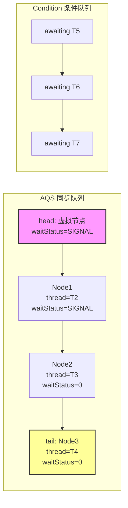

# AQS 框架原理深度剖析

## 引子：ReentrantLock、CountDownLatch、Semaphore 的共同秘密

```java
// 三个看似毫不相关的类
ReentrantLock lock = new ReentrantLock();       // 可重入锁
Semaphore semaphore = new Semaphore(3);          // 信号量
CountDownLatch latch = new CountDownLatch(1);    // 倒计时门闩

// 它们有什么共同点？
```

打开源码你会发现，这三个类的底层**全都依赖同一个框架**——**AQS（AbstractQueuedSynchronizer）**。

Doug Lea 用一个抽象框架，就支撑起了整个 `java.util.concurrent.locks` 包。AQS 是怎么做到的？

---

## 一、核心原理

> 📚 **前置知识**：[JUC 锁](../../../01.java/concurrency/juc-locks/README.md) | [volatile](../../../01.java/concurrency/volatile/README.md)

AQS（AbstractQueuedSynchronizer）由 Doug Lea 设计，其核心思想是将同步状态的原子操作与线程排队解耦。

### 1.1 状态变量 state

```java
private volatile int state;  // 共享资源状态
```

- **volatile 语义**：保证可见性与有序性，但不保证原子性
- **CAS 更新**：通过 `compareAndSetState(expected, new)` 原子修改
- **语义复用**：
  - ReentrantLock：state=0 表示空闲，state>0 表示重入次数
  - Semaphore：state 表示可用许可证数量
  - CountDownLatch：state 表示剩余计数值

### 1.2 CLH 变体双向队列

AQS 基于 Craig, Landin, Hagersten 锁算法改进，将自旋改为阻塞：

| 特性 | 原始 CLH | AQS 变体 |
|------|----------|----------|
| 队列类型 | 单向链表 | 双向链表 |
| 节点等待 | 自旋 | park() 阻塞 |
| 头节点语义 | 虚拟节点 | 当前持有锁的线程 |
| 尾部访问 | 原子 swap | tail CAS + 失败重试 |

### 1.3 独占模式 vs 共享模式

- **独占模式（Exclusive）**：同一时刻只有一个线程能获取同步状态
  - 典型应用：ReentrantLock、ReentrantReadWriteLock.WriteLock
  - 方法前缀：`acquire` / `release`

- **共享模式（Shared）**：多个线程可同时获取同步状态
  - 典型应用：CountDownLatch、Semaphore、ReentrantReadWriteLock.ReadLock
  - 方法前缀：`acquireShared` / `releaseShared`

---

## 二、源码剖析

### 2.1 Node 内部类结构

```java
static final class Node {
    static final Node SHARED = new Node();   // 共享模式标记
    static final Node EXCLUSIVE = null;       // 独占模式标记

    // waitStatus 取值
    static final int CANCELLED =  1;   // 线程被取消/超时/中断
    static final int SIGNAL    = -1;   // 后继线程需要被唤醒
    static final int CONDITION = -2;   // 线程在条件队列中等待
    static final int PROPAGATE = -3;   // 共享模式下传播唤醒

    volatile int waitStatus;
    volatile Node prev;      // 前驱节点
    volatile Node next;      // 后继节点
    volatile Thread thread;  // 封装的线程
    Node nextWaiter;         // 条件队列中的下一个节点
}
```

### 2.2 独占 acquire 流程

```
tryAcquire(arg)
    └─→ 成功：直接返回
    └─→ 失败：addWaiter(Node.EXCLUSIVE)
              └─→ enq(node)：CAS 尾插入队（自旋保证入队）
              └─→ acquireQueued(node, arg)
                    └─→ shouldParkAfterFailedAcquire(pred, node)
                          ├─→ pred.waitStatus == SIGNAL → return true → parkAndCheckInterrupt()
                          ├─→ pred.waitStatus > 0 (CANCELLED) → 向前清理无效节点
                          └─→ 否则 CAS 设置 pred.waitStatus = SIGNAL
                    └─→ parkAndCheckInterrupt()
                          ├─→ LockSupport.park(this) 阻塞
                          └─→ 被唤醒后检查中断状态
```

### 2.3 共享 acquire 流程

```
tryAcquireShared(arg)
    └─→ >= 0：成功，setHeadAndPropagate(node, arg)
              ├─→ setHead(node)：更新 head
              └─→ propagate：如果还有剩余资源，唤醒后继共享节点
    └─→ < 0：失败，doAcquireShared(arg)
              └─→ 类似 acquireQueued，但成功后调用 setHeadAndPropagate
```

### 2.4 release 流程

```java
public final boolean release(int arg) {
    if (tryRelease(arg)) {
        Node h = head;
        if (h != null && h.waitStatus != 0)
            unparkSuccessor(h);  // 唤醒后继有效节点
        return true;
    }
    return false;
}
```

### 2.5 Condition 条件队列

```
await() → 将节点从同步队列转移到条件队列 → 释放锁 → park()
signal() → 从条件队列取首节点 → 重新入同步队列 → 等待 acquire
```

### 2.6 AQS 队列结构图



---

## 三、常见陷阱

### 3.1 公平锁 vs 非公平锁实现差异

| 对比项 | NonfairSync | FairSync |
|--------|-------------|----------|
| tryAcquire | 直接 CAS state | 先检查 hasQueuedPredecessors() |
| 吞吐量 | 高（减少上下文切换） | 低（每次都要检查队列） |
| 饥饿风险 | 可能存在 | 不存在 |

```java
// NonfairSync：暴力抢锁
protected final boolean tryAcquire(int acquires) {
    return compareAndSetState(0, acquires);  // 不管队列，直接 CAS
}

// FairSync：排队拿锁
protected final boolean tryAcquire(int acquires) {
    if (hasQueuedPredecessors())  // 队列中有等待线程则放弃
        return false;
    return compareAndSetState(0, acquires);
}
```

### 3.2 tryLock() vs lock()

| 特性 | lock() | tryLock() |
|------|--------|-----------|
| 阻塞行为 | 阻塞直到获取 | 立即返回 true/false |
| 响应中断 | 是 | 否（除非用 tryLock(time, unit)） |
| 适用场景 | 必须获取锁的场景 | 可降级处理的场景 |

### 3.3 其他陷阱

- **死锁**：ReentrantLock 不会自动释放，必须在 finally 中 unlock()
- **虚假唤醒**：Condition.await() 应在 while 循环中使用
- **state 溢出**：ReentrantLock 最大重入次数为 Integer.MAX_VALUE

---

## 四、最佳实践

### 4.1 自定义同步器模板

```java
class OneShotLatch {
    private final Sync sync = new Sync();

    private static class Sync extends AbstractQueuedSynchronizer {
        protected int tryAcquireShared(int ignored) {
            return getState() == 1 ? 1 : -1;  // state=1 则共享获取成功
        }
        protected boolean tryReleaseShared(int ignored) {
            setState(1);  // 一次性打开 latch
            return true;
        }
    }

    public void await() throws InterruptedException {
        sync.acquireSharedInterruptibly(0);
    }
    public void signal() {
        sync.releaseShared(0);
    }
}
```

### 4.2 经典组件底层原理

#### CountDownLatch

- **state 初始值**：构造函数传入的 count
- **countDown()**：CAS 递减 state，state==0 时唤醒所有等待线程
- **await()**：共享 acquire，state!=0 时入队阻塞

#### Semaphore

- **state 初始值**：permits 数量
- **acquire()**：独占或共享获取，CAS 递减 state
- **release()**：CAS 递增 state，唤醒等待线程

#### CyclicBarrier

- 基于 ReentrantLock + Condition 实现
- generation 模式支持屏障重置
- 最后一个到达的线程执行 barrierAction 并重置屏障

### 4.3 性能调优建议

- 高竞争场景优先使用非公平锁（ReentrantLock 默认）
- 读多写少场景使用 ReadWriteLock 或 StampedLock
- 避免在持锁期间执行耗时 I/O 或网络请求

---

## 五、面试话术（30 秒版）

> AQS 是 JUC 包的核心框架，用一个 volatile int state 表示同步状态，用 CLH 变体的双向队列管理等待线程。线程获取失败后会被封装成 Node 加入队列尾部，然后通过 LockSupport.park() 阻塞。释放时通过 unpark() 唤醒后继节点。它支持独占和共享两种模式，ReentrantLock、CountDownLatch、Semaphore 都是基于 AQS 实现的。理解 AQS 关键是掌握 state 的 CAS 操作、节点的 waitStatus 状态转换、以及独占/共享的获取释放流程。

---

## 六、交叉引用

- 主模块：[`01.java`](../../../01.java/) — Java 知识体系
- 相关主题：
  - [ReentrantLock](../../../01.java/concurrency/juc-locks/README.md) — ReentrantLock 源码解析
  - [JUC 工具类](../../../01.java/concurrency/utilities/README.md) — JUC 工具类汇总
  - [Java 内存模型](../../../01.java/concurrency/jmm/README.md) — Java 内存模型与 volatile

## 相关章节

- 深度阅读：[`01.java`](../../01.java/README.md) — 主模块详细内容
