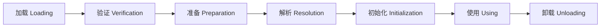
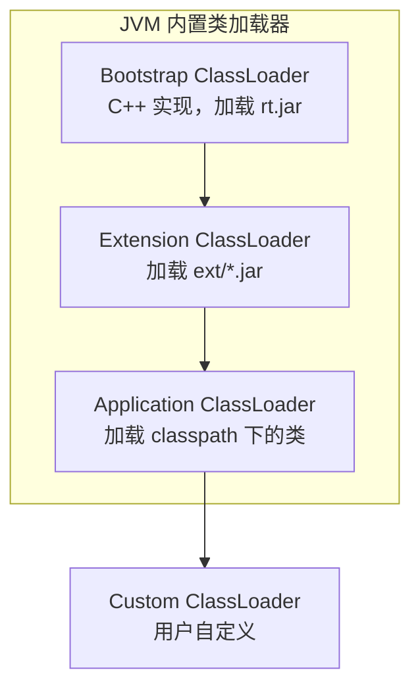
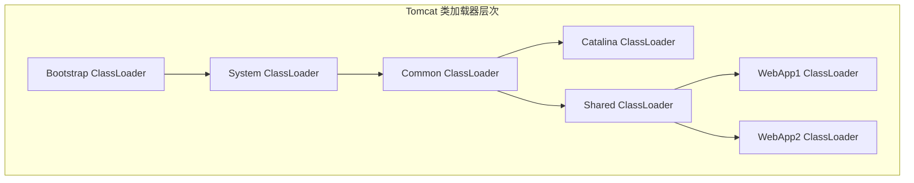
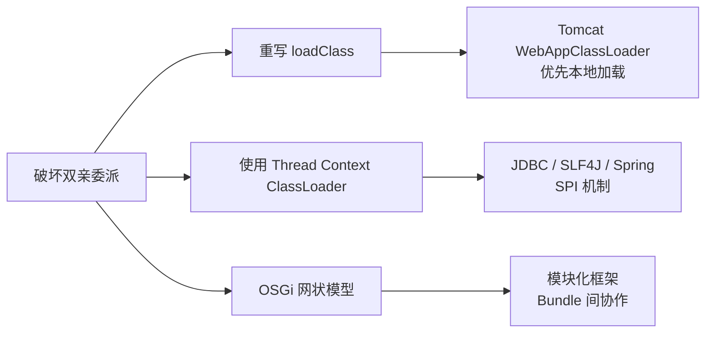

# 类加载机制与双亲委派模型

## 引子：一个诡异的问题

```java
// 你自己写了一个 java.lang.String 类
package java.lang;

public class String {
    // 你的自定义方法
}
```

编译能通过，但运行时你会发现：**你自定义的 String 根本没被加载！**

JVM 偷偷加载了 JDK 自带的 `java.lang.String`。为什么？

这就是**双亲委派模型**在背后搞的鬼。它保护了 Java 核心类库不被篡改，但也带来了一些"不便"——比如 JDBC 驱动加载时需要**主动打破**这个机制。

---

## 一、核心原理

> 📚 **前置知识**：[JVM](../../../01.java/jvm/README.md)

### 类的生命周期（7 阶段）



| 阶段 | 触发时机 | 核心动作 |
|------|----------|----------|
| **加载** | 首次引用类时 | 从字节码文件读取到 JVM，生成 `Class` 对象 |
| **验证** | 加载后 | 校验字节码合法性（魔数、常量池、指令格式等） |
| **准备** | 验证后 | 为静态变量分配内存并设默认值（零值） |
| **解析** | 准备后 | 将符号引用替换为直接引用（方法表偏移量等） |
| **初始化** | 首次主动使用时 | 执行 `<clinit>()` 方法，赋值静态变量、执行静态块 |
| **使用** | 初始化后 | 创建实例、调用方法、访问字段 |
| **卸载** | 类不再被引用 | GC 回收 `Class` 对象（需满足三个苛刻条件） |

> **主动使用的 5 种场景：** 1) `new`/读写静态字段/调用静态方法；2) 反射调用；3) 初始化子类先初始化父类；4) 启动类（含 `main`）；5) JDK 7+ `invokedynamic`

## 二、双亲委派模型

### 类加载器层级



| 类加载器 | 实现类 | 加载范围 | 父加载器 |
|----------|--------|----------|----------|
| **Bootstrap** | `null`（C++ 实现） | `$JAVA_HOME/lib/rt.jar` 等核心库 | 无 |
| **Extension** | `sun.misc.Launcher$ExtClassLoader` | `$JAVA_HOME/lib/ext/*.jar` | Bootstrap |
| **Application** | `sun.misc.Launcher$AppClassLoader` | `classpath` 指定的类 | Extension |
| **Custom** | 继承 `java.lang.ClassLoader` | 自定义路径 | Application |

### 双亲委派的递归逻辑

```java
protected Class<?> loadClass(String name, boolean resolve) throws ClassNotFoundException {
    synchronized (getClassLoadingLock(name)) {
        // 1. 检查是否已加载
        Class<?> c = findLoadedClass(name);
        if (c != null) return c;

        // 2. 递归委托给父加载器
        try {
            if (parent != null) {
                c = parent.loadClass(name, resolve);
            } else {
                c = findBootstrapClassOrNull(name);
            }
        } catch (ClassNotFoundException e) {
            // 父加载器找不到，不抛出异常
        }

        // 3. 父加载器都找不到，自己尝试加载
        if (c == null) c = findClass(name);

        // 4. 可选的链接阶段
        if (resolve) resolveClass(c);
        return c;
    }
}
```

**委派流程：** 查缓存 → 委托父加载器 → 自己调用 `findClass` → 可选链接

**优势：** 安全性（防止核心 API 被篡改）、隔离性（避免重复加载）

---

## 三、为什么要打破？什么时候打破？

### 1. SPI 机制（Service Provider Interface）

**典型代表：** JDBC、SLF4J、JNDI

以 JDBC 为例：`DriverManager` 位于 `rt.jar`（Bootstrap 加载），具体驱动位于 classpath（Application 加载）。Bootstrap 无法加载 classpath 下的驱动类。

**解决方案：** 引入 **线程上下文类加载器（Thread Context ClassLoader）**

```java
// DriverManager 静态块中
static {
    loadInitialDrivers();
    // ServiceLoader 使用 Thread.currentThread().getContextClassLoader()
}

// ServiceLoader 的核心逻辑
public static <S> ServiceLoader<S> load(Class<S> service) {
    ClassLoader cl = Thread.currentThread().getContextClassLoader();
    return new ServiceLoader<>(service, cl);
}
```

### 2. Tomcat 的 WebAppClassLoader

**需求：** 同一服务器部署多个 Web 应用，每个应用可能依赖不同版本的相同库。

**Tomcat 类加载器结构：**



**打破方式：** WebAppClassLoader **优先从本地加载**，找不到才委托父加载器；每个 Web 应用有独立的 ClassLoader，实现类隔离。

```java
// Tomcat WebAppClassLoader 简化逻辑
protected Class<?> loadClass(String name, boolean resolve) throws ClassNotFoundException {
    Class<?> clazz = findLoadedClass(name);
    if (clazz != null) return clazz;

    // 【关键】优先从本地加载（打破双亲委派）
    try {
        clazz = findClass(name);
        if (clazz != null) {
            if (resolve) resolveClass(clazz);
            return clazz;
        }
    } catch (ClassNotFoundException e) {
        // 本地找不到，再委托父加载器
    }

    return super.loadClass(name, resolve);
}
```

### 3. OSGi 网状模型 & 4. 热部署

**OSGi：** 每个 Bundle 有自己的 ClassLoader，通过 `MANIFEST.MF` 声明 `Import-Package` / `Export-Package`，形成**网状协作**。

**热部署：** 每次部署创建新的 ClassLoader，旧 ClassLoader 及其加载的类被 GC 回收。

```java
public class HotDeployClassLoader extends URLClassLoader {
    public Class<?> hotReload(String className, byte[] bytecode) {
        return defineClass(className, bytecode, 0, bytecode.length);
    }
}
```

---

## 四、源码剖析

### findClass vs defineClass

| 方法 | 职责 | 是否可重写 |
|------|------|------------|
| `loadClass` | 整体加载流程（含双亲委派） | 可重写，但一般不建议 |
| `findClass` | 定位并加载类（不含委派逻辑） | **推荐重写** |
| `defineClass` | 将字节数组转换为 `Class` 对象 | `final`，不可重写 |

**自定义类加载器的标准写法：**
```java
public class MyClassLoader extends ClassLoader {
    @Override
    protected Class<?> findClass(String name) throws ClassNotFoundException {
        byte[] data = loadClassData(name);
        return defineClass(name, data, 0, data.length);
    }

    private byte[] loadClassData(String name) {
        String path = basePath + "/" + name.replace('.', '/') + ".class";
        return Files.readAllBytes(Paths.get(path));
    }
}
```

### Thread Context ClassLoader

```java
// 设置上下文类加载器
Thread.currentThread().setContextClassLoader(customClassLoader);
// 获取上下文类加载器（SPI 框架常用）
ClassLoader cl = Thread.currentThread().getContextClassLoader();
```

**典型应用场景：** JDBC 驱动加载、SLF4J、Spring Boot 的 `SpringFactoriesLoader`

---

## 五、常见陷阱 + 最佳实践

### 破坏双亲委派的 3 种方式



| 方式 | 适用场景 | 风险 |
|------|----------|------|
| **重写 loadClass** | Web 容器、应用服务器 | 可能破坏类隔离 |
| **TCCL** | SPI 框架、插件系统 | 上下文丢失导致加载失败 |
| **OSGi 网状** | 模块化系统 | 复杂度极高，调试困难 |

### 常见陷阱

**1. 子线程丢失 TCCL：** 需手动传递 `child.setContextClassLoader(myClassLoader)`
**2. 类转换异常：** 同一个类被不同 ClassLoader 加载，视为不同的类
**3. 内存泄漏：** 热部署场景下，旧 ClassLoader 未被 GC 回收

### 最佳实践

| 场景 | 推荐做法 |
|------|----------|
| 一般自定义加载器 | 只重写 `findClass`，保留双亲委派 |
| SPI 框架集成 | 确保正确设置 TCCL，注意子线程传递 |
| Web 应用隔离 | 使用独立的 ClassLoader，优先本地加载 |
| 热部署 | 创建新 ClassLoader，清理旧引用，触发 GC |

---

## 六、面试话术（30 秒版）

> 「Java 的类加载遵循双亲委派模型：收到加载请求时，先递归委托给父加载器，只有当父加载器无法加载时，才自己尝试加载。这样做的好处是安全性和隔离性——比如防止用户自定义的 `java.lang.String` 覆盖核心 API。但有三种场景需要打破双亲委派：第一是 SPI 机制，像 JDBC 的 `DriverManager` 在 Bootstrap 层，而具体驱动在 classpath，所以用线程上下文类加载器（TCCL）来加载；第二是 Web 容器，像 Tomcat 的 `WebAppClassLoader` 优先从本地加载类，实现多应用的类隔离；第三是 OSGi 这样的模块化框架，通过网状模型实现模块间的按需共享。实际开发中，如果写自定义类加载器，建议只重写 `findClass`，不要动 `loadClass`。」

---

## 七、交叉引用

- 主模块：[`01.java`](../../../01.java/) — Java 知识体系
- [JVM 内存](../../../01.java/jvm/README.md) — JVM 内存模型
- [SPI 机制](../spi/README.md) — SPI 机制详解

## 相关章节

- 深度阅读：[`01.java`](../../01.java/README.md) — 主模块详细内容
