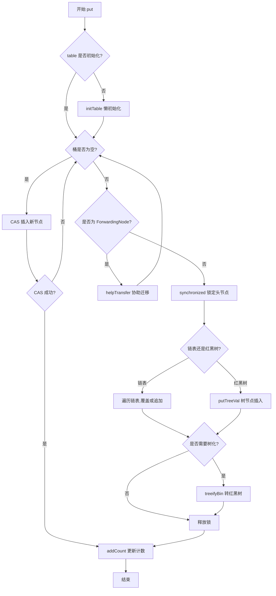

<!--
question:
  id: 01.java-concurrent-hashmap
  topic: 01.java
  difficulty: 未标
  frequency: 中频
  scenario_type: 性能对比
  tags: [01.java, HashMap, concurrent]
-->

# ConcurrentHashMap 原理（JDK 7 vs 8 深度对比）

## 引子：为什么要"另起炉灶"？

```java
// 高并发场景：100个线程同时写入
Map<String, Integer> map = new HashMap<>();  // ❌ 线程不安全
Map<String, Integer> syncMap = Collections.synchronizedMap(new HashMap<>());  // 能用，但慢

// 正确答案
Map<String, Integer> concurrentMap = new ConcurrentHashMap<>();  // ✅ 快且安全
```

既然 `synchronizedMap` 能保证线程安全，为什么还需要 `ConcurrentHashMap`？

因为 `synchronizedMap` 是**一把大锁锁住整个 Map**——100 个线程排队写，性能灾难。`ConcurrentHashMap` 的设计哲学是：**把锁切细，让不同线程能同时写不同区域**。

从 JDK 7 到 JDK 8，这个"切锁"的方式发生了根本性变化——

---

## 一、核心原理

> 📚 **前置知识**：[ConcurrentHashMap](../../../01.java/collection/ConcurrentHashMap/README.md) | [HashMap](../../../01.java/collection/hashmap.md)

### JDK 7：分段锁（Segment）架构

JDK 7 采用**二级哈希表结构**：外层 `Segment` 数组，每个 `Segment` 内部维护 `HashEntry` 数组。`Segment` 继承 `ReentrantLock`，每把锁保护一个段。

```
ConcurrentHashMap
├── Segment[0] (ReentrantLock) → HashEntry[] → node -> node
├── Segment[1] (ReentrantLock) → HashEntry[] → node
└── Segment[m]
```

**关键设计：**
- **默认并发度 16**：`Segment` 数组大小默认 16，最多支持 16 个线程同时写
- **锁粒度粗**：同一段下所有桶共享一把锁
- **定位公式**：`segmentIndex = (hash >>> segmentShift) & segmentMask`，先定 Segment，再定位桶
- **读操作无锁**：`volatile` 保证可见性；写操作在 `Segment` 级别加锁

### JDK 8：CAS + synchronized 细粒度锁

JDK 8 抛弃 `Segment`，直接基于 `Node` 数组 + 链表/红黑树实现。

```
ConcurrentHashMap
├── Node[0]  → TreeNode (红黑树)
├── Node[1]  → Node -> Node -> Node (链表)
└── Node[n]
```

**核心变化：**
1. **锁粒度细化到桶级别**：`synchronized` 锁定单个桶头节点
2. **CAS 用于无冲突场景**：桶为空时 CAS 直接插入，无需加锁
3. **红黑树优化**：链表长度 >= 8 且数组长度 >= 64 时转为红黑树，查找 O(log n)
4. **forwarding node**：扩容时用 `ForwardingNode` 标记已迁移桶，支持多线程协助迁移

**为何换 synchronized？** JVM 对其优化（偏向锁、轻量级锁、锁消除）使其性能超过 `ReentrantLock`，且无需手动释放锁，异常安全性更好。

### JDK 7 vs 8 本质区别

| 维度 | JDK 7 | JDK 8 |
|------|-------|-------|
| 数据结构 | Segment[] + HashEntry[] | Node[] + 链表/红黑树 |
| 锁机制 | ReentrantLock (Segment 级别) | CAS + synchronized (桶级别) |
| 最大并发度 | Segment 数量 (默认 16) | 桶数量 (理论上限) |
| 读操作 | volatile 无锁 | volatile + CAS 无锁 |
| 写操作 | Segment.lock() | synchronized(node) |
| 扩容 | Segment 独立扩容 | 全表协同扩容，支持协助迁移 |
| 查询复杂度 | O(n) 链表 | O(log n) 红黑树 |

---

## 二、源码剖析

### put 流程对比

**JDK 7 - Segment.put()：**

```java
final V put(K key, int hash, V value, boolean onlyIfAbsent) {
    lock(); // 获取 Segment 锁
    try {
        int c = count;
        if (c++ > threshold) rehash(); // 超阈值则扩容
        HashEntry<K,V>[] tab = table;
        int index = hash & (tab.length - 1);
        HashEntry<K,V> first = tab[index];
        HashEntry<K,V> e = first;
        while (e != null && (e.hash != hash || !key.equals(e.key)))
            e = e.next;
        V oldValue;
        if (e != null) {
            oldValue = e.value;
            if (!onlyIfAbsent) e.value = value;
        } else {
            oldValue = null;
            ++modCount;
            tab[index] = new HashEntry<>(key, hash, first, value);
            count = c + 1; // volatile 写入
        }
        return oldValue;
    } finally { unlock(); }
}
```

**JDK 8 - ConcurrentHashMap.putVal()：**

```java
final V putVal(K key, V value, boolean onlyIfAbsent) {
    if (key == null || value == null) throw new NullPointerException();
    int hash = spread(key.hashCode());
    int binCount = 0;
    for (Node<K,V>[] tab = table;;) {
        Node<K,V> f; int n, i, fh;
        if (tab == null || (n = tab.length) == 0)
            tab = initTable(); // 懒初始化
        else if ((f = tabAt(tab, i = (n - 1) & hash)) == null) {
            if (casTabAt(tab, i, null, new Node<>(hash, key, value, null)))
                break; // CAS 直接插入（无锁路径）
        }
        else if ((fh = f.hash) == MOVED)
            tab = helpTransfer(tab, f); // 协助迁移
        else {
            V oldVal = null;
            synchronized (f) { // 锁定头节点
                if (tabAt(tab, i) == f) {
                    if (fh >= 0) { // 链表
                        binCount = 1;
                        for (Node<K,V> e = f;; ++binCount) {
                            K ek;
                            if (e.hash == hash && ((ek = e.key) == key || key.equals(ek))) {
                                oldVal = e.val;
                                if (!onlyIfAbsent) e.val = value;
                                break;
                            }
                            if ((e = e.next) == null) {
                                pred.next = new Node<>(hash, key, value, null);
                                break;
                            }
                        }
                    } else if (f instanceof TreeBin) { // 红黑树
                        binCount = 2;
                        ((TreeBin<K,V>)f).putTreeVal(hash, key, value);
                    }
                }
            }
            if (binCount >= TREEIFY_THRESHOLD) treeifyBin(tab, i); // 树化
        }
    }
    addCount(1L, binCount);
    return null;
}
```

### 扩容与迁移（transfer）

JDK 8 扩容最复杂，支持多线程协助迁移：

```java
private final void transfer(Node<K,V>[] tab, Node<K,V>[] nextTab) {
    int n = tab.length, stride;
    // 每个线程处理的桶范围，最小 16
    if ((stride = (NCPU > 1) ? (n >>> 3) / NCPU : n) < MIN_TRANSFER_STRIDE)
        stride = MIN_TRANSFER_STRIDE;
    if (nextTab == null) { // 首次调用，创建新表
        nextTab = (Node<K,V>[])new Node<?,?>[n << 1];
        nextTable = nextTab;
        transferIndex = n; // 从高到低处理
    }
    ForwardingNode<K,V> fwd = new ForwardingNode<>(nextTab);
    for (int i = 0, bound = 0;;) {
        // 获取下一个待处理桶索引 i
        // CAS 竞争 transferIndex，确定自己的处理范围 [bound, i]
        // 迁移当前桶：拆分为低位和高位两条链表
        // setTabAt(nextTab, i, ln);      低位留原位
        // setTabAt(nextTab, i + n, hn);  高位移到新位置
        // setTabAt(tab, i, fwd);         原表标记为已迁移
    }
    // 所有桶处理完毕：table = nextTab; sizeCtl = 新阈值
}
```

### mermaid 流程图：JDK 8 put 操作



### size() 统计机制

**JDK 7：** 累加每个 Segment 的 `count`，重试 3 次后对所有 Segment 加锁确保一致性。

**JDK 8：** 使用 `CounterCell` 数组分散竞争（类似 `LongAdder`）：

```java
final long sumCount() {
    CounterCell[] as = counterCells;
    long sum = baseCount; // 基础计数
    if (as != null)
        for (CounterCell a : as)
            if (a != null) sum += a.value;
    return sum;
}
@sun.misc.Contended
static final class CounterCell { volatile long value; }
```

`addCount` 通过 CAS 更新 `baseCount`，失败则将增量分散到 `CounterCell` 数组随机位置，极大降低高并发竞争。

---

## 三、常见陷阱

### 1. size() 不是精确值

```java
ConcurrentHashMap<String, Integer> map = new ConcurrentHashMap<>();
executorService.submit(() -> { for (int i = 0; i < 1000; i++) map.put("key-" + i, i); });
System.out.println(map.size()); // 可能是 998、1000、1002...
```

`sumCount()` 遍历时其他线程可能正在修改 `CounterCell`，瞬时值不准确。**不能用 `size()` 做业务判断**。

### 2. 扩容时的性能抖动

```java
// 错误：默认容量 16，插入 100 万元素 → 频繁触发扩容
ConcurrentHashMap<String, String> map = new ConcurrentHashMap<>();
for (int i = 0; i < 1_000_000; i++) map.put("key-" + i, "value-" + i);
```

**解决：** 预估容量，指定初始容量：`new ConcurrentHashMap<>(1_333_334)`（100万 / 0.75）。

### 3. computeIfAbsent 可能导致死锁

```java
map.computeIfAbsent(1, k -> map.getOrDefault(1, 0) + 1); // Java 8u192 前可能死锁
```

`computeIfAbsent` 持有桶锁，内部再次访问同桶导致死锁。Java 9+ 已修复，但仍不推荐。

### 4. 与 HashMap 的误用

- `HashMap` 允许 null key/value，`ConcurrentHashMap` 不允许（抛 NPE）
- `HashMap` 迭代器 fail-fast，`ConcurrentHashMap` 是 weakly consistent
- `HashMap` 并发 put 可能形成环形链表（JDK 7），`ConcurrentHashMap` 永远线程安全

### 5. 迭代器的弱一致性

```java
Iterator<Map.Entry<String, Integer>> it = map.entrySet().iterator();
map.put("C", 3); // 迭代中修改：可能看到 C，也可能看不到
while (it.hasNext()) System.out.println(it.next().getKey());
```

不会抛 `ConcurrentModificationException`，但也不能保证看到最新数据。需要强一致性则外部同步。

---

## 四、最佳实践

### 何时选择 ConcurrentHashMap

✅ **应该使用：** 高并发读写（缓存、计数器）、读多写少的共享状态、需要原子复合操作（`putIfAbsent`、`merge`）

❌ **不应该使用：** 单线程（用 `HashMap`）、需要 null key/value、需要强一致性迭代

### 合理设置初始容量

```java
int initialCapacity = (int) (expectedSize / 0.75f) + 1;
ConcurrentHashMap<String, String> map = new ConcurrentHashMap<>(initialCapacity, 0.75f, 16);
```

### 优先使用原子复合操作

```java
// 不推荐：非原子 check-then-act
if (!map.containsKey(key)) map.put(key, value);
// 推荐：原子操作
map.putIfAbsent(key, value);

// 不推荐：非原子读改写
Integer count = map.get(key); map.put(key, count == null ? 1 : count + 1);
// 推荐
map.merge(key, 1, Integer::sum);
```

### 替代方案对比

| 场景 | 推荐方案 | 理由 |
|------|---------|------|
| 高并发读写 | `ConcurrentHashMap` | 最优选择 |
| 单线程 | `HashMap` | 无同步开销 |
| 需要有序 | `ConcurrentSkipListMap` | 跳表实现，O(log n) |
| 简单同步 | `Collections.synchronizedMap` | 全局锁，低并发友好 |
| 只读共享 | `Collections.unmodifiableMap` | 不可变，零开销 |

---

## 五、面试话术（30 秒版）

> "ConcurrentHashMap 在 JDK 7 中使用分段锁（Segment）实现并发控制，每个 Segment 是一把 ReentrantLock，默认 16 路并发。JDK 8 重构为 CAS + synchronized 细粒度锁，锁粒度从 Segment 降到桶级别，理论并发度等于桶数量。
>
> JDK 8 核心优化：1）桶为空时 CAS 直接插入，无锁路径性能极高；2）链表超 8 且数组超 64 时转红黑树，查找 O(log n)；3）扩容支持多线程协助迁移，通过 ForwardingNode 标记已迁移桶；4）size() 用 CounterCell 数组分散竞争，类似 LongAdder。
>
> 与 HashMap 关键差异：CHM 不允许 null key/value，迭代器弱一致性而非 fail-fast，提供 putIfAbsent、computeIfAbsent 等原子复合操作。高并发场景下，CHM 是唯一正确选择。"

---

## 六、交叉引用

- 主模块：[`01.java`](../../../01.java/) — Java 知识体系
- 相关主题：
  - [HashMap 原理](../../../01.java/collection/hashmap.md) — 对比理解非线程安全的哈希表实现
  - [ReentrantLock 原理](../../../01.java/concurrency/juc-locks/README.md) — JDK 7 Segment 的锁实现基础
  - [CAS 与原子类](../../../01.java/concurrency/atomic/README.md) — JDK 8 CAS 操作的底层原理
  - [synchronized 锁升级](../../../01.java/concurrency/synchronized/README.md) — JDK 8 为何选择 synchronized
  - [TreeMap 原理](../../../01.java/collection/TreeMap/README.md) — JDK 8 树化机制的数据结构基础

## 相关章节

- 深度阅读：[`01.java`](../../01.java/README.md) — 主模块详细内容
