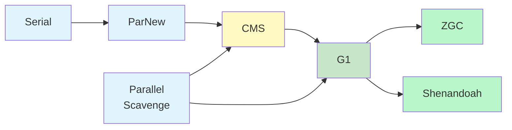

# GC 算法与垃圾收集器深度对比

> 一句话：理解 GC 算法的演进脉络与各类收集器的设计取舍，是 JVM 调优与高并发系统稳定性保障的核心基石。

---

## 一、核心原理

垃圾回收（Garbage Collection）的本质是解决三个问题：**哪些对象可以回收**、**何时回收**、**如何回收**。前两个问题由引用计数、可达性分析等判定算法解决，而"如何回收"则依赖以下四种基础算法：

### 1.1 标记-清除（Mark-Sweep）

最基础的 GC 算法，分为两个阶段：先遍历对象图标记存活对象，再统一清除未标记对象。

**优点**：实现简单，不需要移动对象，适合老年代。
**缺点**：产生大量内存碎片（Fragmentation），导致大对象无法分配；标记和清除两个阶段效率都较低。

### 1.2 复制（Copying）

将堆内存划分为大小相等的 From 和 To 两个区域，每次只使用 From。GC 时将存活对象复制到 To，然后清空 From 并交换角色。

**优点**：无内存碎片，实现简单高效。
**缺点**：内存利用率只有 50%，不适合大对象场景。典型应用是新生代 Minor GC。

### 1.3 标记-整理（Mark-Compact）

在标记-清除的基础上增加"整理"阶段：将存活对象向一端移动，然后清理边界外的内存。

**优点**：既避免了碎片问题，又提高了内存利用率。
**缺点**：需要暂停用户线程（STW），移动对象的成本较高。典型应用是老年代收集。

### 1.4 分代收集（Generational Collection）

基于"弱分代假说"（绝大多数对象朝生夕死）和"强分代假说"（熬过越多次 GC 的对象越难死亡），将堆划分为新生代（Young）和老年代（Old/Tenured），分别采用不同的算法：

| 区域 | 特点 | 常用算法 | 代表收集器 |
|------|------|----------|------------|
| 新生代 | 对象生命周期短，存活率低 | 复制算法 | Serial, ParNew, Parallel Scavenge, G1 Young |
| 老年代 | 对象生命周期长，存活率高 | 标记-清除 / 标记-整理 | CMS, G1 Old, ZGC |

---

## 二、垃圾收集器全景图

JVM 提供了多种垃圾收集器，各自针对不同的场景做了优化。以下是主要收集器的对比：



### 2.1 各收集器核心特点

| 收集器 | 线程模型 | 适用代 | 算法 | 目标 | JDK 版本 |
|--------|----------|--------|------|------|----------|
| **Serial** | 单线程 STW | 新生代 | 复制 | 简单高效，客户端模式首选 | JDK 1.3 |
| **ParNew** | 多线程 STW | 新生代 | 复制 | Serial 的多线程版本，常与 CMS 搭配 | JDK 1.4 |
| **Parallel Scavenge** | 多线程 STW | 新生代 | 复制 | **吞吐量优先**，自适应调节策略 | JDK 1.4 |
| **Serial Old** | 单线程 STW | 老年代 | 标记-整理 | Serial 的老年代版本 | JDK 1.3 |
| **Parallel Old** | 多线程 STW | 老年代 | 标记-整理 | Parallel Scavenge 的老年代版本 | JDK 1.6 |
| **CMS** | 多线程并发 | 老年代 | 标记-清除 | **最短停顿时间**，首次实现并发收集 | JDK 1.4 (9 废弃) |
| **G1** | 多线程并发 | 全堆 | 分区化 | 可预测停顿，统一新生代+老年代 | JDK 7 (9 默认) |
| **ZGC** | 多线程并发 | 全堆 | 染色指针+读屏障 | **超低停顿 <10ms**，支持 TB 级堆 | JDK 11 (15 生产就绪) |
| **Shenandoah** | 多线程并发 | 全堆 | Brook 指针+读写屏障 | Red Hat 主导的超低停顿方案 | JDK 12 |

### 2.2 Serial vs Parallel：吞吐量的权衡

- **Serial 收集器**：单线程执行 GC，期间所有工作线程必须等待（Stop-The-World）。虽然看似低效，但在单核 CPU 或小堆（<100MB）场景下，由于没有线程切换开销，反而比多线程收集器更高效。适用于 Client 模式或嵌入式环境。

- **Parallel Scavenge / Parallel Old**：以**吞吐量**为第一目标（Throughput = 运行用户代码时间 / (运行用户代码时间 + GC 时间)）。通过 `-XX:MaxGCPauseMillis` 和 `-XX:GCTimeRatio` 自适应调整新生代大小和 Survivor 比例。适合后台计算型服务，对延迟不敏感但要求高吞吐。

---

## 三、深入 G1 与 ZGC

### 3.1 G1：区域化设计的里程碑

G1（Garbage-First）是 JEP 10 引入的革命性收集器，核心设计理念是**可预测的停顿时间模型**。

#### 核心架构

1. **Region 化堆布局**
   - 堆被划分为 1~32MB 的多个 Region（必须是 2 的幂），总数约 2048 个。
   - Region 动态扮演 Eden、Survivor、Old、Humongous（大对象）角色，无需物理隔离。
   - Humongous 对象（超过半个 Region）直接分配到连续 Humongous Region，避免复制开销。

2. **Remembered Set（RSet）**
   - 每个 Region 维护一个 RSet，记录"哪些其他 Region 的对象引用了我"。
   - 避免全堆扫描，实现高效的并发标记和增量收集。
   - RSet 本身占用额外内存（约每 Region 5%），是 G1 的空间换时间策略。

3. **三种 GC 类型**
   - **Young GC**：仅收集 Eden + Survivor Region，STW 时间可控。
   - **Mixed GC**：收集所有 Young Region + 部分高垃圾比例的 Old Region，由并发标记周期触发。
   - **Full GC**：当并发收集跟不上分配速度时退化，使用 Serial Old 单线程整理，应极力避免。

4. **关键参数**
   - `-XX:MaxGCPauseMillis`：期望最大 GC 停顿（默认 200ms），G1 据此动态调整每次收集的 Region 数量。
   - `-XX:InitiatingHeapOccupancyPercent`（IHOP）：触发并发标记的堆占用阈值（默认 45%）。
   - `-XX:G1HeapRegionSize`：手动指定 Region 大小（通常自动计算）。

### 3.2 ZGC：亚毫秒级停顿的未来

ZGC（Z Garbage Collector）是 JEP 333 引入的低延迟收集器，目标是**无论堆大小多大，GC 停顿都不超过 10ms**。

#### 核心技术

1. **染色指针（Colored Pointers）**
   - 利用 64 位指针中的 4 个 bit 存储对象状态：
     - `finalizable`：对象已终结但尚未回收
     - `mark0` / `mark1`：标记位，组合表示对象是否存活
     - `remapped`：对象是否已移动到新区间
   - 指针本身携带元数据，无需额外的 Mark Bitmap 全局表。

2. **读屏障（Load Barrier）**
   - 每次读取对象引用时插入读屏障，检查指针的染色位。
   - 如果对象未被 remapped，读屏障会触发"自修复"：将对象复制到新区间并更新指针。
   - 读屏障的开销极小（约 10ns），远低于写屏障。

3. **并发转移（Concurrent Compaction）**
   - ZGC 支持并发整理，通过 Multi-Mapping 技术将同一物理内存映射到多个虚拟地址区间（Marked0/Marked1/Remapped）。
   - 对象从 Marked 区间并发复制到 Remapped 区间，用户线程通过读屏障感知并重定向。

4. **适用场景**
   - 超大堆（TB 级别）、低延迟敏感型应用（交易、实时推荐）。
   - 不适合小堆或内存极度受限的环境（Multi-Mapping 消耗虚拟地址空间）。

---

## 四、常见陷阱

### 4.1 Full GC 的触发条件

Full GC 是性能杀手，常见触发场景包括：

1. **老年代空间不足**：大对象直接进入老年代，或长期存活对象晋升填满老年代。
2. **Metaspace 溢出**：类加载过多（动态代理、Groovy 脚本），触发元空间扩容进而 Full GC。
3. **System.gc() 显式调用**：第三方库或框架误用，建议添加 `-XX:+DisableExplicitGC`。
4. **CMS Concurrent Mode Failure**：并发收集期间老年代被填满，退化单线程 Full GC。
5. **G1 Evacuation Failure**：Mixed GC 期间无法找到足够空闲 Region，退化 Full GC。

### 4.2 CMS 的经典缺陷

1. **浮动垃圾（Floating Garbage）**
   - 并发清除阶段产生的新垃圾无法处理，只能等到下次 GC。
   - 因此 CMS 不能等到老年代完全满才触发，需预留空间（默认 68% 触发）。

2. **Concurrent Mode Failure**
   - 预留空间不足时，CMS 中断并发过程，退化 Serial Old 单线程 Full GC。
   - 表现为长时间 STW（数秒甚至数十秒），线上事故高发。

3. **内存碎片**
   - 标记-清除算法的固有缺陷，长时间运行后出现"有空闲但无法分配"的假性 OOM。
   - 可通过 `-XX:+UseCMSCompactAtFullCollection` 定期整理（代价是更长的 STW）。

### 4.3 G1 的 Humongous 分配陷阱

- 超过半个 Region 的对象被判定为 Humongous，直接分配到连续 Humongous Region。
- **问题**：Humongous Region 不会在 Young GC 时回收，必须等待 Mixed GC，容易造成内存浪费和回收延迟。
- **对策**：调整 `-XX:G1HeapRegionSize` 使 Region 大于典型大对象，或通过对象池复用大对象。

---

## 五、最佳实践 + 调优参数

### 5.1 收集器选型指南

| 场景 | 推荐收集器 | 理由 |
|------|-----------|------|
| 小堆（<100MB）/ 单核 CPU | Serial + Serial Old | 无线程切换开销，最简单高效 |
| 多核、高吞吐、延迟不敏感 | Parallel Scavenge + Parallel Old | 吞吐量最大化，适合批处理 |
| 中等堆（4GB~16GB）、延迟敏感 | G1 | 可预测停顿，综合性能最优 |
| 超大堆（>32GB）、极低延迟 | ZGC / Shenandoah | 亚毫秒停顿，堆越大优势越明显 |
| 遗留系统（JDK 8 之前） | ParNew + CMS | 成熟稳定，但需注意 JDK 9 后废弃 |

### 5.2 G1 调优核心参数

```bash
# 启用 G1
-XX:+UseG1GC

# 期望最大停顿时间（默认 200ms，根据业务 SLA 调整）
-XX:MaxGCPauseMillis=200

# 触发并发标记的堆占用百分比（降低可提前收集，避免 Full GC）
-XX:InitiatingHeapOccupancyPercent=45

# 设置堆大小（建议固定，避免动态伸缩抖动）
-Xms8g -Xmx8g

# 打印详细 GC 日志（JDK 9+ 统一日志格式）
-Xlog:gc*:file=gc.log:time,uptime,level,tags

# 开启字符串去重（减少堆占用）
-XX:+UseStringDeduplication
```

### 5.3 ZGC 启用方式

```bash
# JDK 15+ 生产就绪
-XX:+UseZGC

# JDK 11-14 实验性（需额外参数）
-XX:+UnlockExperimentalVMOptions -XX:+UseZGC

# 可选：并发参考处理
-XX:+ZProactive

# GC 日志
-Xlog:gc*:file=zgc.log:time,uptime,level,tags
```

---

## 六、面试话术（30 秒版）

> "GC 算法经历了从基础的标记-清除、复制、标记-整理，到分代收集的演进。主流收集器中，Serial/Parallel 系列追求吞吐量，CMS 首次实现并发清除但存在碎片和退化风险，G1 通过 Region 化和 RSet 实现了可预测停顿并成为 JDK 9+ 默认选择，ZGC 则借助染色指针和读屏障将停顿压缩到 10ms 以内，适合 TB 级大堆场景。选型上，中小堆用 G1，超大堆或对延迟极度敏感选 ZGC，遗留系统可考虑 CMS 但要警惕 Concurrent Mode Failure。"

---

## 七、交叉引用

- 主模块：[`01.java`](../../../01.java/) — Java 知识体系
- [JVM 内存](../../../01.java/jvm/README.md) — JVM 内存模型
- [JVM 调优](../../../01.java/jvm/tuning.md) — JVM 调优实战
