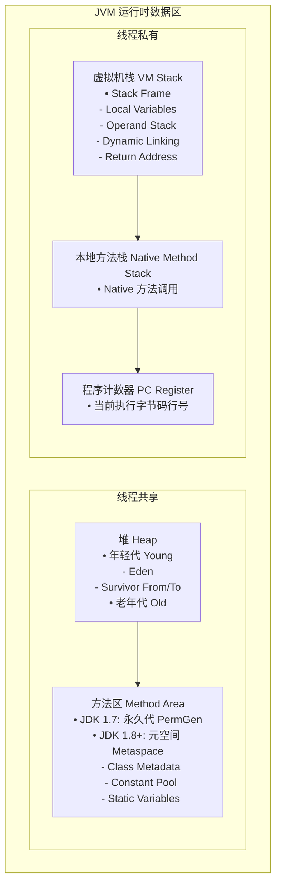

<!--
question:
  id: 01.java-jvm-memory
  topic: 01.java
  difficulty: ⭐⭐⭐
  frequency: 中频
  scenario_type: 架构困境
  tags: [01.java, JVM, jvm]
-->

# JVM 内存模型与对象创建全链路

## 引子：`new Object()` 背后发生了什么？

```java
Object obj = new Object();
```

这一行代码在 JVM 眼里，至少要经历 **6 个步骤**：

1. **类加载检查**：Object 类加载了吗？没加载就先加载
2. **内存分配**：在堆里给对象腾出空间（怎么腾？线程安全吗？）
3. **TLAB 优化**：如果每个对象分配都要锁，性能怎么办？
4. **零值初始化**：成员变量设默认值（int→0，引用→null）
5. **对象头设置**：写入 GC 分代年龄、哈希码、锁状态等元数据
6. **构造器调用**：执行 `<init>` 方法，按你的代码初始化

一个看似简单的 `new`，背后藏着 JVM 精心设计的内存管理体系。

---

## 一、核心原理

> 📚 **前置知识**：[JVM](../../../01.java/jvm/README.md)

JVM 运行时数据区（Runtime Data Area）是 Java 虚拟机规范定义的核心内存模型，分为线程共享区和线程私有区两大类。

### 线程共享区

**堆（Heap）**：JVM 管理的最大内存区域，存储所有对象实例和数组。采用分代收集策略：

- **年轻代（Young Generation）**：新创建对象首先分配在此，分为 Eden 区和两个 Survivor 区（From/To）。大多数对象在 Eden 区出生，经过 Minor GC 后存活的对象进入 Survivor 区，年龄达到阈值（默认 15）后晋升到老年代。
- **老年代（Old Generation）**：存放长期存活的对象，空间较大但 GC 频率较低，Major GC 或 Full GC 在此发生。

**方法区（Method Area）**：存储已被虚拟机加载的类信息、常量、静态变量、即时编译器编译后的代码等数据。

- JDK 1.7 及之前：方法区位于永久代（PermGen），容易发生 `OutOfMemoryError: PermGen space`。
- JDK 1.8 及之后：移除永久代，引入**元空间（Metaspace）**，直接使用本地内存（Native Memory），存储 Class Metadata、Constant Pool、Static Variables 等，有效避免了永久代溢出问题。



### 线程私有区

**虚拟机栈（VM Stack）**：每个方法执行时创建一个栈帧（Stack Frame），包含四个核心部分：

- **局部变量表（Local Variables）**：存储方法参数和局部变量，编译期确定大小。
- **操作数栈（Operand Stack）**：用于字节码指令的执行，如算术运算、方法调用传参。
- **动态链接（Dynamic Linking）**：指向运行时常量池中该栈帧所属方法的引用，支持方法调用的符号引用解析为直接引用。
- **返回地址（Return Address）**：方法正常退出或异常退出时的返回位置。

**本地方法栈（Native Method Stack）**：为 JVM 调用的 Native 方法服务，HotSpot 直接将本地方法栈和虚拟机栈合二为一。

**程序计数器（Program Counter Register）**：记录当前线程执行的字节码行号，是唯一不会抛出 `OutOfMemoryError` 的区域。

---

## 二、对象创建过程

JVM 创建对象遵循严格的六步流程，每一步都涉及关键的内存管理和优化策略。

### Step 1：类加载检查

当 JVM 遇到 `new` 指令时，首先检查常量池中是否有该类的符号引用，并验证该类是否已被加载、解析和初始化。若未加载，则触发类加载过程（Loading → Linking → Initializing）。

### Step 2：分配内存

类加载完成后，JVM 为新生对象分配内存。内存大小在类加载完成后即可确定。主要采用两种分配策略：

- **指针碰撞（Pointer Bumping）**：适用于内存规整的场景（使用 Serial、ParNew 等带有 Compact 过程的收集器）。堆内存被整理为已用和空闲两部分，中间有一个指针作为分界点，分配内存只需将指针向空闲区移动对象大小的距离。效率高，无并发竞争问题。
- **空闲列表（Free List）**：适用于内存不规整的场景（使用 CMS 等基于 Mark-Sweep 算法的收集器）。JVM 维护一个空闲内存地址列表，从中找到足够大的空间分配给对象，并更新列表记录。效率较低，需要额外的数据结构维护。

### Step 3：TLAB 优化

为解决多线程环境下的内存分配并发问题，JVM 引入了**线程本地分配缓冲区（Thread Local Allocation Buffer, TLAB）**。每个线程在 Eden 区预先分配一小块内存作为 TLAB，线程优先在自己的 TLAB 中分配对象，只有当 TLAB 用完并重新申请时，才需要同步锁定。这大幅减少了并发冲突，提升了分配效率。

可通过 `-XX:+UseTLAB` 开启（默认开启），`-XX:TLABSize` 调整大小。

### Step 4：初始化零值

内存分配完成后，JVM 将分配到的内存空间全部初始化为零值（不包括对象头）。这一步保证了对象实例字段在不赋值时具有默认值（如 `int` 为 0，`boolean` 为 `false`，引用类型为 `null`），程序员可以直接使用这些字段而不必担心垃圾数据。

### Step 5：设置对象头

JVM 对对象进行必要设置，填充**对象头（Object Header）**，包括 Hash Code、GC 分代年龄、锁状态标志、偏向线程 ID、偏向时间戳等信息。具体结构见下一节。

### Step 6：执行 init 方法

按照程序员的意愿，执行类的 `<init>` 构造器方法，完成对象的正式初始化。此时对象才真正可用。

---

## 三、对象头结构

对象头是 JVM 管理对象的核心元数据，存储在对象的起始位置，分为三部分。

### Mark Word（标记字）

Mark Word 的长度取决于 JVM 位宽：

- **64 位 JVM（开启指针压缩 `-XX:+UseCompressedOops`）**：Mark Word 占 62 bit（剩余 2 bit 用于锁标志位）。
- **32 位 JVM**：Mark Word 占 23 bit。

Mark Word 存储的关键信息包括：

| 位段 | 内容 | 说明 |
|------|------|------|
| 25 bit | unused | 保留位，暂未使用 |
| 31 bit | identity_hashcode | 对象的 Identity Hash Code，调用 `System.identityHashCode()` 时填充 |
| 4 bit | age | GC 分代年龄，对象每熬过一次 Minor GC 就加 1，达到阈值（默认 15）晋升到老年代 |
| 1 bit | biased_lock | 偏向锁标志，0 表示普通对象，1 表示偏向锁 |
| 2 bit | lock | 锁状态标志，00=轻量级锁，01=偏向锁，10=重量级锁，11=GC 标记 |
| 23/54 bit | thread | 偏向模式下持有锁的线程 ID |
| 23/54 bit | epoch | 偏向时间戳，用于批量撤销偏向锁 |
| 2 bit | ptr_to_lock_record | 指向栈中锁记录的指针（轻量级锁状态） |
| 2 bit | ptr_to_heavyweight_monitor | 指向重量级锁 Monitor 的指针（重量级锁状态） |

### Klass Pointer（类型指针）

Klass Pointer 指向对象的类元数据（即 `java.lang.Class` 对象在方法区的地址），JVM 通过它确定对象的具体类型。

- **64 位 JVM（开启指针压缩）**：占 32 bit（4 byte），压缩后只需存储偏移量。
- **64 位 JVM（关闭指针压缩）或 32 位 JVM**：占 64 bit（8 byte）或 32 bit（4 byte）。

可通过 `-XX:+UseCompressedClassPointers` 控制指针压缩（64 位 JVM 默认开启）。

### Array Length（数组长度）

仅当对象是数组时存在，占 4 byte，存储数组的元素个数。普通对象没有此部分。

### 对象内存布局总结

```
┌─────────────────────────┐
│     Object Header       │  ← 对象头
│  ├─ Mark Word           │  ← 62 bit (64位JVM+压缩)
│  ├─ Klass Pointer       │  ← 32 bit (64位JVM+压缩)
│  └─ Array Length?       │  ← 32 bit (仅数组)
├─────────────────────────┤
│   Instance Data         │  ← 实例数据：对象实际存储的字段内容
├─────────────────────────┤
│     Padding             │  ← 对齐填充：保证对象大小是 8 byte 的整数倍
└─────────────────────────┘
```

**对齐填充（Padding）**：HotSpot VM 要求对象大小必须是 8 byte 的整数倍。如果对象头和实例数据的总大小不是 8 的倍数，JVM 会自动添加填充字节补齐。

---

## 四、常见陷阱

### 栈溢出 vs 堆溢出

**StackOverflowError**：发生在虚拟机栈或本地方法栈。典型场景是无限递归调用，导致栈帧不断压栈直至栈空间耗尽。每个线程的栈大小可通过 `-Xss` 设置（默认 1 MB）。

```java
// 经典 StackOverflowError
public void recursive() {
    recursive(); // 无限递归，栈帧无限增长
}
```

**OutOfMemoryError: Java heap space**：发生在堆区域。典型场景是内存泄漏（如静态集合无限添加对象）、大对象分配超出堆容量。堆大小通过 `-Xms`（初始堆）和 `-Xmx`（最大堆）设置。

```java
// 经典 OOM
List<byte[]> list = new ArrayList<>();
while (true) {
    list.add(new byte[1024 * 1024]); // 持续分配 1MB 数组，直至堆满
}
```

### 方法区溢出

**OutOfMemoryError: Metaspace**：发生在元空间。典型场景是动态生成大量类（如 CGLIB 代理、Groovy 脚本编译），元空间无法容纳所有类元数据。元空间大小通过 `-XX:MetaspaceSize` 和 `-XX:MaxMetaspaceSize` 设置。

### 直接内存 vs 堆内存

**直接内存（Direct Memory）**：不属于 JVM 运行时数据区，而是通过 `ByteBuffer.allocateDirect()` 分配的堆外内存，受限于物理内存和 `-XX:MaxDirectMemorySize`（默认等于堆最大值）。优势是避免 Java 堆和本地堆之间的拷贝，适合 I/O 密集型场景；劣势是不受 GC 直接管理，需手动释放。

```java
// 直接内存分配
ByteBuffer directBuffer = ByteBuffer.allocateDirect(1024 * 1024); // 1MB 堆外内存
// 堆内存分配
ByteBuffer heapBuffer = ByteBuffer.allocate(1024 * 1024); // 1MB 堆内内存
```

---

## 五、面试话术（30 秒版）

> "JVM 内存分为五大区域：堆存储对象，采用分代收集；方法区存储类元数据，JDK 1.8 后用元空间替代永久代；虚拟机栈存储栈帧，包含局部变量表和操作数栈等；本地方法栈服务 Native 调用；程序计数器记录执行行号。对象创建分六步：先检查类是否加载，再分配内存（指针碰撞或空闲列表），TLAB 优化并发，然后初始化零值，设置对象头（Mark Word + Klass Pointer），最后执行构造器。对象头包含 Mark Word 存储 GC 年龄和锁状态，Klass Pointer 指向类元数据，数组还有长度字段。"

---

## 六、交叉引用

- 主模块：[`01.java`](../../../01.java/) — Java 知识体系
- [垃圾回收](../gc-algorithms/README.md) — GC 算法与收集器详解
- [类加载机制](../class-loading/README.md) — 类加载过程与双亲委派

## 相关章节

- 深度阅读：[`01.java`](../../01.java/README.md) — 主模块详细内容

← [返回: 咬文嚼字 · jvm-memory](../README.md)
