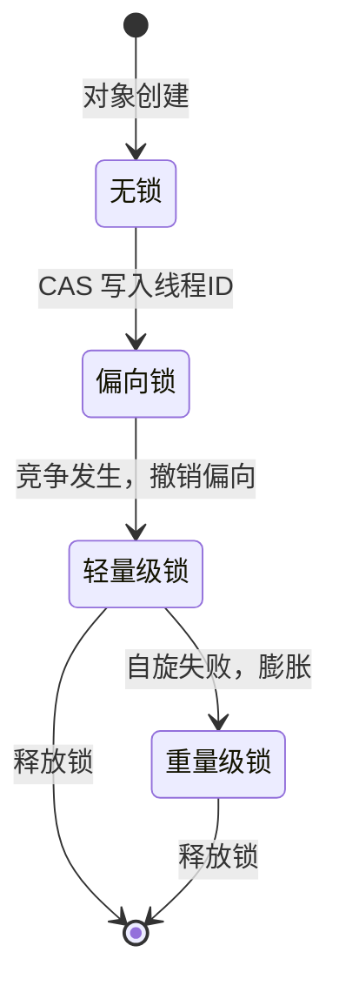

<!--
question:
  id: 01.java-synchronized-lock-upgrade
  topic: 01.java
  difficulty: 未标
  frequency: 中频
  scenario_type: 反直觉代码
  tags: [01.java, synchronized, lock]
-->

# synchronized 锁升级详解

## 引子：一把锁的进化史

想象一个办公场景：

1. **无锁**：会议室门开着，谁都能进，没人抢——最轻松
2. **偏向锁**：你第一次进会议室，门牌写上你的名字。下次直接进，不用登记——**适合只有一个人用**
3. **轻量级锁**：同事也想用了。你们约定：进门时举手示意（CAS），没竞争就进——**适合偶尔竞争**
4. **重量级锁**：竞争越来越激烈。现在门口有个管理员，排队登记，一个个进——**竞争惨烈时的最后手段**

`synchronized` 就是按这个思路设计的：**从最轻量的方式开始，竞争加剧才逐步升级**。这就是锁升级。

---

## 一、核心原理

> 📚 **前置知识**：[synchronized](../../../01.java/concurrency/synchronized/README.md) | [JUC 锁](../../../01.java/concurrency/juc-locks/README.md)

JVM 中每个 Java 对象都在对象头（Object Header）中维护一个 **Mark Word**，用于存储对象的运行时元数据，包括哈希码、分代年龄、GC 标记以及**锁状态**。

在 64 位 JVM 中，Mark Word 共 64 bit：

| 位范围 | 含义 |
|--------|------|
| 0–1 | 锁标志位（lock tag） |
| 2 | 是否为偏向锁（biased_lock flag） |
| 3–54 | 偏向线程 ID（biased_locker thread ptr）或轻量级锁指针 |
| 55–61 | 分代年龄（age） |
| 62–63 | GC 标记 / 其他 |

锁标志位的 2 bit 组合决定当前锁状态：

| lock(1:0) | biased_lock(2) | 状态 |
|-----------|----------------|------|
| 01 | 0 | 无锁（Normal） |
| 01 | 1 | 偏向锁（Biased） |
| 00 | - | 轻量级锁（Lightweight） |
| 10 | - | 重量级锁（Heavyweight） |

**升级路径是单向的**：无锁 → 偏向锁 → 轻量级锁 → 重量级锁。一旦升级到重量级锁，就不会降级回去，因为 ObjectMonitor 的创建和销毁成本极高，且需要全局同步。



---

## 二、代码示例 / 源码剖析

### 2.1 Mark Word 的 bit 分布表格

以下是 HotSpot VM 中 64 位 Mark Word 的详细布局（大端序视角）：

```
|---------------------------------------------------------------|
|                     Unused: 25 bits                           |
|---------------------------------------------------------------|
|   Identity Hash Code (31 bits) | Age (4 bits) | Biased Lock?  |
|---------------------------------------------------------------|
|  Thread Ptr (54 bits)  | Epoch (2 bits) | Age (4 bits) | Tag |
|---------------------------------------------------------------|
|       Lock Record Ptr (62 bits)           |      Tag (2)     |
|---------------------------------------------------------------|
|      Monitor Ptr (62 bits)                |      Tag (2)     |
|---------------------------------------------------------------|
```

- **Tag = 01, Biased=0**: 无锁，存储 identity hash code + age
- **Tag = 01, Biased=1**: 偏向锁，存储 thread pointer + epoch + age
- **Tag = 00**: 轻量级锁，存储指向栈上 Lock Record 的指针
- **Tag = 10**: 重量级锁，存储指向 ObjectMonitor 的指针

### 2.2 无锁 → 偏向锁

当第一个线程获取锁时，JVM 尝试用 CAS 将 Mark Word 的 biased_lock 位置 1，并写入当前线程 ID：

```java
// 伪代码：偏向锁获取逻辑
if (markWord.isBiased()) {
    if (markWord.biasedThreadId == currentThread) {
        // 已偏向当前线程，直接进入临界区（零开销）
        return;
    } else {
        // 存在偏向线程但不是当前线程，触发撤销
        revokeBias();
    }
} else {
    // CAS 尝试偏向
    if (CAS_CompareAndSwap(markWord, newMarkWord.withBiased(currentThread))) {
        // 成功，进入临界区
        return;
    } else {
        // 失败，说明有竞争，升级到轻量级锁
        inflateToLightweight();
    }
}
```

### 2.3 偏向锁 → 轻量级锁

当第二个线程尝试获取已被偏向的锁时，JVM 必须**撤销偏向**（Revoke Bias）：

1. 暂停偏向线程（SafePoint）
2. 将 Mark Word 恢复为无锁状态或轻量级锁状态
3. 两个线程通过 CAS 竞争锁，胜者获得轻量级锁

轻量级锁的核心数据结构是栈上的 **Lock Record**：

```cpp
// HotSpot C++ 伪代码
struct BasicLock {
    oop _displaced_header;  // 保存被替换的 Mark Word
};
```

线程在自己的栈帧中分配一个 BasicLock，用 CAS 将 Mark Word 替换为指向该 BasicLock 的指针。如果 CAS 失败，说明有竞争，进入自旋。

### 2.4 轻量级锁 → 重量级锁

轻量级锁的线程会先进行**自适应自旋**（Adaptive Spinning）。如果自旋超过阈值仍未获得锁，JVM 会将锁**膨胀**（Inflate）为重量级锁：

```cpp
// HotSpot ObjectSynchronizer::inflate()
ObjectMonitor* monitor = ObjectSynchronizer::allocateMonitor();
monitor->setOwner(currentThread);
// 将 Mark Word 的 tag 设为 10，指向 monitor
```

此时，后续竞争的线程会被放入 ObjectMonitor 的 `_WaitSet` 或 `_EntryList`，并通过 OS 级别的 mutex/park 机制阻塞，上下文切换开销显著增加。

---

## 三、常见陷阱

### 3.1 偏向锁撤销时机

偏向锁的撤销不是立即发生的，而是在**全局安全点**（SafePoint）批量进行。这意味着：

- 如果一个线程持有偏向锁后被长时间阻塞，另一个线程尝试获取锁时会触发撤销，但必须等待 SafePoint 到达。
- 在高并发场景下，频繁的偏向锁撤销会导致 **STW（Stop-The-World）** 停顿，性能反而下降。

### 3.2 JDK 15 为什么默认禁用偏向锁

从 JDK 15 开始，`UseBiasedLocking` 默认值为 `false`。原因如下：

1. **Deoptimization 开销 > 收益**：现代应用中，大多数 synchronized 块要么无竞争（JIT 可锁消除），要么竞争激烈（直接走重量级锁）。偏向锁的适用场景（低竞争、单线程重复获取）越来越少。
2. **JVMTI 兼容性**：某些 JVMTI agent（如调试器、性能分析工具）会干扰偏向锁机制，导致不可预测的行为。
3. **维护成本高**：偏向锁的实现复杂，bug 修复和安全补丁的成本超过了其带来的性能增益。

```bash
# JDK 15+ 如需启用偏向锁（不推荐生产环境）
-XX:+UseBiasedLocking -XX:BiasedLockingStartupDelay=0
```

### 3.3 锁降级不可能

锁只能升级，不能降级。一旦锁膨胀为重量级锁，即使后续没有竞争，也不会回到轻量级锁或偏向锁。这是因为：

- ObjectMonitor 的生命周期与锁对象绑定，销毁它需要同步所有访问该 monitor 的线程。
- 降级的判断条件和实现复杂度远高于升级，HotSpot 团队认为投入产出比不高。

因此，**避免 synchronized 在热点路径上频繁进出重量级锁**是关键优化方向。

---

## 四、最佳实践

### 4.1 锁粗化（Lock Coarsening）

将多个连续的 synchronized 块合并为一个，减少锁获取/释放的次数：

```java
// ❌ 坏味道：多次加锁
public void bad() {
    synchronized(list) { list.add(a); }
    synchronized(list) { list.add(b); }
    synchronized(list) { list.add(c); }
}

// ✅ 好味道：锁粗化
public void good() {
    synchronized(list) {
        list.add(a);
        list.add(b);
        list.add(c);
    }
}
```

JIT 编译器在逃逸分析后也可能自动进行锁粗化。

### 4.2 锁消除（Lock Elimination

通过逃逸分析（Escape Analysis），JIT 可以证明某个对象不会逃逸出当前方法或线程，从而完全移除 synchronized：

```java
public int lockElimination() {
    Object obj = new Object(); // 局部对象，未逃逸
    synchronized(obj) {        // JIT 会消除这个锁
        return obj.hashCode();
    }
}
```

确保开启逃逸分析：`-XX:+DoEscapeAnalysis`（默认开启）。

### 4.3 JVM 参数调优

```bash
# 禁用偏向锁（JDK 15+ 默认，旧版本建议手动设置）
-XX:-UseBiasedLocking

# 调整自旋次数（JDK 6 之前需手动设置，之后自适应）
-XX:PreBlockSpin=10

# 打印锁信息（调试用）
-XX:+PrintBiasedLockingStatistics -XX:+PrintLockInfo
```

### 4.4 与 ReentrantLock 对比

| 维度 | synchronized | ReentrantLock |
|------|-------------|---------------|
| 实现方式 | JVM 内置（monitorenter/exit） | JDK 代码（AQS + Unsafe CAS） |
| 锁升级 | 自动（偏向→轻量→重量） | 无（直接 CAS + park） |
| 公平性 | 非公平 | 可选公平/非公平 |
| 可中断 | ❌ | ✅ `lockInterruptibly()` |
| 超时获取 | ❌ | ✅ `tryLock(timeout)` |
| 多条件变量 | ❌（仅 wait/notify） | ✅ 多个 `Condition` |
| 性能（低竞争） | 偏向锁下近乎零开销 | CAS 开销略高 |
| 性能（高竞争） | 重量级锁，与 ReentrantLock 相当 | AQS 队列，略优 |

**选型建议**：优先使用 synchronized（代码简洁、JVM 优化充分）；需要高级特性（公平、超时、可中断）时选 ReentrantLock。

---

## 五、面试话术（30 秒版）

> "synchronized 的锁升级是基于对象头 Mark Word 的状态机。初始是无锁状态，第一个线程获取锁时通过 CAS 设置为偏向锁，记录线程 ID，后续同一线程重入时零开销。如果出现竞争，偏向锁在 SafePoint 撤销，升级为轻量级锁，线程通过 CAS 竞争并在失败时自旋。如果自旋超过阈值，锁膨胀为重量级锁，底层使用 ObjectMonitor 和 OS mutex，竞争线程被阻塞挂起。锁只能升级不能降级，因为 ObjectMonitor 的销毁成本太高。JDK 15 默认禁用偏向锁是因为 Deoptimization 开销大于收益，现代应用要么无竞争（JIT 锁消除）要么竞争激烈（直接重量级锁）。"

---

## 六、交叉引用

- 主模块：[`01.java`](../../../01.java/) — Java 知识体系
- [volatile](../../../01.java/concurrency/volatile/README.md) — JMM 与内存屏障
- [AQS](../aqs/README.md) — AQS 队列与 ReentrantLock 实现
- [CAS 与原子类](../../../01.java/concurrency/atomic/README.md) — CAS 原语与原子类
- 延伸阅读：《深入理解 Java 虚拟机》第 12 章、HotSpot 源码 `objectMonitor.hpp` / `synchronizer.cpp`

## 相关章节

- 深度阅读：[`01.java`](../../01.java/README.md) — 主模块详细内容
