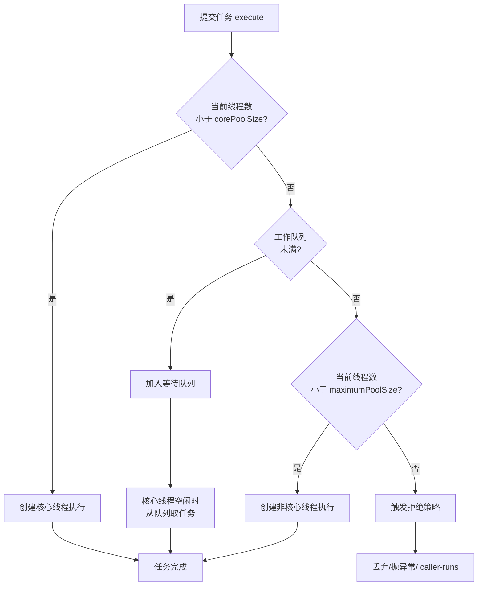

<!--
question:
  id: 01.java-thread-pool
  topic: 01.java
  difficulty: 未标
  frequency: 中频
  scenario_type: 架构困境
  tags: [01.java, thread, pool]
-->

# 线程池 7 大参数深度剖析

## 引子：一个银行网点的故事

想象一个银行网点：

- **核心员工（corePoolSize）**：5 个窗口常驻，随时服务
- **排队区（workQueue）**：最多坐 10 个人等号
- **临时工（maximumPoolSize）**：高峰期开 10 个窗口，但临时工最多等 60 秒没活就辞退
- **拒绝策略（handler）**：10 个窗口全满 + 10 人排队 = 再来人就拒绝

```java
new ThreadPoolExecutor(
    5,           // 核心员工
    10,          // 正式 + 临时工上限
    60L,         // 临时工空闲 60 秒辞退
    TimeUnit.SECONDS,
    new ArrayBlockingQueue<>(10),  // 排队区 10 个座位
    new ThreadPoolExecutor.AbortPolicy()  // 拒绝：直接赶走
);
```

线程池就像管理一个网点——**7 个参数决定了怎么用人、怎么排队、满了怎么办**。

---

## 一、核心原理

> 📚 **前置知识**：[线程池](../../../01.java/concurrency/README.md)

`ThreadPoolExecutor` 是 Java 并发包中最核心的线程池实现，其构造函数包含 7 个参数，共同定义了线程池的资源分配策略和拒绝行为。

### 7 大核心参数

| 参数 | 类型 | 作用 | 类比 |
|------|------|------|------|
| `corePoolSize` | int | 核心线程数（常驻线程） | 正式员工 |
| `maximumPoolSize` | int | 最大线程数（核心+临时） | 正式员工 + 临时工上限 |
| `keepAliveTime` | long | 非核心线程空闲存活时间 | 临时工的等待时长 |
| `unit` | TimeUnit | keepAliveTime 的时间单位 | 时间单位 |
| `workQueue` | BlockingQueue | 任务等待队列 | 候补区/排队区 |
| `threadFactory` | ThreadFactory | 线程创建工厂 | HR 招聘部门 |
| `handler` | RejectedExecutionHandler | 拒绝策略 | 满员时的应对方案 |

### 任务提交流程（execute 三步决策）

当调用 `executor.execute(task)` 时，线程池按以下顺序决策：

1. **当前运行线程数 < corePoolSize** → 创建新核心线程执行任务
2. **核心线程已满 && workQueue 未满** → 将任务放入等待队列
3. **队列已满 && 运行线程数 < maximumPoolSize** → 创建非核心线程执行
4. **达到最大线程数 && 队列已满** → 触发拒绝策略



### 4 种内置拒绝策略

| 策略类 | 行为 | 适用场景 |
|--------|------|----------|
| `AbortPolicy` | 直接抛出 RejectedExecutionException（默认） | 不允许丢失任务的严肃业务 |
| `CallerRunsPolicy` | 由调用线程（提交任务的线程）执行该任务 | 需要背压反馈，降低提交速率 |
| `DiscardPolicy` | 静默丢弃，不抛异常也不通知 | 可容忍丢失的非关键任务 |
| `DiscardOldestPolicy` | 丢弃队列中最老的任务，然后重试提交 | 希望保留最新任务的场景 |

---

## 二、源码剖析

### execute() 完整流程

```java
public void execute(Runnable command) {
    if (command == null) throw new NullPointerException();
    int c = ctl.get();
    // 第一步：核心线程未满，创建核心线程
    if (workerCountOf(c) < corePoolSize) {
        if (addWorker(command, true)) return;
        c = ctl.get();
    }
    // 第二步：核心线程已满，尝试入队
    if (isRunning(c) && workQueue.offer(command)) {
        int recheck = ctl.get();
        if (!isRunning(recheck) && remove(command))
            reject(command);
        else if (workerCountOf(recheck) == 0)
            addWorker(null, false);
    }
    // 第三步：队列已满，创建非核心线程
    else if (!addWorker(command, false))
        reject(command);  // 失败则拒绝
}
```

关键点：`addWorker` 使用 CAS 更新 `ctl`（AtomicInteger），确保线程安全地增加工作线程。

### Worker 线程模型

```java
private final class Worker extends AbstractQueuedSynchronizer implements Runnable {
    final Thread thread;      // 绑定的 Java 线程
    Runnable firstTask;       // 首个任务（可为 null）
    volatile long completedTasks;

    Worker(Runnable firstTask) {
        setState(-1);  // 禁止中断直到 runWorker 启动
        this.firstTask = firstTask;
        this.thread = getThreadFactory().newThread(this);
    }
    public void run() { runWorker(this); }
}
```

`Worker` 继承自 AQS，通过独占锁防止 `shutdown()` 时正在执行的任务被中断。

### runWorker() 核心循环

```java
final void runWorker(Worker w) {
    Thread wt = Thread.currentThread();
    Runnable task = w.firstTask;
    w.firstTask = null;
    w.unlock();  // 允许中断
    
    boolean completedAbruptly = true;
    try {
        // 主循环：先执行 firstTask，再从队列 getTask()
        while (task != null || (task = getTask()) != null) {
            w.lock();  // 获取锁，防止 shutdown 中断
            if ((runStateAtLeast(ctl.get(), STOP) ||
                 (Thread.interrupted() && runStateAtLeast(ctl.get(), STOP))) &&
                !wt.isInterrupted())
                wt.interrupt();
            try {
                beforeExecute(wt, task);
                task.run();  // 执行用户任务
                afterExecute(task, null);
            } finally {
                task = null;
                w.completedTasks++;
                w.unlock();
            }
        }
        completedAbruptly = false;
    } finally {
        processWorkerExit(w, completedAbruptly);  // 线程退出清理
    }
}
```

### getTask() 从队列拉取任务

```java
private Runnable getTask() {
    boolean timedOut = false;
    for (;;) {
        int c = ctl.get();
        int rs = runStateOf(c);
        
        // 线程池已停止或工作队列为空
        if (rs >= SHUTDOWN && (rs >= STOP || workQueue.isEmpty())) {
            decrementWorkerCount();
            return null;
        }
        
        int wc = workerCountOf(c);
        // 是否允许超时回收（核心线程默认不超时）
        boolean timed = allowCoreThreadTimeOut || wc > corePoolSize;
        
        if ((wc > maximumPoolSize || (timed && timedOut))
            && (wc > 1 || workQueue.isEmpty())) {
            if (compareAndDecrementWorkerCount(c))
                return null;
            continue;
        }
        
        try {
            // 带超时的 poll 或阻塞的 take
            Runnable r = timed ?
                workQueue.poll(keepAliveTime, TimeUnit.NANOSECONDS) :
                workQueue.take();
            if (r != null) return r;
            timedOut = true;
        } catch (InterruptedException retry) {
            timedOut = false;
        }
    }
}
```

非核心线程在 `keepAliveTime` 内未获取到任务时会返回 null，触发线程退出。

### 拒绝策略源码示例

```java
// AbortPolicy - 默认策略，直接抛异常
public void rejectedExecution(Runnable r, ThreadPoolExecutor e) {
    throw new RejectedExecutionException("Task " + r + " rejected from " + e);
}

// CallerRunsPolicy - 调用者线程执行
public void rejectedExecution(Runnable r, ThreadPoolExecutor e) {
    if (!e.isShutdown()) r.run();  // 直接在提交任务的线程中执行
}

// DiscardPolicy - 静默丢弃
public void rejectedExecution(Runnable r, ThreadPoolExecutor e) {}

// DiscardOldestPolicy - 丢弃最老任务后重试
public void rejectedExecution(Runnable r, ThreadPoolExecutor e) {
    if (!e.isShutdown()) {
        e.getQueue().poll();  // 丢弃队列头部（最老）任务
        e.execute(r);         // 重新提交当前任务
    }
}
```

---

## 三、常见陷阱

### Executors 四大工具类的 OOM 风险

阿里巴巴 Java 开发手册明确禁止使用 `Executors` 创建线程池：

#### 陷阱 1：FixedThreadPool / SingleThreadExecutor → 无界队列 OOM

```java
// 危险！LinkedBlockingQueue 默认容量 Integer.MAX_VALUE
public static ExecutorService newFixedThreadPool(int nThreads) {
    return new ThreadPoolExecutor(nThreads, nThreads,
        0L, TimeUnit.MILLISECONDS,
        new LinkedBlockingQueue<Runnable>());  // 无界队列
}
```

任务生产速度 > 消费速度时，队列无限增长，导致 `OutOfMemoryError: Java heap space`。

#### 陷阱 2：CachedThreadPool → 无限创建线程 OOM

```java
// 危险！maximumPoolSize = Integer.MAX_VALUE
public static ExecutorService newCachedThreadPool() {
    return new ThreadPoolExecutor(0, Integer.MAX_VALUE,
        60L, TimeUnit.SECONDS,
        new SynchronousQueue<Runnable>());
}
```

`SynchronousQueue` 不存储元素，每个新任务都会创建新线程，高并发下可能导致 `OutOfMemoryError: unable to create new native thread`。

### submit vs execute 异常处理差异

```java
// execute - 异常直接抛出到线程 UncaughtExceptionHandler
executor.execute(() -> {
    throw new RuntimeException("任务异常");  // 直接打印堆栈
});

// submit - 异常被 Future 吞掉，只有 get() 时才抛出
Future<?> future = executor.submit(() -> {
    throw new RuntimeException("任务异常");  // 静默失败！
});
future.get();  // 这里才抛出 ExecutionException
```

**核心区别**：`submit()` 内部将任务包装为 `FutureTask`，异常被捕获并存储在 `outcome` 字段中，只有在调用 `get()` 时才会以 `ExecutionException` 的形式重新抛出。

**最佳实践**：使用 `submit()` 时必须包裹 try-catch 处理 `ExecutionException`，或重写 `afterExecute()` 方法进行统一异常监控。

---

## 四、最佳实践

### 参数配置指南

| 场景 | corePoolSize | maximumPoolSize | workQueue | 说明 |
|------|-------------|-----------------|-----------|------|
| CPU 密集型 | N+1 | N+1 | ArrayBlockingQueue(100~1000) | 减少上下文切换 |
| IO 密集型 | 2N | 2N | LinkedBlockingQueue(有界) | 线程大部分时间在等待 IO |
| 混合型 | N / (1-阻塞系数) | 根据压测调整 | 有界队列 | 阻塞系数约 0.8~0.9 |

> N = CPU 核心数，可通过 `Runtime.getRuntime().availableProcessors()` 获取

### 动态线程池方案

生产环境推荐使用动态调参，无需重启即可调整线程池参数：

```java
// 通过 JMX 或配置中心动态修改
executor.setCorePoolSize(newCoreSize);
executor.setMaximumPoolSize(newMaxSize);
executor.setKeepAliveTime(newTime, unit);
```

主流方案：
- **美团 DynamicThreadPool**：结合配置中心实现秒级生效
- **Hippo4j**：支持多种线程池类型的动态管理
- **自研方案**：基于 Spring Cloud Config + @RefreshScope

### 优雅停机

```java
try {
    executor.shutdown();  // 不再接受新任务，等待已提交任务完成
    if (!executor.awaitTermination(60, TimeUnit.SECONDS)) {
        executor.shutdownNow();  // 强制中断所有任务
        if (!executor.awaitTermination(60, TimeUnit.SECONDS)) {
            log.error("线程池未能正常关闭");
        }
    }
} catch (InterruptedException e) {
    executor.shutdownNow();
    Thread.currentThread().interrupt();
}
```

**shutdown vs shutdownNow 对比**：

| 方法 | 行为 | 返回值 | 中断正在执行的任务 |
|------|------|--------|------------------|
| `shutdown()` | 平滑关闭，等待任务完成 | void | 否 |
| `shutdownNow()` | 立即关闭，尝试中断所有任务 | List<Runnable> | 是 |

### 线程命名规范

自定义 `ThreadFactory` 便于问题排查：

```java
ThreadFactory namedFactory = new ThreadFactoryBuilder()
    .setNameFormat("order-service-pool-%d")
    .setDaemon(true)
    .build();
```

---

## 五、面试话术（30 秒版）

> "线程池有 7 个核心参数：核心线程数、最大线程数、存活时间、时间单位、工作队列、线程工厂和拒绝策略。任务提交时，如果核心线程没满就创建核心线程；满了就进队列；队列满了但没到最大线程数就创建非核心线程；都满了就触发拒绝策略。阿里规范禁用 Executors 是因为 FixedThreadPool 用无界队列会 OOM，CachedThreadPool 最大线程数是 Integer.MAX_VALUE 也会 OOM。生产环境建议手动创建 ThreadPoolExecutor，配合有界队列和合适的拒绝策略，同时通过动态配置中心实现运行时调参。另外要注意 submit 提交的任务异常会被 Future 吞掉，必须调用 get 或者重写 afterExecute 来做监控。"

---

## 六、交叉引用

- 主模块：[`01.java`](../../../01.java/) — Java 知识体系
- [AQS](../aqs/README.md) — AbstractQueuedSynchronizer 详解
- [并发容器](../../../01.java/concurrency/concurrent-collections/README.md) — BlockingQueue 实现原理
- [JVM 内存](../../../01.java/jvm/README.md) — OOM 类型与排查
- [Spring 异步](../../../06.spring/08-annotations/scheduling-and-async.md) — @Async 线程池配置

## 相关章节

- 深度阅读：[`01.java`](../../01.java/README.md) — 主模块详细内容

← [返回: 咬文嚼字 · thread-pool](README.md)
