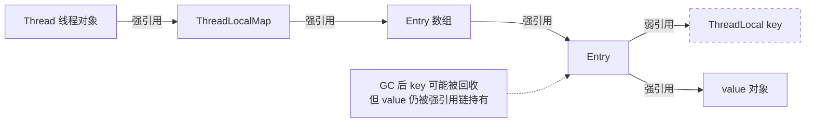

<!--
question:
  id: 01.java-threadlocal
  topic: 01.java
  difficulty: 未标
  frequency: 中频
  scenario_type: 反直觉代码
  tags: [01.java, ThreadLocal, threadlocal]
-->

# ThreadLocal 原理与内存泄漏

## 引子：一个诡异的串号问题

```java
// 线程池场景
ExecutorService pool = Executors.newFixedThreadPool(2);

ThreadLocal<String> userHolder = new ThreadLocal<>();

pool.submit(() -> {
    userHolder.set("用户A");
    System.out.println("当前用户：" + userHolder.get());
    // 忘记 remove()
});

pool.submit(() -> {
    // 另一个任务，复用同一个线程
    System.out.println("当前用户：" + userHolder.get());  // 输出"用户A"！！！
});
```

用户 A 的数据"串"到了另一个任务里！这就是线程池复用线程时 ThreadLocal 的经典 Bug。

更可怕的是：ThreadLocal 还会导致**内存泄漏**——

---

## 一、核心原理

> 📚 **前置知识**：[ThreadLocal](../../../01.java/concurrency/threadlocal/README.md) | [线程基础](../../../01.java/concurrency/thread-basics/README.md)

ThreadLocal 的核心设计思想是**空间换时间**：为每个线程维护一份独立的变量副本，避免多线程竞争带来的同步开销。其底层依赖 `java.lang.Thread` 类中的两个字段：

```java
// java.lang.Thread
ThreadLocal.ThreadLocalMap threadLocals = null;
ThreadLocal.ThreadLocalMap inheritableThreadLocals = null;
```

每个线程持有一个 `ThreadLocalMap` 实例，该 Map 以 `ThreadLocal<?>` 作为 key，以用户设置的值作为 value。由于 Map 属于线程私有，不同线程之间天然隔离。

### ThreadLocalMap 数据结构

`ThreadLocalMap` 是 `ThreadLocal` 的静态内部类，采用**开放定址法**解决哈希冲突（而非链表法）。其核心是一个 `Entry[]` 数组：

```java
static class Entry extends WeakReference<ThreadLocal<?>> {
    Object value;
    Entry(ThreadLocal<?> k, Object v) {
        super(k);  // key 是弱引用
        value = v; // value 是强引用
    }
}
```

关键点：
- **key 是弱引用**：`Entry` 继承自 `WeakReference<ThreadLocal<?>>`，当外部没有强引用指向某个 `ThreadLocal` 实例时，GC 可以回收该 key，此时 Entry 的 `get()` 返回 null。
- **value 是强引用**：即使 key 被回收，value 仍然被 Entry 强引用持有，而 Entry 又被 `ThreadLocalMap` 强引用持有，最终被线程对象强引用持有。只要线程存活（如线程池中的核心线程），value 就无法被 GC 回收——这就是**内存泄漏的根本原因**。

### set/get/remove 流程

```
set(value):
  1. 获取当前线程的 ThreadLocalMap
  2. 若 Map 不存在则创建
  3. 以当前 ThreadLocal 实例为 key，value 存入 Entry 数组
  4. 若 key 已存在则覆盖 value；若发现 stale entry（key==null）则清理并重新哈希

get():
  1. 获取当前线程的 ThreadLocalMap
  2. 若 Map 不存在或 key 对应的 Entry 不存在，返回 initialValue()
  3. 否则返回 Entry 中的 value

remove():
  1. 获取当前线程的 ThreadLocalMap
  2. 移除 key 对应的 Entry
  3. 触发 expungeStaleEntry 清理所有 stale entries
```

---

## 二、代码示例 / 源码剖析

### ThreadLocalMap.set() 源码（JDK 8）

```java
private void set(ThreadLocal<?> key, Object value) {
    Entry[] tab = table;
    int len = tab.length;
    int i = key.threadLocalHashCode & (len - 1); // 哈希定位

    for (Entry e = tab[i]; e != null; e = tab[i = nextIndex(i, len)]) {
        ThreadLocal<?> k = e.get();
        if (k == key) {       // key 相同，直接覆盖
            e.value = value;
            return;
        }
        if (k == null) {      // 遇到 stale entry，替换并清理
            replaceStaleEntry(key, value, i);
            return;
        }
    }
    tab[i] = new Entry(key, value); // 新建 Entry
    int sz = ++size;
    if (!cleanSomeSlots(i, sz) && sz >= threshold) // 清理 + 扩容判断
        rehash();
}
```

### ThreadLocalMap.getEntry() 源码

```java
private Entry getEntry(ThreadLocal<?> key) {
    int i = key.threadLocalHashCode & (table.length - 1);
    Entry e = table[i];
    if (e != null && e.get() == key)
        return e;
    else
        return getEntryAfterMiss(key, i, e); // 线性探测下一个
}
```

### ThreadLocalMap.remove() 源码

```java
private void remove(ThreadLocal<?> key) {
    Entry[] tab = table;
    int len = tab.length;
    int i = key.threadLocalHashCode & (len - 1);
    for (Entry e = tab[i]; e != null; e = tab[i = nextIndex(i, len)]) {
        if (e.get() == key) {
            e.clear();           // 清除弱引用
            expungeStaleEntry(i); // 清理 stale entry 并重新哈希
            return;
        }
    }
}
```

### 内存泄漏示意图



### expungeStaleEntry 清理机制

```java
private int expungeStaleEntry(int staleSlot) {
    Entry[] tab = table;
    int len = tab.length;
    
    // 1. 清除当前 stale entry
    tab[staleSlot].value = null;
    tab[staleSlot] = null;
    size--;
    
    // 2. 从 staleSlot 开始向后扫描，重新哈希所有受影响的 Entry
    Entry e;
    int i;
    for (i = nextIndex(staleSlot, len); (e = tab[i]) != null; i = nextIndex(i, len)) {
        ThreadLocal<?> k = e.get();
        if (k == null) { // 也是 stale entry，一并清除
            e.value = null;
            tab[i] = null;
            size--;
        } else {
            // 重新计算位置，可能需要移动
            int h = k.threadLocalHashCode & (len - 1);
            if (h != i) {
                tab[i] = null;
                while (tab[h] != null)
                    h = nextIndex(h, len);
                tab[h] = e;
            }
        }
    }
    return i;
}
```

清理策略包括：
- **replaceStaleEntry**：set 时发现 stale entry，立即替换
- **cleanSomeSlots**：set 后启发式清理部分 slot
- **expungeStaleEntry**：remove 或 rehash 时完整清理连续段

---

## 三、常见陷阱

### 1. 线程池复用导致的数据污染

```java
// ❌ 错误示范：线程池中未清理 ThreadLocal
ExecutorService executor = Executors.newFixedThreadPool(4);
for (int i = 0; i < 10; i++) {
    final int userId = i;
    executor.submit(() -> {
        UserContext.set(userId); // 设置用户上下文
        processOrder();          // 业务逻辑
        // 忘记调用 remove()！
    });
}
```

**问题**：线程池中的线程会被复用。线程 A 第一次执行时设置了 `userId=0`，第二次复用时若未清理，会读取到上次残留的 `userId=0`，造成**数据污染**。

```java
// ✅ 正确做法：finally 中确保清理
executor.submit(() -> {
    try {
        UserContext.set(userId);
        processOrder();
    } finally {
        UserContext.remove(); // 必须放在 finally 中
    }
});
```

### 2. 内存泄漏的真正原因

很多文章说"弱引用导致内存泄漏"，这是不准确的。**真正的原因是**：

- key 使用弱引用，GC 可以回收 key，使 Entry 变成 stale entry（key==null，但 value 仍存在）
- value 是强引用，只要线程存活且 Entry 未被清理，value 永远无法被 GC
- 如果线程长期存活（如线程池核心线程、Tomcat 工作线程），且从未调用 `remove()`，value 会一直累积

**关键结论**：即使不调用 `remove()`，JDK 也会在 set/get 过程中尝试清理 stale entries，但这种清理是**启发式的、不保证完全的**。只有显式调用 `remove()` 才能确保内存安全。

### 3. 为什么 remove() 必须放 finally

```java
// ❌ 错误：异常发生时 remove() 不会执行
UserContext.set(userId);
processOrder(); // 可能抛出异常
UserContext.remove();

// ✅ 正确：无论如何都会清理
try {
    UserContext.set(userId);
    processOrder();
} finally {
    UserContext.remove();
}
```

---

## 四、最佳实践

### 使用模式

```java
public class UserContext {
    private static final ThreadLocal<Integer> CONTEXT = ThreadLocal.withInitial(() -> null);
    
    public static void set(Integer userId) {
        CONTEXT.set(userId);
    }
    
    public static Integer get() {
        return CONTEXT.get();
    }
    
    public static void remove() {
        CONTEXT.remove();
    }
}
```

要点：
- 使用 `private static final` 修饰 ThreadLocal，避免匿名内部类导致的隐式引用
- 使用 `withInitial()` 提供默认值，避免 null 检查
- 始终在 `finally` 中调用 `remove()`

### InheritableThreadLocal vs TransmittableThreadLocal

| 特性 | ThreadLocal | InheritableThreadLocal | TransmittableThreadLocal |
|------|-------------|----------------------|------------------------|
| 父子线程传递 | ❌ | ✅（仅创建时） | ✅（运行时也可） |
| 线程池兼容 | ✅ | ❌（复用时无效） | ✅ |
| 适用场景 | 单线程内共享 | 简单父子传递 | 异步/线程池场景 |

**InheritableThreadLocal 的问题**：只在子线程**创建时**拷贝父线程的值。在线程池场景中，线程早已创建完毕，复用时无效。

**TransmittableThreadLocal（阿里开源）**：通过装饰器模式包装 `Runnable`/`Callable`，在执行前捕获父线程的上下文，执行后恢复，完美支持线程池场景。

```java
// TransmittableThreadLocal 使用示例
TransmittableThreadLocal<String> context = new TransmittableThreadLocal<>();

executor.submit(TtlRunnable.get(() -> {
    String value = context.get(); // 能正确获取父线程的值
}));
```

### 阿里巴巴 Java 开发手册规范

> 【强制】线程资源必须通过线程池提供，不允许在应用中自行显式创建线程。
> 【强制】SimpleDateFormat 是线程不安全的类，一般不要定义为 static 变量，如果定义为 static，必须加锁，或者使用 DateUtils 工具类。推荐使用 ThreadLocal 方式解决线程安全问题。
> 【推荐】使用 ThreadLocal 存储变量时，必须在使用完毕后调用 remove() 方法清理数据，防止内存泄漏。

---

## 五、面试话术（30 秒版）

> ThreadLocal 通过线程私有的 ThreadLocalMap 实现数据隔离，每个线程有自己的 Entry 数组，key 是 ThreadLocal 实例的弱引用，value 是用户数据的强引用。
>
> 内存泄漏的原因是：当 ThreadLocal 实例被 GC 回收后，key 变成 null，但 value 仍被 Entry 强引用持有。如果线程长期存活（如线程池），value 无法被回收，造成泄漏。
>
> 解决方案是在 finally 块中显式调用 remove()，它会清除 Entry 并触发 expungeStaleEntry 清理所有 stale entries。另外，在线程池场景中推荐使用 TransmittableThreadLocal 替代 InheritableThreadLocal，因为它支持运行时上下文传递。

---

## 六、交叉引用

- 主模块：[`01.java`](../../../01.java/) — Java 知识体系
- [并发基础](../../../01.java/concurrency/README.md) — 线程与锁机制
- [JVM 内存](../../../01.java/jvm/README.md) — 垃圾回收与引用类型
- [线程池](../thread-pool/README.md) — 线程池原理与实践

## 相关章节

- 深度阅读：[`01.java`](../../01.java/README.md) — 主模块详细内容

← [返回: 咬文嚼字 · threadlocal](README.md)
