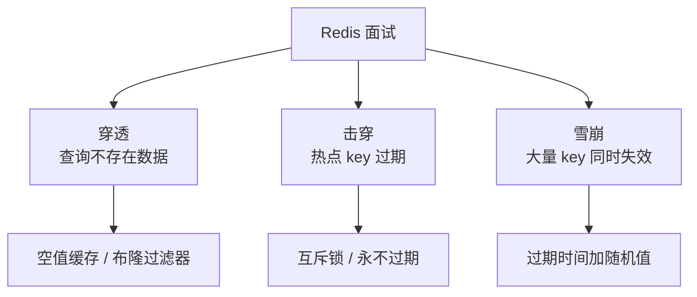

<!--
module:
  parent: split-hairs
  slug: 03.database
  type: article
  category: 高频面试题
  summary: 数据库高频面试题与细节深挖（MySQL / Redis / NoSQL）
question:
  id: 03.database-03.database
  topic: 03.database
  difficulty: ⭐⭐
  frequency: 高频
  scenario_type: 性能对比
  tags: [03.database]
-->

# 数据库咬文嚼字

> 数据库高频面试题与细节深挖，对齐主模块 [`03.database`](../../03.database/)。26 篇真题聚焦 MySQL（索引 / 锁 / 事务 / MVCC / 死锁 / JOIN）、Redis（单线程原理 / 持久化 / 淘汰 / 集群 / 大 Key）、NoSQL 三大方向的高频陷阱。

---

## 文章清单（共 26 题）

### MySQL 基础
| 主题 | 难度 | 核心问题 |
|------|------|---------|
| [COUNT(*) vs COUNT(1) vs COUNT(字段)](mysql-count/) | ⭐⭐ | 性能差异？最佳实践？ |
| [INT(4) 的含义](mysql-int-define/) | ⭐⭐ | 括号里的数字是长度还是显示宽度？ |
| [时间类型选择](mysql-time-types/) | ⭐⭐ | DATETIME / TIMESTAMP / DATE 选型 |
| [快速加索引](mysql-quickly-add-index/) | ⭐⭐⭐ | 大表在线加索引的方案 |

### MySQL 进阶
| 主题 | 难度 | 核心问题 |
|------|------|---------|
| [事务隔离级别](mysql-isolation/) | ⭐⭐⭐⭐ | RU / RC / RR / Serializable 详解 |
| [SQL 调优](mysql-tuning/) | ⭐⭐⭐⭐ | Explain 分析 + 索引优化 |
| [什么情况下会锁表](mysql-what-lock/) | ⭐⭐⭐⭐ | 行锁 / 表锁 / 间隙锁 |
| [SELECT * 查 2000 万行会炸内存吗](mysql-select-all-big-table/) | ⭐⭐⭐⭐ | JDBC 默认一次性 fetch all + 流式读取姿势 |
| [深分页 LIMIT 10000000,10 为什么慢](mysql-deep-pagination/) | ⭐⭐⭐⭐ | OFFSET 工作机制 + 主键范围分页 + 延迟关联 |
| [批量插入 batch 性能对比](mysql-batch-operation/) | ⭐⭐⭐⭐ | JDBC batch + rewriteBatchedStatements + LOAD DATA |
| [大事务的危害与拆分](mysql-large-transaction/) | ⭐⭐⭐⭐ | 5 大危害（锁/Undo/binlog/连接池/MVCC） + 拆分策略 |
| [索引失效的 10 种场景](mysql-index-failure/) | ⭐⭐⭐⭐⭐ | LIKE 左通配 / 函数 / 类型转换 / OR / 最左前缀 |

### MySQL 深入
| 主题 | 难度 | 核心问题 |
|------|------|---------|
| [MVCC 实现原理](mvcc/) | ⭐⭐⭐⭐⭐ | Read View + Undo Log |
| **🆕 [死锁排查](deadlock/)** | ⭐⭐⭐⭐ | 等待图检测 + SHOW ENGINE INNODB STATUS + 间隙锁死锁 + 5 大预防策略 |
| [B+ Tree 为什么适合数据库索引](bplus-tree/) | ⭐⭐⭐⭐⭐ | vs B-Tree / Hash |
| [MySQL 主从复制延迟](replication-lag/) | ⭐⭐⭐⭐ | 延迟原因与解决方案 |
| [MySQL JOIN 算法](mysql-join/) | ⭐⭐⭐⭐ | NLJ / BNL / Hash Join |

### 分库分表与高可用
| 主题 | 难度 | 核心问题 |
|------|------|---------|
| [分表扩容策略](sharding-resize/) | ⭐⭐⭐⭐⭐ | 翻倍扩容 + 双写过渡 + 灰度切换 + 回滚方案 |
| [垂直分表判定规范](vertical-table-split/) | ⭐⭐⭐⭐ | 30 字段拆不拆 + 5 指标判定 + Buffer Pool 原理 + 反模式 |

### Redis
| 主题 | 难度 | 核心问题 |
|------|------|---------|
| [缓存穿透 / 击穿 / 雪崩](cache-penetration-breakdown-avalanche/) | ⭐⭐⭐⭐⭐ | 面试必考三件套 |
| **🆕 [单线程为什么快](redis-single-thread/)** | ⭐⭐⭐⭐ | epoll/Reactor + Redis 6.0 多线程 + vs MySQL 对比 |
| [Redis 搜索能力](redis-search/) | ⭐⭐⭐ | Redis 如何做全文搜索？ |
| [Redis 持久化](redis-persistence/) | ⭐⭐⭐⭐ | RDB / AOF / 混合持久化 |
| [Redis 内存淘汰策略](redis-eviction/) | ⭐⭐⭐⭐ | 8 种淘汰策略详解 |
| [Redis 集群](redis-cluster/) | ⭐⭐⭐⭐ | Sentinel vs Cluster |
| [Redis 大 Key 问题](redis-big-key/) | ⭐⭐⭐⭐ | 发现与治理方案 |

---

## 核心概念速查

### RDBMS 核心概念树

```
关系型数据库
├── 存储引擎
│   ├── InnoDB     ← MySQL 默认，支持事务、行锁、外键
│   ├── MyISAM     ← 不支持事务，全文索引（MySQL 5.5 前默认）
│   └── 其他       ← PostgreSQL、Oracle、SQL Server
├── 索引
│   ├── B+ Tree    ← 最常用，聚簇 / 非聚簇
│   ├── Hash       ← 等值查询 O(1)，不支持范围
│   ├── Full-Text  ← 全文检索
│   └── 空间索引   ← GIS
├── 事务
│   ├── ACID       ← 原子性、一致性、隔离性、持久性
│   └── 隔离级别   ← RU / RC / RR / Serializable
├── 锁
│   ├── 粒度       ← 表锁 / 行锁 / 间隙锁 / 临键锁
│   └── 模式       ← 共享锁（S）/ 排他锁（X）/ 意向锁（IS/IX）
└── MVCC
    └── Read View + Undo Log → 实现 RC / RR 隔离级别
```

### NoSQL vs RDBMS

| 维度 | RDBMS | NoSQL |
|------|-------|-------|
| Schema | 固定、强约束 | 灵活、Schema-free 或弱约束 |
| 扩展方式 | 纵向（Scale-Up） | 横向（Scale-Out） |
| 事务 | 强一致性（ACID） | 最终一致性（BASE），部分支持 ACID |
| 查询语言 | SQL（标准化） | 各厂商自定义 API |
| 适用场景 | 金融、订单、强一致业务 | 缓存、会话、日志、内容管理、推荐 |

### Key-Value 数据库选型

| 数据库 | 数据结构 | 持久化 | 集群 | 典型场景 |
|--------|---------|--------|------|---------|
| **Redis** | String / Hash / List / Set / ZSet / Stream | RDB + AOF | Sentinel / Cluster | 缓存、排行榜、分布式锁、会话 |
| **Memcached** | 纯 String | 无 | 客户端分片 | 简单缓存、Session 共享 |
| **DynamoDB** | Key-Value / Document | 托管 | 全托管 | AWS 生态、游戏、IoT |
| **RocksDB** | 嵌入式 KV（LSM） | 本地磁盘 | 无 | 嵌入式存储引擎（Kafka、Flink 内部） |

### Redis 核心知识图谱

```
Redis
├── 数据结构
│   ├── String  → SDS（Simple Dynamic String）
│   ├── Hash    → ziplist / hashtable
│   ├── List    → quicklist（ziplist + 双向链表）
│   ├── Set     → intset / hashtable
│   ├── ZSet    → ziplist / skiplist + hashtable
│   └── Stream  → Radix Tree + 消费者组
├── 持久化
│   ├── RDB     → fork + COW（Copy-On-Write）
│   ├── AOF     → 追加写 + rewrite 压缩
│   └── 混合    → RDB 头 + AOF 增量（Redis 4.0+）
├── 高可用
│   ├── 主从复制 → 全量 + 增量（replication offset）
│   ├── Sentinel → 自动故障转移
│   └── Cluster  → 16384 哈希槽 + Gossip 协议
├── 内存管理
│   ├── 淘汰策略 → noeviction / allkeys-lru / volatile-lfu 等 8 种
│   └── 内存碎片 → active defrag（jemalloc）
└── 高级特性
    ├── 事务      → MULTI / EXEC（乐观锁 WATCH）
    ├── Lua 脚本  → 原子执行
    ├── Pub/Sub   → 发布订阅
    └── Module    → RediSearch / RedisJSON / RedisTimeSeries
```

### 缓存穿透 / 击穿 / 雪崩关系图



## 学习路径

1. **入门**（3 天）：COUNT 区别 + INT(4) + 时间类型
2. **进阶**（1 周）：索引 + 锁 + 事务隔离
3. **冲刺面试**：重点看"索引失效"、"缓存三件套"、"MVCC"、"B+ Tree"、"SELECT * 内存陷阱"、"深分页"、"批量插入"、"大事务"

## 相关章节

- 主模块：[`note/03.database`](../../03.database/) — 数据库知识体系
- 相关章节：[`04.system-design`](../04.system-design/)（高性能设计）

← [返回咬文嚼字（高频面试题）](../README.md)
