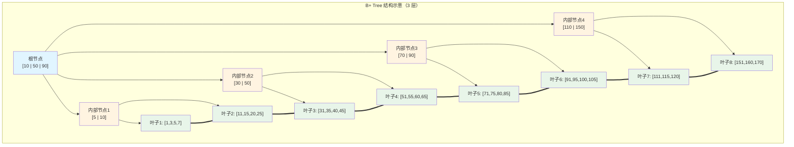

# B+ Tree 为什么成为数据库索引的标准

## 引子：1 亿条数据，3 次磁盘 IO

```sql
SELECT * FROM users WHERE id = 12345678;

-- 1 亿条数据，B+ Tree 只需 3-4 次磁盘 IO！
```

为什么是 B+ Tree？而不是 B-Tree？Hash？二叉搜索树？

关键数字：
- **B+ Tree**：1 亿条数据 → 树高 3-4 → **3-4 次磁盘 IO**
- **B-Tree**：同样数据 → 树高 4-5 → 更多 IO
- **Hash**：O(1) 等值查询快，但**无法范围查询**
- **二叉搜索树**：极端情况退化为链表 → O(n)

B+ Tree 的精妙设计：**非叶子节点只存键（不存数据）+ 叶子节点形成链表**，同时解决了"低 IO"和"范围查询"两个问题。

---

> 📚 **前置知识**：[数据库索引](../../03.database/04-index/README.md)

## 一、核心原理

B+ Tree 是一种多路平衡搜索树，是 B-Tree 的变体，核心特征：

- **所有数据存储在叶子节点**：非叶子节点仅存储键和子节点指针
- **叶子节点形成有序链表**：支持高效的范围查询和顺序遍历
- **节点内键值有序**：每个节点内的键按升序排列，支持二分查找
- **平衡性保证**：所有叶子节点位于同一层

### 与其他数据结构的对比

| 维度 | B+ Tree | B-Tree | Hash Index | 二叉搜索树 |
|------|---------|--------|------------|------------|
| 数据存储位置 | 仅叶子节点 | 所有节点 | 哈希桶 | 所有节点 |
| 范围查询 | O(log n + k) | O(log n + k·log n) | 不支持 | O(n) 最坏退化 |
| 等值查询 | O(log n) | O(log n) | O(1) | O(log n) ~ O(n) |
| 适合磁盘 IO | ✅ 最优 | ⚠️ 次优 | ❌ 不适合 | ❌ 不适合 |

**B-Tree 不如 B+ Tree**：B-Tree 非叶子节点也存数据，扇出变小，树高增加。B+ Tree 将数据全部下沉到叶子节点，最大化扇出。

**Hash Index 不适合通用索引**：无法支持范围查询、无法利用排序、哈希冲突导致性能不稳定。

**二叉搜索树不适合磁盘**：二叉树扇出为 2，2000 万条数据树高约 25 层，需要 25 次磁盘 IO。B+ Tree 相同数据量下树高仅 3-4 层。

---

## 二、为什么 B+ Tree 最适合磁盘 IO

### 2.1 磁盘 IO 的特性

磁盘存储的核心约束：**随机 IO 极慢，顺序 IO 较快**。机械硬盘随机读写延迟约 10ms，SSD 虽提升到微秒级，但与内存纳秒级访问仍有三个数量级差距。数据库索引设计的核心目标是**最小化随机 IO 次数**。

### 2.2 B+ Tree 的 IO 优化机制



**关键优化一：最大化扇出，最小化树高**

扇出公式：`fanout = floor(page_size / (key_size + pointer_size))`

以 InnoDB 16KB 页为例：`page_size=16384`，`key_size=8`（BIGINT），`pointer_size=6`，则：
```
fanout = floor(16384 / 14) ≈ 1170
```

- 第 1 层（根）：1 个节点，管理 1170 个子节点
- 第 2 层：1170 个节点，管理 1170² ≈ 137 万个叶子节点
- 第 3 层：137 万个叶子节点

**3 层 B+ Tree 可管理超 1 亿条记录**，同等数据量下二叉树需 27 层。

**关键优化二：叶子节点链表支持范围查询**

执行 `WHERE id BETWEEN 100 AND 200` 时：先找到 key=100 的叶子节点（logₙ 次 IO），再沿链表顺序扫描直到 key>200（纯内存遍历）。范围查询复杂度从 O(k·log n) 降至 O(log n + k)。

**关键优化三：预读与缓存友好**

数据库以页为单位 IO，B+ Tree 节点对齐页边界。访问某节点时整页加载到 Buffer Pool，节点内所有键受益于空间局部性。

---

## 三、聚簇索引 vs 非聚簇索引

### 3.1 聚簇索引（Clustered Index）

InnoDB 表数据文件按 B+ Tree 组织，使用**主键**作为索引键：

- **叶子节点存储完整数据行**：包含该行所有列的值
- **数据物理顺序与主键逻辑顺序一致**
- **每张表有且仅有一个聚簇索引**
- **主键即数据**：`SELECT * FROM t WHERE id = ?` 只需一次聚簇索引查找

### 3.2 非聚簇索引 / 二级索引（Secondary Index）

二级索引以**非主键列**构建的 B+ Tree：

- **叶子节点存储主键值**，而非完整数据行
- **查询需要"回表"**：先在二级索引找主键，再到聚簇索引查完整数据
- **一张表可有多个二级索引**

```
二级索引结构（以 name 列为例）：
[name: M | name: Z] → [name: F] [name: R] [name: ZZ]
→ [PK=8] [PK=25] [PK=55] [PK=80] [PK=1] [PK=100]

回表过程：
1. 在 name 索引中找到 PK=8
2. 拿 PK=8 去聚簇索引查完整行
```

### 3.3 覆盖索引（Covering Index）

当查询所需列都在二级索引中时，可**避免回表**：

```sql
SELECT name, age FROM users WHERE name = 'Alice';  -- 覆盖索引，无需回表
SELECT name, age, email FROM users WHERE name = 'Alice';  -- 需要回表
```

---

## 四、深度计算示例

假设：`page_size=16KB=16384`，`key_size=8`（BIGINT），`pointer_size=6`，`data_size=200 bytes`，`n=20,000,000`。

**内部节点扇出**：
```
fanout = floor(16384 / 14) = 1170
```

**叶子节点容量**（实际可用约 14KB）：
```
records_per_leaf = floor(14000 / 200) = 70
```

**所需叶子节点数**：
```
leaf_count = ceil(20,000,000 / 70) = 285,715
```

**树高计算**：
- 第 1 层：1 个节点，管理 1170 个子节点
- 第 2 层：1170 个节点，管理 1,368,900 个节点
- 第 3 层：需要 285,715 个叶子，1,368,900 > 285,715，3 层足够

验证：`第2层 = ceil(285715/1170) = 245`，`第1层 = ceil(245/1170) = 1`

**结论：2000 万数据只需 3 层 B+ Tree，查询最多 3 次磁盘 IO。**

10 亿数据：`leaf_count=14,285,715`，`第3层=12,210`，`第2层=11`，`第1层=1`，共 4 层。

---

## 五、常见陷阱

### 5.1 页分裂（Page Split）

向已满的叶子节点插入新记录时，InnoDB 将节点分裂为两个，各填充约 50%：

```
分裂前：[10, 20, 30, 40, 50]  ← 插入 25
分裂后：[10, 20] + [25, 30, 40, 50]
```

**代价**：产生新页增加碎片、更新父节点指针、可能连锁分裂、降低写入性能。

### 5.2 自增主键 vs UUID

| 维度 | 自增主键 | UUID |
|------|----------|------|
| 插入模式 | 顺序追加到最新页 | 随机插入，分散到任意页 |
| 页分裂频率 | 几乎为零 | 频繁 |
| 索引碎片 | 低 | 高（可达 70%+） |
| 存储空间 | 8 bytes（BIGINT） | 36 bytes（字符串） |

**UUID 的问题**：
1. **无序性**：UUID v4 完全随机，每次插入都可能触发页分裂
2. **存储空间大**：36 bytes 是 BIGINT 的 4.5 倍，每页容纳记录减少
3. **聚簇索引放大效应**：二级索引存主键值，主键越大，二级索引占用越大

**最佳实践**：优先使用 `AUTO_INCREMENT BIGINT`；必须用 UUID 时采用 `UUID v7`（时间有序）或 `UUID_TO_BIN()` 转 BINARY(16)。

### 5.3 索引过宽

联合索引键总长度影响扇出：`fanout = page_size / (sum(key_columns_size) + pointer_size)`

若联合索引含 5 个 VARCHAR(255) 列，每列平均 100 bytes：`fanout = 16384 / 506 ≈ 32`。扇出从 1170 降到 32，树高从 3 层增至 4-5 层。

**建议**：控制联合索引列数和长度；使用前缀索引：`INDEX idx_email_prefix (email(10))`

---

## 六、面试话术（30 秒版）

> "B+ Tree 成为数据库索引标准，核心在于它对磁盘 IO 的极致优化。
>
> 第一，非叶子节点只存键不存数据，使每个节点能容纳更多键，扇出更大。以 InnoDB 16KB 页为例，扇出能达到 1000+，3 层树就能管理上亿数据，查询只需 3 次 IO。
>
> 第二，叶子节点用链表串起来，范围查询只需找到起点然后顺序扫描，不需像 B-Tree 那样反复回溯。
>
> 第三，InnoDB 用聚簇索引组织数据，主键 B+ Tree 叶子直接存完整行，二级索引叶子存主键需回表。若查询列都在索引里还能走覆盖索引避免回表。
>
> 实际使用中，自增主键能避免页分裂，而 UUID 这种随机键会导致大量页分裂和碎片，应尽量避免。"

---

## 七、交叉引用

- 主模块：[`03.database`](../../../03.database/) — 数据库知识体系
- [索引设计](../../../03.database/04-index/README.md) — 索引设计原则与最佳实践
