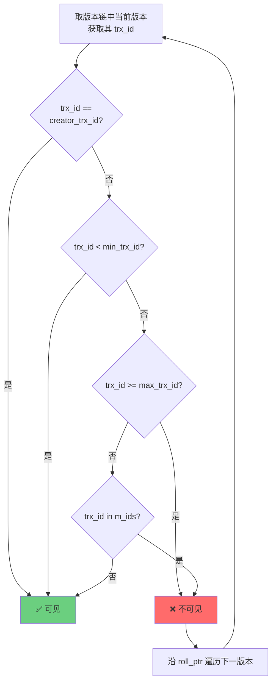

<!--
question:
  id: 03.database-mvcc
  topic: 03.database
  difficulty: ⭐⭐⭐⭐⭐
  frequency: 中频
  scenario_type: 反直觉代码
  tags: [03.database, MVCC, mvcc]
-->

# MVCC 实现原理深度剖析

## 引子：读写互不阻塞的秘密

```sql
-- 事务 A（读操作，耗时 10 秒）
BEGIN;
SELECT * FROM accounts WHERE id = 1;  -- 读取余额 = 100

-- 与此同时，事务 B（写操作）
BEGIN;
UPDATE accounts SET balance = 200 WHERE id = 1;  -- 修改余额
COMMIT;

-- 事务 A 继续读
SELECT * FROM accounts WHERE id = 1;  -- 还是读到 100！
COMMIT;
```

事务 B 修改了数据，事务 A 为什么还是读到旧值？

传统数据库用**锁**解决冲突——读锁阻塞写、写锁阻塞读。但 MySQL InnoDB 用了更优雅的方案：**MVCC（多版本并发控制）**。

数据有多个版本，每个事务看到自己"该看到"的版本。读写互不阻塞。

---

> 📚 **前置知识**：[事务](../../../03.database/03-transaction/README.md) | [隔离级别](../mysql-isolation/README.md)

## 一、核心原理

**MVCC（Multi-Version Concurrency Control）** 是 InnoDB 存储引擎实现高并发读写的核心技术。其本质思想是：**每一行数据都保留多个历史版本**，事务在读取时根据自身启动时刻选择一个合适的"快照版本"。

```
MVCC = 隐藏列（trx_id / roll_ptr）+ Undo Log 版本链 + Read View 可见性判断
```

三个组件协同工作：

| 组件 | 作用 |
|------|------|
| **隐藏列** | 每行记录附加的事务 ID 和回滚指针，标识版本归属 |
| **Undo Log** | 记录数据的历史版本，通过回滚指针串联成版本链 |
| **Read View** | 事务启动时生成的"快照视图"，用于判断哪个版本对当前事务可见 |

⭐⭐⭐⭐⭐ 深度提示：MVCC 只作用于**快照读**（普通 SELECT），**当前读**（SELECT FOR UPDATE、UPDATE、DELETE）仍需加锁。

---

## 二、Undo Log 版本链

### 2.1 每行记录的隐藏列

InnoDB 聚簇索引的每一行记录中，除了用户定义的列之外，还包含三个系统添加的隐藏列：

| 隐藏列 | 大小 | 含义 |
|--------|------|------|
| **DB_TRX_ID** | 6 字节 | 最近修改该行记录的事务 ID |
| **DB_ROLL_PTR** | 7 字节 | 回滚指针，指向 Undo Log 中的上一个版本 |
| **DB_ROW_ID** | 6 字节 | 当表没有主键时，InnoDB 自动生成的行 ID |

### 2.2 Undo Log 版本链结构

当一个事务修改某行数据时，InnoDB 会执行以下操作：
1. 将旧版本数据写入 Undo Log
2. 设置新记录的 `DB_TRX_ID` 为当前事务 ID
3. 设置新记录的 `DB_ROLL_PTR` 指向 Undo Log 中的旧版本

如此形成一条**从新版本到旧版本的单向链表**：


**关键特性**：版本链按时间倒序排列；每次更新都会在链头插入新版本；旧版本由 Purge 线程异步回收。

---

## 三、Read View 机制

### 3.1 Read View 的四个核心字段

| 字段 | 类型 | 含义 |
|------|------|------|
| **m_ids** | List\<BIGINT\> | 生成 Read View 时，系统中所有**活跃但未提交**的事务 ID 集合 |
| **min_trx_id** | BIGINT | m_ids 中的最小值 |
| **max_trx_id** | BIGINT | 系统下一个将要分配的事务 ID |
| **creator_trx_id** | BIGINT | 创建该 Read View 的事务自身的 ID |

```
示例：事务 T1 (trx_id=100) 执行 SELECT 时，T2(98)、T3(101)、T4(102) 未提交
则 T1 的 Read View 为：
{ m_ids: [98, 101, 102], min_trx_id: 98, max_trx_id: 103, creator_trx_id: 100 }
```

### 3.2 可见性判断算法（四步流程）



**四步判断规则**：

| 步骤 | 判断条件 | 结果 | 语义解释 |
|------|----------|------|----------|
| 1 | `trx_id == creator_trx_id` | ✅ 可见 | 当前事务自己修改的数据 |
| 2 | `trx_id < min_trx_id` | ✅ 可见 | 修改事务在 Read View 创建前已提交 |
| 3 | `trx_id >= max_trx_id` | ❌ 不可见 | 该版本由未来事务生成 |
| 4 | `trx_id in m_ids` | ❌ 不可见 | 修改事务在 Read View 创建时仍活跃 |
| 4 | `trx_id not in m_ids` | ✅ 可见 | 修改事务在 Read View 创建前已提交 |

---

## 四、RC vs RR 的区别

MVCC 在 **READ COMMITTED（RC）** 和 **REPEATABLE READ（RR）** 两种隔离级别下的行为差异，核心在于 **Read View 的创建时机不同**。

### 4.1 RC：每次 SELECT 重建 Read View

在 RC 级别下，**每次执行 SELECT 语句时都会重新创建一个新的 Read View**。这意味着事务能够看到其他事务在两次 SELECT 之间提交的修改，出现**不可重复读**现象。

### 4.2 RR：只在第一次 SELECT 时创建 Read View

在 RR 级别下，**Read View 在事务第一次执行 SELECT 时创建，之后整个事务复用同一个 Read View**。这保证了事务在整个生命周期内看到的数据快照一致。

### 4.3 对比总结

| 维度 | RC | RR |
|------|----|-----|
| Read View 创建时机 | 每次 SELECT | 第一次 SELECT |
| 是否可重复读 | ❌ 否 | ✅ 是 |
| 默认隔离级别 | PostgreSQL、Oracle | MySQL InnoDB |

---

## 五、常见陷阱

### 5.1 MVCC 只解决快照读，不解决当前读

MVCC 的可见性判断仅适用于**快照读**（Snapshot Read），即普通的 `SELECT ... FROM` 语句。**当前读**（SELECT FOR UPDATE、UPDATE、DELETE）需要加锁。

| 类型 | SQL 示例 | 是否使用 MVCC | 是否需要加锁 |
|------|----------|---------------|--------------|
| **快照读** | `SELECT * FROM t` | ✅ 是 | ❌ 否 |
| **当前读** | `SELECT ... FOR UPDATE` | ❌ 否 | ✅ 是 |
| **当前读** | `UPDATE / DELETE / INSERT` | ❌ 否 | ✅ 是 |

### 5.2 MVCC 本身不解决幻读，需配合 Gap Lock

**幻读（Phantom Read）** 指的是在同一事务内，相同条件的查询在不同时间点返回了不同数量的行。

**RR 级别下如何防止幻读？** MySQL InnoDB 在 RR 级别下采用 **MVCC + Gap Lock（间隙锁）** 的组合策略：

```
当前读（SELECT FOR UPDATE / UPDATE / DELETE）：
├── Record Lock（记录锁）：锁定已有的具体记录
├── Gap Lock（间隙锁）：锁定记录之间的间隙，防止插入
└── Next-Key Lock = Record Lock + Gap Lock
快照读（普通 SELECT）：
└── MVCC：通过 Read View 过滤掉新插入的行
```

**总结**：快照读的幻读预防靠 MVCC；当前读的幻读预防靠 Gap Lock。

### 5.3 Undo Log 膨胀与 Purge 线程

由于 MVCC 需要保留历史版本，频繁的 UPDATE/DELETE 操作会导致 Undo Log 不断积累。InnoDB 通过 **Purge 线程** 异步清理不再需要的旧版本。长事务会阻塞 Purge，导致 Undo Log 膨胀。

**生产建议**：避免长时间运行的事务，及时 COMMIT/ROLLBACK。

---

## 六、面试话术（30 秒版）

> "MVCC 是多版本并发控制，InnoDB 通过**隐藏列 + Undo Log 版本链 + Read View** 实现非锁定快照读。
>
> 每行记录有 `trx_id` 和 `roll_ptr` 两个隐藏列，`roll_ptr` 把历史版本串成链表。事务读取时，用 Read View 做可见性判断：先查是不是自己改的，再查修改事务是否在快照前已提交，通过四步规则找到第一个可见版本。
>
> RC 和 RR 的核心区别是 Read View 创建时机：RC **每次 SELECT 重建**，所以能看到别人刚提交的修改；RR **只在第一次 SELECT 创建**，之后复用，保证可重复读。
>
> 注意 MVCC 只管快照读，`SELECT FOR UPDATE` 这种当前读还是要加锁的。另外 RR 下防止幻读靠的是 **MVCC + Gap Lock** 组合，不是 MVCC 单独完成的。"

**高频追问应对**：

| 追问 | 要点回答 |
|------|----------|
| Read View 存在哪里？ | 内存中，事务对象的一部分 |
| 长事务有什么危害？ | 阻塞 Purge 线程，Undo Log 膨胀 |
| RR 下一定没有幻读吗？ | 快照读没有；当前读靠 Gap Lock 防止 |

---

## 七、交叉引用

- **主模块**：[`03.database`](../../../03.database/) — 数据库知识体系
- **相关**：[事务隔离](../../../03.database/03-transaction/README.md) — 事务隔离级别详解
- 🆕 **相关面试题**：[死锁排查](../deadlock/README.md) — 等待图检测 + 间隙锁死锁 + 线上排查 5 步法
- **延伸**：[MySQL 核心](../../../03.database/05-mysql/README.md) — InnoDB 锁机制与 MVCC

## 相关章节

- 深度阅读：[`03.database`](../../03.database/README.md) — 主模块详细内容

← [返回: 咬文嚼字 · mvcc](README.md)
