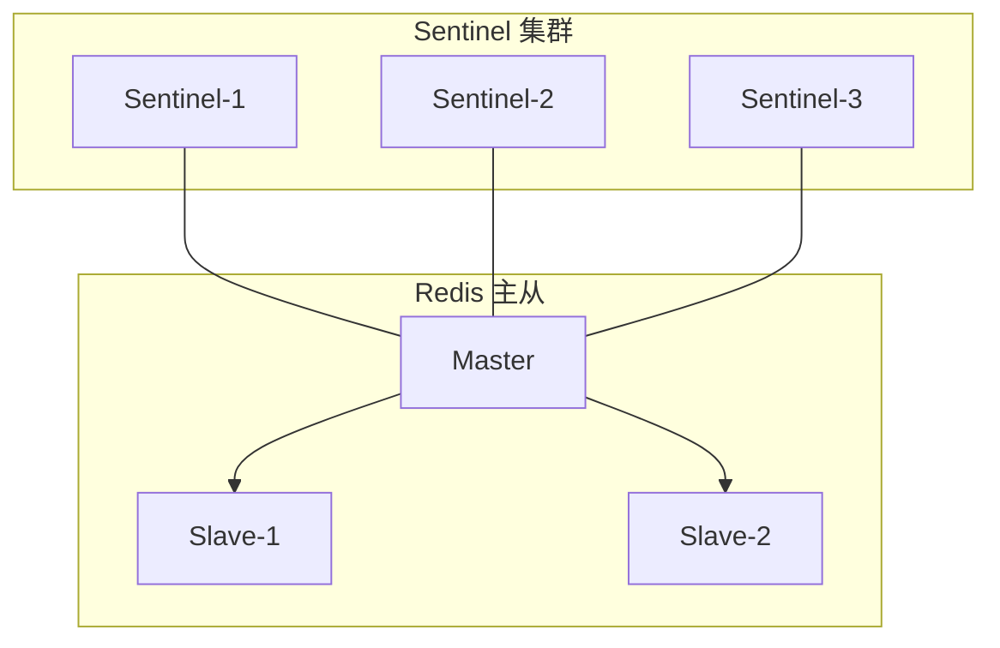
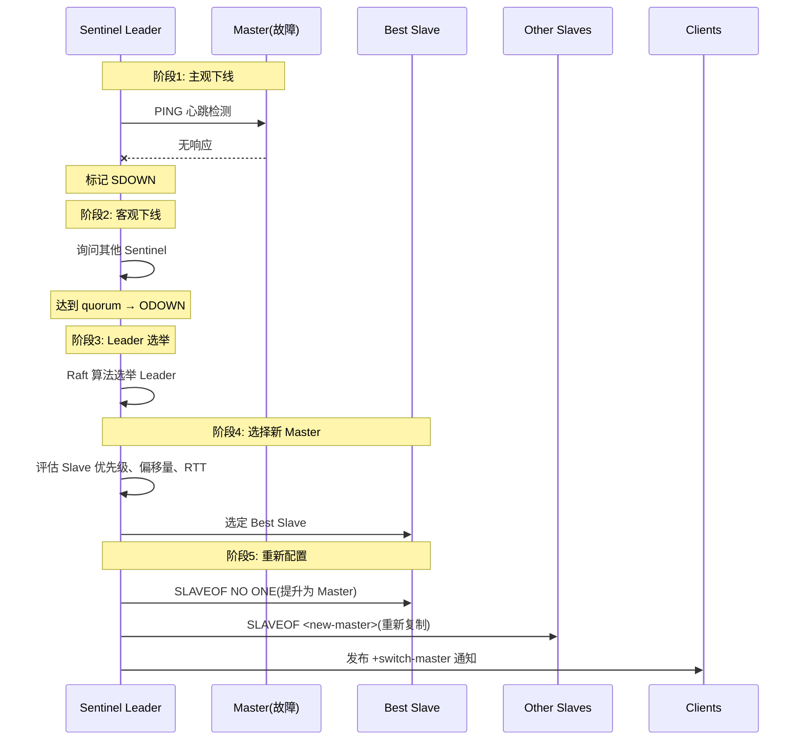
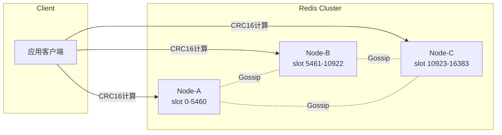
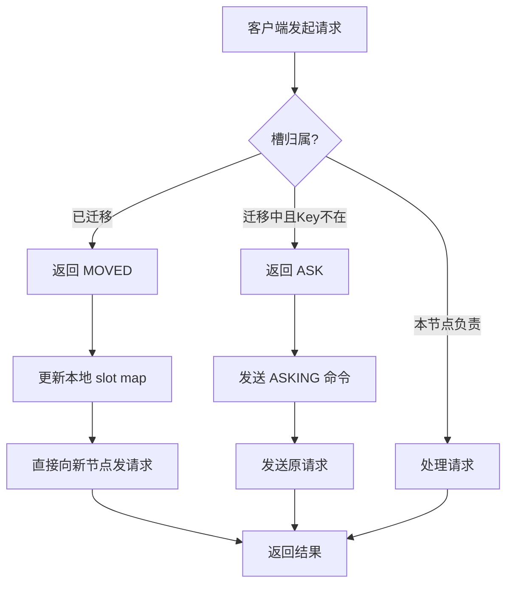

# Redis 集群方案深度对比

> 一句话：Sentinel 解决高可用，Cluster 解决水平扩展；前者是"主从+自动故障转移"，后者是"分片+去中心化"。

---

## 一、核心原理

Redis 集群演进的三个阶段：


**主从复制**：Master 负责写，Slave 负责读和备份。问题：Master 挂了需人工切换。

**Sentinel**：在主从之上增加监控、通知、自动故障转移。解决"高可用"，但未解决"单机容量上限"。

**Cluster**：引入分片（Sharding），数据分散到多节点。每节点只存部分数据，突破单机内存限制。

---

## 二、Sentinel（哨兵）

### 2.1 架构组成

Sentinel 是特殊的 Redis 实例，独立运行，不存业务数据，只负责监控和管理。



### 2.2 核心配置参数

| 参数 | 含义 | 典型值 |
|------|------|--------|
| `sentinel monitor <name> <ip> <port> <quorum>` | 监控 Master，quorum 是判定主观下线所需最少 Sentinel 数 | quorum = N/2+1 |
| `down-after-milliseconds` | 多久无响应判定为主观下线（SDOWN） | 30000ms |
| `failover-timeout` | 故障转移超时时间 | 180000ms |
| `parallel-syncs` | 故障转移后同时同步新 Master 的 Slave 数 | 1 |

**Quorum**：假设有 5 个 Sentinel，quorum 设为 3。当至少 3 个 Sentinel 认为 Master 不可达时，触发客观下线（ODOWN）。

### 2.3 故障转移流程



**五阶段详解**：

1. **主观下线（SDOWN）**：单个 Sentinel 连续 `down-after-milliseconds` 毫秒未收到 Master 的 PONG，标记 SDOWN。
2. **客观下线（ODOWN）**：达到 quorum 票数则标记 ODOWN。
3. **Leader 选举**：Raft 算法选出 Leader。
4. **新 Master 选择**：排除断开连接超时的 Slave → 选 `slave-priority` 最高 → 选复制偏移量最大 → 选 runId 最小。
5. **重新配置**：对选中 Slave 执行 `SLAVEOF NO ONE`，对其他 Slave 执行 `SLAVEOF <new-master>`。

---

## 三、Cluster（集群）

### 3.1 分片原理

Redis Cluster 将数据集划分为 **16384 个槽**（0-16383）。每 Master 负责一部分槽：

```
slot = CRC16(key) % 16384
```



### 3.2 Hash Tag（哈希标签）

默认 `user:1:name` 和 `user:1:age` 会哈希到不同槽。如需批量操作，用花括号包裹部分作为哈希依据：

```
{user}.name → CRC16("user") % 16384
{user}.age  → CRC16("user") % 16384  ← 同槽！
```

只要花括号内内容相同，整个 Key 就分配到同槽。对需要原子操作的场景很关键。

**注意**：无花括号则对整个 Key 哈希；只有左或右花括号视为普通字符；嵌套 `{a{b}c}` 取最外层。

### 3.3 Gossip 协议

Cluster 节点间通过 Gossip 协议交换状态，实现去中心化元数据同步。

**四种消息类型**：PING（探测存活）、PONG（响应）、MEET（初次握手）、FAIL（广播故障）。每节点每秒随机选 5 个节点发 PING。

---

## 四、对比表格

| 维度 | Sentinel | Cluster |
|------|----------|---------|
| **数据分布** | 全量复制 | 分片存储 |
| **最大容量** | 受限于单机内存 | 理论上限 16384 × 单机内存 |
| **扩展性** | 只能垂直扩展 | 支持水平扩展 |
| **多数据库** | 支持 16 个数据库 | **仅支持 db0** |
| **事务支持** | 完整支持 | 仅支持单槽内事务 |
| **批量操作** | 支持任意 Key | 要求 Key 在同槽 |
| **故障转移时间** | 30-60 秒 | 约 1-3 秒 |
| **适用场景** | 中小规模 | 大规模，海量数据 |

**选型建议**：数据量 < 单机内存 70% 用 Sentinel；数据量 > 50GB 用 Cluster。

---

## 五、客户端重定向

### 5.1 MOVED（永久迁移）

节点收到不属于自己负责槽的请求时，返回 `-MOVED <slot> <ip>:<port>`。客户端应更新本地槽映射表。

### 5.2 ASK（临时迁移）

节点收到正在迁移中槽的请求，但该 Key 尚未迁移过去时，返回 `-ASK <slot> <ip>:<port>`。

**正确流程**：先向目标节点发送 `ASKING`，再发送原请求。**关键区别**：ASK 不更新本地槽映射。

### 5.3 重定向流程对比



---

## 六、常见陷阱

### 6.1 不支持多数据库

Cluster **只有一个数据库（db0）**，`SELECT` 不可用。这是设计决策。

**迁移方案**：用 Key 前缀区分不同业务，如 `order:{id}`、`user:{id}`。

### 6.2 批量操作的 Slot 限制

`MGET`、`MSET`、`DEL` 等多 Key 命令要求所有 Key 必须在**同一槽**，否则报错：

```
(error) CROSSSLOT Keys in request don't hash to the same slot
```

**解决方案**：用 Hash Tag 强制相关 Key 落入同槽。

```redis
# 错误示例：可能在不同槽
MGET user:1:name user:1:age

# 正确示例：保证在同槽
MGET {user:1}.name {user:1}.age
```

### 6.3 大 Key（Big Key）问题

Cluster 环境下大 Key 危害被放大：迁移困难、内存不均、网络阻塞。**预防**：用 `redis-cli --bigkeys` 定期扫描。

### 6.4 事务局限性

Cluster 中 `MULTI/EXEC` 只能操作**同槽内的 Key**。

### 6.5 Gossip 延迟

大规模集群（> 1000 节点）中，元数据传播可能有秒级延迟。**缓解**：控制集群规模不超过 1000 节点。

---

## 七、面试话术（30 秒版）

> "Redis Sentinel 和 Cluster 的核心区别在于：Sentinel 解决高可用，Cluster 解决水平扩展。
>
> Sentinel 基于主从复制，通过哨兵集群监控 Master 状态，故障时自动选举新 Master。优点：配置简单；缺点：数据未分片，受限于单机内存。
>
> Cluster 采用 16384 个虚拟槽的分片机制，每 Master 负责一部分槽，数据通过 CRC16 哈希分布。节点间用 Gossip 协议同步状态。但 Cluster 只支持 db0，批量操作要求 Key 在同槽（可用 Hash Tag 解决）。
>
> 选型：数据量不大、追求简单用 Sentinel；数据量大、需水平扩展用 Cluster。"

---

## 八、交叉引用

- 主模块：[`03.database`](../../../03.database/) — 数据库知识体系
- 相关笔记：
  - [Redis 大Key问题](../redis-big-key/README.md)
  - [Redis 持久化机制](../redis-persistence/README.md)
  - [Redis 缓存穿透/击穿/雪崩](../redis/cache-penetration-breakdown-avalanche/README.md)
  - [分布式锁实现](../../../04.system-design/02-distributed/distributed-lock/README.md)
