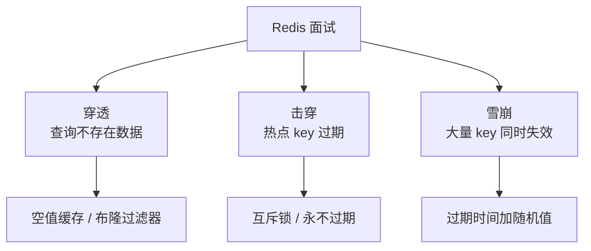

<!--
question:
  id: 03.database-redis
  topic: 03.database
  difficulty: 未标
  frequency: 中频
  scenario_type: 反直觉代码
  tags: [03.database, Redis, redis]
-->

# Redis 面试题专题

> 13.split-hairs 中 Redis 相关的面试深度剖析文章导航。

---

## 导航

| 序号 | 主题 | 核心问题 |
|------|------|---------|
| 1 | [缓存穿透/击穿/雪崩](cache-penetration-breakdown-avalanche/README.md) | 面试必考三件套：三大问题的原理与防御方案 |
| 2 | 🆕 [单线程为什么快](single-thread/README.md) | epoll/Reactor + Redis 6.0 多线程 + vs MySQL 对比 |

---

## 知识脉络

---

## 相关章节

- 深度阅读：[`03.database/07-redis`](../../../03.database/07-redis/README.md) — Redis 主模块详细内容
- 关联：[`03.database/06-cache`](../../../03.database/06-cache/README.md) — 缓存设计原理
- 关联：[`04.system-design/04-high-performance`](../../../04.system-design/04-high-performance/README.md) — 高性能缓存架构

## 🆕 高频面试题·延伸

- **🆕 [Redis-DB 一致性（通用策略）](../../04.system-design/high-performance/cache-consistency/README.md)** —— 4 策略 + 3 场景 + A/B/C 方案（含延迟双删 / Binlog 监听）250+ 行深度。
- **🆕 [Java 后端特定视角](../../../04.system-design/04-high-performance/cache-patterns/README.md)** —— Spring Cache 注解 5 大陷阱 + 多级缓存一致性 + Java 反模式深度。

← [返回: 咬文嚼字 · redis](README.md)
