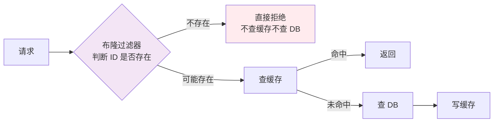
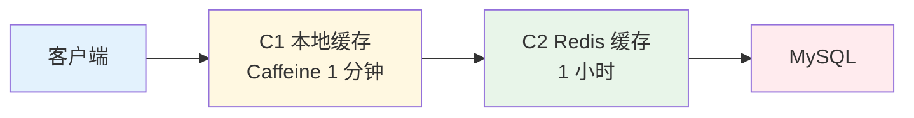

# 缓存穿透 / 击穿 / 雪崩

> 一句话：**Redis 缓存三连问，面试必考的"基础三件套"**

---

## 一、核心概念

缓存的本质：**用内存（Redis）挡住数据库（MySQL）的压力**。但这三个问题会让缓存"失守"，把压力直接打到数据库。


| 问题 | 现象 | 根因 |
|------|------|------|
| **穿透** | 查询**根本不存在**的数据 | 缓存和 DB 都没有 |
| **击穿** | 查询**热点 key** 过期瞬间 | 大量并发同时请求同一个过期 key |
| **雪崩** | **大量 key 同时过期**或 **Redis 宕机** | 缓存整体失效 |

---

## 二、缓存穿透（Penetration）

### 问题描述

查询一个**根本不存在的数据**（如恶意用户查询 `user_id = -1`）：
- 缓存中没有 → 去 DB 查
- DB 也没有 → 返回空
- 下次又有人查 → 又去 DB 查

**结果**：每次请求都打到数据库，缓存形同虚设。

### 解决方案

#### 方案 A：缓存空值（最常用）

```java
public User getUser(Long userId) {
    String key = "user:" + userId;
    User user = redis.get(key);
    
    if (user != null) {
        return user;  // 缓存命中（包括空值）
    }
    
    // 缓存未命中，查 DB
    user = userMapper.selectById(userId);
    
    if (user == null) {
        // ✅ 缓存空值，设置短过期时间
        redis.setex(key, 60, "");  // 60 秒后过期
        return null;
    }
    
    redis.setex(key, 3600, user);
    return user;
}
```

**要点**：
- 空值也要缓存，但过期时间短（30-60 秒）
- 下次查询直接返回空，不再打到 DB

#### 方案 B：布隆过滤器（Bloom Filter）



**布隆过滤器**：一个概率数据结构，可以判断"元素**一定不存在**"或"可能存在"。

```java
// Redis 布隆过滤器（RedisBloom 模块）
RBloomFilter<String> bloomFilter = redisson.getBloomFilter("user_ids");
bloomFilter.tryInit(1000000, 0.03);  // 100 万容量，3% 误判率

public User getUser(Long userId) {
    String key = "user:" + userId;
    
    // 布隆过滤器判断
    if (!bloomFilter.contains(key)) {
        return null;  // 一定不存在，直接返回
    }
    
    // 可能存在，走正常缓存流程
    // ...
}
```

**优点**：内存占用极小（100 万 ID 仅需 ~1.2MB）
**缺点**：有误判率（判断存在但实际不存在）；不能删除元素

---

## 三、缓存击穿（Breakdown）

### 问题描述

某个**热点 key**（如首页热搜、爆款商品）在过期的瞬间，大量并发请求同时到达：
- 缓存过期 → 所有请求都去 DB 查
- DB 瞬间压力暴增 → 可能被打崩

**穿透 vs 击穿**：
- 穿透：数据**根本不存在**
- 击穿：数据**存在但 key 过期**的瞬间

### 解决方案

#### 方案 A：互斥锁（分布式锁）

```java
public User getUserWithLock(Long userId) {
    String key = "user:" + userId;
    User user = redis.get(key);
    
    if (user != null) {
        return user;
    }
    
    // 缓存未命中，尝试获取分布式锁
    String lockKey = "lock:" + key;
    boolean locked = redis.setnx(lockKey, "1", "NX", "EX", 10);
    
    if (!locked) {
        // 没抢到锁，短暂等待后重试
        Thread.sleep(50);
        return getUserWithLock(userId);  // 递归重试
    }
    
    try {
        // 抢到锁，再次检查缓存（双重检查）
        user = redis.get(key);
        if (user != null) {
            return user;
        }
        
        // 查 DB 并写缓存
        user = userMapper.selectById(userId);
        redis.setex(key, 3600, user);
        return user;
    } finally {
        redis.del(lockKey);  // 释放锁
    }
}
```

**核心思想**：同一时刻只允许一个线程去查 DB，其他线程等待。

#### 方案 B：逻辑过期（后台异步更新）

```java
public class CacheObject<T> {
    T data;
    long expireTime;  // 逻辑过期时间
}

public User getUserWithLogicalExpire(Long userId) {
    String key = "user:" + userId;
    CacheObject<User> cacheObj = redis.get(key);
    
    if (cacheObj == null) {
        // 缓存不存在，直接查 DB（首次加载）
        return loadAndCache(userId);
    }
    
    // 检查是否逻辑过期
    if (System.currentTimeMillis() < cacheObj.expireTime) {
        return cacheObj.data;  // 未过期，直接返回
    }
    
    // 逻辑过期，尝试获取锁
    String lockKey = "lock:" + key;
    boolean locked = redis.setnx(lockKey, "1", "NX", "EX", 10);
    
    if (locked) {
        // 异步线程更新缓存
        executor.submit(() -> {
            try {
                loadAndCache(userId);
            } finally {
                redis.del(lockKey);
            }
        });
    }
    
    // 返回旧数据（牺牲一致性换高可用）
    return cacheObj.data;
}
```

**核心思想**：
- 缓存不设 Redis TTL，用"逻辑过期时间"字段判断
- 过期后返回**旧数据**，同时后台异步更新
- 永远不会阻塞用户请求

---

## 四、缓存雪崩（Avalanche）

### 问题描述

**大量 key 在同一时间过期** 或 **Redis 宕机**，导致请求全部打到数据库。

### 解决方案

#### 方案 A：过期时间加随机值

```java
// 基础过期时间 + 随机扰动
int baseExpire = 3600;  // 1 小时
int randomExpire = ThreadLocalRandom.current().nextInt(0, 300);  // 0-5 分钟随机
int expire = baseExpire + randomExpire;

redis.setex(key, expire, value);
```

**效果**：原本 10 万条数据同时在 1 小时后过期 → 现在分散在 1-1.08 小时内过期。

#### 方案 B：多级缓存



```java
// L1: 本地缓存（Caffeine）
Cache<String, User> localCache = Caffeine.newBuilder()
    .maximumSize(10_000)
    .expireAfterWrite(1, TimeUnit.MINUTES)
    .build();

// L2: Redis 缓存
public User getUser(Long userId) {
    String key = "user:" + userId;
    
    // L1
    User user = localCache.getIfPresent(key);
    if (user != null) return user;
    
    // L2
    user = redis.get(key);
    if (user != null) {
        localCache.put(key, user);
        return user;
    }
    
    // DB
    user = userMapper.selectById(userId);
    if (user != null) {
        redis.setex(key, 3600, user);
        localCache.put(key, user);
    }
    return user;
}
```

**效果**：即使 Redis 全挂了，本地缓存还能撑 1 分钟。

#### 方案 C：Redis 高可用

- **主从 + 哨兵**：Redis Sentinel 自动故障转移
- **Cluster 集群**：多主多从，数据分片
- **持久化**：RDB + AOF 防止数据丢失

#### 方案 D：降级与限流

```java
// Sentinel 限流
@SentinelResource(value = "getUser", blockHandler = "getUserFallback")
public User getUser(Long userId) {
    // 正常逻辑
}

public User getUserFallback(Long userId, BlockException e) {
    // 降级：返回默认值或从备用数据源获取
    return User.defaultUser();
}
```

---

## 五、对比总结

| 维度 | 穿透 | 击穿 | 雪崩 |
|------|------|------|------|
| **数据特征** | 根本不存在 | 热点 key 过期 | 大量 key 同时过期 |
| **并发特征** | 恶意/随机 | 高并发单点 | 整体流量暴增 |
| **解决方案** | 缓存空值 / 布隆过滤器 | 互斥锁 / 逻辑过期 | 过期随机化 / 多级缓存 / 高可用 |
| **核心思路** | 让 DB 少挨打 | 让 DB 排队挨打 | 让 DB 分散挨打 |

---

## 六、面试话术（30 秒版）

> "缓存三连问是 Redis 面试必考：
> 
> **穿透**：查询根本不存在的数据，每次都打到 DB。解决：缓存空值（短过期）+ 布隆过滤器拦截。
> 
> **击穿**：热点 key 过期瞬间，大量并发打到 DB。解决：互斥锁（只让一个线程查 DB）或逻辑过期（返回旧数据，后台异步更新）。
> 
> **雪崩**：大量 key 同时过期或 Redis 挂了。解决：过期时间加随机值 + 多级缓存（本地 + Redis）+ Redis 高可用（哨兵/集群）+ 限流降级。
> 
> 实战中三者经常组合出现，要系统性设计缓存防护。"

---

## 七、延伸问题

| 追问 | 答案要点 |
|------|---------|
| **布隆过滤器的原理？** | 多个哈希函数 + 位数组；插入时多个位置置 1，查询时检查所有位；有误判率，不能删除 |
| **分布式锁用什么实现？** | Redis SETNX / Redisson / ZooKeeper 临时节点 |
| **本地缓存选什么？** | Caffeine（性能最佳）/ Guava Cache |
| **缓存和 DB 一致性怎么保证？** | 延迟双删 / 监听 binlog（Canal）/ 消息队列最终一致性 |

---

## 八、交叉引用

- 主模块：[`03.database`](../../03.database/) — 数据库知识体系
- 主模块 Redis：[`03.database/nosql/redis/`](../../03.database/nosql/redis/) — Redis 详解
- 相关：[`13.split-hairs/03.database/`](../) — 数据库咬文嚼字
- 待补：分布式锁、缓存一致性专题
