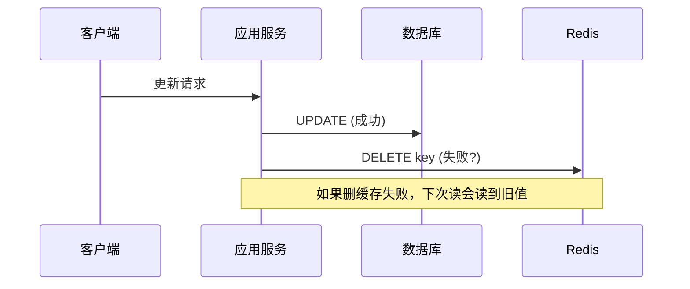
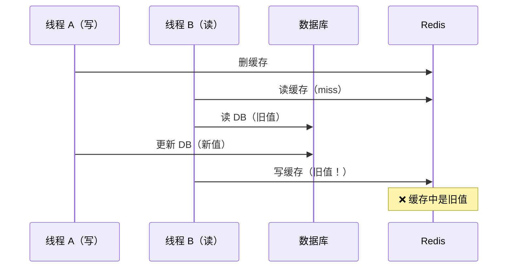
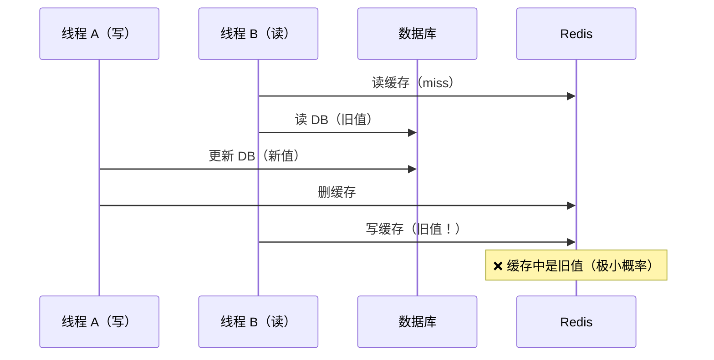
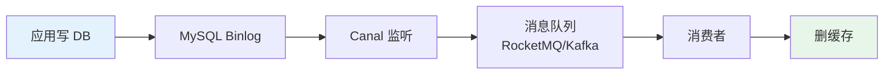

<!--
question:
  id: 04.system-design-cache-consistency
  topic: 04.system-design
  difficulty: ⭐⭐⭐⭐
  frequency: 中频
  scenario_type: 反直觉代码
  tags: [04.system-design, cache, consistency]
-->

# 缓存与数据库双写一致性

## 引子：改了数据库，缓存还是旧数据

```java
// 更新用户信息
userMapper.update(user);     // ① 更新数据库
redis.del("user:" + userId); // ② 删除缓存

// 如果第 ② 步失败了？
// 数据库是新数据，缓存还是旧数据 → 不一致！
```

缓存是数据库的"影子"。数据更新时，两者必须保持一致。

但问题是：**数据库和缓存是两个独立的存储，无法原子更新**。必然存在短暂的不一致窗口。

怎么把这个窗口压到最小？

---

> 📚 **前置知识**：[Redis](../../../03.database/07-redis/README.md)

## 一、核心问题

缓存是 DB 的"影子"，数据更新时必须保持两者一致。但缓存和 DB 是**两个独立存储**，无法原子更新 —— **必然存在短暂的不一致窗口**。

### 4 种更新策略对比

| 策略 | 操作顺序 | 一致性 | 问题 |
|------|---------|--------|------|
| **Cache Aside**（旁路缓存） | 先更新 DB，再删缓存 | ✅ 最终一致 | 删缓存失败 |
| Read Through | 读时由缓存层加载 | ✅ 一致 | 写操作复杂 |
| Write Through | 写时由缓存层同步写 DB | ✅ 强一致 | 写延迟高 |
| Write Behind | 写时只写缓存，异步写 DB | ⚠️ 可能丢数据 | 宕机丢数据 |

**业界共识**：**Cache Aside + 先更新 DB 再删缓存** 是主流方案。

---

## 二、先更新 DB 再删缓存



### 为什么"删缓存"而不是"更新缓存"？

**更新缓存的问题**：
1. 并发写入时可能覆盖（A 更新为 10，B 更新为 20，缓存可能被 A 覆盖成 10）
2. 计算成本高（如缓存是聚合计算结果）
3. 缓存可能还没被访问就更新了，浪费

**删缓存的优势**：
1. 懒加载（下次读时再计算，避免无效更新）
2. 避免并发覆盖问题
3. 实现简单

---

## 三、三种"不一致"场景

### 场景 1：删除缓存失败

```text
1. 更新 DB 成功
2. 删缓存失败（网络抖动 / Redis 宕机）
3. 下次读到旧数据 → 不一致
```

**解决方案**：重试机制（消息队列异步重试）

### 场景 2：先删缓存后更新 DB（错误做法）



**结论**：**绝对不要"先删缓存后更新 DB"**。

### 场景 3：先更新 DB 再删缓存的极端情况



**发生条件**：读操作慢于写操作（几乎不会发生，因为 DB 读比 Redis 写慢得多）

---

## 四、解决方案

### 方案 A：延迟双删

```java
public void updateData(Data data) {
    // 1. 先删缓存
    redis.del(key);
    
    // 2. 更新 DB
    db.update(data);
    
    // 3. 延迟 N 毫秒再删一次
    Thread.sleep(500);  // 或异步
    redis.del(key);
}
```

**原理**：第二次删除覆盖"场景 3"中可能写入的旧值。

**延迟时间**：建议 `读请求耗时 + 几百毫秒`。

**缺点**：
- 同步延迟影响接口性能
- 异步延迟需要消息队列

### 方案 B：基于 Binlog 监听（推荐）



```java
// Canal 消费者
@RocketMQMessageListener(topic = "cache-sync")
public class CacheSyncConsumer {
    public void onMessage(BinlogMessage msg) {
        if (msg.isUpdate() || msg.isDelete()) {
            redis.del(buildKey(msg));
        }
    }
}
```

**优点**：
- ✅ 业务代码无侵入
- ✅ 保证最终一致
- ✅ 可重试（消息队列）

**缺点**：
- 引入额外组件（Canal + MQ）
- 有几秒延迟

**工具**：Canal（阿里开源）、Debezium、mysql-cdc-connector

### 方案 C：订阅 key 过期事件（兜底）

```text
设置缓存 TTL → key 过期自动删除 → 下次读从 DB 加载
```

**优点**：无需额外机制
**缺点**：TTL 期间数据不一致

---

## 五、选型决策

| 场景 | 推荐方案 |
|------|---------|
| **读多写少 + 容忍短暂不一致** | Cache Aside + TTL 兜底 |
| **强一致性要求** | 延迟双删 + 短 TTL |
| **大型企业级** | Canal + MQ（最终一致） |
| **金融/支付** | 避免缓存，直读 DB |

---

## 六、面试话术（90 秒版）

> "**单级缓存**（Redis + DB）：主流方案是 **Cache Aside：先更新 DB，再删缓存**。不一致场景有 3 种：删缓存失败（重试）、先删缓存后更新 DB（绝对避免）、读写并发旧值入缓存（延迟双删或 Binlog 监听）。生产方案：中小企业用 Cache Aside + TTL 兜底，大型企业用 **Canal 监听 Binlog + MQ 异步删缓存**。
>
> **多级缓存**（L1 Caffeine + L2 Redis + L3 DB）：核心难题是 L1 是 JVM 本地缓存，每个实例独立，更新后无法通知其他实例。4 种方案：**短 TTL**（最简单，接受短暂不一致）、**Redis Pub/Sub**（最常用，发布失效消息所有实例订阅清 L1）、**MQ 广播**（RocketMQ 广播消费）、**ZK Watcher**（强一致但复杂）。推荐 Pub/Sub + 短 TTL 兜底。
>
> 写操作顺序：更新 DB → 删 Redis → 发 Pub/Sub 失效消息 → 所有实例清 L1。Pub/Sub 丢消息靠 TTL 兜底，不一致窗口 ≤ TTL 时长。
>
> 本质上，**缓存一致性是最终一致**，多级缓存只是在'不一致窗口大小'和'系统复杂度'之间权衡。"

---

## 六级进阶：多级缓存一致性（L1 + L2 + L3）

> 上面讲的是 Redis-DB 单级一致性。面试官追问：**"如果加了本地缓存（Caffeine），怎么保证多级缓存一致？"**

### 多级缓存架构

```text
请求 → L1: Caffeine（JVM 本地，< 1ms）
          ↓ miss
       L2: Redis（分布式，< 10ms）
          ↓ miss
       L3: MySQL（数据库，< 100ms）
```

### 多级缓存的核心难题

单级缓存（Redis-DB）只有一致性窗口。**多级缓存多了一个维度**：L1 是每个 JVM 实例独立的，更新 DB 后**无法自动通知其他实例的 L1**。

```text
实例 A：更新 DB → 删 Redis → 清自己的 L1 ✅
实例 B：L1 还是旧值 → 读到过期数据 ❌（直到 TTL 过期）
```

### 4 种 L1 失效方案

| 方案 | 实现 | 一致性 | 复杂度 | 适用 |
|------|------|--------|--------|------|
| **短 TTL** | L1 设 1-30 秒 TTL | 弱（最多 TTL 内不一致） | 低 | 读多写少，可接受短暂不一致 |
| **Redis Pub/Sub** | 更新后发布失效消息，所有实例订阅并清 L1 | 中 | 中 | **最常用**，中型集群 |
| **MQ 广播** | 更新后发 MQ（RocketMQ 广播模式），消费者清 L1 | 中 | 中 | 已有 MQ 基础设施 |
| **Zookeeper Watcher** | ZK 节点变更触发所有实例失效 | 强 | 高 | 金融场景 |

### Redis Pub/Sub 方案（推荐）

```java
// 1. 更新数据时，发布失效消息
public void updateUser(User user) {
    userMapper.update(user);          // 写 DB
    redis.del("user:" + user.getId()); // 删 L2
    // 发布失效通知（包括自己和其他实例）
    redisTemplate.convertAndSend("cache:evict:user", user.getId().toString());
}

// 2. 所有实例订阅，清理 L1
@Component
public class L1CacheEvictListener {
    @Autowired private Cache<String, Object> caffeineCache;

    @Bean
    public RedisMessageListenerContainer listenerContainer(
            RedisConnectionFactory cf) {
        RedisMessageListenerContainer container = new RedisMessageListenerContainer();
        container.setConnectionFactory(cf);
        container.addMessageListener((msg, pattern) -> {
            String key = new String(msg.getBody());
            caffeineCache.invalidate("user:" + key);  // 清本地 L1
        }, new ChannelTopic("cache:evict:user"));
        return container;
    }
}
```

### 多级缓存的写操作顺序

```text
推荐顺序（Cache Aside 多级版）：
1. 更新 DB（先保证持久化）
2. 删除 L2（Redis DEL）
3. 发布 Pub/Sub 失效消息 → 所有实例清 L1

注意：
- 不要先清 L1 再更新 DB（并发读写会导致旧值回填）
- Pub/Sub 消息是 fire-and-forget，丢消息时靠短 TTL 兜底
```

### 多级缓存面试加分点

| 问题 | 高分回答 |
|------|---------|
| "Pub/Sub 消息丢了怎么办？" | L1 短 TTL（30s）兜底，不一致窗口 ≤ 30 秒 |
| "实例很多（>100）Pub/Sub 扛得住吗？" | 换 MQ 广播模式（RocketMQ 广播消费），或只对热点 key 做 L1 |
| "L1 用强一致方案行不行？" | Zookeeper Watcher 可以，但延迟高 + 运维成本大，大多数场景不值得 |
| "怎么验证多级缓存一致性？" | 监控 L1/L2 命中率 + 定时对账脚本（对比 L1 值 vs DB 值）|

> 📚 **深度阅读**：[`缓存设计模式 §9.2`](../../../04.system-design/04-high-performance/cache-patterns/README.md) — 5 大反模式 + Java/Spring 视角深度分析 | [`Spring 多级缓存实现`](../../../06.spring/03-data/cache/multi-level.md) — CompositeCacheManager + 自定义 TwoLevelCache

---

## 七、交叉引用

- 主模块：[`03.database`](../../../03.database/) — 数据库与缓存
- [缓存穿透/击穿/雪崩](../../../03.database/06-cache/README.md) — 缓存设计模式与问题解决方案
- [分布式事务](../distributed-transaction/README.md) — 跨服务一致性方案
- [缓存设计模式 §9.2](../../../04.system-design/04-high-performance/cache-patterns/README.md) — 多级缓存 5 大反模式 + Java/Spring 深度分析
- [Spring 多级缓存实现](../../../06.spring/03-data/cache/multi-level.md) — CompositeCacheManager + TwoLevelCache 代码实现
- [缓存降级](../../06.spring/cache-degradation/README.md) — Redis 故障时的降级策略

## 相关章节

- 深度阅读：[`04.system-design`](../../04.system-design/README.md) — 主模块详细内容

← [返回系统设计咬文嚼字](../README.md)
