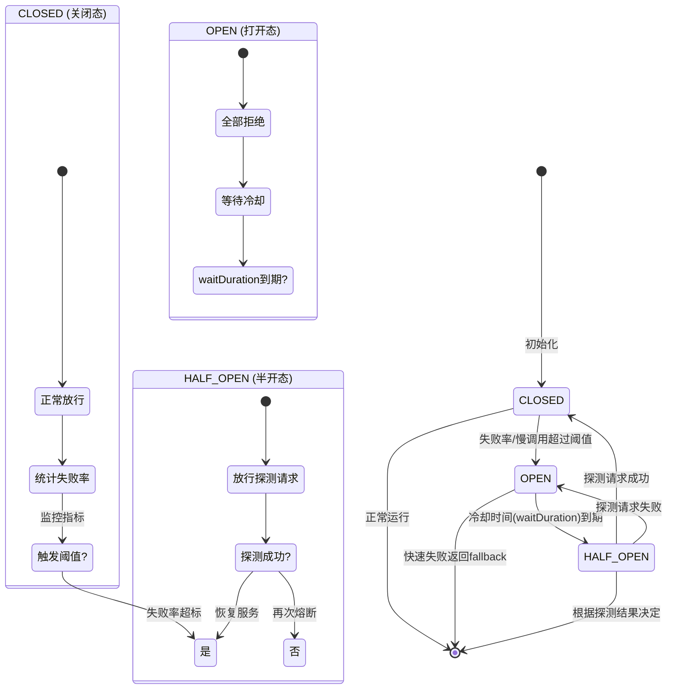

<!--
question:
  id: 04.system-design-circuit-breaker
  topic: 04.system-design
  difficulty: ⭐⭐⭐⭐
  frequency: 中频
  scenario_type: 性能对比
  tags: [04.system-design, circuit, breaker]
-->

# 熔断降级机制深度剖析

## 引子：一个服务挂掉，拖垮整个系统

```
用户请求 → 服务 A → 服务 B → 服务 C（挂了！）

服务 A 还在傻傻等 C 响应（超时 5 秒）
→ 线程池被占满
→ 服务 A 也挂了
→ 调用 A 的服务 D 也挂了
→ 雪崩！
```

一个节点故障，像多米诺骨牌一样拖垮整个系统——这叫**雪崩效应**。

怎么防止？**熔断器**——像电路里的保险丝，下游挂了就直接"断开"，快速失败，不让故障扩散。

---

> 📚 **前置知识**：[熔断器](../../../04.system-design/03-high-availability/circuit-break/README.md)

## 一、核心原理

熔断器模式借鉴了电气工程中保险丝的设计思想：当微服务调用链中某个节点出现故障时，熔断器自动切断对该节点的调用，避免故障扩散。

### 状态机模型



| 状态 | 行为 | 触发条件 | 转换目标 |
|------|------|----------|----------|
| **CLOSED** | 正常放行，统计指标 | 初始状态 | 失败超阈值 → OPEN |
| **OPEN** | 拒绝请求，返回 fallback | 熔断阈值触发 | 冷却到期 → HALF_OPEN |
| **HALF_OPEN** | 放行少量探测请求 | OPEN 冷却到期 | 成功 → CLOSED；失败 → OPEN |

**关键参数：** windowSize（滑动窗口大小）、failureThreshold（失败阈值）、waitDurationInOpenState（冷却时间）、minimumNumberOfCalls（最小样本数）

---

## 二、Sentinel 详解

Sentinel 是阿里巴巴开源的流量治理组件，基于**滑动窗口统计算法**实现限流、熔断、降级。

### 滑动窗口与规则类型

Sentinel 将时间划分为多个 Bucket，每个记录固定时间段内的调用数据。窗口滑动时过期 Bucket 被丢弃，时间复杂度 O(1)。

| 规则类型 | 类名 | 用途 |
|----------|------|------|
| **流控规则** | `FlowRule` | 限制 QPS 或并发线程数 |
| **降级规则** | `DegradeRule` | 基于异常比例/数量、慢调用比例熔断 |
| **系统规则** | `SystemRule` | CPU、入口 QPS、平均 RT 等系统维度保护 |
| **授权规则** | `AuthorityRule` | 黑白名单控制 |
| **热点参数规则** | `HotParamRule` | 高频参数值限流 |

### DegradeRule 熔断策略

```java
// 策略1：异常比例熔断（错误率50%）
new DegradeRule("orderService")
    .setGrade(RuleConstant.DEGRADE_GRADE_EXCEPTION_RATIO)
    .setCount(0.5).setTimeWindow(10).setMinRequestAmount(5);
// 策略2：异常数量熔断（10次异常）
new DegradeRule("orderService")
    .setGrade(RuleConstant.DEGRADE_GRADE_EXCEPTION_COUNT)
    .setCount(10).setTimeWindow(10).setMinRequestAmount(5);
// 策略3：慢调用比例熔断（60%慢调用，RT>500ms为慢）
new DegradeRule("orderService")
    .setGrade(RuleConstant.DEGRADE_GRADE_SLOW_REQUEST_RATIO)
    .setCount(0.6).setTimeWindow(10)
    .setSlowRatioThreshold(0.3).setMaxSlowRt(500);
```

**适用场景：** 异常比例用于高稳定性要求；异常数量用于流量波动大；慢调用比例用于响应时间敏感场景。

### 动态规则加载

```java
// 硬编码
DegradeRuleManager.loadRules(Collections.singletonList(rule));
// Nacos 动态推送
ReadableDataSource<String, List<DegradeRule>> ds = new NacosDataSource<>(config, parser);
DegradeRuleManager.register2Property(ds.getProperty());
```

---

## 三、Resilience4j 详解

Resilience4j 是受 Hystrix 启发的轻量级容错库，采用**装饰器模式**集成到调用链中。

### 核心特性与配置

- **零依赖**：仅需 Vavr 库
- **函数式风格**：支持 Lambda 表达式
- **模块化**：CircuitBreaker、RateLimiter、Retry、Bulkhead 独立模块
- **非阻塞**：无线程池隔离，性能开销低

```yaml
resilience4j.circuitbreaker.instances.orderService:
  sliding-window-type: COUNT_BASED    # 或 TIME_BASED
  sliding-window-size: 10
  minimum-number-of-calls: 5
  failure-rate-threshold: 50
  slow-call-rate-threshold: 60
  slow-call-duration-threshold: 500ms
  wait-duration-in-open-state: 30s
  permitted-number-of-calls-in-half-open-state: 3
  record-exceptions: [IOException, TimeoutException]
  ignore-exceptions: [IllegalArgumentException]
```

### 装饰器模式集成

```java
CircuitBreaker cb = CircuitBreaker.of("orderService", config);
Supplier<Order> decorated = CircuitBreaker.decorateSupplier(cb, 
    () -> orderService.getOrder(orderId));
Order result = Try.ofSupplier(decorated).recover(t -> Order.defaultOrder()).get();
// 组合 Retry + TimeLimiter + CircuitBreaker
Supplier<Order> combined = CircuitBreaker.decorateSupplier(cb,
    Retry.decorateSupplier(retry,
        TimeLimiter.decorateFutureSupplier(timeLimiter,
            () -> CompletableFuture.supplyAsync(() -> orderService.getOrder(orderId)))));
```

### 两种滑动窗口对比

| 特性 | COUNT_BASED | TIME_BASED |
|------|-------------|------------|
| 窗口单位 | 调用次数 | 时间（秒） |
| 内存占用 | 固定（数组） | 可变（环形缓冲区） |
| 适用场景 | 流量稳定 | 流量波动大 |
| 典型配置 | size=100 calls | size=60 seconds |

---

## 四、降级策略

**Fallback 方法降级：** 参数签名一致（可额外接收 Throwable），返回值兼容，不抛异常。

```java
@SentinelResource(value = "getOrder", fallback = "getOrderFallback")
public Order getOrder(Long orderId) { return orderMapper.selectById(orderId); }
public Order getOrderFallback(Long orderId, Throwable ex) {
    log.warn("订单查询降级, orderId={}", orderId, ex);
    return Order.empty();
}
```

**缓存兜底：** Redis → 本地缓存 → 默认值三级降级。

```java
public Product getProduct(Long productId) {
    try { return productRemoteService.getById(productId); } 
    catch (Exception e) {
        Product cached = redisTemplate.get("product:" + productId);
        if (cached != null) return cached;
        Product local = localCache.getIfPresent(productId);
        if (local != null) return local;
        return Product.defaultProduct();
    }
}
```

**静默失败：** 非核心链路（如埋点）直接吞异常。**默认值降级：**

| 场景 | 默认值 |
|------|--------|
| 商品详情 | 占位图 + "信息暂不可用" |
| 推荐列表 | 热门商品兜底 |
| 用户积分 | 0 分 |
| 配置项 | 硬编码默认值 |

---

## 五、实战场景

### 下游服务不可用

库存服务数据库连接池耗尽时，订单服务直接返回兜底结果：

```java
@SentinelResource(value = "checkStock", fallback = "checkStockFallback")
public StockResult checkStock(Long skuId) { return stockServiceClient.check(skuId); }
public StockResult checkStockFallback(Long skuId, Throwable ex) {
    return StockResult.unlimited();  // 假设库存充足
}
```

### 超时熔断

支付网关 P99 延迟从 200ms 飙升到 5s 时：

```yaml
slow-call-duration-threshold: 1000ms
slow-call-rate-threshold: 60
sliding-window-size: 50
minimum-number-of-calls: 10
wait-duration-in-open-state: 20s
```

### 线程池隔离 vs 信号量隔离

| 维度 | 线程池隔离 | 信号量隔离 |
|------|-----------|-----------|
| 资源开销 | 高（线程+上下文切换） | 低（仅计数） |
| 超时控制 | 天然支持 | 需自行实现 |
| RequestContext | 不可继承 | 天然继承 |
| 适用场景 | 跨机房强隔离 | 大部分内部服务 |

**选型建议：** 内部服务优先信号量隔离；跨机房或强隔离要求用线程池隔离。

---

## 六、常见陷阱

**1. 熔断恢复流量冲击：** OPEN → HALF_OPEN 时一次性放行大量探测请求可能压垮刚恢复的服务。**解决：** permittedNumberOfCallsInHalfOpenState=1~3。

**2. HALF_OPEN 反复震荡：** 服务临界状态下探测请求偶然失败导致 OPEN ↔ HALF_OPEN 反复切换。**解决：** 增加探测次数（3次）、延长冷却时间、指数退避。

```java
long nextWait = baseWait * Math.pow(2, consecutiveFailures);  // 指数退避
```

**3. 误熔断：** 网络抖动或 GC 停顿导致个别超时被误判。**解决：** 设置 minimumNumberOfCalls、增大窗口、多指标综合判断。

```java
new DegradeRule("service")
    .setMinRequestAmount(20).setStatIntervalMs(10000)
    .setCount(0.8).setTimeWindow(5);
```

**熔断 vs 限流 vs 降级：**

| 维度 | 熔断 | 限流 | 降级 |
|------|------|------|------|
| 目的 | 防止故障扩散 | 防止流量过载 | 保证核心功能 |
| 触发 | 失败率/慢调用超标 | QPS/并发超标 | 熔断或非核心失败 |
| 行为 | 快速失败 | 拒绝多余请求 | 返回默认值/缓存 |
| 方向 | 出站（调用方） | 入站（服务端） | 业务逻辑层 |

---

## 七、面试话术（30 秒版）

> 熔断降级是分布式系统的自我保护机制。熔断器有 CLOSED、OPEN、HALF_OPEN 三态：正常时 CLOSED 放行并统计；失败率或慢调用超阈值切到 OPEN，直接拒绝返回 fallback；冷却后进入 HALF_OPEN，放行探测请求，成功则恢复，失败则回 OPEN。
> Sentinel 基于滑动窗口，支持异常比例/数量/慢调用比例三种策略。Resilience4j 用装饰器模式，支持 COUNT_BASED/TIME_BASED 两种窗口。
> 实践采用多级降级：Redis → 本地缓存 → 默认值，非核心链路静默失败。控制 HALF_OPEN 探测数避免二次冲击。

---

## 八、交叉引用

- 主模块：[`04.system-design`](../../../04.system-design/) — 系统设计知识体系

## 相关章节

- 深度阅读：[`04.system-design`](../../04.system-design/README.md) — 主模块详细内容

← [返回: 咬文嚼字 · circuit-breaker](README.md)
