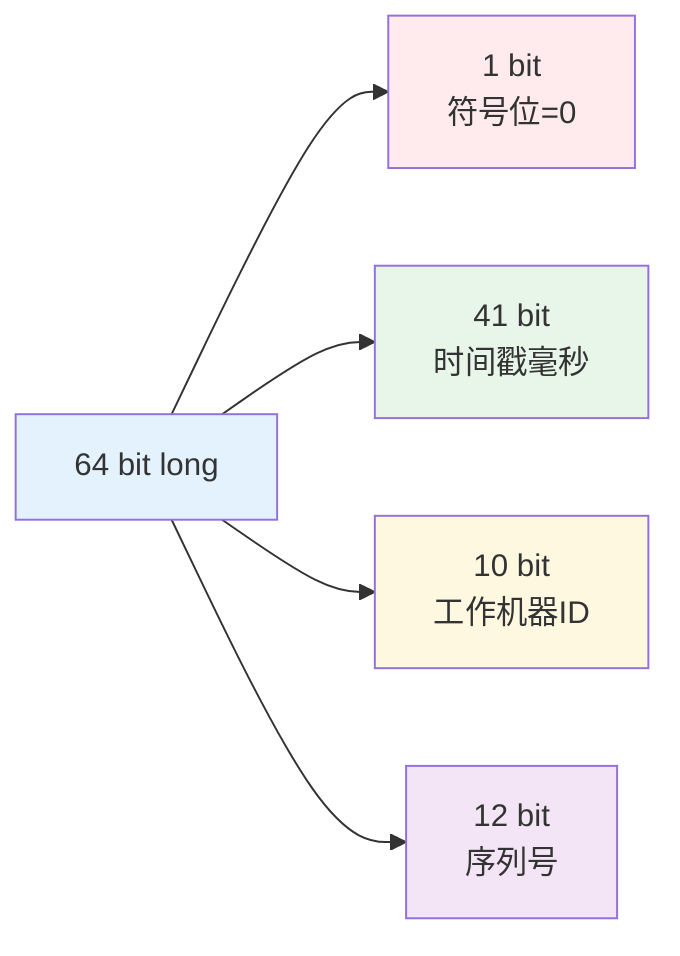
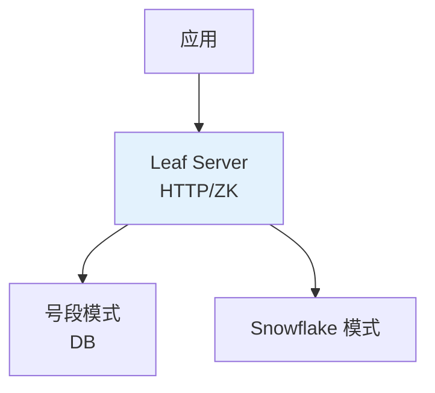

<!--
question:
  id: 04.system-design-distributed-id
  topic: 04.system-design
  difficulty: ⭐⭐⭐
  frequency: 中频
  scenario_type: 性能对比
  tags: [04.system-design, distributed]
-->

# 分布式 ID 生成方案

## 引子：订单号用 UUID 行不行？

```java
// 方案 1：UUID
String orderId = UUID.randomUUID().toString();
// "550e8400-e29b-41d4-a716-446655440000"
// 问题：太长、无序、不能当数据库索引

// 方案 2：数据库自增
long orderId = insertAndReturnId();
// 问题：单机瓶颈，分布式多节点冲突

// 方案 3：雪花算法
long orderId = snowflake.nextId();
// 1537329423498670080
// 趋势递增、性能高、无需协调
```

分布式 ID 有 6 个要求：全局唯一、高性能、高可用、趋势递增、信息安全、包含业务信息。

4 种方案，各有取舍。

---

## 一、分布式 ID 的 6 个要求

| 要求 | 说明 |
|------|------|
| **全局唯一** | 跨节点不重复 |
| **高性能** | 生成速度快（QPS 高） |
| **高可用** | 服务 99.99% 可用 |
| **趋势递增** | 便于索引、排序 |
| **信息安全** | 不可预测（订单 ID 防猜） |
| **长度适中** | 64 bit 最佳（long 类型） |

---

## 二、4 种方案

### 2.1 UUID

```java
String uuid = UUID.randomUUID().toString();
// 550e8400-e29b-41d4-a716-446655440000
```

| 维度 | 评价 |
|------|------|
| 唯一性 | ✅ 完全唯一（基于时间+机器+随机） |
| 性能 | ✅ 本地生成，无网络调用 |
| 递增性 | ❌ 完全无序 |
| 长度 | ❌ 36 字符，太长 |
| 安全 | ⚠️ 可预测 |

**致命缺陷**：**无序导致 MySQL 索引频繁分裂**（B+ Tree 插入需要移动数据）

**适用**：不要求递增的场景（如临时 token）

### 2.2 数据库自增

```sql
-- MySQL
CREATE TABLE id_generator (
    stub INT PRIMARY KEY AUTO_INCREMENT
);

INSERT INTO id_generator VALUES (NULL);
SELECT LAST_INSERT_ID();
```

| 维度 | 评价 |
|------|------|
| 唯一性 | ✅ 唯一 |
| 性能 | ⭐⭐⭐ 中（DB 压力） |
| 递增性 | ✅ 严格递增 |
| 可用 | ⭐⭐ 单点风险 |
| 长度 | ✅ 短（long） |

**高可用方案**：双主模式（两台 MySQL 互为主从，auto_increment_increment=2）

```
Master A: 1, 3, 5, 7, 9, ...
Master B: 2, 4, 6, 8, 10, ...
```

**缺点**：DB 成为瓶颈，QPS 低

### 2.3 雪花算法（Snowflake）⭐



```
0 | 41 bit 时间戳 | 10 bit 机器ID | 12 bit 序列号
```

| 字段 | 位数 | 含义 | 范围 |
|------|------|------|------|
| 符号位 | 1 | 固定 0（正数） | — |
| 时间戳 | 41 | 毫秒级（可用 69 年） | 2^41 - 1 |
| 机器 ID | 10 | 工作节点（可分 worker+datacenter） | 0-1023 |
| 序列号 | 12 | 每毫秒每机器 4096 个 | 0-4095 |

**理论 QPS**：1024 机器 × 4096 / 毫秒 ≈ **419 万 QPS**

```java
public class Snowflake {
    private final long workerId;
    private long lastTimestamp = -1L;
    private long sequence = 0L;
    
    public synchronized long nextId() {
        long timestamp = System.currentTimeMillis();
        
        if (timestamp < lastTimestamp) {
            throw new RuntimeException("时钟回拨");
        }
        
        if (timestamp == lastTimestamp) {
            sequence = (sequence + 1) & 0xFFF;
            if (sequence == 0) {
                timestamp = waitNextMillis(lastTimestamp);
            }
        } else {
            sequence = 0;
        }
        
        lastTimestamp = timestamp;
        
        return ((timestamp - EPOCH) << 22)
             | (workerId << 12)
             | sequence;
    }
}
```

| 维度 | 评价 |
|------|------|
| 唯一性 | ✅ 唯一（机器+时间+序列） |
| 性能 | ✅ 本地生成，极高 |
| 递增性 | ✅ 趋势递增 |
| 长度 | ✅ 64 bit（long） |

**缺点**：
- **时钟回拨问题**（NTP 同步可能导致时间回退）
- 需要分配 workerId（ZooKeeper / 配置文件）

**时钟回拨解决方案**：
1. 等待时钟追上
2. 使用预留的未来时间
3. 引入百度 uid-generator 的历史时间方案

### 2.4 美团 Leaf



**两种模式**：

**号段模式**（DB 自增优化）：
- 每次从 DB 取一个号段（如 1000-2000）到内存
- 内存中分发，用完再取
- DB 压力降低 N 倍

```
应用 A 获取号段：[1, 1000]
应用 B 获取号段：[1001, 2000]
```

**Snowflake 模式**：
- 基于 Twitter Snowflake
- workerId 由 ZooKeeper 自动分配
- 解决时钟回拨问题

| 维度 | 号段模式 | Snowflake 模式 |
|------|---------|---------------|
| 递增 | ✅ 严格递增 | ⚠️ 趋势递增 |
| 性能 | ⭐⭐⭐ 中（依赖 DB） | ⭐⭐⭐⭐⭐ 极高 |
| 依赖 | DB | ZK |

---

## 三、选型决策

| 场景 | 推荐方案 |
|------|---------|
| **小项目、无递增要求** | UUID（最简单） |
| **中小型、严格递增** | DB 自增（双主高可用） |
| **大型、高性能** | **雪花算法**（主流） |
| **企业级、易运维** | **美团 Leaf** |
| **订单 ID（防预测）** | 雪花 + 随机掩码 |

---

## 四、实践陷阱

### 1. 雪花算法时钟回拨
- 必须监控 NTP 同步
- 使用 ZooKeeper 注册 workerId
- 预留 bit 位应对回拨

### 2. 号段模式双 buffer
```
当前号段：[1, 1000]（使用中）
下一个号段：[1001, 2000]（预加载）
```
避免号段用完时等待 DB。

### 3. ID 暴露信息
- 雪花 ID 包含时间戳，可被推算
- 订单 ID 建议加掩码或加密

---

## 五、场景实战：每秒 10 万笔订单，编号怎么不重复？

> 面试官追问："你说的方案我都懂——10 万 QPS 的订单系统，你会怎么设计 ID 生成方案？"

### 5.1 需求拆解

| 维度 | 要求 | 数值 |
|------|------|------|
| **吞吐量** | 10 万 QPS | 峰值预留 2 倍 = 20 万 QPS |
| **唯一性** | 订单号全局唯一 | 不能重复 |
| **递增性** | 趋势递增（B+ Tree 友好） | 非严格递增 |
| **安全性** | 防猜（不能暴露订单量） | 需掩码 |
| **高可用** | 99.99% | ID 服务不能挂 |

### 5.2 方案论证：Snowflake 够用吗？

```text
Snowflake 理论 QPS：
  1024 台机器 × 4096 ID/毫秒 = 419 万 QPS

单机 QPS：
  4096 ID/毫秒 = 409.6 万/秒

10 万 QPS 只需要：
  100,000 / 409,600 ≈ 0.24 台机器（1 台就够）

结论：Snowflake 单机绰绰有余 ✅
```

**但仅靠 Snowflake 不够**——还需要解决：
1. workerId 分配（100+ 台机器怎么不冲突）
2. 时钟回拨（NTP 同步导致时间回退）
3. 订单号安全性（雪花 ID 可推算出订单量）

### 5.3 推荐方案：Leaf 号段模式 + Snowflake 双引擎

```text
┌─────────────────────────────────────────┐
│ 订单服务集群（100 台）                      │
│                                          │
│  引擎 1: Leaf 号段模式（主路径）            │
│    每次从 DB 取号段 [N, N+10000]           │
│    双 Buffer 预加载：当前号段用到 20% 时     │
│    异步加载下一号段 → 零毛刺                │
│                                          │
│  引擎 2: Snowflake（降级路径）              │
│    DB 不可用时切换 → 本地生成 ID             │
│    容忍短暂不一致（最终一致）                │
└─────────────────────────────────────────┘
```

**Leaf 号段模式为什么适合 10 万 QPS？**

```text
号段大小 = 10000
10 万 QPS → 每秒消耗 10 个号段
DB 取号段频率 = 每 0.1 秒一次（可接受）

双 Buffer 消除毛刺：
  Buffer A: [1, 10000]  ← 正在使用
  Buffer B: [10001, 20000] ← 已预加载
  A 用到 80% → 异步加载 C
  A 用完 → 切 B → 异步加载 D
  → 永远不会因为"等号段"阻塞业务线程
```

### 5.4 订单号安全：掩码处理

雪花 ID 直接暴露 → 竞争对手可以推算订单量（今天 ID - 昨天 ID = 日订单量）

```java
// 原始雪花 ID
long rawId = snowflake.nextId();
// 1537329423498670080

// 安全处理：XOR 掩码 + 随机尾部
long maskedId = rawId ^ RANDOM_MASK;  // XOR 打乱
long safeOrderId = maskedId * 10 + random(0, 9);  // 加随机尾数
// → 不可逆推原始 ID，不可推算订单量
```

### 5.5 容灾降级

| 故障场景 | 降级策略 |
|---------|---------|
| **Leaf DB 宕机** | 切 Snowflake 引擎（本地生成，不依赖 DB） |
| **Snowflake 时钟回拨** | 等待追上 / 抛异常切 Leaf 号段 |
| **Redis INCR 方案** | 可作为第三引擎兜底（原子自增 + 时间戳前缀） |
| **全部 ID 服务挂了** | 业务层 UUID 兜底 + 异步补偿替换 |

### 5.6 面试回答框架

> "10 万 QPS 订单号，我会从 3 个层面回答：
>
> **够用论证**：Snowflake 单机 409.6 万/秒，10 万 QPS 只需 1 台机器，绰绰有余。
>
> **推荐方案**：Leaf 号段模式做主路径（双 Buffer 预加载消除毛刺），Snowflake 做降级路径（DB 不可用时本地生成）。双引擎互备，99.99% 可用。
>
> **安全性**：订单号做 XOR 掩码 + 随机尾数，防止竞争对手推算订单量。
>
> **容灾**：三级降级——Leaf DB 挂了切 Snowflake，Snowflake 时钟回拨切 Leaf，全挂用 UUID 兜底 + 异步补偿。"

---

## 六、面试话术（90 秒版）

> "分布式 ID 4 种方案：
>
> 1. **UUID**：完全唯一但无序，**不适合做数据库主键**
> 2. **DB 自增**：简单但性能差，双主模式解决高可用
> 3. **雪花算法**：**主流**，64 bit = 时间戳 + 机器 ID + 序列号，本地生成 QPS 极高
> 4. **美团 Leaf**：号段模式（DB 优化）+ Snowflake 模式
>
> **选型**：
> - 通用场景：**雪花算法**（Java 用 Hutool 或自实现）
> - 企业级：**美团 Leaf**（开箱即用）
> - 严格递增 + 简单：DB 自增双主
>
> **10 万 QPS 场景**：Snowflake 单机 409.6 万/秒绰绰有余。推荐 Leaf 号段做主路径（双 Buffer 无毛刺）+ Snowflake 做降级路径。订单号加掩码防猜。三级降级保证 99.99% 可用。
>
> **雪花算法陷阱**：时钟回拨（必须处理）、workerId 分配（用 ZooKeeper）。"

---

## 七、交叉引用

- 主模块：[`04.system-design`](../../../04.system-design/) — 系统设计

## 相关章节

- 深度阅读：[`04.system-design`](../../04.system-design/README.md) — 主模块详细内容

← [返回系统设计咬文嚼字](../README.md)
