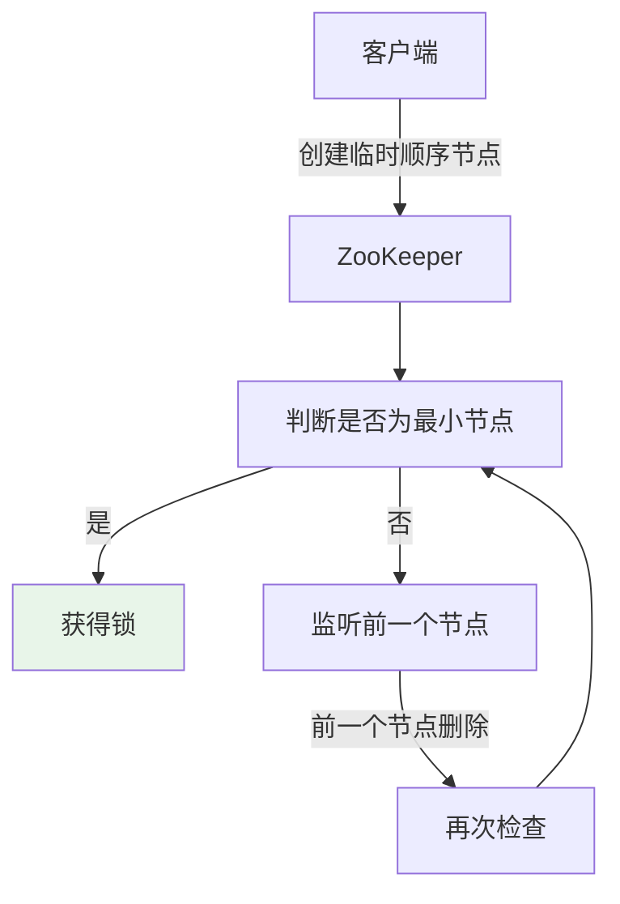
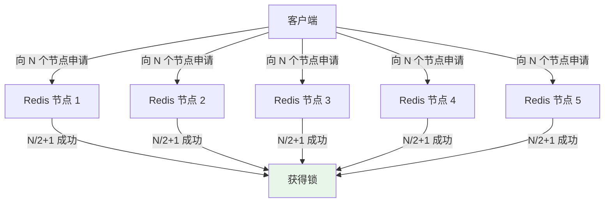

<!--
question:
  id: 04.system-design-distributed-lock
  topic: 04.system-design
  difficulty: ⭐⭐⭐⭐⭐
  frequency: 中频
  scenario_type: 反直觉代码
  tags: [04.system-design, distributed, lock]
-->

# 分布式锁

## 引子：库存超卖了！

```java
// 单机锁
public void deductStock(Long productId) {
    synchronized (this) {  // ❌ 多实例部署下无效！
        if (stock > 0) {
            stock--;
        }
    }
}

// 线上部署了 10 个实例
// 每个实例都有自己的锁
// 10 个实例同时执行 → 库存被扣了 10 次 → 超卖！
```

单机锁（`synchronized`）只在单个 JVM 内有效。分布式多实例部署时，需要**跨进程的互斥机制**——这就是分布式锁。

两种主流实现：**Redis** vs **ZooKeeper**。

---

## 一、为什么需要分布式锁

单机锁（`synchronized` / `ReentrantLock`）只在单 JVM 内有效。**多实例部署时，需要跨进程的互斥机制** —— 这就是分布式锁。

**适用场景**：
- 防止缓存击穿（热点 key 同时重建）
- 防止重复提交（订单、支付）
- 任务调度（避免多节点同时执行）
- 资源独占访问（库存扣减）

---

## 二、分布式锁的 6 个要求

| 要求 | 说明 |
|------|------|
| **互斥** | 同一时刻只有一个线程持锁 |
| **可重入** | 同一线程可重复获取同一把锁 |
| **超时释放** | 避免死锁（持锁者崩溃） |
| **高性能** | 加锁/释放延迟低 |
| **高可用** | 锁服务不能单点 |
| **非阻塞** | 获取失败立即返回（而非挂起） |

---

## 三、Redis 分布式锁

### 3.1 基础实现（SETNX）

```java
// ❌ 不推荐的写法（非原子）
if (redis.setnx(lockKey, "1") == 1) {
    redis.expire(lockKey, 30);  // 这行崩溃就死锁
    try {
        doBusiness();
    } finally {
        redis.del(lockKey);
    }
}

// ✅ 原子操作（SET NX EX）
public boolean tryLock(String lockKey, int expireSeconds) {
    String result = redis.set(lockKey, requestId, "NX", "EX", expireSeconds);
    return "OK".equals(result);
}

public void unlock(String lockKey, String requestId) {
    // Lua 脚本保证原子性（只释放自己的锁）
    String lua = "if redis.call('get', KEYS[1]) == ARGV[1] then " +
                 "  return redis.call('del', KEYS[1]) " +
                 "else return 0 end";
    redis.eval(lua, 1, lockKey, requestId);
}
```

### 3.2 8 个坑与解决方案

| 坑 | 问题 | 解决 |
|----|------|------|
| **1. 锁过期但业务未完成** | 锁自动释放，其他线程进入 | **看门狗机制**（Redisson 默认 30s 续期） |
| **2. 误删他人锁** | A 删了 B 的锁 | 锁值用唯一 requestId，Lua 原子校验 |
| **3. 主从切换丢锁** | 主节点写入后宕机，从节点未同步 | RedLock 算法（多节点投票）|
| **4. 单点故障** | Redis 单节点挂掉 | Redis Sentinel / Cluster |
| **5. 锁不可重入** | 同一线程重复加锁死锁 | 使用 hash 结构记录重入次数 |
| **6. 超时时间难设置** | 太长浪费，太短死锁 | 看门狗自动续期 |
| **7. 客户端崩溃** | 锁未释放 | TTL 兜底 |
| **8. 性能问题** | 高并发下 Redis 压力大 | 分段锁 / 本地锁 + 分布式锁组合 |

### 3.3 Redisson 推荐实现

```java
// 1. 引入 Redisson
RLock lock = redisson.getLock("order:123");

try {
    // 2. 加锁（默认 30s 过期，看门狗自动续期）
    lock.lock();
    
    // 或 3. 尝试加锁（等待 5s，持锁 10s）
    if (lock.tryLock(5, 10, TimeUnit.SECONDS)) {
        doBusiness();
    }
} finally {
    // 4. 释放（Redisson 自动处理 requestId）
    if (lock.isHeldByCurrentThread()) {
        lock.unlock();
    }
}
```

**Redisson 的优势**：
- ✅ 看门狗自动续期
- ✅ 可重入（hash 结构）
- ✅ Lua 脚本原子操作
- ✅ 支持 RedLock
- ✅ 公平锁 / 读写锁

### 3.4 Redisson 释放机制深度剖析

> 面试官追问："你说 Redisson 看门狗自动续期——它怎么续的？unlock 的时候发生了什么？设置 leaseTime 和不设置有啥区别？"

#### 核心数据结构

Redisson 用 Redis **Hash** 存储锁：

```text
HSET myLock <threadId> <reentrantCount>
```

- **key**：锁名称（如 `myLock`）
- **field**：线程标识（UUID + threadId）
- **value**：重入次数（可重入锁每次 +1）

#### lock() 后看门狗如何续期

```text
调用 lock.lock()
  │
  ├─ 尝试加锁（Lua: HSET + PEXPIRE 30000）
  │  成功 → 获得锁
  │
  └─ 启动看门狗（Watchdog）
     │
     ├─ Netty HashedWheelTimer（时间轮定时器）
     ├─ 每 lockWatchdogTimeout / 3 = 10 秒执行一次
     ├─ 执行 Lua: PEXPIRE myLock 30000（重置过期时间）
     └─ 循环直到 unlock() 被调用
```

**关键细节**：
- 默认 `lockWatchdogTimeout = 30000ms`（30 秒）
- 续期间隔 = 30000 / 3 = **10 秒**（即每 10 秒续期一次）
- 续期操作是**异步**的（Netty EventLoop 执行，不阻塞业务线程）
- **如果持锁线程结束但没调 unlock()，看门狗也会停止**（通过 Future 关联线程生命周期）

#### unlock() 的 Lua 脚本内部逻辑

```lua
-- Redisson unlock 的 Lua 脚本（简化版）
local key = KEYS[1]
local threadId = ARGV[1]

-- 1. 验证锁归属：检查 Hash 中是否有自己的 field
if redis.call('hexists', key, threadId) == 0 then
    return nil  -- 不是自己的锁，返回 nil
end

-- 2. 重入计数 -1
local count = redis.call('hincrby', key, threadId, -1)

-- 3. 如果计数 > 0，说明还有重入未释放 → 只减计数，不删锁
if count > 0 then
    redis.call('pexpire', key, 30000)  -- 重置过期时间
    return 0
end

-- 4. 计数 = 0，完全释放 → 删除锁
redis.call('del', key)

-- 5. 发布消息通知等待者
redis.call('publish', 'redisson_lock__channel:{myLock}',
           'unlock')
return 1
```

**5 步流程**：
1. **验证归属** — `HEXISTS` 检查锁是不是自己的（防止误删他人锁）
2. **重入计数 -1** — `HINCRBY` 减 1
3. **计数 > 0** — 还有重入未释放，只重置 TTL，不删锁
4. **计数 = 0** — 完全释放，`DEL` 删锁
5. **PubSub 通知** — `PUBLISH` 通知所有等待这把锁的线程

#### 显式 leaseTime vs 默认看门狗

```java
// 方式 1：默认看门狗（推荐）
lock.lock();  // 无参 → 启动看门狗自动续期

// 方式 2：显式设置 leaseTime
lock.lock(10, TimeUnit.SECONDS);  // 10s 后强制过期，不启动看门狗
```

| 维度 | 无参 lock() | lock(10, SECONDS) |
|------|-------------|-------------------|
| **看门狗** | ✅ 启动（每 10s 续期） | ❌ 不启动 |
| **过期时间** | 永远 30s（不断续期） | 10s 后强制过期 |
| **业务超时保护** | 无（看门狗一直续） | 有（到时间自动释放） |
| **风险** | 业务线程卡死 → 看门狗也停 → 30s 后释放 | 业务没执行完 → 锁提前释放 → 并发问题 |
| **适用** | 大多数场景 | 需要精确控制持锁时长 |

#### 5 个异常场景

| 场景 | 会发生什么 | Redisson 的处理 |
|------|-----------|----------------|
| **持锁线程崩溃** | 看门狗随之停止 → 30s TTL 到期自动释放 | ✅ 安全（TTL 兜底） |
| **JVM 进程宕机** | 看门狗消失 → 30s TTL 到期自动释放 | ✅ 安全（TTL 兜底） |
| **Redis 主从切换** | 主节点写入后宕机，从节点未同步 → 锁丢失 | ⚠️ 部分安全（RedLock 可解决） |
| **网络分区** | 续期请求到不了 Redis → 续期失败 → TTL 到期释放 | ✅ 安全（续期失败 = TTL 不刷新） |
| **看门狗续期失败** | 单次续期失败不影响（下次 10s 后再试）| ✅ 安全（除非连续失败 3 次到 TTL） |

> 📚 **深度阅读**：[`分布式锁主模块`](../../../04.system-design/02-distributed/distributed-lock/README.md) — 需求/特性/实现方案/选型全景

---

## 四、ZooKeeper 分布式锁

### 4.1 临时顺序节点方案（最可靠）



```java
// 伪代码
String lockPath = "/locks/order-";
String node = zk.create(lockPath, data, OPEN_ACL_UNSAFE, 
                         CreateMode.EPHEMERAL_SEQUENTIAL);

// 获取所有子节点，判断是否为最小
List<String> children = zk.getChildren("/locks", false);
if (isSmallest(node, children)) {
    // 获得锁
} else {
    // Watch 前一个节点
    zk.exists(prevNode, watcher);
}

// 释放锁：删除节点（session 断开自动删除）
zk.delete(node, -1);
```

### 4.2 ZooKeeper vs Redis 锁对比

| 维度 | Redis | ZooKeeper |
|------|-------|-----------|
| **实现方式** | SETNX + Lua | 临时顺序节点 |
| **性能** | ⭐⭐⭐⭐⭐ 极高（内存） | ⭐⭐⭐ 中（磁盘） |
| **可靠性** | ⭐⭐⭐（主从切换可能丢锁） | ⭐⭐⭐⭐⭐ 强一致（ZAB） |
| **可重入** | Redisson 支持 | Curator 支持 |
| **过期机制** | TTL | Session 超时 |
| **适用** | 高性能、允许偶尔失败 | 强一致、不允许丢锁 |

**选型建议**：
- **高并发场景**（如秒杀）→ Redis
- **强一致场景**（如金融交易）→ ZooKeeper
- **通用业务** → Redisson（Redis 的 Redisson 已足够）

---

## 五、RedLock 算法



**步骤**：
1. 获取当前时间 T1
2. 依次向 N 个独立 Redis 节点申请锁（超时短，如 5-50ms）
3. 计算耗时 T2 = 当前时间 - T1
4. **在 N/2+1 个节点获得锁**，且总耗时 < 锁过期时间 → 成功
5. 失败 → 向所有节点释放锁
6. 有效锁时间 = 总过期时间 - 获取耗时

**争议**：
- Redis 作者 antirez 提出
- 分布式系统专家 Martin Kleppma 批评（时钟跳跃问题）
- 实际工程中**争议较大**，很多团队不用 RedLock

---

## 六、最佳实践

### 锁的粒度

```java
// ❌ 粗粒度：整个订单服务只能一个线程处理
lock("order-service");

// ✅ 细粒度：每个订单一把锁
lock("order:" + orderId);
```

### 本地锁 + 分布式锁组合

```java
// 本地锁减少 Redis 压力
private final ReentrantLock localLock = new ReentrantLock();

public void process() {
    if (localLock.tryLock()) {
        try {
            if (redisLock.tryLock()) {  // 再申请分布式锁
                try {
                    doBusiness();
                } finally {
                    redisLock.unlock();
                }
            }
        } finally {
            localLock.unlock();
        }
    }
}
```

---

## 七、面试话术（30 秒版）

> "分布式锁主流两种：**Redis 和 ZooKeeper**。
>
> **Redis 锁**：SETNX + Lua + TTL，性能高但主从切换可能丢锁。Redisson 提供看门狗自动续期、可重入、RedLock。
>
> **ZooKeeper 锁**：临时顺序节点，强一致但性能差。Curator 提供封装。
>
> **选型**：
> - 高并发（秒杀）→ Redis
> - 强一致（金融）→ ZooKeeper
> - 通用业务 → Redisson 足够
>
> **8 个坑**：锁过期、误删、主从丢锁、不可重入、超时难设、客户端崩溃、单点故障、性能压力。Redisson 基本都解决了。
>
> **Redisson 释放机制**：lock() 后启动看门狗（Netty 定时器），每 10 秒续期一次（lockWatchdogTimeout / 3）。unlock() 执行 Lua 脚本：验证归属 → 重入计数 -1 → 计数为 0 则删锁 + PubSub 通知等待者。如果线程崩溃，看门狗停止，30 秒 TTL 兜底自动释放。
>
> **RedLock**（N/2+1 节点投票）争议较大，工程上用得不多。"

---

## 八、交叉引用

- 主模块：[`04.system-design`](../../../04.system-design/) — 系统设计
- [缓存穿透/击穿/雪崩](../../../03.database/06-cache/README.md) — 缓存击穿中的分布式锁应用

## 相关章节

- 深度阅读：[`04.system-design`](../../04.system-design/README.md) — 主模块详细内容

← [返回系统设计咬文嚼字](../README.md)
