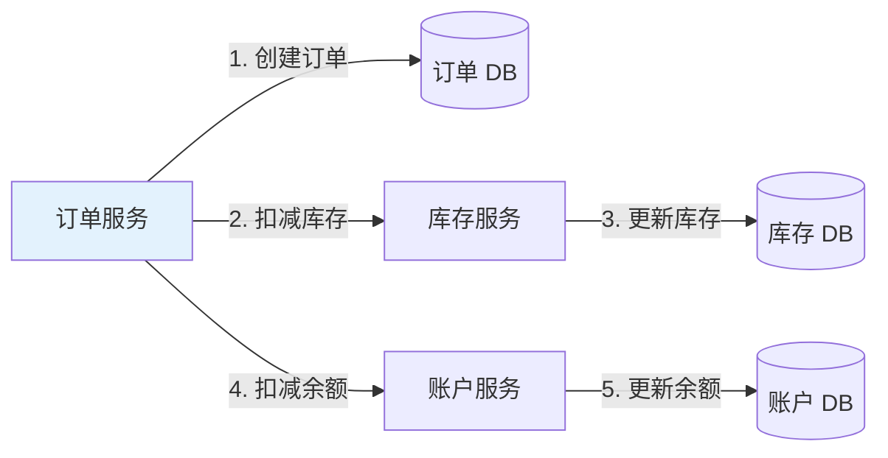
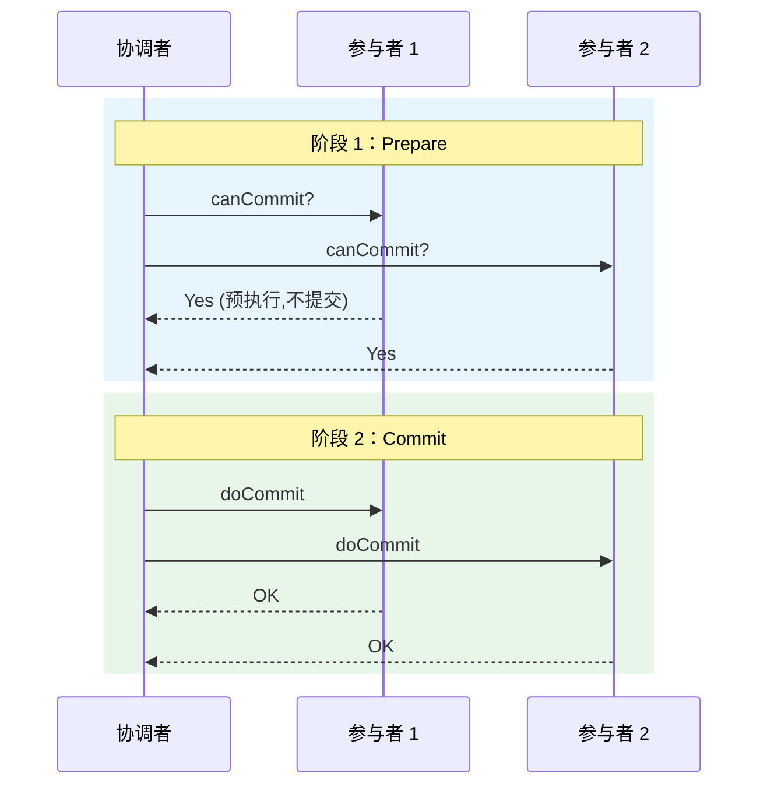
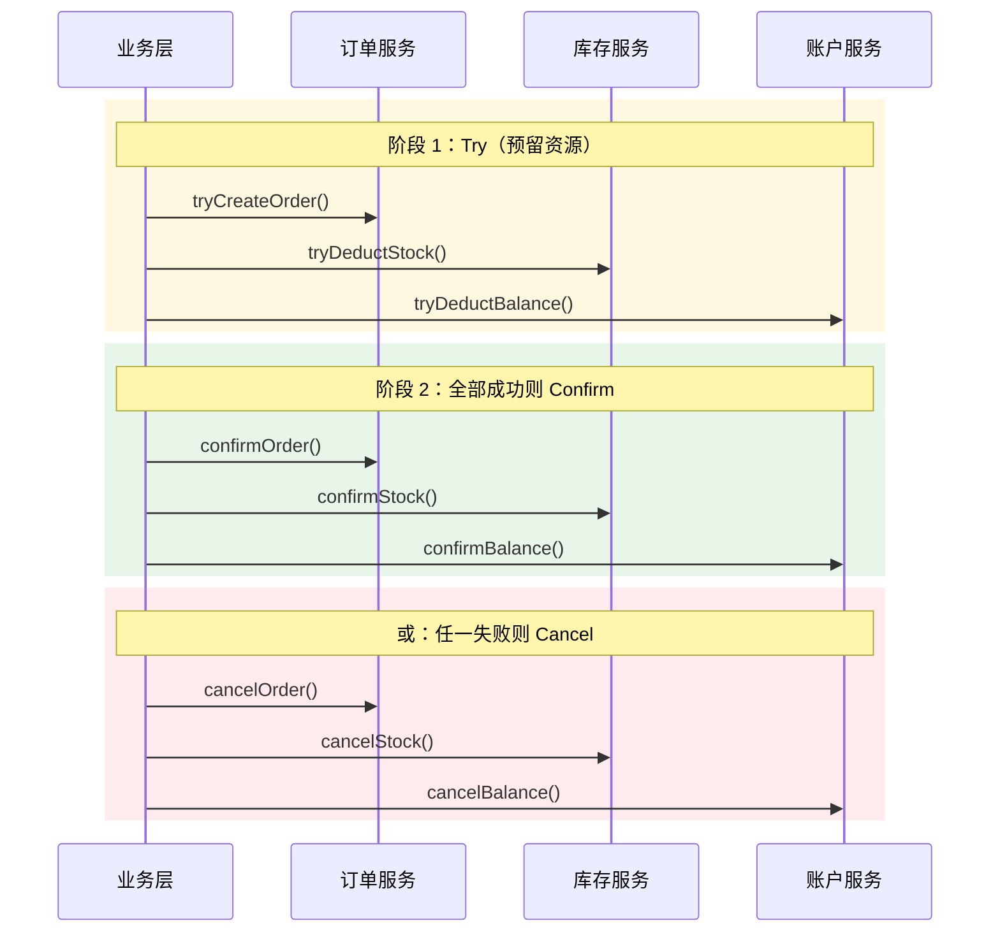
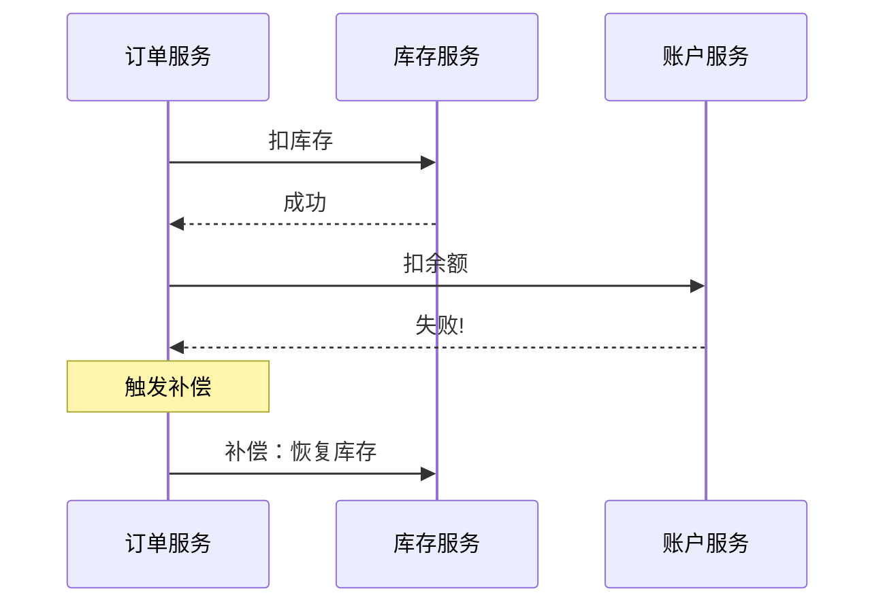
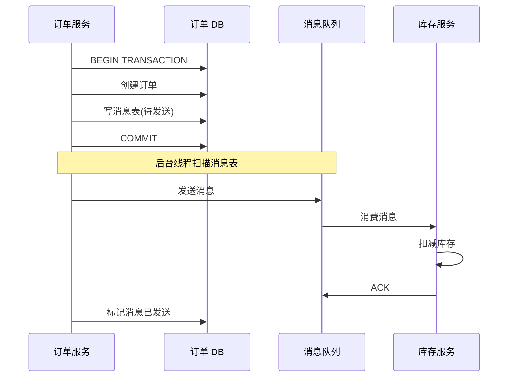
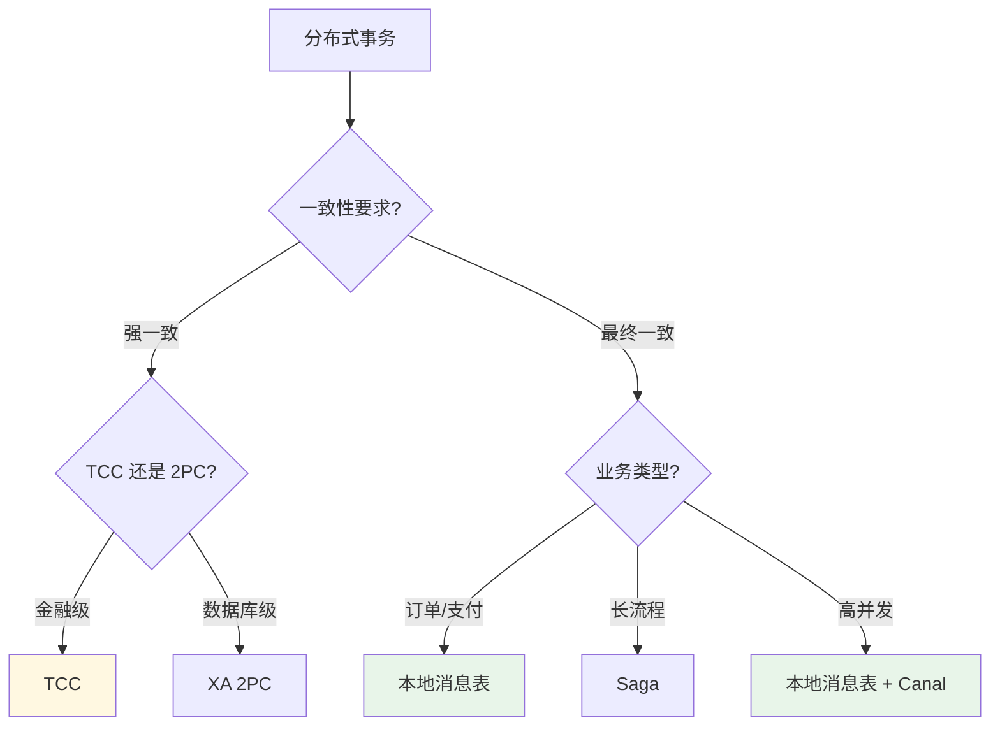

# 分布式事务

> 一句话：**2PC / TCC / Saga / 本地消息表 —— 4 种方案的取舍**

---

## 一、问题本质

分布式事务：**跨多个服务 / 数据库的操作，要么全部成功，要么全部失败**。



**问题**：步骤 2 成功但步骤 4 失败 → 数据不一致（订单创建、库存扣了，但余额没扣）

---

## 二、4 种方案

### 2.1 2PC（两阶段提交）



**协议**：
- **Phase 1**：协调者问所有参与者"可以提交吗？"，参与者预执行但不提交
- **Phase 2**：
  - 全部 Yes → 协调者通知 commit
  - 任一 No → 协调者通知 rollback

**致命缺陷**：
- ❌ **同步阻塞**：参与者等待协调者命令，期间无法做其他事
- ❌ **单点故障**：协调者挂了，参与者一直阻塞
- ❌ **数据不一致**：Phase 2 部分节点 commit 成功、部分失败
- ❌ **性能差**：两次网络往返 + 锁资源时间长

**适用**：**基本不用**（只适合 XA 协议的数据库层面）

---

### 2.2 TCC（Try-Confirm-Cancel）



**每个服务实现 3 个接口**：
- **Try**：预留资源（如冻结库存）
- **Confirm**：真正提交（仅在全部 Try 成功时调用）
- **Cancel**：释放预留（任一 Try 失败时调用）

```java
@TwoPhaseBusinessAction
public interface StockService {
    // Try：冻结库存
    boolean tryDeduct(String productId, int quantity);
    // Confirm：真正扣减
    boolean confirmDeduct(String productId, int quantity);
    // Cancel：解冻
    boolean cancelDeduct(String productId, int quantity);
}
```

**优点**：
- ✅ 业务层面的强一致
- ✅ 性能比 2PC 好（无长事务锁）

**缺点**：
- ❌ **代码侵入性大**：每个服务实现 3 个接口
- ❌ **开发成本高**：3-5 倍工作量
- ❌ **需要处理悬挂、空回滚、幂等**

**适用**：**金融、交易等强一致场景**

---

### 2.3 Saga



**思想**：长事务拆成多个短事务，每个短事务有对应的**补偿操作**。失败时**反向执行已完成事务的补偿**。

```
T1: 创建订单  →  补偿：取消订单
T2: 扣减库存  →  补偿：恢复库存
T3: 扣减余额  →  补偿：恢复余额

执行顺序：T1 → T2 → T3
如果 T3 失败：补偿 T2 → 补偿 T1
```

**编排方式**：
- **协同式（Choreography）**：事件驱动，每个服务监听其他服务事件
- **编排式（Orchestration）**：中央协调器指挥各服务

**优点**：
- ✅ 性能好（无长事务）
- ✅ 代码侵入相对小

**缺点**：
- ❌ **最终一致**（中间状态可见）
- ❌ **隔离性差**（其他事务可能读到中间状态）
- ❌ **补偿逻辑复杂**

**适用**：互联网业务（订单、支付、物流）

---

### 2.4 本地消息表（最实用）



**核心思想**：**本地事务 + 消息队列**，通过消息队列实现最终一致。

```java
@Transactional
public void createOrder(Order order) {
    // 1. 本地事务：写订单
    orderMapper.insert(order);
    
    // 2. 本地事务：写消息表
    messageMapper.insert(new Message(
        orderId, "DEDUCT_STOCK", 
        JsonUtil.toJson(new StockCmd(order))
    ));
}

// 后台定时任务扫描消息表发送 MQ
@Scheduled
public void sendMessages() {
    List<Message> msgs = messageMapper.selectPending();
    for (Message msg : msgs) {
        mqProducer.send(msg.getTopic(), msg.getBody());
        messageMapper.markSent(msg.getId());
    }
}
```

**优化版**：Canal 监听 Binlog 代替消息表

```
业务写 DB → Binlog → Canal → MQ → 下游服务
```

**优点**：
- ✅ 实现简单
- ✅ 业务无侵入（Canal 方案）
- ✅ 最终一致

**缺点**：
- ❌ 最终一致（非强一致）
- ❌ 需要处理消息重复（幂等）
- ❌ 延迟（几秒）

**适用**：**大多数互联网业务**（订单、优惠券、积分）

---

## 三、方案对比

| 方案 | 一致性 | 性能 | 代码侵入 | 复杂度 | 适用 |
|------|--------|------|---------|--------|------|
| **2PC** | 强一致 | ❌ 差 | 无 | 中 | 几乎不用 |
| **TCC** | 强一致 | ⭐⭐⭐ 中 | ❌ 大 | 高 | 金融交易 |
| **Saga** | 最终一致 | ⭐⭐⭐⭐ 好 | 中 | 中 | 长流程业务 |
| **本地消息表** | 最终一致 | ⭐⭐⭐⭐⭐ 优 | ✅ 小 | 低 | **互联网主流** |

---

## 四、选型决策树



---

## 五、框架推荐

| 框架 | 支持 | 适用 |
|------|------|------|
| **Seata**（阿里） | AT / TCC / Saga / XA | Java 生态首选 |
| **Hmily** | TCC / RPC | TCC 专项 |
| **RocketMQ 事务消息** | 本地消息表 | RocketMQ 用户 |
| **Camunda / Flowable** | Saga 编排 | 工作流场景 |

---

## 六、面试话术（30 秒版）

> "分布式事务 4 种方案：
>
> 1. **2PC**：强一致但性能差、同步阻塞，**实际不用**
> 2. **TCC**：Try-Confirm-Cancel，强一致但代码侵入大，**金融场景用**
> 3. **Saga**：长事务拆分 + 补偿，最终一致，**长流程业务用**
> 4. **本地消息表**：本地事务 + MQ，最终一致，**互联网主流**
>
> **选型**：
> - 强一致（金融）→ **TCC**
> - 最终一致（互联网）→ **本地消息表**（或 Canal 监听 Binlog）
> - 长流程（订单 / 物流）→ **Saga**
>
> **框架**：Seata（阿里）支持 AT/TCC/Saga/XA 四种模式，Java 项目首选。
>
> **核心取舍**：一致性 vs 性能 vs 复杂度，**没有银弹**。"

---

## 七、交叉引用

- 主模块：[`04.system-design`](../../../04.system-design/) — 系统设计
- [缓存一致性](../../high-performance/cache-consistency/README.md) — 缓存与数据库一致性方案
