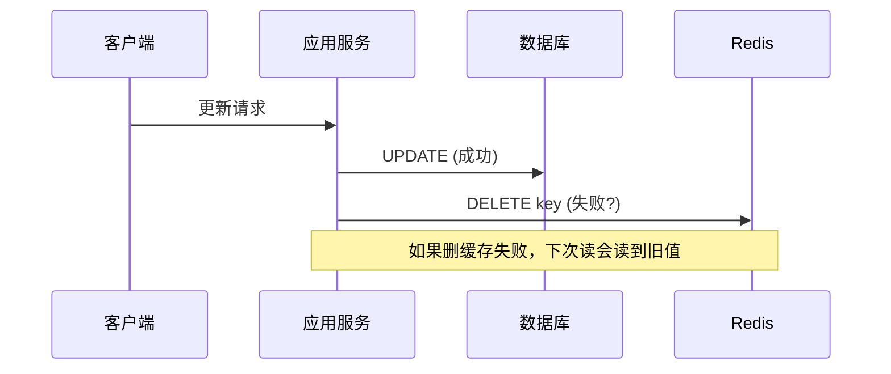
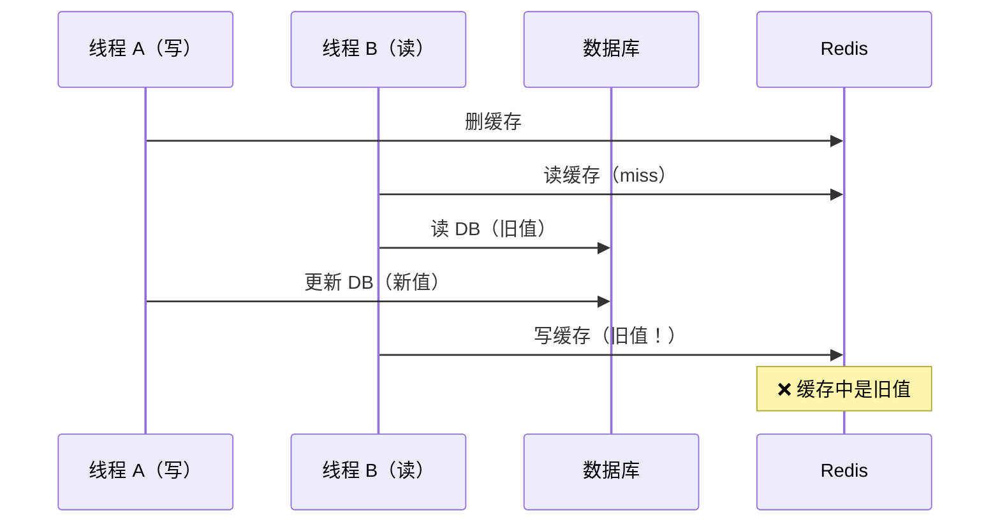
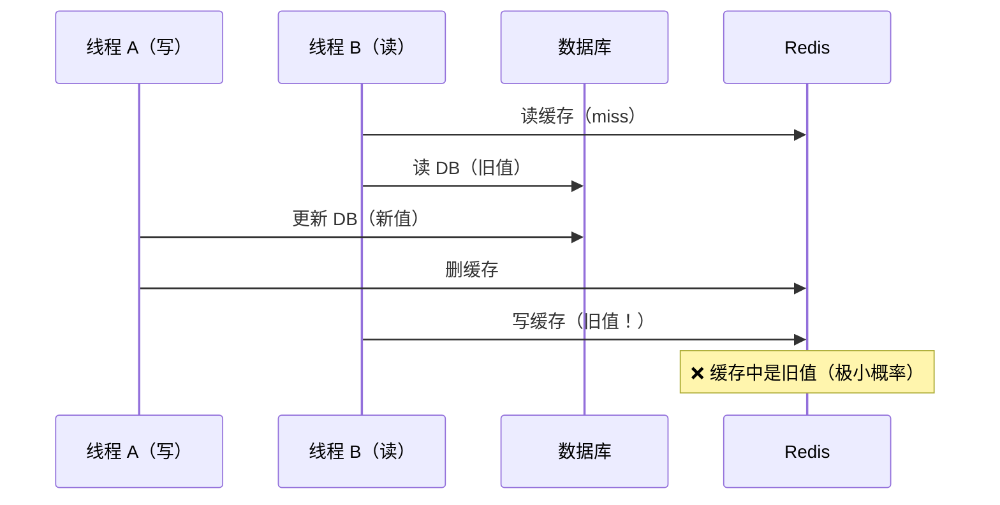
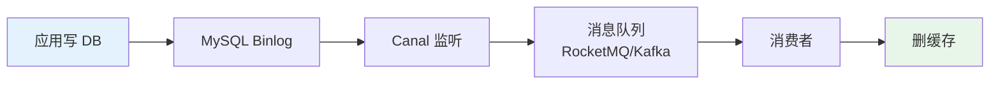

# 缓存与数据库双写一致性

## 引子：改了数据库，缓存还是旧数据

```java
// 更新用户信息
userMapper.update(user);     // ① 更新数据库
redis.del("user:" + userId); // ② 删除缓存

// 如果第 ② 步失败了？
// 数据库是新数据，缓存还是旧数据 → 不一致！
```

缓存是数据库的"影子"。数据更新时，两者必须保持一致。

但问题是：**数据库和缓存是两个独立的存储，无法原子更新**。必然存在短暂的不一致窗口。

怎么把这个窗口压到最小？

---

> 📚 **前置知识**：[Redis](../../03.database/07-redis/README.md)

## 一、核心问题

缓存是 DB 的"影子"，数据更新时必须保持两者一致。但缓存和 DB 是**两个独立存储**，无法原子更新 —— **必然存在短暂的不一致窗口**。

### 4 种更新策略对比

| 策略 | 操作顺序 | 一致性 | 问题 |
|------|---------|--------|------|
| **Cache Aside**（旁路缓存） | 先更新 DB，再删缓存 | ✅ 最终一致 | 删缓存失败 |
| Read Through | 读时由缓存层加载 | ✅ 一致 | 写操作复杂 |
| Write Through | 写时由缓存层同步写 DB | ✅ 强一致 | 写延迟高 |
| Write Behind | 写时只写缓存，异步写 DB | ⚠️ 可能丢数据 | 宕机丢数据 |

**业界共识**：**Cache Aside + 先更新 DB 再删缓存** 是主流方案。

---

## 二、先更新 DB 再删缓存



### 为什么"删缓存"而不是"更新缓存"？

**更新缓存的问题**：
1. 并发写入时可能覆盖（A 更新为 10，B 更新为 20，缓存可能被 A 覆盖成 10）
2. 计算成本高（如缓存是聚合计算结果）
3. 缓存可能还没被访问就更新了，浪费

**删缓存的优势**：
1. 懒加载（下次读时再计算，避免无效更新）
2. 避免并发覆盖问题
3. 实现简单

---

## 三、三种"不一致"场景

### 场景 1：删除缓存失败

```
1. 更新 DB 成功
2. 删缓存失败（网络抖动 / Redis 宕机）
3. 下次读到旧数据 → 不一致
```

**解决方案**：重试机制（消息队列异步重试）

### 场景 2：先删缓存后更新 DB（错误做法）



**结论**：**绝对不要"先删缓存后更新 DB"**。

### 场景 3：先更新 DB 再删缓存的极端情况



**发生条件**：读操作慢于写操作（几乎不会发生，因为 DB 读比 Redis 写慢得多）

---

## 四、解决方案

### 方案 A：延迟双删

```java
public void updateData(Data data) {
    // 1. 先删缓存
    redis.del(key);
    
    // 2. 更新 DB
    db.update(data);
    
    // 3. 延迟 N 毫秒再删一次
    Thread.sleep(500);  // 或异步
    redis.del(key);
}
```

**原理**：第二次删除覆盖"场景 3"中可能写入的旧值。

**延迟时间**：建议 `读请求耗时 + 几百毫秒`。

**缺点**：
- 同步延迟影响接口性能
- 异步延迟需要消息队列

### 方案 B：基于 Binlog 监听（推荐）



```java
// Canal 消费者
@RocketMQMessageListener(topic = "cache-sync")
public class CacheSyncConsumer {
    public void onMessage(BinlogMessage msg) {
        if (msg.isUpdate() || msg.isDelete()) {
            redis.del(buildKey(msg));
        }
    }
}
```

**优点**：
- ✅ 业务代码无侵入
- ✅ 保证最终一致
- ✅ 可重试（消息队列）

**缺点**：
- 引入额外组件（Canal + MQ）
- 有几秒延迟

**工具**：Canal（阿里开源）、Debezium、mysql-cdc-connector

### 方案 C：订阅 key 过期事件（兜底）

```
设置缓存 TTL → key 过期自动删除 → 下次读从 DB 加载
```

**优点**：无需额外机制
**缺点**：TTL 期间数据不一致

---

## 五、选型决策

| 场景 | 推荐方案 |
|------|---------|
| **读多写少 + 容忍短暂不一致** | Cache Aside + TTL 兜底 |
| **强一致性要求** | 延迟双删 + 短 TTL |
| **大型企业级** | Canal + MQ（最终一致） |
| **金融/支付** | 避免缓存，直读 DB |

---

## 六、面试话术（30 秒版）

> "缓存与 DB 一致性是经典问题。主流方案是 **Cache Aside：先更新 DB，再删缓存**。
>
> 不一致场景主要有 3 种：
> 1. 删缓存失败 → 重试机制
> 2. 先删缓存后更新 DB → **绝对避免**
> 3. 读写并发导致旧值入缓存 → 延迟双删或 Binlog 监听
>
> **生产方案**：
> - 中小项目：Cache Aside + TTL 兜底
> - 大型企业：**Canal 监听 Binlog + MQ 异步删缓存**，业务无侵入
> - 强一致场景：避免缓存，直读 DB
>
> 本质上，**缓存一致性是最终一致**，无法做到强一致，只能在延迟和复杂度间权衡。"

---

## 七、交叉引用

- 主模块：[`03.database`](../../../03.database/) — 数据库与缓存
- [缓存穿透/击穿/雪崩](../../../../03.database/06-cache/README.md) — 缓存设计模式与问题解决方案
- [分布式事务](../../distributed/distributed-transaction/README.md) — 跨服务一致性方案

## 相关章节

- 深度阅读：[`04.system-design`](../../../04.system-design/README.md) — 主模块详细内容
