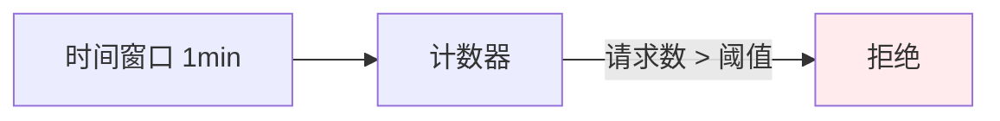
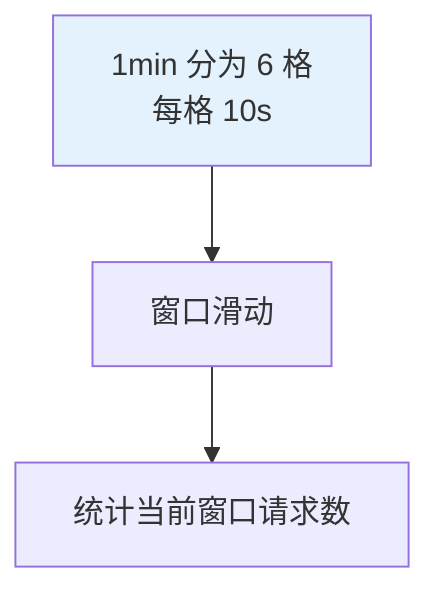
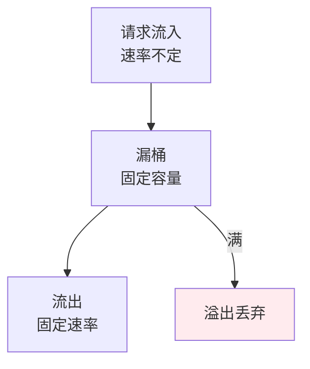
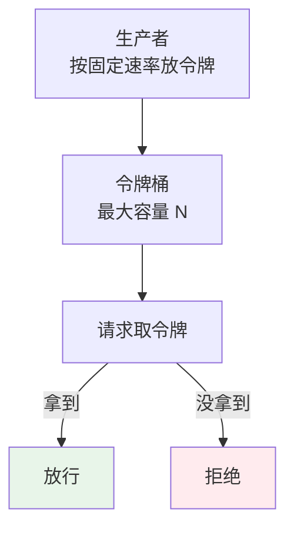
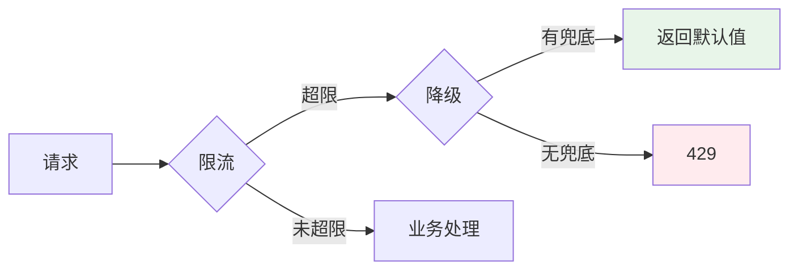

# 限流算法

## 引子：秒杀活动，10 万 QPS 涌进来

```
服务器容量：1000 QPS
实际请求：10 万 QPS

不处理 → 服务器被打垮，所有用户都受影响
```

怎么办？**限流**——超过承受能力的请求，要么拒绝，要么排队。

4 种限流算法，各有适用场景：
- **计数器**：简单粗暴，但有"临界突刺"问题
- **滑动窗口**：更平滑，但实现稍复杂
- **漏桶**：恒定速率，适合平滑流量
- **令牌桶**：允许突发，最常用

---

## 一、为什么需要限流

**限流目的**：保护系统在高并发下不被打垮，通过**控制请求速率**确保服务可用性。

**触发场景**：
- 秒杀 / 抢购
- API 防刷
- 下游服务保护
- 资源配额控制

---

## 二、4 种限流算法

### 2.1 固定计数器



```java
// 1 分钟内最多 100 次请求
AtomicInteger counter = new AtomicInteger(0);
long lastResetTime = System.currentTimeMillis();

public boolean allowRequest() {
    long now = System.currentTimeMillis();
    if (now - lastResetTime > 60_000) {
        counter.set(0);
        lastResetTime = now;
    }
    return counter.incrementAndGet() <= 100;
}
```

**致命缺陷**：**临界突刺问题**
- 0:59 进来 100 个请求
- 1:00 又来 100 个请求
- 1 秒内处理了 200 个，超过 100/min 的限制

### 2.2 滑动窗口



```java
// 1 分钟窗口，分成 6 个 10 秒的格子
long[] window = new long[6];
int cursor = 0;

public boolean allowRequest() {
    long now = System.currentTimeMillis();
    int index = (int) ((now / 10_000) % 6);
    
    if (index != cursor) {
        window[index] = 0;
        cursor = index;
    }
    
    long total = Arrays.stream(window).sum();
    if (total >= 100) return false;
    
    window[index]++;
    return true;
}
```

**优点**：解决临界突刺
**缺点**：格子越多越精确，内存开销越大

### 2.3 漏桶（Leaky Bucket）



**特点**：
- 流入速率任意
- **流出速率固定**（平滑流量）
- 桶满则丢弃

**适用**：需要**匀速处理**的场景（如消息队列消费）

**不适用**：允许突发但总体限流的场景

### 2.4 令牌桶（Token Bucket）⭐



**特点**：
- 按**固定速率生成令牌**（如 10 个/秒）
- 桶有**最大容量**（如 100 个）
- 每个请求取 1 个令牌，**无令牌则拒绝**
- **允许突发**：桶满时可一次处理 N 个

**为什么是主流？**
- ✅ 允许突发流量（突发但不超过桶容量）
- ✅ 长期平均速率可控
- ✅ 实现简单，性能好

---

## 三、算法对比

| 算法 | 平滑性 | 允许突发 | 实现复杂度 | 适用 |
|------|--------|---------|----------|------|
| **固定计数器** | ❌ 临界突刺 | ❌ | ⭐ 简单 | 粗粒度限流 |
| **滑动窗口** | ✅ 平滑 | ❌ | ⭐⭐ 中 | 精确控制 |
| **漏桶** | ✅ 匀速 | ❌ | ⭐⭐ 中 | 匀速处理 |
| **令牌桶** | ⚠️ 半平滑 | ✅ | ⭐⭐ 中 | **主流选择** |

---

## 四、生产实现

### Guava RateLimiter（单机令牌桶）

```java
// 每秒最多 10 个请求
RateLimiter limiter = RateLimiter.create(10);

public Response handleRequest() {
    if (!limiter.tryAcquire()) {
        return Response.status(429).build();  // Too Many Requests
    }
    return doBusiness();
}
```

### Sentinel（阿里开源，推荐）

```java
// 流控规则
FlowRule rule = new FlowRule();
rule.setResource("api/user");
rule.setGrade(RuleConstant.FLOW_GRADE_QPS);  // QPS 模式
rule.setCount(100);  // 100 QPS
rule.setControlBehavior(RuleConstant.CONTROL_BEHAVIOR_RATE_LIMITER);  // 匀速排队

// 业务代码
Entry entry = null;
try {
    entry = SphU.entry("api/user");
    // 业务逻辑
} catch (BlockException e) {
    // 被限流
} finally {
    if (entry != null) entry.exit();
}
```

### Redis 分布式限流（Lua 脚本 + 滑动窗口）

```lua
-- 滑动窗口限流 Lua
local key = KEYS[1]
local limit = tonumber(ARGV[1])
local window = tonumber(ARGV[2])
local now = tonumber(ARGV[3])

-- 移除窗口外的记录
redis.call('ZREMRANGEBYSCORE', key, 0, now - window)

-- 统计当前窗口请求数
local count = redis.call('ZCARD', key)

if count >= limit then
    return 0  -- 拒绝
end

-- 记录当前请求
redis.call('ZADD', key, now, now .. math.random())
redis.call('PEXPIRE', key, window)
return 1  -- 放行
```

---

## 五、限流维度

| 维度 | 例子 |
|------|------|
| **用户级** | 每个用户 100 次/分钟 |
| **IP 级** | 每个 IP 1000 次/小时 |
| **接口级** | `/api/order` 1000 QPS |
| **服务级** | 订单服务 10000 QPS |
| **全局级** | 整个系统 100000 QPS |

---

## 六、降级与限流的配合



**限流 + 降级**：超限时返回降级数据（缓存、默认值），而不是错误。

---

## 七、面试话术（30 秒版）

> "限流 4 种算法：
>
> 1. **固定计数器**：简单但有临界突刺问题
> 2. **滑动窗口**：解决突刺，格子越多越精确
> 3. **漏桶**：匀速流出，不允许突发
> 4. **令牌桶**：**主流**，按固定速率生成令牌，允许突发
>
> **选型**：大多数场景用**令牌桶**（Guava RateLimiter / Sentinel）。需要匀速处理用漏桶。
>
> **生产方案**：
> - 单机：Guava RateLimiter
> - 分布式：Sentinel 集群 / Redis + Lua 滑动窗口
>
> **限流维度**：用户 / IP / 接口 / 服务 / 全局 5 个层次。
>
> **配套措施**：限流 + 降级（返回默认值）+ 熔断（失败率阈值）。"

---

## 八、交叉引用

- 主模块：[`04.system-design`](../../../04.system-design/) — 系统设计
- 相关：[`13.split-hairs/04.system-design/high-performance/distributed-lock/`](../distributed-lock/) — 分布式锁（与限流配合）
- 待补：熔断、降级详解
